# Phần 14 — Amazon S3 Security

> Khóa học: *Ultimate AWS Certified Solutions Architect Associate 2026* (Stéphane Maarek) — SAA-C03
> Nguồn tham chiếu: `AWS Certified Solutions Architect Slides v48.pdf` (phần "Amazon S3 – Security")
> Code kèm theo: `code_v2025-10-27/s3/` (`CORS_CONFIG.json`, `index-with-fetch.html`, `extra-page.html`)

---

## Mục lục

| # | Bài giảng | Thời lượng | Loại |
|---|-----------|-----------|------|
| 151 | [S3 Encryption](#151-s3-encryption) | 8 phút | Video |
| 152 | [About DSSE-KMS](#152-about-dsse-kms) | 1 phút | Bài viết |
| 153 | [S3 Encryption - Hands On](#153-s3-encryption---hands-on) | 5 phút | Video |
| 154 | [S3 Default Encryption](#154-s3-default-encryption) | 1 phút | Video |
| 155 | [S3 CORS](#155-s3-cors) | 4 phút | Video |
| 156 | [S3 CORS Hands On](#156-s3-cors-hands-on) | 7 phút | Video |
| 157 | [S3 MFA Delete](#157-s3-mfa-delete) | 1 phút | Video |
| 158 | [S3 MFA Delete Hands On](#158-s3-mfa-delete-hands-on) | 6 phút | Video |
| 159 | [S3 Access Logs](#159-s3-access-logs) | 1 phút | Video |
| 160 | [S3 Access Logs - Hands On](#160-s3-access-logs---hands-on) | 4 phút | Video |
| 161 | [S3 Pre-signed URLs](#161-s3-pre-signed-urls) | 2 phút | Video |
| 162 | [S3 Pre-signed URLs - Hands On](#162-s3-pre-signed-urls---hands-on) | 2 phút | Video |
| 163 | [Glacier Vault Lock & S3 Object Lock](#163-glacier-vault-lock--s3-object-lock) | 4 phút | Video |
| 164 | [S3 Access Points](#164-s3-access-points) | 4 phút | Video |
| 165 | [S3 Object Lambda](#165-s3-object-lambda) | 3 phút | Video |
| — | [Trắc nghiệm 11: Amazon S3 Security Quiz](#trắc-nghiệm-11-amazon-s3-security-quiz) | — | Quiz |

---

## 151. S3 Encryption

### Amazon S3 — Object Encryption ⭐⭐⭐

> ⭐⭐ **Bạn có thể mã hóa object trong S3 bucket bằng MỘT TRONG 4 PHƯƠNG PHÁP**

### 🔹 Server-Side Encryption (SSE) — 3 loại

| # | Phương pháp | Mô tả |
|---|------------|-------|
| 1 | ⭐⭐ **SSE-S3** — Server-Side Encryption with **Amazon S3-Managed Keys** — ⭐ **BẬT MẶC ĐỊNH (Enabled by Default)** | **Mã hóa object S3 bằng key được AWS xử lý, quản lý và SỞ HỮU** |
| 2 | ⭐⭐ **SSE-KMS** — Server-Side Encryption with **KMS Keys stored in AWS KMS** | **Tận dụng AWS Key Management Service (AWS KMS) để quản lý encryption key** |
| 3 | ⭐⭐ **SSE-C** — Server-Side Encryption with **Customer-Provided Keys** | **Khi bạn muốn TỰ QUẢN LÝ encryption key của mình** |

### 🔹 Client-Side Encryption

| # | Phương pháp | Mô tả |
|---|------------|-------|
| 4 | ⭐⭐ **Client-Side Encryption** | Client tự mã hóa trước khi gửi |

> ⭐⭐⭐ **"Điều quan trọng là phải hiểu phương pháp nào dùng cho tình huống nào — CHO KỲ THI"** (nguyên văn slide).

---

### 1️⃣ SSE-S3 ⭐⭐

- ⭐ **Mã hóa bằng key được AWS XỬ LÝ, QUẢN LÝ và SỞ HỮU**
- ⭐ **Object được mã hóa PHÍA SERVER (server-side)**
- ⭐⭐ **Loại mã hóa là AES-256**
- ⭐⭐ **PHẢI set header: `"x-amz-server-side-encryption": "AES256"`**
- ⭐⭐ **BẬT MẶC ĐỊNH cho bucket mới & object mới**

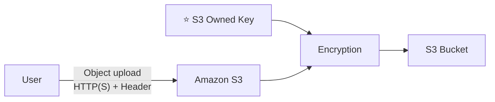

---

### 2️⃣ SSE-KMS ⭐⭐

- ⭐ **Mã hóa bằng key được XỬ LÝ và QUẢN LÝ bởi AWS KMS (Key Management Service)**
- ⭐⭐ **Ưu điểm của KMS: NGƯỜI DÙNG KIỂM SOÁT (user control) + KIỂM TOÁN việc dùng key qua CloudTrail**
- ⭐ **Object được mã hóa phía server**
- ⭐⭐ **PHẢI set header: `"x-amz-server-side-encryption": "aws:kms"`**

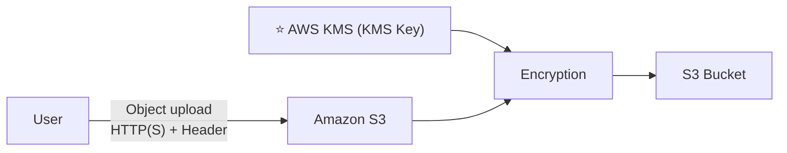

---

### ⭐⭐⭐ SSE-KMS Limitation (RẤT hay ra thi)

- ⭐⭐ **Nếu dùng SSE-KMS, bạn CÓ THỂ BỊ ẢNH HƯỞNG bởi các GIỚI HẠN CỦA KMS**
- ⭐⭐ **Khi UPLOAD, nó gọi API `GenerateDataKey` của KMS**
- ⭐⭐ **Khi DOWNLOAD, nó gọi API `Decrypt` của KMS**
- ⭐⭐ **Tính vào KMS QUOTA MỖI GIÂY (5,500 / 10,000 / 30,000 req/s tùy Region)**
- ⭐ **Bạn có thể YÊU CẦU TĂNG QUOTA dùng Service Quotas Console**

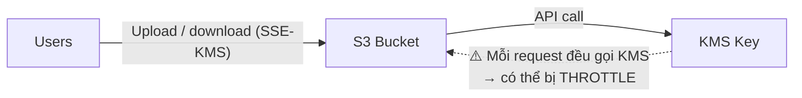

> ⭐⭐ **Bẫy thi kinh điển:** Đề mô tả *"ứng dụng bị throttle khi đọc/ghi nhiều object mã hóa"* → nguyên nhân là **KMS quota limit** → giải pháp: **yêu cầu tăng quota** hoặc **chuyển sang SSE-S3**.

---

### 3️⃣ SSE-C ⭐⭐

- ⭐ **Server-Side Encryption dùng key được KHÁCH HÀNG QUẢN LÝ HOÀN TOÀN, BÊN NGOÀI AWS**
- ⭐⭐ **Amazon S3 KHÔNG LƯU TRỮ encryption key mà bạn cung cấp**
- ⭐⭐ **BẮT BUỘC phải dùng HTTPS**
- ⭐⭐ **Encryption key PHẢI được cung cấp trong HTTP HEADERS, CHO MỖI HTTP REQUEST**

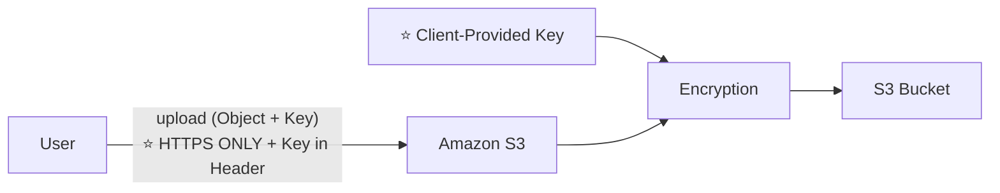

> ⚠️ ⭐⭐ **Không dùng được qua AWS Console** — phải dùng **CLI/SDK** vì cần đặt header thủ công.

---

### 4️⃣ Client-Side Encryption ⭐⭐

- ⭐ **Dùng các thư viện client như Amazon S3 Client-Side Encryption Library**
- ⭐⭐ **Client PHẢI TỰ MÃ HÓA dữ liệu TRƯỚC KHI gửi tới Amazon S3**
- ⭐⭐ **Client PHẢI TỰ GIẢI MÃ dữ liệu khi lấy về từ Amazon S3**
- ⭐⭐ **Khách hàng QUẢN LÝ HOÀN TOÀN key và chu trình mã hóa**

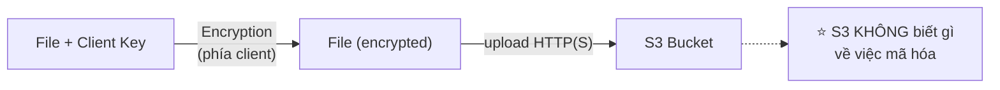

---

### ⭐⭐⭐ BẢNG SO SÁNH 4 PHƯƠNG PHÁP (quan trọng nhất phần này)

| | **SSE-S3** | **SSE-KMS** | **SSE-C** | **Client-Side** |
|---|---|---|---|---|
| **Ai quản lý key** | ⭐ **AWS (sở hữu)** | ⭐ **AWS KMS** (bạn kiểm soát) | ⭐ **KHÁCH HÀNG** (ngoài AWS) | ⭐ **KHÁCH HÀNG hoàn toàn** |
| **Mã hóa ở đâu** | Server-side | Server-side | Server-side | ⭐ **CLIENT-side** |
| **S3 lưu key?** | ✅ Có | ✅ Có (trong KMS) | ❌ ⭐ **KHÔNG** | ❌ Không |
| **Header bắt buộc** | `"x-amz-server-side-encryption": "AES256"` | `"x-amz-server-side-encryption": "aws:kms"` | ⭐ **Key trong header MỖI request** | — |
| **HTTPS bắt buộc** | Không | Không | ✅ ⭐ **CÓ** | Không |
| **Audit qua CloudTrail** | ❌ | ✅ ⭐ **CÓ** | ❌ | ❌ |
| **Bị giới hạn quota** | ❌ | ⚠️ ⭐ **CÓ (KMS quota)** | ❌ | ❌ |
| **Dùng qua Console** | ✅ | ✅ | ❌ ⭐ **CLI/SDK only** | ❌ |
| **Mặc định** | ⭐ **BẬT SẴN** | — | — | — |

### ⭐⭐ Cheat sheet chọn phương pháp

| Từ khóa trong đề | Đáp án |
|------------------|--------|
| "đơn giản nhất", "mặc định", "không cần quản lý key" | ⭐ **SSE-S3** |
| "cần **KIỂM SOÁT** key, **AUDIT** việc dùng key" | ⭐⭐ **SSE-KMS** |
| "bị **throttle**, gặp **quota limit**" | ⚠️ **SSE-KMS** (vấn đề) → chuyển **SSE-S3** |
| "key được quản lý **BÊN NGOÀI AWS**, S3 không lưu key" | ⭐⭐ **SSE-C** |
| "dữ liệu phải được mã hóa **TRƯỚC KHI** rời khỏi máy client" | ⭐⭐ **Client-Side Encryption** |

---

### ⭐⭐ Amazon S3 — Encryption in transit (SSL/TLS)

- ⭐ **Mã hóa khi truyền còn được gọi là SSL/TLS**
- ⭐⭐ **Amazon S3 đưa ra HAI endpoint:**
  - ⭐ **HTTP Endpoint — KHÔNG mã hóa**
  - ⭐ **HTTPS Endpoint — mã hóa khi truyền (encryption in flight)**
- ⭐ **HTTPS được KHUYẾN NGHỊ**
- ⭐⭐ **HTTPS là BẮT BUỘC cho SSE-C**
- ⭐ **Hầu hết client dùng HTTPS endpoint theo mặc định**

---

### ⭐⭐⭐ Amazon S3 — Force Encryption in Transit: `aws:SecureTransport`

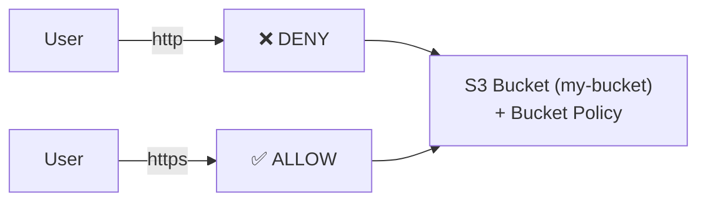

Bucket Policy ép buộc HTTPS:

```json
{
  "Version": "2012-10-17",
  "Statement": [
    {
      "Sid": "DenyInsecureTransport",
      "Effect": "Deny",
      "Principal": "*",
      "Action": "s3:*",
      "Resource": [
        "arn:aws:s3:::my-bucket",
        "arn:aws:s3:::my-bucket/*"
      ],
      "Condition": {
        "Bool": { "aws:SecureTransport": "false" }
      }
    }
  ]
}
```

> ⭐⭐ **Nhớ điều kiện `aws:SecureTransport`** — đây là cách chuẩn để **bắt buộc HTTPS** cho S3.

---

## 152. About DSSE-KMS

> Đây là bài **article** (bài viết) — giảng viên bổ sung về một phương pháp mã hóa mới.

### DSSE-KMS là gì? ⭐

- **DSSE-KMS = Dual-Layer Server-Side Encryption with AWS KMS keys**
- ⭐⭐ **Áp dụng HAI LỚP mã hóa (dual-layer) ở phía server**, cả hai đều dùng **KMS key**
- Được AWS ra mắt **tháng 6/2023**.

### Vì sao có DSSE-KMS?

- Đáp ứng yêu cầu **tuân thủ nghiêm ngặt** đòi hỏi **mã hóa nhiều lớp** — ví dụ chuẩn của **Bộ Quốc phòng Mỹ (DoD)** về **CNSSP 15**.
- Mỗi lớp dùng **AES-256**, khóa khác nhau.

### So sánh với SSE-KMS ⭐

| | **SSE-KMS** | **DSSE-KMS** |
|---|---|---|
| **Số lớp mã hóa** | **1 lớp** | ⭐ **2 lớp** |
| **Key** | KMS key | KMS key |
| **Header** | `"aws:kms"` | ⭐ `"aws:kms:dsse"` |
| **Chi phí** | Chuẩn | **Cao hơn** |
| **Use case** | Thông thường | ⭐ **Tuân thủ đặc biệt nghiêm ngặt** |

### ⚠️ Ghi chú cho kỳ thi

> ⭐ **DSSE-KMS hiếm khi xuất hiện trong đề SAA-C03.** Chỉ cần biết **nó tồn tại** và **là phiên bản 2 lớp của SSE-KMS**, dùng cho **compliance rất nghiêm ngặt**.
> Danh sách **4 phương pháp chính** ở bài 151 mới là thứ phải thuộc.

---

## 153. S3 Encryption - Hands On

### Bước 1 — Xem mã hóa mặc định của object ⭐

1. Upload một file vào bucket.
2. Chọn object → tab **Properties** → mục ⭐ **Server-side encryption settings**.
3. Quan sát: ⭐⭐ **`Server-side encryption with Amazon S3 managed keys (SSE-S3)`** — **bật sẵn mặc định**.

### Bước 2 — Đổi sang SSE-KMS ⭐

1. Chọn object → **Properties** → **Server-side encryption settings** → **Edit**.
2. Chọn ⭐ **Server-side encryption with AWS Key Management Service keys (SSE-KMS)**.
3. **AWS KMS key**:
   - ⭐ **`AWS managed key (aws/s3)`** — key mặc định của AWS cho S3
   - hoặc **Choose from your AWS KMS keys** — Customer Managed Key (CMK)
4. **Save changes**.
5. Refresh → thấy encryption type đã đổi thành **SSE-KMS**.

### Bước 3 — Chọn mã hóa lúc UPLOAD ⭐

1. **Upload** → **Add files** → mở rộng ⭐ **Properties**.
2. Mục **Server-side encryption**:
   - **Do not specify an encryption key** (dùng default encryption của bucket)
   - ⭐ **Specify an encryption key** → chọn **SSE-S3** hoặc **SSE-KMS**
3. Upload → kiểm tra lại encryption type.

### Bước 4 — ⚠️ SSE-C và Client-Side không làm được trên Console ⭐⭐

> ⭐⭐ **Console KHÔNG hỗ trợ SSE-C** — vì phải gửi key trong **HTTP header cho mỗi request**.

Muốn thử SSE-C, phải dùng **CLI**:

```bash
# Upload với SSE-C
aws s3 cp myfile.txt s3://my-bucket/myfile.txt \
  --sse-c AES256 \
  --sse-c-key fileb://key.bin

# Download với SSE-C (PHẢI cung cấp lại đúng key)
aws s3 cp s3://my-bucket/myfile.txt myfile.txt \
  --sse-c AES256 \
  --sse-c-key fileb://key.bin
```

> ⚠️ ⭐ **Mất key = mất dữ liệu vĩnh viễn** — vì S3 **không lưu key của bạn**.

### Bước 5 — Kiểm tra qua CLI

```bash
aws s3api head-object --bucket my-bucket --key coffee.jpg
```

Kết quả hiển thị:
```json
{
  "ServerSideEncryption": "aws:kms",
  "SSEKMSKeyId": "arn:aws:kms:eu-west-1:123456789012:key/xxxx"
}
```

---

## 154. S3 Default Encryption

### ⭐⭐ Amazon S3 — Default Encryption vs. Bucket Policies

- ⭐⭐ **Mã hóa SSE-S3 được TỰ ĐỘNG ÁP DỤNG cho object MỚI lưu trong S3 bucket**
- ⭐⭐ **TÙY CHỌN: bạn có thể "FORCE ENCRYPTION" bằng BUCKET POLICY và TỪ CHỐI mọi API call `PUT` object S3 mà KHÔNG CÓ encryption header (SSE-KMS hoặc SSE-C)**

### ⚠️⭐⭐⭐ Ghi chú CỰC KỲ quan trọng:

> **Bucket Policies được ĐÁNH GIÁ TRƯỚC "Default Encryption"**

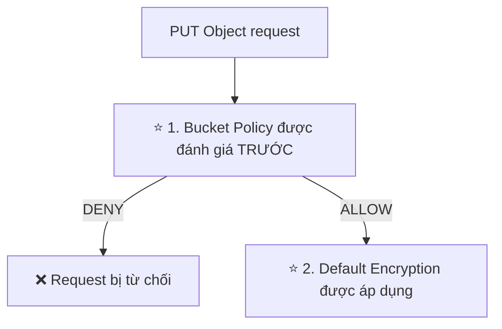

### Ví dụ Bucket Policy bắt buộc SSE-KMS

```json
{
  "Version": "2012-10-17",
  "Statement": [
    {
      "Sid": "DenyUnEncryptedObjectUploads",
      "Effect": "Deny",
      "Principal": "*",
      "Action": "s3:PutObject",
      "Resource": "arn:aws:s3:::my-bucket/*",
      "Condition": {
        "StringNotEquals": {
          "s3:x-amz-server-side-encryption": "aws:kms"
        }
      }
    }
  ]
}
```

### So sánh 2 cách ⭐

| | **Default Encryption** | **Bucket Policy (force encryption)** |
|---|---|---|
| **Cơ chế** | ⭐ **Tự động mã hóa** object không có header | ⭐ **TỪ CHỐI** request không có header |
| **Kết quả nếu thiếu header** | ✅ Object vẫn được lưu (đã mã hóa) | ❌ ⭐ **Request bị DENY** |
| **Thứ tự đánh giá** | Sau | ⭐⭐ **TRƯỚC** |
| **Dùng khi** | Muốn đảm bảo mọi thứ được mã hóa | Muốn **bắt buộc client phải chỉ định rõ** loại mã hóa |

> ⭐⭐ **Bẫy thi:** Đề hỏi *"làm sao đảm bảo mọi object upload lên đều được mã hóa bằng KMS?"* → **Bucket Policy với condition `s3:x-amz-server-side-encryption`** (vì Default Encryption chỉ áp dụng SSE-S3).

---

## 155. S3 CORS

### What is CORS? ⭐⭐⭐

- ⭐⭐ **CORS = Cross-Origin Resource Sharing**
- ⭐⭐ **Origin = scheme (protocol) + host (domain) + port**
  - **Ví dụ: `https://www.example.com`** (⭐ **port ngầm định là 443 cho HTTPS, 80 cho HTTP**)

### Định nghĩa ⭐

> ⭐⭐ **Cơ chế DỰA TRÊN TRÌNH DUYỆT WEB cho phép các request tới origin KHÁC trong khi đang truy cập origin chính**

| So sánh | Ví dụ |
|---------|-------|
| ⭐ **Same origin** | `http://example.com/app1` và `http://example.com/app2` |
| ⭐ **Different origins** | `http://www.example.com` và `http://other.example.com` |

> ⭐⭐ **Các request sẽ KHÔNG được thực hiện TRỪ KHI origin kia CHO PHÉP, bằng CORS Headers (ví dụ: `Access-Control-Allow-Origin`)**

---

### ⭐⭐⭐ Luồng hoạt động của CORS (từ slide)

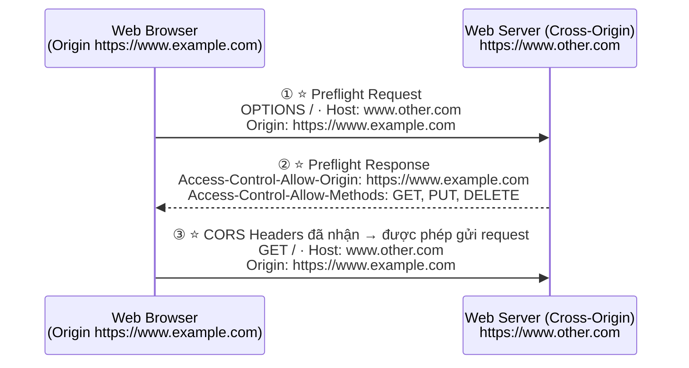

### ⭐⭐ Ba bước cần nhớ

| Bước | Tên | Nội dung |
|------|-----|----------|
| 1 | ⭐ **Preflight Request** | Trình duyệt gửi **`OPTIONS`** kèm header **`Origin`** |
| 2 | ⭐ **Preflight Response** | Server trả về **`Access-Control-Allow-Origin`** và **`Access-Control-Allow-Methods`** |
| 3 | ⭐ **Request thật** | Chỉ khi bước 2 cho phép, trình duyệt mới gửi `GET`/`PUT`/… |

---

### ⭐⭐⭐ Amazon S3 — CORS

- ⭐⭐ **Nếu một client thực hiện cross-origin request lên S3 bucket của chúng ta, ta CẦN BẬT CORS HEADERS ĐÚNG**
- ⭐⭐⭐ **"ĐÂY LÀ CÂU HỎI THI PHỔ BIẾN" (It's a popular exam question)** — nguyên văn slide!
- ⭐ **Bạn có thể cho phép MỘT ORIGIN CỤ THỂ hoặc `*` (TẤT CẢ origin)**

### Sơ đồ ví dụ 2 bucket (từ slide)

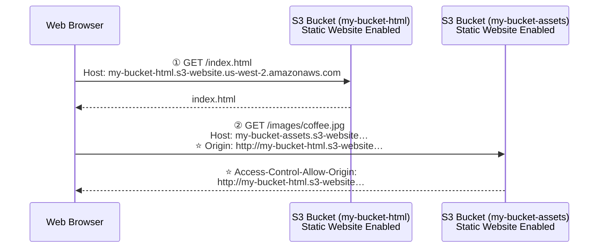

### File cấu hình CORS của khóa học ⭐

Nội dung `code_v2025-10-27/s3/CORS_CONFIG.json`:

```json
[
    {
        "AllowedHeaders": [
            "Authorization"
        ],
        "AllowedMethods": [
            "GET"
        ],
        "AllowedOrigins": [
            "<url of first bucket with http://...without slash at the end>"
        ],
        "ExposeHeaders": [],
        "MaxAgeSeconds": 3000
    }
]
```

### Giải thích từng trường ⭐

| Trường | Ý nghĩa |
|--------|---------|
| ⭐ **`AllowedHeaders`** | Header nào được phép gửi kèm trong request |
| ⭐ **`AllowedMethods`** | **`GET`, `PUT`, `POST`, `DELETE`, `HEAD`** |
| ⭐⭐ **`AllowedOrigins`** | **URL của origin được phép** — ⚠️ **có `http://`, KHÔNG có dấu `/` ở cuối** |
| **`ExposeHeaders`** | Header nào client đọc được từ response |
| **`MaxAgeSeconds`** | Thời gian trình duyệt cache kết quả preflight |

> ⚠️ ⭐⭐ **Lỗi phổ biến nhất:** ghi `AllowedOrigins` **có dấu `/` ở cuối** hoặc **thiếu `http://`** → CORS không hoạt động.

---

## 156. S3 CORS Hands On

### Mục tiêu

Tạo **2 bucket static website**: bucket A chứa `index.html` gọi `fetch()` sang bucket B để lấy `extra-page.html`.

### Bước 1 — Tạo bucket thứ nhất (HTML)

1. Tạo bucket `demo-cors-html-<tên>` → **tắt Block Public Access**.
2. Thêm **Bucket Policy** cho public read (như bài 132).
3. Bật **Static website hosting** → index document `index.html`.
4. Upload file ⭐ **`index-with-fetch.html`** (đổi tên thành `index.html`) và `coffee.jpg`.

Nội dung `code_v2025-10-27/s3/index-with-fetch.html`:

```html
<html>
    <head>
        <title>My First Webpage</title>
    </head>
    <body>
        <h1>I love coffee</h1>
        <p>Hello world!</p>
    </body>

    

    <!-- CORS demo -->
    <div id="tofetch"/>
    <script>
        var tofetch = document.getElementById("tofetch");

        fetch('http://<bucket URL>/extra-page.html')
        .then((response) => { 
            return response.text();
        })
        .then((html) => {
            tofetch.innerHTML = html     
        });
    </script>
</html>
```

> ⚠️ ⭐ **Phải thay `<bucket URL>` bằng website endpoint của bucket thứ hai** (có `http://`, không có `/` cuối).

### Bước 2 — Tạo bucket thứ hai (Assets)

1. Tạo bucket `demo-cors-assets-<tên>` → **tắt Block Public Access** → **Bucket Policy public read**.
2. Bật **Static website hosting**.
3. Upload file ⭐ **`extra-page.html`**:

```html
<p>This <strong>extra page</strong> has been successfully loaded!</p>
```

### Bước 3 — ⭐⭐ Chứng minh lỗi CORS

1. Mở website endpoint của **bucket thứ nhất**.
2. Trang hiện `I love coffee` + ảnh, nhưng ⭐ **phần "extra page" KHÔNG hiện**.
3. Mở **Developer Tools** (F12) → tab **Console** → thấy lỗi:

```
Access to fetch at 'http://demo-cors-assets...' from origin
'http://demo-cors-html...' has been blocked by CORS policy:
No 'Access-Control-Allow-Origin' header is present on the requested resource.
```

> ⭐⭐ **Đây chính là lỗi CORS kinh điển** — nhận diện được lỗi này là đủ để trả lời hầu hết câu hỏi thi về CORS.

### Bước 4 — Cấu hình CORS trên bucket thứ hai ⭐

1. Bucket **assets** → tab **Permissions** → cuộn xuống ⭐ **Cross-origin resource sharing (CORS)** → **Edit**.
2. Dán cấu hình (thay URL bằng endpoint bucket **thứ nhất**):

```json
[
    {
        "AllowedHeaders": ["Authorization"],
        "AllowedMethods": ["GET"],
        "AllowedOrigins": [
            "http://demo-cors-html-stephane.s3-website.eu-west-1.amazonaws.com"
        ],
        "ExposeHeaders": [],
        "MaxAgeSeconds": 3000
    }
]
```

3. **Save changes**.

### Bước 5 — Kiểm chứng ⭐

1. Refresh website bucket thứ nhất (⭐ **Ctrl+Shift+R** để bỏ qua cache).
2. ✅ Thấy dòng: **"This extra page has been successfully loaded!"**
3. DevTools → tab **Network** → chọn request `extra-page.html` → tab **Headers** → thấy:
   ```
   Access-Control-Allow-Origin: http://demo-cors-html-stephane.s3-website...
   ```

### Bước 6 — Thử với `*`

Đổi `AllowedOrigins` thành `["*"]` → cho phép **mọi origin** (⚠️ kém an toàn hơn, chỉ dùng cho tài nguyên công khai).

### Checklist lỗi CORS ⭐

| Triệu chứng | Nguyên nhân |
|-------------|-------------|
| `No 'Access-Control-Allow-Origin' header` | ⭐ **Chưa cấu hình CORS trên bucket ĐÍCH** |
| Vẫn lỗi dù đã cấu hình | ⭐⭐ **`AllowedOrigins` sai — có dấu `/` cuối, hoặc thiếu `http://`** |
| Lỗi với method PUT/POST | ⭐ **Chưa thêm method đó vào `AllowedMethods`** |
| Đã sửa đúng nhưng vẫn lỗi | ⭐ **Trình duyệt cache preflight** → hard refresh |

> ⭐⭐ **Ghi nhớ:** CORS cấu hình trên **bucket ĐƯỢC GỌI TỚI (cross-origin)**, **không phải** bucket chứa trang HTML.

---

## 157. S3 MFA Delete

### MFA Delete là gì? ⭐⭐

- ⭐⭐ **MFA (Multi-Factor Authentication) — BẮT BUỘC người dùng sinh một mã trên thiết bị (thường là điện thoại di động hoặc thiết bị phần cứng) TRƯỚC KHI thực hiện các thao tác QUAN TRỌNG trên S3**

### ⭐⭐⭐ MFA SẼ được yêu cầu để:

| # | Thao tác |
|---|----------|
| 1 | ⭐⭐ **XÓA VĨNH VIỄN một object version** (Permanently delete an object version) |
| 2 | ⭐⭐ **TẠM DỪNG Versioning trên bucket** (Suspend Versioning on the bucket) |

### ⭐⭐⭐ MFA SẼ KHÔNG được yêu cầu để:

| # | Thao tác |
|---|----------|
| 1 | ⭐⭐ **BẬT Versioning** (Enable Versioning) |
| 2 | ⭐⭐ **LIỆT KÊ các version đã xóa** (List deleted versions) |

> ⭐⭐ **Mẹo nhớ:** MFA chỉ chặn các thao tác **PHÁ HỦY** (xóa vĩnh viễn, tắt versioning). Các thao tác **an toàn** (bật versioning, xem danh sách) thì không cần.

### ⚠️⭐⭐ Hai điều kiện bắt buộc:

| # | Điều kiện |
|---|-----------|
| 1 | ⭐⭐ **Để dùng MFA Delete, VERSIONING PHẢI ĐƯỢC BẬT trên bucket** |
| 2 | ⭐⭐⭐ **CHỈ CHỦ BUCKET (ROOT ACCOUNT) mới có thể BẬT/TẮT MFA Delete** |

> ⭐⭐⭐ **Đây là bẫy thi rất hay gặp:** IAM user có `AdministratorAccess` **VẪN KHÔNG** bật được MFA Delete — **chỉ root account** mới làm được.

---

## 158. S3 MFA Delete Hands On

### ⚠️ Lưu ý trước khi làm ⭐⭐

> **MFA Delete CHỈ bật/tắt được bằng AWS CLI với ROOT ACCOUNT credentials.** Console **không** hỗ trợ.

### Bước 1 — Chuẩn bị

1. Đăng nhập bằng ⭐ **Root account**.
2. Đảm bảo root account **đã bật MFA** (bài 17 phần 4).
3. Bucket đã **bật Versioning**.

### Bước 2 — Tạo Access Key cho Root ⚠️

1. Root account → **Security credentials** → **Access keys** → **Create access key**.
2. ⚠️ AWS cảnh báo mạnh — đây là **ngoại lệ duy nhất** cần access key của root.
3. Lưu Access Key ID + Secret.

### Bước 3 — Cấu hình CLI profile cho root

```bash
aws configure --profile root-mfa-delete-demo
# nhập Access Key ID / Secret / region / output format
```

### Bước 4 — Lấy ARN của MFA device ⭐

```
IAM → Security credentials của root → mục Multi-factor authentication (MFA)
→ copy ARN, dạng: arn:aws:iam::123456789012:mfa/root-account-mfa-device
```

### Bước 5 — ⭐⭐ Bật MFA Delete

```bash
aws s3api put-bucket-versioning \
  --bucket my-bucket-name \
  --versioning-configuration Status=Enabled,MFADelete=Enabled \
  --mfa "arn:aws:iam::123456789012:mfa/root-account-mfa-device 123456" \
  --profile root-mfa-delete-demo
```

> ⭐ **`123456`** là **mã MFA hiện tại** trên ứng dụng authenticator — nối sau ARN, **cách nhau bằng dấu cách**.

### Bước 6 — Kiểm chứng ⭐

1. Console → bucket → **Properties** → ⭐ **Bucket Versioning** → thấy **`MFA delete: Enabled`**.
2. Bật **Show versions** → thử **xóa một version cụ thể**:
   → ❌ ⭐ **Bị từ chối!** Console không cho xóa.

### Bước 7 — Xóa version có MFA (bằng CLI)

```bash
aws s3api delete-object \
  --bucket my-bucket-name \
  --key my-file.txt \
  --version-id <VERSION_ID> \
  --mfa "arn:aws:iam::123456789012:mfa/root-account-mfa-device 654321" \
  --profile root-mfa-delete-demo
```

### Bước 8 — Tắt MFA Delete ⭐

```bash
aws s3api put-bucket-versioning \
  --bucket my-bucket-name \
  --versioning-configuration Status=Enabled,MFADelete=Disabled \
  --mfa "arn:aws:iam::123456789012:mfa/root-account-mfa-device 789012" \
  --profile root-mfa-delete-demo
```

### Bước 9 — Dọn dẹp ⚠️⭐

> ⭐⭐ **QUAN TRỌNG: XÓA ACCESS KEY CỦA ROOT ACCOUNT ngay sau khi làm xong!**

```
Root account → Security credentials → Access keys → Deactivate → Delete
```

---

## 159. S3 Access Logs

### Đặc điểm ⭐⭐

- ⭐ **Vì mục đích KIỂM TOÁN (audit), bạn có thể muốn LOG TẤT CẢ truy cập vào S3 buckets**
- ⭐⭐ **BẤT KỲ request nào tới S3, TỪ BẤT KỲ ACCOUNT nào, ĐƯỢC PHÉP hay BỊ TỪ CHỐI, đều sẽ được ghi log vào MỘT S3 BUCKET KHÁC**
- ⭐ **Dữ liệu đó có thể được phân tích bằng các công cụ phân tích dữ liệu…**
- ⭐⭐⭐ **Target logging bucket PHẢI Ở CÙNG AWS REGION**

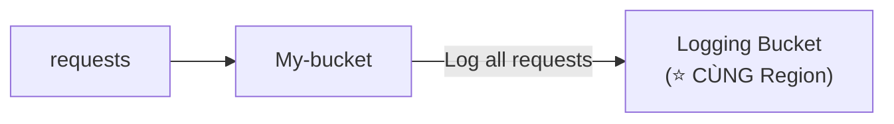

Định dạng log: `https://docs.aws.amazon.com/AmazonS3/latest/dev/LogFormat.html`

---

### ⚠️⭐⭐⭐ S3 Access Logs: WARNING (bẫy thi kinh điển)

> ⭐⭐⭐ **KHÔNG ĐƯỢC đặt logging bucket LÀ CHÍNH bucket đang được giám sát!**
> ⭐⭐ **Nó sẽ tạo ra một VÒNG LẶP LOG (logging loop), và bucket của bạn sẽ PHÌNH TO THEO CẤP SỐ NHÂN (grow exponentially)**

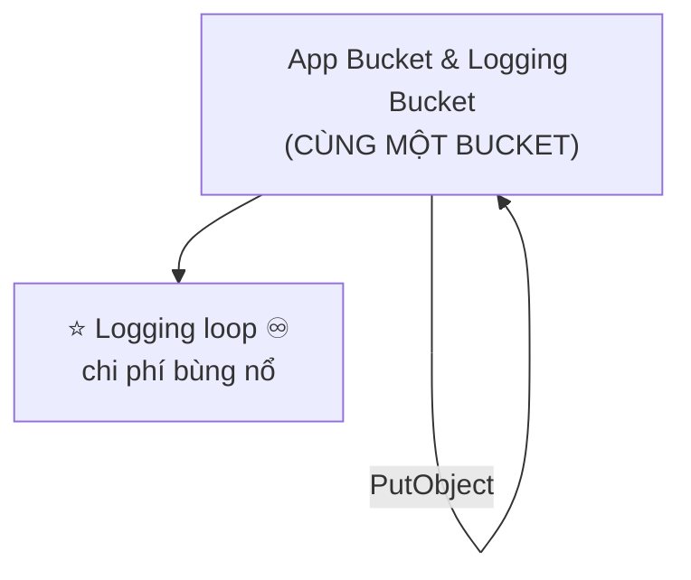

> 💬 Nguyên văn slide: **"Do not try this at home 🙂"**

### ⭐⭐ Hai quy tắc phải nhớ

| # | Quy tắc |
|---|---------|
| 1 | ⭐⭐ **Logging bucket PHẢI ở CÙNG Region với bucket được giám sát** |
| 2 | ⭐⭐⭐ **Logging bucket PHẢI KHÁC bucket được giám sát** (nếu không → **logging loop**, chi phí bùng nổ) |

---

## 160. S3 Access Logs - Hands On

### Bước 1 — Tạo logging bucket

1. Tạo bucket mới, ví dụ `my-bucket-access-logs-<tên>`.
2. ⚠️ ⭐ **PHẢI ở CÙNG Region** với bucket cần giám sát.

### Bước 2 — Bật Server Access Logging ⭐

1. Bucket cần giám sát → tab **Properties** → mục ⭐ **Server access logging** → **Edit**.
2. **Server access logging**: ⭐ **Enable**.
3. **Destination**: **Browse S3** → chọn `my-bucket-access-logs-<tên>`.
   - Tùy chọn **Destination prefix**: ví dụ `logs/`
4. **Log object key format**: `Date-based partitioning` (khuyến nghị) hoặc `Non-date-based`.
5. **Save changes**.

> ⭐ AWS **tự động cập nhật Bucket Policy** của logging bucket để cho phép **S3 Log Delivery group** ghi vào.

### Bước 3 — Tạo traffic

1. Truy cập object trong bucket được giám sát vài lần (qua Console, URL, hoặc CLI).
2. Thử cả request **thành công** và **bị từ chối** (403).

### Bước 4 — ⏳ Chờ log xuất hiện ⭐

> ⚠️ ⭐⭐ **Log KHÔNG xuất hiện ngay** — thường mất **vài giờ** (AWS gom log theo lô).

### Bước 5 — Xem nội dung log ⭐

1. Mở logging bucket → tải một file log về.
2. Mỗi dòng có dạng:

```
79a5 my-bucket [16/Sep/2026:10:15:30 +0000] 203.0.113.45 arn:aws:iam::123456789012:user/stephane
3E57427F3EXAMPLE REST.GET.OBJECT coffee.jpg "GET /coffee.jpg HTTP/1.1" 200 - 12345 12345 25 20
"-" "aws-cli/2.x" - ...
```

### Các trường quan trọng ⭐

| Trường | Ý nghĩa |
|--------|---------|
| **Bucket Owner** | ID chủ bucket |
| **Bucket** | Tên bucket |
| **Time** | Thời điểm request |
| ⭐ **Remote IP** | **IP của người gọi** |
| ⭐ **Requester** | **ARN của user/role** (hoặc `-` nếu ẩn danh) |
| ⭐ **Operation** | `REST.GET.OBJECT`, `REST.PUT.OBJECT`… |
| **Key** | Tên object |
| ⭐ **HTTP status** | **`200`, `403`, `404`…** |
| **Bytes Sent / Object Size** | Dung lượng |
| **Total Time / Turn-Around Time** | Thời gian xử lý |

### Bước 6 — Phân tích bằng Athena ⭐

> ⭐ Có thể tạo bảng Athena trỏ vào logging bucket để **truy vấn log bằng SQL** — ví dụ tìm tất cả request `403` trong tháng.

### Dọn dẹp ⚠️

- ⭐ **Tắt Server access logging** trước, sau đó xóa logging bucket — nếu không log vẫn tiếp tục được ghi và **tính tiền**.

---

## 161. S3 Pre-signed URLs

### Pre-signed URL là gì? ⭐⭐

- ⭐⭐ **Sinh pre-signed URL bằng S3 Console, AWS CLI hoặc SDK**

### ⭐⭐⭐ URL Expiration (con số phải nhớ)

| Cách tạo | Thời hạn |
|----------|----------|
| ⭐⭐ **S3 Console** | **1 phút tới 720 phút (12 GIỜ)** |
| ⭐⭐ **AWS CLI** | **Cấu hình bằng tham số `--expires-in` (tính bằng GIÂY)**<br>⭐ **Mặc định 3600 giây**, ⭐⭐ **tối đa 604800 giây (~168 GIỜ = 7 ngày)** |

### ⭐⭐⭐ Quy tắc quyền hạn:

> **Người dùng được cấp pre-signed URL KẾ THỪA QUYỀN của user đã SINH RA URL đó, cho GET / PUT**

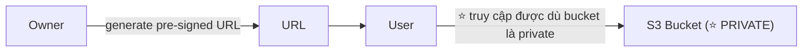

### ⭐⭐ Ba ví dụ use case (từ slide)

| # | Use case |
|---|----------|
| 1 | ⭐ **Chỉ cho phép user ĐÃ ĐĂNG NHẬP tải video premium từ S3 bucket của bạn** |
| 2 | ⭐ **Cho phép một danh sách user LUÔN THAY ĐỔI tải file bằng cách SINH URL ĐỘNG** |
| 3 | ⭐⭐ **Cho phép TẠM THỜI một user UPLOAD file vào một vị trí chính xác trong S3 bucket của bạn** |

> ⭐⭐ **Mẹo thi:** Đề nói *"chia sẻ file private tạm thời mà không làm bucket public"* → **Pre-signed URL**.
> Đề nói *"cho phép user upload trực tiếp lên S3 mà không cần IAM user"* → cũng là **Pre-signed URL (PUT)**.

---

## 162. S3 Pre-signed URLs - Hands On

### Cách 1 — Qua S3 Console ⭐

1. Bucket → chọn object (⚠️ **bucket là PRIVATE**, không có bucket policy public).
2. **Object actions** → ⭐ **Share with a presigned URL**.
3. Cấu hình:
   - ⭐ **Number of minutes / hours**: ví dụ `5` minutes (tối đa **720 phút = 12 giờ**)
4. **Create presigned URL** → URL được copy vào clipboard.

### Cách 2 — Qua AWS CLI ⭐

```bash
# Mặc định 3600 giây (1 giờ)
aws s3 presign s3://my-bucket/coffee.jpg

# Chỉ định thời hạn: 300 giây
aws s3 presign s3://my-bucket/coffee.jpg --expires-in 300

# Tối đa: 604800 giây (7 ngày)
aws s3 presign s3://my-bucket/coffee.jpg --expires-in 604800
```

### Cấu trúc URL sinh ra ⭐

```
https://my-bucket.s3.eu-west-1.amazonaws.com/coffee.jpg
  ?X-Amz-Algorithm=AWS4-HMAC-SHA256
  &X-Amz-Credential=AKIA.../20260916/eu-west-1/s3/aws4_request
  &X-Amz-Date=20260916T101530Z
  &X-Amz-Expires=300              ← ⭐ thời hạn
  &X-Amz-SignedHeaders=host
  &X-Amz-Signature=abc123...      ← ⭐ chữ ký
```

### Kiểm chứng ⭐

| Thử nghiệm | Kết quả |
|-----------|---------|
| Mở **Object URL thường** (không có chữ ký) | ❌ ⭐ **`403 Forbidden`** |
| Mở **pre-signed URL** | ✅ ⭐ **Tải được object** |
| Đợi quá thời hạn rồi mở lại | ❌ ⭐⭐ **`Request has expired`** |

> ⭐⭐ **Đây chính là cơ chế nút "Open" trong S3 Console** (đã nhắc ở phần 12, bài 130) — Console **tự sinh pre-signed URL** cho bạn.

---

## 163. Glacier Vault Lock & S3 Object Lock

Cả hai đều phục vụ mô hình ⭐⭐ **WORM (Write Once Read Many)**.

---

### 1️⃣ S3 Glacier Vault Lock ⭐⭐

- ⭐⭐ **Áp dụng mô hình WORM (Write Once Read Many)**
- ⭐ **Tạo một Vault Lock Policy**
- ⭐⭐ **KHÓA policy cho các lần chỉnh sửa tương lai (KHÔNG THỂ thay đổi hoặc xóa nữa)**
- ⭐ **Hữu ích cho COMPLIANCE và DATA RETENTION**

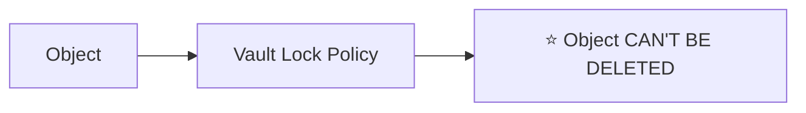

> ⚠️ ⭐⭐ **Một khi đã LOCK, policy là VĨNH VIỄN** — kể cả AWS cũng không gỡ được.

---

### 2️⃣ S3 Object Lock ⭐⭐⭐ (⚠️ **versioning PHẢI được bật**)

- ⭐⭐ **Áp dụng mô hình WORM (Write Once Read Many)**
- ⭐⭐ **CHẶN việc xóa một object version trong MỘT KHOẢNG THỜI GIAN XÁC ĐỊNH**

### ⭐⭐⭐ Hai Retention Mode (rất hay ra thi)

#### 🔹 Retention mode — **COMPLIANCE**

- ⭐⭐ **Object version KHÔNG THỂ bị ghi đè hoặc xóa bởi BẤT KỲ USER NÀO, KỂ CẢ ROOT USER**
- ⭐⭐ **Retention mode KHÔNG THỂ thay đổi, và retention period KHÔNG THỂ rút ngắn**

#### 🔹 Retention mode — **GOVERNANCE**

- ⭐ **HẦU HẾT user không thể ghi đè/xóa object version hoặc thay đổi lock settings**
- ⭐⭐ **MỘT SỐ user có QUYỀN ĐẶC BIỆT để thay đổi retention hoặc xóa object**

### ⭐⭐ Hai cơ chế bảo vệ

| Cơ chế | Mô tả |
|--------|-------|
| ⭐ **Retention Period** | **Bảo vệ object trong MỘT KHOẢNG THỜI GIAN CỐ ĐỊNH** — ⭐ **có thể GIA HẠN (extended)** |
| ⭐⭐ **Legal Hold** | • **Bảo vệ object VÔ THỜI HẠN (indefinitely), ĐỘC LẬP với retention period**<br>• ⭐ **Có thể đặt và gỡ TỰ DO bằng IAM permission `s3:PutObjectLegalHold`** |

### ⭐⭐⭐ Bảng so sánh Compliance vs Governance

| | ⭐ **Compliance** | ⭐ **Governance** |
|---|---|---|
| **Root user xóa được?** | ❌ ⭐⭐ **KHÔNG** | ✅ (nếu có quyền đặc biệt) |
| **Đổi retention mode?** | ❌ ⭐ **KHÔNG** | ✅ Được |
| **Rút ngắn retention period?** | ❌ ⭐⭐ **KHÔNG** | ✅ Được |
| **Gia hạn retention period?** | ✅ Được | ✅ Được |
| **Dùng cho** | ⭐ **Tuân thủ pháp lý NGHIÊM NGẶT** | ⭐ **Bảo vệ thông thường, vẫn cần lối thoát** |

> ⭐⭐⭐ **Bẫy thi:** Đề nói *"kể cả root account cũng không được xóa"* → **Compliance mode**.
> Đề nói *"một số admin vẫn được phép xóa trong trường hợp đặc biệt"* → **Governance mode**.

### ⭐⭐ So sánh Vault Lock vs Object Lock

| | **Glacier Vault Lock** | **S3 Object Lock** |
|---|---|---|
| **Áp dụng cho** | ⭐ **Glacier Vault** | ⭐ **S3 object versions** |
| **Cơ chế** | **Vault Lock Policy** (khóa vĩnh viễn) | ⭐ **Retention Period + Legal Hold** |
| **Chế độ** | Một loại (khóa policy) | ⭐ **Compliance / Governance** |
| **Yêu cầu** | — | ⭐⭐ **Versioning PHẢI bật** |
| **Chung** | ⭐⭐ **Cả hai đều là WORM — dùng cho compliance & data retention** ||

---

## 164. S3 Access Points

### S3 Access Points là gì? ⭐⭐

- ⭐⭐ **Access Points ĐƠN GIẢN HÓA việc quản lý bảo mật cho S3 Buckets**
- ⭐⭐ **Mỗi Access Point có:**
  - ⭐ **DNS name RIÊNG của nó** (**Internet Origin** hoặc **VPC Origin**)
  - ⭐⭐ **Một access point policy (tương tự bucket policy) — QUẢN LÝ BẢO MẬT Ở QUY MÔ LỚN (manage security at scale)**

### Sơ đồ (từ slide) ⭐

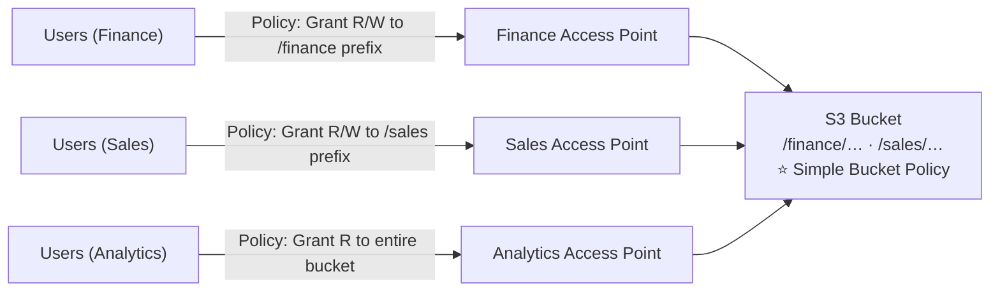

### ⭐⭐ Vấn đề mà Access Points giải quyết

> **Không có Access Points:** một **bucket policy khổng lồ** chứa hàng chục statement cho từng nhóm user → **khó đọc, khó bảo trì, dễ sai**.
>
> **Có Access Points:** bucket policy **đơn giản**, mỗi nhóm user có **access point riêng với policy riêng** → **dễ quản lý ở quy mô lớn**.

---

### ⭐⭐ S3 — Access Points — VPC Origin

- ⭐⭐ **Chúng ta có thể định nghĩa access point CHỈ TRUY CẬP ĐƯỢC TỪ BÊN TRONG VPC**
- ⭐⭐ **BẠN PHẢI TẠO MỘT VPC ENDPOINT để truy cập Access Point (Gateway hoặc Interface Endpoint)**
- ⭐⭐ **VPC Endpoint Policy PHẢI CHO PHÉP truy cập tới bucket đích VÀ Access Point**

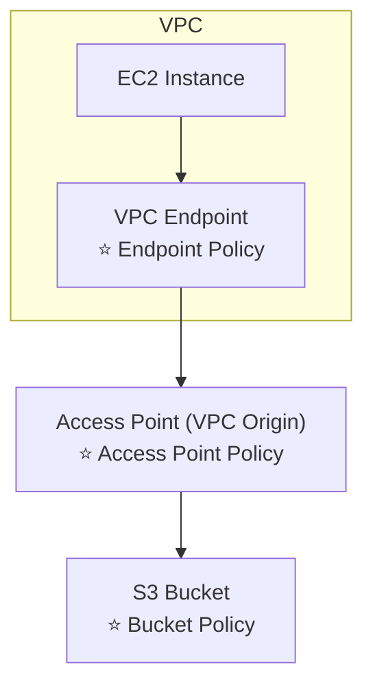

### ⭐⭐ Ba lớp policy phải cùng cho phép

| Lớp | Policy |
|-----|--------|
| 1 | ⭐ **VPC Endpoint Policy** |
| 2 | ⭐ **Access Point Policy** |
| 3 | ⭐ **Bucket Policy** |

> ⭐⭐ **Bẫy thi:** Đề nói *"truy cập qua VPC Endpoint tới Access Point bị từ chối"* → kiểm tra **cả ba policy**, thiếu một cái là hỏng.

---

## 165. S3 Object Lambda

### S3 Object Lambda là gì? ⭐⭐

- ⭐⭐ **Dùng AWS Lambda Functions để THAY ĐỔI OBJECT TRƯỚC KHI nó được lấy về bởi ứng dụng gọi**
- ⭐⭐ **CHỈ CẦN MỘT S3 BUCKET DUY NHẤT**, bên trên đó ta tạo **S3 Access Point** và **S3 Object Lambda Access Points**

### ⭐⭐⭐ Use Cases (từ slide)

| # | Use case |
|---|----------|
| 1 | ⭐⭐ **REDACTING (che/ẩn) thông tin định danh cá nhân (PII) cho analytics hoặc môi trường non-production** |
| 2 | ⭐⭐ **CHUYỂN ĐỔI ĐỊNH DẠNG dữ liệu, ví dụ chuyển XML sang JSON** |
| 3 | ⭐⭐ **THAY ĐỔI KÍCH THƯỚC và ĐÓNG DẤU (watermarking) ảnh ngay lập tức (on the fly)**, dùng thông tin riêng của người gọi — ví dụ user nào đã yêu cầu object |

### Sơ đồ kiến trúc (từ slide) ⭐

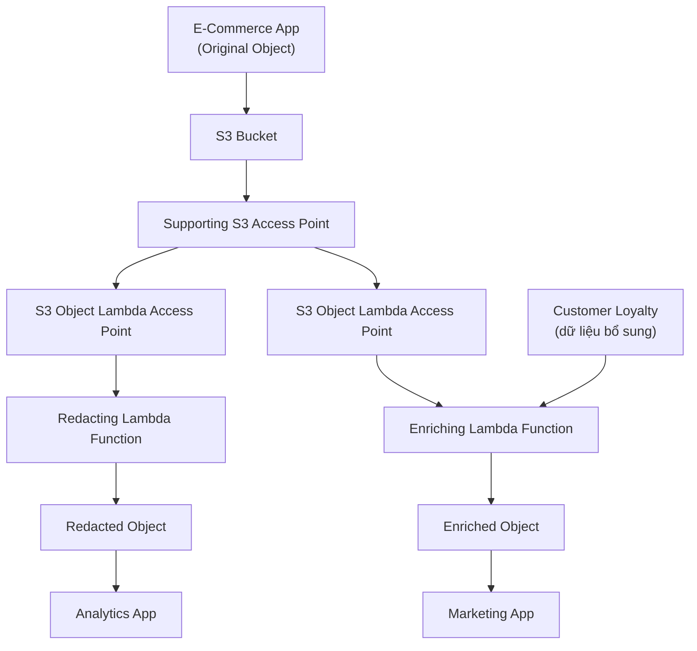

### ⭐⭐ Luồng hoạt động

```
   ① Ứng dụng gọi qua Object Lambda Access Point
   ② S3 lấy object gốc qua Supporting Access Point
   ③ ⭐ Lambda Function XỬ LÝ object (redact/convert/resize)
   ④ Trả về object ĐÃ BIẾN ĐỔI cho ứng dụng
   ⭐ Object GỐC trong bucket KHÔNG BỊ THAY ĐỔI
```

### ⭐⭐ Điểm mấu chốt

| Điểm | Chi tiết |
|------|----------|
| ⭐⭐ **Một bucket, nhiều "phiên bản" dữ liệu** | Không cần nhân bản bucket cho từng nhu cầu |
| ⭐ **Biến đổi ngay lúc đọc (on the fly)** | Không cần lưu bản đã xử lý |
| ⭐ **Mỗi Object Lambda Access Point = một Lambda function** | Analytics thấy dữ liệu đã che PII, Marketing thấy dữ liệu đã làm giàu |

> ⭐⭐ **Mẹo thi:** Đề nói *"che PII cho môi trường test mà không nhân bản dữ liệu"*, *"chuyển XML→JSON khi đọc"*, *"watermark ảnh theo user"* → **S3 Object Lambda**.

---

## Trắc nghiệm 11: Amazon S3 Security Quiz

### Các điểm dễ bị bẫy

| Câu hỏi thường gặp | Đáp án đúng |
|--------------------|-------------|
| S3 có mấy phương pháp mã hóa object? | ⭐ **4: SSE-S3, SSE-KMS, SSE-C, Client-Side** |
| Phương pháp nào bật MẶC ĐỊNH? | ⭐⭐ **SSE-S3** |
| SSE-S3 dùng thuật toán gì? | ⭐ **AES-256** |
| Header của SSE-S3? | ⭐ **`"x-amz-server-side-encryption": "AES256"`** |
| Header của SSE-KMS? | ⭐ **`"x-amz-server-side-encryption": "aws:kms"`** |
| Ưu điểm của SSE-KMS? | ⭐⭐ **User control + audit key usage qua CloudTrail** |
| SSE-KMS gọi API nào khi upload / download? | ⭐⭐ **`GenerateDataKey` / `Decrypt`** |
| KMS quota mỗi giây là bao nhiêu? | ⭐ **5,500 / 10,000 / 30,000 req/s tùy Region** |
| Ứng dụng bị throttle khi dùng SSE-KMS → làm gì? | ⭐ **Xin tăng quota qua Service Quotas Console** |
| SSE-C: S3 có lưu key không? | ❌ ⭐⭐ **KHÔNG** |
| SSE-C bắt buộc dùng gì? | ⭐⭐ **HTTPS**, và **key trong header MỖI request** |
| SSE-C dùng được trên Console không? | ❌ ⭐ **KHÔNG — phải dùng CLI/SDK** |
| Client-Side Encryption: ai mã hóa/giải mã? | ⭐ **CLIENT tự làm cả hai** |
| Dữ liệu phải mã hóa trước khi rời client → chọn gì? | ⭐⭐ **Client-Side Encryption** |
| S3 có mấy endpoint? | ⭐ **2: HTTP (không mã hóa) và HTTPS (mã hóa)** |
| Bắt buộc HTTPS cho bucket bằng cách nào? | ⭐⭐ **Bucket Policy với `aws:SecureTransport: false` → Deny** |
| Default Encryption áp dụng loại nào? | ⭐ **SSE-S3** |
| Bucket Policy và Default Encryption — cái nào đánh giá TRƯỚC? | ⭐⭐⭐ **Bucket Policy TRƯỚC** |
| Bắt buộc mọi upload dùng SSE-KMS → làm sao? | ⭐⭐ **Bucket Policy Deny nếu thiếu header `s3:x-amz-server-side-encryption`** |
| CORS là gì? | ⭐ **Cross-Origin Resource Sharing** |
| Origin gồm những gì? | ⭐⭐ **scheme (protocol) + host (domain) + port** |
| Port ngầm định của HTTPS / HTTP? | ⭐ **443 / 80** |
| CORS là cơ chế của ai? | ⭐⭐ **TRÌNH DUYỆT WEB** |
| Request đầu tiên trong CORS gọi là gì? | ⭐ **Preflight Request (`OPTIONS`)** |
| Header quan trọng nhất của CORS? | ⭐⭐ **`Access-Control-Allow-Origin`** |
| CORS cấu hình trên bucket nào? | ⭐⭐ **Bucket ĐƯỢC GỌI TỚI (cross-origin)** |
| `AllowedOrigins` viết thế nào? | ⭐⭐ **Có `http://`, KHÔNG có dấu `/` ở cuối** |
| MFA Delete yêu cầu MFA cho thao tác nào? | ⭐⭐ **Xóa vĩnh viễn object version** và **Suspend Versioning** |
| MFA Delete KHÔNG yêu cầu MFA cho thao tác nào? | ⭐⭐ **Bật Versioning** và **List deleted versions** |
| Điều kiện để dùng MFA Delete? | ⭐⭐ **Versioning PHẢI được bật** |
| Ai bật/tắt được MFA Delete? | ⭐⭐⭐ **CHỈ bucket owner (ROOT ACCOUNT)** |
| MFA Delete bật bằng Console được không? | ❌ ⭐ **Chỉ bằng CLI với root credentials** |
| S3 Access Logs ghi những request nào? | ⭐⭐ **MỌI request, từ MỌI account, được phép HAY bị từ chối** |
| Logging bucket phải ở đâu? | ⭐⭐ **CÙNG AWS Region** |
| Đặt logging bucket = bucket giám sát thì sao? | ⭐⭐⭐ **LOGGING LOOP — bucket phình theo cấp số nhân** |
| Pre-signed URL qua Console có thời hạn bao lâu? | ⭐⭐ **1 phút đến 720 phút (12 giờ)** |
| Pre-signed URL qua CLI: tham số và giới hạn? | ⭐⭐ **`--expires-in` (giây), mặc định 3600, tối đa 604800 (~168 giờ)** |
| Người dùng pre-signed URL có quyền gì? | ⭐⭐ **Kế thừa quyền của user SINH RA URL (GET/PUT)** |
| Chia sẻ file private tạm thời → dùng gì? | ⭐ **Pre-signed URL** |
| WORM nghĩa là gì? | ⭐ **Write Once Read Many** |
| Glacier Vault Lock: policy khóa rồi có sửa được? | ❌ ⭐⭐ **KHÔNG — không thay đổi hoặc xóa được** |
| S3 Object Lock cần điều kiện gì? | ⭐⭐ **Versioning phải được bật** |
| Object Lock có mấy retention mode? | ⭐ **2: Compliance và Governance** |
| Compliance mode: root user xóa được không? | ❌ ⭐⭐⭐ **KHÔNG — kể cả root** |
| Compliance mode: rút ngắn retention period được? | ❌ ⭐ **KHÔNG** |
| Governance mode khác gì? | ⭐ **Một số user có quyền đặc biệt để thay đổi/xóa** |
| Legal Hold khác Retention Period thế nào? | ⭐⭐ **Bảo vệ VÔ THỜI HẠN, ĐỘC LẬP với retention period** |
| IAM permission để đặt/gỡ Legal Hold? | ⭐ **`s3:PutObjectLegalHold`** |
| S3 Access Points giải quyết vấn đề gì? | ⭐⭐ **Đơn giản hóa quản lý bảo mật, tránh bucket policy khổng lồ** |
| Mỗi Access Point có gì? | ⭐⭐ **DNS name riêng + access point policy riêng** |
| Access Point VPC Origin cần gì? | ⭐⭐ **VPC Endpoint (Gateway hoặc Interface)** |
| Truy cập qua VPC Origin cần mấy policy cho phép? | ⭐⭐ **3: VPC Endpoint Policy + Access Point Policy + Bucket Policy** |
| S3 Object Lambda làm gì? | ⭐⭐ **Dùng Lambda thay đổi object TRƯỚC KHI trả về cho caller** |
| S3 Object Lambda cần mấy bucket? | ⭐⭐ **CHỈ MỘT** |
| Use case của S3 Object Lambda? | ⭐ **Redact PII, chuyển XML→JSON, resize/watermark ảnh on the fly** |
| Object gốc có bị thay đổi bởi Object Lambda? | ❌ ⭐ **KHÔNG** |

### Checklist tự kiểm tra trước khi làm quiz

- [ ] Thuộc **bảng 4 phương pháp mã hóa** — ai quản key, header nào, HTTPS bắt buộc hay không
- [ ] Nhớ **SSE-KMS gọi `GenerateDataKey`/`Decrypt`** → **bị giới hạn KMS quota**
- [ ] Nhớ **SSE-C: S3 không lưu key, bắt buộc HTTPS, key trong header mỗi request, không dùng Console**
- [ ] Nhớ **`aws:SecureTransport`** để bắt buộc HTTPS
- [ ] Nhớ ⭐⭐ **Bucket Policy được đánh giá TRƯỚC Default Encryption**
- [ ] Thuộc **3 bước CORS**: Preflight (`OPTIONS`) → Response (`Access-Control-Allow-Origin`) → Request thật
- [ ] Nhớ **CORS cấu hình trên bucket cross-origin**, `AllowedOrigins` **không có `/` cuối**
- [ ] Thuộc **MFA Delete: 2 thao tác CẦN MFA / 2 thao tác KHÔNG cần**, **chỉ root bật được**, **versioning phải bật**
- [ ] Nhớ **Access Logs: cùng Region, KHÔNG được trùng bucket (logging loop)**
- [ ] Thuộc con số **Pre-signed URL: Console 1–720 phút; CLI mặc định 3600s, tối đa 604800s**
- [ ] Phân biệt **Compliance (kể cả root cũng không xóa được)** vs **Governance (có ngoại lệ)**
- [ ] Nhớ **Legal Hold vô thời hạn, độc lập retention period, permission `s3:PutObjectLegalHold`**
- [ ] Nhớ **Access Point VPC Origin cần 3 policy cùng cho phép**
- [ ] Nhớ **S3 Object Lambda: 1 bucket, biến đổi on-the-fly, object gốc không đổi**

---

## Thuật ngữ Anh — Việt

| Tiếng Anh | Tiếng Việt |
|-----------|-----------|
| Server-Side Encryption (SSE) | Mã hóa phía máy chủ |
| Client-Side Encryption | Mã hóa phía máy khách |
| S3-Managed Keys | Khóa do S3 quản lý |
| Customer-Provided Keys | Khóa do khách hàng cung cấp |
| Key Management Service (KMS) | Dịch vụ quản lý khóa |
| Encryption key | Khóa mã hóa |
| Header | Tiêu đề HTTP |
| Quota | Hạn mức |
| Throttle | Bị giới hạn tốc độ |
| Service Quotas Console | Bảng điều khiển hạn mức dịch vụ |
| Encryption in transit / in flight | Mã hóa khi truyền |
| Encryption at rest | Mã hóa khi lưu trữ |
| SecureTransport | Truyền tải an toàn (HTTPS) |
| Default Encryption | Mã hóa mặc định |
| Force encryption | Bắt buộc mã hóa |
| Dual-layer | Hai lớp |
| Cross-Origin Resource Sharing (CORS) | Chia sẻ tài nguyên khác nguồn gốc |
| Origin | Nguồn gốc (protocol + domain + port) |
| Same origin / Different origins | Cùng nguồn / Khác nguồn |
| Preflight Request / Response | Yêu cầu / Phản hồi tiền kiểm |
| Access-Control-Allow-Origin | Header cho phép nguồn truy cập |
| AllowedMethods / AllowedHeaders | Phương thức / Tiêu đề được phép |
| MFA Delete | Xóa có xác thực đa yếu tố |
| Permanently delete | Xóa vĩnh viễn |
| Suspend Versioning | Tạm dừng quản lý phiên bản |
| Bucket owner | Chủ sở hữu bucket |
| Access Logs | Nhật ký truy cập |
| Audit purpose | Mục đích kiểm toán |
| Target logging bucket | Bucket đích chứa log |
| Logging loop | Vòng lặp ghi log |
| Grow exponentially | Phình theo cấp số nhân |
| Pre-signed URL | URL có chữ ký sẵn |
| URL Expiration | Thời hạn của URL |
| Inherit permissions | Kế thừa quyền |
| WORM (Write Once Read Many) | Ghi một lần, đọc nhiều lần |
| Vault Lock Policy | Chính sách khóa kho lưu trữ |
| Data retention | Lưu giữ dữ liệu |
| Compliance | Tuân thủ quy định |
| Object Lock | Khóa đối tượng |
| Retention mode | Chế độ lưu giữ |
| Governance | Quản trị (có ngoại lệ) |
| Retention Period | Thời hạn bảo vệ |
| Legal Hold | Giữ theo yêu cầu pháp lý |
| Indefinitely | Vô thời hạn |
| Access Points | Điểm truy cập |
| Internet Origin / VPC Origin | Nguồn Internet / Nguồn trong VPC |
| Manage security at scale | Quản lý bảo mật ở quy mô lớn |
| VPC Endpoint | Điểm cuối VPC |
| Endpoint Policy | Chính sách điểm cuối |
| S3 Object Lambda | Biến đổi object bằng Lambda khi đọc |
| Redacting | Che/ẩn thông tin nhạy cảm |
| Personally Identifiable Information (PII) | Thông tin định danh cá nhân |
| On the fly | Ngay lập tức, trong lúc chạy |
| Watermarking | Đóng dấu bản quyền |
| Enriching | Làm giàu dữ liệu |

---

*Ghi chú: các phần Hands On được tóm tắt lại các bước thao tác chính trên AWS Console. Giao diện Console có thể thay đổi theo thời gian — logic và khái niệm vẫn giữ nguyên. ⚠️ Bài 158 (MFA Delete) là bài DUY NHẤT trong khóa học cần tạo Access Key cho ROOT ACCOUNT — nhớ **XÓA access key đó ngay sau khi thực hành xong**.*
