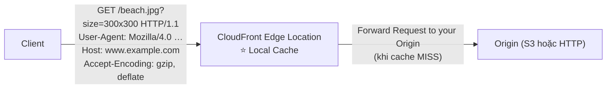
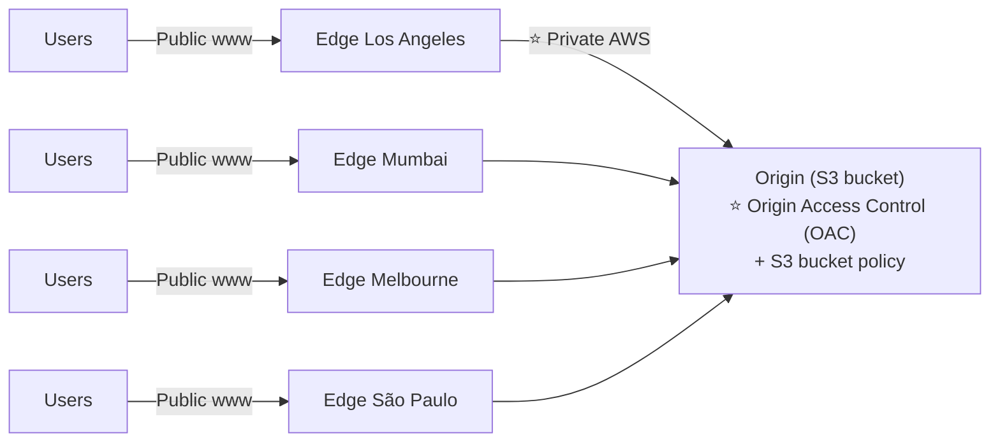
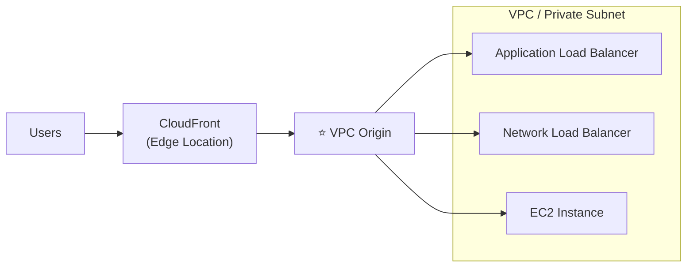
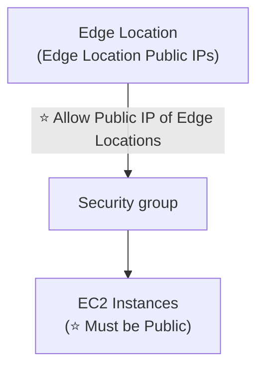
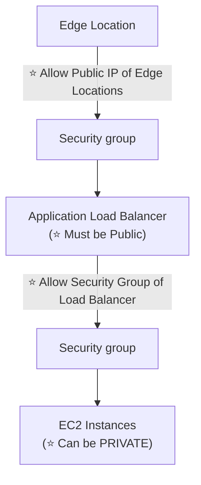
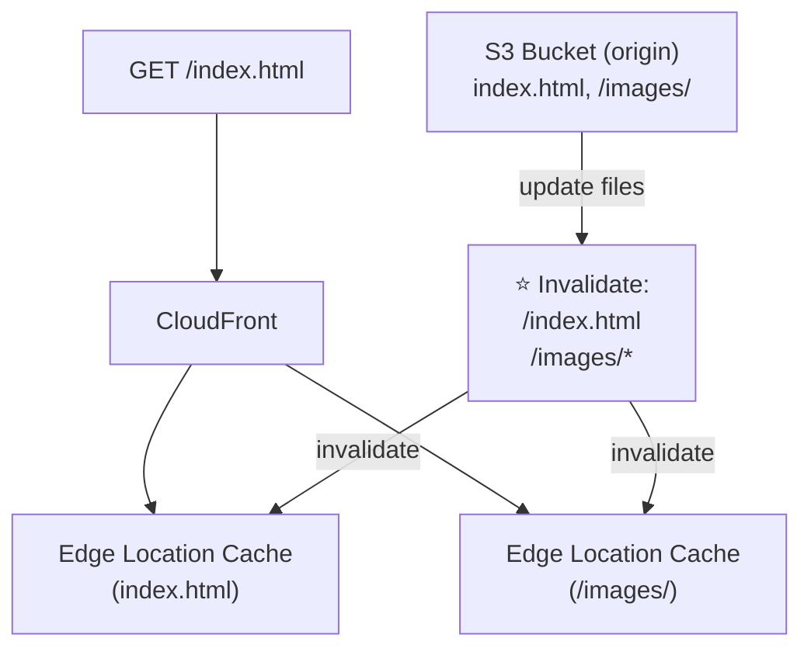
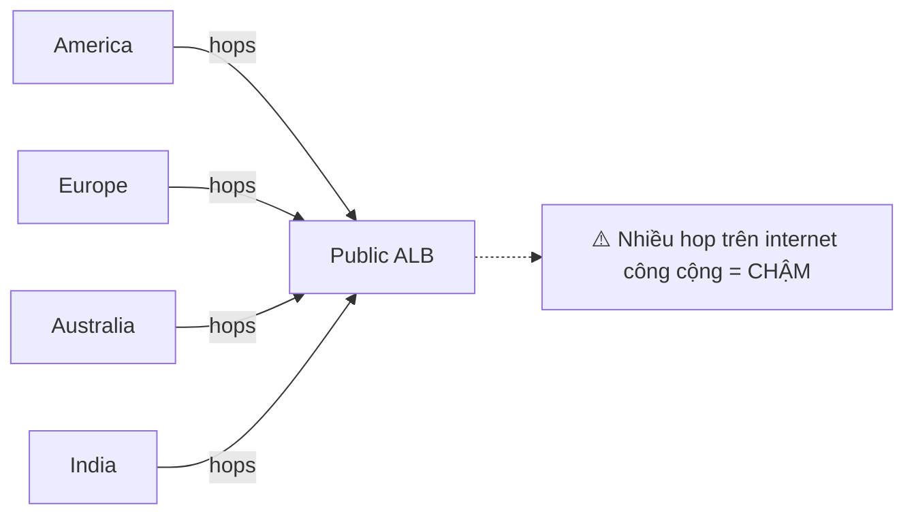
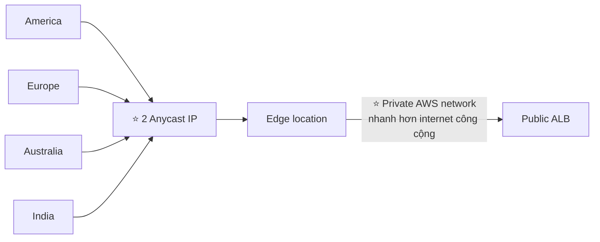

# Phần 15 — CloudFront & AWS Global Accelerator

> Khóa học: *Ultimate AWS Certified Solutions Architect Associate 2026* (Stéphane Maarek) — SAA-C03
> Nguồn tham chiếu: `AWS Certified Solutions Architect Slides v48.pdf` (phần "CloudFront & Global Accelerator")

---

## Mục lục

| # | Bài giảng | Thời lượng | Loại |
|---|-----------|-----------|------|
| 166 | [CloudFront Overview](#166-cloudfront-overview) | 5 phút | Video |
| 167 | [CloudFront with S3 - Hands On](#167-cloudfront-with-s3---hands-on) | 6 phút | Video |
| 168 | [CloudFront - ALB/EC2 as an Origin](#168-cloudfront---albec2-as-an-origin) | 3 phút | Video |
| 169 | [CloudFront - Geo Restriction](#169-cloudfront---geo-restriction) | 2 phút | Video |
| 170 | [CloudFront - Cache Invalidation](#170-cloudfront---cache-invalidation) | 3 phút | Video |
| 171 | [AWS Global Accelerator - Overview](#171-aws-global-accelerator---overview) | 6 phút | Video |
| 172 | [AWS Global Accelerator - Hands On](#172-aws-global-accelerator---hands-on) | 9 phút | Video |
| — | [Trắc nghiệm 12: CloudFront & AWS Global Accelerator Quiz](#trắc-nghiệm-12-cloudfront--aws-global-accelerator-quiz) | — | Quiz |

---

## 166. CloudFront Overview

### Amazon CloudFront là gì? ⭐⭐

- ⭐⭐ **Content Delivery Network (CDN)** — Mạng phân phối nội dung
- ⭐⭐ **CẢI THIỆN hiệu năng ĐỌC, nội dung được CACHE TẠI EDGE**
- ⭐ **Cải thiện trải nghiệm người dùng**
- ⭐⭐ **HÀNG TRĂM Points of Presence trên toàn cầu** (edge locations, caches)
- ⭐⭐ **BẢO VỆ DDoS (vì phân tán toàn cầu), tích hợp với Shield, AWS Web Application Firewall (WAF)**

> ⭐ **Ba lợi ích chính:** **hiệu năng** (cache ở edge), **trải nghiệm người dùng**, **bảo mật** (DDoS/Shield/WAF).

---

### ⭐⭐⭐ CloudFront — Origins (3 loại)

#### 1️⃣ S3 bucket ⭐⭐

- ⭐ **Để PHÂN PHỐI file và CACHE chúng tại edge**
- ⭐ **Để UPLOAD file lên S3 THÔNG QUA CloudFront**
- ⭐⭐ **Được bảo mật bằng Origin Access Control (OAC)**

#### 2️⃣ VPC Origin ⭐⭐

- ⭐⭐ **Cho các ứng dụng host trong VPC PRIVATE SUBNETS**
- ⭐ **Private Application Load Balancer / Network Load Balancer / EC2 Instances**

#### 3️⃣ Custom Origin (HTTP) ⭐

- ⭐ **S3 website** (⚠️ **phải bật bucket thành static S3 website TRƯỚC**)
- ⭐ **Bất kỳ backend HTTP công khai nào** (ví dụ: **Public ALB**)

### Bảng tổng hợp Origins ⭐

| Origin | Dùng cho | Bảo mật |
|--------|----------|---------|
| ⭐ **S3 bucket** | Phân phối file tĩnh, upload qua CloudFront | ⭐⭐ **Origin Access Control (OAC)** |
| ⭐ **VPC Origin** | ALB/NLB/EC2 **trong private subnet** | Không cần expose ra internet |
| ⭐ **Custom Origin (HTTP)** | S3 static website, **Public ALB**, backend HTTP bất kỳ | Security Group / header bí mật |

---

### CloudFront at a high level ⭐



> ⭐ **Cơ chế:** Request đi tới **Edge Location gần nhất**. Nếu **cache hit** → trả về ngay. Nếu **cache miss** → forward tới Origin, lấy về, **cache lại**, rồi trả cho client.

---

### ⭐⭐ CloudFront — S3 as an Origin



### ⭐⭐⭐ Origin Access Control (OAC)

- ⭐⭐ **OAC + S3 bucket policy** đảm bảo **CHỈ CloudFront** truy cập được S3 bucket
- ⭐ **S3 bucket vẫn PRIVATE** — người dùng **không thể** bỏ qua CloudFront để truy cập thẳng S3

> ⭐ **Ghi nhớ:** OAC là phiên bản **mới** thay thế **OAI (Origin Access Identity)** cũ. Đề thi có thể nhắc cả hai.

---

### ⭐⭐⭐ CloudFront vs S3 Cross Region Replication (BẢNG QUAN TRỌNG)

| | ⭐ **CloudFront** | ⭐ **S3 Cross Region Replication** |
|---|---|---|
| **Mạng** | ⭐⭐ **Global Edge network** | Phải **thiết lập cho TỪNG Region** muốn replicate |
| **Cập nhật** | ⭐ **File được CACHE theo TTL (có thể là một ngày)** | ⭐⭐ **File được cập nhật GẦN NHƯ THỜI GIAN THỰC (near real-time)** |
| **Quyền** | Đọc (và upload qua CloudFront) | ⭐ **CHỈ ĐỌC (Read only)** |
| **Phù hợp cho** | ⭐⭐ **Nội dung TĨNH (static) phải có sẵn Ở MỌI NƠI** | ⭐⭐ **Nội dung ĐỘNG (dynamic) cần độ trễ thấp ở MỘT VÀI Region** |

> ⭐⭐ **Mẹo thi:**
> - "static content, toàn cầu, cache" → **CloudFront**
> - "dynamic content, near real-time, vài Region cụ thể" → **S3 CRR**

---

## 167. CloudFront with S3 - Hands On

### Bước 1 — Chuẩn bị S3 bucket

1. Tạo bucket (ví dụ `demo-cloudfront-stephane-v3`) — ⭐ **giữ Block Public Access BẬT** (bucket private).
2. Upload vài file: `index.html`, `coffee.jpg`, `beach.jpg`.
3. Thử truy cập Object URL → ❌ **`403 Forbidden`** (đúng như mong đợi).

### Bước 2 — Tạo CloudFront Distribution ⭐

1. Console → **CloudFront** → **Create distribution**.
2. **Origin**:
   - ⭐ **Origin domain**: chọn bucket S3 từ dropdown
   - **Origin path**: để trống
   - ⭐⭐ **Origin access**:
     - `Public` — bucket phải public (không khuyến nghị)
     - ⭐⭐ **`Origin access control settings (recommended)`** → **Create new OAC** → **Create**
   - ⚠️ CloudFront hiển thị cảnh báo: **"You must update the S3 bucket policy"** → **Copy policy** (dùng ở bước 4)
3. **Default cache behavior**:
   - ⭐ **Viewer protocol policy**: **`Redirect HTTP to HTTPS`** (khuyến nghị)
   - **Allowed HTTP methods**: `GET, HEAD` (hoặc thêm `PUT, POST, DELETE` nếu cần upload)
   - **Cache policy**: `CachingOptimized`
4. **Web Application Firewall (WAF)**: `Do not enable` (để tránh phí khi học).
5. **Settings**:
   - ⭐ **Price class**: `Use all edge locations` / `Use only North America and Europe` (rẻ hơn)
   - ⭐ **Default root object**: **`index.html`**
6. **Create distribution**.

### Bước 3 — ⏳ Chờ deploy ⭐

> ⚠️ ⭐ **Mất khoảng 5–15 phút** để status chuyển từ `Deploying` → hiển thị **Last modified** với thời gian.

### Bước 4 — ⭐⭐ Cập nhật S3 Bucket Policy (bước bắt buộc)

1. Bucket → tab **Permissions** → **Bucket policy** → **Edit** → dán policy CloudFront đã copy:

```json
{
  "Version": "2008-10-17",
  "Id": "PolicyForCloudFrontPrivateContent",
  "Statement": [
    {
      "Sid": "AllowCloudFrontServicePrincipal",
      "Effect": "Allow",
      "Principal": {
        "Service": "cloudfront.amazonaws.com"
      },
      "Action": "s3:GetObject",
      "Resource": "arn:aws:s3:::demo-cloudfront-stephane-v3/*",
      "Condition": {
        "StringEquals": {
          "AWS:SourceArn": "arn:aws:cloudfront::123456789012:distribution/E1ABCDEFGHIJK"
        }
      }
    }
  ]
}
```

> ⭐⭐ **Điểm mấu chốt:** Principal là **`cloudfront.amazonaws.com`**, và **Condition `AWS:SourceArn`** giới hạn đúng distribution của bạn.

### Bước 5 — Kiểm chứng ⭐

| Cách truy cập | Kết quả |
|---------------|---------|
| **S3 Object URL** trực tiếp | ❌ ⭐ **`403 Forbidden`** (bucket vẫn private) |
| ⭐ **CloudFront Distribution domain name** (`d1234abcd.cloudfront.net`) | ✅ **Hoạt động!** |
| `https://d1234abcd.cloudfront.net/coffee.jpg` | ✅ Tải được ảnh |

### Bước 6 — Quan sát hiệu ứng cache ⭐

1. Mở **DevTools** (F12) → tab **Network** → refresh trang.
2. Xem response headers:
   ```
   x-cache: Miss from cloudfront     ← lần đầu (cache miss)
   x-amz-cf-pop: CDG50-P1            ← edge location phục vụ
   ```
3. Refresh lại → đổi thành:
   ```
   x-cache: ⭐ Hit from cloudfront    ← đã có trong cache
   ```

> ⭐⭐ **Header `x-cache` là cách nhanh nhất kiểm tra CloudFront có đang cache đúng không.**

---

## 168. CloudFront - ALB/EC2 as an Origin

Có **HAI cách** để dùng ALB/EC2 làm origin.

---

### ⭐⭐ Cách 1 — Using VPC Origins (khuyến nghị, mới hơn)

- ⭐⭐ **Cho phép bạn phân phối nội dung từ ứng dụng host trong VPC PRIVATE SUBNETS** (⭐ **KHÔNG CẦN expose chúng ra Internet**)
- ⭐ **Đưa traffic tới các tài nguyên PRIVATE:**
  - ⭐ **Application Load Balancer**
  - ⭐ **Network Load Balancer**
  - ⭐ **EC2 Instances**



> ⭐⭐ **Ưu điểm lớn nhất:** tài nguyên **không cần public IP**, **không expose ra internet** → bảo mật tốt nhất.

---

### ⭐⭐⭐ Cách 2 — Using Public Network

#### 🔹 Trường hợp A — EC2 Instances (phải PUBLIC)



- ⭐⭐ **EC2 Instances PHẢI là PUBLIC**
- ⭐⭐ **Security group PHẢI cho phép Public IP của các Edge Location**
- ⭐ **Danh sách IP:** `http://d7uri8nf7uskq.cloudfront.net/tools/list-cloudfront-ips`

#### 🔹 Trường hợp B — Application Load Balancer (phải PUBLIC)



- ⭐⭐ **ALB PHẢI là PUBLIC**, SG của ALB cho phép **Public IP của Edge Locations**
- ⭐⭐ **EC2 Instances phía sau CÓ THỂ là PRIVATE**, SG của EC2 chỉ cho phép **Security Group của Load Balancer**

### ⭐⭐ Bảng so sánh 3 kiến trúc

| | **VPC Origin** | **Public EC2** | **Public ALB + Private EC2** |
|---|---|---|---|
| **EC2 public?** | ❌ ⭐ **Private** | ✅ ⭐ **PHẢI public** | ❌ ⭐ **Có thể private** |
| **ALB public?** | ❌ Private | — | ✅ ⭐ **PHẢI public** |
| **SG cho phép gì** | — | ⭐ **Public IP của Edge Locations** | ALB: **Edge IPs**; EC2: **SG của ALB** |
| **Bảo mật** | ⭐⭐ **Tốt nhất** | ⚠️ Kém nhất | ✅ Tốt |

> ⭐⭐ **Mẹo thi:** Đề nói *"không muốn expose ứng dụng ra internet"* → **VPC Origin**.
> Đề nói *"SG cần cho phép gì để CloudFront truy cập ALB public"* → **Public IP của CloudFront Edge Locations**.

---

## 169. CloudFront - Geo Restriction

### Đặc điểm ⭐⭐

- ⭐⭐ **Bạn có thể GIỚI HẠN AI được truy cập distribution của bạn**

| Loại | Mô tả |
|------|-------|
| ⭐⭐ **Allowlist** | **CHO PHÉP user truy cập nội dung CHỈ KHI họ ở một trong các quốc gia trong DANH SÁCH ĐƯỢC DUYỆT** |
| ⭐⭐ **Blocklist** | **NGĂN user truy cập nội dung NẾU họ ở một trong các quốc gia BỊ CẤM** |

### ⭐⭐ Cách xác định quốc gia

> **"Quốc gia" được xác định bằng một CƠ SỞ DỮ LIỆU Geo-IP CỦA BÊN THỨ BA (3rd party Geo-IP database)**

### ⭐⭐ Use case

> ⭐⭐ **Luật Bản quyền (Copyright Laws) để kiểm soát truy cập nội dung**

### Cách cấu hình

```
CloudFront → chọn distribution → tab Security → Geographic restrictions → Edit
→ chọn Allow list / Block list → chọn các quốc gia → Save changes
```

### ⭐⭐ Phân biệt với Route 53 Geolocation

| | ⭐ **CloudFront Geo Restriction** | ⭐ **Route 53 Geolocation Routing** |
|---|---|---|
| **Mục đích** | ⭐⭐ **CHẶN / CHO PHÉP truy cập** | ⭐⭐ **ĐỊNH TUYẾN tới endpoint khác nhau** |
| **Kết quả nếu không khớp** | ❌ **Bị từ chối (403)** | Trả về **Default record** |
| **Tầng hoạt động** | CDN (edge) | DNS |
| **Use case** | **Copyright, tuân thủ pháp lý** | **Localization, phân phối theo vùng** |

> ⭐⭐ **Bẫy thi:** Đề nói *"chặn user ở quốc gia X vì lý do bản quyền"* → **CloudFront Geo Restriction**, **không phải** Route 53.

---

## 170. CloudFront - Cache Invalidation

### Vấn đề ⭐⭐

> ⭐⭐ **Trong trường hợp bạn CẬP NHẬT origin backend, CloudFront KHÔNG BIẾT về điều đó và sẽ CHỈ lấy nội dung mới SAU KHI TTL HẾT HẠN**

### Giải pháp ⭐⭐⭐

> ⭐⭐ **Tuy nhiên, bạn CÓ THỂ ÉP làm mới TOÀN BỘ hoặc MỘT PHẦN cache (do đó BỎ QUA TTL) bằng cách thực hiện một CloudFront INVALIDATION**
>
> ⭐⭐ **Bạn có thể invalidate TẤT CẢ file (`*`) hoặc một ĐƯỜNG DẪN ĐẶC BIỆT (`/images/*`)**

### Sơ đồ ⭐



### ⭐⭐ Cú pháp Invalidation

| Mẫu | Ý nghĩa |
|-----|---------|
| ⭐ **`/*`** | **Invalidate TOÀN BỘ file** |
| ⭐ **`/images/*`** | **Invalidate mọi file trong thư mục `/images/`** |
| **`/index.html`** | Invalidate đúng một file |

### Thực hành trên Console

```
CloudFront → chọn distribution → tab Invalidations → Create invalidation
→ Add object paths: /*  (hoặc /images/*)
→ Create invalidation
```

Qua CLI:

```bash
aws cloudfront create-invalidation \
  --distribution-id E1ABCDEFGHIJK \
  --paths "/*"
```

### ⚠️⭐ Lưu ý về chi phí

- ⭐ **1,000 path đầu tiên mỗi tháng là MIỄN PHÍ**, sau đó tính phí theo path.
- ⭐ Dùng `/*` tính là **MỘT path** → rẻ hơn liệt kê hàng trăm file.
- ⭐ Invalidation mất **vài phút** để lan ra toàn bộ edge location.

### ⭐⭐ Giải pháp thay thế Invalidation

| Cách | Mô tả |
|------|-------|
| ⭐ **Versioned file names** | Đổi tên file mỗi lần deploy (`app.v2.js`) → **không cần invalidate** |
| ⭐ **Giảm TTL** | Đặt TTL thấp cho nội dung hay đổi |
| ⭐ **Cache-Control headers** | Điều khiển cache từ phía origin |

> ⭐⭐ **Mẹo thi:** Đề nói *"vừa deploy phiên bản mới nhưng user vẫn thấy bản cũ"* → **CloudFront Invalidation**.

---

## 171. AWS Global Accelerator - Overview

### Vấn đề — Global users for our application ⭐

- ⭐ **Bạn đã triển khai một ứng dụng và có NGƯỜI DÙNG TOÀN CẦU muốn truy cập TRỰC TIẾP**
- ⭐⭐ **Họ đi qua INTERNET CÔNG CỘNG, điều này có thể THÊM RẤT NHIỀU ĐỘ TRỄ do NHIỀU HOP**
- ⭐⭐ **Chúng ta muốn đi NHANH NHẤT CÓ THỂ qua MẠNG AWS để GIẢM THIỂU ĐỘ TRỄ**



---

### ⭐⭐⭐ Unicast IP vs Anycast IP

| | ⭐ **Unicast IP** | ⭐⭐ **Anycast IP** |
|---|---|---|
| **Định nghĩa** | ⭐ **MỘT server giữ MỘT địa chỉ IP** | ⭐⭐ **TẤT CẢ server giữ CÙNG MỘT địa chỉ IP, và client được định tuyến tới server GẦN NHẤT** |
| **Sơ đồ** | Client ──► `12.34.56.78` (một server) | Client ──► `12.34.56.78` (nhiều server cùng IP, chọn gần nhất) |

> ⭐⭐ **Anycast là nền tảng kỹ thuật của Global Accelerator.**

---

### ⭐⭐⭐ AWS Global Accelerator — Cơ chế

- ⭐⭐ **Tận dụng MẠNG NỘI BỘ CỦA AWS để định tuyến tới ứng dụng của bạn**
- ⭐⭐⭐ **2 ANYCAST IP được tạo cho ứng dụng của bạn**
- ⭐⭐ **Anycast IP gửi traffic TRỰC TIẾP tới Edge Locations**
- ⭐⭐ **Edge locations gửi traffic tới ứng dụng của bạn**



---

### ⭐⭐⭐ AWS Global Accelerator — Đặc điểm

#### 🔹 Tương thích & Hiệu năng

- ⭐⭐ **Hoạt động với Elastic IP, EC2 instances, ALB, NLB — PUBLIC hoặc PRIVATE**
- ⭐⭐ **Consistent Performance (Hiệu năng ổn định):**
  - ⭐ **Định tuyến THÔNG MINH tới độ trễ thấp nhất và FAILOVER VÙNG NHANH**
  - ⭐⭐ **KHÔNG có vấn đề với cache của client (vì IP KHÔNG THAY ĐỔI)**
  - ⭐ **Mạng nội bộ AWS**

#### 🔹 Health Checks ⭐⭐

- ⭐ **Global Accelerator thực hiện health check cho ứng dụng của bạn**
- ⭐⭐ **Giúp ứng dụng của bạn trở nên toàn cầu (failover DƯỚI 1 PHÚT cho endpoint unhealthy)**
- ⭐⭐ **Rất tốt cho DISASTER RECOVERY (nhờ health checks)**

#### 🔹 Security ⭐⭐

- ⭐⭐ **CHỈ CẦN whitelist 2 IP bên ngoài**
- ⭐ **Bảo vệ DDoS nhờ AWS Shield**

### ⭐⭐ Bảng con số phải nhớ

| Thông số | Giá trị |
|----------|---------|
| ⭐⭐ **Số Anycast IP** | **2** |
| ⭐⭐ **Thời gian failover** | **Dưới 1 PHÚT** |
| ⭐ **Số IP cần whitelist** | **2** |

---

### ⭐⭐⭐ AWS Global Accelerator vs CloudFront (BẢNG QUAN TRỌNG NHẤT)

#### Điểm CHUNG ⭐

- ⭐⭐ **CẢ HAI đều dùng MẠNG TOÀN CẦU CỦA AWS và các edge location khắp thế giới**
- ⭐⭐ **CẢ HAI đều tích hợp với AWS Shield để bảo vệ DDoS**

#### 🔹 CloudFront ⭐

- ⭐ **Cải thiện hiệu năng cho nội dung CÓ THỂ CACHE (cacheable content)** — ví dụ **ảnh và video**
- ⭐ **Nội dung ĐỘNG (dynamic content)** — ví dụ **API acceleration và dynamic site delivery**
- ⭐⭐ **Nội dung được PHỤC VỤ TẠI EDGE (served at the edge)**

#### 🔹 Global Accelerator ⭐

- ⭐ **Cải thiện hiệu năng cho NHIỀU LOẠI ứng dụng qua TCP hoặc UDP**
- ⭐⭐ **PROXY các gói tin tại edge tới ứng dụng chạy ở MỘT HOẶC NHIỀU AWS Region**
- ⭐⭐⭐ **Phù hợp cho các use case KHÔNG PHẢI HTTP, như GAMING (UDP), IoT (MQTT), hoặc Voice over IP**
- ⭐⭐ **Phù hợp cho use case HTTP CẦN ĐỊA CHỈ IP TĨNH**
- ⭐⭐ **Phù hợp cho use case HTTP CẦN FAILOVER VÙNG XÁC ĐỊNH, NHANH (deterministic, fast regional failover)**

### ⭐⭐⭐ Bảng so sánh đối chiếu

| | ⭐ **CloudFront** | ⭐ **Global Accelerator** |
|---|---|---|
| **Loại dịch vụ** | ⭐ **CDN** | ⭐ **Network accelerator (proxy)** |
| **Nội dung** | ⭐⭐ **CACHE tại edge** | ⭐⭐ **KHÔNG cache — proxy gói tin** |
| **Giao thức** | ⭐ **HTTP/HTTPS** | ⭐⭐ **TCP và UDP** |
| **Static IP** | ❌ (chỉ DNS name) | ✅ ⭐⭐ **2 Anycast IP** |
| **Nội dung phục vụ ở đâu** | ⭐ **Tại EDGE** | ⭐ **Tại REGION** (edge chỉ proxy) |
| **Failover** | — | ⭐⭐ **Dưới 1 phút, regional failover** |
| **DDoS Protection** | ✅ Shield | ✅ Shield |
| **Use case** | ⭐ **Ảnh, video, website, API acceleration** | ⭐⭐ **Gaming (UDP), IoT (MQTT), VoIP, cần static IP, DR** |

### ⭐⭐⭐ Cheat sheet chọn dịch vụ

| Từ khóa trong đề | Đáp án |
|------------------|--------|
| "CDN", "cache ảnh/video ở edge", "static content" | ⭐ **CloudFront** |
| "website tĩnh + HTTPS cho S3" | ⭐ **CloudFront** |
| "chặn quốc gia vì bản quyền" | ⭐ **CloudFront Geo Restriction** |
| ⭐⭐ **"GAMING"**, **"UDP"**, **"MQTT/IoT"**, **"VoIP"** | ⭐⭐ **Global Accelerator** |
| ⭐⭐ **"STATIC IP"**, "whitelist 2 IP" | ⭐⭐ **Global Accelerator** |
| ⭐⭐ **"fast regional failover"**, "disaster recovery đa Region" | ⭐⭐ **Global Accelerator** |
| "non-HTTP protocol" | ⭐ **Global Accelerator** |
| "TCP/UDP qua nhiều Region" | ⭐ **Global Accelerator** |

---

## 172. AWS Global Accelerator - Hands On

### Bước 1 — Chuẩn bị 2 EC2 instance ở 2 Region ⭐

1. **Region 1** (ví dụ `eu-west-1`): launch EC2 với User Data cài web server (script phần 10):
   ```bash
   #!/bin/bash
   yum update -y
   yum install -y httpd
   systemctl start httpd
   systemctl enable httpd
   echo "<h1>Hello from EU (Ireland)</h1>" > /var/www/html/index.html
   ```
2. **Region 2** (ví dụ `ap-southeast-1`): launch EC2 tương tự, đổi nội dung thành `Hello from Asia (Singapore)`.
3. Cả hai mở **HTTP (80)** trong Security Group.
4. Kiểm tra từng public IP → thấy nội dung khác nhau.

### Bước 2 — Tạo Global Accelerator ⭐

1. Console → tìm ⭐ **Global Accelerator** → **Create accelerator**.
   - ⚠️ ⭐ **Global Accelerator là dịch vụ GLOBAL** — Console luôn hiển thị `us-west-2` nhưng nó phục vụ toàn cầu.
2. **Name**: `DemoGlobalAccelerator`
3. **Accelerator type**: ⭐ **Standard** (hoặc `Custom routing`)
4. **IP address type**: `IPv4`
5. **Next**.

### Bước 3 — Cấu hình Listener ⭐

- **Ports**: `80`
- ⭐ **Protocol**: **`TCP`** (hoặc **`UDP`** — điều CloudFront **không làm được**)
- **Client affinity**: `None` (hoặc `Source IP` để giữ client ở cùng endpoint)
- **Next**.

### Bước 4 — Thêm Endpoint Groups ⭐

1. **Endpoint group 1**:
   - **Region**: `eu-west-1`
   - ⭐ **Traffic dial**: `100` (phần trăm traffic tới group này)
   - **Health check**: port `80`, path `/`, interval `30s`, threshold `3`
2. **Add endpoint group** → **Endpoint group 2**: `ap-southeast-1`, traffic dial `100`.
3. **Next**.

### Bước 5 — Thêm Endpoints ⭐

Với mỗi endpoint group:
- **Endpoint type**: ⭐ **EC2 instance** (hoặc **ALB**, **NLB**, **Elastic IP**)
- Chọn instance tương ứng
- ⭐ **Weight**: `128` (mặc định)

**Create accelerator** → ⏳ chờ status `Deployed` (**vài phút**).

### Bước 6 — Kiểm chứng ⭐⭐

1. Copy ⭐ **2 Static IP addresses** hoặc **DNS name** (`a1234abcd.awsglobalaccelerator.com`).
2. Truy cập bằng trình duyệt → thấy nội dung của **Region GẦN BẠN NHẤT**.
3. ⭐ Xem tab **Endpoint groups** → trạng thái health check của cả hai group (`Healthy`).

### Bước 7 — ⭐⭐ Thử Failover (phần hay nhất)

1. **Stop instance** ở Region đang phục vụ bạn.
2. Đợi health check chuyển sang **`Unhealthy`** (~30–90 giây).
3. Refresh trang → ⭐⭐ **Nội dung TỰ ĐỘNG chuyển sang Region còn lại!**
4. ⭐ **Địa chỉ IP KHÔNG thay đổi** — đây chính là ưu điểm so với Route 53 (không phụ thuộc DNS TTL).

### Bước 8 — Thử Traffic Dial ⭐

1. Chọn endpoint group → **Edit** → đổi **Traffic dial** thành `0`.
2. → Toàn bộ traffic chuyển sang group còn lại — ⭐ **hữu ích khi bảo trì một Region**.

### Bước 9 — Dọn dẹp ⚠️⭐

> ⚠️ ⭐⭐ **Global Accelerator tính phí CỐ ĐỊNH ~$0.025/giờ (~$18/tháng) NGAY CẢ KHI KHÔNG CÓ TRAFFIC** — phải xóa ngay!

Thứ tự xóa:
1. Chọn accelerator → **Disable** (⭐ bắt buộc trước khi xóa)
2. Đợi status `Disabled` → **Delete**
3. **Terminate** cả 2 EC2 instance ở cả 2 Region

---

## Trắc nghiệm 12: CloudFront & AWS Global Accelerator Quiz

### Các điểm dễ bị bẫy

| Câu hỏi thường gặp | Đáp án đúng |
|--------------------|-------------|
| CloudFront là gì? | ⭐ **CDN (Content Delivery Network)** |
| CloudFront cải thiện gì? | ⭐ **Hiệu năng ĐỌC — content được cache tại edge** |
| CloudFront có bao nhiêu Points of Presence? | ⭐ **Hàng trăm** (edge locations, caches) |
| CloudFront tích hợp bảo mật với gì? | ⭐⭐ **AWS Shield và AWS WAF** (bảo vệ DDoS) |
| CloudFront có mấy loại Origin? | ⭐ **3: S3 bucket, VPC Origin, Custom Origin (HTTP)** |
| Bảo mật S3 origin bằng gì? | ⭐⭐ **Origin Access Control (OAC)** + S3 bucket policy |
| Dùng S3 static website làm origin thì thuộc loại nào? | ⭐ **Custom Origin (HTTP)** — phải bật static website trước |
| CloudFront vs S3 CRR: cái nào cho static content toàn cầu? | ⭐⭐ **CloudFront** |
| CloudFront vs S3 CRR: cái nào near real-time, read-only? | ⭐⭐ **S3 Cross Region Replication** |
| S3 CRR phù hợp với nội dung gì? | ⭐ **Dynamic content, low-latency ở VÀI Region** |
| VPC Origin cho phép gì? | ⭐⭐ **Phân phối từ private subnet — KHÔNG cần expose ra internet** |
| VPC Origin hỗ trợ target nào? | ⭐ **Private ALB, NLB, EC2 Instances** |
| Dùng public EC2 làm origin, SG phải cho phép gì? | ⭐⭐ **Public IP của CloudFront Edge Locations** |
| Public ALB + EC2: EC2 có cần public không? | ❌ ⭐ **KHÔNG — EC2 có thể private, SG cho phép SG của ALB** |
| Geo Restriction có mấy loại? | ⭐ **2: Allowlist và Blocklist** |
| Geo Restriction xác định quốc gia bằng gì? | ⭐⭐ **3rd party Geo-IP database** |
| Use case của Geo Restriction? | ⭐⭐ **Copyright Laws — kiểm soát truy cập nội dung** |
| Update origin nhưng user vẫn thấy bản cũ → vì sao? | ⭐⭐ **CloudFront chỉ lấy content mới sau khi TTL hết hạn** |
| Ép CloudFront làm mới cache ngay → dùng gì? | ⭐⭐ **CloudFront Invalidation** |
| Invalidate toàn bộ file dùng cú pháp gì? | ⭐ **`/*`** |
| Invalidate một thư mục? | ⭐ **`/images/*`** |
| Global Accelerator giải quyết vấn đề gì? | ⭐⭐ **Độ trễ cao do nhiều hop trên internet công cộng** |
| Unicast IP là gì? | ⭐ **Một server giữ một IP** |
| Anycast IP là gì? | ⭐⭐ **Tất cả server giữ CÙNG một IP, client đi tới server GẦN NHẤT** |
| Global Accelerator tạo bao nhiêu IP? | ⭐⭐⭐ **2 Anycast IP** |
| Global Accelerator dùng mạng nào? | ⭐⭐ **Mạng NỘI BỘ của AWS** |
| Global Accelerator hoạt động với target nào? | ⭐ **Elastic IP, EC2, ALB, NLB — public hoặc private** |
| Client cache IP có vấn đề không? | ❌ ⭐⭐ **KHÔNG — vì IP KHÔNG thay đổi** |
| Failover của Global Accelerator mất bao lâu? | ⭐⭐⭐ **Dưới 1 PHÚT** |
| Cần whitelist bao nhiêu IP? | ⭐⭐ **2 IP bên ngoài** |
| Global Accelerator bảo vệ DDoS bằng gì? | ⭐ **AWS Shield** |
| CloudFront và Global Accelerator có gì chung? | ⭐⭐ **Đều dùng mạng toàn cầu AWS + edge locations, đều tích hợp Shield** |
| CloudFront phục vụ nội dung ở đâu? | ⭐⭐ **Tại EDGE** |
| Global Accelerator phục vụ nội dung ở đâu? | ⭐⭐ **Tại REGION** (edge chỉ proxy packets) |
| Ứng dụng GAMING dùng UDP → chọn gì? | ⭐⭐⭐ **Global Accelerator** |
| IoT dùng MQTT → chọn gì? | ⭐⭐ **Global Accelerator** |
| Voice over IP (VoIP) → chọn gì? | ⭐⭐ **Global Accelerator** |
| Cần STATIC IP cho ứng dụng HTTP → chọn gì? | ⭐⭐ **Global Accelerator** |
| Cần fast regional failover xác định → chọn gì? | ⭐⭐ **Global Accelerator** |
| Cache ảnh và video toàn cầu → chọn gì? | ⭐ **CloudFront** |
| API acceleration, dynamic site delivery → chọn gì? | ⭐ **CloudFront** |
| Global Accelerator có cache không? | ❌ ⭐⭐ **KHÔNG — chỉ proxy gói tin** |

### Checklist tự kiểm tra trước khi làm quiz

- [ ] Nhớ **3 loại Origin của CloudFront** và **OAC cho S3**
- [ ] Thuộc bảng **CloudFront vs S3 CRR** (static/global/TTL vs dynamic/near-real-time/read-only)
- [ ] Nhớ **VPC Origin = private subnet, không expose internet**
- [ ] Nhớ **public origin: SG phải allow Public IP của Edge Locations**
- [ ] Nhớ **Geo Restriction = Allowlist/Blocklist, Geo-IP bên thứ 3, dùng cho Copyright**
- [ ] Phân biệt **CloudFront Geo Restriction (chặn)** vs **Route 53 Geolocation (định tuyến)**
- [ ] Nhớ **Invalidation: `/*` hoặc `/images/*`**, dùng khi vừa deploy bản mới
- [ ] Nhớ **Anycast IP** và **Global Accelerator tạo 2 Anycast IP**
- [ ] Nhớ **failover < 1 phút**, **chỉ whitelist 2 IP**, **IP không đổi → client cache không thành vấn đề**
- [ ] Thuộc ⭐ **cheat sheet cuối cùng**: **UDP/gaming/MQTT/VoIP/static IP/regional failover → Global Accelerator**; **cache/ảnh/video/API → CloudFront**

---

## Thuật ngữ Anh — Việt

| Tiếng Anh | Tiếng Việt |
|-----------|-----------|
| Content Delivery Network (CDN) | Mạng phân phối nội dung |
| Edge Location | Điểm biên (máy chủ cache gần người dùng) |
| Points of Presence (PoP) | Điểm hiện diện |
| Cached at the edge | Được lưu đệm tại biên |
| Origin | Nguồn gốc (nơi chứa nội dung thật) |
| Origin Access Control (OAC) | Kiểm soát truy cập nguồn |
| VPC Origin | Nguồn nằm trong VPC riêng tư |
| Custom Origin | Nguồn tùy chỉnh (HTTP) |
| Distribution | Bản phân phối CloudFront |
| Cache hit / Cache miss | Trúng / Trượt bộ nhớ đệm |
| Viewer protocol policy | Chính sách giao thức cho người xem |
| Price class | Hạng giá (số lượng edge location dùng) |
| Default root object | Đối tượng gốc mặc định |
| TTL (Time To Live) | Thời gian sống của bản cache |
| Cache Invalidation | Làm mất hiệu lực bộ nhớ đệm |
| Bypassing the TTL | Bỏ qua TTL |
| Geo Restriction | Giới hạn theo địa lý |
| Allowlist / Blocklist | Danh sách cho phép / chặn |
| Geo-IP database | Cơ sở dữ liệu định vị theo IP |
| Copyright Laws | Luật bản quyền |
| DDoS protection | Bảo vệ chống tấn công từ chối dịch vụ |
| AWS Shield | Dịch vụ chống DDoS của AWS |
| Web Application Firewall (WAF) | Tường lửa ứng dụng web |
| Cross Region Replication (CRR) | Sao chép liên vùng |
| Near real-time | Gần như thời gian thực |
| Static / Dynamic content | Nội dung tĩnh / động |
| Global Accelerator | Bộ tăng tốc toàn cầu |
| Unicast IP | IP đơn hướng (một server một IP) |
| Anycast IP | IP phát tán (nhiều server chung IP) |
| Hops | Số chặng mạng phải đi qua |
| Latency | Độ trễ |
| Intelligent routing | Định tuyến thông minh |
| Regional failover | Chuyển dự phòng giữa các vùng |
| Deterministic | Xác định, đoán trước được |
| Consistent Performance | Hiệu năng ổn định |
| Whitelist | Danh sách IP được phép |
| Listener | Bộ lắng nghe (giao thức + port) |
| Endpoint Group | Nhóm điểm cuối (theo Region) |
| Traffic dial | Núm điều chỉnh phần trăm traffic |
| Client affinity | Độ dính của client với endpoint |
| Proxying packets | Chuyển tiếp gói tin |
| MQTT | Giao thức nhắn tin cho IoT |
| Voice over IP (VoIP) | Thoại qua giao thức Internet |

---

*Ghi chú: các phần Hands On được tóm tắt lại các bước thao tác chính trên AWS Console. Giao diện Console có thể thay đổi theo thời gian — logic và khái niệm vẫn giữ nguyên. ⚠️ **Global Accelerator tính phí cố định ~$0.025/giờ (~$18/tháng) kể cả khi không có traffic** — sau bài 172 phải **Disable rồi Delete accelerator** ngay, đây là dịch vụ tốn tiền nhất trong các bài hands-on đã học.*
