# Phần 16 — AWS Storage Extras

> Khóa học: *Ultimate AWS Certified Solutions Architect Associate 2026* (Stéphane Maarek) — SAA-C03
> Nguồn tham chiếu: `AWS Certified Solutions Architect Slides v48.pdf` (phần "AWS Storage Extras")

---

## Mục lục

| # | Bài giảng | Thời lượng | Loại |
|---|-----------|-----------|------|
| 173 | [AWS Snow Family Overview](#173-aws-snow-family-overview) | 3 phút | Video |
| 174 | [AWS Snow Family Hands On](#174-aws-snow-family-hands-on) | 2 phút | Video |
| 175 | [Architecture: Snowball into Glacier](#175-architecture-snowball-into-glacier) | 1 phút | Video |
| 176 | [Amazon FSx](#176-amazon-fsx) | 8 phút | Video |
| 177 | [Amazon FSx - Hands On](#177-amazon-fsx---hands-on) | 3 phút | Video |
| 178 | [Storage Gateway Overview](#178-storage-gateway-overview) | 8 phút | Video |
| 179 | [Storage Gateway Hands On](#179-storage-gateway-hands-on) | 2 phút | Video |
| 180 | [AWS Transfer Family](#180-aws-transfer-family) | 2 phút | Video |
| 181 | [DataSync - Overview](#181-datasync---overview) | 4 phút | Video |
| 182 | [All AWS Storage Options Compared](#182-all-aws-storage-options-compared) | 4 phút | Video |
| — | [Trắc nghiệm 13: AWS Storage Extras Quiz](#trắc-nghiệm-13-aws-storage-extras-quiz) | — | Quiz |

---

## 173. AWS Snow Family Overview

### AWS Snow Family là gì? ⭐⭐

- ⭐⭐ **Thiết bị vật lý (physical devices) BẢO MẬT CAO, DI ĐỘNG (portable)** — AWS ship tận nơi cho bạn
- ⭐⭐ Dùng để **thu thập & xử lý dữ liệu tại edge**, và **di chuyển dữ liệu VÀO / RA khỏi AWS**
- ⭐⭐ **Hỗ trợ migrate tới hàng PETABYTE dữ liệu**

> ⭐⭐⭐ **Ý tưởng cốt lõi để nhớ:** Snow Family = **"Sneakernet"** — thay vì đẩy dữ liệu qua Internet, bạn **chép vào ổ cứng rồi GỬI BẰNG XE TẢI/CHUYỂN PHÁT**. Nghịch lý nhưng đúng: với hàng trăm TB, **xe tải nhanh hơn cáp quang**.

---

### ⭐⭐ Thông số thiết bị Snowball Edge

| Device | Compute | Memory | Storage (SSD) |
|--------|---------|--------|---------------|
| **Snowball Edge Storage Optimized** | 104 vCPUs | 416 GB | ⭐⭐ **210 TB** |
| **Snowball Edge Compute Optimized** | 104 vCPUs | 416 GB | **28 TB** |

> ⭐ **Cách nhớ:** cả hai **cùng CPU/RAM (104 vCPU / 416 GB)**, chỉ khác **dung lượng lưu trữ**.
> - Cần **CHỨA NHIỀU DỮ LIỆU** → **Storage Optimized (210 TB)**
> - Cần **XỬ LÝ / TÍNH TOÁN tại edge** → **Compute Optimized (28 TB)**

> ⚠️ **Lưu ý phiên bản v48 của slide:** Đề thi SAA-C03 cũ từng có **Snowcone** (thiết bị nhỏ 8–14 TB, chạy được bằng pin) và **Snowmobile** (container 45 feet, 100 PB, kéo bằng xe đầu kéo). AWS đã **ngừng cung cấp Snowcone và Snowmobile**, slide v48 chỉ còn **Snowball Edge**. Bạn vẫn nên **nhận diện được tên** nếu gặp trong câu hỏi cũ, nhưng **đáp án chuẩn hiện tại luôn là Snowball Edge**.

---

### ⭐⭐⭐ Data Migrations with Snowball — Tại sao cần Snowball?

**Bảng thời gian truyền dữ liệu (Time to Transfer)** — bảng này gần như chắc chắn ra thi dưới dạng tình huống:

| Dung lượng | 100 Mbps | 1 Gbps | 10 Gbps |
|-----------|----------|--------|---------|
| **10 TB** | 12 ngày | 30 giờ | 3 giờ |
| **100 TB** | **124 ngày** | 12 ngày | 30 giờ |
| **1 PB** | ⭐ **3 NĂM** | **124 ngày** | 12 ngày |

**Các thách thức (Challenges) khi truyền qua mạng:**

- ⭐ **Limited connectivity** — kết nối hạn chế
- ⭐ **Limited bandwidth** — băng thông hạn chế
- ⭐ **High network cost** — chi phí mạng cao
- ⭐ **Shared bandwidth** — băng thông dùng chung, **không thể tận dụng tối đa đường truyền**
- ⭐ **Connection stability** — độ ổn định kết nối (đứt giữa chừng phải làm lại)

> ⭐⭐⭐ **QUY TẮC VÀNG CỦA ĐỀ THI:**
> **"If it takes more than A WEEK to transfer over the network, use Snowball devices!"**
> **Nếu truyền qua mạng mất HƠN MỘT TUẦN → dùng Snowball.**
>
> Đây là câu chốt của Stéphane. Gặp câu hỏi "công ty có X TB, đường truyền Y Mbps, cách nào nhanh nhất?" → **tính nhẩm, nếu > 1 tuần thì chọn Snowball**.

---

### So sánh hai cách migrate

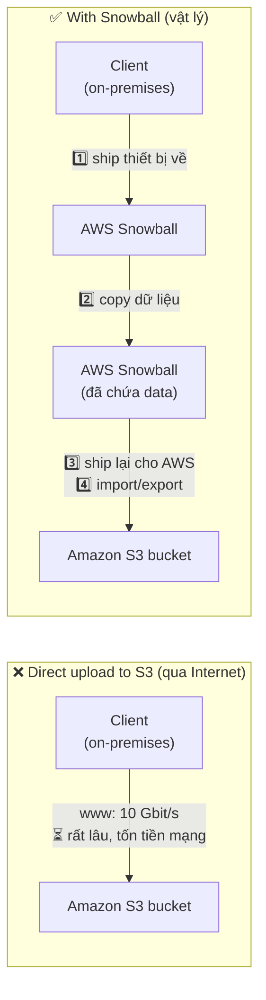

**Quy trình thực tế:**

1. Bạn tạo **job** trên AWS Console (Import into Amazon S3 / Export from Amazon S3)
2. AWS **ship thiết bị** đến địa chỉ của bạn (vài ngày)
3. Bạn **cắm vào mạng nội bộ**, dùng **AWS OpsHub** (giao diện đồ họa) hoặc **Snowball Client / AWS CLI** để copy dữ liệu
4. Bạn **ship trả lại** AWS (nhãn vận chuyển hiển thị sẵn trên màn hình e-ink của thiết bị)
5. AWS **import dữ liệu vào bucket S3** bạn chỉ định, rồi **xóa sạch (erase) thiết bị**

---

### ⭐⭐ Edge Computing là gì?

- ⭐⭐ **Xử lý dữ liệu NGAY TẠI NƠI NÓ ĐƯỢC TẠO RA (edge location)**
- **Edge location** ở đây nghĩa là: **một chiếc xe tải trên đường, một con tàu ngoài biển, một trạm khai mỏ dưới lòng đất...**
- ⭐⭐ Những nơi này **Internet hạn chế** và **KHÔNG có sức mạnh tính toán**
- ⭐ Ta đặt một **Snowball Edge** tại đó để làm edge computing
- ⭐⭐ **Snowball Edge Compute Optimized (chuyên cho use case này)** & Storage Optimized
- ⭐⭐ **Chạy được EC2 Instances hoặc Lambda functions ngay trên thiết bị**

**Use cases:** ⭐ **preprocess data** (tiền xử lý dữ liệu), **machine learning**, **transcoding media** (chuyển mã video).

> ⚠️ **Bẫy thi cực kỳ hay gặp:** Từ **"Edge Location"** có **HAI nghĩa hoàn toàn khác nhau** tùy ngữ cảnh:
> - Trong **CloudFront / Global Accelerator** → là **Points of Presence của AWS** trên toàn cầu
> - Trong **Snow Family** → là **địa điểm vật lý của KHÁCH HÀNG** (tàu, xe, mỏ) nơi mạng yếu
>
> Đọc kỹ đề: nếu có từ khóa **"limited/no internet connectivity"**, **"remote location"**, **"ship/truck/mine"** → đó là **Snowball Edge**, KHÔNG phải CloudFront.

---

## 174. AWS Snow Family Hands On

> 🖐️ Bài Hands On — **không có slide**. Đây là bài **chỉ xem, không làm được thật** (đặt hàng thiết bị vật lý sẽ tốn tiền và mất nhiều ngày). Dưới đây là các bước trên Console để bạn nắm giao diện.

### Các bước tham quan Console

1. Vào **AWS Console** → tìm **"AWS Snow Family"** (hoặc **Snowball**)
2. Bấm **Order an AWS Snow Family device** → wizard gồm các bước:

| Bước | Nội dung | Ghi chú |
|------|----------|---------|
| **1. Job type** | **Import into Amazon S3** / **Export from Amazon S3** / **Local compute and storage only** | ⭐ "Local compute and storage only" = **edge computing**, không truyền dữ liệu |
| **2. Shipping address** | Địa chỉ nhận thiết bị + tốc độ vận chuyển | Chọn quốc gia — ⚠️ **Việt Nam hiện KHÔNG nằm trong danh sách hỗ trợ** |
| **3. Device type** | **Snowball Edge Storage Optimized (210 TB)** / **Compute Optimized (28 TB)** | Xem lại bảng bài 173 |
| **4. Choose your storage** | Chọn **S3 bucket** đích để import | |
| **5. Features & options** | Bật **Amazon EC2 compute** nếu cần chạy instance trên thiết bị | Chọn sẵn **AMI** để nạp vào thiết bị |
| **6. Security** | Chọn **KMS key** để mã hóa dữ liệu trên thiết bị + **IAM role** | ⭐⭐ Dữ liệu **luôn được mã hóa** trên Snowball |
| **7. Notifications** | Chọn/ tạo **SNS topic** để nhận email cập nhật trạng thái job | Trạng thái: Job created → Preparing device → Shipped → Delivered → In transit to AWS → Importing → Completed |

3. **Review & Create job**

### AWS OpsHub ⭐

- ⭐ **AWS OpsHub** là **ứng dụng desktop miễn phí** (Windows / macOS) do AWS cung cấp
- Thay thế việc phải dùng CLI phức tạp — cho phép **unlock thiết bị, xem dung lượng, copy file, quản lý EC2 instance chạy trên Snowball** bằng **giao diện đồ họa**
- 💡 Nếu đề thi hỏi **"công cụ nào để quản lý thiết bị Snow Family tại chỗ?"** → **AWS OpsHub**

### Giá tham khảo

- Snowball Edge Storage Optimized: **~$300+ cho 10 ngày sử dụng đầu tiên**, cộng phí mỗi ngày phát sinh thêm
- ⭐⭐ **Data transfer IN từ Snowball vào S3 là MIỄN PHÍ** (giống mọi data transfer IN của AWS)

> ⚠️ **KHÔNG đặt hàng thiết bị thật** khi học — đây là dịch vụ tốn tiền và không nằm trong Free Tier.

---

## 175. Architecture: Snowball into Glacier

### ⭐⭐⭐ Vấn đề và giải pháp

- ⚠️⭐⭐⭐ **Snowball KHÔNG THỂ import trực tiếp vào Glacier!**
- ⭐⭐⭐ **Bạn PHẢI đi qua Amazon S3 trước, rồi kết hợp với S3 Lifecycle Policy**

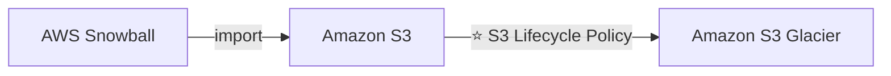

> ⭐⭐⭐ **Đây là một trong những câu hỏi ra thi chắc chắn nhất của cả chương.**
> Đề sẽ hỏi: *"Công ty muốn archive 200 TB dữ liệu từ on-premises vào S3 Glacier Deep Archive với chi phí thấp nhất. Kiến trúc nào đúng?"*
> → **Đáp án: Snowball → S3 → Lifecycle Policy → Glacier.**
> → **Đáp án SAI kinh điển: "Order a Snowball and import directly into Glacier"** — không tồn tại.

**Tại sao lại như vậy?** Glacier không có API endpoint kiểu S3 để Snowball ghi trực tiếp vào. S3 là "cửa vào" duy nhất, còn Glacier storage classes thực chất là **các storage class của S3** (S3 Glacier Instant Retrieval / Flexible Retrieval / Deep Archive), nên chuyển tầng bằng **Lifecycle Rule** là con đường tự nhiên.

---

## 176. Amazon FSx

### Amazon FSx – Overview ⭐⭐

- ⭐⭐ **Chạy các file system HIỆU NĂNG CAO của BÊN THỨ BA (3rd party) trên AWS**
- ⭐ **Fully managed service** — AWS lo hạ tầng, patching, backup

**4 loại FSx:**

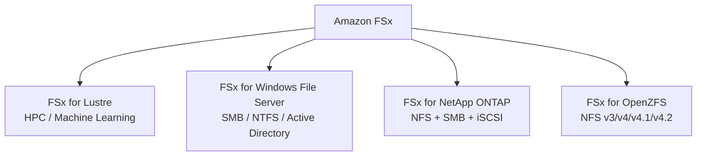

> ⭐⭐⭐ **Tại sao cần FSx khi đã có EFS?**
> **EFS chỉ hỗ trợ NFS và chỉ dành cho Linux.** Nếu đề bài nhắc tới **Windows**, **SMB**, **Active Directory**, **HPC**, **Lustre**, **ONTAP**, **ZFS** → **EFS là đáp án SAI**, phải chọn **FSx**.

---

### ⭐⭐⭐ Amazon FSx for Windows (File Server)

- ⭐⭐⭐ **File system share drive cho WINDOWS, fully managed**
- ⭐⭐⭐ **Hỗ trợ giao thức SMB & Windows NTFS**
- ⭐⭐⭐ **Tích hợp Microsoft Active Directory, ACLs, user quotas**
- ⭐⭐ **CÓ THỂ mount trên Linux EC2 instances** (đừng nhầm là chỉ Windows!)
- ⭐ Hỗ trợ **Microsoft's Distributed File System (DFS) Namespaces** — gộp file từ nhiều file system lại một không gian tên
- ⭐ **Scale tới hàng chục GB/s, hàng triệu IOPS, hàng trăm PB dữ liệu**

**Storage Options:** ⭐⭐

| Loại | Dùng cho |
|------|----------|
| **SSD** | ⭐ **Workload nhạy cảm với độ trễ** — databases, media processing, data analytics |
| **HDD** | ⭐ **Workload phổ thông rộng** — home directory, CMS |

- ⭐⭐ **Truy cập được từ hạ tầng on-premises (qua VPN hoặc Direct Connect)**
- ⭐⭐ **Cấu hình được Multi-AZ (high availability)**
- ⭐⭐ **Dữ liệu được backup HÀNG NGÀY vào S3**

> ⭐⭐⭐ **Từ khóa nhận diện trong đề:** *"Windows file share"*, *"SMB"*, *"NTFS"*, *"Active Directory"*, *"user quotas"*, *"migrate Windows file server to AWS"* → **FSx for Windows File Server**.

---

### ⭐⭐⭐ Amazon FSx for Lustre

- ⭐⭐ **Lustre là một loại parallel distributed file system, cho large-scale computing**
- 💡 Tên **"Lustre"** ghép từ **"Linux" + "cluster"**
- ⭐⭐⭐ **Use cases: Machine Learning, High Performance Computing (HPC)**
- ⭐ Video Processing, Financial Modeling, Electronic Design Automation
- ⭐⭐ **Scale tới hàng trăm GB/s, hàng triệu IOPS, độ trễ SUB-MILLISECOND (sub-ms)**

**Storage Options:** ⭐⭐

| Loại | Dùng cho |
|------|----------|
| **SSD** | ⭐ **Low-latency, IOPS intensive** — thao tác file **NHỎ & NGẪU NHIÊN** (small & random) |
| **HDD** | ⭐ **Throughput-intensive** — thao tác file **LỚN & TUẦN TỰ** (large & sequential) |

**⭐⭐⭐ Tích hợp liền mạch với S3 (Seamless integration with S3):**

- ⭐⭐⭐ **"Đọc S3 như một file system"** (thông qua FSx)
- ⭐⭐⭐ **Ghi kết quả tính toán ngược trở lại S3** (thông qua FSx)
- ⭐⭐ **Dùng được từ on-premises servers (qua VPN hoặc Direct Connect)**

> ⭐⭐⭐ **Từ khóa nhận diện:** *"HPC"*, *"high performance computing"*, *"machine learning training"*, *"sub-millisecond latency"*, *"hundreds of GB/s throughput"*, *"POSIX-compliant + S3 integration"* → **FSx for Lustre**.

---

### ⭐⭐⭐ FSx Lustre — File System Deployment Options

Đây là **bảng so sánh ra thi rất thường xuyên**:

| | **Scratch File System** | **Persistent File System** |
|---|---|---|
| **Kiểu lưu trữ** | ⭐⭐ **Temporary storage** (tạm thời) | ⭐⭐ **Long-term storage** (dài hạn) |
| **Replication** | ⭐⭐⭐ **KHÔNG replicate** — **mất dữ liệu nếu file server hỏng** | ⭐⭐⭐ **Replicate TRONG CÙNG MỘT AZ** |
| **Hiệu năng** | ⭐⭐ **High burst — NHANH GẤP 6 LẦN, 200 MBps mỗi TiB** | Thay thế file lỗi **trong vài phút** |
| **Use case** | ⭐⭐ **Xử lý ngắn hạn, tối ưu chi phí** | ⭐⭐ **Xử lý dài hạn, dữ liệu nhạy cảm** |

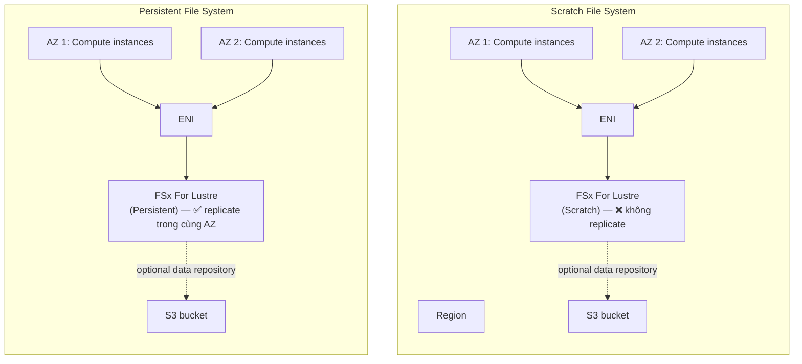

> ⚠️ **Bẫy thi:** Persistent chỉ replicate **TRONG CÙNG MỘT AZ**, **KHÔNG phải Multi-AZ**. Nếu đề hỏi "file system nào tự HA đa AZ?" → đó là **FSx for Windows (Multi-AZ)** hoặc **EFS**, không phải FSx for Lustre.

> 💡 **Mẹo nhớ:** **Scratch = "giấy nháp"** → dùng xong vứt, rẻ, nhanh (6x). **Persistent = "bền"** → giữ lại, có replicate.

---

### ⭐⭐ Amazon FSx for NetApp ONTAP

- ⭐⭐ **NetApp ONTAP được quản lý (managed) trên AWS**
- ⭐⭐⭐ **File System tương thích với NFS, SMB, VÀ iSCSI** — cả 3 giao thức!
- ⭐⭐ Dùng để **chuyển workload đang chạy trên ONTAP hoặc NAS lên AWS**

**Hoạt động với (Works with):** ⭐⭐ **Linux, Windows, macOS**, VMware Cloud on AWS, Amazon Workspaces & AppStream 2.0, Amazon EC2, ECS và EKS.

**Tính năng nổi bật:**

- ⭐⭐ **Storage TỰ ĐỘNG co giãn (shrinks or grows automatically)**
- ⭐ Snapshots, replication, low-cost, **compression và data de-duplication**
- ⭐⭐ **Point-in-time instantaneous cloning** — hữu ích để **test workload mới**

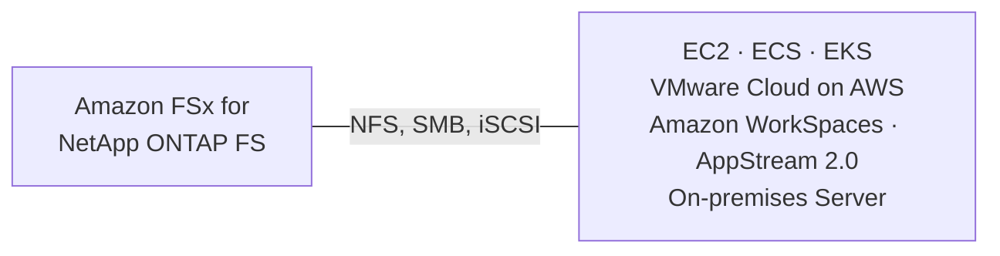

> ⭐⭐⭐ **Từ khóa nhận diện:** *"HIGH OS COMPATIBILITY"* (tương thích nhiều HĐH nhất), *"NFS + SMB + iSCSI"*, *"de-duplication"*, *"storage tự động co giãn"* → **FSx for NetApp ONTAP**.

---

### ⭐⭐ Amazon FSx for OpenZFS

- ⭐⭐ **OpenZFS file system được quản lý trên AWS**
- ⭐⭐ **Tương thích NFS (v3, v4, v4.1, v4.2)** — ⚠️ **CHỈ NFS**, không có SMB/iSCSI
- ⭐ Dùng để **chuyển workload đang chạy trên ZFS lên AWS**

**Hoạt động với:** Linux, Windows, macOS, VMware Cloud on AWS, Amazon Workspaces & AppStream 2.0, Amazon EC2, ECS và EKS.

- ⭐⭐⭐ **Lên tới 1,000,000 IOPS với độ trễ < 0.5 ms**
- ⭐ Snapshots, compression và **low-cost**
- ⭐⭐ **Point-in-time instantaneous cloning** — hữu ích để test workload mới

> ⭐⭐ **Phân biệt ONTAP vs OpenZFS** (câu hỏi rất hay bẫy):
> - Cần **nhiều giao thức (NFS + SMB + iSCSI)**, **de-duplication** → **ONTAP**
> - Cần **chỉ NFS**, **IOPS cực cao (1 triệu IOPS, <0.5ms)**, **chi phí thấp**, đang dùng **ZFS** → **OpenZFS**

---

### 📊 Bảng tổng hợp 4 loại FSx ⭐⭐⭐

| | **FSx for Windows** | **FSx for Lustre** | **FSx for NetApp ONTAP** | **FSx for OpenZFS** |
|---|---|---|---|---|
| **Giao thức** | **SMB** (+ NTFS) | **Lustre** (POSIX) | **NFS + SMB + iSCSI** | **NFS** (v3→v4.2) |
| **HĐH chính** | Windows (+ mount được Linux) | Linux | **Mọi HĐH** | Linux/Unix |
| **Use case chốt** | **Windows file share, Active Directory** | **HPC, Machine Learning** | **Tương thích HĐH cao nhất, migrate NAS** | **Migrate ZFS, IOPS cực cao** |
| **Tích hợp S3** | ❌ (backup daily vào S3) | ⭐⭐⭐ **CÓ — đọc/ghi S3 như file system** | ❌ | ❌ |
| **HA** | ⭐ **Multi-AZ** | Trong **1 AZ** (Persistent) | Multi-AZ | Multi-AZ |
| **Hiệu năng đỉnh** | 10s GB/s, triệu IOPS, 100s PB | **100s GB/s, sub-ms** | — | **1,000,000 IOPS, <0.5ms** |
| **Cloning tức thì** | ❌ | ❌ | ⭐ **Có** | ⭐ **Có** |

---

## 177. Amazon FSx - Hands On

> 🖐️ Bài Hands On — **không có slide**. Các bước dưới đây tóm tắt thao tác Console.

### Tạo FSx for Windows File Server

1. Console → tìm **FSx** → **Create file system**
2. Chọn loại file system:

| Lựa chọn | Ghi chú |
|----------|---------|
| **Amazon FSx for NetApp ONTAP** | |
| **Amazon FSx for OpenZFS** | |
| **Amazon FSx for Windows File Server** | ← chọn cái này để thử |
| **Amazon FSx for Lustre** | |

3. **Creation method**: **Quick create** (đơn giản) hoặc **Standard create** (đầy đủ tùy chọn)
4. **File system details**:
   - **File system name**: `my-fsx-windows`
   - ⭐ **Deployment type**: **Multi-AZ** (HA) hoặc **Single-AZ**
   - ⭐ **Storage type**: **SSD** hoặc **HDD**
   - **Storage capacity**: tối thiểu **32 GiB** (SSD)
   - **Throughput capacity**: ví dụ **8 MB/s** (hoặc để **Recommended**)
5. **Network & security**: chọn **VPC**, **Subnet**, **Security Group** (mở port **445 — SMB**)
6. ⭐⭐ **Windows authentication**: bắt buộc phải có **Microsoft Active Directory**
   - **AWS Managed Microsoft AD** (tạo qua AWS Directory Service) hoặc
   - **Self-managed Microsoft AD** (AD của bạn on-premises/trên EC2)
7. **Encryption**: chọn **KMS key** (mặc định `aws/fsx`)
8. **Backup**: bật **Daily automatic backup**, chọn cửa sổ thời gian và **retention period**
9. **Create file system** → mất **~20–30 phút** để tạo xong

### Mount file system

Sau khi tạo xong, FSx cho bạn một **DNS name** dạng `fs-0123456789abcdef.mydomain.com`:

```bash
# Trên Windows EC2 (PowerShell / File Explorer)
net use Z: \\fs-0123456789abcdef.mydomain.com\share

# Trên Linux EC2 (cần cài cifs-utils)
sudo yum install -y cifs-utils
sudo mkdir -p /mnt/fsx
sudo mount -t cifs //fs-0123456789abcdef.mydomain.com/share /mnt/fsx \
  -o vers=3.0,sec=ntlmsspi,user=Admin,domain=mydomain.com
```

Với **FSx for Lustre**, mount bằng Lustre client:

```bash
sudo amazon-linux-extras install -y lustre
sudo mkdir -p /mnt/fsx
sudo mount -t lustre -o noatime,flock fs-0123456789abcdef.fsx.us-east-1.amazonaws.com@tcp:/mountname /mnt/fsx
```

> ⚠️⚠️ **CẢNH BÁO CHI PHÍ — RẤT QUAN TRỌNG:**
> **Amazon FSx KHÔNG nằm trong Free Tier.** FSx for Windows với cấu hình nhỏ nhất đã tốn **~$1–2/ngày**, và **AWS Managed Microsoft AD tốn ~$0.40/giờ (~$290/tháng)**. Nếu bạn làm hands-on thật:
> 1. **Delete file system** ngay sau khi xem xong
> 2. **Delete Directory** trong **AWS Directory Service** — đây mới là thứ tốn tiền nhất, rất nhiều người quên!
>
> 💡 **Khuyến nghị:** với FSx, chỉ nên **xem video**, không nên tự tạo. Kiến thức thi nằm ở **khái niệm**, không ở thao tác.

---

## 178. Storage Gateway Overview

### ⭐⭐ Hybrid Cloud for Storage — Bối cảnh

- ⭐ **AWS đang đẩy mạnh "hybrid cloud"**: một phần hạ tầng **trên cloud**, một phần **on-premises**
- **Lý do phải hybrid:**
  - ⭐ **Long cloud migrations** — migrate mất nhiều năm
  - ⭐ **Security requirements** — yêu cầu bảo mật
  - ⭐ **Compliance requirements** — yêu cầu tuân thủ
  - ⭐ **IT strategy** — chiến lược IT của công ty
- ⭐⭐⭐ **Vấn đề: S3 là công nghệ lưu trữ ĐỘC QUYỀN (proprietary), KHÔNG giống EFS/NFS.** Vậy làm sao **expose dữ liệu S3 xuống on-premises?**
- ⭐⭐⭐ **→ AWS Storage Gateway!**

### AWS Storage Cloud Native Options

| Loại lưu trữ | Dịch vụ AWS |
|---|---|
| **Block** | **Amazon EBS**, **EC2 Instance Store** |
| **File** | **Amazon EFS**, **Amazon FSx** |
| **Object** | **Amazon S3**, **Amazon Glacier** |

> ⭐ Slide này nhằm nhắc: các dịch vụ trên đều là **cloud-native** — muốn nối chúng với on-premises thì cần **Storage Gateway**.

---

### ⭐⭐⭐ AWS Storage Gateway là gì?

- ⭐⭐⭐ **Cầu nối (bridge) giữa dữ liệu on-premises và dữ liệu trên cloud**

**Use cases:** ⭐⭐

- **Disaster recovery** (khôi phục thảm họa)
- **Backup & restore**
- **Tiered storage** (phân tầng lưu trữ)
- ⭐⭐ **On-premises cache & low-latency files access** (cache tại chỗ, truy cập file độ trễ thấp)

**⭐⭐⭐ 3 loại Storage Gateway — PHẢI THUỘC LÒNG:**

1. **S3 File Gateway**
2. **Volume Gateway**
3. **Tape Gateway**

---

### ⭐⭐⭐ 1️⃣ Amazon S3 File Gateway

- ⭐⭐⭐ **Các bucket S3 đã cấu hình được truy cập bằng giao thức NFS và SMB**
- ⭐⭐ **Dữ liệu được dùng gần đây nhất (most recently used) được CACHE trong file gateway**
- ⭐⭐ **Hỗ trợ: S3 Standard, S3 Standard-IA, S3 One Zone-IA, S3 Intelligent-Tiering**
- ⭐⭐⭐ **Chuyển sang S3 Glacier bằng LIFECYCLE POLICY** (không ghi thẳng vào Glacier được)
- ⭐⭐ **Truy cập bucket bằng IAM roles cho từng File Gateway**
- ⭐⭐ **Giao thức SMB tích hợp với Active Directory (AD)** để xác thực người dùng

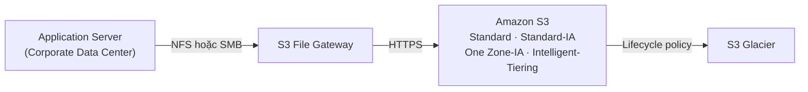

> ⭐⭐⭐ **Từ khóa nhận diện:** *"truy cập S3 bằng NFS/SMB"*, *"file share on-premises nhưng lưu trên S3"*, *"cache dữ liệu S3 tại chỗ"* → **S3 File Gateway**.

> ⚠️ **Lưu ý bổ sung (ngoài slide):** còn có **FSx File Gateway** — cho phép truy cập **FSx for Windows File Server** từ on-premises kèm cache tại chỗ. Bài 182 sẽ nhắc lại.

---

### ⭐⭐⭐ 2️⃣ Volume Gateway

- ⭐⭐⭐ **Block storage bằng giao thức iSCSI, được hậu thuẫn bởi S3**
- ⭐⭐⭐ **Được backed bởi EBS snapshots — giúp RESTORE các volume on-premises!**

**⭐⭐⭐ Hai chế độ — bảng so sánh hay ra thi:**

| | **Cached volumes** | **Stored volumes** |
|---|---|---|
| **Dữ liệu chính nằm ở** | ⭐⭐ **S3** (trên cloud) | ⭐⭐ **On-premises (toàn bộ dataset)** |
| **On-premises giữ gì** | Chỉ **cache dữ liệu gần đây** | **Toàn bộ dữ liệu** |
| **Mục đích** | ⭐⭐ **Low latency access to most recent data** | ⭐⭐ **Scheduled backups to S3** |
| **Ưu điểm** | Tiết kiệm dung lượng on-premises | **Truy cập toàn bộ dữ liệu cực nhanh kể cả mất mạng** |

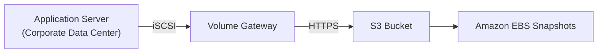

> ⭐⭐⭐ **Từ khóa nhận diện:** *"iSCSI"*, *"block storage"*, *"backup volume on-premises lên cloud"*, *"restore thành EBS volume"* → **Volume Gateway**.
>
> 💡 **Mẹo nhớ:** **Cached = dữ liệu ở cloud, cache ở nhà. Stored = dữ liệu ở nhà, backup lên cloud.**

---

### ⭐⭐⭐ 3️⃣ Tape Gateway

- ⭐ **Một số công ty vẫn có quy trình backup bằng BĂNG TỪ VẬT LÝ (physical tapes)** (!)
- ⭐⭐⭐ **Với Tape Gateway, công ty dùng CHÍNH quy trình cũ đó, nhưng trên cloud**
- ⭐⭐⭐ **Virtual Tape Library (VTL)** được hậu thuẫn bởi **Amazon S3 và Glacier**
- ⭐⭐ **Backup dữ liệu bằng quy trình tape-based sẵn có (qua giao diện iSCSI)**
- ⭐ **Hoạt động với các phần mềm backup hàng đầu** (Veeam, Commvault, NetBackup, Backup Exec...)

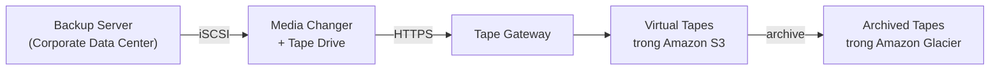

> ⭐⭐⭐ **Từ khóa nhận diện:** *"physical tape"*, *"tape-based backup process"*, *"Virtual Tape Library (VTL)"*, *"giữ nguyên phần mềm backup hiện tại"* → **Tape Gateway**.

---

### ⭐⭐⭐ Sơ đồ tổng hợp AWS Storage Gateway

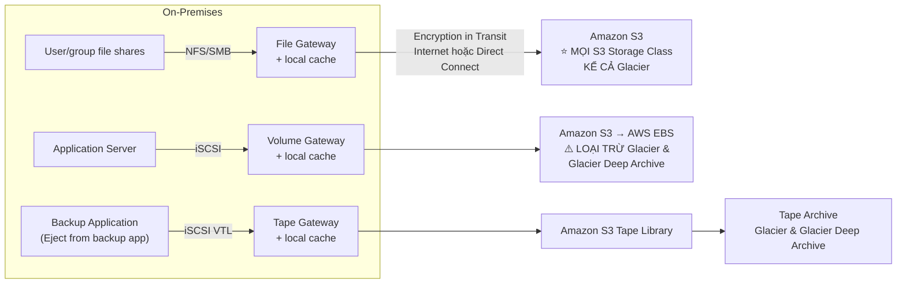

**⭐⭐⭐ Bảng chốt 3 loại Gateway:**

| Gateway | Giao thức | Loại lưu trữ | Đích trên AWS | Storage Class hỗ trợ |
|---|---|---|---|---|
| **S3 File Gateway** | **NFS / SMB** | **File** | Amazon S3 | ⭐ **Mọi class, kể cả Glacier** |
| **Volume Gateway** | **iSCSI** | **Block** | S3 → **EBS Snapshots** | ⚠️ **TRỪ Glacier & Glacier Deep Archive** |
| **Tape Gateway** | **iSCSI VTL** | **Tape (ảo)** | S3 Tape Library | **S3 + Glacier & Deep Archive** |

- ⭐⭐ **Cả 3 đều có LOCAL CACHE** tại on-premises
- ⭐⭐ **Mã hóa khi truyền (Encryption in Transit)** qua **Internet hoặc Direct Connect**

**⭐⭐ Gateway Deployment Options:** cài Storage Gateway dưới dạng **máy ảo (VM)** trên **VMware, Hyper-V, KVM** tại on-premises.

> ⚠️ **Bổ sung (ngoài slide, vẫn hay ra thi):** Nếu on-premises **không có hạ tầng ảo hóa**, AWS bán **Storage Gateway Hardware Appliance** — một **thiết bị vật lý cắm sẵn** để chạy gateway. Từ khóa: *"no virtualization infrastructure on-premises"* → **Hardware Appliance**.

---

## 179. Storage Gateway Hands On

> 🖐️ Bài Hands On — **không có slide**. Đây cũng là bài **chỉ xem** vì cần hạ tầng on-premises thật.

### Các bước trên Console

1. Console → tìm **Storage Gateway** → **Create gateway**
2. **Step 1 — Set up gateway**:
   - **Gateway name**: `my-storage-gateway`
   - **Gateway time zone**
   - ⭐⭐ **Gateway type** — chọn 1 trong 4:

| Gateway type | Mô tả trên Console |
|---|---|
| **Amazon S3 File Gateway** | Lưu file dưới dạng object trong S3, truy cập qua NFS/SMB |
| **Amazon FSx File Gateway** | Truy cập FSx for Windows File Server từ on-premises kèm cache |
| **Tape Gateway** | Virtual Tape Library thay tape vật lý |
| **Volume Gateway** | Block volume qua iSCSI (Cached / Stored) |

   - ⭐⭐ **Host platform** — nơi chạy gateway:
     - **VMware ESXi** — tải file `.ova`
     - **Microsoft Hyper-V** — tải file `.zip`
     - **Linux KVM** — tải file `.qcow2`
     - **Amazon EC2** — AWS tạo sẵn instance chạy gateway (dùng để test)
     - **Hardware Appliance** — thiết bị vật lý mua từ AWS

3. **Step 2 — Connect to AWS**: nhập **IP address** của gateway VM, hoặc **activation key**
   - ⭐ Chọn **Service endpoint**: **Publicly accessible** / **VPC hosted (PrivateLink)**
4. **Step 3 — Activate gateway**: AWS kết nối và kích hoạt
5. **Step 4 — Configure local disks**: gán đĩa cho **Cache** và **Upload buffer**
   - ⭐ **Cache disk**: tối thiểu **150 GiB**
   - ⭐ **Upload buffer**: tối thiểu **150 GiB**
6. Sau khi gateway **Running** → tạo **File share** (với S3 File Gateway) và chọn **S3 bucket**, **IAM role**, **giao thức NFS/SMB**

7. Mount thử từ client:

```bash
# NFS (Linux)
sudo mount -t nfs -o nolock,hard <gateway-ip>:/<bucket-name> /mnt/sgw

# SMB (Windows)
net use Z: \\<gateway-ip>\<share-name>
```

> ⚠️ **CẢNH BÁO CHI PHÍ:** Nếu deploy gateway lên **Amazon EC2** để test, instance được đề xuất là **m5.xlarge trở lên** kèm **nhiều EBS volume lớn (150 GiB × 2)** → **rất tốn tiền, KHÔNG thuộc Free Tier**. Nếu đã tạo, phải **Delete gateway** + **Terminate EC2 instance** + **Delete EBS volumes**.

---

## 180. AWS Transfer Family

### ⭐⭐⭐ AWS Transfer Family là gì?

- ⭐⭐⭐ **Dịch vụ fully-managed để TRUYỀN FILE VÀO/RA Amazon S3 hoặc Amazon EFS bằng giao thức FTP**

**⭐⭐⭐ Các giao thức được hỗ trợ:**

| Dịch vụ | Giao thức đầy đủ |
|---|---|
| **AWS Transfer for FTP** | **File Transfer Protocol (FTP)** |
| **AWS Transfer for FTPS** | **File Transfer Protocol over SSL (FTPS)** |
| **AWS Transfer for SFTP** | **Secure File Transfer Protocol (SFTP)** |

- ⭐⭐ **Managed infrastructure, Scalable, Reliable, Highly Available (multi-AZ)**
- ⭐⭐ **Tính phí theo ENDPOINT ĐƯỢC CẤP PHÁT / GIỜ + dữ liệu truyền theo GB**
- ⭐⭐ **Lưu trữ và quản lý credentials của user ngay trong dịch vụ**
- ⭐⭐⭐ **Tích hợp với hệ thống xác thực sẵn có: Microsoft Active Directory, LDAP, Okta, Amazon Cognito, custom**

**Usage:** ⭐ chia sẻ file, **public datasets**, CRM, ERP...

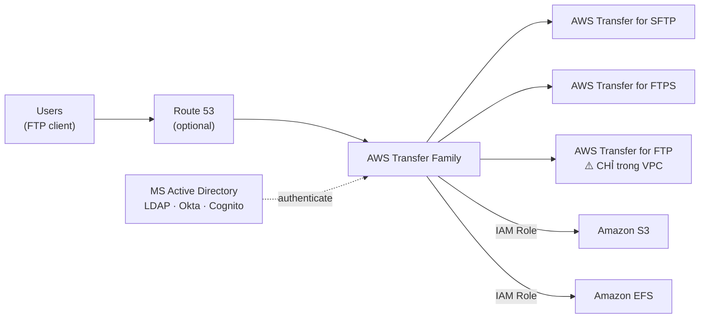

> ⭐⭐⭐ **BẪY THI QUAN TRỌNG:** **AWS Transfer for FTP CHỈ dùng được TRONG VPC** (`only within VPC`), vì FTP thuần **không mã hóa**. Muốn expose ra Internet công cộng thì phải dùng **FTPS hoặc SFTP**.

> ⭐⭐⭐ **Từ khóa nhận diện:** *"khách hàng/đối tác vẫn dùng FTP client"*, *"không muốn đổi quy trình FTP hiện tại"*, *"cần FTP/SFTP/FTPS interface cho S3"* → **AWS Transfer Family**.

---

## 181. DataSync - Overview

### ⭐⭐⭐ AWS DataSync là gì?

- ⭐⭐⭐ **Di chuyển LƯỢNG LỚN dữ liệu vào và ra AWS**

**⭐⭐⭐ Hai hướng di chuyển — phân biệt CÓ/KHÔNG cần agent:**

| Hướng | Giao thức nguồn | Agent? |
|---|---|---|
| **On-premises / cloud khác → AWS** | **NFS, SMB, HDFS, S3 API…** | ⭐⭐⭐ **CẦN agent** |
| **AWS → AWS (giữa các storage service khác nhau)** | — | ⭐⭐⭐ **KHÔNG cần agent** |

**⭐⭐ Có thể đồng bộ (synchronize) tới:**

- ⭐⭐ **Amazon S3 — MỌI storage class, KỂ CẢ Glacier**
- ⭐⭐ **Amazon EFS**
- ⭐⭐ **Amazon FSx (Windows, Lustre, NetApp, OpenZFS...)**

**Đặc điểm khác:**

- ⭐⭐⭐ **Replication tasks lên lịch được theo GIỜ, NGÀY, TUẦN** — ⚠️ **KHÔNG phải liên tục/real-time!**
- ⭐⭐⭐ **File permissions và metadata ĐƯỢC BẢO TOÀN (preserved)** — NFS POSIX, SMB…
- ⭐⭐ **Một agent task dùng được tới 10 Gbps, có thể đặt bandwidth limit**

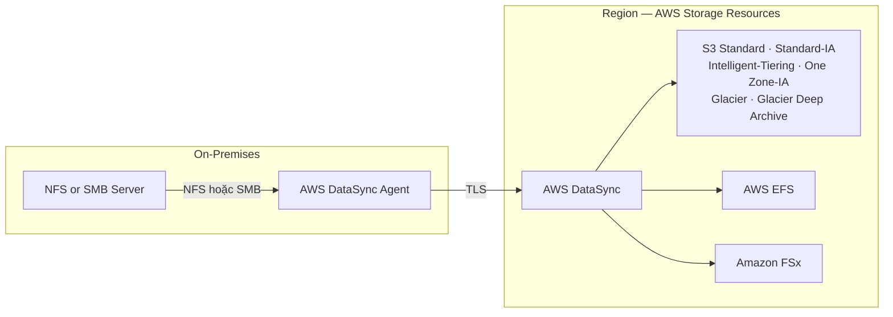

**AWS → AWS (không cần agent):**

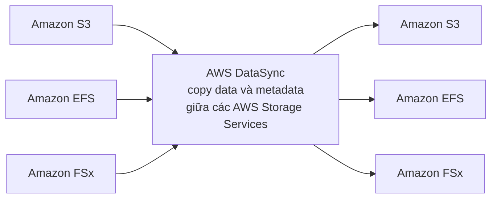

> ⭐⭐⭐ **BA BẪY THI CỦA DATASYNC:**
> 1. ⚠️ **"Real-time / continuous sync" → KHÔNG PHẢI DataSync.** DataSync chạy theo **lịch (hourly/daily/weekly)**. Nếu đề nói "real-time replication" → nghĩ tới **S3 Replication** hoặc **Storage Gateway**.
> 2. ⚠️ **AWS → AWS thì KHÔNG cần agent.** Đáp án nào bảo "cài agent để copy từ S3 sang EFS" là **SAI**.
> 3. ⭐ **DataSync BẢO TOÀN metadata và permissions** — đây là điểm khác biệt lớn nhất với `aws s3 sync` của CLI. Đề hay hỏi *"migrate và giữ nguyên quyền POSIX/SMB"* → **DataSync**.

> ⭐⭐ **Phân biệt DataSync vs Snowball:**
> - **Có đường truyền tốt, di chuyển định kỳ, giữ metadata** → **DataSync**
> - **Không có đường truyền / truyền mất hơn 1 tuần** → **Snowball**
> - 💡 **Kết hợp được:** Có thể chạy **DataSync agent NGAY TRÊN thiết bị Snowball Edge** để copy dữ liệu vào thiết bị.

---

## 182. All AWS Storage Options Compared

### ⭐⭐⭐ Storage Comparison — Bảng học thuộc

Đây là slide **tổng kết toàn bộ storage của khóa học** — hãy đọc đi đọc lại trước ngày thi:

| Dịch vụ | Mô tả một dòng (theo slide) |
|---|---|
| **S3** | ⭐⭐⭐ **Object Storage** |
| **S3 Glacier** | ⭐⭐⭐ **Object Archival** (lưu trữ dài hạn) |
| **EBS volumes** | ⭐⭐⭐ **Network storage cho MỘT EC2 instance TẠI MỘT THỜI ĐIỂM** |
| **Instance Storage** | ⭐⭐⭐ **Lưu trữ VẬT LÝ gắn trực tiếp vào EC2 instance (IOPS CAO)** |
| **EFS** | ⭐⭐⭐ **Network File System cho LINUX instances, POSIX filesystem** |
| **FSx for Windows** | ⭐⭐⭐ **Network File System cho WINDOWS servers** |
| **FSx for Lustre** | ⭐⭐⭐ **High Performance Computing (HPC) Linux file system** |
| **FSx for NetApp ONTAP** | ⭐⭐⭐ **High OS Compatibility** (tương thích nhiều HĐH) |
| **FSx for OpenZFS** | ⭐⭐ **Managed ZFS file system** |
| **Storage Gateway** | ⭐⭐⭐ **S3 & FSx File Gateway, Volume Gateway (cache & stored), Tape Gateway** |
| **Transfer Family** | ⭐⭐⭐ **Giao diện FTP, FTPS, SFTP đặt lên trên Amazon S3 hoặc Amazon EFS** |
| **DataSync** | ⭐⭐⭐ **Lên lịch đồng bộ dữ liệu từ on-premises lên AWS, hoặc AWS sang AWS** |
| **Snowcone / Snowball / Snowmobile** | ⭐⭐⭐ **Di chuyển lượng lớn dữ liệu lên cloud, BẰNG ĐƯỜNG VẬT LÝ** |
| **Database** | ⭐⭐ **Cho workload đặc thù, thường có indexing và querying** |

---

### 🧭 Cây quyết định chọn Storage ⭐⭐⭐

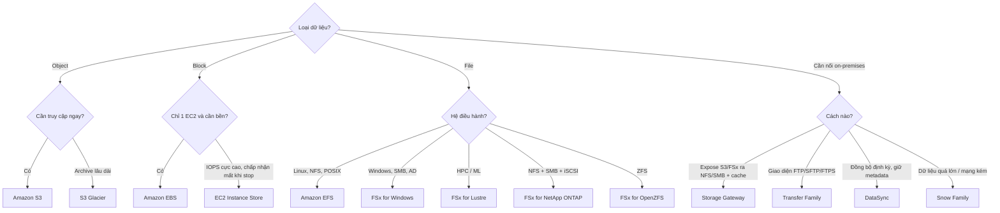

---

### 📌 Cheat Sheet từ khóa → dịch vụ ⭐⭐⭐

| Từ khóa trong đề | Đáp án |
|---|---|
| *"Petabytes, mạng kém, mất > 1 tuần"* | **Snowball Edge** |
| *"Xử lý dữ liệu ở tàu/xe/mỏ, không có Internet"* | **Snowball Edge Compute Optimized** |
| *"Import vào Glacier từ on-premises"* | **Snowball → S3 → Lifecycle Policy → Glacier** |
| *"Windows file share, SMB, Active Directory"* | **FSx for Windows File Server** |
| *"HPC, Machine Learning, sub-millisecond"* | **FSx for Lustre** |
| *"Xử lý ngắn hạn, tối ưu chi phí, chấp nhận mất data"* | **FSx for Lustre — Scratch** |
| *"NFS + SMB + iSCSI, tương thích HĐH cao nhất"* | **FSx for NetApp ONTAP** |
| *"1 triệu IOPS, <0.5ms, đang dùng ZFS"* | **FSx for OpenZFS** |
| *"Truy cập S3 bằng NFS/SMB từ on-premises"* | **S3 File Gateway** |
| *"iSCSI block storage, restore thành EBS snapshot"* | **Volume Gateway** |
| *"Toàn bộ dataset ở on-premises, backup định kỳ lên S3"* | **Volume Gateway — Stored volumes** |
| *"Chỉ cache dữ liệu gần đây, data chính trên S3"* | **Volume Gateway — Cached volumes** |
| *"Băng từ vật lý, Virtual Tape Library"* | **Tape Gateway** |
| *"Không có hạ tầng ảo hóa on-premises"* | **Storage Gateway Hardware Appliance** |
| *"Partner vẫn dùng FTP client"* | **AWS Transfer Family** |
| *"FTP ra Internet công cộng"* | ⚠️ **SFTP hoặc FTPS** (FTP chỉ trong VPC) |
| *"Đồng bộ định kỳ, giữ nguyên POSIX/SMB permissions"* | **DataSync** |
| *"Copy giữa EFS và FSx, không muốn cài agent"* | **DataSync (AWS→AWS, không cần agent)** |

---

## Trắc nghiệm 13: AWS Storage Extras Quiz

### Các điểm dễ bị bẫy

| Câu hỏi thường gặp | Đáp án đúng | Vì sao đáp án khác sai |
|---|---|---|
| Migrate 100 TB, đường truyền 100 Mbps, cách nhanh nhất? | **Snowball Edge** (mất 124 ngày nếu qua mạng) | Direct upload / DataSync đều phải đi qua chính đường truyền chậm đó |
| Muốn import trực tiếp vào Glacier bằng Snowball? | ❌ **Không được** — phải qua **S3 + Lifecycle Policy** | Snowball chỉ nói chuyện được với S3 |
| Snowball Edge Storage Optimized có bao nhiêu TB? | **210 TB** (Compute Optimized: **28 TB**) | Nhớ cả hai cùng 104 vCPU / 416 GB RAM |
| Cần chạy Lambda/EC2 tại nơi không có Internet? | **Snowball Edge (edge computing)** | CloudFront Edge Location là hạ tầng AWS, không đặt tại chỗ khách |
| Windows app cần file share, có Active Directory? | **FSx for Windows File Server** | **EFS chỉ NFS/Linux** — đáp án bẫy số 1 |
| FSx for Windows có mount được trên Linux không? | ✅ **CÓ** | Đừng chọn "không" |
| HPC cần throughput hàng trăm GB/s và đọc dữ liệu từ S3? | **FSx for Lustre** | EFS không đạt được throughput này, cũng không "read S3 as file system" |
| FSx for Lustre Scratch có replicate không? | ❌ **KHÔNG** — mất data nếu file server hỏng | Persistent mới replicate, và **chỉ trong cùng 1 AZ** |
| Scratch nhanh hơn bao nhiêu? | **6x, 200 MBps mỗi TiB** | |
| Cần NFS, SMB **và** iSCSI cùng lúc? | **FSx for NetApp ONTAP** | OpenZFS **chỉ NFS** |
| Cần 1,000,000 IOPS, latency < 0.5ms, đang dùng ZFS? | **FSx for OpenZFS** | |
| Muốn expose S3 ra on-premises qua NFS/SMB? | **S3 File Gateway** | Không thể mount S3 trực tiếp — S3 là proprietary |
| Cần restore volume on-premises từ backup trên cloud? | **Volume Gateway** (backed bởi EBS snapshots) | File Gateway không tạo EBS snapshot |
| Đang dùng phần mềm backup ra băng từ, muốn lên cloud mà không đổi quy trình? | **Tape Gateway (VTL)** | |
| Volume Gateway có ghi vào Glacier được không? | ❌ **KHÔNG** — **trừ Glacier & Glacier Deep Archive** | File Gateway và Tape Gateway thì được |
| Storage Gateway deploy ở đâu? | **VM trên VMware / Hyper-V / KVM** (hoặc EC2, Hardware Appliance) | |
| Khách hàng upload file bằng FTP client, lưu vào S3? | **AWS Transfer Family** | |
| AWS Transfer for **FTP** dùng ở đâu? | ⚠️ **CHỈ trong VPC** | Ra Internet phải dùng **FTPS/SFTP** |
| Transfer Family tính phí thế nào? | **Theo endpoint được cấp phát / giờ + data transfer theo GB** | |
| DataSync có real-time không? | ❌ **KHÔNG** — chỉ **hourly / daily / weekly** | Muốn near real-time: **S3 Replication** |
| Copy từ EFS sang FSx, cần agent không? | ❌ **KHÔNG** — AWS→AWS không cần agent | Agent chỉ cần cho **on-premises → AWS** |
| Migrate NAS lên AWS và **giữ nguyên permissions**? | **DataSync** (preserve NFS POSIX / SMB metadata) | `aws s3 sync` mất metadata |
| Một DataSync agent task tối đa bao nhiêu? | **10 Gbps** (đặt được bandwidth limit) | |
| DataSync sync được vào Glacier không? | ✅ **CÓ** — mọi S3 storage class kể cả Glacier | |

---

### Checklist tự kiểm tra trước khi làm quiz

- [ ] Thuộc **quy tắc 1 tuần**: truyền qua mạng **> 1 tuần → Snowball**
- [ ] Nhớ **210 TB / 28 TB**, cả hai **104 vCPU / 416 GB**
- [ ] Nhớ **Snowball KHÔNG import thẳng vào Glacier** → **S3 + Lifecycle Policy**
- [ ] Phân biệt **Edge Location** trong Snow Family vs trong CloudFront
- [ ] Thuộc **4 loại FSx** và từ khóa nhận diện của từng loại
- [ ] Nhớ **FSx for Lustre tích hợp S3** (đọc/ghi S3 như file system) — chỉ Lustre có
- [ ] Nhớ **Scratch (không replicate, 6x, 200MBps/TiB)** vs **Persistent (replicate trong CÙNG 1 AZ)**
- [ ] Nhớ **ONTAP = NFS+SMB+iSCSI**, **OpenZFS = chỉ NFS**
- [ ] Thuộc **3 loại Storage Gateway** + giao thức của từng loại (**NFS/SMB · iSCSI · iSCSI VTL**)
- [ ] Nhớ **Volume Gateway KHÔNG hỗ trợ Glacier & Deep Archive**
- [ ] Phân biệt **Cached volumes** (data trên S3) vs **Stored volumes** (data ở on-premises)
- [ ] Nhớ **AWS Transfer for FTP chỉ dùng trong VPC**
- [ ] Nhớ **DataSync KHÔNG real-time** (hourly/daily/weekly) và **AWS→AWS không cần agent**
- [ ] Nhớ **DataSync bảo toàn file permissions & metadata**
- [ ] Đọc lại bảng **Storage Comparison** ở bài 182 ít nhất 2 lần

---

## Thuật ngữ Anh — Việt

| Tiếng Anh | Tiếng Việt |
|---|---|
| Snow Family | Họ thiết bị Snow (di chuyển dữ liệu vật lý) |
| Snowball Edge | Thiết bị Snowball phiên bản Edge |
| Storage Optimized / Compute Optimized | Tối ưu lưu trữ / Tối ưu tính toán |
| Portable device | Thiết bị di động, xách tay |
| Petabyte (PB) | 1.000 TB |
| Data migration | Di chuyển dữ liệu |
| Limited connectivity | Kết nối hạn chế |
| Shared bandwidth | Băng thông dùng chung |
| Connection stability | Độ ổn định kết nối |
| Edge computing | Điện toán biên (xử lý ngay tại nơi sinh dữ liệu) |
| Transcoding media | Chuyển mã dữ liệu đa phương tiện |
| Preprocess data | Tiền xử lý dữ liệu |
| Import / Export job | Tác vụ nhập / xuất dữ liệu |
| AWS OpsHub | Ứng dụng desktop quản lý thiết bị Snow |
| Lifecycle Policy | Chính sách vòng đời dữ liệu |
| Object Archival | Lưu trữ dài hạn dạng object |
| Amazon FSx | Dịch vụ file system bên thứ ba được quản lý |
| Fully managed service | Dịch vụ được quản lý hoàn toàn |
| File system share drive | Ổ đĩa chia sẻ qua file system |
| SMB protocol | Giao thức chia sẻ file của Windows |
| NTFS | Hệ thống tệp của Windows |
| Active Directory (AD) | Dịch vụ thư mục của Microsoft |
| ACLs (Access Control Lists) | Danh sách kiểm soát truy cập |
| User quotas | Hạn mức dung lượng cho từng người dùng |
| DFS Namespaces | Không gian tên hệ thống tệp phân tán |
| Latency sensitive | Nhạy cảm với độ trễ |
| Throughput-intensive | Thiên về băng thông lớn |
| IOPS intensive | Thiên về số thao tác đọc/ghi mỗi giây |
| Lustre | File system phân tán song song (Linux + cluster) |
| Parallel distributed file system | Hệ thống tệp phân tán song song |
| High Performance Computing (HPC) | Điện toán hiệu năng cao |
| Sub-millisecond latency | Độ trễ dưới một phần nghìn giây |
| Scratch File System | Hệ thống tệp tạm (không replicate) |
| Persistent File System | Hệ thống tệp bền (có replicate) |
| High burst | Bùng nổ hiệu năng cao trong thời gian ngắn |
| Replication | Sao chép dữ liệu |
| NetApp ONTAP | Hệ điều hành lưu trữ của NetApp |
| iSCSI | Giao thức lưu trữ block qua mạng IP |
| NAS (Network Attached Storage) | Thiết bị lưu trữ gắn mạng |
| Data de-duplication | Khử trùng lặp dữ liệu |
| Compression | Nén dữ liệu |
| Point-in-time instantaneous cloning | Nhân bản tức thời tại một thời điểm |
| OpenZFS | Hệ thống tệp ZFS mã nguồn mở |
| Hybrid cloud | Đám mây lai (kết hợp cloud và on-premises) |
| On-premises | Tại chỗ, trong trung tâm dữ liệu của công ty |
| Compliance requirements | Yêu cầu tuân thủ quy định |
| Proprietary technology | Công nghệ độc quyền |
| Storage Gateway | Cổng lưu trữ nối on-premises với cloud |
| Bridge | Cầu nối |
| Disaster recovery | Khôi phục sau thảm họa |
| Tiered storage | Lưu trữ phân tầng |
| Local cache | Bộ đệm tại chỗ |
| Most recently used data | Dữ liệu được dùng gần đây nhất |
| File Gateway | Cổng dạng tệp |
| Volume Gateway | Cổng dạng ổ đĩa (block) |
| Tape Gateway | Cổng dạng băng từ |
| Cached volumes | Ổ đĩa dạng cache (dữ liệu chính trên cloud) |
| Stored volumes | Ổ đĩa dạng lưu trữ (dữ liệu chính tại chỗ) |
| Virtual Tape Library (VTL) | Thư viện băng từ ảo |
| Physical tapes | Băng từ vật lý |
| Backup software vendors | Nhà cung cấp phần mềm sao lưu |
| Encryption in Transit | Mã hóa khi truyền |
| Direct Connect | Kết nối riêng trực tiếp tới AWS |
| Hardware Appliance | Thiết bị phần cứng chuyên dụng |
| Gateway Deployment Options | Các lựa chọn triển khai gateway |
| AWS Transfer Family | Dịch vụ truyền file qua giao thức FTP |
| FTP / FTPS / SFTP | Giao thức truyền tệp / qua SSL / bảo mật |
| Provisioned endpoint | Điểm cuối được cấp phát |
| Credentials | Thông tin đăng nhập |
| LDAP / Okta / Cognito | Các hệ thống xác thực người dùng |
| Public datasets | Tập dữ liệu công khai |
| AWS DataSync | Dịch vụ đồng bộ dữ liệu lên AWS |
| DataSync Agent | Tác nhân cài tại on-premises |
| HDFS | Hệ thống tệp phân tán của Hadoop |
| Replication task | Tác vụ sao chép theo lịch |
| Scheduled hourly / daily / weekly | Lên lịch theo giờ / ngày / tuần |
| File permissions & metadata | Quyền truy cập tệp và siêu dữ liệu |
| POSIX | Chuẩn giao diện hệ điều hành kiểu Unix |
| Bandwidth limit | Giới hạn băng thông |
| Block / File / Object storage | Lưu trữ dạng khối / tệp / đối tượng |

---

*Ghi chú: các phần Hands On (bài 174, 177, 179) được tóm tắt lại các bước thao tác chính trên AWS Console — giao diện có thể thay đổi theo thời gian, logic và khái niệm vẫn giữ nguyên. ⚠️ **Cả ba bài Hands On của chương này đều là dịch vụ TỐN TIỀN và KHÔNG thuộc Free Tier**: Snowball tính phí theo job + ngày sử dụng; **Amazon FSx tốn ~$1–2/ngày và AWS Managed Microsoft AD tốn ~$290/tháng** (nhớ xóa cả Directory trong AWS Directory Service, không chỉ file system); Storage Gateway chạy trên EC2 cần **m5.xlarge + 2 EBS volume 150 GiB**. 💡 **Khuyến nghị: chỉ XEM video, không tự tạo tài nguyên thật cho chương này** — toàn bộ kiến thức ra thi nằm ở khái niệm và từ khóa nhận diện, không ở thao tác Console. ⚠️ Slide v48 đã lược bỏ **Snowcone** và **Snowmobile** (AWS ngừng cung cấp), nhưng bài 182 vẫn nhắc tên — chỉ cần nhận diện, đáp án chuẩn hiện nay luôn là **Snowball Edge**.*
