# Phần 17 — Decoupling Applications: SQS, SNS, Kinesis, Active MQ

> Khóa học: *Ultimate AWS Certified Solutions Architect Associate 2026* (Stéphane Maarek) — SAA-C03
> Nguồn tham chiếu: `AWS Certified Solutions Architect Slides v48.pdf` (phần "SQS, SNS & Kinesis")
> Code kèm theo: `code_v2025-10-27/sqs/sqs.sh`, `code_v2025-10-27/kinesis/kinesis-data-streams.sh`

---

## Mục lục

| # | Bài giảng | Thời lượng | Loại |
|---|-----------|-----------|------|
| 183 | [Introduction to Messaging](#183-introduction-to-messaging) | 3 phút | Video |
| 184 | [Amazon SQS - Standard Queues Overview](#184-amazon-sqs---standard-queues-overview) | 11 phút | Video |
| 185 | [SQS - Standard Queue Hands On](#185-sqs---standard-queue-hands-on) | 6 phút | Video |
| 186 | [SQS - Message Visibility Timeout](#186-sqs---message-visibility-timeout) | 5 phút | Video |
| 187 | [SQS - Long Polling](#187-sqs---long-polling) | 1 phút | Video |
| 188 | [SQS - FIFO Queues](#188-sqs---fifo-queues) | 3 phút | Video |
| 189 | [SQS + Auto Scaling Group](#189-sqs--auto-scaling-group) | 5 phút | Video |
| 190 | [Amazon Simple Notification Service (AWS SNS)](#190-amazon-simple-notification-service-aws-sns) | 4 phút | Video |
| 191 | [SNS and SQS - Fan Out Pattern](#191-sns-and-sqs---fan-out-pattern) | 6 phút | Video |
| 192 | [SNS - Hands On](#192-sns---hands-on) | 5 phút | Video |
| 193 | [Amazon Kinesis Data Streams](#193-amazon-kinesis-data-streams) | 4 phút | Video |
| 194 | [Amazon Kinesis Data Streams - Hands On](#194-amazon-kinesis-data-streams---hands-on) | 10 phút | Video |
| 195 | [Amazon Data Firehose](#195-amazon-data-firehose) | 4 phút | Video |
| 196 | [Amazon Data Firehose - Hands On](#196-amazon-data-firehose---hands-on) | 8 phút | Video |
| 197 | [SQS vs SNS vs Kinesis](#197-sqs-vs-sns-vs-kinesis) | 3 phút | Video |
| 198 | [Amazon MQ](#198-amazon-mq) | 3 phút | Video |
| — | [Trắc nghiệm 14: Messaging & Integration Quiz](#trắc-nghiệm-14-messaging--integration-quiz) | — | Quiz |

---

## 183. Introduction to Messaging

### ⭐⭐ Hai mô hình giao tiếp giữa các ứng dụng

Khi triển khai nhiều ứng dụng, **chúng chắc chắn sẽ phải nói chuyện với nhau**. Có **HAI pattern**:

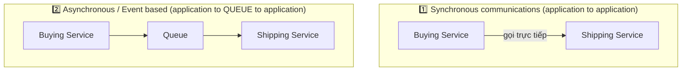

| | **Synchronous** | **Asynchronous / Event based** |
|---|---|---|
| **Cách hoạt động** | App gọi thẳng app | App → **hàng đợi** → app |
| **Phụ thuộc** | ⚠️ Bên gửi **phải chờ** bên nhận | ✅ Bên gửi **gửi xong là xong** |
| **Rủi ro** | ⚠️ Bên nhận chết → bên gửi chết theo | ✅ Bên nhận chết → message vẫn nằm trong queue |

---

### ⭐⭐⭐ Tại sao phải decouple?

- ⚠️ **Giao tiếp đồng bộ (synchronous) rất dễ vỡ khi có ĐỘT BIẾN traffic (sudden spikes)**
- ⭐⭐ **Ví dụ kinh điển của Stéphane:** *"Chuyện gì xảy ra nếu bạn đột nhiên cần encode 1000 video trong khi bình thường chỉ có 10?"*
- ⭐⭐⭐ **→ Tốt hơn là DECOUPLE (tách rời) các ứng dụng:**

| Dịch vụ | Mô hình |
|---|---|
| ⭐⭐⭐ **SQS** | **queue model** (mô hình hàng đợi) |
| ⭐⭐⭐ **SNS** | **pub/sub model** (mô hình xuất bản/đăng ký) |
| ⭐⭐⭐ **Kinesis** | **real-time streaming model** (mô hình luồng dữ liệu thời gian thực) |

- ⭐⭐⭐ **Các dịch vụ này SCALE ĐỘC LẬP với ứng dụng của bạn!**

> ⭐⭐⭐ **Đây là ý tưởng xuyên suốt cả chương.** Đề thi SAA-C03 rất thích tình huống: *"Ứng dụng bị quá tải khi traffic tăng đột biến / mất request khi backend chậm / muốn tách tier"* → **đáp án gần như luôn là chèn SQS vào giữa**.

---

## 184. Amazon SQS - Standard Queues Overview

### Queue là gì?

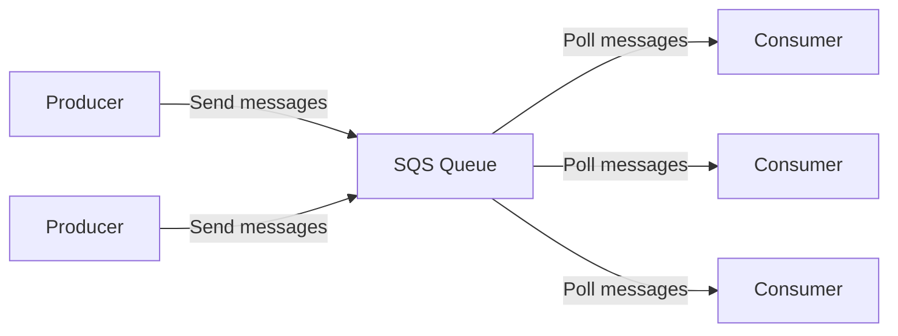

- **Producer** **GỬI (send)** message vào queue
- **Consumer** **KÉO (poll)** message ra khỏi queue
- ⭐⭐⭐ **Lưu ý cực quan trọng: consumer PULL (kéo), SQS KHÔNG push.** Đây là điểm phân biệt số 1 với SNS.

---

### ⭐⭐⭐ Amazon SQS – Standard Queue (thuộc lòng bảng này)

- ⭐ **Dịch vụ CŨ NHẤT của AWS (hơn 10 năm tuổi)**
- ⭐⭐ **Fully managed service, dùng để DECOUPLE ứng dụng**

**Attributes (thuộc tính) — ra thi rất nhiều:**

| Thuộc tính | Giá trị | Mức độ |
|---|---|---|
| **Throughput** | ⭐⭐⭐ **UNLIMITED (không giới hạn)** | ⭐⭐⭐ |
| **Số message trong queue** | ⭐⭐⭐ **UNLIMITED** | ⭐⭐⭐ |
| **Message retention mặc định** | ⭐⭐⭐ **4 NGÀY** | ⭐⭐⭐ |
| **Message retention tối đa** | ⭐⭐⭐ **14 NGÀY** | ⭐⭐⭐ |
| **Latency** | ⭐⭐ **< 10 ms** (khi publish và receive) | ⭐⭐ |
| **Kích thước message tối đa** | ⭐⭐⭐ **1,024 KB (= 1 MB)** | ⭐⭐⭐ |

**⭐⭐⭐ Hai nhược điểm PHẢI NHỚ của Standard Queue:**

- ⚠️⭐⭐⭐ **CÓ THỂ CÓ MESSAGE TRÙNG LẶP** — *at least once delivery, occasionally* (giao ít nhất một lần, thỉnh thoảng trùng)
- ⚠️⭐⭐⭐ **CÓ THỂ SAI THỨ TỰ** — *best effort ordering* (cố gắng giữ thứ tự, không đảm bảo)

> ⭐⭐⭐ **Bẫy thi số 1 của SQS:** Đề hỏi *"ứng dụng KHÔNG được xử lý message trùng / PHẢI đúng thứ tự"* → **Standard Queue là SAI, phải chọn FIFO Queue** (bài 188).

> 💡 **Mẹo nhớ 4 và 14:** **"4 ngày mặc định, 14 ngày tối đa"** — con số này ra thi cực nhiều.

---

### ⭐⭐ SQS – Producing Messages (gửi message)

- ⭐⭐ **Gửi vào SQS bằng SDK — API là `SendMessage`**
- ⭐⭐⭐ **Message được LƯU GIỮ trong SQS CHO ĐẾN KHI CONSUMER XÓA NÓ**
- ⭐⭐ **Message retention: mặc định 4 ngày, tối đa 14 ngày**
- ⭐⭐ **Kích thước tối đa: 1024 KB**

**Ví dụ:** gửi một đơn hàng cần xử lý gồm **Order id**, **Customer id**, và **bất kỳ attribute nào bạn muốn**.

- ⭐⭐ **SQS Standard: unlimited throughput**

---

### ⭐⭐⭐ SQS – Consuming Messages (nhận message)

**Consumer chạy trên: EC2 instances, servers, hoặc AWS Lambda.**

**Ba bước của consumer:**

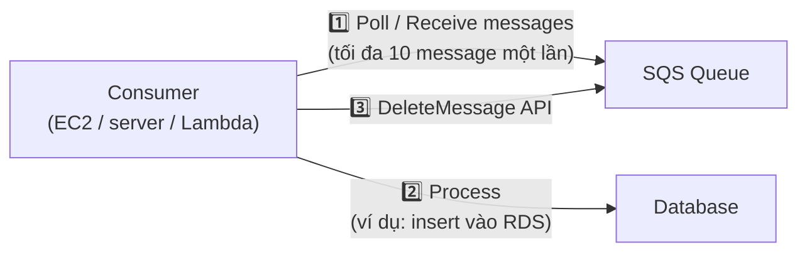

1. ⭐⭐⭐ **Poll SQS để lấy message — TỐI ĐA 10 MESSAGE MỘT LẦN**
2. ⭐⭐ **Xử lý message** (ví dụ: insert message vào RDS database)
3. ⭐⭐⭐ **XÓA message bằng `DeleteMessage` API**

> ⚠️⭐⭐⭐ **Nếu consumer KHÔNG gọi `DeleteMessage`, message sẽ QUAY LẠI QUEUE và được xử lý LẠI.** Đây là nền tảng của cơ chế Visibility Timeout ở bài 186.

---

### ⭐⭐ SQS – Multiple EC2 Instances Consumers

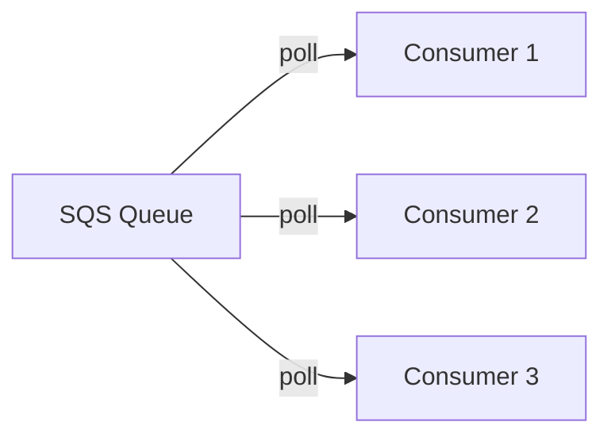

- ⭐⭐ **Consumers nhận và xử lý message SONG SONG (in parallel)**
- ⭐⭐⭐ **At least once delivery** (giao ít nhất một lần)
- ⭐⭐⭐ **Best-effort message ordering** (thứ tự chỉ ở mức cố gắng)
- ⭐⭐ **Consumers XÓA message sau khi xử lý xong**
- ⭐⭐⭐ **Có thể SCALE CONSUMERS THEO CHIỀU NGANG (horizontally) để tăng throughput xử lý**

---

### ⭐⭐⭐ SQS to decouple between application tiers (tách các tầng ứng dụng)

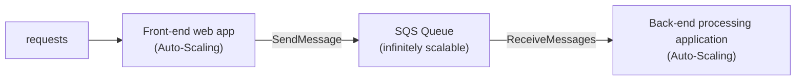

- ⭐⭐⭐ **Front-end và back-end SCALE ĐỘC LẬP nhau**
- ⭐⭐⭐ **SQS Queue là "infinitely scalable"** — không bao giờ là nút thắt cổ chai

---

### ⭐⭐⭐ SQS as a buffer to database writes (đệm cho ghi database)

**Vấn đề — kiến trúc KHÔNG có SQS:**

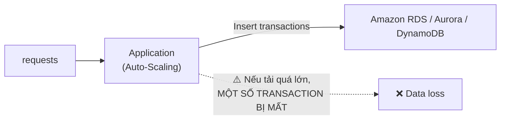

**Giải pháp — chèn SQS vào giữa:**

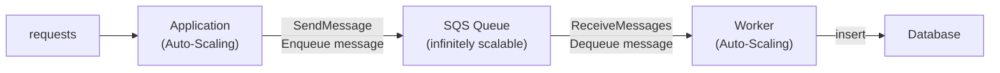

> ⭐⭐⭐ **Đây là pattern ra thi nhiều nhất của SQS.** Từ khóa trong đề: *"database không chịu nổi lượng ghi đột biến"*, *"một số transaction bị mất khi tải cao"*, *"cần buffer / throttle writes"* → **chèn SQS làm buffer**.

---

### ⭐⭐ Amazon SQS - Security

**Encryption (mã hóa):**

| Loại | Cách thực hiện |
|---|---|
| ⭐⭐ **In-flight encryption** | **Dùng HTTPS API** |
| ⭐⭐ **At-rest encryption** | **Dùng KMS keys** |
| ⭐ **Client-side encryption** | Client tự mã hóa/giải mã |

**Access Controls:**

- ⭐⭐ **IAM policies** để quản lý quyền truy cập **SQS API**
- ⭐⭐⭐ **SQS Access Policies** (**tương tự S3 bucket policies**)
  - ⭐⭐ Hữu ích cho **cross-account access** tới SQS queue
  - ⭐⭐⭐ Hữu ích để **cho phép dịch vụ khác (SNS, S3…) GHI vào SQS queue**

> ⭐⭐⭐ **Bẫy thi:** Khi làm **Fan-Out (SNS → SQS)** hoặc **S3 Event → SQS**, nếu không chỉnh **SQS Access Policy** thì message **không tới được**. Đề rất hay hỏi *"vì sao SNS không gửi được vào SQS?"* → **thiếu SQS Access Policy cho phép SNS ghi**.

---

## 185. SQS - Standard Queue Hands On

> 🖐️ Bài Hands On — **không có slide**. Dưới đây là các bước Console kèm **code CLI chính thức của khóa học**.

### Tạo Standard Queue trên Console

1. Console → tìm **Simple Queue Service (SQS)** → **Create queue**
2. **Type**: ⭐ **Standard** (loại còn lại là **FIFO**)
3. **Name**: `MyFirstQueue`
4. **Configuration** — các tham số quan trọng:

| Tham số | Mặc định | Khoảng cho phép | Ý nghĩa |
|---|---|---|---|
| ⭐⭐⭐ **Visibility timeout** | **30 giây** | **0 giây – 12 giờ** | Thời gian message bị ẩn sau khi được poll |
| ⭐⭐⭐ **Message retention period** | **4 ngày** | **60 giây – 14 ngày** | Thời gian giữ message chưa xử lý |
| ⭐⭐ **Delivery delay** | **0 giây** | **0 giây – 15 phút** | Hoãn message trước khi hiện ra cho consumer |
| ⭐⭐ **Maximum message size** | **256 KB** | **1 KB – 256 KB** | ⚠️ Console giới hạn 256 KB (slide ghi 1024 KB là giới hạn kỹ thuật với extended client) |
| ⭐⭐⭐ **Receive message wait time** | **0 giây** | **0 – 20 giây** | ⭐ **> 0 = LONG POLLING** |

5. **Encryption**: bật **SSE-SQS** (mặc định) hoặc **SSE-KMS**
6. **Access policy**: mặc định chỉ owner; sửa nếu cần **cross-account** hoặc cho **SNS/S3** ghi vào
7. **Dead-letter queue** (tùy chọn) — xem bên dưới
8. **Create queue**

### Gửi và nhận message trên Console

- Vào queue → **Send and receive messages**
- **Message body**: gõ `hello world` → **Send message**
- Kéo xuống **Receive messages** → **Poll for messages**
- Bấm vào message để xem **Body**, **Attributes**, **Receipt handle**
- ⭐ Chọn message → **Delete** để xóa khỏi queue

### ⭐⭐ Code CLI chính thức — `code_v2025-10-27/sqs/sqs.sh`

```bash
# get CLI help
aws sqs help

# list queues and specify the region
aws sqs list-queues --region us-east-1

# send a message
aws sqs send-message help
aws sqs send-message --queue-url https://queue.amazonaws.com/387124123361/MyFirstQueue --region us-east-1 --message-body hello-world

# receive a message
aws sqs receive-message help
aws sqs receive-message --region us-east-1  --queue-url https://queue.amazonaws.com/387124123361/MyFirstQueue --max-number-of-messages 10 --visibility-timeout 30 --wait-time-seconds 20

# delete a message
aws sqs delete-message help
aws sqs receive-message --region us-east-1  --queue-url https://queue.amazonaws.com/387124123361/MyFirstQueue --max-number-of-messages 10 --visibility-timeout 30 --wait-time-seconds 20
aws sqs delete-message --receipt-handle AQEBB+moMioWDaeaCZguaiMPXEqDe6n4JlGiUj/T0yUCLEKkL/tT1+68xyiZMe/ip7HBvgzSZJ6Gys8CCY8QO5qPypqZ9HSKdhl6sluJVl90x1igUHwz0gSEq/UbiLB8tNvFOKF90Dj4aH87mW3K7LLNUtv839z2Uu1Aeqd4kQDVB7SSqPzqCeaYFcLGquz+XIvT69vTAYP5HIsIjmwECx0faEiQF2JZ/KiVHq5n/ZEcG5UbIPMFmP+bg1n4ql8+2dUK+6G+gnIkMRPraZ4aweT9vUZmD5AXHDU5lnJBJNKj1QGuTbxtCjp/pzJvsul/uwsspUUWdRGP92ZpTlTDTL+WiJft3E9AUdqVhksc8NhExYDpdebWEqx43SbvzJMyJlrC --queue-url https://queue.amazonaws.com/387124123361/MyFirstQueue --region us-east-1
```

**Ba điểm cần chú ý trong đoạn code trên:** ⭐⭐⭐

- `--max-number-of-messages 10` → ⭐⭐⭐ **tối đa 10 message mỗi lần poll**
- `--wait-time-seconds 20` → ⭐⭐⭐ **bật Long Polling 20 giây**
- `--receipt-handle ...` → ⭐⭐⭐ **muốn XÓA message phải có RECEIPT HANDLE** (lấy được từ lần `receive-message` ngay trước đó), **KHÔNG phải Message ID**

> ⚠️ **Bẫy thi:** Để xóa message bạn cần **Receipt Handle**, không phải Message ID. Receipt Handle **đổi sau mỗi lần receive**.

### ⭐⭐ Dead-Letter Queue (DLQ) — bổ sung ngoài slide, ra thi rất nhiều

- ⭐⭐⭐ Nếu một message **bị xử lý lỗi liên tục**, nó cứ quay lại queue mãi → **tắc nghẽn**
- ⭐⭐⭐ Đặt **`MaximumReceives` (Maximum receives)** — sau **N lần** nhận không thành công, message được **chuyển sang Dead-Letter Queue**
- ⭐⭐ DLQ phải **cùng loại** với queue gốc (**Standard → DLQ Standard**, **FIFO → DLQ FIFO**)
- ⭐⭐ Nên **đặt retention của DLQ là 14 ngày** để có thời gian debug
- ⭐ **Redrive to Source** — sau khi sửa lỗi, đẩy message từ DLQ ngược về queue gốc

---

## 186. SQS - Message Visibility Timeout

### ⭐⭐⭐ Cơ chế Visibility Timeout

- ⭐⭐⭐ **Sau khi một message được consumer POLL, nó trở nên VÔ HÌNH (invisible) với các consumer khác**
- ⭐⭐⭐ **Mặc định "message visibility timeout" là 30 GIÂY**
- ⭐⭐⭐ **Nghĩa là message có 30 giây để được xử lý xong**
- ⭐⭐⭐ **Sau khi hết visibility timeout, message lại "hiện ra (visible)" trong SQS**

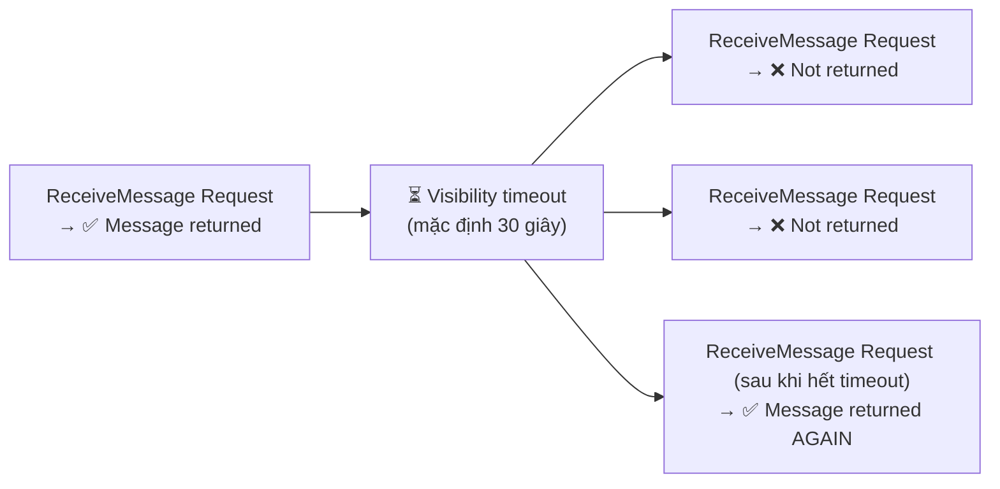

---

### ⭐⭐⭐ Bốn hệ quả PHẢI THUỘC

| Tình huống | Hệ quả |
|---|---|
| ⭐⭐⭐ **Message KHÔNG xử lý xong trong visibility timeout** | **Nó sẽ bị XỬ LÝ HAI LẦN (processed twice)** |
| ⭐⭐⭐ **Consumer cần thêm thời gian** | **Gọi `ChangeMessageVisibility` API để xin thêm thời gian** |
| ⚠️⭐⭐⭐ **Visibility timeout ĐẶT CAO (hàng giờ) và consumer CRASH** | **Việc xử lý lại sẽ RẤT LÂU** (phải chờ hết timeout mới thấy message) |
| ⚠️⭐⭐⭐ **Visibility timeout ĐẶT THẤP (vài giây)** | **Ta sẽ bị TRÙNG LẶP (duplicates)** |

> ⭐⭐⭐ **Đây là câu hỏi ra thi CHẮC CHẮN.** Đề thường dạng:
> - *"Message bị xử lý nhiều lần, làm sao khắc phục?"* → **Tăng visibility timeout, hoặc gọi `ChangeMessageVisibility`**
> - *"Consumer cần 5 phút để xử lý nhưng message cứ bị consumer khác lấy mất"* → **Visibility timeout đang là 30 giây, phải tăng lên**
>
> 💡 **Cân bằng vàng:** đặt visibility timeout **hơi lớn hơn thời gian xử lý trung bình**, đừng quá cao cũng đừng quá thấp.

**Khoảng giá trị:** ⭐ **0 giây → 12 giờ** (mặc định **30 giây**).

---

## 187. SQS - Long Polling

### ⭐⭐⭐ Long Polling là gì?

- ⭐⭐⭐ **Khi consumer request message từ queue, nó có thể tùy chọn "ĐỢI (wait)" message tới nếu queue đang RỖNG**
- ⭐⭐⭐ **Cái này gọi là LONG POLLING**

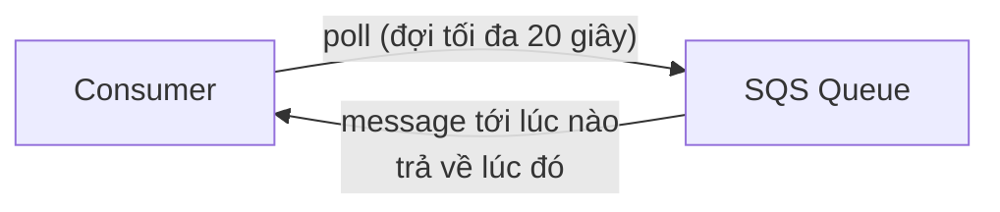

**⭐⭐⭐ Lợi ích:**

- ⭐⭐⭐ **GIẢM số lượng API calls tới SQS** → **giảm chi phí**
- ⭐⭐⭐ **TĂNG hiệu quả (efficiency)** của ứng dụng
- ⭐⭐⭐ **GIẢM độ trễ (latency)** của ứng dụng

**⭐⭐⭐ Thông số:**

- ⭐⭐⭐ **Thời gian chờ: từ 1 giây đến 20 GIÂY (20 giây là tốt nhất — preferable)**
- ⭐⭐⭐ **Long Polling LUÔN TỐT HƠN Short Polling**
- ⭐⭐ **Bật được ở MỨC QUEUE (queue level) hoặc MỨC API (dùng `WaitTimeSeconds`)**

> ⭐⭐⭐ **Từ khóa nhận diện trong đề:** *"giảm số lượng API call rỗng (empty responses)"*, *"giảm chi phí SQS"*, *"giảm latency khi message tới"* → **bật Long Polling, `ReceiveMessageWaitTimeSeconds = 20`**.

| | **Short Polling** (mặc định) | **Long Polling** ⭐ |
|---|---|---|
| **WaitTimeSeconds** | **0** | **1 → 20 giây** |
| **Khi queue rỗng** | ⚠️ **Trả về rỗng NGAY** → gọi lại liên tục → tốn tiền | ✅ **Đợi cho tới khi có message hoặc hết thời gian** |
| **Số API call** | ⚠️ **Rất nhiều** | ✅ **Ít hơn nhiều** |
| **Chi phí** | ⚠️ Cao | ✅ Thấp |

---

## 188. SQS - FIFO Queues

### ⭐⭐⭐ FIFO Queue là gì?

- ⭐⭐⭐ **FIFO = First In First Out** — **thứ tự message trong queue được ĐẢM BẢO**

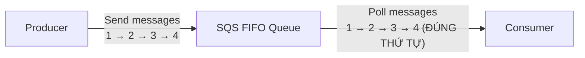

---

### ⭐⭐⭐ Đặc điểm FIFO Queue — bảng ra thi

| Đặc điểm | Chi tiết |
|---|---|
| ⚠️⭐⭐⭐ **Throughput BỊ GIỚI HẠN** | **300 msg/s KHÔNG batching**<br/>**3,000 msg/s CÓ batching** |
| ⭐⭐⭐ **Exactly-once send capability** | **Loại bỏ trùng lặp bằng DEDUPLICATION ID** |
| ⭐⭐⭐ **Message được xử lý ĐÚNG THỨ TỰ bởi consumer** | |
| ⭐⭐⭐ **Ordering theo MESSAGE GROUP ID** | **Mọi message cùng một group được sắp thứ tự — THAM SỐ BẮT BUỘC (mandatory)** |

> ⭐⭐⭐ **Ba con số phải thuộc: 300 / 3,000 / và tên queue phải kết thúc bằng `.fifo`.**

> ⭐⭐⭐ **BẢNG SO SÁNH ĐINH CỦA CHƯƠNG:**

| | **Standard Queue** | **FIFO Queue** |
|---|---|---|
| **Throughput** | ⭐⭐⭐ **UNLIMITED** | ⚠️ **300/s (3,000/s có batching)** |
| **Thứ tự** | ⚠️ **Best-effort ordering** | ✅ **ĐẢM BẢO (theo Message Group ID)** |
| **Trùng lặp** | ⚠️ **At-least-once (có thể trùng)** | ✅ **Exactly-once (Deduplication ID)** |
| **Tên queue** | Bất kỳ | ⭐ **Phải kết thúc bằng `.fifo`** |
| **Khi nào dùng** | Mặc định, throughput cao | Khi **bắt buộc đúng thứ tự / không trùng** |

> 💡 **Mẹo nhớ:** **Standard = nhanh nhưng lộn xộn. FIFO = chậm nhưng ngăn nắp.** Đề hỏi *"banking transactions phải đúng thứ tự"*, *"không được xử lý đơn hàng hai lần"* → **FIFO**.

**Hai cơ chế khử trùng (bổ sung ngoài slide, hay gặp):** ⭐⭐

- ⭐⭐ **Deduplication interval là 5 PHÚT** — trong 5 phút, message trùng sẽ bị bỏ
- ⭐⭐ Hai cách khử trùng:
  1. **Content-based deduplication** — SQS tự tính **SHA-256 hash của message body**
  2. **Explicit Deduplication ID** — producer tự cung cấp ID

---

## 189. SQS + Auto Scaling Group

### ⭐⭐⭐ SQS with Auto Scaling Group (ASG)

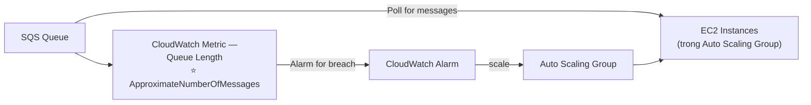

**Cơ chế hoạt động:** ⭐⭐⭐

1. ⭐⭐⭐ **SQS phát ra CloudWatch Metric tên `ApproximateNumberOfMessages`** (độ dài hàng đợi — Queue Length)
2. ⭐⭐⭐ **Tạo CloudWatch Alarm khi metric vượt ngưỡng (alarm for breach)**
3. ⭐⭐⭐ **Alarm kích hoạt Auto Scaling Group SCALE OUT thêm EC2 instances**
4. **EC2 instances poll message nhanh hơn → queue vơi đi → alarm tắt → scale in**

> ⭐⭐⭐ **PHẢI THUỘC TÊN METRIC: `ApproximateNumberOfMessages`.** Đề thi hỏi *"scale ASG dựa trên độ sâu hàng đợi thì dùng metric nào?"* → đây là đáp án.

> 💡 **Bổ sung thực tế (ngoài slide):** AWS khuyến nghị dùng **`ApproximateNumberOfMessagesVisible` chia cho số instance đang chạy** làm **backlog per instance**, rồi dùng **Target Tracking** trên metric tùy chỉnh này. Nhưng với đề thi SAA-C03, **`ApproximateNumberOfMessages` là đáp án chuẩn**.

---

### Hai kiến trúc ứng dụng (nhắc lại từ bài 184)

**1️⃣ SQS to decouple between application tiers** — front-end và back-end scale độc lập.

**2️⃣ SQS as a buffer to database writes** — chống mất transaction khi tải đột biến.

> ⭐⭐⭐ **Ba pattern này (ASG scaling + decouple tiers + buffer DB writes) chính là "bộ ba" mà đề thi SAA-C03 dùng đi dùng lại.**

---

## 190. Amazon Simple Notification Service (AWS SNS)

### ⭐⭐⭐ Vấn đề: gửi MỘT message tới NHIỀU người nhận

**❌ Direct integration (tích hợp trực tiếp) — cách cũ, tệ:**

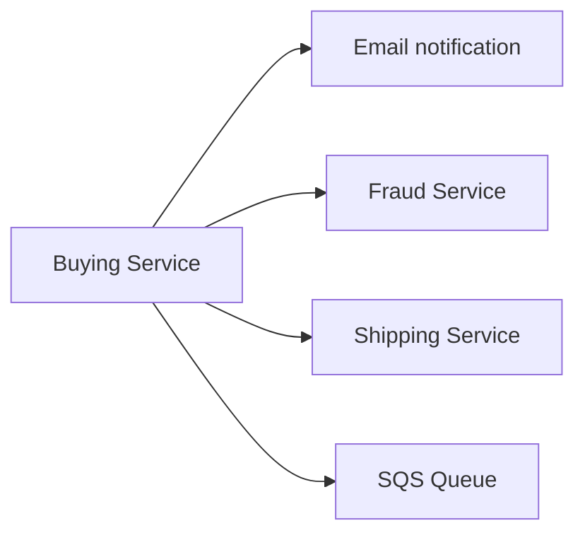

⚠️ Buying Service phải biết **tất cả** người nhận → thêm người nhận mới phải **sửa code**.

**✅ Pub / Sub — cách đúng, dùng SNS:**

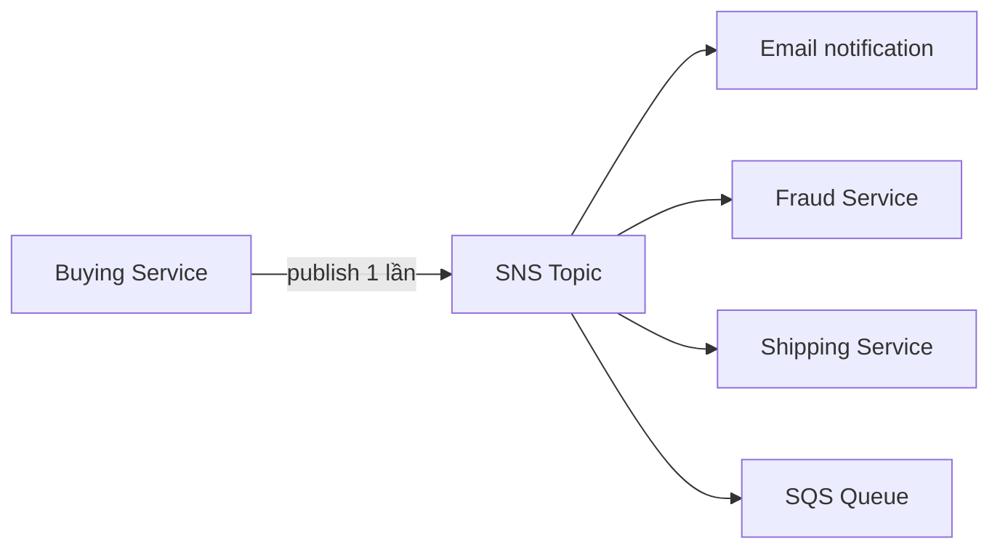

---

### ⭐⭐⭐ Amazon SNS — Cách hoạt động

- ⭐⭐⭐ **"Event producer" CHỈ gửi message tới MỘT SNS topic**
- ⭐⭐⭐ **Bao nhiêu "event receivers" (subscriptions) lắng nghe topic cũng được**
- ⭐⭐⭐ **MỖI subscriber nhận ĐƯỢC TẤT CẢ message** (có tính năng mới để filter — xem bài 191)

**⭐⭐⭐ Hai giới hạn PHẢI THUỘC:**

| Giới hạn | Giá trị |
|---|---|
| ⭐⭐⭐ **Số subscription trên MỘT topic** | **12,500,000 (12.5 triệu)** |
| ⭐⭐⭐ **Số topic tối đa** | **100,000** |

**⭐⭐⭐ Các loại Subscribers (người đăng ký):**

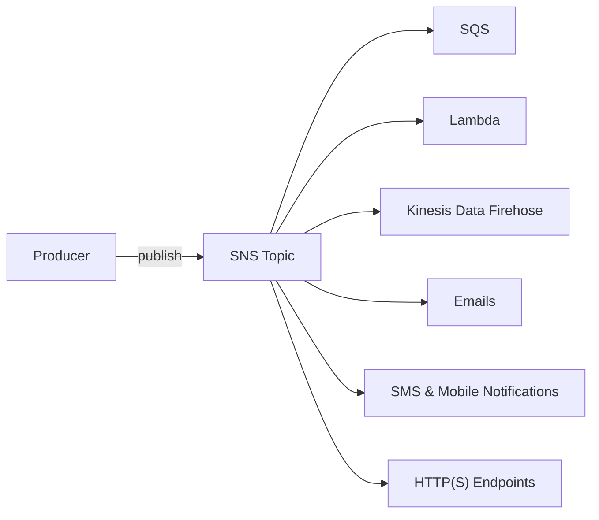

| Subscriber | Ghi chú |
|---|---|
| ⭐⭐⭐ **SQS** | Nền tảng của **Fan-Out pattern** |
| ⭐⭐⭐ **Lambda** | Trigger function |
| ⭐⭐ **Kinesis Data Firehose** | ⭐ Cho phép **SNS → S3/Redshift** gián tiếp |
| ⭐⭐ **Emails** | |
| ⭐⭐ **SMS & Mobile Notifications** | |
| ⭐⭐ **HTTP(S) Endpoints** | Webhook |

---

### ⭐⭐ SNS tích hợp với RẤT NHIỀU dịch vụ AWS

Các dịch vụ **gửi dữ liệu TRỰC TIẾP vào SNS** để thông báo:

| Dịch vụ | Ghi chú |
|---|---|
| ⭐⭐⭐ **CloudWatch Alarms** | Cảnh báo → SNS → email |
| ⭐⭐ **AWS Budgets** | Cảnh báo vượt ngân sách |
| ⭐⭐ **Lambda** | |
| ⭐⭐⭐ **Auto Scaling Group (Notifications)** | Thông báo khi launch/terminate instance |
| ⭐⭐⭐ **S3 Bucket (Events)** | Event Notifications |
| ⭐⭐ **DynamoDB** | |
| ⭐⭐ **CloudFormation (State Changes)** | |
| ⭐⭐ **AWS DMS (New Replic)** | |
| ⭐⭐⭐ **RDS Events** | |

---

### ⭐⭐ Amazon SNS – How to publish (hai cách publish)

| Cách | Các bước |
|---|---|
| ⭐⭐⭐ **Topic Publish** (dùng SDK) | 1. **Create a topic**<br/>2. **Create a subscription** (hoặc nhiều)<br/>3. **Publish to the topic** |
| ⭐⭐ **Direct Publish** (cho mobile apps SDK) | 1. **Create a platform application**<br/>2. **Create a platform endpoint**<br/>3. **Publish to the platform endpoint**<br/>⭐ Hoạt động với **Google GCM, Apple APNS, Amazon ADM…** |

> ⭐⭐ **Từ khóa nhận diện:** đề nhắc **"mobile push notification"**, **"APNS/GCM/FCM"** → **SNS Direct Publish (Platform Endpoint)**.

---

### ⭐⭐ Amazon SNS – Security (giống hệt SQS)

**Encryption:**

- ⭐⭐ **In-flight encryption dùng HTTPS API**
- ⭐⭐ **At-rest encryption dùng KMS keys**
- ⭐ **Client-side encryption** nếu client tự mã hóa/giải mã

**Access Controls:**

- ⭐⭐ **IAM policies** để quản lý quyền truy cập **SNS API**
- ⭐⭐⭐ **SNS Access Policies** (**tương tự S3 bucket policies**)
  - ⭐⭐ Hữu ích cho **cross-account access** tới SNS topic
  - ⭐⭐⭐ Hữu ích để **cho phép dịch vụ khác (S3…) GHI vào SNS topic**

---

## 191. SNS and SQS - Fan Out Pattern

### ⭐⭐⭐ SNS + SQS: Fan Out — Pattern quan trọng nhất của chương

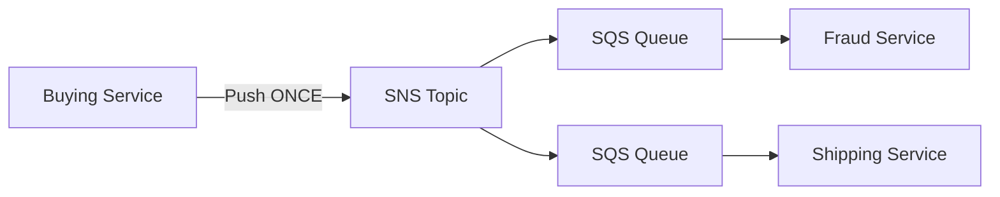

**⭐⭐⭐ Sáu đặc điểm PHẢI THUỘC:**

1. ⭐⭐⭐ **PUSH MỘT LẦN vào SNS, nhận được ở TẤT CẢ các SQS queue đang subscribe**
2. ⭐⭐⭐ **Hoàn toàn decoupled, KHÔNG MẤT DỮ LIỆU (no data loss)**
3. ⭐⭐⭐ **SQS cho phép: data persistence (lưu bền), delayed processing (xử lý hoãn) và retries of work (thử lại)**
4. ⭐⭐⭐ **Có thể THÊM SQS subscriber theo thời gian** mà không sửa producer
5. ⚠️⭐⭐⭐ **PHẢI ĐẢM BẢO SQS QUEUE ACCESS POLICY CHO PHÉP SNS GHI VÀO**
6. ⭐⭐⭐ **Cross-Region Delivery: hoạt động với SQS Queues Ở REGION KHÁC**

> ⭐⭐⭐ **Đây là pattern ra thi NHIỀU NHẤT trong cả chương.** Từ khóa: *"gửi một sự kiện tới nhiều hệ thống xử lý độc lập"*, *"mỗi hệ thống cần retry riêng"*, *"thêm consumer mới không sửa code producer"* → **SNS + SQS Fan-Out**.
>
> ⚠️ **Đáp án SAI kinh điển:** "Cho Buying Service gọi trực tiếp từng service" — đây chính là Direct Integration mà slide nói là sai.

---

### ⭐⭐⭐ Application: S3 Events to multiple queues

**Vấn đề:**

- ⚠️⭐⭐⭐ **Với CÙNG một tổ hợp: event type (ví dụ `object create`) và prefix (ví dụ `images/`), bạn CHỈ CÓ THỂ CÓ MỘT S3 Event rule**
- ⭐⭐⭐ **Muốn gửi CÙNG một S3 event tới NHIỀU SQS queue → dùng FAN-OUT**

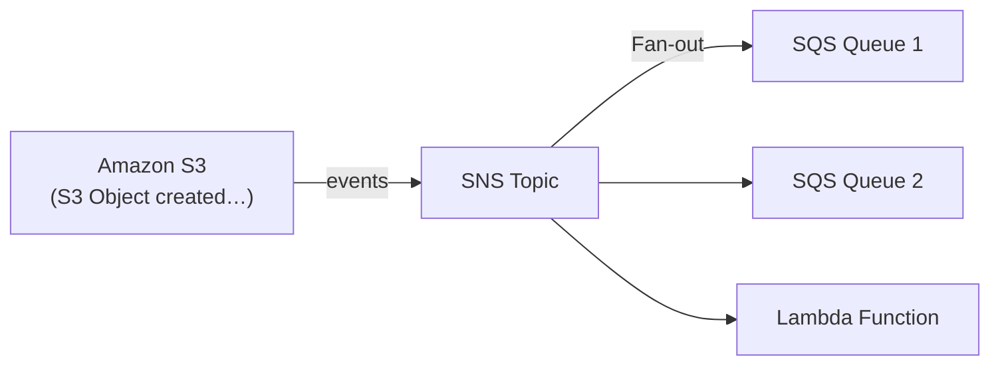

> ⭐⭐⭐ **Câu hỏi thi điển hình:** *"Bạn cần 3 ứng dụng cùng xử lý khi có object mới upload vào `images/`. Kiến trúc nào?"* → **S3 Event → SNS Topic → 3 SQS Queues (fan-out)**.
> **Đáp án SAI:** "Tạo 3 S3 Event notification rule" — **không được**, vì cùng event type + prefix chỉ được 1 rule.

---

### ⭐⭐ Application: SNS to Amazon S3 through Kinesis Data Firehose

- ⭐⭐ **SNS gửi được vào Kinesis, nên ta có kiến trúc sau:**

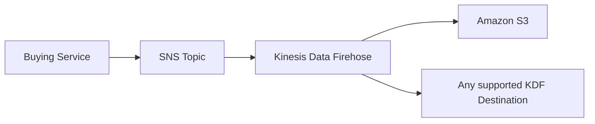

> ⭐⭐ **SNS KHÔNG ghi thẳng vào S3 được.** Muốn **SNS → S3** thì phải **đi qua Amazon Data Firehose**. Đây là một bẫy nhỏ nhưng có ra thi.

---

### ⭐⭐⭐ Amazon SNS – FIFO Topic

- ⭐⭐⭐ **FIFO = First In First Out** (thứ tự message trong topic)

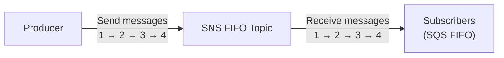

**Tính năng tương tự SQS FIFO:** ⭐⭐

- ⭐⭐⭐ **Ordering theo Message Group ID** (mọi message cùng group được sắp thứ tự)
- ⭐⭐⭐ **Deduplication bằng Deduplication ID hoặc Content Based Deduplication**
- ⭐⭐ **Có thể có CẢ SQS Standard VÀ FIFO queue làm subscribers**
- ⚠️⭐⭐⭐ **Throughput BỊ GIỚI HẠN (giống SQS FIFO)**

---

### ⭐⭐⭐ SNS FIFO + SQS FIFO: Fan Out

- ⭐⭐⭐ **Dùng khi bạn cần: FAN OUT + ORDERING + DEDUPLICATION**

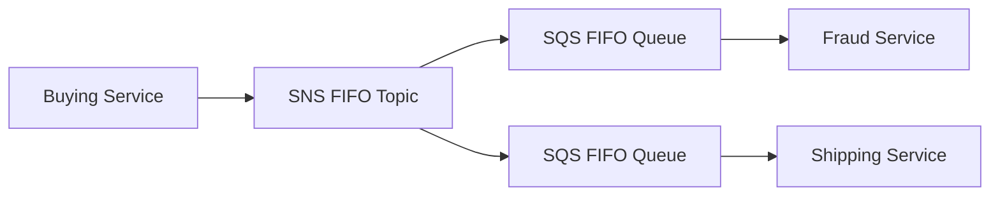

> ⭐⭐⭐ **Đề hỏi:** *"cần gửi tới nhiều hệ thống, ĐÚNG THỨ TỰ và KHÔNG TRÙNG"* → **SNS FIFO Topic + SQS FIFO Queues**.

---

### ⭐⭐⭐ SNS – Message Filtering

- ⭐⭐⭐ **JSON policy dùng để LỌC message gửi tới các subscription của SNS topic**
- ⭐⭐⭐ **Nếu một subscription KHÔNG CÓ filter policy, nó nhận MỌI message**

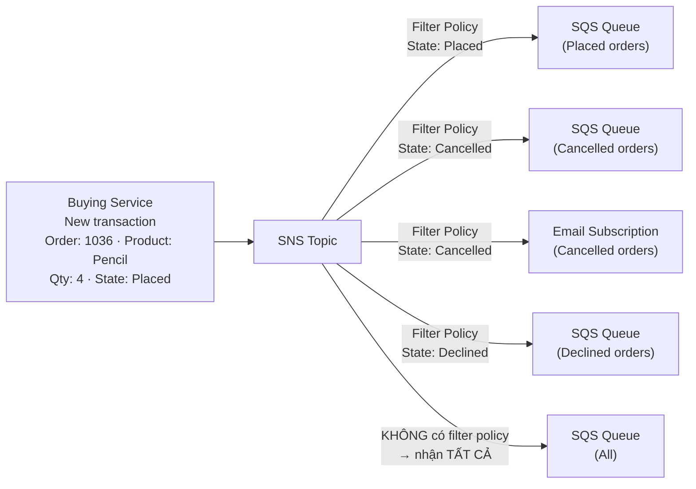

**Ví dụ filter policy JSON:**

```json
{
  "State": ["Placed"]
}
```

> ⭐⭐⭐ **Từ khóa nhận diện:** *"mỗi queue chỉ nhận một loại sự kiện"*, *"không muốn consumer phải tự lọc bỏ message không liên quan"* → **SNS Message Filtering (filter policy)**.
>
> ⚠️ **Nhớ quy tắc:** **không có filter policy = nhận TẤT CẢ** (không phải nhận không có gì).

---

## 192. SNS - Hands On

> 🖐️ Bài Hands On — **không có slide**. Các bước Console.

### Tạo SNS Topic và Subscription

1. Console → tìm **Simple Notification Service (SNS)** → **Topics** → **Create topic**
2. **Type**: ⭐ **Standard** (hoặc **FIFO** — tên phải kết thúc `.fifo`)
3. **Name**: `MyFirstTopic`
4. **Display name** (tùy chọn, dùng cho SMS)
5. **Encryption / Access policy / Delivery retry policy** — để mặc định
6. **Create topic**

### Tạo Subscription (Email)

1. Trong topic → tab **Subscriptions** → **Create subscription**
2. **Protocol**: chọn một trong:

| Protocol | Endpoint |
|---|---|
| ⭐ **Email** | địa chỉ email |
| **Email-JSON** | email nhận dạng JSON thô |
| ⭐⭐ **Amazon SQS** | ARN của queue |
| ⭐⭐ **AWS Lambda** | ARN của function |
| ⭐ **HTTP / HTTPS** | URL webhook |
| ⭐ **SMS** | số điện thoại |
| ⭐ **Amazon Data Firehose** | ARN của delivery stream |
| **Platform application endpoint** | mobile push |

3. **Endpoint**: nhập email của bạn → **Create subscription**
4. ⭐⭐⭐ **Status ban đầu là `Pending confirmation`** — **mở email và bấm "Confirm subscription"**
5. Sau khi confirm, status chuyển thành **`Confirmed`**

> ⚠️⭐⭐ **Bẫy thi nhỏ:** Subscription chỉ nhận message **sau khi được CONFIRM**. Nếu đề nói *"đã tạo subscription nhưng không nhận được email"* → **chưa confirm**.

### Publish message

1. Trong topic → **Publish message**
2. **Subject**: `Hello`
3. **Message body to send to the endpoint**: `Hello World`
4. **Publish message** → kiểm tra hộp thư email

### CLI tương đương

```bash
# Tạo topic
aws sns create-topic --name MyFirstTopic

# Subscribe email
aws sns subscribe --topic-arn arn:aws:sns:us-east-1:123456789012:MyFirstTopic \
  --protocol email --notification-endpoint you@example.com

# Publish
aws sns publish --topic-arn arn:aws:sns:us-east-1:123456789012:MyFirstTopic \
  --subject "Hello" --message "Hello World"

# Liệt kê subscription
aws sns list-subscriptions-by-topic --topic-arn arn:aws:sns:us-east-1:123456789012:MyFirstTopic
```

### Thử Fan-Out (SNS → SQS)

1. Tạo **2 SQS queue** (`Queue1`, `Queue2`)
2. Trong mỗi queue → **SQS queue actions** → **Subscribe to Amazon SNS topic** → chọn topic
   - ⭐⭐⭐ **Console TỰ ĐỘNG cập nhật SQS Access Policy** cho phép SNS ghi vào — đây chính là điều slide bài 191 nhắc phải làm thủ công nếu dùng CLI/IaC
3. Publish message vào topic → **Poll for messages** ở cả hai queue → **cả hai đều nhận được**

> 💡 **SNS nằm trong Free Tier rộng rãi** (1 triệu request/tháng, 1,000 email notification/tháng) — bài này an toàn để làm thật. Nhớ **xóa topic và queue** sau khi xong cho gọn.

---

## 193. Amazon Kinesis Data Streams

### ⭐⭐⭐ Kinesis Data Streams là gì?

- ⭐⭐⭐ **Thu thập và lưu trữ STREAMING DATA (dữ liệu luồng) theo THỜI GIAN THỰC**

```mermaid
flowchart LR
    subgraph PROD["Producers"]
        A["Applications"]
        B["Kinesis Agent"]
        C["IoT devices"]
        D["Click Streams"]
        E["Metrics & Logs"]
    end
    PROD --> KDS["Amazon Kinesis<br/>Data Streams"]
    subgraph CONS["Consumers"]
        F["Application"]
        G["Lambda"]
        H["Amazon Data Firehose"]
        I["Managed Service for Apache Flink"]
    end
    KDS --> CONS
```

---

### ⭐⭐⭐ Kinesis Data Streams — Đặc điểm (bảng ra thi)

| Đặc điểm | Chi tiết |
|---|---|
| ⭐⭐⭐ **Retention** | **TỐI ĐA 365 NGÀY** |
| ⭐⭐⭐ **Replay** | **CÓ THỂ XỬ LÝ LẠI (replay) dữ liệu bởi consumers** |
| ⚠️⭐⭐⭐ **Xóa dữ liệu** | **KHÔNG THỂ XÓA dữ liệu khỏi Kinesis (cho tới khi hết hạn)** |
| ⭐⭐⭐ **Kích thước data** | **TỐI ĐA 10 MiB** (use case điển hình: **nhiều dữ liệu NHỎ, real-time**) |
| ⭐⭐⭐ **Ordering** | **ĐẢM BẢO THỨ TỰ cho dữ liệu có cùng "PARTITION ID"** |
| ⭐⭐ **Encryption** | **At-rest bằng KMS**, **in-flight bằng HTTPS** |
| ⭐⭐ **KPL** | **Kinesis Producer Library** — viết producer tối ưu |
| ⭐⭐ **KCL** | **Kinesis Client Library** — viết consumer tối ưu |

> ⭐⭐⭐ **Ba điểm khác biệt sống còn với SQS:**
> 1. ⭐⭐⭐ **Kinesis GIỮ dữ liệu sau khi consume (replay được); SQS XÓA dữ liệu sau khi consume.**
> 2. ⭐⭐⭐ **Kinesis đảm bảo thứ tự theo SHARD/Partition ID; SQS Standard không đảm bảo.**
> 3. ⭐⭐⭐ **Kinesis dành cho BIG DATA / analytics / ETL; SQS dành cho task queue.**

---

### ⭐⭐⭐ Kinesis Data Streams – Capacity Modes

| | ⭐⭐⭐ **Provisioned mode** | ⭐⭐⭐ **On-demand mode** |
|---|---|---|
| **Shards** | ⭐⭐⭐ **Bạn CHỌN số lượng shards** | ⭐⭐⭐ **KHÔNG cần provision hay quản lý capacity** |
| **Throughput vào (mỗi shard)** | ⭐⭐⭐ **1 MB/s IN (hoặc 1,000 records/giây)** | **Mặc định: 4 MB/s IN hoặc 4,000 records/giây** |
| **Throughput ra (mỗi shard)** | ⭐⭐⭐ **2 MB/s OUT** | — |
| **Scaling** | ⚠️ **Scale THỦ CÔNG (manually)** để tăng/giảm số shard | ⭐⭐⭐ **Tự động scale dựa trên đỉnh throughput QUAN SÁT TRONG 30 NGÀY GẦN NHẤT** |
| **Tính phí** | ⭐⭐ **Trả theo SHARD được provision, theo GIỜ** | ⭐⭐ **Trả theo STREAM theo GIỜ + data in/out theo GB** |

> ⭐⭐⭐ **BA CON SỐ VÀNG CỦA KINESIS — PHẢI THUỘC:**
> - **1 MB/s vào mỗi shard** (hoặc **1,000 records/giây**)
> - **2 MB/s ra mỗi shard**
> - **On-demand mặc định: 4 MB/s hoặc 4,000 records/giây, scale theo đỉnh 30 ngày**
>
> Đề hay hỏi kiểu: *"Ứng dụng cần 5 MB/s ghi vào, cần bao nhiêu shard?"* → **5 shard**.

> ⭐⭐ **Chọn mode thế nào?** Traffic **đoán trước được, ổn định** → **Provisioned** (rẻ hơn). Traffic **không đoán được, biến động mạnh** → **On-demand**.

---

## 194. Amazon Kinesis Data Streams - Hands On

> 🖐️ Bài Hands On — **không có slide**, nhưng **CÓ code chính thức** trong `code_v2025-10-27/kinesis/kinesis-data-streams.sh`.

### Tạo Data Stream trên Console

1. Console → tìm **Kinesis** → **Data streams** → **Create data stream**
2. **Data stream name**: `test`
3. **Data stream capacity**:
   - ⭐ **On-demand** — không cần chọn shard
   - ⭐ **Provisioned** — nhập **Provisioned shards = 1**
   - Console hiển thị sẵn: **Write capacity 1 MB/second, 1,000 records/second** và **Read capacity 2 MB/second**
4. **Create data stream** → chờ status chuyển sang **Active**

### ⭐⭐ Code CLI chính thức — `code_v2025-10-27/kinesis/kinesis-data-streams.sh`

```bash
#!/bin/bash

# get the AWS CLI version
aws --version

# PRODUCER

# CLI v2
aws kinesis put-record --stream-name test --partition-key user1 --data "user signup" --cli-binary-format raw-in-base64-out

# CLI v1
aws kinesis put-record --stream-name test --partition-key user1 --data "user signup"


# CONSUMER 

# describe the stream
aws kinesis describe-stream --stream-name test

# Consume some data
aws kinesis get-shard-iterator --stream-name test --shard-id shardId-000000000000 --shard-iterator-type TRIM_HORIZON

aws kinesis get-records --shard-iterator <>
```

### ⭐⭐⭐ Giải thích từng lệnh (phần này ra thi)

| Lệnh | Ý nghĩa |
|---|---|
| ⭐⭐⭐ `put-record` | **Producer ghi MỘT record vào stream** |
| ⭐⭐⭐ `--partition-key user1` | **Quyết định record đi vào SHARD NÀO** — cùng partition key → **cùng shard → ĐẢM BẢO THỨ TỰ** |
| ⚠️⭐⭐ `--cli-binary-format raw-in-base64-out` | **BẮT BUỘC với AWS CLI v2** — CLI v2 mặc định coi `--data` là base64. CLI v1 không cần |
| ⭐⭐ `describe-stream` | Xem thông tin stream, **lấy danh sách shard ID** |
| ⭐⭐⭐ `get-shard-iterator` | **Lấy "con trỏ" để bắt đầu đọc từ một vị trí trong shard** |
| ⭐⭐⭐ `get-records --shard-iterator <>` | **Đọc dữ liệu — dán shard iterator lấy được ở bước trên vào chỗ `<>`** |

### ⭐⭐ Các loại `--shard-iterator-type`

| Loại | Ý nghĩa |
|---|---|
| ⭐⭐⭐ **`TRIM_HORIZON`** | **Đọc từ RECORD CŨ NHẤT còn trong shard** (dùng để **replay**) |
| ⭐⭐ **`LATEST`** | Chỉ đọc record **MỚI** tới sau thời điểm này |
| ⭐ **`AT_SEQUENCE_NUMBER`** | Bắt đầu từ sequence number cụ thể |
| ⭐ **`AFTER_SEQUENCE_NUMBER`** | Ngay sau sequence number cụ thể |
| ⭐ **`AT_TIMESTAMP`** | Bắt đầu từ một mốc thời gian |

> ⭐⭐⭐ **`TRIM_HORIZON` chính là cơ chế REPLAY** mà slide bài 193 nói tới. Đây là điều **SQS KHÔNG LÀM ĐƯỢC**.

### ⚠️ Dữ liệu trả về được mã hóa base64

```bash
# Kết quả get-records trả về Data dạng base64, giải mã bằng:
echo "dXNlciBzaWdudXA=" | base64 --decode
# → user signup
```

> ⚠️ **CẢNH BÁO CHI PHÍ:** Kinesis Data Streams **KHÔNG nằm trong Free Tier**. **Provisioned mode: ~$0.015/shard/giờ (~$11/tháng cho 1 shard)**. **On-demand đắt hơn nhiều (~$0.04/giờ + phí data)**. → **Xóa data stream ngay sau khi làm xong** (**Delete data stream**).

---

## 195. Amazon Data Firehose

### ⭐⭐⭐ Amazon Data Firehose là gì?

- ⭐⭐⭐ **Lưu ý: TRƯỚC ĐÂY tên là "Kinesis Data Firehose"** — đề thi có thể dùng **cả hai tên**
- ⭐⭐⭐ **Fully Managed Service**

```mermaid
flowchart LR
    subgraph PROD["Producers"]
        A["Applications"]
        B["Kinesis Data Streams"]
        C["Client / SDK"]
        D["Kinesis Agent"]
        E["Amazon CloudWatch<br/>(Logs & Events)"]
        F["AWS IoT"]
    end
    PROD -->|"Record — tối đa 1 MB"| KDF["Amazon Data Firehose"]
    KDF -.->|"Data transformation"| L["Lambda function"]
    L -.-> KDF
    KDF -->|"Batch writes"| AWSD["⭐ AWS Destinations:<br/>Amazon S3<br/>Amazon Redshift<br/>Amazon OpenSearch"]
    KDF --> TP["3rd-party Partner Destinations:<br/>Datadog · Splunk · MongoDB · NewRelic"]
    KDF --> CD["Custom Destinations:<br/>HTTP Endpoint"]
    KDF -->|"All or Failed data"| BK["S3 backup bucket"]
```

---

### ⭐⭐⭐ Các đích đến (Destinations) — PHẢI THUỘC

| Nhóm | Đích |
|---|---|
| ⭐⭐⭐ **AWS** | **Amazon Redshift / Amazon S3 / Amazon OpenSearch Service** |
| ⭐⭐ **3rd party** | **Splunk / MongoDB / Datadog / NewRelic / …** |
| ⭐⭐ **Custom** | **Custom HTTP Endpoint** |

---

### ⭐⭐⭐ Đặc điểm Amazon Data Firehose

| Đặc điểm | Chi tiết |
|---|---|
| ⭐⭐⭐ **Scaling** | **Automatic scaling, SERVERLESS, pay for what you use** |
| ⚠️⭐⭐⭐ **Độ trễ** | **NEAR REAL-TIME** (gần thời gian thực), có **buffering theo SIZE / TIME** |
| ⭐⭐ **Định dạng hỗ trợ** | **CSV, JSON, Parquet, Avro, Raw Text, Binary data** |
| ⭐⭐ **Chuyển đổi định dạng** | **Chuyển sang Parquet / ORC**, **nén bằng gzip / snappy** |
| ⭐⭐⭐ **Transformation** | **Custom data transformations bằng AWS LAMBDA** (ví dụ: **CSV → JSON**) |
| ⭐⭐ **Backup** | **S3 backup bucket** cho **All data** hoặc **Failed data** |

> ⭐⭐⭐ **Từ "NEAR REAL-TIME" là chìa khóa.** Đề hỏi *"real-time"* → **Kinesis Data Streams**. Đề hỏi *"near real-time"* hoặc *"load streaming data vào S3/Redshift"* → **Amazon Data Firehose**.

---

### ⭐⭐⭐ Kinesis Data Streams vs Amazon Data Firehose — BẢNG ĐINH

| **Kinesis Data Streams** | **Amazon Data Firehose** |
|---|---|
| ⭐⭐⭐ **Streaming data collection** (thu thập dữ liệu luồng) | ⭐⭐⭐ **LOAD streaming data vào S3 / Redshift / OpenSearch / 3rd party / custom HTTP** |
| ⭐⭐⭐ **Phải viết Producer & Consumer code** | ⭐⭐⭐ **FULLY MANAGED** (không cần viết code consumer) |
| ⭐⭐⭐ **REAL-TIME** | ⭐⭐⭐ **NEAR REAL-TIME** |
| ⭐⭐⭐ **Provisioned / On-Demand mode** | ⭐⭐⭐ **AUTOMATIC SCALING** |
| ⭐⭐⭐ **Lưu trữ dữ liệu TỚI 365 NGÀY** | ⚠️⭐⭐⭐ **KHÔNG lưu trữ dữ liệu (No data storage)** |
| ⭐⭐⭐ **CÓ Replay Capability** | ⚠️⭐⭐⭐ **KHÔNG hỗ trợ replay** |

> ⭐⭐⭐ **Hai dòng cuối là điểm ra thi nhiều nhất:** đề hỏi *"cần xử lý lại dữ liệu cũ / cần lưu dữ liệu để phân tích sau"* → **Kinesis Data Streams**, **KHÔNG phải Firehose**.

---

## 196. Amazon Data Firehose - Hands On

> 🖐️ Bài Hands On — **không có slide**. Các bước Console.

### Tạo Firehose stream

1. Console → **Kinesis** → **Amazon Data Firehose** → **Create Firehose stream**
2. ⭐⭐ **Source** — chọn:

| Source | Khi nào dùng |
|---|---|
| ⭐⭐ **Direct PUT** | Producer gọi thẳng API `PutRecord` / `PutRecordBatch` |
| ⭐⭐⭐ **Amazon Kinesis Data Streams** | ⭐ **Nối Firehose vào stream đã tạo ở bài 194** |
| **Amazon MSK** | Kafka managed |

3. ⭐⭐ **Destination** — chọn **Amazon S3** (hoặc Redshift / OpenSearch / Splunk / HTTP Endpoint)
4. **Firehose stream name**: `my-firehose-stream`
5. ⭐⭐ **Transform records** (tùy chọn):
   - **Turn on data transformation** → chọn **Lambda function** (ví dụ CSV → JSON)
   - **Convert record format** → **Apache Parquet** hoặc **Apache ORC** (cần **AWS Glue table** để biết schema)
6. ⭐⭐⭐ **Destination settings**:
   - **S3 bucket**: chọn bucket đích
   - **Dynamic partitioning** (tùy chọn) — chia thư mục theo nội dung record
   - ⭐⭐⭐ **S3 bucket prefix** và **S3 bucket error output prefix**
   - ⭐⭐⭐ **Buffer hints**:
     - **Buffer size**: mặc định **5 MiB** (khoảng **1 – 128 MiB**)
     - **Buffer interval**: mặc định **300 giây** (khoảng **0 – 900 giây**)
   - ⭐ **Compression**: **GZIP / Snappy / Zip / Hadoop-Compatible Snappy**
   - ⭐ **Encryption**: bật SSE
7. ⭐⭐ **Backup settings** — **Source record backup in Amazon S3**: **Failed data only** hoặc **All data**
8. **Create Firehose stream**

> ⭐⭐⭐ **BUFFER HINTS là khái niệm cốt lõi giải thích "near real-time":** Firehose **gom dữ liệu lại** cho tới khi **đủ 5 MiB** HOẶC **đủ 300 giây**, **cái nào tới trước** thì ghi ra S3. Vì vậy **không thể real-time thực sự**.
>
> Đề hay hỏi: *"làm sao giảm độ trễ ghi vào S3?"* → **giảm buffer size / buffer interval**.

### Test

1. Vào Firehose stream → tab **Test with demo data** → **Start sending demo data**
2. Chờ **~1–5 phút** (theo buffer interval) → kiểm tra S3 bucket
3. ⭐ File được ghi theo cấu trúc thư mục **`YYYY/MM/DD/HH/`** (theo UTC)
4. **Stop sending demo data**

### Nếu nguồn là Kinesis Data Streams

```bash
# Ghi vào data stream, Firehose sẽ tự động kéo và đẩy vào S3
aws kinesis put-record --stream-name test --partition-key user1 \
  --data "user signup" --cli-binary-format raw-in-base64-out
```

> ⚠️ **CẢNH BÁO CHI PHÍ & DỌN DẸP:**
> - Firehose tính phí **~$0.029/GB ingest** — lượng nhỏ thì rẻ, nhưng **demo data chạy lâu sẽ tốn**
> - **Stop sending demo data** ngay sau khi xem xong
> - **Delete Firehose stream**
> - ⭐⭐⭐ **QUAN TRỌNG NHẤT: quay lại XÓA KINESIS DATA STREAM `test` đã tạo ở bài 194** — nó tính phí **theo giờ kể cả khi không có dữ liệu** (~$11/tháng cho 1 shard)
> - Xóa các object trong S3 bucket nếu không cần

---

## 197. SQS vs SNS vs Kinesis

### ⭐⭐⭐ BẢNG SO SÁNH QUAN TRỌNG NHẤT CỦA CẢ CHƯƠNG

| **SQS** | **SNS** | **Kinesis** |
|---|---|---|
| ⭐⭐⭐ **Consumer "PULL data"** | ⭐⭐⭐ **PUSH data tới nhiều subscribers** | ⭐⭐⭐ **Standard: PULL data — 2 MB per shard**<br/>⭐⭐⭐ **Enhanced fan-out: PUSH data — 2 MB per shard PER CONSUMER** |
| ⭐⭐⭐ **Data bị XÓA sau khi được consume** | ⭐⭐⭐ **Data KHÔNG được lưu bền (mất nếu không giao được)** | ⭐⭐⭐ **CÓ THỂ REPLAY dữ liệu** |
| ⭐⭐⭐ **Bao nhiêu worker (consumer) cũng được** | ⭐⭐⭐ **Tối đa 12,500,000 subscribers** | ⭐⭐⭐ **Dành cho REAL-TIME BIG DATA, ANALYTICS và ETL** |
| ⭐⭐⭐ **KHÔNG cần provision throughput** | ⭐⭐⭐ **Pub/Sub** | ⭐⭐⭐ **Ordering ở MỨC SHARD** |
| ⭐⭐⭐ **Ordering CHỈ CÓ ở FIFO queues** | ⭐⭐⭐ **Tối đa 100,000 topics** | ⭐⭐⭐ **Data HẾT HẠN sau X ngày** |
| ⭐⭐ **Individual message delay capability** (hoãn từng message) | ⭐⭐⭐ **KHÔNG cần provision throughput** | ⭐⭐⭐ **Provisioned mode hoặc On-demand capacity mode** |
| | ⭐⭐⭐ **Tích hợp với SQS cho FAN-OUT architecture pattern** | |
| | ⭐⭐⭐ **FIFO capability cho SQS FIFO** | |

---

### 🧭 Cây quyết định chọn dịch vụ ⭐⭐⭐

```mermaid
flowchart TD
    Q1{"Bạn cần gì?"}
    Q1 -->|"Một message → MỘT consumer xử lý,<br/>xong thì xóa"| SQS["Amazon SQS"]
    Q1 -->|"Một message → NHIỀU người nhận,<br/>fire-and-forget"| SNS["Amazon SNS"]
    Q1 -->|"Một message → NHIỀU hệ thống,<br/>mỗi hệ thống retry riêng"| FAN["SNS + SQS Fan-Out"]
    Q1 -->|"Luồng dữ liệu lớn, real-time,<br/>cần REPLAY và analytics"| KDS["Kinesis Data Streams"]
    Q1 -->|"Chỉ cần ĐỔ streaming data<br/>vào S3/Redshift/OpenSearch"| KDF["Amazon Data Firehose"]
    Q1 -->|"App on-premises dùng<br/>MQTT/AMQP/STOMP"| MQ["Amazon MQ"]
    SQS --> Q2{"Cần đúng thứ tự<br/>hoặc không trùng?"}
    Q2 -->|"Có"| FIFO["SQS FIFO Queue"]
    Q2 -->|"Không"| STD["SQS Standard Queue"]
```

---

### 📌 Cheat Sheet từ khóa → dịch vụ ⭐⭐⭐

| Từ khóa trong đề | Đáp án |
|---|---|
| *"decouple", "buffer", "spike traffic"* | **SQS** |
| *"đúng thứ tự", "không được xử lý 2 lần"* | **SQS FIFO** |
| *"pub/sub", "gửi 1 tới nhiều", "email/SMS notification"* | **SNS** |
| *"nhiều hệ thống cùng xử lý, mỗi hệ thống retry riêng"* | **SNS + SQS Fan-Out** |
| *"S3 event tới nhiều queue"* | **S3 → SNS → nhiều SQS (fan-out)** |
| *"real-time", "big data", "analytics", "ETL", "replay"* | **Kinesis Data Streams** |
| *"near real-time", "load vào S3/Redshift/OpenSearch"* | **Amazon Data Firehose** |
| *"chuyển CSV sang JSON / Parquet khi ingest"* | **Firehose + Lambda transformation** |
| *"IoT devices, click streams, hàng triệu record nhỏ"* | **Kinesis Data Streams** |
| *"MQTT, AMQP, STOMP, Openwire, WSS"* | **Amazon MQ** |
| *"scale ASG theo độ dài hàng đợi"* | **CloudWatch metric `ApproximateNumberOfMessages`** |
| *"giảm empty API responses"* | **SQS Long Polling (20s)** |
| *"message bị xử lý 2 lần"* | **Tăng Visibility Timeout / `ChangeMessageVisibility`** |
| *"message lỗi liên tục, làm tắc queue"* | **Dead-Letter Queue (DLQ)** |

---

## 198. Amazon MQ

### ⭐⭐⭐ Amazon MQ là gì?

- ⭐⭐⭐ **SQS và SNS là dịch vụ "CLOUD-NATIVE": giao thức ĐỘC QUYỀN (proprietary) của AWS**
- ⭐⭐⭐ **Ứng dụng TRUYỀN THỐNG chạy on-premises có thể dùng các GIAO THỨC MỞ (open protocols) như:**
  - ⭐⭐⭐ **MQTT**
  - ⭐⭐⭐ **AMQP**
  - ⭐⭐⭐ **STOMP**
  - ⭐⭐⭐ **Openwire**
  - ⭐⭐⭐ **WSS**
- ⭐⭐⭐ **Khi migrate lên cloud, THAY VÌ viết lại (re-engineering) ứng dụng để dùng SQS và SNS, ta dùng Amazon MQ**
- ⭐⭐⭐ **Amazon MQ là managed message BROKER service cho: Apache ActiveMQ và RabbitMQ**

**Ba đặc điểm PHẢI THUỘC:** ⭐⭐⭐

| Đặc điểm | Chi tiết |
|---|---|
| ⚠️⭐⭐⭐ **Scale** | **Amazon MQ KHÔNG "scale" nhiều được như SQS / SNS** |
| ⭐⭐⭐ **Hạ tầng** | **Amazon MQ CHẠY TRÊN SERVERS, chạy được Multi-AZ với FAILOVER** |
| ⭐⭐⭐ **Tính năng** | **Amazon MQ có CẢ tính năng queue (~SQS) VÀ tính năng topic (~SNS)** |

> ⭐⭐⭐ **Câu hỏi thi điển hình duy nhất của Amazon MQ:**
> *"Công ty migrate một ứng dụng on-premises đang dùng ActiveMQ/RabbitMQ (hoặc giao thức MQTT/AMQP/STOMP) lên AWS với ÍT THAY ĐỔI CODE NHẤT. Dịch vụ nào?"*
> → **Amazon MQ.**
>
> ⚠️ **Đáp án SAI kinh điển:** "Viết lại ứng dụng dùng SQS và SNS" — đúng về mặt kỹ thuật nhưng **sai vì đề nói "ít thay đổi code nhất"**.

---

### ⭐⭐ Amazon MQ – High Availability

```mermaid
flowchart TD
    C["Client"] --> B1["Amazon MQ Broker — ACTIVE<br/>(Availability Zone us-east-1a)"]
    B1 -.->|"failover"| B2["Amazon MQ Broker — STANDBY<br/>(Availability Zone us-east-1b)"]
    B1 --> EFS["Amazon EFS<br/>(storage — dùng chung)"]
    B2 --> EFS
```

- ⭐⭐⭐ **Một broker ACTIVE ở AZ này, một broker STANDBY ở AZ khác**
- ⭐⭐⭐ **Khi ACTIVE hỏng → FAILOVER sang STANDBY**
- ⭐⭐⭐ **Dữ liệu lưu trên AMAZON EFS — DÙNG CHUNG giữa hai broker** (vì EFS mount được đa AZ)

> ⭐⭐ **Chi tiết hay bị hỏi:** **tại sao dùng EFS mà không phải EBS?** Vì **EBS chỉ gắn được vào một AZ**, còn **EFS mount được từ nhiều AZ** → hai broker ở hai AZ khác nhau mới dùng chung được dữ liệu.

> ⚠️ **CẢNH BÁO CHI PHÍ:** Amazon MQ **chạy trên server thật**, **KHÔNG serverless**. Instance nhỏ nhất **`mq.t3.micro` có trong Free Tier 750 giờ/tháng trong 12 tháng đầu**, nhưng **cấu hình Active/Standby Multi-AZ thì KHÔNG free**. Nếu tạo thử, nhớ **Delete broker**.

---

## Trắc nghiệm 14: Messaging & Integration Quiz

### Các điểm dễ bị bẫy

| Câu hỏi thường gặp | Đáp án đúng | Vì sao đáp án khác sai |
|---|---|---|
| Message retention mặc định và tối đa của SQS? | **4 ngày / 14 ngày** | |
| Kích thước message SQS tối đa? | **1,024 KB (~1 MB)** — Console giới hạn 256 KB | |
| Một lần poll lấy được bao nhiêu message? | **Tối đa 10** | |
| Standard Queue đảm bảo thứ tự không? | ❌ **Best-effort ordering, có thể trùng** | Muốn đảm bảo → **FIFO** |
| Throughput FIFO Queue? | **300 msg/s không batching, 3,000 msg/s có batching** | Standard là **unlimited** |
| Tham số nào BẮT BUỘC với FIFO queue? | **Message Group ID** | Deduplication ID là tùy chọn (có thể dùng content-based) |
| Visibility timeout mặc định? | **30 giây** (khoảng **0s – 12h**) | |
| Message bị xử lý 2 lần, làm gì? | **Tăng visibility timeout** hoặc gọi **`ChangeMessageVisibility`** | |
| Visibility timeout đặt quá cao thì sao? | ⚠️ **Consumer crash → xử lý lại rất lâu** | Đặt quá thấp → **duplicates** |
| Long Polling wait time tối đa? | **20 giây** (khoảng **1–20s**) | Long Polling **luôn tốt hơn** Short Polling |
| Long Polling bật ở đâu? | **Queue level** hoặc **API level (`WaitTimeSeconds`)** | |
| Xóa message SQS cần gì? | **Receipt Handle** | ❌ Không phải Message ID |
| Metric để scale ASG theo queue? | **`ApproximateNumberOfMessages`** | |
| SNS tối đa bao nhiêu subscription/topic? | **12,500,000** | Tối đa **100,000 topics** |
| SNS có lưu dữ liệu không? | ❌ **KHÔNG — mất nếu không giao được** | Muốn bền → **fan-out sang SQS** |
| Vì sao SNS không đẩy được vào SQS? | **SQS Access Policy chưa cho phép SNS ghi** | |
| Muốn 3 hệ thống cùng nhận 1 S3 event? | **S3 → SNS → 3 SQS (fan-out)** | ❌ Không tạo được 3 S3 event rule cùng event type + prefix |
| Subscription không có filter policy thì nhận gì? | ✅ **Nhận TẤT CẢ message** | Không phải "không nhận gì" |
| Cần fan-out + ordering + deduplication? | **SNS FIFO Topic + SQS FIFO Queues** | |
| SNS ghi thẳng vào S3 được không? | ❌ **Không** — phải qua **Amazon Data Firehose** | |
| Kinesis retention tối đa? | **365 ngày** | |
| Kích thước record Kinesis tối đa? | **10 MiB** (Firehose: **1 MB**) | |
| Throughput một shard Kinesis? | **1 MB/s IN (1,000 rec/s), 2 MB/s OUT** | |
| On-demand mode mặc định bao nhiêu? | **4 MB/s hoặc 4,000 rec/s**, scale theo **đỉnh 30 ngày** | |
| Cái gì đảm bảo thứ tự trong Kinesis? | **Partition Key → cùng shard** | Ordering **ở mức shard** |
| Xóa dữ liệu khỏi Kinesis được không? | ❌ **Không — chỉ hết hạn** | |
| Firehose có lưu dữ liệu không? | ❌ **KHÔNG data storage, KHÔNG replay** | Cần replay → **Kinesis Data Streams** |
| Firehose real-time hay near real-time? | **NEAR real-time** (buffering theo size/time) | |
| Buffer mặc định của Firehose? | **5 MiB** hoặc **300 giây** (cái nào trước) | |
| Chuyển CSV → JSON khi ingest? | **Firehose + AWS Lambda transformation** | |
| Chuyển sang Parquet/ORC? | **Firehose "Convert record format"** (cần **Glue table**) | |
| Enhanced fan-out cho throughput bao nhiêu? | **2 MB/s per shard PER CONSUMER** (và là **PUSH**) | Standard consumer: **2 MB/s per shard** dùng chung |
| App on-premises dùng MQTT/AMQP, migrate sao? | **Amazon MQ** | ❌ "Viết lại dùng SQS/SNS" sai vì đề yêu cầu ít thay đổi code |
| Amazon MQ hỗ trợ broker nào? | **Apache ActiveMQ và RabbitMQ** | |
| Amazon MQ lưu dữ liệu ở đâu khi Multi-AZ? | **Amazon EFS** | ❌ EBS không mount đa AZ được |
| Amazon MQ scale tốt như SQS không? | ❌ **KHÔNG — chạy trên servers** | |

---

### Checklist tự kiểm tra trước khi làm quiz

- [ ] Thuộc bộ số SQS: **4 ngày / 14 ngày / 1,024 KB / 10 message / 30 giây / 20 giây / 12 giờ**
- [ ] Thuộc bộ số FIFO: **300 msg/s** và **3,000 msg/s (có batching)**
- [ ] Nhớ **Standard = at-least-once + best-effort ordering**; **FIFO = exactly-once + đúng thứ tự**
- [ ] Nhớ **Message Group ID là tham số BẮT BUỘC** của FIFO
- [ ] Hiểu rõ **Visibility Timeout**: quá cao → chậm recovery, quá thấp → duplicates
- [ ] Nhớ API **`ChangeMessageVisibility`** để xin thêm thời gian
- [ ] Nhớ **Long Polling 1–20 giây, 20 giây là tốt nhất**, bật ở **queue level** hoặc **`WaitTimeSeconds`**
- [ ] Nhớ metric **`ApproximateNumberOfMessages`** để scale ASG
- [ ] Nhớ **Dead-Letter Queue** + **MaximumReceives** + **Redrive to Source**
- [ ] Thuộc bộ số SNS: **12,500,000 subscriptions / 100,000 topics**
- [ ] Nhớ **SNS không lưu dữ liệu**, muốn bền phải **fan-out sang SQS**
- [ ] Nhớ **phải mở SQS Access Policy cho SNS ghi vào**
- [ ] Nhớ quy tắc **S3 Event: cùng event type + prefix chỉ được 1 rule** → dùng fan-out
- [ ] Nhớ **subscription không có filter policy = nhận tất cả**
- [ ] Thuộc bộ số Kinesis: **365 ngày / 10 MiB / 1 MB/s in / 1,000 rec/s / 2 MB/s out / on-demand 4 MB/s & 4,000 rec/s / đỉnh 30 ngày**
- [ ] Nhớ **Partition Key quyết định shard → quyết định thứ tự**
- [ ] Nhớ **`TRIM_HORIZON` = replay từ đầu**
- [ ] Phân biệt **Data Streams (real-time, có replay, có storage)** vs **Firehose (near real-time, KHÔNG replay, KHÔNG storage)**
- [ ] Nhớ **Firehose buffer 5 MiB / 300 giây** và **Lambda transformation**
- [ ] Nhớ 5 giao thức mở của **Amazon MQ: MQTT, AMQP, STOMP, Openwire, WSS**
- [ ] Nhớ **Amazon MQ = ActiveMQ + RabbitMQ**, HA bằng **Active/Standby + EFS**
- [ ] Đọc lại bảng **SQS vs SNS vs Kinesis** (bài 197) ít nhất 3 lần

---

## Thuật ngữ Anh — Việt

| Tiếng Anh | Tiếng Việt |
|---|---|
| Decoupling | Tách rời sự phụ thuộc giữa các thành phần |
| Messaging | Nhắn tin / truyền thông điệp giữa ứng dụng |
| Synchronous communication | Giao tiếp đồng bộ (gọi trực tiếp, phải chờ) |
| Asynchronous / Event based | Bất đồng bộ / dựa trên sự kiện |
| Sudden spikes of traffic | Đột biến lưu lượng truy cập |
| Queue model | Mô hình hàng đợi |
| Pub/Sub model | Mô hình xuất bản — đăng ký |
| Real-time streaming model | Mô hình luồng dữ liệu thời gian thực |
| Scale independently | Mở rộng độc lập với nhau |
| Producer | Bên gửi message |
| Consumer | Bên nhận và xử lý message |
| Poll | Kéo dữ liệu về (chủ động hỏi) |
| Push | Đẩy dữ liệu đi (chủ động gửi) |
| Fully managed service | Dịch vụ được quản lý hoàn toàn |
| Unlimited throughput | Thông lượng không giới hạn |
| Message retention | Thời gian giữ message trong queue |
| Latency | Độ trễ |
| Duplicate messages | Message bị trùng lặp |
| At least once delivery | Giao ít nhất một lần (có thể trùng) |
| Exactly-once | Chính xác một lần |
| Best-effort ordering | Thứ tự ở mức cố gắng, không đảm bảo |
| Out of order | Sai thứ tự |
| SendMessage / ReceiveMessage / DeleteMessage | Các API gửi / nhận / xóa message |
| Receipt Handle | Mã xác nhận để xóa message đã nhận |
| Persisted | Được lưu giữ bền vững |
| Scale horizontally | Mở rộng theo chiều ngang (thêm máy) |
| Application tiers | Các tầng của ứng dụng |
| Buffer to database writes | Đệm cho việc ghi vào cơ sở dữ liệu |
| Infinitely scalable | Mở rộng vô hạn |
| In-flight encryption | Mã hóa khi truyền |
| At-rest encryption | Mã hóa khi lưu |
| Client-side encryption | Mã hóa phía client |
| Access Policy | Chính sách truy cập (giống S3 bucket policy) |
| Cross-account access | Truy cập từ tài khoản AWS khác |
| Visibility Timeout | Thời gian message bị ẩn sau khi được poll |
| Invisible / Visible | Vô hình / hiện ra |
| ChangeMessageVisibility | API xin thêm thời gian xử lý |
| Long Polling / Short Polling | Chờ dài / chờ ngắn khi poll |
| WaitTimeSeconds | Số giây chờ khi poll |
| FIFO (First In First Out) | Vào trước ra trước |
| Batching | Gộp nhiều message thành một lô |
| Deduplication ID | Mã khử trùng lặp |
| Content Based Deduplication | Khử trùng dựa trên nội dung (hash) |
| Message Group ID | Mã nhóm message (quyết định thứ tự) |
| Dead-Letter Queue (DLQ) | Hàng đợi chứa message xử lý lỗi |
| Maximum receives | Số lần nhận tối đa trước khi đẩy sang DLQ |
| Redrive to Source | Đẩy message từ DLQ về queue gốc |
| Auto Scaling Group (ASG) | Nhóm tự động mở rộng |
| CloudWatch Metric / Alarm | Chỉ số / cảnh báo của CloudWatch |
| Queue Length | Độ dài hàng đợi |
| ApproximateNumberOfMessages | Số message ước lượng trong queue |
| Alarm for breach | Cảnh báo khi vượt ngưỡng |
| Topic | Chủ đề (kênh phát trong SNS) |
| Subscription / Subscriber | Đăng ký / người đăng ký |
| Event producer / Event receiver | Bên sinh sự kiện / bên nhận sự kiện |
| Direct integration | Tích hợp trực tiếp (không qua trung gian) |
| Fan Out | Mô hình phát tán một message tới nhiều đích |
| Data persistence | Lưu bền dữ liệu |
| Delayed processing | Xử lý hoãn lại |
| Retries of work | Thử lại công việc bị lỗi |
| Cross-Region Delivery | Giao message sang vùng khác |
| Platform application / endpoint | Ứng dụng / điểm cuối nền tảng di động |
| GCM / APNS / ADM | Dịch vụ push của Google / Apple / Amazon |
| Message Filtering / Filter Policy | Lọc message / chính sách lọc |
| Streaming data | Dữ liệu dạng luồng liên tục |
| Click Streams | Luồng dữ liệu click của người dùng |
| IoT devices | Thiết bị Internet vạn vật |
| Kinesis Agent | Tác nhân thu thập log gửi vào Kinesis |
| Shard | Phân mảnh (đơn vị throughput của Kinesis) |
| Partition Key / Partition ID | Khóa phân mảnh (quyết định shard) |
| Replay | Phát lại, xử lý lại dữ liệu cũ |
| Retention | Thời gian lưu giữ |
| Provisioned mode | Chế độ tự cấp phát dung lượng |
| On-demand mode | Chế độ theo nhu cầu (tự động) |
| Kinesis Producer Library (KPL) | Thư viện viết producer tối ưu |
| Kinesis Client Library (KCL) | Thư viện viết consumer tối ưu |
| Shard iterator | Con trỏ đọc trong shard |
| TRIM_HORIZON / LATEST | Đọc từ bản ghi cũ nhất / chỉ bản ghi mới |
| Enhanced fan-out | Chế độ đẩy dữ liệu riêng cho từng consumer |
| Near real-time | Gần thời gian thực |
| Buffering | Gom dữ liệu trước khi ghi |
| Buffer size / Buffer interval | Kích thước / khoảng thời gian gom |
| Data transformation | Biến đổi dữ liệu |
| Batch writes | Ghi theo lô |
| Parquet / ORC / Avro | Các định dạng dữ liệu cột cho phân tích |
| gzip / snappy | Các thuật toán nén |
| Destination | Đích đến của dữ liệu |
| Custom HTTP Endpoint | Điểm cuối HTTP tùy chỉnh |
| ETL (Extract Transform Load) | Trích xuất — biến đổi — nạp dữ liệu |
| Message Broker | Trung gian môi giới message |
| Cloud-native | Sinh ra để chạy trên cloud |
| Proprietary protocol | Giao thức độc quyền |
| Open protocols | Giao thức mở |
| MQTT / AMQP / STOMP / Openwire / WSS | Các giao thức nhắn tin mở |
| Re-engineering | Viết lại, tái thiết kế ứng dụng |
| ActiveMQ / RabbitMQ | Hai phần mềm message broker phổ biến |
| Active / Standby | Đang hoạt động / dự phòng chờ |
| Failover | Chuyển sang máy dự phòng khi hỏng |
| Multi-AZ | Nhiều vùng sẵn sàng |

---

*Ghi chú: các phần Hands On (bài 185, 192, 194, 196) được tóm tắt lại các bước thao tác chính trên AWS Console — giao diện có thể thay đổi theo thời gian, logic và khái niệm vẫn giữ nguyên. Code CLI ở bài 185 và 194 được trích **nguyên văn** từ `code_v2025-10-27/sqs/sqs.sh` và `code_v2025-10-27/kinesis/kinesis-data-streams.sh`. ⚠️ **CẢNH BÁO CHI PHÍ:** **SQS và SNS nằm trong Free Tier rộng rãi** (SQS 1 triệu request/tháng, SNS 1 triệu publish + 1,000 email/tháng) — hai bài này làm thật thoải mái. Nhưng **Kinesis Data Streams KHÔNG có Free Tier**: **~$0.015/shard/giờ ≈ $11/tháng cho 1 shard, tính phí kể cả khi không có dữ liệu** — sau bài 194 và 196 phải **Delete data stream** VÀ **Delete Firehose stream** ngay. **Amazon MQ** chạy trên server thật, chỉ `mq.t3.micro` single-instance mới nằm trong Free Tier 12 tháng đầu. 💡 Các mục **Dead-Letter Queue** (bài 185), **deduplication interval 5 phút** (bài 188), **shard-iterator types** (bài 194) và **buffer hints** (bài 196) là nội dung bổ sung ngoài slide nhưng có xuất hiện trong đề thi SAA-C03.*
