# Phần 18 — Containers on AWS: ECS, Fargate, ECR & EKS

> Khóa học: *Ultimate AWS Certified Solutions Architect Associate 2026* (Stéphane Maarek) — SAA-C03
> Nguồn tham chiếu: `AWS Certified Solutions Architect Slides v48.pdf` (phần "Containers on AWS")

---

## Mục lục

| # | Bài giảng | Thời lượng | Loại |
|---|-----------|-----------|------|
| 199 | [Docker Introduction](#199-docker-introduction) | 5 phút | Video |
| 200 | [Amazon ECS](#200-amazon-ecs) | 7 phút | Video |
| 201 | [Creating ECS Cluster - Hands On](#201-creating-ecs-cluster---hands-on) | 6 phút | Video |
| 202 | [Creating ECS Service - Hands On](#202-creating-ecs-service---hands-on) | 10 phút | Video |
| 203 | [Amazon ECS - Auto Scaling](#203-amazon-ecs---auto-scaling) | 3 phút | Video |
| 204 | [Amazon ECS - Solutions Architectures](#204-amazon-ecs---solutions-architectures) | 3 phút | Video |
| 205 | [Amazon ECS - Clean Up - Hands On](#205-amazon-ecs---clean-up---hands-on) | 1 phút | Video |
| 206 | [Amazon ECR](#206-amazon-ecr) | 2 phút | Video |
| 207 | [Amazon EKS - Overview](#207-amazon-eks---overview) | 4 phút | Video |
| 208 | [Amazon EKS - Hands On](#208-amazon-eks---hands-on) | 8 phút | Video |
| — | [Trắc nghiệm 15: Containers on AWS Quiz](#trắc-nghiệm-15-containers-on-aws-quiz) | — | Quiz |

---

## 199. Docker Introduction

### ⭐⭐ Docker là gì?

- ⭐⭐ **Docker là nền tảng phát triển phần mềm để TRIỂN KHAI (deploy) ứng dụng**
- ⭐⭐⭐ **Ứng dụng được đóng gói trong CONTAINER và chạy được trên BẤT KỲ HỆ ĐIỀU HÀNH NÀO**
- ⭐⭐⭐ **Ứng dụng chạy GIỐNG HỆT NHAU bất kể chạy ở đâu:**
  - **Bất kỳ máy nào (any machine)**
  - ⭐⭐ **KHÔNG có vấn đề tương thích (no compatibility issues)**
  - ⭐⭐ **Hành vi có thể đoán trước (predictable behavior)**
  - **Ít việc hơn (less work)**
  - ⭐ **Dễ bảo trì và triển khai hơn**
  - ⭐⭐ **Hoạt động với MỌI ngôn ngữ, MỌI hệ điều hành, MỌI công nghệ**

**Use cases:** ⭐⭐⭐ **kiến trúc microservices**, ⭐⭐⭐ **lift-and-shift ứng dụng từ on-premises lên AWS cloud**.

> ⭐⭐ **Từ khóa "lift-and-shift" và "microservices" gần như luôn dẫn tới container** trong đề thi SAA-C03.

---

### Docker chạy trên một OS

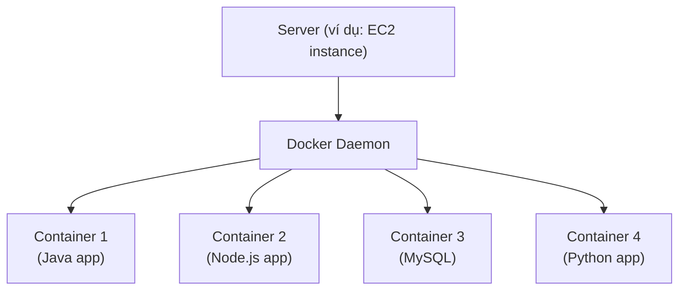

⭐⭐ **Nhiều container chạy trên CÙNG một server**, mỗi container độc lập với nhau.

---

### ⭐⭐⭐ Docker images được lưu ở đâu?

- ⭐⭐ **Docker images được lưu trong DOCKER REPOSITORIES**

| Repository | Đặc điểm |
|---|---|
| ⭐⭐ **Docker Hub** (https://hub.docker.com) | ⭐⭐ **PUBLIC repository**<br/>Tìm **base images** cho nhiều công nghệ/OS (ví dụ **Ubuntu, MySQL, …**) |
| ⭐⭐⭐ **Amazon ECR** (Elastic Container Registry) | ⭐⭐⭐ **PRIVATE repository**<br/>⭐⭐ **PUBLIC repository** (**Amazon ECR Public Gallery** — https://gallery.ecr.aws) |

> ⭐⭐⭐ **Nhớ: ECR có CẢ private VÀ public repository.** Đề hay bẫy "ECR chỉ private" — **sai**.

---

### ⭐⭐⭐ Docker vs. Virtual Machines — BẢNG RA THI

- ⭐⭐ **Docker "kiểu như" công nghệ ảo hóa, nhưng KHÔNG hẳn**
- ⭐⭐⭐ **Tài nguyên được CHIA SẺ với host → NHIỀU container trên MỘT server**

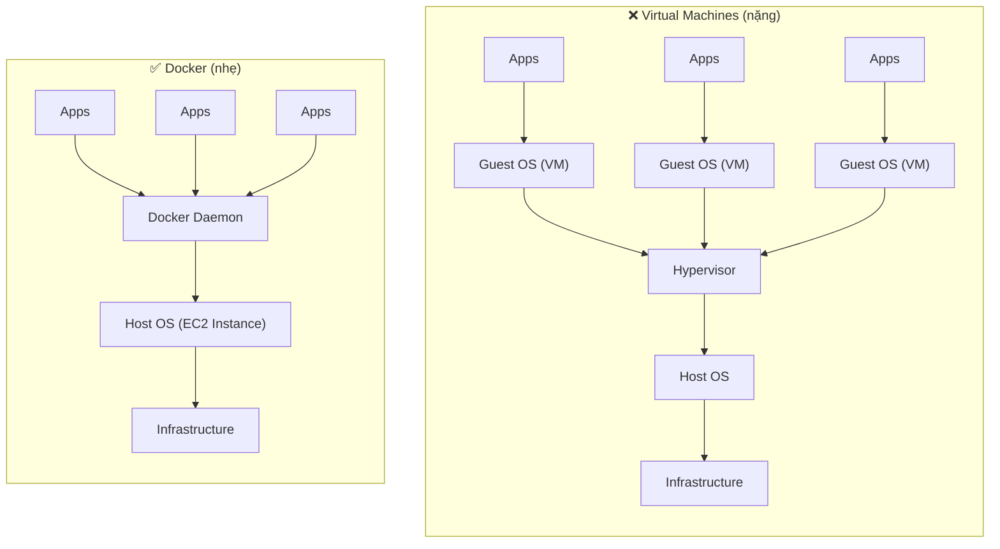

| | **Virtual Machines** | **Docker** |
|---|---|---|
| **Lớp trung gian** | ⚠️ **Hypervisor + Guest OS cho MỖI VM** | ✅ **Chỉ Docker Daemon, KHÔNG Guest OS** |
| **Tài nguyên** | Mỗi VM có tài nguyên riêng biệt | ⭐⭐⭐ **Chia sẻ với host** |
| **Mật độ** | Ít VM trên một server | ⭐⭐⭐ **Nhiều container trên một server** |
| **Khởi động** | Chậm (vài phút) | Nhanh (vài giây) |

---

### ⭐⭐ Getting Started with Docker — Vòng đời

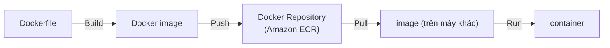

**Bốn động từ phải thuộc:** ⭐⭐⭐ **Build** (Dockerfile → image) → **Push** (image → repository) → **Pull** (repository → máy khác) → **Run** (image → container).

---

### ⭐⭐⭐ Docker Containers Management on AWS — 4 dịch vụ

| Dịch vụ | Mô tả |
|---|---|
| ⭐⭐⭐ **Amazon ECS** (Elastic Container Service) | **Nền tảng container RIÊNG của Amazon** |
| ⭐⭐⭐ **Amazon EKS** (Elastic Kubernetes Service) | **Kubernetes được quản lý (open source)** |
| ⭐⭐⭐ **AWS Fargate** | **Nền tảng container SERVERLESS riêng của Amazon**<br/>⭐⭐⭐ **Hoạt động với CẢ ECS VÀ EKS** |
| ⭐⭐⭐ **Amazon ECR** | **Lưu trữ container images** |

> ⭐⭐⭐ **Điểm hay bị nhầm nhất cả chương: Fargate KHÔNG phải một dịch vụ độc lập song song với ECS/EKS.** Fargate là **LAUNCH TYPE** — một chế độ chạy — dùng được cho **cả ECS và EKS**.

---

## 200. Amazon ECS

### ⭐⭐⭐ Amazon ECS - EC2 Launch Type

- ⭐⭐ **ECS = Elastic Container Service**
- ⭐⭐⭐ **Chạy Docker container trên AWS = Chạy ECS TASKS trên ECS CLUSTERS**
- ⚠️⭐⭐⭐ **EC2 Launch Type: BẠN PHẢI provision & bảo trì hạ tầng (các EC2 instances)**
- ⭐⭐⭐ **MỖI EC2 Instance PHẢI CHẠY "ECS AGENT" để đăng ký vào ECS Cluster**
- ⭐⭐ **AWS lo việc start / stop containers**

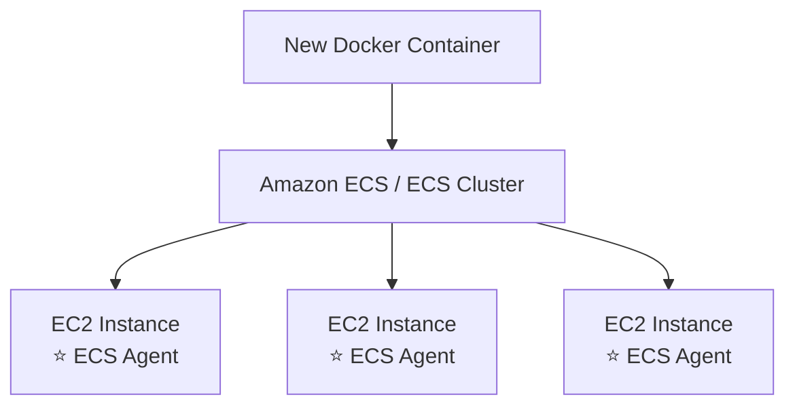

> ⭐⭐⭐ **Câu hỏi thi kinh điển:** *"EC2 instance không xuất hiện trong ECS Cluster, vì sao?"* → **ECS Agent chưa chạy** hoặc **EC2 Instance Profile thiếu quyền gọi ECS API**.

---

### ⭐⭐⭐ Amazon ECS – Fargate Launch Type

- ⭐⭐⭐ **Chạy Docker container trên AWS**
- ⭐⭐⭐ **BẠN KHÔNG provision hạ tầng (KHÔNG có EC2 instance nào để quản lý)**
- ⭐⭐⭐ **TẤT CẢ ĐỀU SERVERLESS!**
- ⭐⭐⭐ **Bạn chỉ cần tạo TASK DEFINITIONS**
- ⭐⭐⭐ **AWS chỉ việc chạy ECS Tasks cho bạn dựa trên CPU / RAM bạn cần**
- ⭐⭐⭐ **Để scale, chỉ cần TĂNG SỐ LƯỢNG TASKS. Đơn giản — không còn EC2 instances**

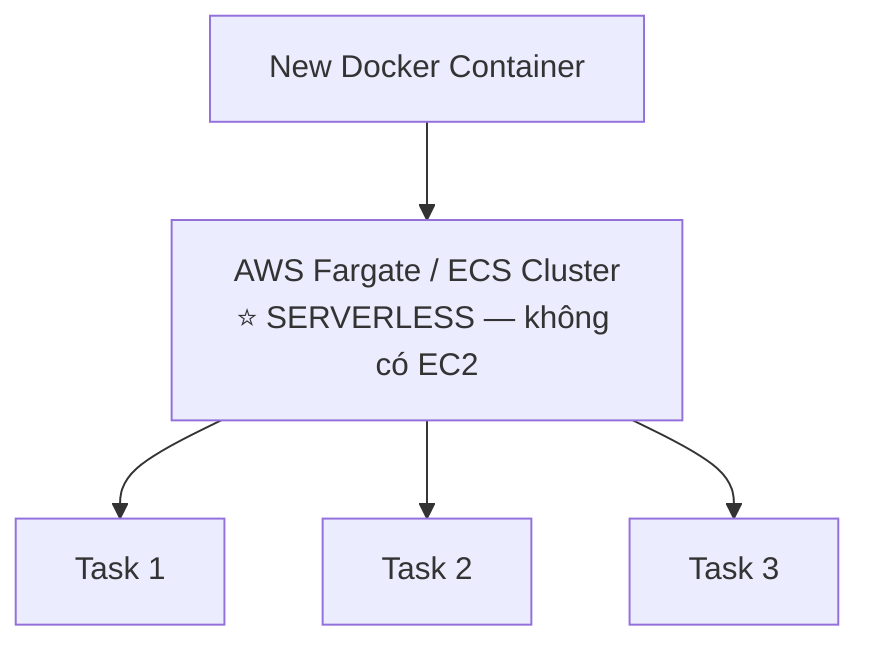

> ⭐⭐⭐ **BẢNG SO SÁNH HAI LAUNCH TYPE — RA THI CHẮC CHẮN:**

| | **EC2 Launch Type** | **Fargate Launch Type** |
|---|---|---|
| **Hạ tầng** | ⚠️ **BẠN provision & bảo trì EC2** | ✅ **KHÔNG có EC2 để quản lý** |
| **ECS Agent** | ⭐⭐⭐ **Bắt buộc, chạy trên mỗi EC2** | ✅ **Không cần** |
| **Serverless** | ❌ **Không** | ⭐⭐⭐ **CÓ** |
| **Cách scale** | Thêm **EC2 instances** + thêm tasks | ⭐⭐⭐ **Chỉ tăng SỐ TASKS** |
| **Tính phí** | Trả tiền **EC2 instance** (kể cả khi rảnh) | Trả theo **CPU/RAM của task** |
| **Khi nào chọn** | Cần kiểm soát sâu, tận dụng Reserved/Spot | ⭐⭐⭐ **Muốn ít vận hành nhất** |

> 💡 **Mẹo nhận diện đề thi:** hễ đề nói **"minimal operational overhead"**, **"không muốn quản lý server"**, **"serverless containers"** → **Fargate**.

---

### ⭐⭐⭐ Amazon ECS – IAM Roles for ECS (rất hay ra thi)

Có **HAI loại role hoàn toàn khác nhau** — đề thi bẫy chỗ này liên tục:

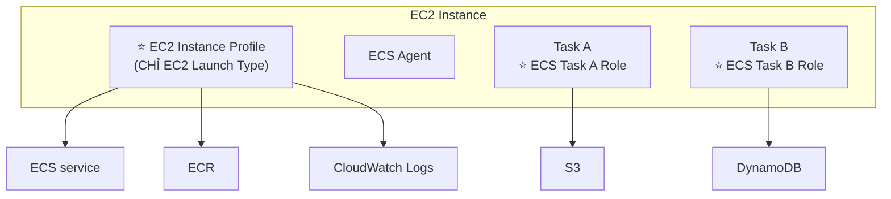

**1️⃣ EC2 Instance Profile** — ⭐⭐⭐ **CHỈ dùng cho EC2 Launch Type:**

- ⭐⭐⭐ **Được ECS AGENT sử dụng**
- ⭐⭐ **Gọi API tới ECS service**
- ⭐⭐ **Gửi container logs tới CloudWatch Logs**
- ⭐⭐⭐ **Pull Docker image từ ECR**
- ⭐⭐ **Tham chiếu dữ liệu nhạy cảm trong Secrets Manager hoặc SSM Parameter Store**

**2️⃣ ECS Task Role:**

- ⭐⭐⭐ **Cho phép MỖI TASK có một role riêng**
- ⭐⭐⭐ **Dùng role KHÁC NHAU cho các ECS Service khác nhau**
- ⭐⭐⭐ **Task Role được định nghĩa trong TASK DEFINITION**

> ⭐⭐⭐ **PHÂN BIỆT SỐNG CÒN:**
> - **Task CẦN gọi S3/DynamoDB/SQS** (logic ứng dụng của bạn) → **ECS Task Role**
> - **Agent CẦN pull image từ ECR / gửi log** (hạ tầng) → **EC2 Instance Profile**
>
> Đề hỏi *"cách nào cho từng container quyền riêng biệt tới S3?"* → **ECS Task Role, định nghĩa trong task definition**. Đáp án sai: "gắn IAM role vào EC2 instance" (mọi task sẽ dùng chung quyền — vi phạm least privilege).

---

### ⭐⭐⭐ Amazon ECS – Load Balancer Integrations

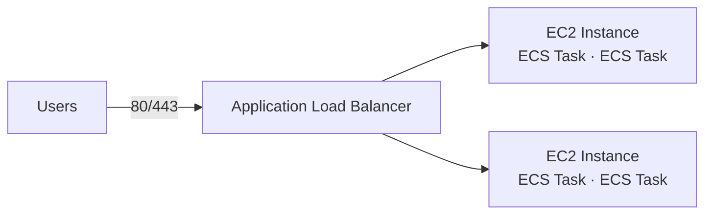

| Load Balancer | Khuyến nghị |
|---|---|
| ⭐⭐⭐ **Application Load Balancer (ALB)** | ✅ **Được hỗ trợ và phù hợp với HẦU HẾT use cases** |
| ⭐⭐⭐ **Network Load Balancer (NLB)** | ⭐ **CHỈ khuyến nghị cho high throughput / high performance**, hoặc để **ghép với AWS PrivateLink** |
| ⚠️⭐⭐ **Classic Load Balancer (CLB)** | ⚠️ **Được hỗ trợ NHƯNG KHÔNG khuyến nghị** — không có tính năng nâng cao, **KHÔNG hỗ trợ Fargate** |

> ⭐⭐⭐ **Nhớ: CLB KHÔNG dùng được với Fargate.** Đây là chi tiết đề thi rất thích hỏi.

---

### ⭐⭐⭐ Amazon ECS – Data Volumes (EFS)

- ⭐⭐⭐ **Mount EFS file systems lên ECS tasks**
- ⭐⭐⭐ **Hoạt động với CẢ EC2 và Fargate launch types**
- ⭐⭐⭐ **Tasks chạy ở BẤT KỲ AZ nào đều CHIA SẺ CÙNG dữ liệu trong EFS file system**
- ⭐⭐⭐ **Fargate + EFS = SERVERLESS hoàn toàn**
- ⭐⭐⭐ **Use case: lưu trữ chia sẻ BỀN VỮNG, ĐA AZ cho containers**
- ⚠️⭐⭐⭐ **Lưu ý: Amazon S3 KHÔNG THỂ mount như một file system**

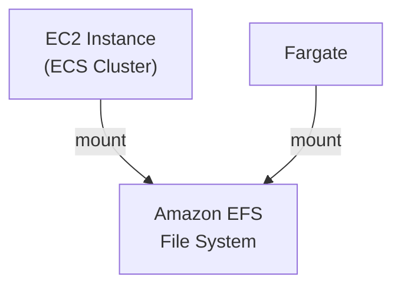

> ⭐⭐⭐ **Câu hỏi thi ĐINH:** *"Container cần lưu trữ chia sẻ, bền vững, truy cập từ nhiều AZ. Dùng gì?"* → **Amazon EFS**.
> ❌ **Đáp án sai:** "Mount S3 bucket" — **S3 KHÔNG mount được**. ❌ "Dùng EBS" — **EBS chỉ gắn 1 AZ, 1 instance**.
>
> 💡 **Cụm từ vàng: "Fargate + EFS = Serverless"** — đây là kiến trúc container serverless có lưu trữ bền vững.

---

## 201. Creating ECS Cluster - Hands On

> 🖐️ Bài Hands On — **không có slide**. Các bước Console.

### Tạo ECS Cluster

1. Console → tìm **Elastic Container Service (ECS)** → **Clusters** → **Create cluster**
2. **Cluster name**: `demo-cluster`
3. **Infrastructure** — ⭐⭐⭐ chọn một hoặc nhiều:

| Lựa chọn | Ý nghĩa |
|---|---|
| ⭐⭐⭐ **AWS Fargate (serverless)** | **Mặc định bật sẵn** — không cần EC2 |
| ⭐⭐⭐ **Amazon EC2 instances** | Tạo **Auto Scaling Group** chứa các EC2 chạy ECS Agent |
| **External instances using ECS Anywhere** | Chạy ECS trên server on-premises |

4. Nếu chọn **Amazon EC2 instances**, cấu hình **Auto Scaling group**:
   - **Provisioning model**: **On-Demand** hoặc ⭐ **Spot** (rẻ hơn nhiều)
   - ⭐⭐⭐ **Operating system/Architecture**: **Amazon Linux 2023** — ⚠️ **PHẢI là ECS-optimized AMI** (đã cài sẵn ECS Agent)
   - **EC2 instance type**: `t3.micro`
   - **Desired capacity**: Minimum `0`, Maximum `2`
   - **SSH Key pair** (tùy chọn)
   - **Root EBS volume size**: `30 GiB`
5. **Network settings for Amazon EC2 instances**: chọn **VPC**, **Subnets**, **Security group**
6. **Monitoring** (tùy chọn): bật ⭐ **Use Container Insights** — thu thập metrics/logs
7. **Create** → ECS tạo một **CloudFormation stack** ở nền, mất **~3–5 phút**

### Kiểm tra

- Tab **Infrastructure** → thấy **Container instances** (nếu dùng EC2) đăng ký vào cluster
- ⭐⭐⭐ Nếu EC2 **không** xuất hiện: kiểm tra **AMI có phải ECS-optimized không** và **Instance Profile `ecsInstanceRole`** có quyền không
- Tab **Capacity providers** → thấy **FARGATE**, **FARGATE_SPOT**, và **ASG capacity provider** vừa tạo

### CLI tương đương

```bash
# Tạo cluster (Fargate only)
aws ecs create-cluster --cluster-name demo-cluster

# Liệt kê cluster
aws ecs list-clusters

# Xem chi tiết cluster
aws ecs describe-clusters --clusters demo-cluster

# Liệt kê container instances (EC2 launch type)
aws ecs list-container-instances --cluster demo-cluster
```

> ⚠️ **Nếu chọn EC2 instances, bạn bị tính phí EC2 kể cả khi không chạy task nào.** `t3.micro` nằm trong Free Tier 750 giờ/tháng năm đầu, nhưng **EBS 30 GiB × số instance** thì không. Xem bài 205 để dọn dẹp.

---

## 202. Creating ECS Service - Hands On

> 🖐️ Bài Hands On — **không có slide**. Đây là bài dài nhất chương, gồm **Task Definition** rồi mới tới **Service**.

### ⭐⭐⭐ Bước 1 — Tạo Task Definition

**Task Definition** là **"bản thiết kế"** mô tả container chạy thế nào — tương tự `docker run` được ghi thành file JSON.

1. ECS → **Task definitions** → **Create new task definition**
2. **Task definition family**: `demo-task`
3. ⭐⭐⭐ **Infrastructure requirements**:

| Trường | Giá trị demo | Ghi chú |
|---|---|---|
| ⭐⭐⭐ **Launch type** | **AWS Fargate** hoặc **Amazon EC2 instances** | |
| **Operating system/Architecture** | **Linux/X86_64** | |
| ⭐⭐⭐ **CPU** | `.25 vCPU` | Fargate có các mức cố định |
| ⭐⭐⭐ **Memory** | `.5 GB` | Phải hợp lệ với mức CPU đã chọn |
| ⭐⭐⭐ **Task execution role** | `ecsTaskExecutionRole` | ⭐ **Role để PULL IMAGE và GỬI LOG** |
| ⭐⭐⭐ **Task role** | (tùy chọn) | ⭐ **Role cho CODE trong container gọi AWS API** |

4. ⭐⭐⭐ **Container - 1**:
   - **Name**: `demo-container`
   - **Image URI**: `nginxdemos/hello` (hoặc image trong ECR của bạn)
   - **Container port**: `80`, **Protocol**: `TCP`
5. **Environment variables**, **Logging** (bật **Use log collection** → CloudWatch Logs), **HealthCheck** (tùy chọn)
6. **Create**

> ⭐⭐⭐ **PHÂN BIỆT HAI ROLE Ở BƯỚC 3 — ĐỀ THI RẤT HAY HỎI:**
> - **Task Execution Role** = role của **ECS agent/Fargate**, dùng để **pull image từ ECR** và **ghi log vào CloudWatch**
> - **Task Role** = role của **ứng dụng bên trong container**, dùng để gọi **S3, DynamoDB, SQS…**
>
> Đây chính là nội dung slide bài 200, nhưng thể hiện cụ thể trên Console.

### ⭐⭐⭐ Bước 2 — Tạo ECS Service

**Service** đảm bảo **luôn có N task chạy**, tự thay thế task chết, và nối vào Load Balancer.

1. Vào **Cluster** `demo-cluster` → tab **Services** → **Create**
2. ⭐⭐⭐ **Compute configuration**:
   - **Capacity provider strategy** (khuyến nghị) hoặc **Launch type**
   - Chọn **FARGATE** / **FARGATE_SPOT** / ASG capacity provider
3. ⭐⭐⭐ **Deployment configuration**:

| Trường | Giá trị | Ghi chú |
|---|---|---|
| ⭐⭐ **Application type** | **Service** (chạy liên tục) hoặc **Task** (chạy một lần rồi thoát) | ⭐ **Task** dùng cho batch job |
| **Family** | `demo-task` | Task definition vừa tạo |
| **Revision** | `1 (LATEST)` | |
| **Service name** | `demo-service` | |
| ⭐⭐⭐ **Desired tasks** | `2` | **Số task muốn luôn chạy** |
| ⭐⭐ **Deployment type** | **Rolling update** hoặc **Blue/green (CodeDeploy)** | |
| ⭐⭐ **Min running tasks %** | `100` | Trong khi deploy, tối thiểu bao nhiêu % task còn chạy |
| ⭐⭐ **Max running tasks %** | `200` | Tối đa bao nhiêu % task được chạy |

4. ⭐⭐ **Networking**: chọn **VPC**, **Subnets**, **Security group** (mở port **80**)
   - ⚠️ Với Fargate, **Public IP** phải bật nếu subnet là public và cần pull image từ Internet
5. ⭐⭐⭐ **Load balancing**:
   - **Load balancer type**: **Application Load Balancer**
   - **Create a new load balancer** → tên `demo-alb`
   - **Listener**: port `80`, protocol `HTTP`
   - **Target group**: tên `demo-tg`, ⭐⭐⭐ **Target type tự động là `IP`** với Fargate
   - **Health check path**: `/`
6. **Service auto scaling** (tùy chọn — xem bài 203)
7. **Create** → chờ **~2–3 phút**

### Kiểm tra kết quả

1. Tab **Tasks** → thấy **2 task** ở trạng thái **Running**
2. Vào **EC2 → Load Balancers** → copy **DNS name** của `demo-alb`
3. Mở trình duyệt → dán DNS name → thấy trang web của container
4. **Refresh nhiều lần** → ⭐ thấy **hostname/IP đổi qua lại** giữa 2 task (ALB đang load balance)

### ⭐⭐ Thử scaling thủ công

- Service → **Update service** → đổi **Desired tasks** từ `2` thành `4` → **Update**
- Tab **Tasks** → thấy ECS tự khởi động thêm 2 task mới và đăng ký vào Target Group

### CLI tương đương

```bash
# Đăng ký task definition từ file JSON
aws ecs register-task-definition --cli-input-json file://task-definition.json

# Tạo service
aws ecs create-service \
  --cluster demo-cluster \
  --service-name demo-service \
  --task-definition demo-task:1 \
  --desired-count 2 \
  --launch-type FARGATE \
  --network-configuration "awsvpcConfiguration={subnets=[subnet-abc,subnet-def],securityGroups=[sg-123],assignPublicIp=ENABLED}"

# Cập nhật số task
aws ecs update-service --cluster demo-cluster --service demo-service --desired-count 4

# Xem task đang chạy
aws ecs list-tasks --cluster demo-cluster --service-name demo-service
```

---

## 203. Amazon ECS - Auto Scaling

### ⭐⭐⭐ ECS Service Auto Scaling (task level)

- ⭐⭐⭐ **Tự động TĂNG/GIẢM số lượng ECS TASKS mong muốn**
- ⭐⭐⭐ **Amazon ECS Auto Scaling dùng AWS APPLICATION AUTO SCALING**

**⭐⭐⭐ BA metrics dùng để scale:**

| Metric | Ý nghĩa |
|---|---|
| ⭐⭐⭐ **ECS Service Average CPU Utilization** | Scale theo **CPU** |
| ⭐⭐⭐ **ECS Service Average Memory Utilization** | ⭐ **Scale theo RAM** |
| ⭐⭐⭐ **ALB Request Count Per Target** | ⭐⭐ **Metric ĐẾN TỪ ALB** |

**⭐⭐⭐ BA kiểu scaling:**

| Kiểu | Cách hoạt động |
|---|---|
| ⭐⭐⭐ **Target Tracking** | **Scale theo GIÁ TRỊ MỤC TIÊU của một CloudWatch metric cụ thể** |
| ⭐⭐⭐ **Step Scaling** | **Scale dựa trên một CloudWatch ALARM cụ thể** |
| ⭐⭐⭐ **Scheduled Scaling** | **Scale theo NGÀY/GIỜ định sẵn** (thay đổi **đoán trước được**) |

**Hai điểm chốt:** ⭐⭐⭐

- ⚠️⭐⭐⭐ **ECS Service Auto Scaling (MỨC TASK) ≠ EC2 Auto Scaling (MỨC EC2 INSTANCE)**
- ⭐⭐⭐ **Fargate Auto Scaling DỄ SETUP HƠN NHIỀU (vì Serverless)**

> ⭐⭐⭐ **Đây là dòng phân biệt quan trọng nhất của bài này.** Đề thi bẫy: *"Scale số container lên"* → **ECS Service Auto Scaling**. *"Scale số máy EC2 lên"* → **EC2 ASG / Capacity Provider**. **Hai thứ HOÀN TOÀN KHÁC NHAU** và với **EC2 Launch Type bạn phải làm CẢ HAI**.

---

### ⭐⭐⭐ EC2 Launch Type – Auto Scaling EC2 Instances

- ⭐⭐⭐ **Đáp ứng ECS Service Scaling bằng cách THÊM các EC2 Instances bên dưới**

**Hai cách:**

| Cách | Chi tiết |
|---|---|
| ⭐⭐ **Auto Scaling Group Scaling** | **Scale ASG dựa trên CPU Utilization** — thêm EC2 instance theo thời gian |
| ⭐⭐⭐ **ECS Cluster Capacity Provider** | ⭐⭐⭐ **Tự động provision và scale HẠ TẦNG cho ECS Tasks**<br/>⭐⭐⭐ **Capacity Provider được GHÉP với một Auto Scaling Group**<br/>⭐⭐⭐ **Thêm EC2 Instances KHI THIẾU CAPACITY (CPU, RAM…)** |

> ⭐⭐⭐ **ECS Cluster Capacity Provider là đáp án "hiện đại" và đúng hơn.** Đề hỏi *"cách nào tự động thêm EC2 khi không đủ chỗ đặt task?"* → **Capacity Provider** (thông minh hơn ASG scaling theo CPU, vì nó biết task đang **PENDING** vì thiếu chỗ).

---

### ⭐⭐ ECS Scaling – Service CPU Usage Example

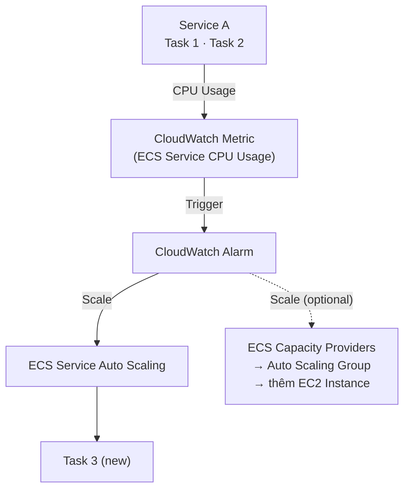

**Luồng đầy đủ:**

1. **CPU của Service A tăng cao**
2. **CloudWatch Metric (ECS Service CPU Usage) vượt ngưỡng**
3. **CloudWatch Alarm kích hoạt**
4. ⭐⭐⭐ **ECS Service Auto Scaling thêm Task 3**
5. ⭐⭐ **(Tùy chọn) Capacity Provider scale ASG để có thêm EC2 instance chứa task mới**

---

## 204. Amazon ECS - Solutions Architectures

Bốn kiến trúc mẫu, **cả bốn đều có khả năng ra thi**.

---

### ⭐⭐⭐ 1️⃣ ECS tasks invoked by EventBridge

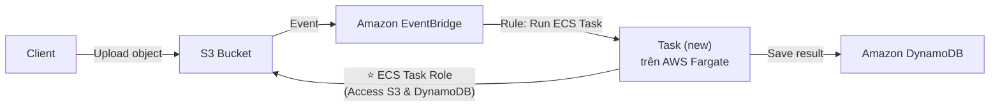

**Luồng:** Client upload object vào S3 → S3 phát event → **EventBridge Rule** chạy **ECS Task mới trên Fargate** → Task dùng **ECS Task Role** để **Get object** từ S3, xử lý, rồi **Save result** vào DynamoDB.

> ⭐⭐⭐ **Đây là kiến trúc "xử lý file khi upload" phiên bản container** (bản Lambda sẽ học ở chương Serverless). Dùng khi **xử lý quá nặng hoặc quá lâu cho Lambda**.

---

### ⭐⭐ 2️⃣ ECS tasks invoked by EventBridge Schedule

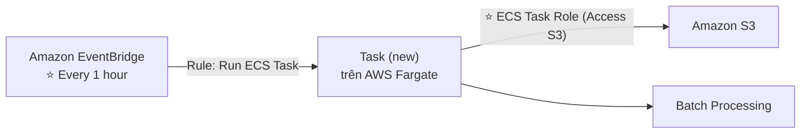

**Luồng:** **EventBridge Schedule (mỗi 1 giờ)** → chạy **ECS Task mới** → task làm **Batch Processing** trên dữ liệu trong S3.

> ⭐⭐ **Từ khóa: "chạy định kỳ", "cron job", "batch processing hàng giờ"** → **EventBridge Schedule + ECS Task (Fargate)**.

---

### ⭐⭐⭐ 3️⃣ ECS – SQS Queue Example

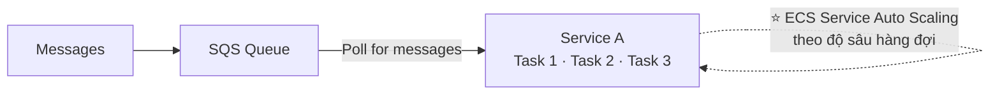

**Luồng:** Message vào **SQS Queue** → các **ECS Task poll message** → **ECS Service Auto Scaling** tăng/giảm số task theo lượng message.

> ⭐⭐⭐ **Đây là ghép của chương 17 + chương 18** — pattern **worker queue** kinh điển. Đề hay hỏi *"xử lý hàng đợi công việc, tự co giãn theo tải"* → **SQS + ECS Service Auto Scaling**.

---

### ⭐⭐ 4️⃣ ECS – Intercept Stopped Tasks using EventBridge

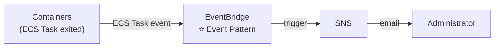

**Luồng:** Task **EXITED (thoát bất thường)** → phát **ECS Task event** → **EventBridge Event Pattern** khớp → **trigger SNS** → **gửi email cho Administrator**.

> ⭐⭐ **Từ khóa: "được thông báo khi container dừng đột ngột"** → **EventBridge Event Pattern + SNS**.
>
> 💡 **Phân biệt:** kiến trúc 2 dùng **Schedule** (theo thời gian), kiến trúc 4 dùng **Event Pattern** (theo sự kiện).

---

## 205. Amazon ECS - Clean Up - Hands On

> 🖐️ Bài Hands On — **không có slide**. ⚠️ **Bài NGẮN NHẤT nhưng QUAN TRỌNG NHẤT về mặt chi phí.**

### ⭐⭐⭐ Thứ tự dọn dẹp ĐÚNG (làm sai sẽ không xóa được)

| # | Việc cần làm | Đường dẫn |
|---|---|---|
| **1** | ⭐⭐⭐ **Xóa ECS Service** (đặt desired tasks = 0 trước nếu cần) | Cluster → Services → chọn → **Delete** |
| **2** | **Dừng các task lẻ đang chạy** | Cluster → Tasks → **Stop all** |
| **3** | ⭐⭐⭐ **Xóa Load Balancer (ALB)** | EC2 → Load Balancers → **Delete** |
| **4** | ⭐⭐ **Xóa Target Group** | EC2 → Target Groups → **Delete** |
| **5** | ⭐⭐⭐ **Xóa ECS Cluster** | ECS → Clusters → **Delete cluster** |
| **6** | ⭐⭐⭐ **Kiểm tra Auto Scaling Group và EC2 instances đã bị xóa chưa** | EC2 → Auto Scaling Groups |
| **7** | ⭐⭐ **Deregister Task Definition** (tùy chọn — không tính phí) | ECS → Task definitions → **Deregister** |
| **8** | ⭐⭐ **Xóa CloudWatch Log Group** `/ecs/demo-task` | CloudWatch → Log groups → **Delete** |

### ⚠️⭐⭐⭐ Những thứ RẤT DỄ QUÊN và vẫn tính tiền

| Tài nguyên | Chi phí | Ghi chú |
|---|---|---|
| ⚠️⭐⭐⭐ **Application Load Balancer** | **~$16–18/tháng** kể cả khi không có traffic | **Tốn nhất — phải xóa!** |
| ⚠️⭐⭐⭐ **EC2 instances trong ASG** | Theo giờ | Xóa cluster **nên** xóa luôn ASG, nhưng **phải kiểm tra lại** |
| ⚠️⭐⭐ **EBS volumes 30 GiB** của các EC2 | ~$3/tháng mỗi volume | Kiểm tra **EC2 → Volumes**, xóa volume `available` |
| ⚠️⭐⭐ **NAT Gateway** (nếu tạo VPC mới) | **~$32/tháng** | ⚠️ **Nếu wizard tạo VPC mới có NAT Gateway thì đây là thứ tốn nhất** |
| ⚠️ **CloudFormation stack** do ECS tạo | — | ECS tạo stack ở nền; nếu xóa cluster lỗi, vào **CloudFormation → Delete stack** |

### CLI để kiểm tra sót

```bash
# Kiểm tra còn service nào không
aws ecs list-services --cluster demo-cluster

# Xóa service (bắt buộc --force nếu còn task chạy)
aws ecs delete-service --cluster demo-cluster --service demo-service --force

# Xóa cluster
aws ecs delete-cluster --cluster demo-cluster

# Kiểm tra ALB còn sót
aws elbv2 describe-load-balancers --query 'LoadBalancers[].LoadBalancerName'

# Kiểm tra EBS volume mồ côi
aws ec2 describe-volumes --filters Name=status,Values=available
```

> ⭐⭐⭐ **Lời khuyên:** sau khi dọn xong, vào **Billing → Cost Explorer** hoặc **Billing → Bills** ngày hôm sau để chắc chắn không còn dịch vụ nào phát sinh chi phí.

---

## 206. Amazon ECR

### ⭐⭐⭐ Amazon ECR là gì?

- ⭐⭐ **ECR = Elastic Container Registry**
- ⭐⭐⭐ **Lưu trữ và quản lý Docker images trên AWS**
- ⭐⭐⭐ **CÓ CẢ Private VÀ Public repository** (**Amazon ECR Public Gallery** — https://gallery.ecr.aws)
- ⭐⭐⭐ **Tích hợp hoàn toàn với ECS, được HẬU THUẪN BỞI AMAZON S3**
- ⭐⭐⭐ **Quyền truy cập được kiểm soát qua IAM** (⚠️ **lỗi permission ⇒ vấn đề ở POLICY**)
- ⭐⭐⭐ **Hỗ trợ: image vulnerability scanning, versioning, image tags, image lifecycle, …**

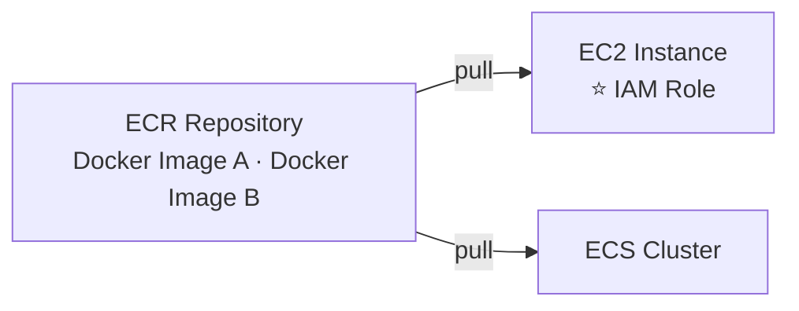

> ⭐⭐⭐ **Câu hỏi thi số 1 về ECR:** *"ECS task KHÔNG pull được image từ ECR, lỗi ở đâu?"* → **IAM policy/role thiếu quyền** (`ecr:GetAuthorizationToken`, `ecr:BatchGetImage`, `ecr:GetDownloadUrlForLayer`). Slide ghi thẳng: **"permission errors ⇒ policy"**.

> ⭐⭐ **Chi tiết hay bị hỏi:** **ECR được backed bởi Amazon S3** — nghĩa là image layers thực chất nằm trên S3, nên bền vững và co giãn tốt.

### ⭐⭐ Các lệnh Docker + ECR (bổ sung ngoài slide, hay gặp)

```bash
# 1. Đăng nhập vào ECR (lấy token và đưa vào docker login)
aws ecr get-login-password --region us-east-1 \
  | docker login --username AWS --password-stdin 123456789012.dkr.ecr.us-east-1.amazonaws.com

# 2. Tạo repository
aws ecr create-repository --repository-name demo-app

# 3. Build image
docker build -t demo-app .

# 4. Tag image theo định dạng ECR
docker tag demo-app:latest 123456789012.dkr.ecr.us-east-1.amazonaws.com/demo-app:latest

# 5. Push lên ECR
docker push 123456789012.dkr.ecr.us-east-1.amazonaws.com/demo-app:latest

# 6. Pull về
docker pull 123456789012.dkr.ecr.us-east-1.amazonaws.com/demo-app:latest
```

⭐⭐ **Định dạng URI của ECR image:** `<account-id>.dkr.ecr.<region>.amazonaws.com/<repo-name>:<tag>`

**Ba tính năng hay ra thi:** ⭐⭐

| Tính năng | Ý nghĩa |
|---|---|
| ⭐⭐⭐ **Image Scanning** | Quét **lỗ hổng bảo mật (CVE)** trong image — **Basic scanning** (khi push) hoặc **Enhanced scanning** (dùng **Amazon Inspector**, quét liên tục) |
| ⭐⭐ **Lifecycle Policy** | **Tự động xóa image cũ** để tiết kiệm chi phí lưu trữ |
| ⭐⭐ **Image Tags / Tag immutability** | Khóa tag không cho ghi đè (ví dụ tag `v1.0` không bị push đè) |

---

## 207. Amazon EKS - Overview

### ⭐⭐⭐ Amazon EKS là gì?

- ⭐⭐ **Amazon EKS = Amazon Elastic Kubernetes Service**
- ⭐⭐⭐ **Là cách để chạy các cụm KUBERNETES ĐƯỢC QUẢN LÝ (managed) trên AWS**
- ⭐⭐⭐ **Kubernetes là hệ thống MÃ NGUỒN MỞ để tự động deployment, scaling và management ứng dụng đóng container (thường là Docker)**
- ⭐⭐⭐ **Là LỰA CHỌN THAY THẾ cho ECS — mục tiêu giống nhau nhưng API KHÁC NHAU**
- ⭐⭐⭐ **EKS hỗ trợ EC2 nếu bạn muốn deploy worker nodes, hoặc FARGATE để deploy serverless containers**
- ⭐⭐⭐ **Use case: nếu công ty ĐÃ DÙNG Kubernetes on-premises hoặc trên cloud khác, và muốn migrate lên AWS bằng Kubernetes**
- ⭐⭐⭐ **Kubernetes là CLOUD-AGNOSTIC (dùng được trên mọi cloud — Azure, GCP…)**
- ⭐⭐⭐ **Với NHIỀU REGION: deploy MỘT EKS cluster CHO MỖI REGION**
- ⭐⭐⭐ **Thu thập logs và metrics bằng CLOUDWATCH CONTAINER INSIGHTS**

> ⭐⭐⭐ **CÂU HỎI THI ĐINH — PHÂN BIỆT ECS vs EKS:**
> - Đề nói **"công ty đã dùng Kubernetes"**, **"cloud-agnostic"**, **"multi-cloud"**, **"migrate Kubernetes workload"** → **EKS**
> - Đề nói **"đơn giản nhất"**, **"AWS-native"**, **"không có kinh nghiệm Kubernetes"** → **ECS**
>
> ⭐⭐⭐ Và nhớ: **"Collect logs and metrics" cho EKS → CloudWatch Container Insights**.

---

### ⭐⭐ Amazon EKS – Sơ đồ kiến trúc

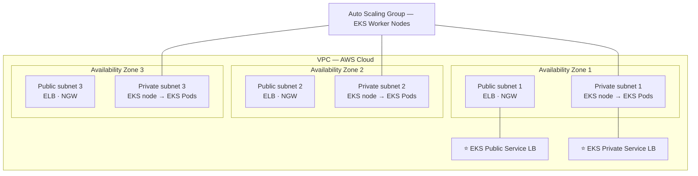

**Ba tầng cần nhớ:** ⭐⭐

- ⭐⭐ **Public subnets**: chứa **ELB** (public service load balancer) và **NAT Gateway**
- ⭐⭐⭐ **Private subnets**: chứa **EKS nodes** và **EKS Pods** — nơi workload thật sự chạy
- ⭐⭐ **Auto Scaling Group** quản lý các **EKS Worker Nodes** trải trên nhiều AZ
- ⭐⭐ **EKS Service** có thể expose ra ngoài (**Public Service LB**) hoặc chỉ nội bộ (**Private Service LB**)

---

### ⭐⭐⭐ Amazon EKS – Node Types (3 loại — ra thi)

| Loại | Đặc điểm |
|---|---|
| ⭐⭐⭐ **Managed Node Groups** | **AWS TẠO và QUẢN LÝ Nodes (EC2 instances) cho bạn**<br/>⭐⭐ **Nodes nằm trong một ASG do EKS quản lý**<br/>⭐⭐ **Hỗ trợ On-Demand hoặc SPOT Instances** |
| ⭐⭐⭐ **Self-Managed Nodes** | **BẠN tự tạo node rồi đăng ký vào EKS cluster, quản lý bằng ASG của bạn**<br/>⭐⭐ **Dùng được AMI dựng sẵn — "Amazon EKS Optimized AMI"**<br/>⭐⭐ **Hỗ trợ On-Demand hoặc SPOT Instances** |
| ⭐⭐⭐ **AWS Fargate** | ⭐⭐⭐ **KHÔNG cần bảo trì gì cả; KHÔNG có node nào để quản lý** |

> ⭐⭐⭐ **Cách nhớ 3 loại:**
> - **Managed** = AWS lo node, bạn vẫn thấy EC2
> - **Self-Managed** = bạn lo hết, dùng **EKS Optimized AMI**
> - **Fargate** = **không có node nào cả**
>
> ⭐⭐ **Cả Managed và Self-Managed đều hỗ trợ Spot Instances** — chi tiết này hay bị hỏi khi đề nói "tối ưu chi phí".

---

### ⭐⭐⭐ Amazon EKS – Data Volumes

- ⭐⭐⭐ **Cần khai báo `StorageClass` manifest trên EKS cluster**
- ⭐⭐⭐ **Sử dụng driver tuân thủ CSI (Container Storage Interface)**

**⭐⭐⭐ Bốn loại storage được hỗ trợ:**

| Storage | Ghi chú |
|---|---|
| ⭐⭐⭐ **Amazon EBS** | Block storage |
| ⭐⭐⭐ **Amazon EFS** | ⭐⭐⭐ **LOẠI DUY NHẤT hoạt động với FARGATE** |
| ⭐⭐ **Amazon FSx for Lustre** | HPC |
| ⭐⭐ **Amazon FSx for NetApp ONTAP** | Đa giao thức |

> ⭐⭐⭐ **Điểm ra thi:** slide ghi rõ **"Amazon EFS (works with Fargate)"** — chỉ có EFS được chú thích như vậy. Đề hỏi *"EKS trên Fargate cần persistent storage, dùng gì?"* → **Amazon EFS**.
>
> ⭐⭐ Và nhớ **`StorageClass` + `CSI driver`** — hai từ khóa đặc trưng của EKS.

---

## 208. Amazon EKS - Hands On

> 🖐️ Bài Hands On — **không có slide**. ⚠️ **ĐÂY LÀ BÀI TỐN TIỀN NHẤT TOÀN KHÓA HỌC — đọc kỹ cảnh báo chi phí ở cuối.**

### ⚠️⭐⭐⭐ ĐỌC TRƯỚC KHI LÀM

**EKS Control Plane tính phí $0.10/giờ = ~$73/tháng, KHÔNG có Free Tier, tính từ giây đầu tiên cluster tồn tại.** Cộng thêm EC2 worker nodes và NAT Gateway thì **một buổi thực hành có thể tốn $5–10**.

💡 **Khuyến nghị: CHỈ XEM VIDEO.** Toàn bộ kiến thức thi nằm ở bài 207, không ở thao tác.

### Bước 1 — Tạo IAM Role cho EKS Cluster

1. IAM → **Roles** → **Create role**
2. **Trusted entity type**: **AWS service** → **Use case**: **EKS** → **EKS - Cluster**
3. Policy tự gắn: ⭐ **`AmazonEKSClusterPolicy`**
4. **Role name**: `eksClusterRole` → **Create role**

### Bước 2 — Tạo EKS Cluster

1. Console → tìm **Elastic Kubernetes Service (EKS)** → **Add cluster** → **Create**
2. ⭐⭐ **Cluster configuration**:

| Trường | Giá trị |
|---|---|
| **Name** | `demo-eks-cluster` |
| ⭐ **Kubernetes version** | phiên bản mới nhất (ví dụ `1.31`) |
| ⭐⭐⭐ **Cluster service role** | `eksClusterRole` (vừa tạo) |

3. ⭐⭐ **Networking**: chọn **VPC**, **Subnets** (ít nhất **2 AZ**), **Security groups**
4. ⭐⭐⭐ **Cluster endpoint access**:

| Lựa chọn | Ý nghĩa |
|---|---|
| ⭐ **Public** | API server truy cập từ Internet |
| ⭐ **Public and private** | Cả hai |
| ⭐⭐ **Private** | Chỉ trong VPC |

5. ⭐ **Observability**: bật **Control plane logging** (tùy chọn — tốn phí CloudWatch Logs)
6. **Create** → ⚠️ **mất ~10–15 phút**, **tính tiền ngay từ lúc này**

### Bước 3 — Tạo Node Group (worker nodes)

1. IAM → tạo role `eksNodeRole` cho **EC2**, gắn **3 policy**:
   - ⭐⭐ **`AmazonEKSWorkerNodePolicy`**
   - ⭐⭐ **`AmazonEC2ContainerRegistryReadOnly`** (để pull image từ ECR)
   - ⭐⭐ **`AmazonEKS_CNI_Policy`** (networking cho pod)
2. Vào cluster → tab **Compute** → **Add node group**
3. **Name**: `demo-node-group`, **Node IAM role**: `eksNodeRole`
4. ⭐⭐ **Compute configuration**:
   - **AMI type**: ⭐ **Amazon Linux 2023 (AL2023_x86_64_STANDARD)** — đây chính là **EKS Optimized AMI**
   - **Capacity type**: ⭐ **On-Demand** hoặc **Spot**
   - **Instance types**: `t3.medium`
   - **Disk size**: `20 GiB`
5. ⭐⭐ **Scaling configuration**: **Desired 2, Minimum 1, Maximum 3** ← đây chính là **ASG do EKS quản lý**
6. **Create** → mất **~5 phút**

### Bước 4 — Kết nối bằng `kubectl`

```bash
# Cài kubectl (nếu chưa có)
curl -O https://s3.us-west-2.amazonaws.com/amazon-eks/1.31.0/2024-09-12/bin/linux/amd64/kubectl
chmod +x kubectl && sudo mv kubectl /usr/local/bin/

# ⭐⭐⭐ Cập nhật kubeconfig để kubectl trỏ tới EKS cluster
aws eks update-kubeconfig --region us-east-1 --name demo-eks-cluster

# Kiểm tra kết nối
kubectl get nodes
kubectl get svc
kubectl get pods --all-namespaces
```

> ⭐⭐⭐ **Lệnh `aws eks update-kubeconfig` là lệnh quan trọng nhất của bài này** — nó ghi thông tin cluster vào `~/.kube/config` để `kubectl` biết nói chuyện với EKS.

### Bước 5 — Deploy một ứng dụng thử

```bash
# Deploy nginx
kubectl create deployment nginx-demo --image=nginx --replicas=2

# Expose ra Internet qua ELB (⭐ EKS tự tạo một Load Balancer)
kubectl expose deployment nginx-demo --port=80 --type=LoadBalancer

# Lấy DNS name của LB (cột EXTERNAL-IP)
kubectl get svc nginx-demo

# Xem pods
kubectl get pods -o wide
```

> ⭐⭐ **Điểm đáng chú ý:** lệnh `kubectl expose --type=LoadBalancer` khiến **EKS tự động tạo một AWS Load Balancer** — đây chính là **"EKS Public Service LB"** trong sơ đồ bài 207.

### ⚠️⭐⭐⭐ Bước 6 — DỌN DẸP (BẮT BUỘC, đúng thứ tự)

| # | Việc | Lệnh / Đường dẫn |
|---|---|---|
| **1** | ⭐⭐⭐ **Xóa Kubernetes Service trước** (để EKS tự xóa Load Balancer) | `kubectl delete svc nginx-demo` |
| **2** | Xóa deployment | `kubectl delete deployment nginx-demo` |
| **3** | ⭐⭐⭐ **Xóa Node Group** | EKS → Cluster → Compute → **Delete node group** (~5 phút) |
| **4** | ⭐⭐⭐ **Xóa EKS Cluster** | EKS → **Delete cluster** (~10 phút) |
| **5** | ⭐⭐ **Kiểm tra EC2 instances đã terminate chưa** | EC2 → Instances |
| **6** | ⭐⭐⭐ **Kiểm tra Load Balancer còn sót không** | EC2 → Load Balancers |
| **7** | ⭐⭐⭐ **Xóa NAT Gateway** nếu bạn tạo VPC mới | VPC → NAT Gateways |
| **8** | ⭐⭐ Xóa EBS volumes mồ côi | EC2 → Volumes (trạng thái `available`) |

> ⚠️⭐⭐⭐ **BƯỚC 1 CỰC KỲ QUAN TRỌNG:** nếu bạn xóa cluster **trước khi** xóa Kubernetes Service, **Load Balancer do Kubernetes tạo sẽ BỊ BỎ LẠI (orphaned)** và tiếp tục tính **~$18/tháng** mà bạn không thấy nó trong giao diện EKS.

---

## Trắc nghiệm 15: Containers on AWS Quiz

### Các điểm dễ bị bẫy

| Câu hỏi thường gặp | Đáp án đúng | Vì sao đáp án khác sai |
|---|---|---|
| Docker khác VM ở điểm nào? | **Không có Guest OS / Hypervisor, chia sẻ tài nguyên host** | |
| Docker image lưu ở đâu trên AWS? | **Amazon ECR** (có **cả private và public**) | Docker Hub là public repository bên ngoài |
| Fargate là gì? | ⭐⭐⭐ **LAUNCH TYPE serverless, dùng được cho CẢ ECS VÀ EKS** | ❌ Không phải dịch vụ riêng biệt song song với ECS/EKS |
| EC2 Launch Type cần gì trên mỗi EC2? | ⭐⭐⭐ **ECS Agent** | Không có agent → instance không đăng ký vào cluster |
| Muốn chạy container mà không quản lý server? | **Fargate** | |
| Container cần gọi S3/DynamoDB, dùng role nào? | ⭐⭐⭐ **ECS Task Role** (định nghĩa trong **task definition**) | ❌ EC2 Instance Profile — mọi task dùng chung, vi phạm least privilege |
| ECS Agent pull image từ ECR dùng role nào? | ⭐⭐⭐ **EC2 Instance Profile** (EC2 type) / **Task Execution Role** (Fargate) | |
| Load balancer nào khuyến nghị cho ECS? | **ALB** cho hầu hết; **NLB** cho high throughput / PrivateLink | ⚠️ **CLB không hỗ trợ Fargate** |
| Container cần shared storage đa AZ? | ⭐⭐⭐ **Amazon EFS** (hoạt động với **cả EC2 và Fargate**) | ❌ **S3 KHÔNG mount được như file system**; EBS chỉ 1 AZ |
| "Fargate + EFS" nghĩa là gì? | ⭐⭐⭐ **Serverless hoàn toàn, có persistent storage** | |
| ECS scale theo metric nào? | **Average CPU / Average Memory / ALB Request Count Per Target** | |
| ECS Service Auto Scaling dùng dịch vụ gì? | ⭐⭐⭐ **AWS Application Auto Scaling** | |
| ECS Service Auto Scaling ≠ gì? | ⭐⭐⭐ **≠ EC2 Auto Scaling** — một ở **mức task**, một ở **mức instance** | |
| Tự động thêm EC2 khi task không có chỗ chạy? | ⭐⭐⭐ **ECS Cluster Capacity Provider** (ghép với ASG) | ASG scale theo CPU không biết task đang PENDING |
| Ba kiểu scaling của ECS? | **Target Tracking / Step Scaling / Scheduled Scaling** | |
| Chạy ECS Task mỗi giờ? | **EventBridge Schedule → Run ECS Task** | |
| Chạy ECS Task khi có file upload S3? | **S3 event → EventBridge Rule → Run ECS Task (Fargate)** | |
| Nhận email khi container dừng đột ngột? | **EventBridge Event Pattern → SNS** | |
| ECR được backed bởi dịch vụ nào? | ⭐⭐⭐ **Amazon S3** | |
| ECS không pull được image từ ECR? | ⭐⭐⭐ **Lỗi IAM POLICY** | Slide ghi thẳng "permission errors ⇒ policy" |
| ECR có tính năng bảo mật gì? | **Image vulnerability scanning**, versioning, image tags, lifecycle | |
| Công ty đã dùng Kubernetes on-premises, migrate lên AWS? | ⭐⭐⭐ **Amazon EKS** | ECS có API riêng của AWS, phải viết lại |
| Vì sao chọn Kubernetes thay ECS? | ⭐⭐⭐ **Kubernetes là CLOUD-AGNOSTIC (Azure, GCP…)** | |
| EKS cho nhiều region thì làm sao? | ⭐⭐⭐ **MỘT EKS cluster CHO MỖI REGION** | ❌ Không có EKS "global" |
| Thu thập logs/metrics cho EKS? | ⭐⭐⭐ **CloudWatch Container Insights** | |
| Ba loại node của EKS? | **Managed Node Groups / Self-Managed Nodes / AWS Fargate** | |
| Self-Managed Nodes dùng AMI nào? | ⭐⭐ **Amazon EKS Optimized AMI** | |
| Node type nào không cần bảo trì gì? | **AWS Fargate** | |
| EKS node có dùng Spot được không? | ✅ **Có — cả Managed và Self-Managed** | |
| EKS cần gì để dùng storage? | ⭐⭐⭐ **`StorageClass` manifest + CSI-compliant driver** | |
| EKS trên Fargate cần persistent storage? | ⭐⭐⭐ **Amazon EFS** (loại duy nhất works with Fargate) | EBS/FSx không hoạt động với Fargate |
| EKS hỗ trợ những storage nào? | **EBS, EFS, FSx for Lustre, FSx for NetApp ONTAP** | |

---

### Checklist tự kiểm tra trước khi làm quiz

- [ ] Hiểu **Docker vs VM**: Docker **không có Guest OS/Hypervisor**, chia sẻ host
- [ ] Nhớ vòng đời **Build → Push → Pull → Run**
- [ ] Nhớ **4 dịch vụ container: ECS, EKS, Fargate, ECR**
- [ ] ⭐ Nhớ **Fargate là LAUNCH TYPE, dùng cho CẢ ECS và EKS** — không phải dịch vụ riêng
- [ ] Phân biệt **EC2 Launch Type (cần ECS Agent, bạn quản lý EC2)** vs **Fargate (serverless)**
- [ ] ⭐ Phân biệt **EC2 Instance Profile** (agent: pull ECR, gửi log) vs **ECS Task Role** (app: gọi S3/DynamoDB)
- [ ] Nhớ **Task Role được định nghĩa trong TASK DEFINITION**
- [ ] Nhớ **ALB cho hầu hết, NLB cho high throughput/PrivateLink, CLB không hỗ trợ Fargate**
- [ ] ⭐ Nhớ **EFS mount được lên ECS (cả EC2 và Fargate); S3 KHÔNG mount được**
- [ ] Nhớ cụm **"Fargate + EFS = Serverless"**
- [ ] Nhớ **3 metrics ECS scaling**: CPU, Memory, **ALB Request Count Per Target**
- [ ] Nhớ **3 kiểu scaling**: Target Tracking / Step / Scheduled
- [ ] ⭐ Nhớ **ECS Service Auto Scaling (task) ≠ EC2 Auto Scaling (instance)**
- [ ] Nhớ **ECS Cluster Capacity Provider** để tự động thêm EC2 khi thiếu capacity
- [ ] Thuộc **4 kiến trúc bài 204**: EventBridge event, EventBridge schedule, SQS queue, intercept stopped tasks
- [ ] Nhớ **ECR backed by S3**, **permission error ⇒ policy**, có **image scanning**
- [ ] Nhớ **ECR có CẢ private và public repository**
- [ ] ⭐ Nhớ **EKS khi công ty đã dùng Kubernetes / cần cloud-agnostic**
- [ ] Nhớ **một EKS cluster cho mỗi region**
- [ ] Nhớ **CloudWatch Container Insights** cho logs/metrics của EKS
- [ ] Thuộc **3 node types của EKS** và **EKS Optimized AMI**
- [ ] Nhớ **StorageClass + CSI driver**, và **EFS là loại duy nhất works with Fargate**

---

## Thuật ngữ Anh — Việt

| Tiếng Anh | Tiếng Việt |
|---|---|
| Container | Vùng chứa đóng gói ứng dụng cùng phụ thuộc |
| Docker | Nền tảng đóng gói và chạy container |
| Docker image | Ảnh đóng gói sẵn để tạo container |
| Dockerfile | Tệp mô tả cách build image |
| Docker Daemon | Tiến trình nền chạy container |
| Docker Repository | Kho chứa Docker image |
| Docker Hub | Kho image công cộng của Docker |
| Base image | Ảnh nền để xây dựng image khác |
| Build / Push / Pull / Run | Xây / đẩy lên / kéo về / chạy |
| Compatibility issues | Vấn đề tương thích |
| Predictable behavior | Hành vi đoán trước được |
| Microservices architecture | Kiến trúc vi dịch vụ |
| Lift-and-shift | Bê nguyên ứng dụng lên cloud không sửa |
| Virtualization technology | Công nghệ ảo hóa |
| Hypervisor | Lớp quản lý máy ảo |
| Guest OS / Host OS | Hệ điều hành khách / hệ điều hành chủ |
| Infrastructure | Hạ tầng |
| Amazon ECS (Elastic Container Service) | Dịch vụ chạy container riêng của AWS |
| ECS Cluster | Cụm ECS |
| ECS Task | Đơn vị chạy container trong ECS |
| Task Definition | Bản định nghĩa cách chạy container |
| ECS Service | Thành phần duy trì số task mong muốn |
| ECS Agent | Tác nhân chạy trên EC2 để đăng ký vào cluster |
| Launch Type | Kiểu khởi chạy (EC2 hoặc Fargate) |
| Provision | Cấp phát tài nguyên |
| AWS Fargate | Nền tảng container serverless của AWS |
| Serverless | Không cần quản lý máy chủ |
| EC2 Instance Profile | Hồ sơ IAM gắn vào EC2 instance |
| ECS Task Role | Vai trò IAM riêng cho từng task |
| Task Execution Role | Vai trò để pull image và ghi log |
| Secrets Manager / SSM Parameter Store | Nơi lưu dữ liệu nhạy cảm |
| Application Load Balancer (ALB) | Bộ cân bằng tải tầng ứng dụng |
| Network Load Balancer (NLB) | Bộ cân bằng tải tầng mạng |
| Classic Load Balancer (CLB) | Bộ cân bằng tải đời cũ |
| AWS PrivateLink | Kết nối riêng tới dịch vụ trong VPC |
| High throughput | Thông lượng cao |
| Data Volumes | Ổ đĩa dữ liệu gắn vào container |
| Mount | Gắn kết hệ thống tệp |
| Persistent storage | Lưu trữ bền vững |
| Multi-AZ shared storage | Lưu trữ chia sẻ đa vùng sẵn sàng |
| Auto Scaling | Tự động co giãn |
| Application Auto Scaling | Dịch vụ co giãn cho tài nguyên ứng dụng |
| Average CPU Utilization | Mức sử dụng CPU trung bình |
| Average Memory Utilization | Mức sử dụng RAM trung bình |
| ALB Request Count Per Target | Số request mỗi target của ALB |
| Target Tracking | Bám theo giá trị mục tiêu |
| Step Scaling | Co giãn theo bậc dựa trên alarm |
| Scheduled Scaling | Co giãn theo lịch định sẵn |
| Capacity Provider | Bộ cung cấp năng lực tính toán |
| Desired count / Desired tasks | Số task mong muốn |
| Rolling update | Cập nhật cuốn chiếu |
| Blue/green deployment | Triển khai song song hai phiên bản |
| Amazon EventBridge | Dịch vụ định tuyến sự kiện |
| Event Rule / Event Pattern | Quy tắc / mẫu khớp sự kiện |
| Schedule | Lịch chạy định kỳ |
| Batch Processing | Xử lý theo lô |
| Intercept stopped tasks | Bắt sự kiện task dừng |
| Amazon ECR (Elastic Container Registry) | Kho lưu container image của AWS |
| Private / Public repository | Kho riêng tư / công khai |
| ECR Public Gallery | Thư viện image công khai của ECR |
| Image vulnerability scanning | Quét lỗ hổng bảo mật trong image |
| Versioning / Image tags | Đánh phiên bản / gắn nhãn image |
| Image lifecycle | Vòng đời image (tự xóa image cũ) |
| Tag immutability | Khóa nhãn không cho ghi đè |
| Amazon EKS (Elastic Kubernetes Service) | Kubernetes được quản lý trên AWS |
| Kubernetes | Hệ thống điều phối container mã nguồn mở |
| Open-source | Mã nguồn mở |
| Cloud-agnostic | Không phụ thuộc nhà cung cấp cloud |
| Worker nodes | Các máy chạy workload |
| EKS node / EKS Pods | Node và pod của EKS |
| Managed Node Groups | Nhóm node do AWS quản lý |
| Self-Managed Nodes | Node do bạn tự quản lý |
| EKS Optimized AMI | Ảnh máy tối ưu sẵn cho EKS |
| On-Demand / Spot Instances | Theo yêu cầu / giá thầu rẻ |
| Public / Private subnet | Mạng con công khai / riêng tư |
| NAT Gateway (NGW) | Cổng chuyển dịch địa chỉ mạng |
| Service Load Balancer | Bộ cân bằng tải cho service |
| CloudWatch Container Insights | Công cụ thu thập metric/log cho container |
| StorageClass manifest | Tệp khai báo loại lưu trữ trong Kubernetes |
| Container Storage Interface (CSI) | Chuẩn giao tiếp lưu trữ cho container |
| kubectl | Công cụ dòng lệnh điều khiển Kubernetes |
| kubeconfig | Tệp cấu hình kết nối tới cluster |
| Deployment / Replicas | Bản triển khai / số bản sao pod |
| Control Plane | Mặt phẳng điều khiển của cluster |
| Orphaned resource | Tài nguyên mồ côi (bị bỏ lại, vẫn tính phí) |

---

*Ghi chú: các phần Hands On (bài 201, 202, 205, 208) được tóm tắt lại các bước thao tác chính trên AWS Console — giao diện ECS/EKS thay đổi khá thường xuyên, nhưng logic và khái niệm vẫn giữ nguyên. Chương này **không có thư mục code riêng** trong `code_v2025-10-27/`; các lệnh CLI, `docker` và `kubectl` trong file là bổ sung thực hành. ⚠️⚠️ **CẢNH BÁO CHI PHÍ — CHƯƠNG TỐN TIỀN NHẤT TOÀN KHÓA:** 1. **Amazon EKS Control Plane: $0.10/giờ ≈ $73/tháng, KHÔNG có Free Tier, tính từ giây đầu tiên cluster tồn tại** — bài 208 khuyến nghị **chỉ xem video**. 2. **Application Load Balancer ~$16–18/tháng** kể cả khi không có traffic — bài 202 tạo một cái, bài 205 phải xóa. 3. **NAT Gateway ~$32/tháng** nếu wizard tạo VPC mới. 4. ⭐ **Khi dọn EKS, PHẢI `kubectl delete svc` TRƯỚC khi xóa cluster**, nếu không Load Balancer do Kubernetes tạo sẽ bị bỏ lại và tiếp tục tính phí mà không hiện trong giao diện EKS. 💡 Các mục **Task Execution Role vs Task Role trên Console** (bài 202), **lệnh `docker`/ECR URI** (bài 206), **ba tính năng ECR scanning/lifecycle/tag immutability** (bài 206) và **toàn bộ quy trình `kubectl`** (bài 208) là nội dung bổ sung ngoài slide nhưng giúp hiểu rõ khái niệm đang học.*
