# Phần 19 — Serverless Overviews from a Solution Architect Perspective

> Khóa học: *Ultimate AWS Certified Solutions Architect Associate 2026* (Stéphane Maarek) — SAA-C03
> Nguồn tham chiếu: `AWS Certified Solutions Architect Slides v48.pdf` (phần "Serverless Overview")
> Code kèm theo: `code_v2025-10-27/api-gateway/lambda-code.py`

---

## Mục lục

| # | Bài giảng | Thời lượng | Loại |
|---|-----------|-----------|------|
| 209 | [About the Serverless Section](#209-about-the-serverless-section) | 1 phút | Bài đọc |
| 210 | [Serverless Introduction](#210-serverless-introduction) | 2 phút | Video |
| 211 | [Lambda Overview](#211-lambda-overview) | 7 phút | Video |
| 212 | [Lambda Hands-On](#212-lambda-hands-on) | 7 phút | Video |
| 213 | [Lambda Limits](#213-lambda-limits) | 2 phút | Video |
| 214 | [Lambda Concurrency](#214-lambda-concurrency) | 6 phút | Video |
| 215 | [Lambda Concurrency - Hands On](#215-lambda-concurrency---hands-on) | 3 phút | Video |
| 216 | [Lambda SnapStart](#216-lambda-snapstart) | 1 phút | Video |
| 217 | [Lambda@Edge & CloudFront Functions](#217-lambdaedge--cloudfront-functions) | 6 phút | Video |
| 218 | [Lambda in VPC](#218-lambda-in-vpc) | 3 phút | Video |
| 219 | [RDS - Invoking Lambda & Event Notifications](#219-rds---invoking-lambda--event-notifications) | 3 phút | Video |
| 220 | [Amazon DynamoDB](#220-amazon-dynamodb) | 5 phút | Video |
| 221 | [Amazon DynamoDB - Hands-On](#221-amazon-dynamodb---hands-on) | 5 phút | Video |
| 222 | [Amazon DynamoDB - Advanced Features](#222-amazon-dynamodb---advanced-features) | 9 phút | Video |
| 223 | [API Gateway Overview](#223-api-gateway-overview) | 7 phút | Video |
| 224 | [API Gateway Basics Hands-On](#224-api-gateway-basics-hands-on) | 10 phút | Video |
| 225 | [Step Functions](#225-step-functions) | 2 phút | Video |
| 226 | [Amazon Cognito Overview](#226-amazon-cognito-overview) | 7 phút | Video |
| — | [Trắc nghiệm 16: Serverless Overview Quiz](#trắc-nghiệm-16-serverless-overview-quiz) | — | Quiz |

---

## 209. About the Serverless Section

> 📄 **Bài đọc (Article) — không có slide.**

Bài này Stéphane nhắc rằng chương Serverless trong khóa SAA-C03 là **bản rút gọn dành cho Solutions Architect**, không đi sâu như khóa Developer Associate.

**Điều đó có nghĩa gì với bạn khi ôn thi:** ⭐⭐⭐

| Cần biết ở mức | Nội dung |
|---|---|
| ⭐⭐⭐ **Rất sâu** | **Khi nào chọn dịch vụ nào** (Lambda vs EC2 vs ECS; DynamoDB vs RDS; DAX vs ElastiCache) |
| ⭐⭐⭐ **Thuộc số** | **Giới hạn của Lambda** (15 phút, 10 GB RAM, 1000 concurrency…) và **DynamoDB** (400 KB/item) |
| ⭐⭐ **Hiểu khái niệm** | Cold Start, Provisioned Concurrency, RCU/WCU, Global Tables, Cognito User Pools vs Identity Pools |
| ⭐ **Không cần** | Viết code Lambda phức tạp, tối ưu partition key nâng cao, chi tiết cú pháp Step Functions ASL |

> 💡 **Định hướng học chương này:** đây là chương **nặng lý thuyết, nhẹ thực hành**. Phần lớn nội dung ra thi nằm ở **bảng giới hạn** và **bảng so sánh**, nên hãy ưu tiên học thuộc các bảng có đánh ⭐⭐⭐.

---

## 210. Serverless Introduction

### ⭐⭐⭐ Serverless là gì?

- ⭐⭐⭐ **Serverless là MÔ HÌNH MỚI trong đó developer KHÔNG CÒN PHẢI QUẢN LÝ SERVER nữa**
- ⭐⭐ **Họ chỉ deploy CODE**
- ⭐⭐ **Họ chỉ deploy… FUNCTIONS!**
- ⭐⭐ **Ban đầu: Serverless == FaaS (Function as a Service)**
- ⭐⭐⭐ **Serverless được AWS Lambda khai phá, nhưng NAY BAO GỒM MỌI THỨ ĐƯỢC QUẢN LÝ: "databases, messaging, storage, etc."**
- ⭐⭐⭐ **Serverless KHÔNG có nghĩa là KHÔNG CÓ SERVER… nó có nghĩa là bạn KHÔNG quản lý / KHÔNG provision / KHÔNG NHÌN THẤY chúng**

> ⭐⭐⭐ **Đây là câu định nghĩa hay ra thi nhất:** *"Serverless does not mean there are no servers — it means you just don't manage them."*

---

### ⭐⭐⭐ Serverless in AWS — Danh sách PHẢI THUỘC

| Dịch vụ | Vai trò |
|---|---|
| ⭐⭐⭐ **AWS Lambda** | Chạy code |
| ⭐⭐⭐ **DynamoDB** | Cơ sở dữ liệu NoSQL |
| ⭐⭐⭐ **AWS Cognito** | Xác thực người dùng |
| ⭐⭐⭐ **AWS API Gateway** | Cổng API |
| ⭐⭐⭐ **Amazon S3** | Lưu trữ |
| ⭐⭐⭐ **AWS SNS & SQS** | Nhắn tin |
| ⭐⭐⭐ **AWS Kinesis Data Firehose** | Nạp dữ liệu luồng |
| ⭐⭐⭐ **Aurora Serverless** | CSDL quan hệ serverless |
| ⭐⭐⭐ **Step Functions** | Điều phối workflow |
| ⭐⭐⭐ **Fargate** | Container serverless |

> ⚠️⭐⭐⭐ **BẪY THI:** Đề hỏi *"dịch vụ nào KHÔNG phải serverless?"* → đáp án thường là **EC2**, **RDS (thường)**, **ElastiCache**, **EKS worker nodes**, **Amazon MQ** (chạy trên server thật).

---

### ⭐⭐ Kiến trúc Serverless điển hình

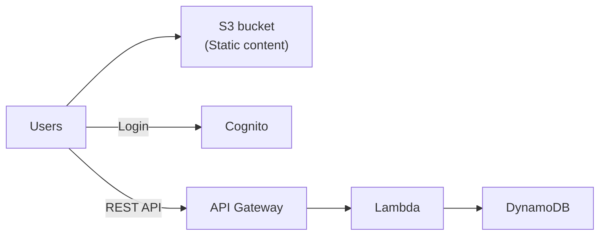

**Đây là "kiến trúc serverless chuẩn" mà cả chương xoay quanh:** ⭐⭐⭐ **S3 (static content) + Cognito (đăng nhập) + API Gateway (REST API) + Lambda (logic) + DynamoDB (dữ liệu)**.

---

## 211. Lambda Overview

### ⭐⭐⭐ Why AWS Lambda — So sánh với EC2

| **Amazon EC2** | **AWS Lambda** |
|---|---|
| ⭐⭐ **Virtual Servers in the Cloud** | ⭐⭐⭐ **Virtual FUNCTIONS — không có server nào để quản lý!** |
| ⭐⭐ **Giới hạn bởi RAM và CPU** | ⭐⭐⭐ **Giới hạn bởi THỜI GIAN — chạy NGẮN (short executions)** |
| ⭐⭐⭐ **Chạy LIÊN TỤC (continuously running)** | ⭐⭐⭐ **Chạy THEO NHU CẦU (run on-demand)** |
| ⚠️⭐⭐⭐ **Scaling PHẢI CAN THIỆP để thêm/bớt server** | ⭐⭐⭐ **Scaling là TỰ ĐỘNG!** |

> ⭐⭐⭐ **Bốn dòng này chính là bốn ý ra thi.** Nhớ đặc biệt: **"Lambda bị giới hạn bởi THỜI GIAN, EC2 bị giới hạn bởi RAM/CPU"**.

---

### ⭐⭐⭐ Benefits of AWS Lambda

- ⭐⭐⭐ **Easy Pricing:**
  - ⭐⭐⭐ **Trả theo REQUEST và COMPUTE TIME**
  - ⭐⭐⭐ **Free tier: 1,000,000 request và 400,000 GB-giây compute time**
- ⭐⭐ **Tích hợp với TOÀN BỘ hệ sinh thái dịch vụ AWS**
- ⭐⭐ **Tích hợp với nhiều ngôn ngữ lập trình**
- ⭐⭐ **Giám sát dễ dàng qua AWS CloudWatch**
- ⭐⭐⭐ **Dễ dàng tăng tài nguyên cho mỗi function (LÊN TỚI 10 GB RAM!)**
- ⭐⭐⭐ **TĂNG RAM cũng SẼ CẢI THIỆN CPU VÀ NETWORK!**

> ⭐⭐⭐ **Dòng cuối là câu hỏi thi kinh điển:** *"Lambda function chạy chậm / CPU không đủ, làm gì?"* → **TĂNG RAM** (vì CPU và network tỉ lệ thuận với RAM — bạn **không cấu hình CPU trực tiếp được**).

---

### ⭐⭐ AWS Lambda language support

| Ngôn ngữ |
|---|
| ⭐⭐ **Node.js (JavaScript)** |
| ⭐⭐ **Python** |
| ⭐⭐ **Java** |
| ⭐⭐ **C# (.NET Core) / Powershell** |
| ⭐⭐ **Ruby** |
| ⭐⭐ **Custom Runtime API** (cộng đồng hỗ trợ, ví dụ **Rust** hoặc **Golang**) |

**⭐⭐⭐ Lambda Container Image:**

- ⭐⭐⭐ **Container image PHẢI implement LAMBDA RUNTIME API**
- ⚠️⭐⭐⭐ **ECS / Fargate được ƯU TIÊN để chạy Docker image TÙY Ý (arbitrary)**

> ⭐⭐⭐ **BẪY THI RẤT HAY GẶP:** *"Công ty muốn chạy một Docker image bất kỳ trên AWS. Dùng Lambda container image được không?"* → **KHÔNG nên** — slide ghi rõ **ECS/Fargate mới là lựa chọn ưu tiên**. Lambda container image chỉ dùng được nếu image **implement Lambda Runtime API**.

---

### ⭐⭐⭐ AWS Lambda Integrations — Main ones

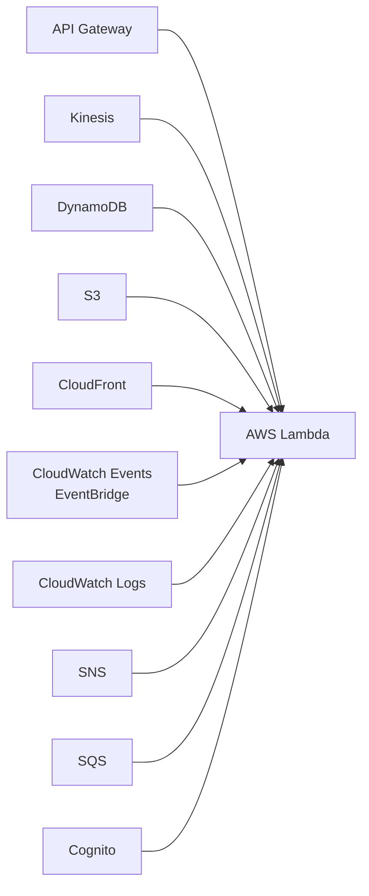

| Dịch vụ | Use case điển hình |
|---|---|
| ⭐⭐⭐ **API Gateway** | Tạo **REST API serverless** |
| ⭐⭐⭐ **Kinesis** | Xử lý dữ liệu luồng **real-time** |
| ⭐⭐⭐ **DynamoDB** | Phản ứng với **thay đổi dữ liệu** (DynamoDB Streams) |
| ⭐⭐⭐ **S3** | **Xử lý file khi upload** |
| ⭐⭐ **CloudFront** | **Lambda@Edge** |
| ⭐⭐⭐ **CloudWatch Events / EventBridge** | ⭐ **CRON job serverless** |
| ⭐⭐ **CloudWatch Logs** | Streaming log tới nơi khác |
| ⭐⭐ **SNS / SQS** | Xử lý message |
| ⭐⭐ **Cognito** | Trigger khi user đăng ký/đăng nhập |

---

### ⭐⭐⭐ Example: Serverless Thumbnail creation

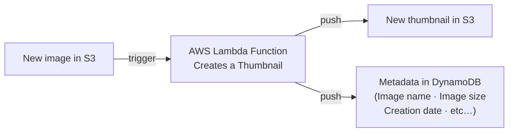

> ⭐⭐⭐ **Đây là kiến trúc serverless nổi tiếng nhất của AWS.** So sánh với bài 204 chương 18 (ECS Task qua EventBridge): **Lambda dùng khi xử lý NHANH (< 15 phút); ECS/Fargate dùng khi xử lý LÂU hoặc NẶNG**.

---

### ⭐⭐⭐ Example: Serverless CRON Job

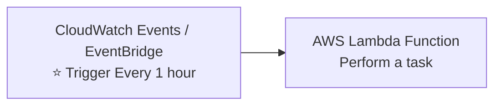

> ⭐⭐⭐ **Từ khóa "cron job", "chạy định kỳ", "scheduled task" mà KHÔNG muốn có server chạy 24/7** → **EventBridge Schedule + Lambda**.
>
> 💡 **So sánh:** EC2 chạy cron phải bật máy 24/7 (tốn tiền); Lambda chỉ tính tiền vài giây mỗi giờ.

---

### ⭐⭐ AWS Lambda Pricing: example

**Pay per calls (trả theo lượt gọi):**

- ⭐⭐⭐ **1,000,000 request ĐẦU TIÊN là MIỄN PHÍ**
- ⭐⭐ **$0.20 cho mỗi 1 triệu request sau đó** ($0.0000002/request)

**Pay per duration (trả theo thời lượng, tính theo bước 1 ms):**

- ⭐⭐⭐ **400,000 GB-giây compute time mỗi tháng MIỄN PHÍ**
  - ⭐ **= 400,000 giây nếu function dùng 1 GB RAM**
  - ⭐ **= 3,200,000 giây nếu function dùng 128 MB RAM**
- ⭐⭐ **Sau đó $1.00 cho 600,000 GB-giây**

- ⭐⭐⭐ **Chạy Lambda thường RẤT RẺ, nên nó rất phổ biến**

> 💡 **Hiểu "GB-giây":** là **RAM (GB) × thời gian chạy (giây)**. Function 128 MB chạy 1 giây = 0.125 GB-giây. Vì thế function nhỏ chạy được **nhiều giây hơn** trong cùng hạn mức free.

---

## 212. Lambda Hands-On

> 🖐️ Bài Hands On — **không có slide**, nhưng có **code chính thức** trong `code_v2025-10-27/api-gateway/lambda-code.py` (dùng chung cho bài 224).

### Tạo Lambda Function

1. Console → tìm **Lambda** → **Create function**
2. Chọn ⭐ **Author from scratch** (các lựa chọn khác: **Use a blueprint**, **Container image**)
3. **Basic information**:

| Trường | Giá trị |
|---|---|
| **Function name** | `demo-lambda` |
| ⭐⭐ **Runtime** | **Python 3.12** (hoặc Node.js 20.x) |
| **Architecture** | ⭐ **x86_64** hoặc **arm64** (⭐ **Graviton2 — rẻ hơn ~20%**) |
| ⭐⭐⭐ **Execution role** | **Create a new role with basic Lambda permissions** |

4. **Create function**

> ⭐⭐⭐ **Execution Role là khái niệm quan trọng:** đây là **IAM role mà Lambda dùng để gọi các dịch vụ AWS khác**. Role mặc định chỉ có quyền **ghi log vào CloudWatch Logs**. Muốn Lambda đọc S3/DynamoDB thì **phải thêm policy vào role này**.

### ⭐⭐ Code chính thức — `code_v2025-10-27/api-gateway/lambda-code.py`

```python
import json

def lambda_handler(event, context):
    body = "Hello from Lambda!"
    statusCode = 200
    return {
        "statusCode": statusCode,
        "body": json.dumps(body),
        "headers": {
            "Content-Type": "application/json"
        }
    }
```

**Giải thích:** ⭐⭐

| Thành phần | Ý nghĩa |
|---|---|
| ⭐⭐⭐ **`lambda_handler`** | **Hàm ĐIỂM VÀO (entry point)** — tên phải khớp cấu hình **Handler** (`lambda_function.lambda_handler`) |
| ⭐⭐⭐ **`event`** | **Dữ liệu đầu vào** (JSON) — do dịch vụ gọi Lambda truyền vào |
| ⭐⭐ **`context`** | Thông tin runtime: **request ID, thời gian còn lại, memory limit** |
| ⭐⭐⭐ **`statusCode` + `body` + `headers`** | **Định dạng bắt buộc khi Lambda đứng sau API Gateway** |

> ⭐⭐ **Lưu ý về `code_v2025-10-27/api-gateway/lambda-code.py`:** đây chính là code được dùng lại ở **bài 224 (API Gateway Hands-On)** — cấu trúc trả về `statusCode/body/headers` là để API Gateway hiểu được.

### Deploy và Test

1. Dán code vào **Code source** → bấm ⭐ **Deploy** (⚠️ **không Deploy thì code chưa được áp dụng**)
2. Bấm **Test** → **Create new test event** → **Event name**: `test1` → giữ JSON mặc định → **Save**
3. Bấm **Test** → xem kết quả:

```
Response:
{
  "statusCode": 200,
  "body": "\"Hello from Lambda!\"",
  "headers": { "Content-Type": "application/json" }
}
```

4. ⭐⭐ Xem phần **Summary** của log:

```
Duration: 1.23 ms    Billed Duration: 2 ms
Memory Size: 128 MB  Max Memory Used: 38 MB
Init Duration: 105.12 ms     ← ⭐⭐⭐ ĐÂY LÀ COLD START
```

> ⭐⭐⭐ **`Init Duration` chỉ xuất hiện ở lần chạy ĐẦU TIÊN** — đó chính là **Cold Start** (bài 214). Bấm Test lần thứ hai ngay sẽ **không còn dòng này** (warm start).

### ⭐⭐ Các tab cấu hình quan trọng (Configuration)

| Tab | Nội dung ra thi |
|---|---|
| ⭐⭐⭐ **General configuration** | **Memory (128 MB – 10,240 MB)**, **Timeout (tối đa 15 phút)**, **Ephemeral storage `/tmp` (512 MB – 10 GB)** |
| ⭐⭐⭐ **Permissions** | **Execution role** — thêm policy ở đây |
| ⭐⭐ **Environment variables** | ⭐ **Tối đa 4 KB**, mã hóa được bằng KMS |
| ⭐⭐ **Triggers** | Nguồn gọi Lambda (S3, API Gateway, EventBridge…) |
| ⭐⭐⭐ **Concurrency** | **Reserved / Provisioned concurrency** (bài 215) |
| ⭐⭐ **VPC** | Đưa Lambda vào VPC (bài 218) |
| ⭐⭐ **Monitor** | Xem **CloudWatch Logs**, metrics, **X-Ray tracing** |

### CLI tương đương

```bash
# Tạo function (từ file zip)
zip function.zip lambda_function.py
aws lambda create-function \
  --function-name demo-lambda \
  --runtime python3.12 \
  --handler lambda_function.lambda_handler \
  --role arn:aws:iam::123456789012:role/lambda-basic-role \
  --zip-file fileb://function.zip

# Gọi function
aws lambda invoke --function-name demo-lambda response.json && cat response.json

# Cập nhật cấu hình RAM và timeout
aws lambda update-function-configuration \
  --function-name demo-lambda --memory-size 512 --timeout 30

# Xem log
aws logs tail /aws/lambda/demo-lambda --follow
```

> 💡 **Lambda nằm trong Free Tier VĨNH VIỄN** (1 triệu request + 400,000 GB-giây mỗi tháng, **không giới hạn 12 tháng**) — bài này làm thật hoàn toàn an toàn.

---

## 213. Lambda Limits

### ⭐⭐⭐ AWS Lambda Limits to Know — per region (BẢNG THUỘC LÒNG)

**Execution (thực thi):**

| Giới hạn | Giá trị |
|---|---|
| ⭐⭐⭐ **Memory allocation** | **128 MB – 10 GB** (bước **1 MB**) |
| ⭐⭐⭐ **Maximum execution time** | **900 giây = 15 PHÚT** |
| ⭐⭐⭐ **Environment variables** | **4 KB** |
| ⭐⭐⭐ **Disk capacity trong "function container" (`/tmp`)** | **512 MB đến 10 GB** |
| ⭐⭐⭐ **Concurrency executions** | **1000** (có thể xin tăng) |

**Deployment (triển khai):**

| Giới hạn | Giá trị |
|---|---|
| ⭐⭐⭐ **Deployment size (nén .zip)** | **50 MB** |
| ⭐⭐⭐ **Kích thước sau giải nén (code + dependencies)** | **250 MB** |
| ⭐⭐ **Có thể dùng thư mục `/tmp` để nạp file khác lúc khởi động** | |
| ⭐⭐⭐ **Size of environment variables** | **4 KB** |

> ⭐⭐⭐ **BỐN CON SỐ RA THI NHIỀU NHẤT:**
> - **15 PHÚT** (timeout tối đa)
> - **10 GB** (RAM tối đa)
> - **1000** (concurrency mặc định)
> - **512 MB → 10 GB** (`/tmp`)
>
> ⭐⭐⭐ **Câu hỏi thi điển hình:** *"Job xử lý mất 30 phút, dùng Lambda được không?"* → **KHÔNG — vượt 15 phút**. → **Dùng ECS/Fargate, AWS Batch, hoặc EC2**.
>
> ⚠️ **Lưu ý: TẤT CẢ các giới hạn này là PER REGION.**

---

## 214. Lambda Concurrency

### ⭐⭐⭐ Lambda Concurrency and Throttling

- ⭐⭐⭐ **Concurrency limit: tối đa 1000 concurrent executions**
- ⭐⭐⭐ **Có thể đặt "RESERVED CONCURRENCY" ở MỨC FUNCTION (= giới hạn)**
- ⭐⭐⭐ **Mỗi lần gọi VƯỢT concurrency limit sẽ kích hoạt một "THROTTLE"**

**⭐⭐⭐ Throttle behavior (hành vi khi bị chặn) — RA THI CHẮC CHẮN:**

| Kiểu gọi | Hành vi khi throttle |
|---|---|
| ⭐⭐⭐ **Synchronous invocation** (đồng bộ) | **Trả về `ThrottleError` — HTTP 429** |
| ⭐⭐⭐ **Asynchronous invocation** (bất đồng bộ) | **TỰ ĐỘNG RETRY, sau đó đưa vào DLQ (Dead Letter Queue)** |

- ⭐⭐ **Nếu cần giới hạn cao hơn: MỞ SUPPORT TICKET**

> ⭐⭐⭐ **Nhớ con số 429** — đây là mã lỗi HTTP đặc trưng của Lambda throttling, đề hay hỏi thẳng.

---

### ⭐⭐⭐ Lambda Concurrency Issue — Vì sao phải đặt Reserved Concurrency

- ⚠️⭐⭐⭐ **Nếu bạn KHÔNG reserve (=giới hạn) concurrency, điều sau CÓ THỂ XẢY RA:**

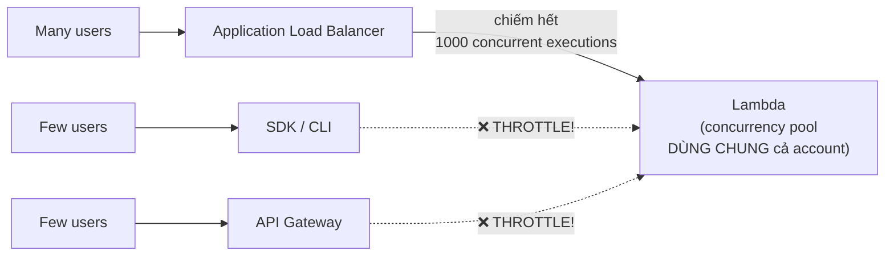

**Giải thích:** ⭐⭐⭐ **Concurrency là pool DÙNG CHUNG cho CẢ ACCOUNT trong một Region.** Nếu một function bị gọi ồ ạt (qua ALB) và ăn hết 1000 slot, thì **các function KHÁC (qua SDK/CLI, qua API Gateway) sẽ bị THROTTLE** dù chúng chỉ có vài user.

> ⭐⭐⭐ **Đây là lý do phải đặt Reserved Concurrency.** Đề hỏi *"làm sao để một function không làm ảnh hưởng function khác?"* → **Đặt Reserved Concurrency cho function đó**.
>
> ⚠️ **Lưu ý hai mặt:** Reserved Concurrency vừa là **ĐẢM BẢO** (function này luôn có N slot) vừa là **GIỚI HẠN** (function này không bao giờ vượt N).

---

### ⭐⭐⭐ Concurrency and Asynchronous Invocations

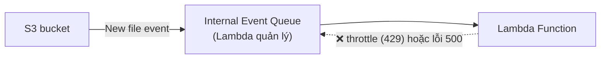

- ⭐⭐⭐ **Nếu function KHÔNG ĐỦ concurrency để xử lý hết event, các request thêm sẽ bị THROTTLE**
- ⭐⭐⭐ **Với lỗi throttling (429) và lỗi hệ thống (500-series), Lambda TRẢ EVENT VỀ QUEUE và thử chạy lại function TRONG TỐI ĐA 6 GIỜ**
- ⭐⭐⭐ **Khoảng thời gian retry TĂNG THEO CẤP SỐ NHÂN (exponentially) từ 1 GIÂY sau lần thử đầu tiên, tối đa 5 PHÚT**

> ⭐⭐⭐ **Ba con số phải nhớ: 6 GIỜ / 1 GIÂY / 5 PHÚT.** Đề hay hỏi *"event bị mất khi Lambda throttle không?"* → **KHÔNG mất ngay — Lambda retry tới 6 giờ** (với async invocation).

---

### ⭐⭐⭐ Cold Starts & Provisioned Concurrency

**⭐⭐⭐ Cold Start là gì?**

- ⭐⭐⭐ **Instance MỚI ⇒ code được nạp và code NGOÀI HANDLER được chạy (init)**
- ⭐⭐⭐ **Nếu phần init LỚN (code, dependencies, SDK…), quá trình này có thể MẤT THỜI GIAN**
- ⭐⭐⭐ **Request ĐẦU TIÊN được phục vụ bởi instance mới có ĐỘ TRỄ CAO HƠN các request còn lại**

**⭐⭐⭐ Provisioned Concurrency — giải pháp:**

- ⭐⭐⭐ **Concurrency được CẤP PHÁT TRƯỚC KHI function được gọi (in advance)**
- ⭐⭐⭐ **Nên COLD START KHÔNG BAO GIỜ XẢY RA và MỌI lần gọi đều có ĐỘ TRỄ THẤP**
- ⭐⭐ **Application Auto Scaling có thể quản lý concurrency (theo LỊCH hoặc TARGET UTILIZATION)**

**Note:** ⭐ **Cold start trong VPC đã được giảm ĐÁNG KỂ vào tháng 10 & 11/2019.**

> ⭐⭐⭐ **BẢNG PHÂN BIỆT HAI LOẠI CONCURRENCY — RA THI RẤT NHIỀU:**

| | ⭐⭐⭐ **Reserved Concurrency** | ⭐⭐⭐ **Provisioned Concurrency** |
|---|---|---|
| **Mục đích** | ⭐⭐⭐ **GIỚI HẠN + ĐẢM BẢO số slot cho function** | ⭐⭐⭐ **LOẠI BỎ COLD START** |
| **Giải quyết vấn đề** | Function này **ăn hết** slot của function khác | Request đầu tiên **CHẬM** |
| **Trạng thái instance** | Instance vẫn phải **khởi tạo khi cần** | ⭐⭐⭐ **Instance được KHỞI TẠO SẴN** |
| **Chi phí** | ✅ **Miễn phí** | ⚠️ **TỐN TIỀN** (trả tiền cho instance chờ sẵn) |
| **Quản lý tự động** | Không | ⭐ **Application Auto Scaling** (schedule / target utilization) |

> ⭐⭐⭐ **Mẹo nhận diện:**
> - Đề nói **"giảm latency"**, **"loại bỏ cold start"**, **"request đầu chậm"** → **Provisioned Concurrency**
> - Đề nói **"function này không được ảnh hưởng function khác"**, **"giới hạn số lần gọi"** → **Reserved Concurrency**

---

## 215. Lambda Concurrency - Hands On

> 🖐️ Bài Hands On — **không có slide**. Các bước Console.

### Cấu hình Reserved Concurrency

1. Lambda → chọn function `demo-lambda` → tab **Configuration** → **Concurrency and recursion detection**
2. Mục **Concurrency** → **Edit**
3. Ba lựa chọn:

| Lựa chọn | Ý nghĩa |
|---|---|
| ⭐⭐ **Use unreserved account concurrency** | **Mặc định** — dùng chung pool của cả account |
| ⭐⭐⭐ **Reserve concurrency** | **Nhập số**, ví dụ `10` — function này **luôn có 10 slot** và **không bao giờ vượt 10** |
| ⚠️ **Reserve concurrency = 0** | ⭐⭐ **VÔ HIỆU HÓA HOÀN TOÀN function** (throttle mọi request) — cách nhanh để "tắt" một function đang lỗi |

4. ⭐⭐ Chú ý dòng Console hiển thị: **"Unreserved account concurrency: 900"** — số slot còn lại cho các function khác
   - ⚠️⭐⭐ **AWS luôn giữ lại tối thiểu 100 slot unreserved** — bạn **không thể reserve hết 1000**

> ⭐⭐⭐ **Mẹo nhớ con số 100:** nếu account có limit 1000, bạn **chỉ reserve được tối đa 900**.

### Cấu hình Provisioned Concurrency

⚠️ **Provisioned Concurrency chỉ đặt được trên một VERSION hoặc ALIAS, KHÔNG đặt được trên `$LATEST`.**

1. Function → **Versions** → **Publish new version** → ghi description → **Publish**
2. (Khuyến nghị) **Aliases** → **Create alias** → tên `prod`, trỏ tới version `1`
3. Vào **alias/version** → **Configuration** → **Provisioned concurrency** → **Edit**
4. Nhập số, ví dụ `2` → **Save**
5. Trạng thái chuyển **In progress** → **Ready** (mất **~1–2 phút** để AWS khởi tạo sẵn instance)

### Kiểm chứng Cold Start

```bash
# Gọi lần đầu sau khi deploy — xem Init Duration trong log
aws lambda invoke --function-name demo-lambda out.json

# Xem log gần nhất, tìm dòng REPORT
aws logs tail /aws/lambda/demo-lambda --since 5m --format short | grep REPORT
```

**Dòng REPORT khi COLD START:**
```
REPORT Duration: 1.20 ms  Billed Duration: 2 ms  Memory Size: 128 MB  Max Memory Used: 38 MB  Init Duration: 112.45 ms
```

**Dòng REPORT khi WARM START (không có `Init Duration`):**
```
REPORT Duration: 0.95 ms  Billed Duration: 1 ms  Memory Size: 128 MB  Max Memory Used: 38 MB
```

> ⭐⭐⭐ **Đây là cách chứng minh cold start bằng thực nghiệm:** chỉ cần nhìn xem dòng **REPORT có `Init Duration` hay không**.

### ⭐⭐ Metrics CloudWatch cần biết

| Metric | Ý nghĩa |
|---|---|
| ⭐⭐⭐ **`ConcurrentExecutions`** | Số lần chạy đồng thời hiện tại |
| ⭐⭐⭐ **`Throttles`** | ⭐ **Số request bị chặn — nếu > 0 nghĩa là đang thiếu concurrency** |
| ⭐⭐ **`Invocations`** | Tổng số lần gọi |
| ⭐⭐ **`Errors`** | Số lần lỗi |
| ⭐⭐ **`Duration`** | Thời lượng chạy |
| ⭐⭐ **`ProvisionedConcurrencyUtilization`** | Tỉ lệ sử dụng provisioned concurrency |

> ⚠️⭐⭐ **CẢNH BÁO CHI PHÍ:** **Provisioned Concurrency TÍNH TIỀN THEO GIỜ kể cả khi function không được gọi lần nào** (~$0.015 cho mỗi GB-giờ). Sau khi thử xong, **đặt Provisioned Concurrency về 0 hoặc xóa cấu hình**. Reserved Concurrency thì **miễn phí**.

---

## 216. Lambda SnapStart

### ⭐⭐⭐ Lambda SnapStart

- ⭐⭐⭐ **Cải thiện hiệu năng Lambda function TỚI 10 LẦN (up to 10x), KHÔNG TỐN THÊM CHI PHÍ**
- ⭐⭐⭐ **CHỈ dành cho: JAVA, PYTHON & .NET**
- ⭐⭐⭐ **Khi bật, function được gọi từ TRẠNG THÁI ĐÃ KHỞI TẠO SẴN (pre-initialized state)** — không phải init lại từ đầu

**⭐⭐⭐ Khi bạn publish một VERSION MỚI:**

1. ⭐⭐ **Lambda khởi tạo function của bạn**
2. ⭐⭐⭐ **CHỤP SNAPSHOT trạng thái BỘ NHỚ và ĐĨA của function đã khởi tạo**
3. ⭐⭐⭐ **Snapshot được CACHE để truy cập độ trễ thấp**

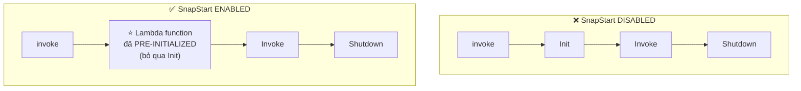

**⭐⭐ Lambda Invocation Lifecycle Phases:** ⭐⭐⭐ **Init → Invoke → Shutdown**. **SnapStart bỏ qua giai đoạn `Init`.**

> ⭐⭐⭐ **PHÂN BIỆT SnapStart vs Provisioned Concurrency — câu hỏi thi rất hay:**

| | **Lambda SnapStart** | **Provisioned Concurrency** |
|---|---|---|
| **Chi phí** | ⭐⭐⭐ **MIỄN PHÍ (no extra cost)** | ⚠️ **TỐN TIỀN** |
| **Ngôn ngữ** | ⚠️ **CHỈ Java, Python, .NET** | ✅ **Mọi runtime** |
| **Cách hoạt động** | **Snapshot bộ nhớ/đĩa, cache lại** | **Giữ instance chạy sẵn** |
| **Cải thiện** | ⭐⭐⭐ **Tới 10x** | Loại bỏ hoàn toàn cold start |

> ⭐⭐⭐ **Mẹo nhận diện:** đề nói **"giảm cold start cho Java/Python/.NET"** + **"không tốn thêm chi phí"** → **SnapStart**. Nếu đề **không nói ngôn ngữ** hoặc cần **đảm bảo tuyệt đối** → **Provisioned Concurrency**.

---

## 217. Lambda@Edge & CloudFront Functions

### ⭐⭐⭐ Customization At The Edge

- ⭐⭐ **Nhiều ứng dụng hiện đại thực thi một phần logic TẠI EDGE**
- ⭐⭐⭐ **Edge Function là gì?**
  - ⭐⭐⭐ **Code bạn viết và GẮN VÀO CloudFront distributions**
  - ⭐⭐⭐ **Chạy GẦN người dùng để GIẢM THIỂU ĐỘ TRỄ**
- ⭐⭐⭐ **CloudFront cung cấp HAI loại: CloudFront Functions & Lambda@Edge**
- ⭐⭐ **Bạn KHÔNG phải quản lý server nào, được deploy TOÀN CẦU**
- ⭐⭐ **Use case: TÙY BIẾN NỘI DUNG CDN**
- ⭐⭐ **Chỉ trả tiền cho phần bạn dùng — Fully serverless**

---

### ⭐⭐ CloudFront Functions & Lambda@Edge — Use Cases (10 trường hợp)

| Use case |
|---|
| ⭐⭐ **Website Security and Privacy** |
| ⭐⭐ **Dynamic Web Application at the Edge** |
| ⭐⭐ **Search Engine Optimization (SEO)** |
| ⭐⭐ **Intelligently Route Across Origins and Data Centers** |
| ⭐⭐ **Bot Mitigation at the Edge** |
| ⭐⭐ **Real-time Image Transformation** |
| ⭐⭐ **A/B Testing** |
| ⭐⭐ **User Authentication and Authorization** |
| ⭐⭐ **User Prioritization** |
| ⭐⭐ **User Tracking and Analytics** |

---

### ⭐⭐⭐ CloudFront Functions

- ⭐⭐⭐ **Function NHẸ, viết bằng JAVASCRIPT**
- ⭐⭐⭐ **Dành cho tùy biến CDN QUY MÔ LỚN, NHẠY CẢM VỚI ĐỘ TRỄ**
- ⭐⭐⭐ **Thời gian khởi động DƯỚI 1 MILLISECOND, HÀNG TRIỆU request/giây**
- ⭐⭐⭐ **Dùng để thay đổi VIEWER request và response:**
  - ⭐⭐⭐ **Viewer Request: SAU KHI CloudFront nhận request từ viewer**
  - ⭐⭐⭐ **Viewer Response: TRƯỚC KHI CloudFront chuyển response tới viewer**
- ⭐⭐⭐ **Là TÍNH NĂNG GỐC (native feature) của CloudFront** — quản lý code hoàn toàn trong CloudFront

---

### ⭐⭐⭐ Lambda@Edge

- ⭐⭐⭐ **Lambda function viết bằng NODEJS hoặc PYTHON**
- ⭐⭐⭐ **Scale tới HÀNG NGHÌN request/giây**
- ⭐⭐⭐ **Dùng để thay đổi CloudFront request và response — CẢ BỐN điểm:**
  - ⭐⭐⭐ **Viewer Request** — sau khi CloudFront nhận request từ viewer
  - ⭐⭐⭐ **Origin Request** — trước khi CloudFront chuyển request tới origin
  - ⭐⭐⭐ **Origin Response** — sau khi CloudFront nhận response từ origin
  - ⭐⭐⭐ **Viewer Response** — trước khi CloudFront chuyển response tới viewer
- ⭐⭐⭐ **Viết function ở MỘT REGION DUY NHẤT (`us-east-1`), rồi CloudFront TỰ REPLICATE tới các location của nó**

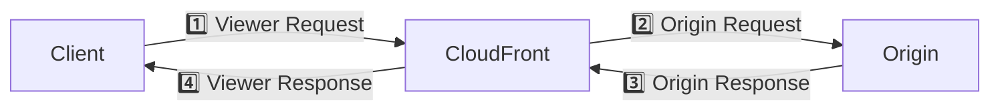

> ⭐⭐⭐ **NHỚ: CloudFront Functions chỉ chạm được 1️⃣ và 4️⃣ (Viewer). Lambda@Edge chạm được CẢ BỐN.**
>
> ⭐⭐⭐ **Và nhớ `us-east-1`** — Lambda@Edge **bắt buộc** viết ở region này.

---

### ⭐⭐⭐ CloudFront Functions vs. Lambda@Edge — BẢNG ĐINH

| | **CloudFront Functions** | **Lambda@Edge** |
|---|---|---|
| ⭐⭐⭐ **Runtime Support** | **JavaScript** | **Node.js, Python** |
| ⭐⭐⭐ **# of Requests** | **HÀNG TRIỆU request/giây** | **HÀNG NGHÌN request/giây** |
| ⭐⭐⭐ **CloudFront Triggers** | **Viewer Request/Response** | **Viewer Request/Response**<br/>**Origin Request/Response** |
| ⭐⭐⭐ **Max. Execution Time** | **< 1 ms** | **5 – 10 giây** |
| ⭐⭐⭐ **Max. Memory** | **2 MB** | **128 MB đến 10 GB** |
| ⭐⭐⭐ **Total Package Size** | **10 KB** | **1 MB – 50 MB** |
| ⭐⭐⭐ **Network Access, File System Access** | ❌ **KHÔNG** | ✅ **CÓ** |
| ⭐⭐⭐ **Access to the Request Body** | ❌ **KHÔNG** | ✅ **CÓ** |
| ⭐⭐⭐ **Pricing** | **Có free tier, rẻ bằng 1/6 @Edge** | **KHÔNG có free tier**, tính theo request & duration |

> ⭐⭐⭐ **Bảng này là một trong những bảng ra thi nhiều nhất chương.** Ba dòng quan trọng nhất:
> - **CloudFront Functions KHÔNG truy cập được NETWORK, FILE SYSTEM và REQUEST BODY** → nếu đề cần gọi API khác hoặc đọc body → **Lambda@Edge**
> - **CloudFront Functions chỉ chạm Viewer**; **Lambda@Edge chạm cả Origin**
> - **CloudFront Functions rẻ hơn 6 lần** và **nhanh hơn ~1000 lần** (<1ms vs 5–10s)

---

### ⭐⭐⭐ CloudFront Functions vs. Lambda@Edge — Use Cases

**Dùng CloudFront Functions khi:** ⭐⭐⭐

| Use case | Chi tiết |
|---|---|
| ⭐⭐⭐ **Cache key normalization** | **Biến đổi thuộc tính request (headers, cookies, query strings, URL) để tạo Cache Key TỐI ƯU** |
| ⭐⭐⭐ **Header manipulation** | **Chèn/sửa/xóa HTTP headers trong request hoặc response** |
| ⭐⭐⭐ **URL rewrites hoặc redirects** | |
| ⭐⭐⭐ **Request authentication & authorization** | **Tạo và xác thực token do người dùng sinh ra (ví dụ JWT) để cho phép/từ chối request** |

**Dùng Lambda@Edge khi:** ⭐⭐⭐

| Use case | Chi tiết |
|---|---|
| ⭐⭐⭐ **Thời gian thực thi DÀI HƠN (vài ms)** | |
| ⭐⭐⭐ **Cần điều chỉnh CPU hoặc memory** | |
| ⭐⭐⭐ **Code PHỤ THUỘC THƯ VIỆN BÊN THỨ BA** | ví dụ **AWS SDK để truy cập dịch vụ AWS khác** |
| ⭐⭐⭐ **Cần NETWORK ACCESS để gọi dịch vụ ngoài** | |
| ⭐⭐⭐ **Cần FILE SYSTEM ACCESS hoặc truy cập BODY của HTTP request** | |

> ⭐⭐⭐ **Cách chọn nhanh trong phòng thi:** nếu use case **CHỈ đụng vào header/URL/cookie/cache key** → **CloudFront Functions** (rẻ, nhanh). Nếu cần **gọi AWS SDK / đọc body / dùng thư viện** → **Lambda@Edge**.

---

## 218. Lambda in VPC

### ⭐⭐⭐ Lambda by default

- ⭐⭐⭐ **MẶC ĐỊNH, Lambda function được chạy NGOÀI VPC của bạn (trong một VPC do AWS sở hữu)**
- ⚠️⭐⭐⭐ **Do đó, nó KHÔNG THỂ truy cập tài nguyên trong VPC của bạn (RDS, ElastiCache, internal ELB…)**

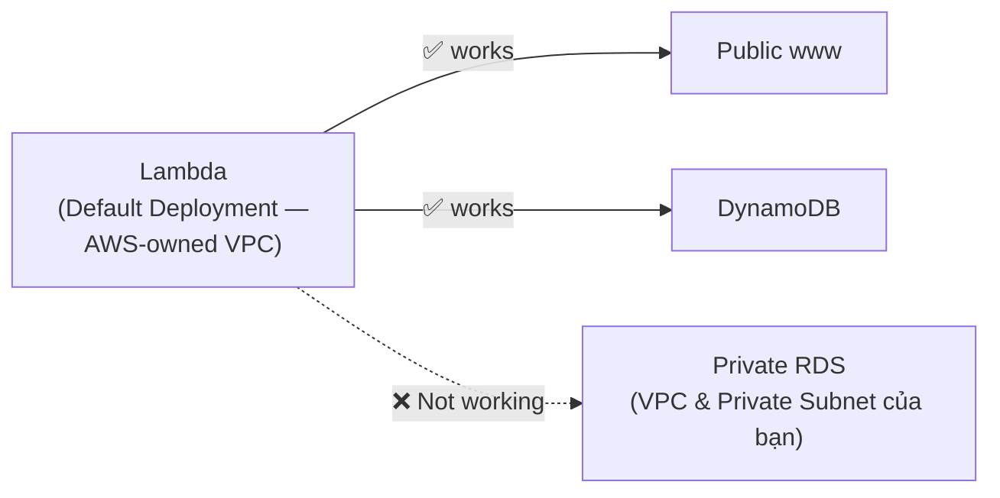

> ⭐⭐⭐ **Đây là một trong những câu hỏi thi phổ biến nhất về Lambda:** *"Lambda không kết nối được RDS trong private subnet, vì sao?"* → **Lambda mặc định nằm ngoài VPC của bạn**.
>
> 💡 **Hiểu vì sao DynamoDB và S3 vẫn gọi được:** chúng là **public AWS services** (gọi qua Internet/AWS backbone), còn **RDS/ElastiCache trong private subnet** thì phải vào VPC mới tới được.

---

### ⭐⭐⭐ Lambda in VPC

- ⭐⭐⭐ **Bạn PHẢI khai báo: VPC ID, các SUBNETS và các SECURITY GROUPS**
- ⭐⭐⭐ **Lambda sẽ TẠO MỘT ENI (Elastic Network Interface) trong các subnet của bạn**

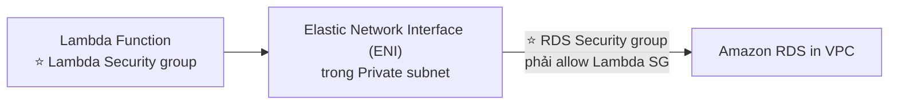

> ⭐⭐⭐ **Hai thứ phải cấu hình đúng:**
> 1. **Lambda Execution Role phải có quyền tạo ENI** (`AWSLambdaVPCAccessExecutionRole`)
> 2. **Security Group của RDS phải cho phép Security Group của Lambda** vào đúng port
>
> ⚠️ **Bẫy bổ sung (ngoài slide, hay ra thi):** Lambda **trong private subnet MẤT kết nối Internet**. Muốn gọi API bên ngoài phải thêm **NAT Gateway**; muốn gọi S3/DynamoDB nên dùng **VPC Gateway Endpoint** (miễn phí, không cần NAT).

---

### ⭐⭐⭐ Lambda with RDS Proxy

- ⚠️⭐⭐⭐ **Nếu Lambda truy cập TRỰC TIẾP database, chúng có thể MỞ QUÁ NHIỀU CONNECTION khi tải cao**

**⭐⭐⭐ RDS Proxy giải quyết ba việc:**

| Cải thiện | Chi tiết |
|---|---|
| ⭐⭐⭐ **Scalability** | **POOLING và CHIA SẺ DB connections** |
| ⭐⭐⭐ **Availability** | **GIẢM 66% THỜI GIAN FAILOVER và BẢO TOÀN connections** |
| ⭐⭐⭐ **Security** | **Bắt buộc IAM authentication và lưu credentials trong Secrets Manager** |

- ⚠️⭐⭐⭐ **Lambda function PHẢI được deploy TRONG VPC của bạn, vì RDS Proxy KHÔNG BAO GIỜ truy cập công khai được**

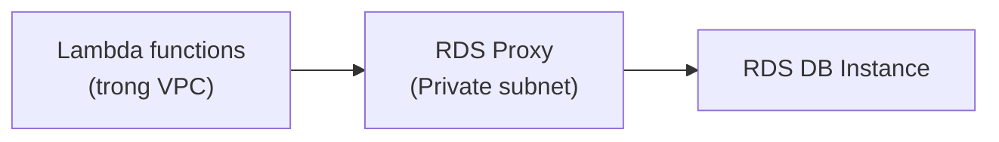

> ⭐⭐⭐ **Câu hỏi thi:** *"Lambda làm RDS cạn connection khi tải cao. Giải pháp?"* → **RDS Proxy**, và nhớ **Lambda phải nằm trong VPC**.
>
> ⭐⭐ **Con số 66%** là con số ra thi (đã gặp ở chương 9 khi học RDS Proxy).

---

## 219. RDS - Invoking Lambda & Event Notifications

### ⭐⭐⭐ Invoking Lambda from RDS & Aurora

- ⭐⭐⭐ **Gọi Lambda function TỪ BÊN TRONG DB instance của bạn**
- ⭐⭐⭐ **Cho phép XỬ LÝ SỰ KIỆN DỮ LIỆU từ trong database**
- ⭐⭐⭐ **CHỈ hỗ trợ: RDS for PostgreSQL và Aurora MySQL**
- ⭐⭐⭐ **PHẢI cho phép outbound traffic tới Lambda function từ trong DB instance** (**Public, NAT GW, hoặc VPC Endpoints**)
- ⭐⭐⭐ **DB instance PHẢI có quyền cần thiết để gọi Lambda function** (**Lambda Resource-based Policy & IAM Policy**)

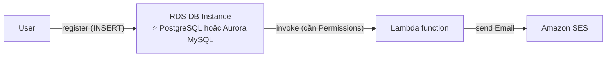

> ⭐⭐⭐ **Nhớ chính xác hai engine: RDS for PostgreSQL và Aurora MySQL.** Đề hay bẫy bằng "RDS for MySQL" (**sai** — phải là **Aurora** MySQL) hoặc "Aurora PostgreSQL" (**sai** — phải là **RDS** for PostgreSQL).
>
> **Use case điển hình:** user đăng ký (INSERT vào bảng) → DB gọi Lambda → Lambda gửi email chào mừng qua **Amazon SES**.

---

### ⭐⭐⭐ RDS Event Notifications

- ⭐⭐⭐ **Là thông báo cho biết thông tin VỀ BẢN THÂN DB INSTANCE (created, stopped, start, …)**
- ⚠️⭐⭐⭐ **BẠN KHÔNG CÓ BẤT KỲ THÔNG TIN NÀO VỀ DỮ LIỆU (data itself)**
- ⭐⭐ **Đăng ký các event category sau: DB instance, DB snapshot, DB Parameter Group, DB Security Group, RDS Proxy, Custom Engine Version**
- ⭐⭐⭐ **Near real-time events (TỚI 5 PHÚT)**
- ⭐⭐⭐ **Gửi thông báo tới SNS hoặc đăng ký events qua EventBridge**

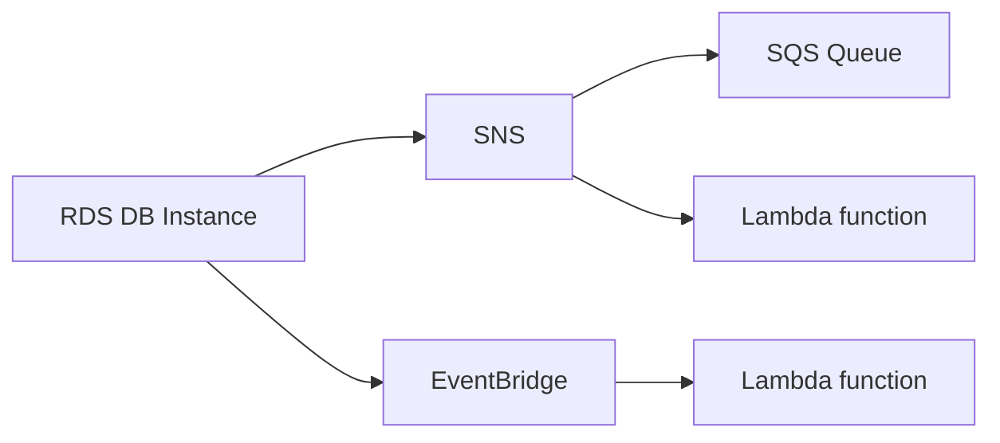

> ⭐⭐⭐ **PHÂN BIỆT HAI BÀI TRÊN — ĐỀ RẤT HAY BẪY:**
>
> | Nhu cầu | Giải pháp |
> |---|---|
> | ⭐⭐⭐ **Phản ứng với THAY ĐỔI DỮ LIỆU (INSERT/UPDATE)** | **Invoking Lambda from RDS** (chỉ PostgreSQL & Aurora MySQL) |
> | ⭐⭐⭐ **Phản ứng với SỰ KIỆN HẠ TẦNG (DB created/stopped/failover)** | **RDS Event Notifications → SNS / EventBridge** |
>
> **Câu chốt của slide:** *"You don't have any information about the data itself"* — **RDS Event Notifications KHÔNG cho bạn biết gì về dữ liệu**.
>
> ⭐⭐ Và nhớ con số **5 PHÚT** (near real-time).

---

## 220. Amazon DynamoDB

### ⭐⭐⭐ Amazon DynamoDB là gì?

- ⭐⭐⭐ **Fully managed, HIGHLY AVAILABLE với REPLICATION QUA NHIỀU AZ**
- ⭐⭐⭐ **NoSQL database — KHÔNG phải relational database — CÓ HỖ TRỢ TRANSACTION**
- ⭐⭐⭐ **Scale tới workload KHỔNG LỒ, là distributed database**
- ⭐⭐⭐ **HÀNG TRIỆU request/giây, HÀNG NGHÌN TỈ dòng, HÀNG TRĂM TB dung lượng**
- ⭐⭐⭐ **Hiệu năng NHANH và NHẤT QUÁN (single-digit millisecond)**
- ⭐⭐ **Tích hợp với IAM cho bảo mật, phân quyền và quản trị**
- ⭐⭐ **Chi phí thấp và có khả năng auto-scaling**
- ⭐⭐⭐ **KHÔNG cần bảo trì hay vá lỗi, LUÔN SẴN SÀNG**
- ⭐⭐ **Standard & Infrequent Access (IA) Table Class**

> ⭐⭐⭐ **Từ khóa nhận diện DynamoDB trong đề:** *"NoSQL"*, *"serverless database"*, *"single-digit millisecond latency"*, *"massive scale"*, *"key-value"*, *"không cần quản lý"*, *"session state"*, *"IoT data"*.
>
> ⚠️ **Đề bẫy:** *"cần JOIN phức tạp / SQL query / transaction ACID nhiều bảng"* → **RDS/Aurora**, KHÔNG phải DynamoDB.

---

### ⭐⭐⭐ DynamoDB - Basics

- ⭐⭐ **DynamoDB được tạo thành từ các TABLES**
- ⭐⭐⭐ **Mỗi table có một PRIMARY KEY (PHẢI QUYẾT ĐỊNH LÚC TẠO TABLE)**
- ⭐⭐ **Mỗi table có thể chứa VÔ HẠN items (= rows)**
- ⭐⭐⭐ **Mỗi item có các ATTRIBUTES (thêm được theo thời gian — có thể null)**
- ⭐⭐⭐ **KÍCH THƯỚC TỐI ĐA CỦA MỘT ITEM LÀ 400 KB**

**Các kiểu dữ liệu được hỗ trợ:** ⭐⭐

| Nhóm | Kiểu |
|---|---|
| ⭐⭐ **Scalar Types** | **String, Number, Binary, Boolean, Null** |
| ⭐⭐ **Document Types** | **List, Map** |
| ⭐⭐ **Set Types** | **String Set, Number Set, Binary Set** |

- ⭐⭐⭐ **Do đó, trong DynamoDB bạn có thể PHÁT TRIỂN SCHEMA RẤT NHANH (rapidly evolve schemas)**

> ⭐⭐⭐ **Con số 400 KB là con số ra thi chắc chắn.** So sánh nhanh: **SQS message 1,024 KB**, **Kinesis record 10 MiB**, **DynamoDB item 400 KB**.
>
> ⭐⭐⭐ **Và nhớ: Primary Key PHẢI quyết định LÚC TẠO TABLE, KHÔNG đổi được về sau.**

---

### ⭐⭐⭐ DynamoDB – Table example

| **Partition Key** | **Sort Key** | Attributes | |
|---|---|---|---|
| **User_ID** | **Game_ID** | **Score** | **Result** |
| `7791a3d6-…` | `4421` | `92` | `Win` |
| `873e0634-…` | `1894` | `14` | `Lose` |
| `873e0634-…` | `4521` | `77` | `Win` |

⭐⭐⭐ **Primary Key = Partition Key (+ Sort Key nếu có).** Hai cột đầu tạo thành Primary Key; các cột còn lại là **Attributes**.

**⭐⭐ Hai loại Primary Key (bổ sung ngoài slide, hay ra thi):**

| Loại | Cấu tạo | Ghi chú |
|---|---|---|
| ⭐⭐ **Simple Primary Key** | **Chỉ Partition Key** | Partition Key **phải DUY NHẤT** |
| ⭐⭐⭐ **Composite Primary Key** | **Partition Key + Sort Key** | ⭐ **Tổ hợp hai cái phải duy nhất** — như bảng trên, `873e0634-…` xuất hiện **2 lần** vì Game_ID khác nhau |

---

### ⭐⭐⭐ DynamoDB – Read/Write Capacity Modes

- ⭐⭐⭐ **Kiểm soát cách bạn quản lý CAPACITY của table (read/write throughput)**

| | ⭐⭐⭐ **Provisioned Mode (mặc định)** | ⭐⭐⭐ **On-Demand Mode** |
|---|---|---|
| **Cách hoạt động** | ⭐⭐⭐ **BẠN chỉ định số read/write mỗi giây** | ⭐⭐⭐ **Read/write TỰ ĐỘNG scale lên/xuống theo workload** |
| **Lập kế hoạch** | ⚠️⭐⭐⭐ **PHẢI lập kế hoạch capacity trước** | ⭐⭐⭐ **KHÔNG cần lập kế hoạch capacity** |
| **Tính phí** | ⭐⭐⭐ **Trả cho RCU (Read Capacity Units) & WCU (Write Capacity Units) đã provision** | ⭐⭐⭐ **Trả theo lượng dùng, ĐẮT HƠN ($$$)** |
| **Auto-scaling** | ⭐⭐ **CÓ THỂ thêm auto-scaling mode cho RCU & WCU** | Tự động sẵn |
| **Khi nào dùng** | Workload **ổn định, đoán trước được** | ⭐⭐⭐ **Workload KHÔNG ĐOÁN TRƯỚC ĐƯỢC, tăng vọt đột ngột (steep sudden spikes)** |

> ⭐⭐⭐ **Câu hỏi thi điển hình:** *"Ứng dụng mới ra mắt, không biết traffic thế nào"* → **On-Demand**. *"Traffic ổn định, muốn tối ưu chi phí"* → **Provisioned + Auto Scaling**.
>
> ⭐⭐ **Nhớ hai chữ viết tắt: RCU (Read Capacity Unit) và WCU (Write Capacity Unit).**

---

## 221. Amazon DynamoDB - Hands-On

> 🖐️ Bài Hands On — **không có slide**. Các bước Console.

### Tạo Table

1. Console → tìm **DynamoDB** → **Tables** → **Create table**
2. **Table details**:

| Trường | Giá trị |
|---|---|
| **Table name** | `DemoTable` |
| ⭐⭐⭐ **Partition key** | `User_ID` — kiểu **String** |
| ⭐⭐ **Sort key** (tùy chọn) | `Game_ID` — kiểu **Number** |

3. **Table settings**:
   - ⭐ **Default settings** (nhanh) hoặc **Customize settings**
   - Nếu **Customize**: chọn **Table class** (⭐ **DynamoDB Standard** / **Standard-IA**)
   - ⭐⭐⭐ **Read/write capacity settings**: **On-demand** hoặc **Provisioned**
     - Nếu **Provisioned**: nhập **Read capacity units** và **Write capacity units**, bật ⭐ **Auto scaling** (Minimum/Maximum/Target utilization 70%)
4. **Encryption at rest**: ⭐ **Owned by Amazon DynamoDB** (mặc định, miễn phí) / **AWS managed key** / **Customer managed key**
5. **Create table** → chờ **~10 giây** (rất nhanh, khác hẳn RDS)

### Thêm và xem dữ liệu

1. Vào table → **Explore table items** → **Create item**
2. Nhập `User_ID` = `user-001`, `Game_ID` = `4421`
3. Bấm ⭐ **Add new attribute** → **Number** → tên `Score`, giá trị `92`
4. **Add new attribute** → **String** → tên `Result`, giá trị `Win`
5. **Create item**
6. Lặp lại vài item nữa với `User_ID` khác

> ⭐⭐⭐ **Điểm đáng chú ý khi làm:** bạn có thể thêm attribute **tùy ý cho từng item** — item này có `Score`, item kia không có cũng được. **Đây chính là "schemaless" / "rapidly evolve schemas"** của slide bài 220.

### ⭐⭐⭐ Query vs Scan — khái niệm ra thi

Trong **Explore table items**, có hai chế độ:

| | ⭐⭐⭐ **Query** | ⭐⭐⭐ **Scan** |
|---|---|---|
| **Cách hoạt động** | **Tìm theo PARTITION KEY (và Sort Key)** | ⚠️ **ĐỌC TOÀN BỘ TABLE rồi lọc** |
| **Hiệu năng** | ✅ **Nhanh, hiệu quả** | ⚠️ **Chậm, tốn nhiều RCU** |
| **Chi phí** | ✅ Thấp | ⚠️ **Rất cao trên table lớn** |

> ⭐⭐⭐ **Đề thi rất hay hỏi:** *"Query chậm và tốn kém, làm sao cải thiện?"* → **Dùng Query thay vì Scan**, hoặc **tạo Global Secondary Index (GSI)** trên attribute cần tìm.
>
> ⭐⭐ **GSI (Global Secondary Index)** cho phép **query theo attribute KHÔNG phải primary key** — thêm được **sau khi tạo table** (khác với Primary Key). **LSI (Local Secondary Index)** thì **phải tạo cùng lúc với table**.

### CLI tương đương

```bash
# Tạo table (on-demand)
aws dynamodb create-table \
  --table-name DemoTable \
  --attribute-definitions AttributeName=User_ID,AttributeType=S AttributeName=Game_ID,AttributeType=N \
  --key-schema AttributeName=User_ID,KeyType=HASH AttributeName=Game_ID,KeyType=RANGE \
  --billing-mode PAY_PER_REQUEST

# Ghi một item
aws dynamodb put-item --table-name DemoTable \
  --item '{"User_ID":{"S":"user-001"},"Game_ID":{"N":"4421"},"Score":{"N":"92"},"Result":{"S":"Win"}}'

# Đọc một item
aws dynamodb get-item --table-name DemoTable \
  --key '{"User_ID":{"S":"user-001"},"Game_ID":{"N":"4421"}}'

# ⭐ Query theo partition key (hiệu quả)
aws dynamodb query --table-name DemoTable \
  --key-condition-expression "User_ID = :u" \
  --expression-attribute-values '{":u":{"S":"user-001"}}'

# ⚠️ Scan toàn bảng (tốn kém)
aws dynamodb scan --table-name DemoTable
```

> 💡 **DynamoDB có Free Tier VĨNH VIỄN: 25 GB lưu trữ + 25 RCU + 25 WCU mỗi tháng.** Bài này làm thật an toàn. ⚠️ Nhưng nếu chọn **On-Demand** và scan liên tục thì vẫn tốn — nhớ **Delete table** sau khi học xong.

---

## 222. Amazon DynamoDB - Advanced Features

### ⭐⭐⭐ DynamoDB Accelerator (DAX)

- ⭐⭐⭐ **Cache IN-MEMORY cho DynamoDB: fully-managed, highly available, SEAMLESS (liền mạch)**
- ⭐⭐⭐ **Giúp giải quyết READ CONGESTION (nghẽn đọc) bằng cách caching**
- ⭐⭐⭐ **Độ trễ MICROSECONDS cho dữ liệu đã cache**
- ⭐⭐⭐ **KHÔNG YÊU CẦU SỬA LOGIC ỨNG DỤNG (tương thích với DynamoDB API hiện có)**
- ⭐⭐⭐ **TTL của cache là 5 PHÚT (mặc định)**

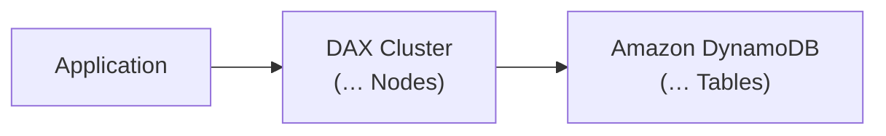

> ⭐⭐⭐ **Ba từ khóa nhận diện DAX:** **"microseconds"**, **"no application code change"**, **"5 minutes TTL"**.
>
> ⚠️ **So sánh nhanh:** **DynamoDB = single-digit MILLIsecond**; **DAX = MICROsecond**. Đề dùng đơn vị này để phân biệt.

---

### ⭐⭐⭐ DynamoDB Accelerator (DAX) vs. ElastiCache

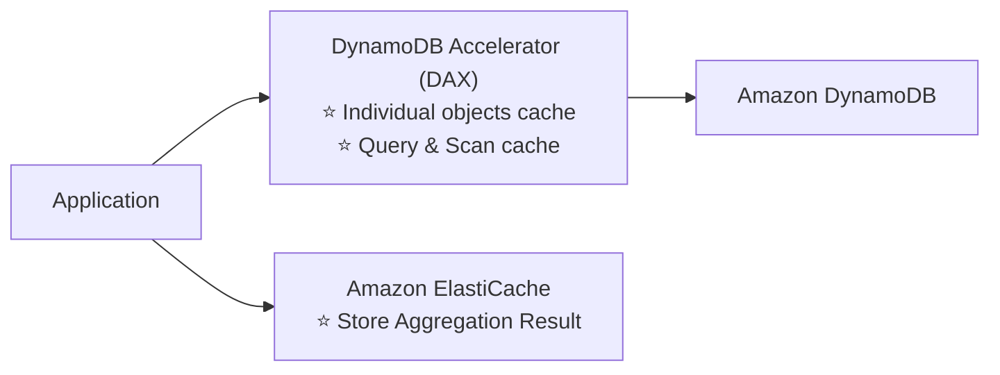

| | ⭐⭐⭐ **DAX** | ⭐⭐⭐ **ElastiCache** |
|---|---|---|
| **Cache cái gì** | ⭐⭐⭐ **Individual objects cache**<br/>⭐⭐⭐ **Query & Scan cache** | ⭐⭐⭐ **Store AGGREGATION RESULT** (kết quả tổng hợp/tính toán) |
| **Sửa code?** | ✅ **KHÔNG cần** | ⚠️ **PHẢI sửa code** |
| **Dành cho** | **Chỉ DynamoDB** | **Bất kỳ dữ liệu nào** |

> ⭐⭐⭐ **Đây là câu hỏi thi rất hay gặp.** Nhớ:
> - **Cache kết quả GET/QUERY/SCAN của DynamoDB** → **DAX**
> - **Cache KẾT QUẢ TÍNH TOÁN TỔNG HỢP** (ví dụ "tổng doanh thu tháng này", leaderboard đã tính sẵn) → **ElastiCache**
>
> **Hai cái KHÔNG loại trừ nhau** — slide vẽ cả hai cùng dùng chung một application.

---

### ⭐⭐⭐ DynamoDB Streams — Stream Processing

- ⭐⭐⭐ **Luồng CÓ THỨ TỰ (ordered stream) các thay đổi Ở MỨC ITEM (create/update/delete) trong một table**

**Use cases:** ⭐⭐⭐

| Use case |
|---|
| ⭐⭐⭐ **Phản ứng với thay đổi THEO THỜI GIAN THỰC** (ví dụ gửi email chào mừng cho user mới) |
| ⭐⭐ **Phân tích sử dụng real-time** |
| ⭐⭐ **Insert vào các bảng dẫn xuất (derivative tables)** |
| ⭐⭐⭐ **Triển khai CROSS-REGION REPLICATION** |
| ⭐⭐⭐ **Gọi AWS Lambda khi có thay đổi trên DynamoDB table** |

**⭐⭐⭐ BẢNG SO SÁNH HAI LỰA CHỌN — RA THI:**

| | ⭐⭐⭐ **DynamoDB Streams** | ⭐⭐⭐ **Kinesis Data Streams (mới hơn)** |
|---|---|---|
| ⭐⭐⭐ **Retention** | **24 GIỜ** | **1 NĂM** |
| ⭐⭐⭐ **Số consumer** | ⚠️ **GIỚI HẠN số consumer** | ✅ **SỐ LƯỢNG LỚN consumer** |
| ⭐⭐⭐ **Xử lý bằng** | **AWS Lambda Triggers**, hoặc **DynamoDB Stream Kinesis adapter** | **AWS Lambda, Kinesis Data Analytics, Kinesis Data Firehose, AWS Glue Streaming ETL…** |

> ⭐⭐⭐ **Hai con số ĐINH: 24 GIỜ vs 1 NĂM.** Đề hỏi *"cần giữ lịch sử thay đổi lâu hơn 24 giờ / cần nhiều consumer"* → **Kinesis Data Streams**.

**⭐⭐ Sơ đồ kiến trúc đầy đủ:**

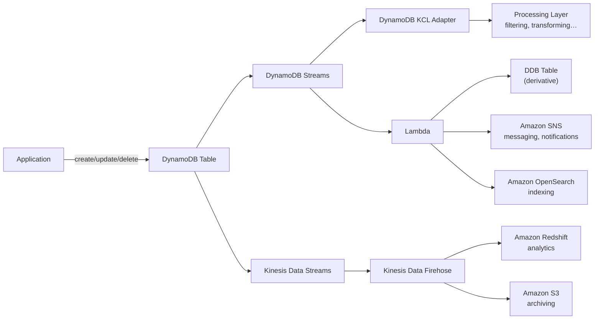

---

### ⭐⭐⭐ DynamoDB Global Tables

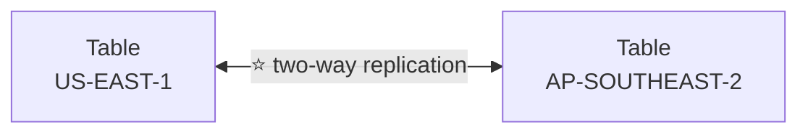

- ⭐⭐⭐ **Làm cho DynamoDB table TRUY CẬP ĐƯỢC VỚI ĐỘ TRỄ THẤP Ở NHIỀU REGION**
- ⭐⭐⭐ **ACTIVE-ACTIVE replication**
- ⭐⭐⭐ **Ứng dụng có thể ĐỌC VÀ GHI vào table ở BẤT KỲ REGION nào**
- ⚠️⭐⭐⭐ **PHẢI BẬT DYNAMODB STREAMS làm ĐIỀU KIỆN TIÊN QUYẾT (pre-requisite)**

> ⭐⭐⭐ **Ba điểm ra thi:**
> 1. **Active-Active** (khác Aurora Global Database chỉ có **một** region ghi được)
> 2. **Đọc VÀ ghi được ở MỌI region**
> 3. ⚠️ **Bắt buộc bật DynamoDB Streams trước** — đây là câu hỏi bẫy kinh điển
>
> **Từ khóa nhận diện:** *"người dùng toàn cầu, độ trễ thấp, ghi được ở nhiều nơi"* → **Global Tables**.

---

### ⭐⭐⭐ DynamoDB – Time To Live (TTL)

- ⭐⭐⭐ **TỰ ĐỘNG XÓA items SAU một expiry timestamp**
- ⭐⭐⭐ **Use cases: giảm dữ liệu lưu trữ bằng cách chỉ giữ item hiện hành, tuân thủ nghĩa vụ pháp lý, XỬ LÝ WEB SESSION…**

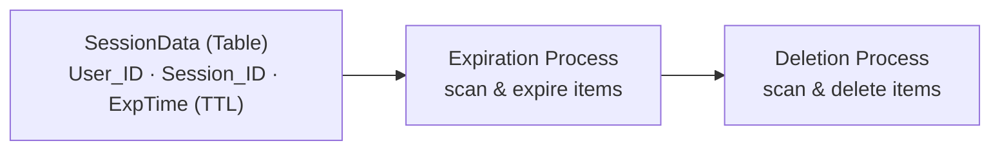

**Ví dụ từ slide:**

| User_ID | Session_ID | **ExpTime (TTL)** |
|---|---|---|
| `7791a3d6-…` | `74686572652` | `1631188571` ← **đã hết hạn** |
| `873e0634-…` | `6e6f7468696` | `1631274971` ← **đúng thời điểm hiện tại** |
| `a80f73a1-…` | `746f2073656` | `1631102171` ← **đã hết hạn** |

⭐⭐ **Current Time: Friday, September 10, 2021, 11:56:11 AM (Epoch timestamp: 1631274971)**

> ⭐⭐⭐ **Điểm ra thi:** **TTL dùng EPOCH TIMESTAMP (Unix time, tính bằng GIÂY)**, đặt trong một **attribute do bạn chọn**.
>
> ⭐⭐⭐ **Từ khóa: "web session handling", "tự động dọn dữ liệu cũ", "giảm chi phí lưu trữ"** → **DynamoDB TTL**.
>
> ⚠️ **Lưu ý thực tế (ngoài slide):** việc xóa diễn ra **trong vòng 48 giờ** sau khi hết hạn, **không tức thì**, và **KHÔNG tốn WCU**.

---

### ⭐⭐⭐ DynamoDB – Backups for disaster recovery

| | ⭐⭐⭐ **Continuous backups (PITR)** | ⭐⭐⭐ **On-demand backups** |
|---|---|---|
| **Cách bật** | ⭐⭐⭐ **Tùy chọn bật cho 35 NGÀY GẦN NHẤT** | **Backup đầy đủ, giữ dài hạn cho tới khi XÓA THỦ CÔNG** |
| **Khôi phục** | ⭐⭐⭐ **Point-in-time recovery tới BẤT KỲ thời điểm nào trong cửa sổ backup** | Từ bản backup đã tạo |
| **Ảnh hưởng hiệu năng** | — | ⭐⭐⭐ **KHÔNG ảnh hưởng performance hay latency** |
| **Quản lý** | — | ⭐⭐ **Cấu hình và quản lý được trong AWS BACKUP** (cho phép **cross-region copy**) |
| ⚠️⭐⭐⭐ **Điểm chung** | **Quá trình khôi phục TẠO RA MỘT TABLE MỚI** | **Quá trình khôi phục TẠO RA MỘT TABLE MỚI** |

> ⭐⭐⭐ **Con số 35 NGÀY và câu "recovery process creates a NEW table" đều là điểm ra thi.** Bạn **không thể restore đè lên table cũ**.

---

### ⭐⭐⭐ DynamoDB – Integration with Amazon S3

**⭐⭐⭐ Export to S3:**

- ⚠️⭐⭐⭐ **PHẢI BẬT PITR**
- ⭐⭐⭐ **Hoạt động với BẤT KỲ thời điểm nào trong 35 NGÀY gần nhất**
- ⭐⭐⭐ **KHÔNG ảnh hưởng READ CAPACITY của table**
- ⭐⭐ **Use case: phân tích dữ liệu trên DynamoDB, giữ snapshot để audit, ETL trên dữ liệu S3 trước khi import ngược lại DynamoDB**
- ⭐⭐ **Export ở định dạng DynamoDB JSON hoặc ION**

**⭐⭐⭐ Import from S3:**

- ⭐⭐ **Import định dạng CSV, DynamoDB JSON hoặc ION**
- ⭐⭐⭐ **KHÔNG TIÊU TỐN WRITE CAPACITY nào**
- ⭐⭐⭐ **TẠO RA MỘT TABLE MỚI**
- ⭐⭐ **Lỗi import được ghi vào CloudWatch Logs**

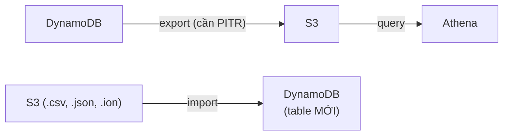

> ⭐⭐⭐ **Ba điểm vàng:**
> 1. **Export BẮT BUỘC bật PITR trước**
> 2. **Export KHÔNG tốn RCU, Import KHÔNG tốn WCU** — đây là lý do nên dùng thay vì tự viết script scan/put
> 3. **Import tạo table MỚI** (giống restore backup)
>
> **Kiến trúc hay ra thi:** **DynamoDB → Export S3 → Athena query** để phân tích mà **không ảnh hưởng production table**.

---

## 223. API Gateway Overview

### ⭐⭐⭐ Example: Building a Serverless API

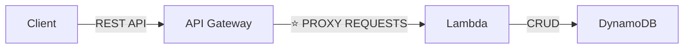

⭐⭐⭐ **Đây là kiến trúc serverless API chuẩn: Client → API Gateway → Lambda → DynamoDB.**

---

### ⭐⭐⭐ AWS API Gateway — Tính năng

| Tính năng | Ghi chú |
|---|---|
| ⭐⭐⭐ **AWS Lambda + API Gateway: KHÔNG có hạ tầng nào để quản lý** | |
| ⭐⭐⭐ **Hỗ trợ giao thức WEBSOCKET** | ⭐ Cho ứng dụng **real-time 2 chiều** |
| ⭐⭐ **Xử lý API versioning (v1, v2…)** | |
| ⭐⭐ **Xử lý nhiều môi trường (dev, test, prod…)** | ⭐ gọi là **Stages** |
| ⭐⭐⭐ **Xử lý bảo mật (Authentication và Authorization)** | |
| ⭐⭐⭐ **Tạo API keys, xử lý REQUEST THROTTLING** | |
| ⭐⭐ **Import Swagger / Open API để định nghĩa API nhanh** | |
| ⭐⭐ **Transform và validate request/response** | |
| ⭐⭐ **Generate SDK và API specifications** | |
| ⭐⭐⭐ **CACHE API RESPONSES** | |

> ⭐⭐⭐ **Ba tính năng ra thi nhiều nhất: WebSocket, Throttling/API keys, Caching responses.**

---

### ⭐⭐⭐ API Gateway – Integrations High Level (3 loại)

| Loại | Chi tiết |
|---|---|
| ⭐⭐⭐ **Lambda Function** | **Gọi Lambda function**<br/>⭐⭐⭐ **Cách DỄ NHẤT để expose REST API được hậu thuẫn bởi AWS Lambda** |
| ⭐⭐⭐ **HTTP** | **Expose HTTP endpoints ở backend**<br/>Ví dụ: **internal HTTP API on-premise, Application Load Balancer…**<br/>⭐⭐⭐ **Tại sao? Để THÊM rate limiting, caching, user authentication, API keys, v.v.** |
| ⭐⭐⭐ **AWS Service** | **Expose BẤT KỲ AWS API nào qua API Gateway**<br/>Ví dụ: **khởi động một AWS Step Function workflow, post message vào SQS**<br/>⭐⭐⭐ **Tại sao? Để THÊM authentication, deploy công khai, rate control…** |

> ⭐⭐⭐ **Câu hỏi thi điển hình:** *"Muốn client gọi trực tiếp Kinesis/SQS nhưng cần xác thực và giới hạn tốc độ"* → **API Gateway với AWS Service integration**.

---

### ⭐⭐ API Gateway – AWS Service Integration: Kinesis Data Streams example

```mermaid
flowchart LR
    C["Client"] -->|"requests"| AG["API Gateway"]
    AG -->|"records"| KDS["Kinesis Data Streams"]
    KDS -->|"send"| KDF["Kinesis Data Firehose"]
    KDF -->|"store .json files"| S3["Amazon S3"]
```

> ⭐⭐ **Kiến trúc này ghép chương 17 + 19:** client gửi HTTP request → API Gateway đẩy thẳng vào Kinesis (**không cần Lambda**) → Firehose → S3.

---

### ⭐⭐⭐ API Gateway - Endpoint Types (3 loại — RA THI CHẮC CHẮN)

| Loại | Đặc điểm |
|---|---|
| ⭐⭐⭐ **Edge-Optimized (mặc định)** | **Dành cho CLIENT TOÀN CẦU**<br/>⭐⭐⭐ **Request được định tuyến qua CLOUDFRONT EDGE LOCATIONS (cải thiện latency)**<br/>⚠️⭐⭐⭐ **API Gateway VẪN CHỈ NẰM Ở MỘT REGION** |
| ⭐⭐⭐ **Regional** | **Dành cho client TRONG CÙNG REGION**<br/>⭐⭐ **Có thể TỰ KẾT HỢP với CloudFront** (kiểm soát nhiều hơn về caching và distribution) |
| ⭐⭐⭐ **Private** | ⭐⭐⭐ **CHỈ truy cập được TỪ VPC của bạn qua INTERFACE VPC ENDPOINT (ENI)**<br/>⭐⭐⭐ **Dùng RESOURCE POLICY để định nghĩa quyền truy cập** |

> ⭐⭐⭐ **Bẫy thi kinh điển:** *"Edge-Optimized có nghĩa là API Gateway được deploy ở nhiều region?"* → **KHÔNG!** Slide ghi rõ: **"The API Gateway still lives in only one region"**. Chỉ có **request đi qua CloudFront Edge**, còn API Gateway vẫn ở một region.
>
> ⭐⭐⭐ **Từ khóa nhận diện:** *"API chỉ dùng nội bộ trong VPC"* → **Private endpoint + Interface VPC Endpoint + Resource Policy**.

---

### ⭐⭐⭐ API Gateway – Security

**⭐⭐⭐ User Authentication — 3 cách:**

| Cách | Dùng khi |
|---|---|
| ⭐⭐⭐ **IAM Roles** | **HỮU ÍCH CHO ỨNG DỤNG NỘI BỘ (internal applications)** |
| ⭐⭐⭐ **Cognito** | **Danh tính cho USER BÊN NGOÀI — ví dụ mobile users** |
| ⭐⭐⭐ **Custom Authorizer** | **Logic tự viết của bạn** (Lambda Authorizer) |

**⭐⭐⭐ Custom Domain Name HTTPS security qua tích hợp với AWS Certificate Manager (ACM):**

- ⚠️⭐⭐⭐ **Nếu dùng EDGE-OPTIMIZED endpoint → certificate PHẢI ở `us-east-1`**
- ⚠️⭐⭐⭐ **Nếu dùng REGIONAL endpoint → certificate PHẢI ở REGION CỦA API GATEWAY**
- ⭐⭐⭐ **PHẢI thiết lập CNAME hoặc A-alias record trong Route 53**

> ⭐⭐⭐ **Quy tắc `us-east-1` này giống hệt CloudFront** (chương 15) — **Edge thì certificate luôn ở `us-east-1`**. Đây là câu hỏi thi rất hay gặp.

---

## 224. API Gateway Basics Hands-On

> 🖐️ Bài Hands On — **không có slide**, nhưng dùng **code chính thức** `code_v2025-10-27/api-gateway/lambda-code.py` (đã trích ở bài 212).

### Bước 1 — Chuẩn bị Lambda function

Dùng lại function ở bài 212, hoặc tạo mới với code:

```python
import json

def lambda_handler(event, context):
    body = "Hello from Lambda!"
    statusCode = 200
    return {
        "statusCode": statusCode,
        "body": json.dumps(body),
        "headers": {
            "Content-Type": "application/json"
        }
    }
```

> ⭐⭐⭐ **Vì sao phải trả về đúng cấu trúc này?** Khi dùng **Lambda Proxy Integration**, API Gateway **yêu cầu** response có `statusCode`, `body` (chuỗi), và `headers`. Trả sai cấu trúc → lỗi **502 Bad Gateway**.

### Bước 2 — Tạo API

1. Console → tìm **API Gateway** → **Create API**
2. Chọn loại API:

| Loại | Ghi chú |
|---|---|
| ⭐⭐⭐ **REST API** | **Đầy đủ tính năng nhất** — API keys, caching, request validation, WAF |
| ⭐⭐ **HTTP API** | ⭐ **Rẻ hơn ~70%, nhanh hơn, ít tính năng hơn** |
| ⭐⭐ **WebSocket API** | Giao tiếp **hai chiều real-time** |
| **REST API Private** | Chỉ trong VPC |

3. Chọn **HTTP API** (đơn giản nhất cho demo) → **Build**
4. **Integrations** → **Add integration** → **Lambda** → chọn `demo-lambda`
5. **API name**: `demo-api` → **Next**

### Bước 3 — Cấu hình Routes

1. **Method**: `GET`, **Resource path**: `/hello`, **Integration target**: `demo-lambda`
2. **Next**

### Bước 4 — Cấu hình Stages

1. ⭐⭐⭐ **Stage name**: `$default` (hoặc `dev`, `prod`)
2. ⭐⭐ Bật **Auto-deploy** → **Next** → **Create**

> ⭐⭐⭐ **Stage là khái niệm quan trọng:** đây chính là tính năng *"handle different environments (dev, test, prod…)"* trong slide bài 223. Mỗi stage có **URL riêng** và **cấu hình riêng** (throttling, caching, biến môi trường).

### Bước 5 — Test

1. Copy **Invoke URL** (dạng `https://abc123.execute-api.us-east-1.amazonaws.com`)
2. Mở trình duyệt hoặc chạy:

```bash
curl https://abc123.execute-api.us-east-1.amazonaws.com/hello
# → "Hello from Lambda!"
```

> ⭐⭐ **Nếu nhận lỗi 502:** kiểm tra Lambda có trả đúng `statusCode/body/headers` không. **Nếu 403:** kiểm tra route path và stage.

### ⭐⭐ Với REST API — các bước khác biệt cần biết

| Bước | Thao tác |
|---|---|
| **Tạo Resource** | **Actions → Create Resource** → path `/hello` |
| **Tạo Method** | **Actions → Create Method** → `GET` |
| ⭐⭐⭐ **Integration type** | **Lambda Function** → ⭐ bật **Use Lambda Proxy integration** |
| ⭐⭐⭐ **Deploy API** | ⚠️ **Actions → Deploy API** → chọn Stage. **REST API KHÔNG tự deploy** — phải bấm thủ công mỗi lần sửa! |
| ⭐⭐ **Stage settings** | Bật **Enable API cache**, **Throttling** (Rate/Burst), **Enable CloudWatch Logs** |

> ⚠️⭐⭐⭐ **Lỗi phổ biến nhất khi làm REST API:** sửa xong mà **quên bấm Deploy API** → thay đổi không có hiệu lực. HTTP API với **Auto-deploy** thì không bị.

### ⭐⭐ Xem các tính năng bảo mật trên Console

- **Authorization** → **Create authorizer**: chọn ⭐ **JWT** (Cognito) hoặc ⭐ **Lambda** (custom authorizer)
- **Throttling** (ở Stage): ⭐⭐ **Rate (request/giây)** và ⭐⭐ **Burst (số request dồn)**
- **CORS**: cấu hình `Access-Control-Allow-Origin` nếu gọi từ trình duyệt

### CLI tương đương

```bash
# Liệt kê API
aws apigatewayv2 get-apis

# Xem routes
aws apigatewayv2 get-routes --api-id abc123

# Gọi thử
curl -i https://abc123.execute-api.us-east-1.amazonaws.com/hello
```

> 💡 **API Gateway có Free Tier 1 triệu request/tháng trong 12 tháng đầu.** Bài này an toàn, nhưng nhớ **Delete API** sau khi học xong cho gọn.

---

## 225. Step Functions

### ⭐⭐⭐ AWS Step Functions

- ⭐⭐⭐ **Xây dựng SERVERLESS VISUAL WORKFLOW để ĐIỀU PHỐI (orchestrate) các Lambda function của bạn**
- ⭐⭐⭐ **Features: SEQUENCE (tuần tự), PARALLEL (song song), CONDITIONS (điều kiện), TIMEOUTS, ERROR HANDLING, …**
- ⭐⭐⭐ **Tích hợp được với EC2, ECS, On-premises servers, API Gateway, SQS queues, v.v…**
- ⭐⭐⭐ **Có khả năng triển khai tính năng HUMAN APPROVAL (phê duyệt của con người)**
- ⭐⭐⭐ **Use cases: order fulfillment, data processing, web applications, BẤT KỲ WORKFLOW nào**

```mermaid
flowchart TD
    S["Start"] --> A["Lambda: Validate Order"]
    A --> C{"Condition:<br/>Order hợp lệ?"}
    C -->|"Có"| P1["Lambda: Charge Payment"]
    C -->|"Không"| E["Lambda: Reject Order"]
    P1 --> PAR["Parallel"]
    PAR --> B1["Lambda: Update Inventory"]
    PAR --> B2["Lambda: Send Email"]
    B1 --> H["⭐ Human Approval<br/>(chờ người duyệt)"]
    B2 --> H
    H --> F["End"]
    E --> F
```

> ⭐⭐⭐ **Từ khóa nhận diện Step Functions trong đề:**
> - *"orchestrate multiple Lambda functions"*
> - *"workflow with sequence / parallel / conditions"*
> - *"error handling and retry between steps"*
> - ⭐⭐⭐ *"HUMAN APPROVAL step"* ← từ khóa **độc quyền** của Step Functions
> - *"visual workflow"*
>
> ⚠️ **Đáp án SAI kinh điển:** "Để Lambda A gọi Lambda B, Lambda B gọi Lambda C" — đây là **anti-pattern** (Lambda chaining), khó debug, dễ vượt timeout 15 phút, không retry được từng bước.

> 💡 **Phân biệt với các dịch vụ khác:**
> - **Step Functions** = **điều phối workflow có trạng thái, nhiều bước**
> - **EventBridge** = **định tuyến sự kiện đơn lẻ**
> - **SQS** = **hàng đợi công việc**

---

## 226. Amazon Cognito Overview

### ⭐⭐⭐ Amazon Cognito là gì?

- ⭐⭐⭐ **Cấp DANH TÍNH (identity) cho người dùng để tương tác với ứng dụng web hoặc mobile của chúng ta**

**⭐⭐⭐ HAI thành phần — PHÂN BIỆT SỐNG CÒN:**

| | ⭐⭐⭐ **Cognito User Pools (CUP)** | ⭐⭐⭐ **Cognito Identity Pools (Federated Identity)** |
|---|---|---|
| **Làm gì** | ⭐⭐⭐ **Chức năng SIGN IN cho người dùng app** | ⭐⭐⭐ **Cấp AWS CREDENTIALS cho user để họ truy cập TRỰC TIẾP tài nguyên AWS** |
| **Tích hợp với** | ⭐⭐⭐ **API Gateway & Application Load Balancer** | ⭐⭐⭐ **Tích hợp với Cognito User Pools làm identity provider** |
| **Kết quả trả về** | **Token (JWT)** | **Temporary AWS credentials** |

**⭐⭐⭐ Cognito vs IAM — câu chốt của Stéphane:**

> ⭐⭐⭐ **"hundreds of users", "mobile users", "authenticate with SAML"** → **dùng COGNITO**, không dùng IAM.

> ⭐⭐⭐ **Đây là một trong những câu hỏi thi phổ biến nhất về Cognito.** IAM dành cho **nhân viên/hệ thống nội bộ (vài chục/vài trăm)**; Cognito dành cho **người dùng cuối của app (hàng nghìn/triệu)**.

---

### ⭐⭐⭐ Cognito User Pools (CUP) – User Features

- ⭐⭐⭐ **Tạo một SERVERLESS DATABASE CỦA USER cho web & mobile app của bạn**
- ⭐⭐ **Simple login: kết hợp Username (hoặc email) / password**
- ⭐⭐ **Password reset**
- ⭐⭐ **Email & Phone Number Verification**
- ⭐⭐⭐ **Multi-factor authentication (MFA)**
- ⭐⭐⭐ **Federated Identities: user từ FACEBOOK, GOOGLE, SAML…**

> ⭐⭐ **Nhớ cụm "serverless database of users"** — CUP chính là nơi **lưu trữ tài khoản người dùng**.

---

### ⭐⭐⭐ Cognito User Pools (CUP) - Integrations

- ⭐⭐⭐ **CUP tích hợp với API GATEWAY và APPLICATION LOAD BALANCER**

```mermaid
flowchart LR
    subgraph AGW["Với API Gateway"]
        U1["User"] -->|"1️⃣ Authenticate<br/>2️⃣ Retrieve token"| CUP1["Cognito User Pools"]
        U1 -->|"3️⃣ REST API + Pass Token"| AG["API Gateway<br/>⭐ Evaluate Cognito Token"]
        AG --> BE1["Backend"]
    end
    subgraph ALBG["Với Application Load Balancer"]
        U2["User"] -->|"Authenticate"| CUP2["Cognito User Pools"]
        U2 --> ALB["Application Load Balancer<br/>+ Listeners & Rules"]
        ALB --> TG["Target Group<br/>Backend"]
    end
```

> ⭐⭐⭐ **Điểm ra thi:** **ALB có thể tự xác thực user qua Cognito** trước khi chuyển request tới target — **không cần viết code xác thực trong ứng dụng**. Đề hay hỏi *"thêm xác thực cho ứng dụng sau ALB mà không sửa code"* → **ALB + Cognito User Pools**.

---

### ⭐⭐⭐ Cognito Identity Pools (Federated Identities)

- ⭐⭐⭐ **Lấy danh tính cho "users" để họ có được TEMPORARY AWS CREDENTIALS**
- ⭐⭐⭐ **Nguồn user có thể là: Cognito User Pools, 3rd party logins, v.v…**
- ⭐⭐⭐ **User sau đó có thể truy cập TRỰC TIẾP các dịch vụ AWS hoặc qua API Gateway**
- ⭐⭐⭐ **Các IAM POLICIES áp dụng cho credentials được ĐỊNH NGHĨA TRONG COGNITO**
- ⭐⭐⭐ **Có thể TÙY BIẾN DỰA TRÊN `user_id` để kiểm soát CHI TIẾT (fine grained control)**
- ⭐⭐ **Có IAM role mặc định cho AUTHENTICATED users và GUEST users**

```mermaid
flowchart LR
    W["Web & Mobile Applications"] -->|"1️⃣ Login and Get Token"| SP["Social Identity Provider<br/>hoặc Cognito User Pools"]
    W -->|"2️⃣ Exchange token for<br/>temporary AWS credentials"| CIP["Cognito Identity Pools"]
    CIP -.->|"validate"| SP
    W -->|"3️⃣ Direct access to AWS"| S3["Private S3 Bucket"]
    W --> DDB["DynamoDB Table"]
```

**⭐⭐ Cognito Identity Pools — Row Level Security in DynamoDB:**

⭐⭐⭐ **Vì IAM policy tùy biến được theo `user_id`, bạn có thể cho phép mỗi user CHỈ ĐỌC/GHI ĐƯỢC CÁC DÒNG CỦA CHÍNH HỌ trong DynamoDB table.** Đây gọi là **row level security**.

> ⭐⭐⭐ **BẢNG TỔNG KẾT COGNITO — HỌC THUỘC:**

| Nhu cầu trong đề | Đáp án |
|---|---|
| *"Người dùng đăng nhập vào app bằng username/password, Facebook, Google"* | ⭐⭐⭐ **Cognito User Pools** |
| *"Bảo vệ API Gateway / ALB bằng đăng nhập"* | ⭐⭐⭐ **Cognito User Pools** |
| *"User cần upload thẳng vào S3 / ghi thẳng vào DynamoDB từ mobile app"* | ⭐⭐⭐ **Cognito Identity Pools** (cấp AWS credentials tạm) |
| *"Mỗi user chỉ được truy cập dữ liệu của riêng mình trong DynamoDB"* | ⭐⭐⭐ **Cognito Identity Pools + IAM policy theo `user_id`** |
| *"Hàng trăm/nghìn user, mobile users, SAML"* | ⭐⭐⭐ **Cognito** (không phải IAM) |
| *"Nhân viên nội bộ truy cập tài nguyên AWS"* | ⭐⭐⭐ **IAM** (hoặc IAM Identity Center) |

---

## Trắc nghiệm 16: Serverless Overview Quiz

### Các điểm dễ bị bẫy

| Câu hỏi thường gặp | Đáp án đúng | Vì sao đáp án khác sai |
|---|---|---|
| Serverless nghĩa là không có server? | ❌ **Sai** — nghĩa là **bạn không quản lý/provision/nhìn thấy** server | |
| Lambda bị giới hạn bởi gì? | ⭐⭐⭐ **THỜI GIAN** (EC2 bị giới hạn bởi RAM/CPU) | |
| Lambda timeout tối đa? | ⭐⭐⭐ **900 giây = 15 PHÚT** | Job > 15 phút → **ECS/Fargate, AWS Batch, EC2** |
| Lambda RAM tối đa? | ⭐⭐⭐ **10 GB** (từ 128 MB, bước 1 MB) | |
| Lambda chạy chậm, CPU yếu, làm gì? | ⭐⭐⭐ **TĂNG RAM** — CPU và network tỉ lệ thuận với RAM | ❌ Không cấu hình CPU trực tiếp được |
| Dung lượng `/tmp` của Lambda? | ⭐⭐⭐ **512 MB đến 10 GB** | |
| Deployment size của Lambda? | **50 MB (nén .zip) / 250 MB (giải nén)** | |
| Environment variables tối đa? | **4 KB** | |
| Concurrency mặc định? | ⭐⭐⭐ **1000** (xin tăng qua support ticket) | |
| Throttle với synchronous invocation? | ⭐⭐⭐ **`ThrottleError` — HTTP 429** | |
| Throttle với asynchronous invocation? | ⭐⭐⭐ **Tự động retry, rồi vào DLQ** | |
| Async invocation retry bao lâu? | ⭐⭐⭐ **Tới 6 GIỜ**, interval từ **1 giây** đến tối đa **5 phút** | |
| Function này ăn hết slot của function khác, sửa sao? | ⭐⭐⭐ **Reserved Concurrency** | |
| Request đầu tiên chậm (cold start), sửa sao? | ⭐⭐⭐ **Provisioned Concurrency** | Reserved Concurrency **không** giải quyết cold start |
| Reserved vs Provisioned về chi phí? | **Reserved MIỄN PHÍ, Provisioned TỐN TIỀN** | |
| Giảm cold start Java/Python/.NET miễn phí? | ⭐⭐⭐ **Lambda SnapStart** (tới **10x**, no extra cost) | |
| Chạy Docker image bất kỳ trên AWS? | ⭐⭐⭐ **ECS/Fargate được ưu tiên** | Lambda container image cần **implement Lambda Runtime API** |
| CloudFront Functions viết bằng gì? | **JavaScript** (Lambda@Edge: **Node.js, Python**) | |
| CloudFront Functions chạm được trigger nào? | ⭐⭐⭐ **CHỈ Viewer Request/Response** | Lambda@Edge chạm **cả Origin** |
| Cần đọc request BODY ở edge? | ⭐⭐⭐ **Lambda@Edge** | CloudFront Functions **không** truy cập được body |
| Cần gọi AWS SDK ở edge? | ⭐⭐⭐ **Lambda@Edge** | CloudFront Functions **không có network access** |
| Cache key normalization? | ⭐⭐⭐ **CloudFront Functions** | |
| Lambda@Edge viết ở region nào? | ⭐⭐⭐ **`us-east-1`**, CloudFront tự replicate | |
| Max execution time CloudFront Functions? | **< 1 ms** (Lambda@Edge: **5–10 giây**) | |
| Lambda không kết nối được RDS private, vì sao? | ⭐⭐⭐ **Lambda mặc định nằm NGOÀI VPC của bạn** | |
| Đưa Lambda vào VPC cần gì? | ⭐⭐⭐ **VPC ID + Subnets + Security Groups**; Lambda tạo **ENI** | |
| Lambda mở quá nhiều connection tới RDS? | ⭐⭐⭐ **RDS Proxy** (Lambda phải trong VPC) | RDS Proxy **không bao giờ public** |
| RDS Proxy giảm failover time bao nhiêu? | **66%** | |
| Gọi Lambda từ trong database, engine nào? | ⭐⭐⭐ **RDS for PostgreSQL và Aurora MySQL** | ❌ "RDS for MySQL", "Aurora PostgreSQL" là sai |
| RDS Event Notifications cho biết gì? | ⭐⭐⭐ **Thông tin về DB INSTANCE, KHÔNG về dữ liệu** | Muốn biết thay đổi dữ liệu → **Invoking Lambda from RDS** |
| RDS Event Notifications độ trễ? | **Near real-time — tới 5 phút** | |
| Kích thước item DynamoDB tối đa? | ⭐⭐⭐ **400 KB** | |
| Primary Key DynamoDB đổi được sau khi tạo? | ❌ **KHÔNG — phải quyết định lúc tạo table** | |
| Workload không đoán trước được, chọn mode nào? | ⭐⭐⭐ **On-Demand** (đắt hơn nhưng không cần plan) | |
| Cần cache DynamoDB không sửa code? | ⭐⭐⭐ **DAX** — **microseconds**, TTL **5 phút** | |
| Cache kết quả tính toán tổng hợp? | ⭐⭐⭐ **ElastiCache** (DAX chỉ cache object/query/scan của DynamoDB) | |
| DynamoDB Streams giữ dữ liệu bao lâu? | ⭐⭐⭐ **24 GIỜ** (Kinesis Data Streams: **1 NĂM**) | |
| Cần nhiều consumer đọc thay đổi DynamoDB? | ⭐⭐⭐ **Kinesis Data Streams** | DynamoDB Streams giới hạn số consumer |
| Global Tables cần bật gì trước? | ⚠️⭐⭐⭐ **DynamoDB Streams** (pre-requisite) | |
| Global Tables ghi được ở mấy region? | ⭐⭐⭐ **MỌI region — Active-Active** | Khác Aurora Global DB (chỉ 1 region ghi) |
| Tự động xóa session cũ trong DynamoDB? | ⭐⭐⭐ **TTL** (dùng **epoch timestamp**) | |
| PITR của DynamoDB giữ bao lâu? | ⭐⭐⭐ **35 ngày** | |
| Restore DynamoDB backup ghi đè table cũ? | ❌ **KHÔNG — luôn tạo TABLE MỚI** | |
| Export DynamoDB sang S3 cần gì? | ⚠️⭐⭐⭐ **Phải bật PITR** | Export **không tốn RCU**, Import **không tốn WCU** |
| API Gateway Edge-Optimized deploy ở nhiều region? | ❌ **KHÔNG — vẫn chỉ MỘT region**, chỉ request đi qua CloudFront Edge | |
| API chỉ dùng nội bộ VPC? | ⭐⭐⭐ **Private endpoint + Interface VPC Endpoint + Resource Policy** | |
| Certificate cho Edge-Optimized API ở đâu? | ⭐⭐⭐ **`us-east-1`** | Regional → **region của API Gateway** |
| Xác thực API Gateway cho mobile users? | ⭐⭐⭐ **Cognito** | IAM Roles dành cho **internal applications** |
| Client gọi thẳng SQS/Kinesis có xác thực + rate limit? | ⭐⭐⭐ **API Gateway — AWS Service integration** | |
| Điều phối nhiều Lambda có điều kiện, song song, human approval? | ⭐⭐⭐ **Step Functions** | ❌ Lambda gọi Lambda là anti-pattern |
| "Human approval" là từ khóa của dịch vụ nào? | ⭐⭐⭐ **Step Functions** | |
| Hàng nghìn mobile users đăng nhập? | ⭐⭐⭐ **Cognito** (không phải IAM) | |
| Mobile app cần upload thẳng lên S3? | ⭐⭐⭐ **Cognito Identity Pools** (cấp temporary AWS credentials) | User Pools chỉ cấp **token** |
| Mỗi user chỉ đọc được dòng của mình trong DynamoDB? | ⭐⭐⭐ **Identity Pools + IAM policy theo `user_id`** (row level security) | |
| Thêm đăng nhập cho app sau ALB, không sửa code? | ⭐⭐⭐ **ALB + Cognito User Pools** | |

---

### Checklist tự kiểm tra trước khi làm quiz

**Lambda:**
- [ ] Thuộc bộ số: **15 phút / 10 GB RAM / 1000 concurrency / 4 KB env vars / 50 MB zip / 250 MB unzip / `/tmp` 512 MB–10 GB**
- [ ] Nhớ **tăng RAM = tăng CPU + network**
- [ ] Nhớ **throttle: sync → 429; async → retry tới 6 giờ rồi vào DLQ**
- [ ] Phân biệt **Reserved Concurrency (giới hạn, miễn phí)** vs **Provisioned Concurrency (chống cold start, tốn tiền)**
- [ ] Nhớ **SnapStart: Java/Python/.NET, tới 10x, miễn phí**
- [ ] Nhớ **Lambda mặc định NGOÀI VPC** → không gọi được RDS private
- [ ] Nhớ **RDS Proxy** cho vấn đề connection pooling, **Lambda phải trong VPC**
- [ ] Nhớ **Invoking Lambda from RDS: CHỈ PostgreSQL & Aurora MySQL**
- [ ] Nhớ **RDS Event Notifications không cho biết gì về DỮ LIỆU**

**Edge:**
- [ ] Thuộc **bảng CloudFront Functions vs Lambda@Edge** (runtime, triggers, execution time, memory, network/file/body access, pricing)
- [ ] Nhớ **CloudFront Functions = chỉ Viewer; Lambda@Edge = cả Origin**
- [ ] Nhớ **Lambda@Edge viết ở `us-east-1`**

**DynamoDB:**
- [ ] Nhớ **400 KB/item**, **Primary Key cố định lúc tạo table**
- [ ] Phân biệt **Provisioned (RCU/WCU) vs On-Demand**
- [ ] Nhớ **DAX: microseconds, không sửa code, TTL 5 phút**
- [ ] Phân biệt **DAX (cache DynamoDB) vs ElastiCache (cache aggregation result)**
- [ ] Nhớ **Streams 24 giờ vs Kinesis Data Streams 1 năm**
- [ ] Nhớ **Global Tables = Active-Active, BẮT BUỘC bật Streams trước**
- [ ] Nhớ **TTL dùng epoch timestamp**, **PITR 35 ngày**, **restore luôn tạo table mới**
- [ ] Nhớ **Export S3 cần PITR; export không tốn RCU, import không tốn WCU**

**API Gateway / Step Functions / Cognito:**
- [ ] Thuộc **3 endpoint types**: Edge-Optimized (vẫn 1 region!), Regional, Private
- [ ] Thuộc **3 integration types**: Lambda, HTTP, AWS Service
- [ ] Nhớ **certificate Edge-Optimized phải ở `us-east-1`**
- [ ] Nhớ **3 cách xác thực: IAM (internal), Cognito (external/mobile), Custom Authorizer**
- [ ] Nhớ **Step Functions = sequence/parallel/conditions/timeouts/error handling + HUMAN APPROVAL**
- [ ] Phân biệt **Cognito User Pools (đăng nhập, trả token)** vs **Identity Pools (trả AWS credentials)**
- [ ] Nhớ câu chốt: **"hundreds of users", "mobile users", "SAML" → Cognito, không phải IAM**

---

## Thuật ngữ Anh — Việt

| Tiếng Anh | Tiếng Việt |
|---|---|
| Serverless | Không cần quản lý máy chủ |
| Paradigm | Mô hình, hệ tư tưởng thiết kế |
| FaaS (Function as a Service) | Hàm như một dịch vụ |
| Provision | Cấp phát tài nguyên |
| AWS Lambda | Dịch vụ chạy hàm không cần server |
| Virtual functions | Hàm ảo |
| Run on-demand | Chạy khi có nhu cầu |
| Compute time | Thời gian tính toán |
| GB-second | Đơn vị tính phí: RAM (GB) × thời gian (giây) |
| Runtime | Môi trường chạy của ngôn ngữ |
| Custom Runtime API | Giao diện tự định nghĩa môi trường chạy |
| Lambda Container Image | Ảnh container chạy trên Lambda |
| Handler | Hàm điểm vào của Lambda |
| Execution role | Vai trò IAM Lambda dùng để gọi dịch vụ khác |
| Trigger | Nguồn kích hoạt hàm |
| CRON Job | Tác vụ chạy theo lịch |
| Memory allocation | Lượng RAM được cấp |
| Maximum execution time | Thời gian chạy tối đa |
| Environment variables | Biến môi trường |
| Deployment size | Kích thước gói triển khai |
| Concurrency | Số lần chạy đồng thời |
| Concurrent executions | Các lần thực thi đồng thời |
| Reserved concurrency | Số slot dành riêng (vừa đảm bảo vừa giới hạn) |
| Provisioned concurrency | Số instance khởi tạo sẵn |
| Throttle / Throttling | Chặn bớt yêu cầu khi vượt giới hạn |
| ThrottleError (429) | Lỗi bị chặn do quá tải |
| Synchronous / Asynchronous invocation | Gọi đồng bộ / bất đồng bộ |
| Dead Letter Queue (DLQ) | Hàng đợi chứa message xử lý lỗi |
| Exponentially | Theo cấp số nhân |
| Cold Start | Độ trễ lần chạy đầu do phải khởi tạo |
| Init / Invoke / Shutdown | Ba pha vòng đời của Lambda |
| Pre-initialized state | Trạng thái đã khởi tạo sẵn |
| Snapshot | Ảnh chụp trạng thái tại một thời điểm |
| SnapStart | Tính năng khởi động nhanh bằng snapshot |
| Edge Function | Hàm chạy tại điểm biên gần người dùng |
| CloudFront Functions | Hàm JavaScript nhẹ chạy trên CloudFront |
| Lambda@Edge | Lambda chạy tại edge location |
| Viewer Request / Response | Yêu cầu / phản hồi phía người xem |
| Origin Request / Response | Yêu cầu / phản hồi phía máy chủ gốc |
| Cache key normalization | Chuẩn hóa khóa cache |
| Header manipulation | Thao tác trên tiêu đề HTTP |
| URL rewrites / redirects | Viết lại / chuyển hướng đường dẫn |
| Bot Mitigation | Giảm thiểu truy cập từ bot |
| A/B Testing | Thử nghiệm hai phiên bản |
| Elastic Network Interface (ENI) | Giao diện mạng đàn hồi |
| RDS Proxy | Lớp trung gian gộp kết nối tới RDS |
| Connection pooling | Gộp và tái sử dụng kết nối |
| Failover time | Thời gian chuyển dự phòng |
| Resource-based Policy | Chính sách gắn trên tài nguyên |
| Event Notifications | Thông báo sự kiện |
| Near real-time | Gần thời gian thực |
| Amazon DynamoDB | Cơ sở dữ liệu NoSQL của AWS |
| NoSQL database | Cơ sở dữ liệu phi quan hệ |
| Distributed database | Cơ sở dữ liệu phân tán |
| Single-digit millisecond | Độ trễ một chữ số mili giây |
| Table / Item / Attribute | Bảng / dòng / thuộc tính |
| Primary Key | Khóa chính |
| Partition Key | Khóa phân mảnh |
| Sort Key | Khóa sắp xếp |
| Composite Primary Key | Khóa chính ghép (partition + sort) |
| Scalar / Document / Set Types | Kiểu đơn / tài liệu / tập hợp |
| Evolve schemas | Thay đổi cấu trúc dữ liệu linh hoạt |
| Read/Write Capacity Mode | Chế độ dung lượng đọc/ghi |
| RCU / WCU | Đơn vị dung lượng đọc / ghi |
| Provisioned Mode | Chế độ cấp phát trước |
| On-Demand Mode | Chế độ theo nhu cầu |
| Steep sudden spikes | Tăng vọt đột ngột |
| Query / Scan | Truy vấn theo khóa / quét toàn bảng |
| Global Secondary Index (GSI) | Chỉ mục phụ toàn cục |
| DynamoDB Accelerator (DAX) | Bộ nhớ đệm trong RAM cho DynamoDB |
| Read congestion | Nghẽn do đọc quá nhiều |
| Microseconds | Micro giây (một phần triệu giây) |
| Aggregation Result | Kết quả tổng hợp, tính toán sẵn |
| DynamoDB Streams | Luồng ghi nhận thay đổi dữ liệu |
| Item-level modifications | Thay đổi ở mức từng dòng |
| Derivative tables | Bảng dẫn xuất |
| KCL Adapter | Bộ chuyển đổi để đọc stream bằng KCL |
| Global Tables | Bảng nhân bản đa vùng |
| Active-Active replication | Nhân bản hai chiều, cả hai đều ghi được |
| Two-way replication | Sao chép hai chiều |
| Time To Live (TTL) | Thời hạn sống của dữ liệu |
| Expiry timestamp | Mốc thời gian hết hạn |
| Epoch timestamp | Thời gian Unix tính bằng giây |
| Point-in-time recovery (PITR) | Khôi phục về một thời điểm bất kỳ |
| On-demand backups | Sao lưu thủ công theo yêu cầu |
| AWS Backup | Dịch vụ sao lưu tập trung |
| Cross-region copy | Sao chép sang vùng khác |
| ION format | Định dạng dữ liệu của Amazon |
| API Gateway | Cổng quản lý API |
| REST API / HTTP API / WebSocket API | Ba loại API của API Gateway |
| Proxy requests | Chuyển tiếp yêu cầu nguyên vẹn |
| API versioning | Quản lý phiên bản API |
| Stage | Môi trường triển khai của API |
| Request throttling | Giới hạn tốc độ yêu cầu |
| API keys | Khóa định danh cho client |
| Swagger / Open API | Chuẩn mô tả API |
| Edge-Optimized | Tối ưu cho người dùng toàn cầu |
| Regional endpoint | Điểm cuối trong cùng vùng |
| Private endpoint | Điểm cuối chỉ truy cập trong VPC |
| Interface VPC Endpoint | Điểm cuối dạng ENI trong VPC |
| Resource policy | Chính sách gắn trên tài nguyên |
| Custom Authorizer | Bộ xác thực tự viết |
| AWS Certificate Manager (ACM) | Dịch vụ quản lý chứng chỉ SSL/TLS |
| CNAME / A-alias record | Bản ghi DNS trỏ tên miền |
| Step Functions | Dịch vụ điều phối luồng công việc |
| Orchestrate | Điều phối, dàn dựng |
| Visual workflow | Luồng công việc dạng sơ đồ |
| Sequence / Parallel / Conditions | Tuần tự / song song / điều kiện |
| Error handling | Xử lý lỗi |
| Human approval | Bước chờ con người phê duyệt |
| Order fulfillment | Hoàn tất đơn hàng |
| Amazon Cognito | Dịch vụ quản lý danh tính người dùng |
| Cognito User Pools (CUP) | Kho người dùng, lo việc đăng nhập |
| Cognito Identity Pools | Kho danh tính, cấp AWS credentials |
| Federated Identity | Danh tính liên kết từ nhà cung cấp khác |
| Identity provider | Nhà cung cấp danh tính |
| Multi-factor authentication (MFA) | Xác thực nhiều yếu tố |
| SAML | Chuẩn trao đổi xác thực doanh nghiệp |
| Temporary AWS credentials | Thông tin đăng nhập AWS tạm thời |
| Fine grained control | Kiểm soát chi tiết |
| Authenticated / Guest users | Người dùng đã đăng nhập / khách |
| Row Level Security | Bảo mật ở mức từng dòng dữ liệu |
| JWT (JSON Web Token) | Mã thông báo xác thực dạng JSON |

---

*Ghi chú: các phần Hands On (bài 212, 215, 221, 224) được tóm tắt lại các bước thao tác chính trên AWS Console — giao diện có thể thay đổi theo thời gian, logic và khái niệm vẫn giữ nguyên. Code Python ở bài 212 và 224 được trích **nguyên văn** từ `code_v2025-10-27/api-gateway/lambda-code.py`. Bài 209 là **bài đọc (Article), không phải video** — nội dung mục này là định hướng học, không phải trích slide. 💡 **CHI PHÍ: đây là chương RẺ NHẤT trong nhiều chương gần đây.** **Lambda, DynamoDB và API Gateway đều có Free Tier rộng rãi** (Lambda: 1 triệu request + 400,000 GB-giây **vĩnh viễn**; DynamoDB: 25 GB + 25 RCU/WCU **vĩnh viễn**; API Gateway: 1 triệu request/tháng trong 12 tháng đầu) — các bài hands-on làm thật thoải mái. ⚠️ **Hai ngoại lệ tốn tiền:** **Provisioned Concurrency** (bài 215) tính phí theo giờ kể cả khi không có request — nhớ đặt về 0 sau khi thử; và **DynamoDB On-Demand mode** nếu chạy `scan` liên tục trên bảng lớn. 💡 Các mục **Query vs Scan / GSI vs LSI** (bài 221), **Simple vs Composite Primary Key** (bài 220), **REST API phải bấm Deploy thủ công** (bài 224), **metrics `Throttles`/`ConcurrentExecutions`** (bài 215) và **VPC Gateway Endpoint cho Lambda trong private subnet** (bài 218) là nội dung bổ sung ngoài slide nhưng có xuất hiện trong đề thi SAA-C03.*
