# Phần 20 — Serverless Solution Architecture Discussions

> Khóa học: *Ultimate AWS Certified Solutions Architect Associate 2026* (Stéphane Maarek) — SAA-C03
> Nguồn tham chiếu: `AWS Certified Solutions Architect Slides v48.pdf` (phần "Serverless Architecture Discussions")

---

## Mục lục

| # | Bài giảng | Thời lượng | Loại |
|---|-----------|-----------|------|
| 227 | [Mobile Application: MyTodoList](#227-mobile-application-mytodolist) | 5 phút | Video |
| 228 | [Serverless Website: MyBlog.com](#228-serverless-website-myblogcom) | 6 phút | Video |
| 229 | [MicroServices Architecture](#229-microservices-architecture) | 4 phút | Video |
| 230 | [Software updates distribution](#230-software-updates-distribution) | 2 phút | Video |
| — | [Trắc nghiệm 17: Serverless Solutions Architecture Discussions Quiz](#trắc-nghiệm-17-serverless-solutions-architecture-discussions-quiz) | — | Quiz |

---

> 📌 **Đọc trước khi vào chương:** Đây là chương **KHÔNG CÓ KIẾN THỨC MỚI**. Toàn bộ dịch vụ đã học ở các chương trước (đặc biệt chương 19). Chương này dạy cách **GHÉP các dịch vụ lại thành kiến trúc**, và đó chính là **cách đề thi SAA-C03 ra câu hỏi**.
>
> ⭐⭐⭐ **Cách học chương này hiệu quả nhất:** với mỗi kiến trúc, hãy tự hỏi **"YÊU CẦU nào dẫn tới DỊCH VỤ nào"**. Đề thi sẽ cho bạn **yêu cầu** và hỏi **dịch vụ**. Tôi sẽ lập bảng ánh xạ đó cho từng bài.

---

## 227. Mobile Application: MyTodoList

### ⭐⭐⭐ Yêu cầu đề bài

Ta muốn tạo một **ứng dụng mobile** với các yêu cầu sau:

| # | Yêu cầu | ⭐ Dịch vụ tương ứng |
|---|---|---|
| 1 | ⭐⭐⭐ **Expose dưới dạng REST API với HTTPS** | **Amazon API Gateway** |
| 2 | ⭐⭐⭐ **Kiến trúc Serverless** | **AWS Lambda** |
| 3 | ⭐⭐⭐ **Người dùng phải TƯƠNG TÁC TRỰC TIẾP với thư mục RIÊNG của họ trong S3** | **Amazon Cognito (Identity Pools) + S3** |
| 4 | ⭐⭐⭐ **Người dùng xác thực qua một dịch vụ MANAGED SERVERLESS** | **Amazon Cognito** |
| 5 | ⭐⭐⭐ **Người dùng ghi và đọc to-do, nhưng CHỦ YẾU LÀ ĐỌC** | **DynamoDB + DAX** |
| 6 | ⭐⭐⭐ **Database phải SCALE và có READ THROUGHPUT CAO** | **DynamoDB + DAX** |

> ⭐⭐⭐ **Bảng này chính là "đề thi thu nhỏ".** Hãy học thuộc ánh xạ **yêu cầu → dịch vụ** ở cột bên phải.

---

### ⭐⭐⭐ Bước 1 — Mobile app: REST API layer

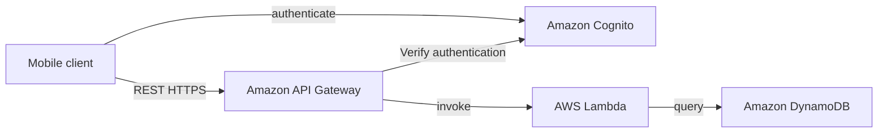

**Luồng:**

1. ⭐⭐⭐ **Mobile client XÁC THỰC với Amazon Cognito** → nhận **token**
2. ⭐⭐⭐ **Client gọi REST HTTPS tới API Gateway kèm token**
3. ⭐⭐⭐ **API Gateway VERIFY AUTHENTICATION với Cognito**
4. ⭐⭐⭐ **API Gateway INVOKE Lambda**
5. ⭐⭐⭐ **Lambda QUERY DynamoDB**

> ⭐⭐⭐ **Đây là "xương sống" của mọi kiến trúc serverless API.** Ghi nhớ đúng thứ tự 5 bước này.

---

### ⭐⭐⭐ Bước 2 — Mobile app: giving users access to S3

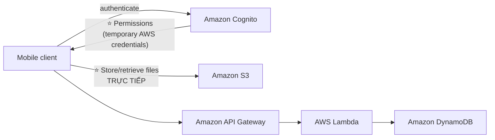

> ⭐⭐⭐ **ĐÂY LÀ ĐIỂM QUAN TRỌNG NHẤT CỦA BÀI 227.**
>
> **Cognito (Identity Pools) cấp TEMPORARY AWS CREDENTIALS cho user**, nhờ đó **client truy cập THẲNG S3 mà KHÔNG đi qua API Gateway/Lambda**.
>
> **Lợi ích:** upload/download file **không tốn tiền Lambda**, **không bị giới hạn 15 phút**, **không bị giới hạn payload của API Gateway (10 MB)**.
>
> ⚠️ **Đây là câu hỏi thi cực kỳ phổ biến:** *"Mobile app cần upload file lớn lên S3, kiến trúc nào tối ưu?"* → **Cognito Identity Pools cấp credentials tạm → client upload trực tiếp vào S3**.
> ❌ **Đáp án SAI:** "Upload qua API Gateway rồi Lambda ghi vào S3" — tốn kém và vướng giới hạn payload.

**⭐⭐⭐ Làm sao mỗi user chỉ vào được thư mục của riêng mình?** → **IAM policy trong Cognito dùng biến `${cognito-identity.amazonaws.com:sub}`** để giới hạn prefix S3 theo `user_id` (đây chính là **row/prefix level security** đã học ở bài 226).

---

### ⭐⭐⭐ Bước 3 — Mobile app: high read throughput, static data

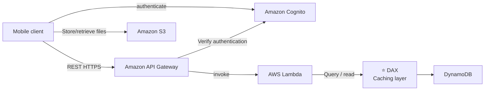

> ⭐⭐⭐ **Yêu cầu "mostly read" + "high read throughput" → DAX.**
>
> Nhắc lại từ bài 222: **DAX cache kết quả đọc của DynamoDB, độ trễ MICROSECONDS, KHÔNG cần sửa code ứng dụng, TTL mặc định 5 phút.**

---

### ⭐⭐⭐ Bước 4 — Mobile app: caching at the API Gateway

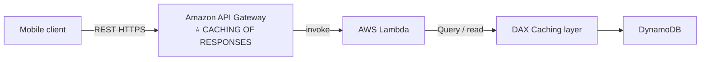

> ⭐⭐⭐ **Có HAI TẦNG CACHE trong kiến trúc này — đây là điểm dễ nhầm:**
>
> | Tầng | Cache cái gì | Tiết kiệm gì |
> |---|---|---|
> | ⭐⭐⭐ **API Gateway Caching** | **TOÀN BỘ HTTP RESPONSE** | **Không phải gọi Lambda** → tiết kiệm tiền Lambda + giảm latency nhiều nhất |
> | ⭐⭐⭐ **DAX** | **Kết quả đọc DynamoDB** | **Không phải đọc DynamoDB** → tiết kiệm RCU |
>
> **Thứ tự hiệu quả:** request bị chặn ở **API Gateway cache** thì **không đi tiếp đâu cả** — đây là tầng cache "cao" nhất, rẻ nhất.

---

### ⭐⭐⭐ In this lecture — Tổng kết bài 227

| # | Điểm chốt |
|---|---|
| 1 | ⭐⭐⭐ **Serverless REST API: HTTPS, API Gateway, Lambda, DynamoDB** |
| 2 | ⭐⭐⭐ **Dùng Cognito để SINH TEMPORARY CREDENTIALS truy cập S3 bucket với RESTRICTED POLICY. App users có thể truy cập TRỰC TIẾP tài nguyên AWS theo cách này. Pattern này áp dụng được cho DynamoDB, Lambda…** |
| 3 | ⭐⭐⭐ **Cache các thao tác ĐỌC trên DynamoDB bằng DAX** |
| 4 | ⭐⭐⭐ **Cache các REST request ở MỨC API GATEWAY** |
| 5 | ⭐⭐⭐ **Bảo mật cho authentication và authorization với Cognito** |

---

## 228. Serverless Website: MyBlog.com

### ⭐⭐⭐ Yêu cầu đề bài

| # | Yêu cầu | ⭐ Dịch vụ tương ứng |
|---|---|---|
| 1 | ⭐⭐⭐ **Website này phải SCALE TOÀN CẦU** | **CloudFront + DynamoDB Global Tables** |
| 2 | ⭐⭐⭐ **Blog HIẾM KHI được viết, nhưng ĐƯỢC ĐỌC RẤT NHIỀU** | **CloudFront + DAX (cache mạnh)** |
| 3 | ⭐⭐⭐ **Một phần website là FILE TĨNH THUẦN TÚY, phần còn lại là DYNAMIC REST API** | **S3 (tĩnh) + API Gateway/Lambda (động)** |
| 4 | ⭐⭐⭐ **Phải triển khai CACHING ở mọi nơi có thể** | **CloudFront + API Gateway Cache + DAX** |
| 5 | ⭐⭐⭐ **User mới đăng ký phải nhận EMAIL CHÀO MỪNG** | **DynamoDB Streams + Lambda + SES** |
| 6 | ⭐⭐⭐ **Ảnh upload lên blog phải được TẠO THUMBNAIL** | **S3 Event + Lambda** |

---

### ⭐⭐ Bước 1 — Serving static content, globally

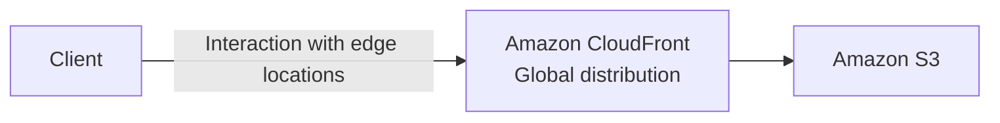

⭐⭐⭐ **Yêu cầu "scale globally" + "static files" → CloudFront + S3.**

---

### ⭐⭐⭐ Bước 2 — Serving static content, globally, SECURELY

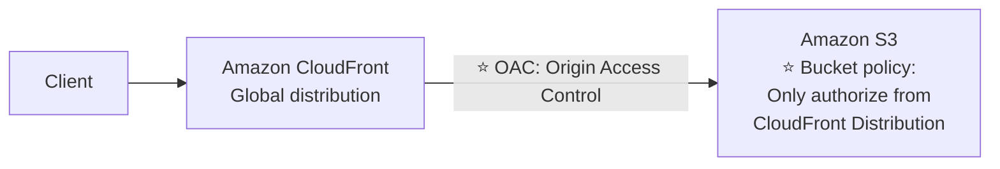

> ⭐⭐⭐ **OAC (Origin Access Control)** — đã học ở chương 15. **Bucket policy CHỈ cho phép truy cập TỪ CloudFront Distribution**, chặn mọi truy cập trực tiếp vào S3.
>
> ⚠️ **Đề thi hay hỏi:** *"Làm sao đảm bảo user chỉ truy cập được qua CloudFront, không vào thẳng S3?"* → **OAC + Bucket Policy**.

---

### ⭐⭐⭐ Bước 3 — Adding a public serverless REST API

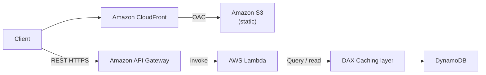

> ⭐⭐⭐ **ĐIỂM KHÁC BIỆT QUAN TRỌNG SO VỚI BÀI 227: KHÔNG CÓ COGNITO!**
>
> Vì đây là **PUBLIC REST API** — ai cũng đọc blog được, **không cần đăng nhập**. Slide tổng kết ghi rõ: *"The REST API was serverless, **didn't need Cognito because public**"*.
>
> ⭐⭐⭐ **Đây là bẫy thi:** đừng thấy "serverless API" là tự động chọn Cognito. **Chỉ thêm Cognito khi đề nói cần XÁC THỰC NGƯỜI DÙNG.**

---

### ⭐⭐⭐ Bước 4 — Leveraging DynamoDB Global Tables

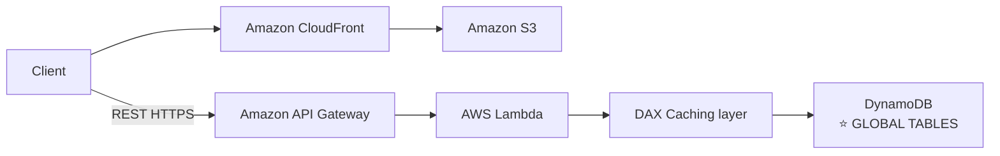

> ⭐⭐⭐ **Yêu cầu "scale globally" áp dụng cho CẢ DATABASE, không chỉ static content.**
>
> **DynamoDB Global Tables** = **Active-Active replication**, user ở mọi region đều **đọc và ghi** với độ trễ thấp. Nhớ: ⚠️ **bắt buộc bật DynamoDB Streams trước**.
>
> ⭐⭐⭐ **Slide tổng kết có một câu rất đáng chú ý:** *"(we could have used **Aurora Global Database**)"* — nếu bài toán cần **SQL/relational**, thì **Aurora Global Database** là lựa chọn tương đương.
>
> ⚠️ **Nhưng nhớ khác biệt:** **DynamoDB Global Tables = Active-Active (ghi được ở mọi region)**; **Aurora Global Database = chỉ MỘT region ghi được**, các region khác chỉ đọc.

---

### ⭐⭐⭐ Bước 5 — User Welcome email flow

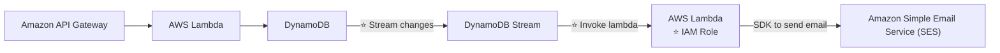

**Luồng chi tiết:** ⭐⭐⭐

1. **User đăng ký** → Lambda ghi user mới vào **DynamoDB**
2. ⭐⭐⭐ **DynamoDB Streams ghi nhận thay đổi (INSERT)**
3. ⭐⭐⭐ **Stream INVOKE một Lambda function khác**
4. ⭐⭐⭐ **Lambda đó có IAM ROLE cho phép dùng SES**
5. ⭐⭐⭐ **Lambda dùng SDK gửi email chào mừng qua Amazon SES**

> ⭐⭐⭐ **Đây là câu hỏi thi rất phổ biến.** Từ khóa: *"gửi email khi có user mới đăng ký"*, *"phản ứng với thay đổi dữ liệu"* → **DynamoDB Streams → Lambda → SES**.
>
> ⭐⭐ **Amazon SES (Simple Email Service)** là dịch vụ gửi email **serverless** của AWS. Đây là lần đầu khóa học nhắc tới nó — nhớ tên và vai trò: **gửi email**.
>
> 💡 **Phân biệt nhanh:** **SES = gửi EMAIL cho người dùng cuối** (marketing, transactional). **SNS = gửi NOTIFICATION** (email/SMS/HTTP) cho **hệ thống và quản trị viên**.

---

### ⭐⭐⭐ Bước 6 — Thumbnail Generation flow

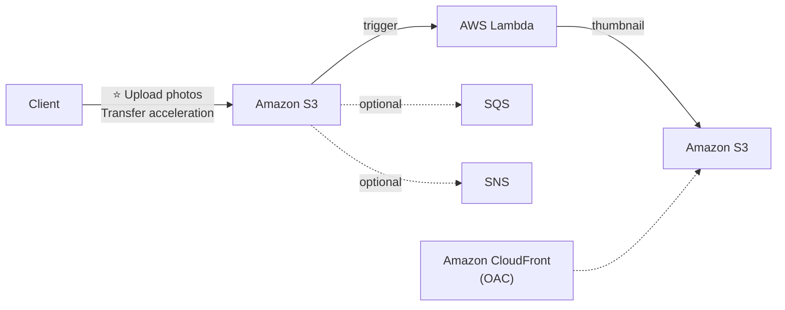

**Luồng:** ⭐⭐⭐

1. ⭐⭐⭐ **Client upload ảnh lên S3, dùng S3 TRANSFER ACCELERATION** (tăng tốc upload từ xa qua edge location)
2. ⭐⭐⭐ **S3 Event TRIGGER Lambda**
3. ⭐⭐⭐ **Lambda tạo THUMBNAIL và ghi vào S3**
4. ⭐⭐ **(Tùy chọn) S3 cũng có thể trigger SQS / SNS**
5. ⭐⭐ **CloudFront phân phối thumbnail qua OAC**

> ⭐⭐⭐ **Nhắc lại từ chương 12: S3 Transfer Acceleration** dùng khi **upload file từ xa qua khoảng cách địa lý lớn** — đi qua **CloudFront Edge Location** rồi mới vào bucket.
>
> ⭐⭐⭐ **Và nhớ: S3 có thể trigger SQS / SNS / Lambda** — ba đích của S3 Event Notifications.

---

### ⭐⭐⭐ AWS Hosted Website Summary — Tổng kết bài 228

| # | Điểm chốt |
|---|---|
| 1 | ⭐⭐⭐ **Static content được phân phối bằng CLOUDFRONT + S3** |
| 2 | ⭐⭐⭐ **REST API là serverless, KHÔNG CẦN COGNITO vì nó PUBLIC** |
| 3 | ⭐⭐⭐ **Dùng GLOBAL DYNAMODB TABLE để phục vụ dữ liệu toàn cầu** ⭐⭐ **(cũng có thể dùng AURORA GLOBAL DATABASE)** |
| 4 | ⭐⭐⭐ **Bật DYNAMODB STREAMS để trigger một Lambda function** |
| 5 | ⭐⭐⭐ **Lambda function có IAM ROLE cho phép dùng SES** |
| 6 | ⭐⭐⭐ **SES (Simple Email Service) được dùng để gửi email theo cách SERVERLESS** |
| 7 | ⭐⭐⭐ **S3 có thể trigger SQS / SNS / LAMBDA để thông báo sự kiện** |

---

## 229. MicroServices Architecture

### ⭐⭐ Micro Services architecture — Bối cảnh

- ⭐⭐ **Ta muốn chuyển sang kiến trúc micro service**
- ⭐⭐ **Nhiều service tương tác TRỰC TIẾP với nhau qua REST API**
- ⭐⭐⭐ **Kiến trúc của MỖI micro service CÓ THỂ KHÁC NHAU về hình thức và quy mô**
- ⭐⭐⭐ **Ta muốn micro-service architecture để có VÒNG ĐỜI PHÁT TRIỂN GỌN GÀNG HƠN (leaner development lifecycle) cho từng service**

---

### ⭐⭐⭐ Micro Services Environment

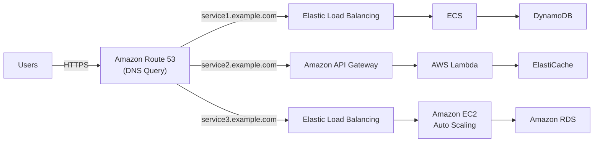

> ⭐⭐⭐ **THÔNG ĐIỆP QUAN TRỌNG NHẤT CỦA SLIDE NÀY:** mỗi microservice dùng **một kiến trúc HOÀN TOÀN KHÁC NHAU**:
>
> | Service | Kiến trúc |
> |---|---|
> | **service1** | **ELB → ECS → DynamoDB** (container) |
> | **service2** | **API Gateway → Lambda → ElastiCache** (serverless) |
> | **service3** | **ELB → EC2 Auto Scaling → RDS** (truyền thống) |
>
> ⭐⭐⭐ **Điểm chung: Route 53 định tuyến theo SUBDOMAIN** (`service1.example.com`, `service2.example.com`…).
>
> ⭐⭐⭐ **Bài học:** *"You are free to design each micro-service the way you want"* — **không có kiến trúc microservice "đúng" duy nhất**.

---

### ⭐⭐⭐ Discussions on Micro Services

**⭐⭐⭐ Hai nhóm pattern giao tiếp:**

| Pattern | Dịch vụ |
|---|---|
| ⭐⭐⭐ **Synchronous patterns** | **API Gateway, Load Balancers** |
| ⭐⭐⭐ **Asynchronous patterns** | **SQS, Kinesis, SNS, Lambda triggers (S3)** |

> ⭐⭐⭐ **Nhắc lại từ chương 17:** synchronous dễ vỡ khi có spike; asynchronous thì decouple được. **Đề thi thích tình huống chuyển từ sync sang async.**

**⚠️⭐⭐⭐ Challenges (thách thức) với micro-services:**

| Thách thức |
|---|
| ⭐⭐ **Overhead LẶP LẠI khi tạo mỗi microservice mới** |
| ⭐⭐ **Vấn đề tối ưu MẬT ĐỘ/HIỆU SUẤT SỬ DỤNG SERVER** (server density/utilization) |
| ⭐⭐ **Độ phức tạp khi chạy NHIỀU PHIÊN BẢN của NHIỀU microservice CÙNG LÚC** |
| ⭐⭐ **Sự bùng nổ yêu cầu về CODE PHÍA CLIENT để tích hợp với nhiều service riêng lẻ** |

**⭐⭐⭐ Một số thách thức được GIẢI QUYẾT bằng Serverless patterns:**

| Giải pháp |
|---|
| ⭐⭐⭐ **API Gateway, Lambda TỰ ĐỘNG SCALE và bạn TRẢ THEO LƯỢNG DÙNG** |
| ⭐⭐⭐ **Bạn có thể DỄ DÀNG CLONE API, TÁI TẠO MÔI TRƯỜNG** |
| ⭐⭐⭐ **SINH CLIENT SDK qua tích hợp SWAGGER cho API Gateway** |

> ⭐⭐⭐ **Ba dòng trên ánh xạ 1-1 với ba thách thức:**
> - **"overhead tạo service mới"** + **"server density"** → **API Gateway/Lambda tự scale, trả theo dùng**
> - **"nhiều phiên bản cùng lúc"** → **clone API, tái tạo môi trường** (Stages!)
> - **"code phía client phức tạp"** → **generated client SDK qua Swagger**
>
> Đây là kiểu câu hỏi *"lợi ích của serverless trong kiến trúc microservices là gì?"*.

---

## 230. Software updates distribution

### ⭐⭐⭐ Software updates offloading — Đề bài

- ⭐⭐ **Ta có một ứng dụng chạy trên EC2, thỉnh thoảng phân phối các bản cập nhật phần mềm**
- ⚠️⭐⭐⭐ **Khi có bản cập nhật mới, ta nhận RẤT NHIỀU REQUEST và nội dung được phân phối Ồ ẠT qua mạng. RẤT TỐN KÉM**
- ⭐⭐⭐ **Ta KHÔNG MUỐN THAY ĐỔI ỨNG DỤNG, nhưng muốn TỐI ƯU CHI PHÍ và CPU. Làm thế nào?**

> ⭐⭐⭐ **Cụm từ "We don't want to change our application" là chìa khóa.** Nó loại bỏ mọi đáp án kiểu "viết lại bằng Lambda", "chuyển sang S3 static hosting".

---

### Our application current state

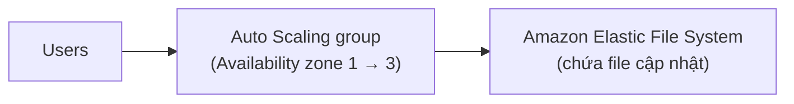

⚠️ **Mỗi lần có bản update, TẤT CẢ request đều đập vào EC2 và đọc từ EFS** → CPU cao, băng thông tốn, ASG phải scale out nhiều.

---

### ⭐⭐⭐ Easy way to fix things!

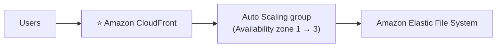

⭐⭐⭐ **Chỉ cần ĐẶT CLOUDFRONT LÊN PHÍA TRƯỚC. Xong.**

---

### ⭐⭐⭐ Why CloudFront? — Sáu lý do (RA THI)

| # | Lý do |
|---|---|
| 1 | ⭐⭐⭐ **KHÔNG THAY ĐỔI GÌ VỀ KIẾN TRÚC (No changes to architecture)** |
| 2 | ⭐⭐⭐ **Sẽ CACHE file cập nhật phần mềm TẠI EDGE** |
| 3 | ⭐⭐⭐ **File cập nhật KHÔNG PHẢI DỮ LIỆU ĐỘNG — chúng là TĨNH (never changing)** |
| 4 | ⭐⭐⭐ **EC2 instances của ta KHÔNG PHẢI serverless… NHƯNG CLOUDFRONT THÌ CÓ, và nó sẽ SCALE THAY CHO TA** |
| 5 | ⭐⭐⭐ **ASG sẽ KHÔNG PHẢI SCALE NHIỀU NỮA, và ta TIẾT KIỆM CỰC LỚN tiền EC2** |
| 6 | ⭐⭐⭐ **Ta cũng TIẾT KIỆM về AVAILABILITY, chi phí NETWORK BANDWIDTH, v.v.** |

> ⭐⭐⭐ **Câu chốt của Stéphane:** *"Easy way to make an EXISTING application more SCALABLE and CHEAPER!"*
>
> ⭐⭐⭐ **Đây là bài NGẮN NHẤT chương (2 phút) nhưng ra thi RẤT NHIỀU.** Mẫu câu hỏi:
> - *"Ứng dụng legacy trên EC2 tốn nhiều băng thông khi phát hành nội dung tĩnh, làm sao giảm chi phí mà không sửa code?"* → **Đặt CloudFront phía trước**
> - *"ASG phải scale out ồ ạt mỗi lần có traffic spike đọc file tĩnh"* → **CloudFront**
>
> 💡 **Nguyên lý tổng quát cần nhớ:** **CloudFront có thể đặt trước BẤT KỲ origin nào** — S3, ALB, EC2, thậm chí server on-premises — và **luôn là cách rẻ nhất, ít xâm lấn nhất** để giảm tải nội dung tĩnh.

---

## 🧭 Tổng kết 4 kiến trúc của chương

| Bài | Kiến trúc | Bộ dịch vụ chốt |
|---|---|---|
| **227** | **Mobile app có xác thực** | **Cognito + API Gateway + Lambda + DynamoDB + DAX + S3** |
| **228** | **Website blog toàn cầu** | **CloudFront + S3 (OAC) + API Gateway + Lambda + DAX + DynamoDB Global Tables + Streams + SES** |
| **229** | **Microservices** | **Route 53 + (ELB/ECS, API Gateway/Lambda, ELB/EC2/RDS)** |
| **230** | **Giảm tải phân phối file tĩnh** | **CloudFront đặt trước ALB/EC2** |

### 📌 Cheat Sheet: Yêu cầu → Dịch vụ ⭐⭐⭐

| Yêu cầu trong đề | Đáp án |
|---|---|
| *"REST API, HTTPS, serverless"* | **API Gateway + Lambda** |
| *"Người dùng mobile đăng nhập"* | **Cognito User Pools** |
| *"Mobile app truy cập TRỰC TIẾP S3/DynamoDB"* | **Cognito Identity Pools** (temporary AWS credentials) |
| *"Mỗi user chỉ vào thư mục của riêng mình trong S3"* | **IAM policy với biến `${cognito-identity.amazonaws.com:sub}`** |
| *"API công khai, không cần đăng nhập"* | ⭐ **KHÔNG dùng Cognito** |
| *"Đọc nhiều, cần read throughput cao trên DynamoDB"* | **DAX** |
| *"Giảm số lần gọi Lambda cho request lặp lại"* | **API Gateway Caching** |
| *"Phân phối static content toàn cầu"* | **CloudFront + S3** |
| *"Chỉ cho truy cập S3 qua CloudFront"* | **OAC + Bucket Policy** |
| *"Database phải đọc/ghi được ở nhiều region"* | **DynamoDB Global Tables** (Active-Active) |
| *"Cần SQL thay vì NoSQL, vẫn toàn cầu"* | **Aurora Global Database** (chỉ 1 region ghi) |
| *"Gửi email chào mừng khi user đăng ký"* | **DynamoDB Streams → Lambda → SES** |
| *"Gửi email serverless"* | **Amazon SES** |
| *"Tạo thumbnail khi upload ảnh"* | **S3 Event → Lambda** |
| *"Upload file từ xa cho nhanh"* | **S3 Transfer Acceleration** |
| *"S3 báo sự kiện cho hệ thống khác"* | **S3 → SQS / SNS / Lambda** |
| *"Định tuyến nhiều microservice theo subdomain"* | **Route 53** |
| *"Giao tiếp đồng bộ giữa microservices"* | **API Gateway, Load Balancers** |
| *"Giao tiếp bất đồng bộ giữa microservices"* | **SQS, Kinesis, SNS, Lambda triggers (S3)** |
| *"Sinh client SDK cho API"* | **API Gateway + Swagger integration** |
| *"Giảm chi phí băng thông EC2, KHÔNG sửa code"* | ⭐⭐⭐ **Đặt CloudFront phía trước** |

---

## Trắc nghiệm 17: Serverless Solutions Architecture Discussions Quiz

### Các điểm dễ bị bẫy

| Câu hỏi thường gặp | Đáp án đúng | Vì sao đáp án khác sai |
|---|---|---|
| Mobile app cần upload file lớn lên S3, kiến trúc nào? | ⭐⭐⭐ **Cognito Identity Pools cấp credentials tạm → client upload TRỰC TIẾP vào S3** | ❌ Qua API Gateway + Lambda: tốn tiền, vướng giới hạn payload |
| Cognito User Pools trả về gì? | **Token (JWT)** | Identity Pools mới trả **AWS credentials** |
| Mỗi user chỉ truy cập thư mục riêng trong S3? | **IAM policy trong Cognito theo `user_id`** | |
| API Gateway xác thực bằng gì trong kiến trúc mobile? | **Cognito** | IAM Roles dành cho internal apps |
| App đọc nhiều hơn ghi trên DynamoDB, làm gì? | ⭐⭐⭐ **DAX** | ElastiCache dùng để cache **aggregation result** |
| Giảm số lần gọi Lambda cho request giống nhau? | ⭐⭐⭐ **API Gateway Caching** | DAX chỉ giảm số lần đọc DynamoDB, **Lambda vẫn bị gọi** |
| Kiến trúc MyBlog.com có dùng Cognito không? | ❌ **KHÔNG — vì REST API là PUBLIC** | Slide ghi rõ "didn't need Cognito because public" |
| Website blog cần scale toàn cầu, dùng gì cho database? | ⭐⭐⭐ **DynamoDB Global Tables** | |
| Global Tables cần bật gì trước? | ⚠️ **DynamoDB Streams** | |
| Nếu cần SQL thay vì NoSQL nhưng vẫn toàn cầu? | **Aurora Global Database** | ⚠️ Nhưng Aurora chỉ có **1 region ghi được** |
| Gửi email chào mừng khi có user mới? | ⭐⭐⭐ **DynamoDB Streams → Lambda → SES** | |
| Lambda gửi email được nhờ đâu? | ⭐⭐⭐ **IAM Role cho phép dùng SES** | |
| SES là gì? | ⭐⭐⭐ **Simple Email Service — gửi email serverless** | SNS gửi **notification**, không phải email marketing |
| Tạo thumbnail khi upload ảnh? | ⭐⭐⭐ **S3 Event → trigger Lambda → ghi thumbnail vào S3** | |
| S3 có thể trigger những gì? | ⭐⭐⭐ **SQS / SNS / Lambda** | |
| Tăng tốc upload ảnh từ xa? | ⭐⭐⭐ **S3 Transfer Acceleration** | |
| Chỉ cho phép truy cập S3 qua CloudFront? | ⭐⭐⭐ **OAC + Bucket Policy** | |
| Microservices: mỗi service phải cùng kiến trúc? | ❌ **KHÔNG — tự do thiết kế mỗi service** | |
| Định tuyến `service1.example.com`, `service2…`? | **Route 53** | |
| Pattern đồng bộ giữa microservices? | **API Gateway, Load Balancers** | |
| Pattern bất đồng bộ giữa microservices? | **SQS, Kinesis, SNS, Lambda triggers (S3)** | |
| Thách thức của microservices? | **Overhead tạo service mới, server density, nhiều version cùng lúc, code client phức tạp** | |
| Serverless giải quyết thách thức nào? | **Tự scale + trả theo dùng, clone API dễ, sinh client SDK qua Swagger** | |
| App EC2 tốn băng thông phát hành file update, KHÔNG sửa code? | ⭐⭐⭐ **Đặt CloudFront phía trước** | ❌ "Viết lại bằng Lambda" vi phạm yêu cầu "không sửa code" |
| Vì sao CloudFront giải quyết được? | ⭐⭐⭐ **File update là TĨNH → cache được ở edge; CloudFront serverless và tự scale** | |
| Lợi ích cụ thể của CloudFront trong bài 230? | **ASG không phải scale nhiều, tiết kiệm EC2, băng thông, tăng availability** | |
| CloudFront đặt trước được những origin nào? | ⭐⭐ **S3, ALB, EC2, cả server on-premises** | |

---

### Checklist tự kiểm tra trước khi làm quiz

**Bài 227 — MyTodoList:**
- [ ] Thuộc luồng 5 bước: **Client → Cognito (auth) → API Gateway (verify) → Lambda (invoke) → DynamoDB (query)**
- [ ] ⭐ Hiểu vì sao **Cognito Identity Pools cho phép client truy cập TRỰC TIẾP S3** và lợi ích của việc đó
- [ ] Phân biệt **hai tầng cache: API Gateway Caching (cache response) vs DAX (cache đọc DynamoDB)**
- [ ] Nhớ pattern "temporary credentials" **áp dụng được cho cả DynamoDB, Lambda**, không chỉ S3

**Bài 228 — MyBlog.com:**
- [ ] Nhớ **CloudFront + S3 + OAC** cho static content
- [ ] ⭐ Nhớ **KHÔNG dùng Cognito vì API là public**
- [ ] Nhớ **DynamoDB Global Tables** (và biết **Aurora Global Database** là lựa chọn SQL tương đương)
- [ ] Thuộc luồng **DynamoDB Streams → Lambda (có IAM Role) → SES** để gửi email
- [ ] Thuộc luồng **S3 upload (Transfer Acceleration) → trigger Lambda → thumbnail**
- [ ] Nhớ **S3 trigger được SQS / SNS / Lambda**

**Bài 229 — Microservices:**
- [ ] Nhớ **mỗi microservice tự do dùng kiến trúc riêng**, Route 53 định tuyến theo subdomain
- [ ] Thuộc **2 nhóm pattern: sync (API Gateway, ELB) vs async (SQS, Kinesis, SNS, Lambda triggers)**
- [ ] Thuộc **4 thách thức** và **3 cách serverless giải quyết**

**Bài 230 — Software updates:**
- [ ] Nhớ câu chốt: **CloudFront phía trước = giảm chi phí + tăng scale mà KHÔNG sửa kiến trúc**
- [ ] Hiểu vì sao được: **file update là static, CloudFront serverless và tự scale thay EC2**

---

## Thuật ngữ Anh — Việt

| Tiếng Anh | Tiếng Việt |
|---|---|
| Solution Architecture Discussion | Thảo luận kiến trúc giải pháp |
| Mobile application | Ứng dụng di động |
| Expose as REST API | Cung cấp dưới dạng REST API |
| Serverless architecture | Kiến trúc không cần quản lý máy chủ |
| Managed serverless service | Dịch vụ được quản lý, không cần server |
| Read throughput | Thông lượng đọc |
| Scale | Mở rộng quy mô |
| Verify authentication | Xác minh danh tính |
| Invoke | Gọi thực thi |
| Query | Truy vấn |
| Temporary credentials | Thông tin đăng nhập tạm thời |
| Restricted policy | Chính sách giới hạn quyền |
| Directly access AWS resources | Truy cập thẳng tài nguyên AWS |
| Caching layer | Tầng bộ nhớ đệm |
| Caching of responses | Lưu đệm phản hồi |
| DAX (DynamoDB Accelerator) | Bộ đệm trong RAM cho DynamoDB |
| Authentication / Authorization | Xác thực / phân quyền |
| Scale globally | Mở rộng trên phạm vi toàn cầu |
| Static files | Tệp tĩnh (không đổi) |
| Dynamic REST API | API động |
| Global distribution | Phân phối toàn cầu |
| Edge locations | Các điểm hiện diện biên |
| Origin Access Control (OAC) | Cơ chế chỉ cho CloudFront truy cập origin |
| Bucket policy | Chính sách truy cập bucket S3 |
| Global Tables | Bảng DynamoDB nhân bản đa vùng |
| Active-Active replication | Nhân bản hai chiều, cả hai đều ghi được |
| Aurora Global Database | CSDL Aurora nhân bản đa vùng (1 nơi ghi) |
| Stream changes | Luồng ghi nhận thay đổi dữ liệu |
| DynamoDB Stream | Luồng thay đổi của DynamoDB |
| IAM Role | Vai trò cấp quyền cho dịch vụ |
| SDK to send email | Bộ thư viện để gửi email |
| Amazon Simple Email Service (SES) | Dịch vụ gửi email của AWS |
| Welcome email flow | Luồng gửi email chào mừng |
| Thumbnail | Ảnh thu nhỏ |
| Thumbnail Generation flow | Luồng tạo ảnh thu nhỏ |
| Transfer acceleration | Tăng tốc truyền tải qua edge |
| Trigger | Kích hoạt |
| Micro Services architecture | Kiến trúc vi dịch vụ |
| Leaner development lifecycle | Vòng đời phát triển gọn nhẹ hơn |
| DNS Query | Truy vấn phân giải tên miền |
| Subdomain | Tên miền phụ |
| Elastic Load Balancing (ELB) | Cân bằng tải đàn hồi |
| Synchronous patterns | Mẫu giao tiếp đồng bộ |
| Asynchronous patterns | Mẫu giao tiếp bất đồng bộ |
| Repeated overhead | Chi phí lặp lại mỗi lần làm mới |
| Server density / utilization | Mật độ / hiệu suất sử dụng máy chủ |
| Proliferation | Sự bùng nổ, sinh sôi |
| Client-side code | Mã phía client |
| Clone API | Nhân bản API |
| Reproduce environments | Tái tạo môi trường |
| Client SDK | Bộ thư viện cho client |
| Swagger integration | Tích hợp chuẩn mô tả API |
| Software updates distribution | Phân phối bản cập nhật phần mềm |
| Offloading | Giảm tải cho hệ thống gốc |
| Distributed in mass | Phân phối ồ ạt |
| Costly | Tốn kém |
| Optimize cost and CPU | Tối ưu chi phí và CPU |
| Cache at the edge | Lưu đệm tại điểm biên |
| Never changing | Không bao giờ thay đổi (tĩnh) |
| Network bandwidth cost | Chi phí băng thông mạng |
| Availability | Tính sẵn sàng |
| Existing application | Ứng dụng sẵn có |

---

*Ghi chú: chương này **KHÔNG có bài Hands On nào** và **không có code kèm theo** — cả bốn bài đều là thảo luận kiến trúc trên slide, nên nội dung file bám sát 100% slide gốc (trang 491–512). Các mục tôi bổ sung ngoài slide đều nhỏ và có đánh dấu: biến IAM `${cognito-identity.amazonaws.com:sub}` cho prefix-level security trong S3 (bài 227), phân biệt **SES gửi email cho người dùng cuối** vs **SNS gửi notification cho hệ thống** (bài 228), và ghi chú **DynamoDB Global Tables là Active-Active còn Aurora Global Database chỉ có một region ghi được** (bài 228). 💡 **CHI PHÍ: chương này KHÔNG phát sinh chi phí nào** vì không có thực hành. ⭐ **Lời khuyên ôn thi:** đây là chương **sát đề thi nhất** trong toàn khóa — SAA-C03 chủ yếu hỏi dạng "cho yêu cầu, chọn kiến trúc". Hãy học kỹ hai bảng **"Yêu cầu → Dịch vụ"** ở đầu bài 227, 228 và **Cheat Sheet tổng kết** ở cuối chương; riêng **bài 230 chỉ dài 2 phút nhưng tỉ lệ ra thi rất cao** vì mẫu câu hỏi "giảm chi phí mà không sửa kiến trúc" xuất hiện liên tục.*
