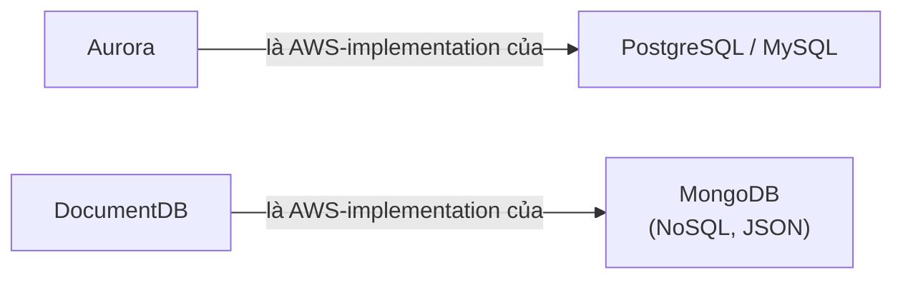
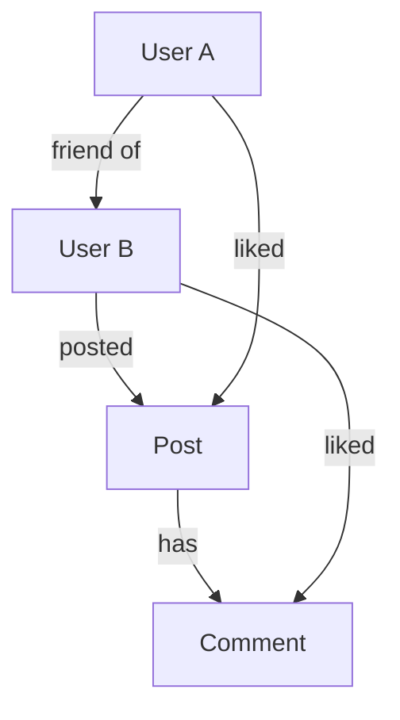
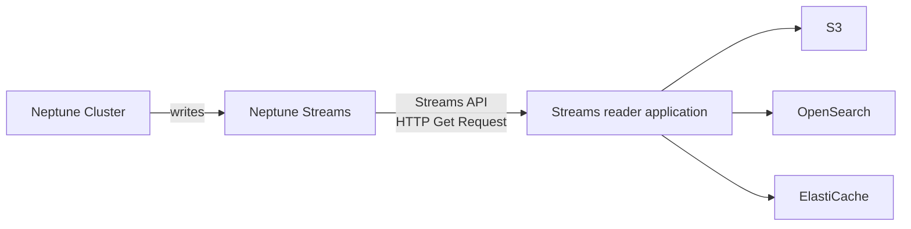
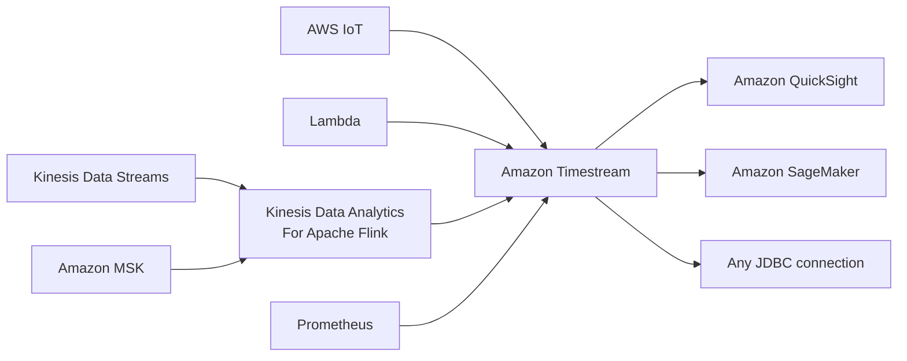

# Phần 21 — Databases in AWS

> Khóa học: *Ultimate AWS Certified Solutions Architect Associate 2026* (Stéphane Maarek) — SAA-C03
> Nguồn tham chiếu: `AWS Certified Solutions Architect Slides v48.pdf` (phần "Databases in AWS")

---

## Mục lục

| # | Bài giảng | Thời lượng | Loại |
|---|-----------|-----------|------|
| 231 | [Choosing the right database](#231-choosing-the-right-database) | 3 phút | Video |
| 232 | [RDS](#232-rds) | 3 phút | Video |
| 233 | [Aurora](#233-aurora) | 3 phút | Video |
| 234 | [ElastiCache](#234-elasticache) | 2 phút | Video |
| 235 | [DynamoDB](#235-dynamodb) | 4 phút | Video |
| 236 | [S3](#236-s3) | 3 phút | Video |
| 237 | [DocumentDB](#237-documentdb) | 1 phút | Video |
| 238 | [Neptune](#238-neptune) | 3 phút | Video |
| 239 | [Keyspaces (for Apache Cassandra)](#239-keyspaces-for-apache-cassandra) | 1 phút | Video |
| 240 | [Timestream](#240-timestream) | 2 phút | Video |
| — | [Trắc nghiệm 18: Databases in AWS Quiz](#trắc-nghiệm-18-databases-in-aws-quiz) | — | Quiz |

---

> 📌 **Đọc trước khi vào chương:** Đây là chương **ÔN TẬP VÀ TỔNG KẾT**. Các bài 232–236 (RDS, Aurora, ElastiCache, DynamoDB, S3) là **slide "Summary"** tóm tắt lại những gì đã học ở chương 9, 12–14, 19. **Kiến thức MỚI hoàn toàn chỉ nằm ở 4 bài cuối: DocumentDB, Neptune, Keyspaces, Timestream.**
>
> ⭐⭐⭐ **Cách học hiệu quả:** đọc lướt bài 232–236 để **chốt lại** những gì đã biết; **học kỹ bài 237–240** vì đây là **4 dịch vụ mới, mỗi cái chỉ cần nhớ MỘT câu định vị** nhưng ra thi khá đều.

---

## 231. Choosing the right database

### ⭐⭐⭐ Choosing the Right Database — 7 câu hỏi cần đặt ra

- ⭐⭐ **Ta có RẤT NHIỀU managed database trên AWS để chọn**
- ⭐⭐⭐ **Các câu hỏi để chọn đúng database dựa trên kiến trúc của bạn:**

| # | Câu hỏi |
|---|---|
| 1 | ⭐⭐⭐ **Workload READ-HEAVY, WRITE-HEAVY, hay CÂN BẰNG?** Nhu cầu **throughput**? Có **thay đổi** không, có cần **scale hoặc dao động trong ngày** không? |
| 2 | ⭐⭐⭐ **Lưu BAO NHIÊU dữ liệu và TRONG BAO LÂU?** Có **tăng trưởng** không? **Kích thước object trung bình**? Chúng được **truy cập thế nào**? |
| 3 | ⭐⭐⭐ **Độ BỀN của dữ liệu (durability)?** Đâu là **nguồn chân lý (source of truth)** cho dữ liệu? |
| 4 | ⭐⭐⭐ **Yêu cầu về ĐỘ TRỄ (latency)?** Số **người dùng đồng thời**? |
| 5 | ⭐⭐⭐ **MÔ HÌNH DỮ LIỆU?** Bạn sẽ **query thế nào**? Có **JOIN** không? **Structured** hay **Semi-Structured**? |
| 6 | ⭐⭐⭐ **Schema CHẶT CHẼ hay cần LINH HOẠT hơn?** Cần **Reporting**? **Search**? **RDBMS hay NoSQL**? |
| 7 | ⭐⭐⭐ **Chi phí LICENSE?** Có nên chuyển sang **Cloud Native DB như Aurora** không? |

> ⭐⭐⭐ **Ba câu hỏi ra thi nhiều nhất:** **"Có JOIN không?"** (có → RDBMS), **"Schema chặt hay linh hoạt?"** (linh hoạt → NoSQL), **"Latency yêu cầu bao nhiêu?"** (sub-millisecond → ElastiCache/DAX).

---

### ⭐⭐⭐ Database Types — BẢNG ĐINH CỦA CẢ CHƯƠNG

| Loại | Dịch vụ | Ghi chú |
|---|---|---|
| ⭐⭐⭐ **RDBMS (= SQL / OLTP)** | **RDS, Aurora** | ⭐⭐⭐ **RẤT TỐT CHO JOINS** |
| ⭐⭐⭐ **NoSQL database** (**KHÔNG join, KHÔNG SQL**) | **DynamoDB (~JSON)** **ElastiCache (key/value pairs)** **Neptune (graphs)** **DocumentDB (for MongoDB)** **Keyspaces (for Apache Cassandra)** | |
| ⭐⭐⭐ **Object Store** | **S3** (cho **object LỚN**) / **Glacier** (cho **backups / archives**) | |
| ⭐⭐⭐ **Data Warehouse (= SQL Analytics / BI)** | **Redshift (OLAP), Athena, EMR** | |
| ⭐⭐⭐ **Search** | **OpenSearch (JSON)** | ⭐⭐⭐ **Tìm kiếm FREE TEXT, UNSTRUCTURED** |
| ⭐⭐⭐ **Graphs** | **Amazon Neptune** | ⭐⭐⭐ **Hiển thị MỐI QUAN HỆ giữa dữ liệu** |
| ⭐⭐ **Ledger** | **Amazon Quantum Ledger Database (QLDB)** | |
| ⭐⭐⭐ **Time series** | **Amazon Timestream** | |

- ⭐ **Note: một số database được thảo luận trong phần Data & Analytics** (chương sau)

> ⭐⭐⭐ **BẢNG NÀY LÀ TRÁI TIM CỦA CẢ CHƯƠNG.** Nếu chỉ học thuộc một bảng trong file này, hãy chọn bảng này.
>
> ⭐⭐⭐ **Ba cụm từ khóa ra thi nhiều nhất:**
> - **"great for JOINS"** → **RDS / Aurora**
> - **"free text, unstructured search"** → **OpenSearch**
> - **"relationships between data"** → **Neptune**

**⭐⭐ Phân biệt OLTP vs OLAP (bổ sung, hay bị hỏi):**

| | **OLTP** (Online Transaction Processing) | **OLAP** (Online Analytical Processing) |
|---|---|---|
| **Mục đích** | **Giao dịch** — thêm/sửa/xóa nhiều, nhanh | **Phân tích** — query lớn, tổng hợp |
| **Dịch vụ** | ⭐⭐⭐ **RDS, Aurora, DynamoDB** | ⭐⭐⭐ **Redshift, Athena, EMR** |

---

## 232. RDS

### ⭐⭐⭐ Amazon RDS – Summary

| # | Đặc điểm |
|---|---|
| 1 | ⭐⭐⭐ **Managed PostgreSQL / MySQL / Oracle / SQL Server / DB2 / MariaDB / Custom** |
| 2 | ⭐⭐ **Provisioned RDS Instance Size và EBS Volume Type & Size** |
| 3 | ⭐⭐⭐ **Auto-scaling capability cho STORAGE** |
| 4 | ⭐⭐⭐ **Hỗ trợ READ REPLICAS và MULTI AZ** |
| 5 | ⭐⭐⭐ **Bảo mật qua IAM, Security Groups, KMS, SSL in transit** |
| 6 | ⭐⭐⭐ **Automated Backup với tính năng POINT IN TIME RESTORE (tới 35 NGÀY)** |
| 7 | ⭐⭐⭐ **Manual DB Snapshot cho khôi phục DÀI HẠN hơn** |
| 8 | ⚠️⭐⭐⭐ **Maintenance được quản lý và LÊN LỊCH (CÓ DOWNTIME)** |
| 9 | ⭐⭐ **Hỗ trợ IAM Authentication, tích hợp với Secrets Manager** |
| 10 | ⭐⭐⭐ **RDS Custom để TRUY CẬP VÀ TÙY BIẾN instance bên dưới (CHỈ Oracle & SQL Server)** |

- ⭐⭐⭐ **Use case: Lưu trữ tập dữ liệu QUAN HỆ (RDBMS / OLTP), thực hiện SQL QUERY, TRANSACTIONS**

> ⭐⭐⭐ **Bốn điểm hay ra thi nhất của RDS:**
> - **6 engine** — nhớ có cả **DB2** (mới thêm trong các phiên bản gần đây)
> - **PITR tới 35 ngày**; muốn giữ lâu hơn → **Manual Snapshot**
> - **Maintenance CÓ DOWNTIME** — khác với Aurora (ít hơn)
> - **RDS Custom CHỈ cho Oracle & SQL Server**

---

## 233. Aurora

### ⭐⭐⭐ Amazon Aurora – Summary

| # | Đặc điểm |
|---|---|
| 1 | ⭐⭐⭐ **API TƯƠNG THÍCH với PostgreSQL / MySQL, TÁCH RỜI storage và compute** |
| 2 | ⭐⭐⭐ **Storage: dữ liệu lưu trong 6 BẢN SAO, TRÊN 3 AZ — highly available, SELF-HEALING, AUTO-SCALING** |
| 3 | ⭐⭐⭐ **Compute: Cluster các DB Instance trên nhiều AZ, AUTO-SCALING của Read Replicas** |
| 4 | ⭐⭐⭐ **Cluster: CUSTOM ENDPOINTS cho writer và reader DB instances** |
| 5 | ⭐⭐ **Cùng tính năng security / monitoring / maintenance như RDS** |
| 6 | ⭐⭐ **Phải nắm các lựa chọn backup & restore của Aurora** |
| 7 | ⭐⭐⭐ **Aurora Serverless — cho workload KHÔNG ĐOÁN TRƯỚC / GIÁN ĐOẠN, KHÔNG cần capacity planning** |
| 8 | ⭐⭐⭐ **Aurora Global: TỚI 16 DB Read Instances ở MỖI region, replication storage DƯỚI 1 GIÂY** |
| 9 | ⭐⭐ **Aurora Machine Learning: chạy ML bằng SAGEMAKER & COMPREHEND trên Aurora** |
| 10 | ⭐⭐⭐ **Aurora Database Cloning: tạo cluster MỚI từ cluster có sẵn, NHANH HƠN restore snapshot** |

- ⭐⭐⭐ **Use case: GIỐNG RDS, nhưng ÍT BẢO TRÌ HƠN / LINH HOẠT HƠN / HIỆU NĂNG CAO HƠN / NHIỀU TÍNH NĂNG HƠN**

> ⭐⭐⭐ **Ba con số vàng của Aurora (đã học ở chương 9, nhắc lại vì ra thi rất nhiều):**
> - **6 bản sao / 3 AZ**
> - **16 Read Replicas** mỗi region với Aurora Global
> - **< 1 giây** replication lag giữa các region
>
> ⭐⭐⭐ **Từ khóa nhận diện:**
> - *"workload không đoán trước, gián đoạn"* → **Aurora Serverless**
> - *"tạo môi trường test nhanh từ production"* → **Aurora Database Cloning**
> - *"chạy ML trên dữ liệu trong DB"* → **Aurora Machine Learning (SageMaker & Comprehend)**

---

## 234. ElastiCache

### ⭐⭐⭐ Amazon ElastiCache – Summary

| # | Đặc điểm |
|---|---|
| 1 | ⭐⭐⭐ **Managed Redis / Memcached** (dịch vụ tương tự RDS, nhưng CHO CACHE) |
| 2 | ⭐⭐⭐ **In-memory data store, ĐỘ TRỄ SUB-MILLISECOND** |
| 3 | ⭐⭐ **Chọn một ElastiCache instance type** (ví dụ `cache.m6g.large`) |
| 4 | ⭐⭐⭐ **Hỗ trợ CLUSTERING (Redis) và MULTI AZ, READ REPLICAS (sharding)** |
| 5 | ⭐⭐ **Bảo mật qua IAM, Security Groups, KMS, REDIS AUTH** |
| 6 | ⭐⭐ **Backup / Snapshot / Point in time restore** |
| 7 | ⭐⭐ **Maintenance được quản lý và lên lịch** |
| 8 | ⚠️⭐⭐⭐ **YÊU CẦU PHẢI SỬA CODE ỨNG DỤNG mới tận dụng được** |

- ⭐⭐⭐ **Use Case: Key/Value store, ĐỌC NHIỀU GHI ÍT, cache kết quả DB query, lưu SESSION DATA cho website, KHÔNG THỂ dùng SQL**

> ⭐⭐⭐ **Điểm số 8 là bẫy thi kinh điển:** **ElastiCache BẮT BUỘC sửa code**, còn **DAX thì KHÔNG**. Đề hay hỏi *"thêm cache mà không sửa code ứng dụng"* → **DAX** (nếu dùng DynamoDB).
>
> ⭐⭐⭐ **Nhớ "sub-millisecond"** cho ElastiCache, **"microsecond"** cho DAX, **"single-digit millisecond"** cho DynamoDB thường.

---

## 235. DynamoDB

### ⭐⭐⭐ Amazon DynamoDB – Summary

| # | Đặc điểm |
|---|---|
| 1 | ⭐⭐⭐ **Công nghệ ĐỘC QUYỀN của AWS, managed SERVERLESS NoSQL database, ĐỘ TRỄ MILLISECOND** |
| 2 | ⭐⭐⭐ **Capacity modes: PROVISIONED capacity (có auto-scaling tùy chọn) hoặc ON-DEMAND capacity** |
| 3 | ⭐⭐⭐ **CÓ THỂ THAY THẾ ElastiCache làm key/value store** (ví dụ lưu session data, dùng tính năng TTL) |
| 4 | ⭐⭐⭐ **Highly Available, MULTI AZ MẶC ĐỊNH, Read và Write ĐƯỢC TÁCH RỜI, có TRANSACTION capability** |
| 5 | ⭐⭐⭐ **DAX cluster cho read cache, ĐỘ TRỄ ĐỌC MICROSECOND** |
| 6 | ⭐⭐ **Security, authentication và authorization qua IAM** |
| 7 | ⭐⭐⭐ **Event Processing: DynamoDB Streams tích hợp với AWS Lambda, hoặc Kinesis Data Streams** |
| 8 | ⭐⭐⭐ **Global Table feature: thiết lập ACTIVE-ACTIVE** |
| 9 | ⭐⭐⭐ **Automated backups TỚI 35 NGÀY với PITR (restore ra TABLE MỚI), hoặc on-demand backups** |
| 10 | ⭐⭐⭐ **Export ra S3 KHÔNG DÙNG RCU trong cửa sổ PITR, import từ S3 KHÔNG DÙNG WCU** |
| 11 | ⭐⭐⭐ **Rất tốt để PHÁT TRIỂN SCHEMA NHANH (rapidly evolve schemas)** |

- ⭐⭐⭐ **Use Case: Phát triển ứng dụng SERVERLESS (document NHỎ — hàng TRĂM KB), distributed serverless cache**

> ⭐⭐⭐ **Điểm số 3 rất đáng chú ý:** **DynamoDB có thể THAY THẾ ElastiCache** cho việc lưu session data (nhờ TTL). Đề hay hỏi *"lưu session cho web app serverless"* → **cả DynamoDB và ElastiCache đều đúng**, nhưng nếu đề nhấn **"serverless"** thì chọn **DynamoDB**.
>
> ⚠️⭐⭐ **Lưu ý về "100s KB":** slide ghi use case là **document nhỏ hàng trăm KB** — nhắc lại giới hạn **400 KB/item** đã học ở bài 220.

---

## 236. S3

### ⭐⭐⭐ Amazon S3 – Summary

| # | Đặc điểm |
|---|---|
| 1 | ⭐⭐⭐ **S3 là… một KEY / VALUE STORE CHO OBJECTS** |
| 2 | ⭐⭐⭐ **Tốt cho object LỚN, KHÔNG tốt lắm cho NHIỀU object NHỎ** |
| 3 | ⭐⭐⭐ **Serverless, scale VÔ HẠN, kích thước object tối đa 5 TB, có versioning** |
| 4 | ⭐⭐⭐ **Tiers: S3 Standard, S3 Infrequent Access, S3 Intelligent, S3 Glacier + lifecycle policy** |
| 5 | ⭐⭐ **Features: Versioning, Encryption, Replication, MFA-Delete, Access Logs…** |
| 6 | ⭐⭐⭐ **Security: IAM, Bucket Policies, ACL, Access Points, Object Lambda, CORS, Object/Vault Lock** |
| 7 | ⭐⭐⭐ **Encryption: SSE-S3, SSE-KMS, SSE-C, client-side, TLS in transit, default encryption** |
| 8 | ⭐⭐ **Batch operations trên object bằng S3 Batch, liệt kê file bằng S3 Inventory** |
| 9 | ⭐⭐⭐ **Performance: Multi-part upload, S3 Transfer Acceleration, S3 Select** |
| 10 | ⭐⭐⭐ **Automation: S3 Event Notifications (SNS, SQS, Lambda, EventBridge)** |

- ⭐⭐⭐ **Use Cases: file tĩnh, key value store cho FILE LỚN, website hosting**

> ⚠️⭐⭐⭐ **LƯU Ý QUAN TRỌNG VỀ CON SỐ:** Slide v48 in là **"max object size is 50 TB"**, nhưng **giới hạn CHÍNH THỨC và ĐƯỢC HỎI TRONG ĐỀ THI là 5 TB cho một object** (upload một lần tối đa 5 GB, dùng **multi-part upload** cho file lớn hơn). Con số **5 TB** đã được dạy ở **chương 12 (bài 130)** và là con số đúng. Tôi ghi **5 TB** trong bảng trên.
>
> ⭐⭐⭐ **Điểm số 2 là câu hỏi thi:** *"S3 không tốt cho nhiều object nhỏ"* — nếu đề nói **hàng triệu file rất nhỏ cần truy cập như file system** → cân nhắc **EFS** hoặc **DynamoDB**, không phải S3.

---

## 237. DocumentDB

### ⭐⭐⭐ DocumentDB

- ⭐⭐⭐ **Aurora là "AWS-implementation" của PostgreSQL / MySQL…**
- ⭐⭐⭐ **DocumentDB cũng LÀ ĐIỀU TƯƠNG TỰ CHO MONGODB** (MongoDB là một NoSQL database)
- ⭐⭐⭐ **MongoDB được dùng để LƯU, QUERY và INDEX dữ liệu JSON**
- ⭐⭐⭐ **"Deployment concepts" TƯƠNG TỰ Aurora**
- ⭐⭐⭐ **Fully Managed, highly available với REPLICATION TRÊN 3 AZ**
- ⭐⭐⭐ **DocumentDB storage TỰ ĐỘNG TĂNG theo bước 10 GB**
- ⭐⭐⭐ **Tự động scale tới workload HÀNG TRIỆU REQUEST MỖI GIÂY**

> ⭐⭐⭐ **Câu định vị PHẢI THUỘC:** **"DocumentDB là Aurora dành cho MongoDB."**
>
> ⭐⭐⭐ **Từ khóa nhận diện trong đề:** *"MongoDB"*, *"MongoDB-compatible"*, *"migrate MongoDB workload lên AWS"*, *"lưu/query/index dữ liệu JSON"* → **Amazon DocumentDB**.
>
> ⭐⭐ **Hai con số cần nhớ: 3 AZ** và **tăng storage theo bước 10 GB**.

---

## 238. Neptune

### ⭐⭐⭐ Amazon Neptune

- ⭐⭐⭐ **Fully managed GRAPH DATABASE**
- ⭐⭐⭐ **Một tập dữ liệu graph phổ biến là MẠNG XÃ HỘI:**
  - **Users có friends**
  - **Posts có comments**
  - **Comments có likes từ users**
  - **Users share và like posts…**
- ⭐⭐⭐ **Highly available trên 3 AZ, với TỚI 15 READ REPLICAS**
- ⭐⭐⭐ **Xây dựng và chạy ứng dụng làm việc với TẬP DỮ LIỆU LIÊN KẾT CHẶT CHẼ (highly connected datasets)** — được tối ưu cho những **query phức tạp và khó** này
- ⭐⭐⭐ **Lưu được TỚI HÀNG TỈ MỐI QUAN HỆ và query graph với ĐỘ TRỄ MILLISECONDS**
- ⭐⭐ **Highly available với replication trên nhiều AZ**
- ⭐⭐⭐ **Rất tốt cho: KNOWLEDGE GRAPHS (Wikipedia), FRAUD DETECTION, RECOMMENDATION ENGINES, SOCIAL NETWORKING**

> ⭐⭐⭐ **Bốn use case là bốn từ khóa ra thi:** **knowledge graph, fraud detection, recommendation engine, social network**. Thấy một trong bốn → **Neptune**.
>
> ⭐⭐ **Con số: 3 AZ, tới 15 Read Replicas** (giống Aurora).

---

### ⭐⭐ Amazon Neptune – Streams

- ⭐⭐⭐ **Chuỗi CÓ THỨ TỰ, THỜI GIAN THỰC của MỌI THAY ĐỔI trên dữ liệu graph**
- ⭐⭐⭐ **Thay đổi có sẵn NGAY LẬP TỨC sau khi ghi**
- ⭐⭐⭐ **KHÔNG TRÙNG LẶP, THỨ TỰ NGHIÊM NGẶT (no duplicates, strict order)**
- ⭐⭐⭐ **Dữ liệu stream truy cập được qua HTTP REST API**

**Use cases:** ⭐⭐

| Use case |
|---|
| ⭐⭐ **Gửi notification khi có thay đổi nhất định** |
| ⭐⭐⭐ **Giữ dữ liệu graph ĐỒNG BỘ với một data store khác** (ví dụ **S3, OpenSearch, ElastiCache**) |
| ⭐⭐ **Replicate dữ liệu giữa các REGION trong Neptune** |

> ⭐⭐⭐ **So sánh với DynamoDB Streams:** cả hai đều là **luồng thay đổi có thứ tự**, nhưng **Neptune Streams KHÔNG TRÙNG LẶP và có THỨ TỰ NGHIÊM NGẶT** (DynamoDB Streams cũng ordered, nhưng slide Neptune nhấn mạnh "no duplicates, strict order"), và **truy cập qua HTTP REST API** thay vì trigger Lambda trực tiếp.

---

## 239. Keyspaces (for Apache Cassandra)

### ⭐⭐⭐ Amazon Keyspaces (for Apache Cassandra)

- ⭐⭐⭐ **Apache Cassandra là một NoSQL DISTRIBUTED DATABASE mã nguồn mở**
- ⭐⭐⭐ **Keyspaces là dịch vụ database TƯƠNG THÍCH Apache Cassandra, được quản lý**
- ⭐⭐⭐ **SERVERLESS, Scalable, highly available, fully managed bởi AWS**
- ⭐⭐⭐ **TỰ ĐỘNG scale tables lên/xuống dựa trên traffic của ứng dụng**
- ⭐⭐⭐ **Tables được REPLICATE 3 LẦN trên nhiều AZ**
- ⭐⭐⭐ **Dùng CASSANDRA QUERY LANGUAGE (CQL)**
- ⭐⭐⭐ **ĐỘ TRỄ SINGLE-DIGIT MILLISECOND ở mọi quy mô, HÀNG NGHÌN request/giây**
- ⭐⭐⭐ **Capacity: ON-DEMAND mode hoặc PROVISIONED mode với auto-scaling**
- ⭐⭐ **Encryption, backup, Point-In-Time Recovery (PITR) TỚI 35 NGÀY**
- ⭐⭐⭐ **Use cases: lưu thông tin IOT DEVICES, TIME-SERIES DATA, …**

> ⭐⭐⭐ **Câu định vị PHẢI THUỘC:** **"Keyspaces là Cassandra được quản lý trên AWS."**
>
> ⭐⭐⭐ **Từ khóa nhận diện:** *"Apache Cassandra"*, *"CQL (Cassandra Query Language)"*, *"migrate Cassandra workload lên AWS"* → **Amazon Keyspaces**.
>
> ⭐⭐ **Chú ý: Keyspaces và Timestream CÙNG có use case "IoT / time-series"** — đây là điểm dễ nhầm. Phân biệt bằng **từ khóa Cassandra/CQL**: có nhắc Cassandra → **Keyspaces**; chỉ nói **"time series database"** thuần túy → **Timestream**.

---

## 240. Timestream

### ⭐⭐⭐ Amazon Timestream

- ⭐⭐⭐ **Fully managed, NHANH, scalable, SERVERLESS TIME SERIES DATABASE**
- ⭐⭐⭐ **TỰ ĐỘNG scale lên/xuống để điều chỉnh capacity**
- ⭐⭐⭐ **Lưu và phân tích HÀNG NGHÌN TỈ SỰ KIỆN MỖI NGÀY**
- ⭐⭐⭐ **NHANH HƠN HÀNG NGHÌN LẦN & CHI PHÍ BẰNG 1/10 so với relational databases**
- ⭐⭐ **Scheduled queries, multi-measure records, SQL compatibility**
- ⭐⭐⭐ **DATA STORAGE TIERING: dữ liệu GẦN ĐÂY giữ TRONG BỘ NHỚ, dữ liệu LỊCH SỬ giữ trong kho lưu trữ TỐI ƯU CHI PHÍ**
- ⭐⭐⭐ **Có sẵn TIME SERIES ANALYTICS FUNCTIONS** (giúp nhận diện **PATTERN trong dữ liệu gần thời gian thực**)
- ⭐⭐ **Encryption in transit và at rest**
- ⭐⭐⭐ **Use cases: IOT APPS, OPERATIONAL APPLICATIONS, REAL-TIME ANALYTICS, …**

---

### ⭐⭐ Amazon Timestream – Architecture

**Nguồn dữ liệu VÀO Timestream:** ⭐⭐ **AWS IoT, Lambda, Kinesis Data Streams (qua Kinesis Data Analytics for Apache Flink), Amazon MSK, Prometheus**.

**Nơi dữ liệu ĐI RA:** ⭐⭐ **Amazon QuickSight (BI/dashboard), Amazon SageMaker (ML), bất kỳ kết nối JDBC nào**.

> ⭐⭐⭐ **Hai con số ra thi:** **nhanh hơn 1000 lần** và **chi phí 1/10** so với relational database.
>
> ⭐⭐⭐ **Điểm đặc trưng nhất: DATA STORAGE TIERING** — dữ liệu mới nằm trong memory, dữ liệu cũ chuyển sang kho rẻ. Đây là thứ **relational database không có sẵn**.
>
> ⭐⭐⭐ **Từ khóa nhận diện:** *"time series"*, *"IoT sensor data"*, *"metrics theo thời gian"*, *"trillions of events per day"* → **Timestream**.

---

## 🧭 Bảng tổng kết toàn bộ database AWS ⭐⭐⭐

| Dịch vụ | Loại | Câu định vị một dòng | Use case chốt |
|---|---|---|---|
| ⭐⭐⭐ **RDS** | **RDBMS / OLTP** | **6 engine SQL được quản lý** | **SQL query, transactions, JOINs** |
| ⭐⭐⭐ **Aurora** | **RDBMS / OLTP** | **RDS nhưng nhanh hơn, ít bảo trì hơn** | **Như RDS + hiệu năng + Global + Serverless** |
| ⭐⭐⭐ **ElastiCache** | **In-memory cache** | **Redis/Memcached được quản lý** | **Cache, session, đọc nhiều — CẦN sửa code** |
| ⭐⭐⭐ **DynamoDB** | **NoSQL key-value** | **NoSQL serverless của AWS** | **Ứng dụng serverless, session, document nhỏ** |
| ⭐⭐⭐ **DAX** | **Cache cho DynamoDB** | **Cache microsecond, KHÔNG sửa code** | **Tăng tốc đọc DynamoDB** |
| ⭐⭐⭐ **S3** | **Object store** | **Key/value store cho object lớn** | **File tĩnh, website hosting, data lake** |
| ⭐⭐⭐ **Glacier** | **Object archive** | **S3 cho lưu trữ dài hạn** | **Backup, archive** |
| ⭐⭐⭐ **DocumentDB** | **NoSQL document** | ⭐ **"Aurora cho MongoDB"** | **Workload MongoDB, dữ liệu JSON** |
| ⭐⭐⭐ **Neptune** | **Graph** | ⭐ **Database đồ thị** | **Social network, fraud detection, recommendation, knowledge graph** |
| ⭐⭐⭐ **Keyspaces** | **NoSQL wide-column** | ⭐ **"Cassandra được quản lý"** | **Workload Cassandra, CQL, IoT** |
| ⭐⭐⭐ **Timestream** | **Time series** | ⭐ **Database chuỗi thời gian** | **IoT, metrics, real-time analytics** |
| ⭐⭐ **QLDB** | **Ledger** | **Sổ cái bất biến** | **Lịch sử giao dịch không thể sửa** |
| ⭐⭐⭐ **Redshift** | **Data Warehouse / OLAP** | **Kho dữ liệu phân tích** | **BI, analytics, query khối lượng lớn** |
| ⭐⭐⭐ **Athena** | **Query engine** | **Query SQL trực tiếp trên S3** | **Phân tích ad-hoc, serverless** |
| ⭐⭐⭐ **OpenSearch** | **Search** | **Tìm kiếm free text** | **Search không cấu trúc, log analytics** |
| ⭐⭐ **EMR** | **Big data** | **Hadoop/Spark được quản lý** | **Xử lý dữ liệu lớn** |

### 📌 Cheat Sheet từ khóa → database ⭐⭐⭐

| Từ khóa trong đề | Đáp án |
|---|---|
| *"JOINs", "SQL", "transactions", "relational"* | **RDS / Aurora** |
| *"ít bảo trì hơn, hiệu năng cao hơn RDS"* | **Aurora** |
| *"workload không đoán trước, gián đoạn"* | **Aurora Serverless** |
| *"đọc/ghi được ở nhiều region"* | **DynamoDB Global Tables** (Active-Active) |
| *"nhiều region nhưng cần SQL"* | **Aurora Global Database** (1 region ghi) |
| *"sub-millisecond, cache, session"* | **ElastiCache** |
| *"cache nhưng KHÔNG sửa code"* | **DAX** (cho DynamoDB) |
| *"microsecond latency"* | **DAX** |
| *"serverless NoSQL, scale tự động"* | **DynamoDB** |
| *"lưu object lớn, file tĩnh"* | **S3** |
| *"backup, archive dài hạn"* | **S3 Glacier** |
| ⭐ *"MongoDB", "JSON document database"* | **DocumentDB** |
| ⭐ *"graph", "relationships", "social network", "fraud detection", "recommendation engine", "knowledge graph"* | **Neptune** |
| ⭐ *"Apache Cassandra", "CQL"* | **Keyspaces** |
| ⭐ *"time series", "IoT sensor metrics", "trillions of events/day"* | **Timestream** |
| *"immutable ledger", "cryptographically verifiable history"* | **QLDB** |
| *"OLAP", "data warehouse", "BI"* | **Redshift** |
| *"query SQL trực tiếp trên S3, serverless"* | **Athena** |
| *"free text search", "unstructured search", "log analytics"* | **OpenSearch** |

---

## Trắc nghiệm 18: Databases in AWS Quiz

### Các điểm dễ bị bẫy

| Câu hỏi thường gặp | Đáp án đúng | Vì sao đáp án khác sai |
|---|---|---|
| Cần JOIN phức tạp giữa nhiều bảng? | ⭐⭐⭐ **RDS / Aurora** | NoSQL **không có JOIN** |
| Tìm kiếm free text, dữ liệu phi cấu trúc? | ⭐⭐⭐ **OpenSearch** | |
| Hiển thị mối quan hệ giữa các thực thể? | ⭐⭐⭐ **Neptune** | |
| RDS hỗ trợ những engine nào? | **PostgreSQL, MySQL, Oracle, SQL Server, DB2, MariaDB, Custom** | Nhớ có cả **DB2** |
| RDS PITR giữ tối đa bao lâu? | ⭐⭐⭐ **35 ngày** | Lâu hơn → **Manual Snapshot** |
| RDS maintenance có downtime không? | ⚠️ **CÓ** | |
| RDS Custom hỗ trợ engine nào? | ⭐⭐⭐ **CHỈ Oracle & SQL Server** | |
| Aurora lưu bao nhiêu bản sao, trên mấy AZ? | ⭐⭐⭐ **6 bản sao / 3 AZ** | |
| Aurora Global có bao nhiêu read instance mỗi region? | ⭐⭐⭐ **Tới 16**, replication **< 1 giây** | |
| Tạo môi trường test từ production nhanh nhất? | ⭐⭐⭐ **Aurora Database Cloning** (nhanh hơn restore snapshot) | |
| Chạy ML trên dữ liệu Aurora? | **Aurora Machine Learning (SageMaker & Comprehend)** | |
| ElastiCache có cần sửa code không? | ⚠️⭐⭐⭐ **CÓ — bắt buộc** | **DAX thì KHÔNG cần** |
| ElastiCache latency? | ⭐⭐⭐ **Sub-millisecond** | DAX: **microsecond**; DynamoDB: **single-digit millisecond** |
| ElastiCache dùng SQL được không? | ❌ **KHÔNG** | |
| Lưu session data cho app serverless? | ⭐⭐⭐ **DynamoDB (có TTL)** hoặc ElastiCache | Đề nhấn **"serverless"** → DynamoDB |
| DynamoDB có Multi-AZ không? | ⭐⭐⭐ **CÓ — mặc định** | |
| DynamoDB PITR giữ bao lâu, restore ra đâu? | ⭐⭐⭐ **35 ngày, restore ra TABLE MỚI** | Không ghi đè table cũ |
| Export DynamoDB sang S3 tốn RCU không? | ⭐⭐⭐ **KHÔNG** (import cũng không tốn WCU) | |
| S3 object tối đa bao nhiêu? | ⭐⭐⭐ **5 TB** | ⚠️ Slide v48 in nhầm "50 TB"; đề thi hỏi **5 TB** |
| S3 có tốt cho hàng triệu file nhỏ không? | ❌ **Không tốt lắm** | Cân nhắc **EFS** hoặc **DynamoDB** |
| DocumentDB tương thích với gì? | ⭐⭐⭐ **MongoDB** | "Aurora cho MongoDB" |
| DocumentDB replicate trên mấy AZ, tăng storage thế nào? | **3 AZ, tăng theo bước 10 GB** | |
| Neptune có bao nhiêu read replica? | **Tới 15, trên 3 AZ** | |
| Bốn use case của Neptune? | ⭐⭐⭐ **Knowledge graph, fraud detection, recommendation engine, social networking** | |
| Neptune Streams có đặc điểm gì? | ⭐⭐⭐ **Không trùng lặp, thứ tự nghiêm ngặt, truy cập qua HTTP REST API** | |
| Đồng bộ dữ liệu graph sang hệ thống khác? | **Neptune Streams → S3 / OpenSearch / ElastiCache** | |
| Keyspaces tương thích với gì? | ⭐⭐⭐ **Apache Cassandra**, dùng **CQL** | |
| Keyspaces replicate mấy lần? | **3 lần trên nhiều AZ**, PITR **35 ngày** | |
| Database chuyên cho dữ liệu chuỗi thời gian? | ⭐⭐⭐ **Timestream** | |
| Timestream nhanh hơn/rẻ hơn relational DB bao nhiêu? | ⭐⭐⭐ **Nhanh hơn 1000 lần, chi phí 1/10** | |
| Đặc trưng lưu trữ của Timestream? | ⭐⭐⭐ **Data storage tiering — dữ liệu mới trong memory, dữ liệu cũ trong kho rẻ** | |
| Keyspaces và Timestream đều nói IoT, phân biệt sao? | **Có nhắc Cassandra/CQL → Keyspaces; chỉ nói "time series" → Timestream** | |
| Sổ cái bất biến, lịch sử không sửa được? | **Amazon QLDB (Quantum Ledger Database)** | |
| OLTP vs OLAP dùng dịch vụ nào? | **OLTP: RDS/Aurora/DynamoDB — OLAP: Redshift/Athena/EMR** | |

---

### Checklist tự kiểm tra trước khi làm quiz

- [ ] ⭐ Thuộc **bảng Database Types** ở bài 231 (8 loại, dịch vụ tương ứng)
- [ ] Nhớ ba cụm: **"great for JOINs" → RDS/Aurora**, **"free text search" → OpenSearch**, **"relationships" → Neptune**
- [ ] Phân biệt **OLTP (RDS/Aurora/DynamoDB)** vs **OLAP (Redshift/Athena/EMR)**
- [ ] Nhớ **RDS: 6 engine, PITR 35 ngày, maintenance CÓ downtime, RDS Custom chỉ Oracle & SQL Server**
- [ ] Nhớ **Aurora: 6 bản sao/3 AZ, Global 16 read instance, < 1 giây, Cloning nhanh hơn restore**
- [ ] ⭐ Nhớ **ElastiCache PHẢI sửa code; DAX thì KHÔNG**
- [ ] Thuộc thang latency: **ElastiCache sub-ms / DAX microsecond / DynamoDB single-digit ms**
- [ ] Nhớ **DynamoDB thay thế được ElastiCache cho session (nhờ TTL)**
- [ ] Nhớ **S3 object tối đa 5 TB**, **không tốt cho nhiều file nhỏ**
- [ ] ⭐ Thuộc câu định vị: **DocumentDB = "Aurora cho MongoDB"**
- [ ] ⭐ Thuộc **4 use case của Neptune** và đặc điểm **Neptune Streams**
- [ ] ⭐ Thuộc câu định vị: **Keyspaces = "Cassandra được quản lý"**, dùng **CQL**
- [ ] ⭐ Nhớ **Timestream: 1000x nhanh hơn, 1/10 chi phí, data storage tiering**
- [ ] ⭐ Biết cách phân biệt **Keyspaces vs Timestream** khi đề nhắc IoT
- [ ] Đọc lại **Cheat Sheet từ khóa → database** ở cuối chương ít nhất 3 lần

---

## Thuật ngữ Anh — Việt

| Tiếng Anh | Tiếng Việt |
|---|---|
| Managed database | Cơ sở dữ liệu được quản lý |
| Read-heavy / Write-heavy | Thiên về đọc / thiên về ghi |
| Balanced workload | Tải cân bằng giữa đọc và ghi |
| Throughput needs | Nhu cầu thông lượng |
| Fluctuate | Dao động, lên xuống thất thường |
| Average object size | Kích thước đối tượng trung bình |
| Data durability | Độ bền của dữ liệu |
| Source of truth | Nguồn dữ liệu chuẩn, đáng tin nhất |
| Latency requirements | Yêu cầu về độ trễ |
| Concurrent users | Số người dùng đồng thời |
| Data model | Mô hình dữ liệu |
| Joins | Phép nối bảng trong SQL |
| Structured / Semi-Structured | Có cấu trúc / bán cấu trúc |
| Strong schema | Lược đồ chặt chẽ, cố định |
| Reporting | Báo cáo |
| License costs | Chi phí bản quyền |
| Cloud Native DB | Cơ sở dữ liệu sinh ra cho cloud |
| RDBMS | Hệ quản trị CSDL quan hệ |
| OLTP (Online Transaction Processing) | Xử lý giao dịch trực tuyến |
| OLAP (Online Analytical Processing) | Xử lý phân tích trực tuyến |
| NoSQL | Cơ sở dữ liệu phi quan hệ |
| Key / value pairs | Cặp khóa — giá trị |
| Object Store | Kho lưu trữ đối tượng |
| Data Warehouse | Kho dữ liệu phân tích |
| Business Intelligence (BI) | Trí tuệ doanh nghiệp, phân tích báo cáo |
| Free text search | Tìm kiếm văn bản tự do |
| Unstructured search | Tìm kiếm dữ liệu không cấu trúc |
| Graph database | Cơ sở dữ liệu đồ thị |
| Ledger | Sổ cái |
| Time series | Chuỗi thời gian |
| Provisioned Instance Size | Kích thước instance được cấp phát |
| Auto-scaling capability | Khả năng tự co giãn |
| Read Replicas | Bản sao chỉ đọc |
| Multi AZ | Nhiều vùng sẵn sàng |
| SSL in transit | Mã hóa khi truyền |
| Automated Backup | Sao lưu tự động |
| Point in time restore (PITR) | Khôi phục về một thời điểm |
| Manual DB Snapshot | Ảnh chụp thủ công của CSDL |
| Scheduled maintenance | Bảo trì theo lịch |
| Downtime | Thời gian gián đoạn dịch vụ |
| IAM Authentication | Xác thực bằng IAM |
| Secrets Manager | Dịch vụ lưu trữ thông tin bí mật |
| Underlying instance | Máy chủ bên dưới |
| Compatible API | API tương thích |
| Separation of storage and compute | Tách rời lưu trữ và tính toán |
| Replicas | Bản sao dữ liệu |
| Self-healing | Tự phục hồi khi lỗi |
| Custom endpoints | Điểm kết nối tùy chỉnh |
| Writer / Reader instance | Máy ghi / máy đọc |
| Aurora Serverless | Aurora không cần cấp phát trước |
| Capacity planning | Lập kế hoạch dung lượng |
| Intermittent workloads | Tải chạy ngắt quãng |
| Aurora Global | Aurora nhân bản đa vùng |
| Storage replication | Sao chép ở tầng lưu trữ |
| Aurora Machine Learning | Tính năng ML tích hợp trong Aurora |
| SageMaker / Comprehend | Dịch vụ ML / xử lý ngôn ngữ của AWS |
| Database Cloning | Nhân bản cơ sở dữ liệu |
| In-memory data store | Kho dữ liệu trong bộ nhớ |
| Sub-millisecond latency | Độ trễ dưới một phần nghìn giây |
| Clustering | Gom cụm |
| Sharding | Chia nhỏ dữ liệu ra nhiều node |
| Redis Auth | Cơ chế xác thực của Redis |
| Session data | Dữ liệu phiên đăng nhập |
| Proprietary technology | Công nghệ độc quyền |
| Serverless | Không cần quản lý máy chủ |
| Capacity modes | Các chế độ dung lượng |
| Decoupled | Được tách rời |
| Transaction capability | Khả năng giao dịch |
| DAX cluster | Cụm bộ nhớ đệm cho DynamoDB |
| Microsecond read latency | Độ trễ đọc micro giây |
| Event Processing | Xử lý sự kiện |
| Global Table | Bảng nhân bản đa vùng |
| Active-active setup | Cấu hình cả hai đều hoạt động |
| Rapidly evolve schemas | Thay đổi cấu trúc dữ liệu nhanh |
| Distributed serverless cache | Bộ đệm phân tán không máy chủ |
| Tiers | Các tầng lưu trữ |
| Lifecycle policy | Chính sách vòng đời dữ liệu |
| MFA-Delete | Xóa cần xác thực hai lớp |
| Access Logs | Nhật ký truy cập |
| Bucket Policies / ACL | Chính sách bucket / danh sách kiểm soát |
| Access Points | Điểm truy cập riêng cho từng ứng dụng |
| Object Lambda | Biến đổi object khi đọc |
| CORS | Chia sẻ tài nguyên giữa các nguồn |
| Object / Vault Lock | Khóa không cho xóa/sửa object |
| Multi-part upload | Tải lên theo nhiều phần |
| Transfer Acceleration | Tăng tốc truyền tải qua edge |
| S3 Select | Truy vấn một phần nội dung object |
| Batch operations | Thao tác hàng loạt |
| S3 Inventory | Báo cáo liệt kê object |
| Event Notifications | Thông báo sự kiện |
| AWS-implementation | Bản triển khai riêng của AWS |
| DocumentDB | CSDL tài liệu tương thích MongoDB |
| MongoDB | CSDL NoSQL dạng tài liệu JSON |
| Index JSON data | Lập chỉ mục dữ liệu JSON |
| Deployment concepts | Các khái niệm triển khai |
| Storage grows in increments | Dung lượng tăng theo từng bước |
| Amazon Neptune | CSDL đồ thị của AWS |
| Graph dataset | Tập dữ liệu dạng đồ thị |
| Highly connected datasets | Tập dữ liệu liên kết chặt chẽ |
| Billions of relations | Hàng tỉ mối quan hệ |
| Knowledge graphs | Đồ thị tri thức |
| Fraud detection | Phát hiện gian lận |
| Recommendation engines | Hệ thống gợi ý |
| Social networking | Mạng xã hội |
| Neptune Streams | Luồng thay đổi dữ liệu đồ thị |
| Strict order | Thứ tự nghiêm ngặt |
| No duplicates | Không trùng lặp |
| Streams API | Giao diện đọc luồng thay đổi |
| Streams reader application | Ứng dụng đọc luồng |
| Apache Cassandra | CSDL NoSQL phân tán mã nguồn mở |
| Cassandra-compatible | Tương thích với Cassandra |
| Cassandra Query Language (CQL) | Ngôn ngữ truy vấn của Cassandra |
| Single-digit millisecond | Độ trễ một chữ số mili giây |
| On-demand / Provisioned mode | Chế độ theo nhu cầu / cấp phát trước |
| Amazon Timestream | CSDL chuỗi thời gian của AWS |
| Time series database | CSDL chuyên cho dữ liệu theo thời gian |
| Trillions of events per day | Hàng nghìn tỉ sự kiện mỗi ngày |
| Scheduled queries | Truy vấn chạy theo lịch |
| Multi-measure records | Bản ghi nhiều chỉ số cùng lúc |
| SQL compatibility | Tương thích cú pháp SQL |
| Data storage tiering | Phân tầng lưu trữ theo độ mới của dữ liệu |
| Cost-optimized storage | Kho lưu trữ tối ưu chi phí |
| Time series analytics functions | Các hàm phân tích chuỗi thời gian |
| Identify patterns | Nhận diện quy luật trong dữ liệu |
| Near real-time | Gần thời gian thực |
| Operational applications | Ứng dụng vận hành |
| Amazon QuickSight | Công cụ dashboard/BI của AWS |
| Amazon MSK | Kafka được quản lý trên AWS |
| Prometheus | Hệ thống thu thập metric mã nguồn mở |
| JDBC connection | Kết nối CSDL chuẩn Java |
| Quantum Ledger Database (QLDB) | CSDL sổ cái bất biến của AWS |

---

*Ghi chú: chương này **KHÔNG có bài Hands On nào** và **không có code kèm theo** — cả mười bài đều là slide tổng kết, nên nội dung file bám sát 100% slide gốc (trang 513–526). ⭐ **Năm bài đầu (232–236) là ÔN TẬP** những gì đã học ở chương 9 (RDS/Aurora/ElastiCache), chương 12–14 (S3) và chương 19 (DynamoDB) — đọc lướt để chốt lại. **Kiến thức MỚI chỉ nằm ở bài 237–240: DocumentDB, Neptune, Keyspaces, Timestream** — mỗi dịch vụ chỉ cần nhớ **một câu định vị** và **use case chốt**. ⚠️ **MỘT ĐÍNH CHÍNH QUAN TRỌNG:** slide 520 của phiên bản v48 in **"max object size is 50 TB"**, nhưng giới hạn chính thức của AWS và con số được hỏi trong đề thi SAA-C03 là **5 TB cho một object S3** (một lần PUT tối đa 5 GB, file lớn hơn phải dùng multi-part upload). Con số **5 TB** đã được dạy đúng ở chương 12 — tôi ghi **5 TB** trong file này và đánh dấu rõ trong bài 236. 💡 **CHI PHÍ: chương này không phát sinh chi phí nào** vì không có thực hành. ⭐ **Lời khuyên ôn thi:** **bảng "Database Types" ở bài 231** và **Cheat Sheet từ khóa → database** ở cuối chương là hai thứ đáng học thuộc nhất — đề SAA-C03 có rất nhiều câu chỉ cần nhận ra một từ khóa là chọn đúng đáp án.*
