# Phần 22 — Data & Analytics

> Khóa học: *Ultimate AWS Certified Solutions Architect Associate 2026* (Stéphane Maarek) — SAA-C03
> Nguồn tham chiếu: `AWS Certified Solutions Architect Slides v48.pdf` (phần "Data & Analytics")

---

## Mục lục

| # | Bài giảng | Thời lượng | Loại |
|---|-----------|-----------|------|
| 241 | [Athena](#241-athena) | 5 phút | Video |
| 242 | [Athena Hands On](#242-athena-hands-on) | 6 phút | Video |
| 243 | [Redshift](#243-redshift) | 7 phút | Video |
| 244 | [OpenSearch (ex: ElasticSearch)](#244-opensearch-ex-elasticsearch) | 4 phút | Video |
| 245 | [EMR](#245-emr) | 3 phút | Video |
| 246 | [QuickSight](#246-quicksight) | 4 phút | Video |
| 247 | [Glue](#247-glue) | 4 phút | Video |
| 248 | [Lake Formation](#248-lake-formation) | 4 phút | Video |
| 249 | [Amazon Managed Service for Apache Flink](#249-amazon-managed-service-for-apache-flink) | 2 phút | Video |
| 250 | [Amazon Managed Service for Apache Flink - Hands On](#250-amazon-managed-service-for-apache-flink---hands-on) | 2 phút | Video |
| 251 | [MSK - Managed Streaming for Apache Kafka](#251-msk---managed-streaming-for-apache-kafka) | 4 phút | Video |
| 252 | [Big Data Ingestion Pipeline](#252-big-data-ingestion-pipeline) | 4 phút | Video |
| — | [Trắc nghiệm 19: Data & Analytics Quiz](#trắc-nghiệm-19-data--analytics-quiz) | — | Quiz |

---

> 📌 **Đọc trước khi vào chương:** Đây là chương **rộng nhưng nông** — 10 dịch vụ mới, mỗi cái chỉ cần nhớ **một câu định vị** và **use case chốt**. SAA-C03 **không** hỏi sâu về cú pháp SQL hay lập trình Spark/Flink; đề chỉ hỏi **"tình huống này dùng dịch vụ nào"**.
>
> ⭐⭐⭐ **Hai bài quan trọng nhất chương: 241 (Athena) và 243 (Redshift)** — riêng hai dịch vụ này chiếm phần lớn câu hỏi. Bài 252 (Big Data Pipeline) là bài **ghép mọi thứ lại**, cũng rất sát đề.

---

## 241. Athena

### ⭐⭐⭐ Amazon Athena

- ⭐⭐⭐ **SERVERLESS QUERY SERVICE để phân tích dữ liệu lưu trong AMAZON S3**
- ⭐⭐⭐ **Dùng ngôn ngữ SQL CHUẨN để query file (xây dựng trên PRESTO)**
- ⭐⭐⭐ **Hỗ trợ: CSV, JSON, ORC, Avro, và Parquet**
- ⭐⭐⭐ **Giá: $5.00 cho MỖI TB DỮ LIỆU ĐƯỢC SCAN**
- ⭐⭐⭐ **Thường dùng chung với AMAZON QUICKSIGHT cho reporting/dashboards**
- ⭐⭐⭐ **Use cases: Business intelligence / analytics / reporting, phân tích & query VPC FLOW LOGS, ELB LOGS, CLOUDTRAIL TRAILS, v.v…**

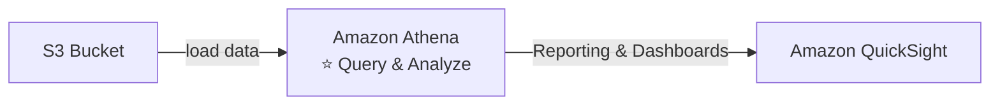

> ⭐⭐⭐ **EXAM TIP IN THẲNG TRÊN SLIDE:**
> **"Analyze data in S3 using SERVERLESS SQL → use ATHENA"**
>
> Đây là một trong số ít slide mà Stéphane ghi hẳn chữ **"Exam Tip"** — nghĩa là **chắc chắn ra thi**.

> ⭐⭐⭐ **Ba con số/từ khóa phải thuộc:**
> - **$5.00 / TB scanned** — vì tính tiền theo **lượng dữ liệu QUÉT**, nên tối ưu chi phí = **quét ít đi** (xem phần dưới)
> - **Presto** — engine bên dưới Athena
> - **VPC Flow Logs / ELB Logs / CloudTrail** — ba loại log điển hình phân tích bằng Athena

---

### ⭐⭐⭐ Amazon Athena – Performance Improvement (4 cách — RA THI)

| # | Cách | Chi tiết |
|---|---|---|
| 1 | ⭐⭐⭐ **Dùng COLUMNAR DATA để TIẾT KIỆM CHI PHÍ (quét ít hơn)** | ⭐⭐⭐ **Khuyến nghị APACHE PARQUET hoặc ORC**<br/>⭐⭐ **Cải thiện hiệu năng RẤT LỚN**<br/>⭐⭐⭐ **Dùng GLUE để chuyển dữ liệu sang Parquet hoặc ORC** |
| 2 | ⭐⭐⭐ **NÉN dữ liệu để lấy về ít hơn** | **bzip2, gzip, lz4, snappy, zlip, zstd…** |
| 3 | ⭐⭐⭐ **PARTITION datasets trong S3** để query dễ trên **virtual columns** | Cấu trúc thư mục:<br/>`s3://yourBucket/pathToTable/<PARTITION_COLUMN_NAME>=<VALUE>/…`<br/>Ví dụ: `s3://athena-examples/flight/parquet/year=1991/month=1/day=1/` |
| 4 | ⭐⭐⭐ **Dùng FILE LỚN HƠN (> 128 MB)** để giảm overhead | |

> ⭐⭐⭐ **Đây là bảng ra thi rất nhiều.** Mẫu câu hỏi: *"Chi phí Athena quá cao, làm sao giảm?"* → đáp án có thể là bất kỳ dòng nào trong bốn dòng trên, nhưng **hai đáp án phổ biến nhất là:**
> 1. **Chuyển sang định dạng cột Parquet/ORC** (giảm lượng scan nhiều nhất)
> 2. **Partition dữ liệu** (chỉ scan đúng partition cần)
>
> 💡 **Hiểu vì sao Parquet rẻ hơn:** CSV là **hàng ngang** — muốn đọc 1 cột vẫn phải quét cả dòng. Parquet là **cột dọc** — chỉ quét đúng cột bạn SELECT. Query `SELECT price FROM sales` trên Parquet có thể quét **ít hơn 90%** dữ liệu so với CSV.

---

### ⭐⭐⭐ Amazon Athena – Federated Query

- ⭐⭐⭐ **Cho phép chạy SQL query TRÊN dữ liệu lưu ở relational, non-relational, object, và custom data sources (AWS hoặc ON-PREMISES)**
- ⭐⭐⭐ **Dùng DATA SOURCE CONNECTORS chạy trên AWS LAMBDA để thực hiện FEDERATED QUERIES** (ví dụ CloudWatch Logs, DynamoDB, RDS, …)
- ⭐⭐⭐ **Lưu kết quả trở lại AMAZON S3**

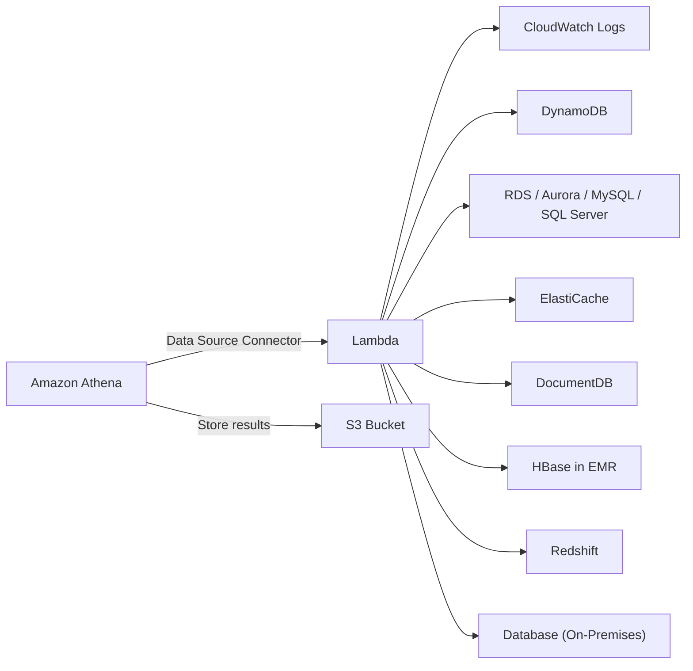

> ⭐⭐⭐ **Từ khóa nhận diện:** *"query dữ liệu ở NHIỀU NGUỒN khác nhau bằng MỘT câu SQL"*, *"query cả dữ liệu on-premises"* → **Athena Federated Query**.
>
> ⭐⭐ **Nhớ: connector CHẠY TRÊN LAMBDA** — đây là chi tiết đề hay hỏi.

---

## 242. Athena Hands On

> 🖐️ Bài Hands On — **không có slide**. Các bước Console.

### Bước 1 — Chuẩn bị query result location

⚠️⭐⭐⭐ **Athena BẮT BUỘC phải có một S3 bucket để lưu kết quả query** trước khi chạy câu lệnh đầu tiên.

1. Tạo bucket, ví dụ `athena-results-demo-<tên-bạn>`
2. Console → **Athena** → **Query editor** → tab **Settings** → **Manage**
3. **Location of query result**: `s3://athena-results-demo-<tên-bạn>/`
4. **Save**

### Bước 2 — Tạo Database và Table

Athena dùng **AWS Glue Data Catalog** để lưu metadata (schema). Có hai cách tạo table:

| Cách | Khi nào dùng |
|---|---|
| ⭐⭐ **Chạy câu lệnh DDL `CREATE EXTERNAL TABLE`** | Biết trước schema |
| ⭐⭐⭐ **Dùng AWS Glue Crawler** | Để Glue **tự dò schema** từ file trong S3 |

**Tạo database:**

```sql
CREATE DATABASE demo_db;
```

**Tạo table từ file ALB access log (ví dụ điển hình của khóa học):**

```sql
CREATE EXTERNAL TABLE IF NOT EXISTS demo_db.alb_logs (
  type string,
  time string,
  elb string,
  client_ip string,
  client_port int,
  target_ip string,
  target_port int,
  request_processing_time double,
  target_processing_time double,
  response_processing_time double,
  elb_status_code int,
  target_status_code string,
  received_bytes bigint,
  sent_bytes bigint,
  request_verb string,
  request_url string,
  request_proto string,
  user_agent string,
  ssl_cipher string,
  ssl_protocol string
)
ROW FORMAT SERDE 'org.apache.hadoop.hive.serde2.RegexSerDe'
WITH SERDEPROPERTIES ('serialization.format' = '1')
LOCATION 's3://your-alb-logs-bucket/AWSLogs/123456789012/elasticloadbalancing/us-east-1/';
```

> ⭐⭐⭐ **Từ khóa `EXTERNAL` rất quan trọng:** Athena **KHÔNG lưu dữ liệu**, nó chỉ **trỏ tới file trong S3**. Xóa table trong Athena **KHÔNG xóa** dữ liệu S3.

### Bước 3 — Chạy query

```sql
-- Đếm số request theo mã trạng thái
SELECT elb_status_code, COUNT(*) AS cnt
FROM demo_db.alb_logs
GROUP BY elb_status_code
ORDER BY cnt DESC;

-- Top 10 IP client gọi nhiều nhất
SELECT client_ip, COUNT(*) AS requests
FROM demo_db.alb_logs
GROUP BY client_ip
ORDER BY requests DESC
LIMIT 10;
```

### ⭐⭐⭐ Điểm cần quan sát sau mỗi query

Console hiển thị:

```
Time in queue: 0.1 sec
Run time: 2.45 sec
Data scanned: 12.34 MB      ← ⭐⭐⭐ ĐÂY LÀ CON SỐ TÍNH TIỀN
```

> ⭐⭐⭐ **"Data scanned" là con số quyết định hóa đơn.** Hãy thử nghiệm: chạy cùng một query trên **CSV** rồi trên **Parquet** → bạn sẽ thấy Parquet quét ít hơn rất nhiều. Đây chính là bài học của bảng Performance Improvement ở bài 241.

### ⭐⭐ Thử partition

Nếu dữ liệu đã được tổ chức theo cấu trúc partition:

```sql
-- Nạp partition tự động
MSCK REPAIR TABLE demo_db.alb_logs;

-- Query CHỈ một partition → scan ít hơn rất nhiều
SELECT COUNT(*) FROM demo_db.alb_logs
WHERE year = '2026' AND month = '09';
```

### CLI tương đương

```bash
# Chạy query
aws athena start-query-execution \
  --query-string "SELECT COUNT(*) FROM demo_db.alb_logs;" \
  --result-configuration OutputLocation=s3://athena-results-demo/

# Kiểm tra trạng thái và lượng data scanned
aws athena get-query-execution --query-execution-id <id>

# Lấy kết quả
aws athena get-query-results --query-execution-id <id>
```

> 💡 **CHI PHÍ: Athena KHÔNG có Free Tier** nhưng **$5/TB scanned** nghĩa là query vài chục MB chỉ tốn **vài cent hoặc gần như miễn phí**. Bài này an toàn. ⚠️ Nhớ **xóa bucket kết quả** sau khi học xong (Athena ghi file kết quả cho **mọi** query, dễ tích tụ).

---

## 243. Redshift

### ⭐⭐⭐ Redshift Overview

- ⭐⭐⭐ **Redshift dựa trên POSTGRESQL, nhưng KHÔNG dùng cho OLTP**
- ⭐⭐⭐ **Nó là OLAP — online analytical processing (analytics và DATA WAREHOUSING)**
- ⭐⭐⭐ **Hiệu năng TỐT HƠN 10 LẦN so với các data warehouse khác, scale tới PETABYTES dữ liệu**
- ⭐⭐⭐ **LƯU TRỮ DẠNG CỘT (columnar storage) thay vì theo dòng & PARALLEL QUERY ENGINE**
- ⭐⭐⭐ **Hai chế độ: PROVISIONED cluster hoặc SERVERLESS cluster**
- ⭐⭐ **Có giao diện SQL để thực hiện query**
- ⭐⭐⭐ **Các công cụ BI như Amazon QuickSight hoặc Tableau tích hợp được với nó**
- ⭐⭐⭐ **So với Athena: QUERY / JOINS / AGGREGATIONS NHANH HƠN nhờ INDEXES**

> ⭐⭐⭐ **BẢNG SO SÁNH ATHENA vs REDSHIFT — CÂU HỎI THI KINH ĐIỂN:**

| | ⭐⭐⭐ **Amazon Athena** | ⭐⭐⭐ **Amazon Redshift** |
|---|---|---|
| **Kiểu** | **Serverless query service** | **Data warehouse (có cluster)** |
| **Dữ liệu ở đâu** | ⭐⭐⭐ **Nằm nguyên trong S3, KHÔNG nạp** | ⭐⭐⭐ **PHẢI NẠP (load) vào cluster** |
| **Hạ tầng** | ✅ **Không có gì để quản lý** | ⚠️ **Provisioned cluster** (hoặc Serverless) |
| **Hiệu năng** | Tốt cho query **ad-hoc, thỉnh thoảng** | ⭐⭐⭐ **NHANH HƠN cho JOINS/AGGREGATIONS nhờ INDEXES** |
| **Chi phí** | **$5/TB scanned** — trả theo query | **Trả theo cluster/giờ** |
| **Khi nào chọn** | ⭐⭐⭐ **Query thỉnh thoảng, không muốn quản lý gì** | ⭐⭐⭐ **Query LIÊN TỤC, phức tạp, nhiều JOIN** |

> ⭐⭐⭐ **Mẹo chọn nhanh trong phòng thi:** đề nhấn **"serverless"**, **"không quản lý hạ tầng"**, **"query thỉnh thoảng"** → **Athena**. Đề nhấn **"data warehouse"**, **"BI dashboard chạy liên tục"**, **"JOIN phức tạp"**, **"hiệu năng cao"** → **Redshift**.

---

### ⭐⭐⭐ Redshift Cluster — Kiến trúc

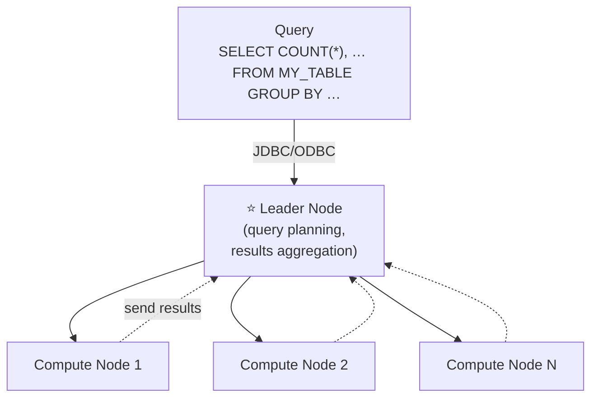

| Node | Vai trò |
|---|---|
| ⭐⭐⭐ **Leader node** | **LẬP KẾ HOẠCH QUERY (query planning), TỔNG HỢP KẾT QUẢ (results aggregation)** |
| ⭐⭐⭐ **Compute node** | **THỰC HIỆN query, GỬI KẾT QUẢ về leader** |

**⭐⭐ Provisioned mode:**

- ⭐⭐ **Chọn instance types TRƯỚC**
- ⭐⭐⭐ **CÓ THỂ RESERVE INSTANCES để tiết kiệm chi phí**

> ⭐⭐⭐ **Nhớ vai trò hai loại node** — đề hay hỏi *"node nào lập kế hoạch query?"* → **Leader node**.

---

### ⭐⭐⭐ Redshift – Snapshots & DR

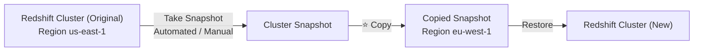

| Đặc điểm | Chi tiết |
|---|---|
| ⭐⭐ **Multi-AZ** | **Redshift có chế độ "Multi-AZ" cho MỘT SỐ cluster** |
| ⭐⭐⭐ **Snapshots** | **Point-in-time backups của cluster, lưu NỘI BỘ TRONG S3** |
| ⭐⭐⭐ **Incremental** | **Snapshot là TĂNG DẦN (chỉ lưu phần THAY ĐỔI)** |
| ⭐⭐⭐ **Restore** | **Restore snapshot vào một CLUSTER MỚI** |
| ⭐⭐⭐ **Automated** | **Mỗi 8 GIỜ, mỗi 5 GB, hoặc theo LỊCH. Retention từ 1 đến 35 NGÀY** |
| ⭐⭐⭐ **Manual** | **Snapshot được GIỮ CHO TỚI KHI BẠN XÓA** |
| ⭐⭐⭐ **Cross-Region DR** | **Cấu hình Redshift TỰ ĐỘNG COPY snapshots (automated hoặc manual) sang REGION KHÁC** |

> ⭐⭐⭐ **Ba con số phải nhớ: mỗi 8 giờ / mỗi 5 GB / retention 1–35 ngày.**
>
> ⭐⭐⭐ **Từ khóa DR:** *"disaster recovery cho Redshift sang region khác"* → **Automatically copy snapshots to another region**.

---

### ⭐⭐⭐ Loading data into Redshift: Large inserts are MUCH better

**Ba cách nạp dữ liệu:** ⭐⭐⭐

| Cách | Chi tiết |
|---|---|
| ⭐⭐⭐ **Amazon Kinesis Data Firehose** | Đẩy thẳng vào Redshift (**qua S3 copy**) |
| ⭐⭐⭐ **S3 dùng lệnh `COPY`** | **Cách được khuyến nghị nhất** |
| ⭐⭐ **EC2 Instance qua JDBC driver** | ⭐⭐⭐ **TỐT HƠN NÊN GHI DỮ LIỆU THEO LÔ (in batches)** |

**Lệnh `COPY` (in trên slide):**

```sql
copy customer
from 's3://mybucket/mydata'
iam_role 'arn:aws:iam::0123456789012:role/MyRedshiftRole';
```

**⭐⭐⭐ Enhanced VPC Routing:**

| | **KHÔNG có Enhanced VPC Routing** | **CÓ Enhanced VPC Routing** |
|---|---|---|
| **Đường đi dữ liệu** | ⚠️ **Qua INTERNET** | ⭐⭐⭐ **Qua VPC (không ra Internet)** |

> ⭐⭐⭐ **Từ khóa nhận diện Enhanced VPC Routing:** *"dữ liệu giữa Redshift và S3 KHÔNG ĐƯỢC ĐI QUA INTERNET"*, *"yêu cầu compliance/bảo mật"* → **bật Enhanced VPC Routing**.
>
> ⭐⭐⭐ **Và nhớ tiêu đề slide:** **"Large inserts are MUCH better"** — Redshift **ghét insert từng dòng một**, phải ghi theo lô lớn.

---

### ⭐⭐⭐ Redshift Spectrum

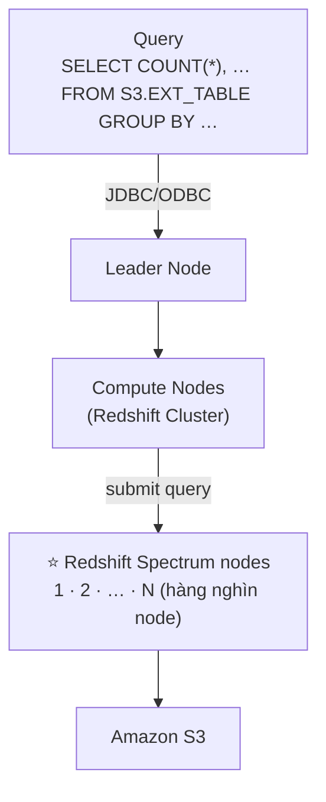

- ⭐⭐⭐ **Query dữ liệu ĐÃ CÓ SẴN TRONG S3 mà KHÔNG CẦN NẠP (without loading it)**
- ⚠️⭐⭐⭐ **PHẢI CÓ MỘT REDSHIFT CLUSTER SẴN SÀNG để bắt đầu query**
- ⭐⭐⭐ **Query sau đó được gửi tới HÀNG NGHÌN Redshift Spectrum nodes**

> ⭐⭐⭐ **Đây là điểm dễ nhầm với Athena.** Cả hai đều **query S3 trực tiếp**, nhưng:
>
> | | **Athena** | **Redshift Spectrum** |
> |---|---|---|
> | **Cần cluster không?** | ✅ **KHÔNG — hoàn toàn serverless** | ⚠️⭐⭐⭐ **CÓ — phải có Redshift cluster sẵn** |
> | **Khi nào dùng** | Chưa có Redshift | **ĐÃ CÓ Redshift**, muốn join dữ liệu trong cluster **với** dữ liệu trong S3 |
>
> ⭐⭐⭐ **Câu hỏi thi:** *"Đã có Redshift cluster, muốn query thêm dữ liệu lịch sử trong S3 mà không nạp vào cluster"* → **Redshift Spectrum**.

---

## 244. OpenSearch (ex: ElasticSearch)

### ⭐⭐⭐ Amazon OpenSearch Service

- ⭐⭐⭐ **Amazon OpenSearch là NGƯỜI KẾ NHIỆM của Amazon ElasticSearch**
- ⭐⭐⭐ **Trong DynamoDB, query CHỈ tồn tại theo PRIMARY KEY hoặc INDEXES…**
- ⭐⭐⭐ **Với OpenSearch, bạn có thể TÌM KIẾM BẤT KỲ TRƯỜNG NÀO, kể cả KHỚP MỘT PHẦN (partial matches)**
- ⭐⭐⭐ **Rất phổ biến khi dùng OpenSearch làm PHẦN BỔ SUNG (complement) cho một database khác**
- ⭐⭐ **Hai chế độ: managed cluster hoặc SERVERLESS cluster**
- ⚠️⭐⭐⭐ **KHÔNG hỗ trợ SQL một cách tự nhiên (có thể bật qua PLUGIN)**
- ⭐⭐⭐ **Ingestion từ: KINESIS DATA FIREHOSE, AWS IOT, và CLOUDWATCH LOGS**
- ⭐⭐ **Bảo mật qua Cognito & IAM, mã hóa KMS, TLS**
- ⭐⭐⭐ **Đi kèm OPENSEARCH DASHBOARDS (visualization)**

> ⭐⭐⭐ **Hai điểm ra thi nhiều nhất:**
> 1. **"Search ANY field, even PARTIAL matches"** — đây là thứ DynamoDB/RDS **không làm tốt**
> 2. **"Complement to another database"** — OpenSearch **không thay thế** database chính, nó **đi kèm**

---

### ⭐⭐⭐ OpenSearch patterns — Ba mẫu kiến trúc

**1️⃣ Pattern với DynamoDB:**

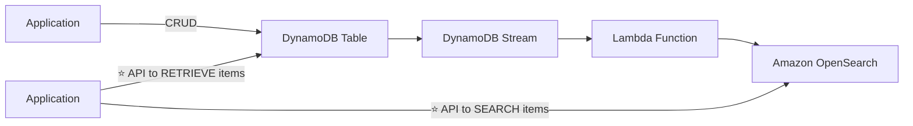

> ⭐⭐⭐ **Đây là pattern kinh điển nhất:** **DynamoDB để LẤY item theo key; OpenSearch để TÌM KIẾM**. Ứng dụng dùng **cả hai**: search trong OpenSearch lấy được ID, rồi dùng ID đó **retrieve full item từ DynamoDB**.

**2️⃣ Pattern với CloudWatch Logs:**

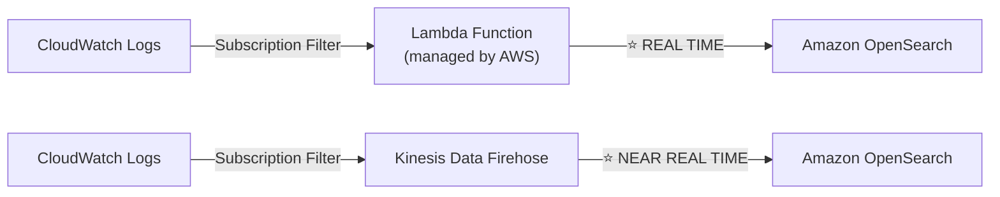

> ⭐⭐⭐ **Phân biệt hai đường:**
> - **Qua Lambda → REAL TIME**
> - **Qua Kinesis Data Firehose → NEAR REAL TIME**
>
> Cả hai đều bắt đầu bằng ⭐⭐⭐ **CloudWatch Logs Subscription Filter**.

**3️⃣ Pattern với Kinesis:**

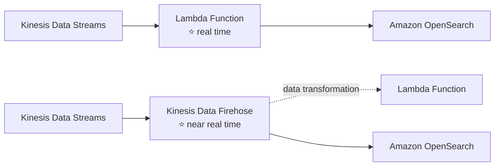

> ⭐⭐⭐ **Quy tắc chung xuyên suốt cả ba pattern:** **Lambda = real time; Firehose = near real time.** Nhớ quy tắc này thì làm được mọi câu hỏi dạng pattern.

---

## 245. EMR

### ⭐⭐⭐ Amazon EMR

- ⭐⭐⭐ **EMR viết tắt của "ELASTIC MAPREDUCE"**
- ⭐⭐⭐ **EMR giúp tạo HADOOP CLUSTERS (Big Data) để phân tích và xử lý LƯỢNG DỮ LIỆU KHỔNG LỒ**
- ⭐⭐⭐ **Cluster có thể gồm HÀNG TRĂM EC2 INSTANCES**
- ⭐⭐⭐ **EMR đi kèm sẵn APACHE SPARK, HBASE, PRESTO, FLINK…**
- ⭐⭐⭐ **EMR lo TOÀN BỘ việc provisioning và configuration**
- ⭐⭐⭐ **AUTO-SCALING và tích hợp với SPOT INSTANCES**
- ⭐⭐⭐ **Use cases: data processing, machine learning, WEB INDEXING, big data…**

---

### ⭐⭐⭐ Amazon EMR – Node types & purchasing

| Node type | Vai trò | Đặc điểm |
|---|---|---|
| ⭐⭐⭐ **Master Node** | **Quản lý cluster, ĐIỀU PHỐI, quản lý health** | **LONG RUNNING** |
| ⭐⭐⭐ **Core Node** | **CHẠY TASKS và LƯU DỮ LIỆU** | **LONG RUNNING** |
| ⭐⭐⭐ **Task Node (tùy chọn)** | **CHỈ chạy tasks** | ⭐⭐⭐ **THƯỜNG DÙNG SPOT** |

**⭐⭐⭐ Purchasing options:**

| Option | Đặc điểm |
|---|---|
| ⭐⭐⭐ **On-demand** | **Đáng tin cậy, đoán trước được, SẼ KHÔNG BỊ TERMINATE** |
| ⭐⭐⭐ **Reserved (tối thiểu 1 NĂM)** | **Tiết kiệm chi phí** — ⭐ **EMR TỰ ĐỘNG DÙNG nếu có sẵn** |
| ⭐⭐⭐ **Spot Instances** | **RẺ HƠN, CÓ THỂ BỊ TERMINATE, kém tin cậy hơn** |

- ⭐⭐⭐ **Có thể có LONG-RUNNING cluster, hoặc TRANSIENT (tạm thời) cluster**

> ⭐⭐⭐ **Câu hỏi thi kinh điển về EMR:** *"Tối ưu chi phí cho EMR cluster, dùng Spot cho node nào?"* → ⭐⭐⭐ **TASK NODE** (vì nó **không lưu dữ liệu**, mất đi cũng không sao).
>
> ⚠️ **KHÔNG dùng Spot cho Master Node** (mất là chết cả cluster) và **hạn chế dùng cho Core Node** (mất dữ liệu).
>
> ⭐⭐ **Từ khóa nhận diện EMR:** *"Hadoop"*, *"Apache Spark"*, *"HBase"*, *"MapReduce"*, *"big data processing cluster"*.

---

## 246. QuickSight

### ⭐⭐⭐ Amazon QuickSight

- ⭐⭐⭐ **SERVERLESS, machine learning-powered BUSINESS INTELLIGENCE service để tạo INTERACTIVE DASHBOARDS**
- ⭐⭐⭐ **Nhanh, tự động scale, NHÚNG ĐƯỢC (embeddable), tính phí THEO PHIÊN (per-session pricing)**
- ⭐⭐⭐ **Use cases: Business analytics, Building visualizations, PERFORM AD-HOC ANALYSIS, Get business insights using data**
- ⭐⭐⭐ **Tích hợp với RDS, Aurora, Athena, Redshift, S3…**
- ⭐⭐⭐ **Tính toán IN-MEMORY dùng ENGINE "SPICE" nếu dữ liệu được IMPORT vào QuickSight**
- ⭐⭐⭐ **Enterprise edition: có thể thiết lập COLUMN-LEVEL SECURITY (CLS)**

> ⭐⭐⭐ **Hai từ khóa độc quyền của QuickSight phải nhớ:**
> - ⭐⭐⭐ **SPICE** — engine tính toán in-memory (**chỉ hoạt động khi dữ liệu được IMPORT vào QuickSight**)
> - ⭐⭐⭐ **Column-Level Security (CLS)** — **CHỈ có ở Enterprise edition**

---

### ⭐⭐ QuickSight Integrations

| Nhóm | Nguồn |
|---|---|
| ⭐⭐⭐ **Data Sources (AWS Services)** | **RDS, Aurora, Redshift, Athena, S3, OpenSearch, Timestream** |
| ⭐⭐ **Data Sources (Imports)** | **On-Premises Databases (JDBC)** |
| ⭐⭐ **Data Sources (SaaS)** | **ELF & CLF (Log Format)** |

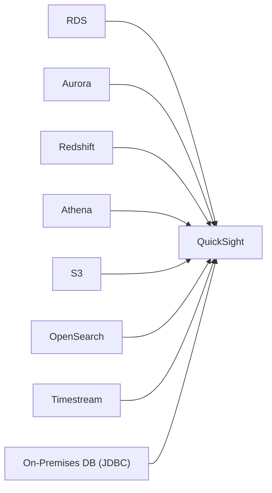

---

### ⭐⭐⭐ QuickSight – Dashboard & Analysis

- ⭐⭐⭐ **Định nghĩa USERS (standard version) và GROUPS (enterprise version)**
- ⚠️⭐⭐⭐ **Các user & group này CHỈ TỒN TẠI TRONG QUICKSIGHT, KHÔNG PHẢI IAM!!**

**⭐⭐⭐ Một DASHBOARD…**

- ⭐⭐⭐ **LÀ MỘT SNAPSHOT CHỈ ĐỌC (read-only) của một ANALYSIS mà bạn có thể chia sẻ**
- ⭐⭐⭐ **GIỮ NGUYÊN cấu hình của analysis (filtering, parameters, controls, sort)**
- ⭐⭐⭐ **Bạn có thể chia sẻ ANALYSIS hoặc DASHBOARD với Users hoặc Groups**
- ⭐⭐⭐ **Để chia sẻ dashboard, TRƯỚC HẾT PHẢI PUBLISH nó**
- ⚠️⭐⭐⭐ **Người xem dashboard CŨNG XEM ĐƯỢC DỮ LIỆU GỐC BÊN DƯỚI (underlying data)**

> ⭐⭐⭐ **Hai điểm có dấu "!!" và cảnh báo trên slide đều là điểm ra thi:**
> 1. **User/Group của QuickSight KHÔNG phải IAM** — đây là hệ thống định danh riêng
> 2. **Người xem dashboard thấy được dữ liệu gốc** — nếu cần giấu bớt cột thì phải dùng **Column-Level Security (Enterprise edition)**

---

## 247. Glue

### ⭐⭐⭐ AWS Glue

- ⭐⭐⭐ **Managed EXTRACT, TRANSFORM, and LOAD (ETL) service**
- ⭐⭐⭐ **Hữu ích để CHUẨN BỊ và BIẾN ĐỔI dữ liệu cho analytics**
- ⭐⭐⭐ **FULLY SERVERLESS service**

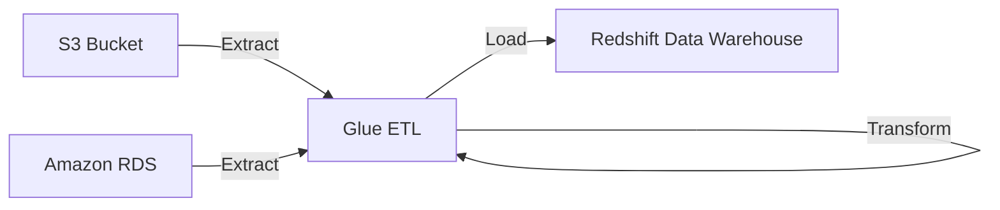

> ⭐⭐⭐ **ETL = Extract (trích xuất) → Transform (biến đổi) → Load (nạp).** Nhớ ba chữ này.

---

### ⭐⭐⭐ AWS Glue – Convert data into Parquet format

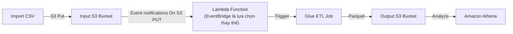

> ⭐⭐⭐ **Đây là kiến trúc NỐI TRỰC TIẾP với bài 241:** slide Athena Performance nói *"Use Glue to convert your data to Parquet or ORC"* — và đây chính là cách làm.
>
> ⭐⭐⭐ **Từ khóa:** *"chuyển CSV sang Parquet tự động khi upload"* → **S3 Event → Lambda → Glue ETL Job**.

---

### ⭐⭐⭐ Glue Data Catalog: catalog of datasets

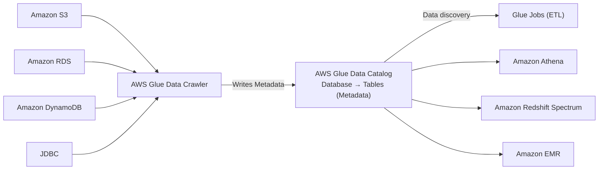

- ⭐⭐⭐ **AWS Glue Data Crawler QUÉT các nguồn (S3, RDS, DynamoDB, JDBC) và GHI METADATA vào Glue Data Catalog**
- ⭐⭐⭐ **Data Catalog chứa Database → Tables (METADATA — chỉ schema, KHÔNG phải dữ liệu)**
- ⭐⭐⭐ **Data Catalog được dùng bởi: Glue Jobs (ETL), Amazon Athena, Amazon Redshift Spectrum, Amazon EMR**

> ⭐⭐⭐ **Đây là mảnh ghép giải thích bài 242:** Athena biết được schema của file trong S3 **chính là nhờ Glue Data Catalog**. Đề hay hỏi *"làm sao Athena biết cấu trúc dữ liệu?"* → **Glue Data Catalog (được Glue Crawler điền vào)**.

---

### ⭐⭐ Glue – things to know at a high-level (4 tính năng)

| Tính năng | Ý nghĩa |
|---|---|
| ⭐⭐⭐ **Glue Job Bookmarks** | **NGĂN XỬ LÝ LẠI dữ liệu cũ** |
| ⭐⭐⭐ **Glue DataBrew** | **LÀM SẠCH và CHUẨN HÓA dữ liệu bằng các phép biến đổi DỰNG SẴN (pre-built)** |
| ⭐⭐ **Glue Studio** | **GUI mới để tạo, chạy và giám sát ETL job trong Glue** |
| ⭐⭐⭐ **Glue Streaming ETL** (xây trên Apache Spark Structured Streaming) | **Tương thích với Kinesis Data Streaming, Kafka, MSK (managed Kafka)** |

> ⭐⭐⭐ **Hai từ khóa ra thi nhiều nhất:**
> - *"tránh xử lý lại dữ liệu đã xử lý"* → **Glue Job Bookmarks**
> - *"làm sạch dữ liệu không cần viết code"* → **Glue DataBrew**

---

## 248. Lake Formation

### ⭐⭐⭐ AWS Lake Formation

- ⭐⭐⭐ **DATA LAKE = NƠI TẬP TRUNG chứa TOÀN BỘ dữ liệu của bạn cho mục đích analytics**
- ⭐⭐⭐ **Dịch vụ FULLY MANAGED giúp thiết lập data lake DỄ DÀNG TRONG VÀI NGÀY**
- ⭐⭐⭐ **Discover, cleanse, transform, và ingest dữ liệu vào Data Lake**
- ⭐⭐⭐ **TỰ ĐỘNG HÓA nhiều bước thủ công phức tạp (thu thập, làm sạch, di chuyển, catalog dữ liệu…) và KHỬ TRÙNG LẶP (de-duplicate) bằng ML TRANSFORMS**
- ⭐⭐⭐ **KẾT HỢP dữ liệu CÓ CẤU TRÚC và KHÔNG CẤU TRÚC trong data lake**
- ⭐⭐ **Có sẵn SOURCE BLUEPRINTS: S3, RDS, Relational & NoSQL DB…**
- ⭐⭐⭐ **FINE-GRAINED ACCESS CONTROL cho ứng dụng (ROW và COLUMN-LEVEL)**
- ⭐⭐⭐ **XÂY DỰNG TRÊN NỀN AWS GLUE**

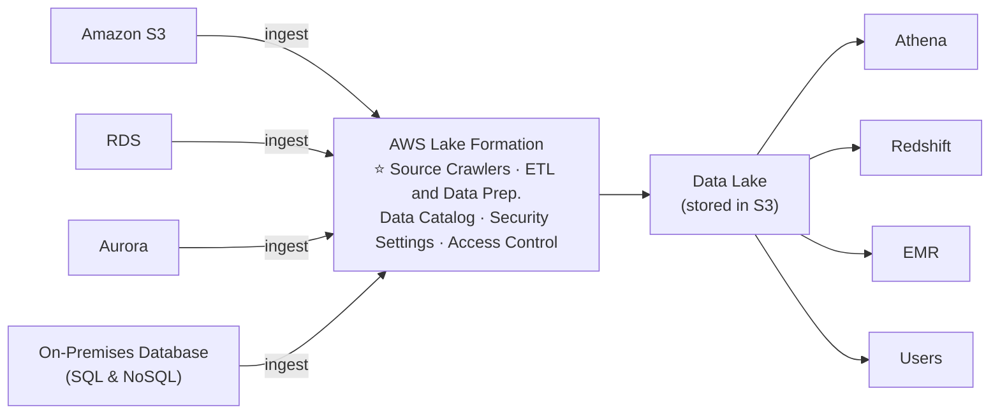

---

### ⭐⭐⭐ AWS Lake Formation — Centralized Permissions Example

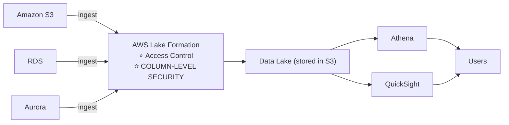

> ⭐⭐⭐ **GIÁ TRỊ CỐT LÕI CỦA LAKE FORMATION LÀ "CENTRALIZED PERMISSIONS".**
>
> Thay vì phải cấu hình quyền **riêng lẻ** ở Athena, QuickSight, Redshift, EMR… bạn cấu hình **MỘT LẦN trong Lake Formation** và **mọi dịch vụ đều tuân theo**.
>
> ⭐⭐⭐ **Từ khóa nhận diện:** *"quản lý quyền TẬP TRUNG cho data lake"*, *"row-level và column-level security"*, *"thiết lập data lake nhanh"* → **AWS Lake Formation**.
>
> ⭐⭐⭐ **Và nhớ: Lake Formation XÂY TRÊN GLUE** — nó không thay thế Glue, nó là **lớp bên trên**.

---

## 249. Amazon Managed Service for Apache Flink

### ⭐⭐⭐ Amazon Managed Service for Apache Flink

- ⭐⭐⭐ **TÊN CŨ: "Kinesis Data Analytics for Apache Flink"** — đề thi có thể dùng **cả hai tên**
- ⭐⭐⭐ **Flink (Java, Scala hoặc SQL) là framework để XỬ LÝ DATA STREAMS**
- ⭐⭐⭐ **Chạy BẤT KỲ ứng dụng Apache Flink nào trên MANAGED CLUSTER trên AWS**
- ⭐⭐ **Provisioned compute resources, PARALLEL COMPUTATION, AUTOMATIC SCALING**
- ⭐⭐ **Application backups (triển khai dưới dạng CHECKPOINTS và SNAPSHOTS)**
- ⭐⭐ **Dùng được mọi tính năng lập trình của Apache Flink để biến đổi dữ liệu**

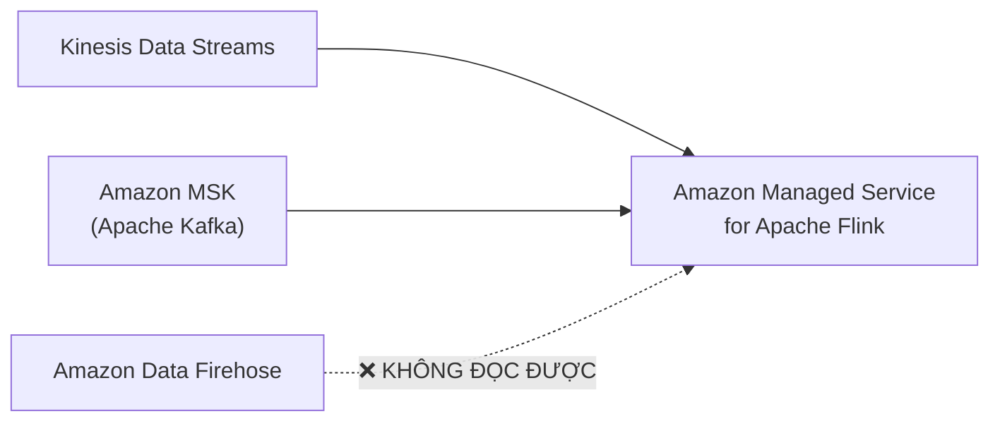

> ⚠️⭐⭐⭐ **IMPORTANT (in đậm trên slide): FLINK KHÔNG ĐỌC ĐƯỢC TỪ AMAZON DATA FIREHOSE.**
>
> ⭐⭐⭐ **Đây là câu hỏi bẫy ra thi rất nhiều.** Flink **CHỈ đọc được từ: Kinesis Data Streams và Amazon MSK**.
>
> 💡 **Hiểu vì sao:** Firehose là dịch vụ **delivery** (giao hàng một chiều tới đích), **không phải** một stream có thể đọc lại. Kinesis Data Streams và Kafka thì **giữ dữ liệu và cho consumer đọc**.

---

## 250. Amazon Managed Service for Apache Flink - Hands On

> 🖐️ Bài Hands On — **không có slide**. Bài rất ngắn (2 phút), chủ yếu là **tham quan giao diện**.

### Các bước Console

1. Console → tìm **Managed Apache Flink** (hoặc **Kinesis** → **Analytics applications**)
2. **Create streaming application**
3. **Choose a method to set up the stream processing application**:

| Lựa chọn | Ghi chú |
|---|---|
| ⭐⭐ **Create from scratch** | Tự viết ứng dụng Flink (Java/Scala/Python) và upload |
| ⭐⭐ **Use a template** | Dùng mẫu có sẵn |
| ⭐ **Studio notebook** | ⭐ **Notebook tương tác (Apache Zeppelin)** để viết SQL/Python thử nghiệm ngay |

4. **Application configuration**:
   - **Application name**: `demo-flink-app`
   - ⭐⭐ **Runtime**: **Apache Flink 1.20** (hoặc phiên bản mới nhất)
   - ⭐⭐⭐ **IAM role**: tạo role cho phép Flink đọc **Kinesis Data Streams / MSK** và ghi ra đích
5. **Template for application settings**: **Development** (rẻ) hoặc **Production**
6. **Create application**

### Cấu hình nguồn và đích

- ⭐⭐⭐ **Source**: **Kinesis Data Streams** hoặc **Amazon MSK** — ⚠️ **KHÔNG có lựa chọn Firehose** (đúng như slide bài 249 cảnh báo)
- ⭐⭐ **Application code location**: S3 bucket chứa file `.jar` hoặc `.zip` của ứng dụng Flink
- ⭐⭐ **Snapshots**: bật để có **checkpoint/backup**
- ⭐⭐ **Scaling**: **Parallelism** và **Parallelism per KPU**

### ⭐⭐ Đơn vị tính phí — KPU

⭐⭐⭐ **KPU (Kinesis Processing Unit)** = **1 vCPU + 4 GB RAM**. Đây là đơn vị mà Flink tính tiền.

```bash
# Liệt kê ứng dụng
aws kinesisanalyticsv2 list-applications

# Xem chi tiết
aws kinesisanalyticsv2 describe-application --application-name demo-flink-app

# Xóa (cần CreateTimestamp lấy từ describe)
aws kinesisanalyticsv2 delete-application \
  --application-name demo-flink-app \
  --create-timestamp <timestamp>
```

> ⚠️⭐⭐⭐ **CẢNH BÁO CHI PHÍ:** **Managed Service for Apache Flink KHÔNG có Free Tier.** Tính phí **~$0.11/KPU/giờ**, và một ứng dụng tối thiểu dùng **2 KPU** → **~$160/tháng** nếu để chạy. **Studio notebook còn đắt hơn.**
>
> 💡 **Khuyến nghị: CHỈ XEM VIDEO.** Kiến thức thi nằm hoàn toàn ở bài 249 (đặc biệt câu "Flink không đọc từ Firehose"), không ở thao tác. Nếu đã tạo, **Delete application NGAY**.

---

## 251. MSK - Managed Streaming for Apache Kafka

### ⭐⭐⭐ Amazon Managed Streaming for Apache Kafka (Amazon MSK)

- ⭐⭐⭐ **LỰA CHỌN THAY THẾ cho Amazon Kinesis**
- ⭐⭐⭐ **Apache Kafka được QUẢN LÝ HOÀN TOÀN trên AWS**
- ⭐⭐ **Cho phép tạo, cập nhật, xóa clusters**
- ⭐⭐⭐ **MSK TẠO & QUẢN LÝ các KAFKA BROKER NODES và ZOOKEEPER NODES cho bạn**
- ⭐⭐⭐ **Deploy MSK cluster TRONG VPC CỦA BẠN, MULTI-AZ (TỚI 3 AZ để HA)**
- ⭐⭐ **Tự động phục hồi khỏi các lỗi Apache Kafka thường gặp**
- ⭐⭐⭐ **Dữ liệu được lưu trên EBS VOLUMES, LÂU TÙY Ý BẠN MUỐN**

**⭐⭐⭐ MSK Serverless:**

- ⭐⭐⭐ **Chạy Apache Kafka trên MSK mà KHÔNG phải quản lý capacity**
- ⭐⭐⭐ **MSK TỰ ĐỘNG provision tài nguyên và scale compute & storage**

> ⭐⭐⭐ **Từ khóa nhận diện MSK:** *"Apache Kafka"*, *"migrate Kafka workload lên AWS"*, *"đã có ứng dụng dùng Kafka producer/consumer API"* → **Amazon MSK**.

---

### ⭐⭐ Apache Kafka at a high level

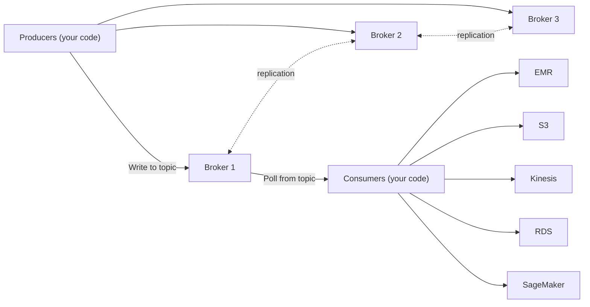

⭐⭐ **Producers ghi vào topic; các broker replicate cho nhau; Consumers POLL (kéo) từ topic** rồi đưa dữ liệu tới EMR, S3, Kinesis, RDS, SageMaker…

---

### ⭐⭐⭐ Kinesis Data Streams vs. Amazon MSK — BẢNG ĐINH

| | ⭐⭐⭐ **Kinesis Data Streams** | ⭐⭐⭐ **Amazon MSK** |
|---|---|---|
| ⭐⭐⭐ **Kích thước message** | **GIỚI HẠN 1 MB** | ⭐⭐⭐ **MẶC ĐỊNH 1 MB, CẤU HÌNH ĐƯỢC CAO HƠN (ví dụ 10 MB)** |
| ⭐⭐⭐ **Đơn vị chia** | **Data Streams với SHARDS** | **Kafka TOPICS với PARTITIONS** |
| ⭐⭐⭐ **Thay đổi quy mô** | **Shard SPLITTING & MERGING** (tăng và giảm được) | ⚠️⭐⭐⭐ **CHỈ CÓ THỂ THÊM partition vào topic** (không giảm được) |
| ⭐⭐⭐ **Mã hóa khi truyền** | **TLS In-flight encryption** | ⭐⭐⭐ **PLAINTEXT hoặc TLS In-flight Encryption** |
| ⭐⭐ **Mã hóa khi lưu** | **KMS at-rest encryption** | **KMS at-rest encryption** |

> ⭐⭐⭐ **Ba dòng đầu là ba câu hỏi thi:**
> 1. **Message > 1 MB** → **MSK** (Kinesis **không** vượt được 1 MB)
> 2. **Cần GIẢM số shard/partition** → **Kinesis** (MSK **chỉ thêm được**)
> 3. **Cần PLAINTEXT (không mã hóa)** → **MSK** (Kinesis **luôn TLS**)

---

### ⭐⭐ Amazon MSK Consumers

Các consumer đọc được từ MSK:

| Consumer |
|---|
| ⭐⭐⭐ **Amazon Managed Service for Apache Flink** (Kinesis Data Analytics for Apache Flink) |
| ⭐⭐⭐ **AWS Glue Streaming ETL Jobs** (powered by Apache Spark Streaming) |
| ⭐⭐⭐ **Lambda** |
| ⭐⭐ **Applications Running on: Amazon EC2, ECS, EKS** |

> ⭐⭐⭐ **Lưu ý liên kết với bài 249:** **Flink đọc được từ MSK** (và từ Kinesis Data Streams), nhưng **KHÔNG đọc được từ Firehose**.

---

## 252. Big Data Ingestion Pipeline

### ⭐⭐⭐ Yêu cầu đề bài

| # | Yêu cầu | ⭐ Dịch vụ tương ứng |
|---|---|---|
| 1 | ⭐⭐⭐ **Ingestion pipeline phải FULLY SERVERLESS** | (tất cả đều serverless) |
| 2 | ⭐⭐⭐ **Thu thập dữ liệu THỜI GIAN THỰC** | **Kinesis Data Streams** |
| 3 | ⭐⭐⭐ **BIẾN ĐỔI dữ liệu** | **Lambda (qua Firehose transformation)** |
| 4 | ⭐⭐⭐ **QUERY dữ liệu đã biến đổi bằng SQL** | **Amazon Athena** |
| 5 | ⭐⭐⭐ **Report tạo từ query phải nằm trong S3** | **Reporting Bucket (S3)** |
| 6 | ⭐⭐⭐ **Nạp dữ liệu vào WAREHOUSE và tạo DASHBOARDS** | **Redshift + QuickSight** |

---

### ⭐⭐⭐ Big Data Ingestion Pipeline — Kiến trúc đầy đủ

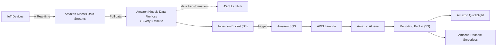

**⭐⭐ Lưu ý:** slide ghi **AWS Lambda thứ hai là "(optional)"** — tức là **S3 có thể nối THẲNG tới Lambda** mà không cần qua SQS.

---

### ⭐⭐⭐ Big Data Ingestion Pipeline discussion — 8 điểm chốt

| # | Điểm chốt |
|---|---|
| 1 | ⭐⭐⭐ **IoT Core cho phép THU HOẠCH dữ liệu từ IOT DEVICES** |
| 2 | ⭐⭐⭐ **KINESIS rất tốt cho THU THẬP DỮ LIỆU THỜI GIAN THỰC** |
| 3 | ⭐⭐⭐ **FIREHOSE giúp GIAO dữ liệu tới S3 GẦN THỜI GIAN THỰC (1 PHÚT)** |
| 4 | ⭐⭐⭐ **LAMBDA có thể giúp Firehose BIẾN ĐỔI DỮ LIỆU** |
| 5 | ⭐⭐⭐ **Amazon S3 có thể trigger THÔNG BÁO tới SQS** |
| 6 | ⭐⭐⭐ **Lambda có thể SUBSCRIBE tới SQS** (ta cũng có thể nối THẲNG S3 tới Lambda) |
| 7 | ⭐⭐⭐ **ATHENA là dịch vụ SQL SERVERLESS và kết quả được LƯU TRONG S3** |
| 8 | ⭐⭐⭐ **REPORTING BUCKET chứa dữ liệu đã phân tích và được dùng bởi công cụ reporting như AWS QUICKSIGHT, REDSHIFT, v.v…** |

> ⭐⭐⭐ **Đây là bài ghép TOÀN BỘ chương 17 + 22 lại.** Hãy nhớ **con số 1 PHÚT** của Firehose — đó là lý do pipeline này là **near real-time**, không phải real-time thuần túy.
>
> ⭐⭐⭐ **Hai bucket có vai trò khác nhau:**
> - **Ingestion Bucket** = dữ liệu **thô** vừa nạp vào
> - **Reporting Bucket** = dữ liệu **đã phân tích**, dành cho BI tool đọc

---

## 🧭 Bảng tổng kết Data & Analytics ⭐⭐⭐

| Dịch vụ | Câu định vị một dòng | Use case chốt |
|---|---|---|
| ⭐⭐⭐ **Athena** | **SQL serverless trên S3** | **Query log, BI ad-hoc, không quản lý gì** |
| ⭐⭐⭐ **Redshift** | **Data warehouse OLAP** | **BI liên tục, JOIN phức tạp, PB dữ liệu** |
| ⭐⭐⭐ **Redshift Spectrum** | **Redshift query thẳng S3** | **Đã có cluster, join dữ liệu S3** |
| ⭐⭐⭐ **OpenSearch** | **Tìm kiếm mọi trường, khớp một phần** | **Search, log analytics, bổ trợ DB khác** |
| ⭐⭐⭐ **EMR** | **Hadoop/Spark cluster được quản lý** | **Big data processing, ML, web indexing** |
| ⭐⭐⭐ **QuickSight** | **BI dashboard serverless** | **Visualization, dashboard chia sẻ** |
| ⭐⭐⭐ **Glue** | **ETL serverless + Data Catalog** | **Chuyển sang Parquet, dò schema** |
| ⭐⭐⭐ **Lake Formation** | **Data lake + quyền TẬP TRUNG** | **Row/column-level security cho data lake** |
| ⭐⭐⭐ **Managed Flink** | **Xử lý stream bằng Apache Flink** | **Biến đổi stream phức tạp** |
| ⭐⭐⭐ **MSK** | **Apache Kafka được quản lý** | **Workload Kafka, message > 1 MB** |

### 📌 Cheat Sheet từ khóa → dịch vụ ⭐⭐⭐

| Từ khóa trong đề | Đáp án |
|---|---|
| *"serverless SQL trên S3"* ⭐ (Exam Tip) | **Athena** |
| *"phân tích VPC Flow Logs / ELB Logs / CloudTrail"* | **Athena** |
| *"giảm chi phí Athena"* | **Parquet/ORC + partition + nén + file > 128 MB** |
| *"query nhiều nguồn khác nhau bằng một SQL"* | **Athena Federated Query** (connector chạy trên Lambda) |
| *"data warehouse", "OLAP", "BI liên tục"* | **Redshift** |
| *"đã có Redshift, muốn query thêm dữ liệu S3"* | **Redshift Spectrum** |
| *"dữ liệu Redshift ↔ S3 không được đi qua Internet"* | **Enhanced VPC Routing** |
| *"DR cho Redshift sang region khác"* | **Auto copy snapshots to another region** |
| *"nạp dữ liệu vào Redshift hiệu quả"* | **`COPY` từ S3, ghi theo LÔ LỚN** |
| *"tìm kiếm free text, khớp một phần, bất kỳ trường nào"* | **OpenSearch** |
| *"log từ CloudWatch vào OpenSearch REAL TIME"* | **Subscription Filter → Lambda** |
| *"log từ CloudWatch vào OpenSearch NEAR REAL TIME"* | **Subscription Filter → Firehose** |
| *"Hadoop", "Spark", "HBase", "MapReduce"* | **EMR** |
| *"tiết kiệm chi phí EMR bằng Spot"* | ⭐ **Task Node** (không dùng cho Master) |
| *"dashboard tương tác, visualization"* | **QuickSight** |
| *"in-memory engine của QuickSight"* | **SPICE** |
| *"giấu bớt cột với một số người xem dashboard"* | **Column-Level Security (Enterprise edition)** |
| *"ETL serverless", "chuyển CSV sang Parquet"* | **AWS Glue** |
| *"tránh xử lý lại dữ liệu cũ"* | **Glue Job Bookmarks** |
| *"làm sạch dữ liệu không viết code"* | **Glue DataBrew** |
| *"Athena biết schema nhờ đâu"* | **Glue Data Catalog** (Glue Crawler điền vào) |
| *"data lake với quyền tập trung, row/column-level"* | **AWS Lake Formation** |
| *"xử lý stream bằng Flink"* | **Amazon Managed Service for Apache Flink** |
| ⚠️ *"Flink đọc từ Firehose"* | ❌ **KHÔNG ĐƯỢC** — chỉ Kinesis Data Streams & MSK |
| *"Apache Kafka trên AWS"* | **Amazon MSK** |
| *"message lớn hơn 1 MB"* | **MSK** (Kinesis tối đa 1 MB) |
| *"cần giảm số shard/partition"* | **Kinesis** (MSK chỉ thêm được) |

---

## Trắc nghiệm 19: Data & Analytics Quiz

### Các điểm dễ bị bẫy

| Câu hỏi thường gặp | Đáp án đúng | Vì sao đáp án khác sai |
|---|---|---|
| Phân tích dữ liệu S3 bằng SQL serverless? | ⭐⭐⭐ **Athena** (Exam Tip in trên slide) | |
| Athena tính phí thế nào? | ⭐⭐⭐ **$5.00 / TB DỮ LIỆU SCAN** | Không tính theo giờ hay theo query |
| Athena xây trên engine gì? | **Presto** | |
| Athena hỗ trợ định dạng nào? | **CSV, JSON, ORC, Avro, Parquet** | |
| Giảm chi phí Athena hiệu quả nhất? | ⭐⭐⭐ **Chuyển sang Parquet/ORC** + **partition** | Vì tính tiền theo **lượng scan** |
| File nên lớn bao nhiêu để giảm overhead? | **> 128 MB** | |
| Query dữ liệu on-premises từ Athena? | ⭐⭐⭐ **Federated Query** (connector chạy trên **Lambda**) | |
| Redshift dùng cho OLTP hay OLAP? | ⭐⭐⭐ **OLAP** (dựa trên PostgreSQL nhưng KHÔNG dùng cho OLTP) | |
| Redshift lưu dữ liệu theo dòng hay cột? | ⭐⭐⭐ **CỘT (columnar)** | |
| Redshift nhanh hơn data warehouse khác bao nhiêu? | **10 lần**, scale tới **PB** | |
| Athena vs Redshift khác nhau chỗ nào? | ⭐⭐⭐ **Redshift nhanh hơn cho JOIN/aggregation nhờ INDEXES, nhưng PHẢI NẠP dữ liệu** | Athena query thẳng S3, không nạp |
| Node nào lập kế hoạch query trong Redshift? | ⭐⭐⭐ **Leader Node** | Compute Node thực thi |
| Redshift snapshot tự động khi nào? | ⭐⭐⭐ **Mỗi 8 giờ, mỗi 5 GB, hoặc theo lịch** — retention **1–35 ngày** | |
| Redshift snapshot lưu ở đâu? | **Nội bộ trong S3**, và là **incremental** | |
| Restore Redshift snapshot ghi đè cluster cũ? | ❌ **KHÔNG — tạo CLUSTER MỚI** | |
| DR Redshift sang region khác? | ⭐⭐⭐ **Tự động copy snapshot sang region khác** | |
| Nạp dữ liệu vào Redshift kiểu nào tốt? | ⭐⭐⭐ **LÔ LỚN (`COPY` từ S3)**, tránh insert từng dòng | |
| Dữ liệu Redshift–S3 không được qua Internet? | ⭐⭐⭐ **Enhanced VPC Routing** | |
| Redshift Spectrum cần gì? | ⚠️⭐⭐⭐ **PHẢI CÓ Redshift cluster sẵn sàng** | Athena thì **không cần gì** |
| OpenSearch là kế nhiệm của gì? | **Amazon ElasticSearch** | |
| OpenSearch hơn DynamoDB ở điểm nào? | ⭐⭐⭐ **Tìm được MỌI TRƯỜNG, kể cả KHỚP MỘT PHẦN** | DynamoDB chỉ query theo **primary key / index** |
| OpenSearch hỗ trợ SQL không? | ⚠️ **KHÔNG tự nhiên — phải bật PLUGIN** | |
| OpenSearch nhận dữ liệu từ đâu? | **Kinesis Data Firehose, AWS IoT, CloudWatch Logs** | |
| CloudWatch Logs → OpenSearch real time? | ⭐⭐⭐ **Subscription Filter → Lambda** | Qua **Firehose** là **near** real time |
| EMR viết tắt của gì? | **Elastic MapReduce** | |
| EMR đi kèm những gì? | **Apache Spark, HBase, Presto, Flink** | |
| Ba loại node của EMR? | ⭐⭐⭐ **Master (quản lý) / Core (chạy + LƯU DỮ LIỆU) / Task (chỉ chạy)** | |
| Dùng Spot cho node EMR nào? | ⭐⭐⭐ **TASK NODE** | ❌ Master Node mất là chết cluster; Core Node mất dữ liệu |
| QuickSight là gì? | ⭐⭐⭐ **BI serverless, dashboard tương tác, tính phí PER-SESSION** | |
| Engine in-memory của QuickSight? | ⭐⭐⭐ **SPICE** (chỉ khi dữ liệu được **IMPORT** vào QuickSight) | |
| User/Group của QuickSight có phải IAM? | ⚠️⭐⭐⭐ **KHÔNG — chỉ tồn tại trong QuickSight** | |
| Dashboard QuickSight là gì? | ⭐⭐⭐ **Snapshot CHỈ ĐỌC của một analysis, phải PUBLISH trước khi share** | |
| Người xem dashboard có thấy dữ liệu gốc không? | ⚠️⭐⭐⭐ **CÓ** — muốn giấu cột phải dùng **Column-Level Security (Enterprise)** | |
| Glue là dịch vụ gì? | ⭐⭐⭐ **ETL serverless được quản lý** | |
| Chuyển CSV sang Parquet tự động khi upload? | ⭐⭐⭐ **S3 Event → Lambda → Glue ETL Job** | |
| Athena biết schema của file S3 nhờ đâu? | ⭐⭐⭐ **Glue Data Catalog** (do **Glue Crawler** điền) | |
| Glue Data Catalog được ai dùng? | **Glue Jobs, Athena, Redshift Spectrum, EMR** | |
| Tránh xử lý lại dữ liệu cũ trong Glue? | ⭐⭐⭐ **Glue Job Bookmarks** | |
| Làm sạch/chuẩn hóa dữ liệu không viết code? | ⭐⭐⭐ **Glue DataBrew** | |
| Lake Formation xây trên nền gì? | ⭐⭐⭐ **AWS Glue** | |
| Giá trị cốt lõi của Lake Formation? | ⭐⭐⭐ **CENTRALIZED PERMISSIONS — row & column-level cho mọi dịch vụ** | |
| Lake Formation khử trùng lặp bằng gì? | **ML Transforms** | |
| Managed Service for Apache Flink tên cũ là gì? | **Kinesis Data Analytics for Apache Flink** | |
| Flink đọc được từ những nguồn nào? | ⭐⭐⭐ **Kinesis Data Streams và Amazon MSK** | ⚠️⭐⭐⭐ **KHÔNG đọc được từ Amazon Data Firehose** |
| MSK là gì? | ⭐⭐⭐ **Apache Kafka được quản lý, thay thế cho Kinesis** | |
| MSK quản lý những node nào? | **Kafka broker nodes & Zookeeper nodes** | |
| MSK deploy ở đâu? | ⭐⭐⭐ **Trong VPC của bạn, Multi-AZ tới 3 AZ** | |
| MSK lưu dữ liệu ở đâu, bao lâu? | ⭐⭐⭐ **EBS volumes, LÂU TÙY Ý** | Kinesis tối đa **365 ngày** |
| Message lớn hơn 1 MB? | ⭐⭐⭐ **MSK** (cấu hình được, ví dụ 10 MB) | Kinesis **cứng 1 MB** |
| Cần giảm số shard/partition? | ⭐⭐⭐ **Kinesis** (splitting & merging) | ⚠️ **MSK CHỈ THÊM được partition** |
| MSK có mã hóa in-flight bắt buộc không? | ❌ **Không — có cả PLAINTEXT hoặc TLS** | Kinesis **luôn TLS** |
| Consumer nào đọc được MSK? | **Flink, Glue Streaming ETL, Lambda, app trên EC2/ECS/EKS** | |
| Firehose giao dữ liệu tới S3 sau bao lâu? | ⭐⭐⭐ **Gần thời gian thực — 1 PHÚT** | |
| Trong Big Data Pipeline, Athena lưu kết quả ở đâu? | ⭐⭐⭐ **S3 (Reporting Bucket)** | |

---

### Checklist tự kiểm tra trước khi làm quiz

**Athena & Redshift (quan trọng nhất):**
- [ ] ⭐ Thuộc Exam Tip: **"serverless SQL trên S3 → Athena"**
- [ ] Nhớ **$5/TB scanned**, engine **Presto**
- [ ] Thuộc **4 cách giảm chi phí Athena**: Parquet/ORC, nén, partition, file > 128 MB
- [ ] Nhớ **Federated Query dùng connector chạy trên Lambda**
- [ ] Nhớ **Redshift = OLAP, columnar, 10x nhanh hơn, PB scale**
- [ ] Phân biệt **Leader Node (planning) vs Compute Node (thực thi)**
- [ ] Nhớ **snapshot: mỗi 8 giờ / 5 GB / retention 1–35 ngày / incremental / restore ra cluster MỚI**
- [ ] Nhớ **Enhanced VPC Routing** để dữ liệu không qua Internet
- [ ] ⭐ Phân biệt **Athena (không cần gì)** vs **Redshift Spectrum (PHẢI có cluster)**

**Các dịch vụ còn lại:**
- [ ] Nhớ **OpenSearch: search mọi trường + khớp một phần, không hỗ trợ SQL tự nhiên**
- [ ] Thuộc quy tắc **Lambda = real time; Firehose = near real time**
- [ ] Nhớ **EMR: 3 loại node, Spot dùng cho TASK NODE**
- [ ] Nhớ **QuickSight: SPICE, per-session pricing, user KHÔNG phải IAM, CLS ở Enterprise**
- [ ] Nhớ **người xem dashboard thấy được dữ liệu gốc**
- [ ] Nhớ **Glue: ETL serverless, Data Catalog, Job Bookmarks, DataBrew**
- [ ] Nhớ **Athena lấy schema từ Glue Data Catalog**
- [ ] Nhớ **Lake Formation = centralized permissions, xây trên Glue**
- [ ] ⚠️ Nhớ **Flink KHÔNG đọc được từ Firehose**
- [ ] Thuộc **bảng Kinesis vs MSK** (1 MB vs cấu hình được, shard vs partition, TLS vs PLAINTEXT)
- [ ] Nhớ **MSK lưu trên EBS, giữ lâu tùy ý** (Kinesis tối đa 365 ngày)
- [ ] Đọc lại **kiến trúc Big Data Pipeline (bài 252)** và **Cheat Sheet** ở cuối chương

---

## Thuật ngữ Anh — Việt

| Tiếng Anh | Tiếng Việt |
|---|---|
| Data & Analytics | Dữ liệu và phân tích |
| Serverless query service | Dịch vụ truy vấn không cần máy chủ |
| Standard SQL language | Ngôn ngữ SQL chuẩn |
| Presto | Engine truy vấn phân tán mã nguồn mở |
| Data scanned | Lượng dữ liệu được quét |
| Business intelligence (BI) | Phân tích dữ liệu phục vụ ra quyết định |
| Reporting / Dashboards | Báo cáo / bảng điều khiển |
| VPC Flow Logs | Nhật ký luồng mạng trong VPC |
| CloudTrail trails | Nhật ký hoạt động tài khoản AWS |
| Columnar data | Dữ liệu lưu theo cột |
| Apache Parquet / ORC | Hai định dạng lưu trữ dạng cột |
| Compression | Nén dữ liệu |
| Partition datasets | Chia nhỏ tập dữ liệu theo thư mục |
| Virtual columns | Cột ảo suy ra từ đường dẫn partition |
| Overhead | Chi phí phụ trội khi xử lý |
| Federated Query | Truy vấn liên kết nhiều nguồn |
| Data Source Connector | Bộ kết nối tới nguồn dữ liệu |
| Relational / Non-relational | Quan hệ / phi quan hệ |
| Data warehousing | Kho dữ liệu phân tích |
| OLAP / OLTP | Xử lý phân tích / xử lý giao dịch |
| Parallel query engine | Bộ máy truy vấn song song |
| Provisioned cluster | Cụm được cấp phát trước |
| Leader node | Node điều phối, lập kế hoạch truy vấn |
| Compute node | Node thực thi truy vấn |
| Query planning | Lập kế hoạch truy vấn |
| Results aggregation | Tổng hợp kết quả |
| Reserve instances | Đặt trước instance để giảm giá |
| Snapshots | Ảnh chụp dữ liệu tại một thời điểm |
| Incremental | Tăng dần, chỉ lưu phần thay đổi |
| Retention | Thời gian giữ lại |
| Restore | Khôi phục |
| COPY command | Lệnh nạp dữ liệu hàng loạt của Redshift |
| Large inserts | Ghi dữ liệu theo lô lớn |
| Enhanced VPC Routing | Định tuyến dữ liệu qua VPC thay vì Internet |
| Redshift Spectrum | Truy vấn dữ liệu S3 từ cụm Redshift |
| External table | Bảng trỏ tới dữ liệu bên ngoài |
| OpenSearch | Dịch vụ tìm kiếm, kế nhiệm ElasticSearch |
| Partial matches | Khớp một phần chuỗi |
| Complement | Bổ trợ, đi kèm |
| Managed cluster | Cụm được quản lý |
| Plugin | Phần mở rộng |
| Ingestion | Nạp dữ liệu vào hệ thống |
| Subscription Filter | Bộ lọc đăng ký luồng log |
| OpenSearch Dashboards | Công cụ trực quan hóa của OpenSearch |
| Elastic MapReduce (EMR) | Dịch vụ cụm Hadoop của AWS |
| Hadoop cluster | Cụm máy xử lý dữ liệu lớn |
| Apache Spark / HBase / Flink | Các framework xử lý dữ liệu lớn |
| Provisioning và configuration | Cấp phát và cấu hình |
| Web indexing | Lập chỉ mục trang web |
| Master / Core / Task Node | Node quản lý / lưu dữ liệu / chỉ chạy tác vụ |
| Long running | Chạy lâu dài |
| Transient cluster | Cụm tạm thời, xong việc là xóa |
| On-demand / Reserved / Spot | Theo yêu cầu / đặt trước / giá thầu |
| Terminated | Bị thu hồi, chấm dứt |
| Interactive dashboards | Bảng điều khiển tương tác |
| Embeddable | Nhúng được vào ứng dụng khác |
| Per-session pricing | Tính phí theo phiên sử dụng |
| Ad-hoc analysis | Phân tích tức thời, không định trước |
| Business insights | Hiểu biết phục vụ kinh doanh |
| SPICE engine | Bộ máy tính toán in-memory của QuickSight |
| Column-Level Security (CLS) | Bảo mật ở mức từng cột |
| Enterprise edition | Phiên bản doanh nghiệp |
| Users / Groups | Người dùng / nhóm |
| Analysis | Bản phân tích (có thể chỉnh sửa) |
| Dashboard | Bản chỉ đọc đã publish của analysis |
| Read-only snapshot | Ảnh chụp chỉ đọc |
| Publish | Xuất bản, công bố |
| Underlying data | Dữ liệu gốc bên dưới |
| Extract, Transform, Load (ETL) | Trích xuất — biến đổi — nạp |
| Glue Data Crawler | Bộ dò quét schema của Glue |
| Glue Data Catalog | Danh mục metadata của Glue |
| Metadata | Siêu dữ liệu (mô tả cấu trúc) |
| Data discovery | Khám phá dữ liệu |
| Job Bookmarks | Dấu trang tránh xử lý lại dữ liệu |
| Glue DataBrew | Công cụ làm sạch dữ liệu không cần code |
| Pre-built transformation | Phép biến đổi dựng sẵn |
| Glue Studio | Giao diện đồ họa tạo ETL job |
| Streaming ETL | ETL trên dữ liệu luồng |
| Apache Spark Structured Streaming | Framework xử lý luồng của Spark |
| Data lake | Hồ dữ liệu tập trung |
| Cleanse | Làm sạch dữ liệu |
| De-duplicate | Khử trùng lặp |
| ML Transforms | Phép biến đổi dùng học máy |
| Structured / Unstructured data | Dữ liệu có cấu trúc / không cấu trúc |
| Source blueprints | Bản mẫu kết nối nguồn dữ liệu |
| Fine-grained Access Control | Kiểm soát truy cập chi tiết |
| Row-level / Column-level | Ở mức từng dòng / từng cột |
| Centralized Permissions | Quyền được quản lý tập trung |
| Apache Flink | Framework xử lý luồng dữ liệu |
| Data streams | Luồng dữ liệu |
| Parallel computation | Tính toán song song |
| Checkpoints / Snapshots | Điểm kiểm tra / ảnh chụp trạng thái |
| KPU (Kinesis Processing Unit) | Đơn vị xử lý (1 vCPU + 4 GB RAM) |
| Studio notebook | Sổ tay tương tác để thử nghiệm code |
| Apache Kafka | Nền tảng luồng dữ liệu mã nguồn mở |
| Managed Streaming for Kafka (MSK) | Kafka được quản lý trên AWS |
| Broker nodes | Các node môi giới của Kafka |
| Zookeeper nodes | Node điều phối cụm Kafka |
| Topics / Partitions | Chủ đề / phân vùng trong Kafka |
| Producers / Consumers | Bên gửi / bên nhận dữ liệu |
| Poll from topic | Kéo dữ liệu từ topic |
| Replication | Sao chép giữa các broker |
| Shard Splitting & Merging | Tách và gộp shard |
| PLAINTEXT | Truyền không mã hóa |
| In-flight encryption | Mã hóa khi truyền |
| At-rest encryption | Mã hóa khi lưu |
| MSK Serverless | MSK không cần quản lý dung lượng |
| Big Data Ingestion Pipeline | Đường ống nạp dữ liệu lớn |
| Harvest data | Thu hoạch, thu thập dữ liệu |
| Real-time / Near real-time | Thời gian thực / gần thời gian thực |
| Data transformation | Biến đổi dữ liệu |
| Ingestion Bucket | Bucket chứa dữ liệu thô vừa nạp |
| Reporting Bucket | Bucket chứa dữ liệu đã phân tích |
| Trigger notifications | Kích hoạt thông báo |

---

*Ghi chú: các phần Hands On (bài 242, 250) được tóm tắt lại các bước thao tác chính trên AWS Console — giao diện có thể thay đổi theo thời gian, logic và khái niệm vẫn giữ nguyên. Chương này **không có thư mục code riêng** trong `code_v2025-10-27/`; các câu lệnh SQL, DDL và CLI trong file là bổ sung thực hành. ⚠️ **CẢNH BÁO CHI PHÍ:** **Athena (bài 242) an toàn** — tính $5/TB scan nên query vài chục MB gần như miễn phí, chỉ nhớ xóa bucket kết quả. **Nhưng bài 250 (Managed Service for Apache Flink) KHÔNG có Free Tier và rất đắt:** ~$0.11/KPU/giờ với tối thiểu 2 KPU → **~$160/tháng** nếu để chạy; Studio notebook còn đắt hơn. 💡 **Khuyến nghị: bài 250 chỉ XEM VIDEO** — kiến thức thi nằm hoàn toàn ở bài 249, đặc biệt câu **"Flink KHÔNG đọc được từ Amazon Data Firehose"**. 💡 Các mục bổ sung ngoài slide, đều có đánh dấu: **quy trình tạo query result location và `CREATE EXTERNAL TABLE`** (bài 242), **`MSCK REPAIR TABLE` để nạp partition** (bài 242), **giải thích vì sao Parquet rẻ hơn CSV** (bài 241), **bảng so sánh Athena vs Redshift** (bài 243), và **khái niệm KPU** (bài 250). ⭐ **Lời khuyên ôn thi:** hai bài **241 (Athena)** và **243 (Redshift)** chiếm phần lớn câu hỏi của chương; **bài 252** là bài ghép mọi thứ lại và rất sát dạng đề tình huống.*
