# Phần 23 — Machine Learning

> Khóa học: *Ultimate AWS Certified Solutions Architect Associate 2026* (Stéphane Maarek) — SAA-C03
> Nguồn tham chiếu: `AWS Certified Solutions Architect Slides v48.pdf` (phần "Machine Learning")

---

## Mục lục

| # | Bài giảng | Thời lượng | Loại |
|---|-----------|-----------|------|
| 253 | [Rekognition Overview](#253-rekognition-overview) | 4 phút | Video |
| 254 | [Transcribe Overview](#254-transcribe-overview) | 3 phút | Video |
| 255 | [Polly Overview](#255-polly-overview) | 4 phút | Video |
| 256 | [Translate Overview](#256-translate-overview) | 1 phút | Video |
| 257 | [Lex + Connect Overview](#257-lex--connect-overview) | 2 phút | Video |
| 258 | [Comprehend Overview](#258-comprehend-overview) | 2 phút | Video |
| 259 | [Comprehend Medical Overview](#259-comprehend-medical-overview) | 2 phút | Video |
| 260 | [SageMaker AI Overview](#260-sagemaker-ai-overview) | 3 phút | Video |
| 261 | [Kendra Overview](#261-kendra-overview) | 1 phút | Video |
| 262 | [Personalize Overview](#262-personalize-overview) | 2 phút | Video |
| 263 | [Textract Overview](#263-textract-overview) | 1 phút | Video |
| 264 | [Machine Learning Summary](#264-machine-learning-summary) | 1 phút | Video |
| — | [Trắc nghiệm 20: Machine Learning Quiz](#trắc-nghiệm-20-machine-learning-quiz) | — | Quiz |

---

> 📌 **ĐỌC KỸ TRƯỚC KHI VÀO CHƯƠNG — cách học chương này khác hẳn các chương trước:**
>
> ⭐⭐⭐ **Đây là chương DỄ NHẤT của cả khóa học.** Toàn bộ 11 dịch vụ ML chỉ cần nhớ **MỘT CÂU MỖI DỊCH VỤ**. Đề thi SAA-C03 **KHÔNG hỏi về machine learning**, nó chỉ hỏi **"dịch vụ nào làm việc X"** — thuần túy nhận diện tên.
>
> ⭐⭐⭐ **Toàn bộ chương gói gọn trong bài 264 (Summary)** — 11 dòng, mỗi dòng một dịch vụ. **Nếu bạn sắp thi và thiếu thời gian, chỉ cần học thuộc bài 264.**
>
> ⭐⭐⭐ **Không có bài Hands On nào, không có code, không có con số nào cần nhớ.** Chương này **không phát sinh chi phí**.
>
> 💡 **Mẹo học nhanh:** ghép mỗi dịch vụ với **một động từ**: Rekognition = **nhìn ảnh**; Transcribe = **nghe**; Polly = **nói**; Translate = **dịch**; Lex = **trò chuyện**; Comprehend = **hiểu văn bản**; Textract = **đọc tài liệu quét**; Kendra = **tìm trong tài liệu**; Personalize = **gợi ý**; SageMaker = **tự xây model**.

---

## 253. Rekognition Overview

### ⭐⭐⭐ Amazon Rekognition

- ⭐⭐⭐ **TÌM OBJECTS, PEOPLE, TEXT, SCENES trong ẢNH và VIDEO bằng ML**
- ⭐⭐⭐ **FACIAL ANALYSIS và FACIAL SEARCH để XÁC MINH NGƯỜI DÙNG (user verification), ĐẾM NGƯỜI (people counting)**
- ⭐⭐ **Tạo database các "khuôn mặt quen thuộc" (familiar faces) hoặc so sánh với NGƯỜI NỔI TIẾNG**

**⭐⭐⭐ Use cases (7 trường hợp):**

| Use case | Tiếng Việt |
|---|---|
| ⭐⭐⭐ **Labeling** | **Gắn nhãn cho vật thể trong ảnh** |
| ⭐⭐⭐ **Content Moderation** | **Kiểm duyệt nội dung** |
| ⭐⭐⭐ **Text Detection** | **Phát hiện chữ trong ảnh** |
| ⭐⭐⭐ **Face Detection and Analysis** | **Phát hiện và phân tích khuôn mặt** (giới tính, khoảng tuổi, cảm xúc…) |
| ⭐⭐⭐ **Face Search and Verification** | **Tìm kiếm và xác minh khuôn mặt** |
| ⭐⭐⭐ **Celebrity Recognition** | **Nhận diện người nổi tiếng** |
| ⭐⭐ **Pathing** | **Theo dõi đường đi** (ví dụ phân tích trận đấu thể thao) |

> ⭐⭐⭐ **Câu định vị PHẢI THUỘC:** **"Rekognition = nhận diện ẢNH và VIDEO."**
>
> ⭐⭐⭐ **Từ khóa nhận diện:** *"image"*, *"video"*, *"face"*, *"object detection"*, *"celebrity"* → **Rekognition**.

---

### ⭐⭐⭐ Amazon Rekognition – Content Moderation

- ⭐⭐⭐ **PHÁT HIỆN nội dung KHÔNG PHÙ HỢP, KHÔNG MONG MUỐN hoặc PHẢN CẢM (ảnh và video)**
- ⭐⭐ **Dùng trong MẠNG XÃ HỘI, TRUYỀN THÔNG, QUẢNG CÁO và THƯƠNG MẠI ĐIỆN TỬ để tạo trải nghiệm AN TOÀN HƠN cho người dùng**
- ⭐⭐⭐ **Đặt MINIMUM CONFIDENCE THRESHOLD (ngưỡng tin cậy tối thiểu) cho các mục sẽ bị gắn cờ**
- ⭐⭐⭐ **Gắn cờ nội dung nhạy cảm để CON NGƯỜI XEM LẠI THỦ CÔNG trong AMAZON AUGMENTED AI (A2I)**
- ⭐⭐ **Giúp TUÂN THỦ QUY ĐỊNH (comply with regulations)**

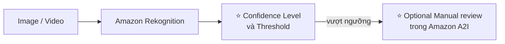

> ⭐⭐⭐ **Hai từ khóa độc quyền cần nhớ:**
> - ⭐⭐⭐ **Minimum Confidence Threshold** — bạn tự đặt ngưỡng
> - ⭐⭐⭐ **Amazon Augmented AI (A2I)** — dịch vụ để **con người xem lại thủ công**
>
> **Câu hỏi thi:** *"Lọc nội dung phản cảm trên nền tảng người dùng đăng ảnh, có bước con người duyệt lại"* → **Rekognition Content Moderation + A2I**.

---

## 254. Transcribe Overview

### ⭐⭐⭐ Amazon Transcribe

- ⭐⭐⭐ **TỰ ĐỘNG CHUYỂN GIỌNG NÓI THÀNH VĂN BẢN (speech to text)**
- ⭐⭐⭐ **Dùng quá trình deep learning gọi là AUTOMATIC SPEECH RECOGNITION (ASR)** để chuyển speech thành text **nhanh và chính xác**
- ⭐⭐⭐ **TỰ ĐỘNG LOẠI BỎ THÔNG TIN ĐỊNH DANH CÁ NHÂN (PII) bằng REDACTION**
- ⭐⭐⭐ **Hỗ trợ AUTOMATIC LANGUAGE IDENTIFICATION cho audio ĐA NGÔN NGỮ**

**⭐⭐⭐ Use cases:**

| Use case |
|---|
| ⭐⭐⭐ **Transcribe các cuộc gọi chăm sóc khách hàng** |
| ⭐⭐⭐ **Tự động tạo CLOSED CAPTIONING và SUBTITLING (phụ đề)** |
| ⭐⭐ **Sinh METADATA cho media assets để tạo kho lưu trữ TÌM KIẾM ĐƯỢC ĐẦY ĐỦ** |

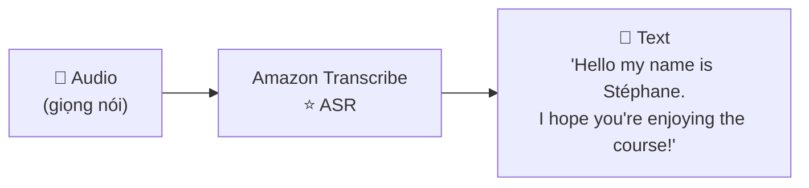

> ⭐⭐⭐ **Câu định vị:** **"Transcribe = AUDIO → TEXT."**
>
> ⭐⭐⭐ **Hai tính năng hay ra thi riêng:**
> - ⭐⭐⭐ **PII Redaction** — tự động che thông tin cá nhân (số thẻ, số điện thoại) trong bản ghi
> - ⭐⭐ **Automatic Language Identification** — tự nhận diện ngôn ngữ trong audio đa ngôn ngữ

---

## 255. Polly Overview

### ⭐⭐⭐ Amazon Polly

- ⭐⭐⭐ **BIẾN VĂN BẢN THÀNH GIỌNG NÓI NHƯ THẬT (lifelike speech) bằng deep learning**
- ⭐⭐⭐ **Cho phép tạo các ứng dụng BIẾT NÓI**

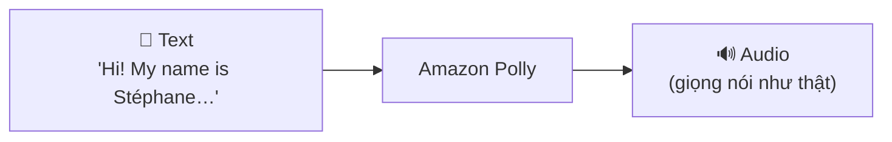

> ⭐⭐⭐ **Câu định vị:** **"Polly = TEXT → AUDIO."**
>
> ⚠️⭐⭐⭐ **BẪY THI KINH ĐIỂN: ĐỪNG NHẦM Polly VỚI Transcribe.**
> - **Transcribe** = **nghe** (audio → text)
> - **Polly** = **nói** (text → audio)
>
> 💡 **Mẹo nhớ:** **"Polly là con vẹt"** — vẹt thì **NÓI**. Transcribe có chữ "script" (bản chép) — **chép lại thành chữ**.

---

### ⭐⭐ Amazon Polly – Lexicon & SSML

**⭐⭐⭐ 1️⃣ Pronunciation Lexicons (từ điển phát âm):**

- ⭐⭐⭐ **TÙY BIẾN CÁCH PHÁT ÂM của từ**
- **Stylized words (từ viết kiểu lạ):** `St3ph4ne` ⇒ đọc là **"Stephane"**
- **Acronyms (từ viết tắt):** `AWS` ⇒ đọc là **"Amazon Web Services"**
- ⭐⭐ **Upload lexicons và dùng chúng trong thao tác `SynthesizeSpeech`**

**⭐⭐⭐ 2️⃣ SSML (Speech Synthesis Markup Language):**

- ⭐⭐⭐ **Sinh giọng nói từ VĂN BẢN THUẦN hoặc từ tài liệu được đánh dấu bằng SSML** — cho phép tùy biến nhiều hơn:

| Khả năng tùy biến |
|---|
| ⭐⭐ **NHẤN MẠNH từ hoặc cụm từ cụ thể** |
| ⭐⭐ **Dùng PHÁT ÂM PHIÊN ÂM (phonetic pronunciation)** |
| ⭐⭐ **Thêm TIẾNG THỞ, TIẾNG THÌ THẦM (breathing sounds, whispering)** |
| ⭐⭐ **Dùng PHONG CÁCH NGƯỜI DẪN BẢN TIN (Newscaster speaking style)** |

> ⭐⭐⭐ **Phân biệt hai công cụ (hay ra thi):**
>
> | Nhu cầu | Dùng gì |
> |---|---|
> | ⭐⭐⭐ **Đọc đúng tên riêng / từ viết tắt / từ viết kiểu lạ** | **Pronunciation Lexicons** |
> | ⭐⭐⭐ **Điều khiển ngữ điệu, nhấn nhá, tạm dừng, phong cách nói** | **SSML** |

---

## 256. Translate Overview

### ⭐⭐⭐ Amazon Translate

- ⭐⭐⭐ **DỊCH NGÔN NGỮ TỰ NHIÊN và CHÍNH XÁC**
- ⭐⭐⭐ **Cho phép BẢN ĐỊA HÓA NỘI DUNG (localize content) — như website và ứng dụng — cho người dùng QUỐC TẾ, và dịch KHỐI LƯỢNG LỚN văn bản một cách hiệu quả**

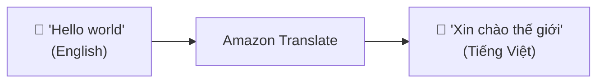

> ⭐⭐⭐ **Câu định vị:** **"Translate = DỊCH."** Bài ngắn nhất chương (1 phút) và cũng đơn giản nhất.
>
> ⭐⭐⭐ **Từ khóa nhận diện:** *"localize"*, *"international users"*, *"multi-language website"*, *"translate large volumes of text"* → **Amazon Translate**.

---

## 257. Lex + Connect Overview

### ⭐⭐⭐ Amazon Lex

- ⭐⭐⭐ **CÙNG CÔNG NGHỆ VỚI ALEXA** (same technology that powers Alexa)
- ⭐⭐⭐ **AUTOMATIC SPEECH RECOGNITION (ASR) để chuyển speech thành text**
- ⭐⭐⭐ **NATURAL LANGUAGE UNDERSTANDING để NHẬN RA Ý ĐỊNH (INTENT) của văn bản, của người gọi**
- ⭐⭐⭐ **Giúp xây dựng CHATBOTS, CALL CENTER BOTS**

---

### ⭐⭐⭐ Amazon Connect

- ⭐⭐⭐ **NHẬN CUỘC GỌI, tạo CONTACT FLOWS, là TRUNG TÂM TỔNG ĐÀI ẢO TRÊN CLOUD (cloud-based virtual contact center)**
- ⭐⭐ **Tích hợp được với các hệ thống CRM khác hoặc với AWS**
- ⭐⭐⭐ **KHÔNG TRẢ TRƯỚC (no upfront payments), RẺ HƠN 80% so với giải pháp contact center truyền thống**

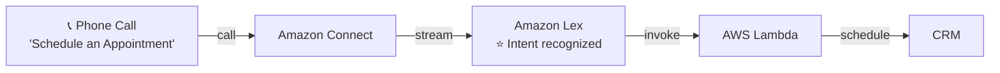

> ⭐⭐⭐ **Phân biệt hai dịch vụ — đề rất hay hỏi:**
>
> | | ⭐⭐⭐ **Amazon Lex** | ⭐⭐⭐ **Amazon Connect** |
> |---|---|---|
> | **Là gì** | **BỘ NÃO của chatbot** (hiểu ý định) | **TỔNG ĐÀI ẢO** (nhận và xử lý cuộc gọi) |
> | **Từ khóa** | **chatbot, intent, ASR, NLU, Alexa** | **contact center, call center, contact flow, CRM** |
> | **Con số** | — | ⭐⭐ **rẻ hơn 80%** |
>
> ⭐⭐⭐ **Chúng thường đi CÙNG NHAU:** Connect nhận cuộc gọi → Lex hiểu người gọi muốn gì → Lambda thực hiện hành động.

---

## 258. Comprehend Overview

### ⭐⭐⭐ Amazon Comprehend

- ⭐⭐⭐ **Dành cho NATURAL LANGUAGE PROCESSING — NLP (xử lý ngôn ngữ tự nhiên)**
- ⭐⭐⭐ **FULLY MANAGED và SERVERLESS service**
- ⭐⭐⭐ **Dùng machine learning để TÌM INSIGHTS và MỐI QUAN HỆ trong văn bản:**

| Khả năng |
|---|
| ⭐⭐⭐ **Xác định NGÔN NGỮ của văn bản** |
| ⭐⭐⭐ **TRÍCH XUẤT key phrases, places, people, brands, hoặc events** |
| ⭐⭐⭐ **HIỂU văn bản TÍCH CỰC hay TIÊU CỰC (sentiment)** |
| ⭐⭐ **PHÂN TÍCH văn bản bằng tokenization và parts of speech** |
| ⭐⭐⭐ **TỰ ĐỘNG SẮP XẾP một tập file văn bản THEO CHỦ ĐỀ (topic)** |

**⭐⭐⭐ Sample use cases:**

- ⭐⭐⭐ **Phân tích tương tác khách hàng (EMAILS) để tìm ra điều gì dẫn tới trải nghiệm TÍCH CỰC hay TIÊU CỰC**
- ⭐⭐ **Tạo và nhóm các bài viết theo CHỦ ĐỀ mà Comprehend tự khám phá ra**

> ⭐⭐⭐ **Câu định vị:** **"Comprehend = HIỂU VĂN BẢN (NLP)."**
>
> ⭐⭐⭐ **Từ khóa nhận diện mạnh nhất: "SENTIMENT ANALYSIS"** (phân tích cảm xúc — tích cực/tiêu cực). Thấy từ này → **Comprehend**.
>
> ⚠️ **Phân biệt với các dịch vụ khác:**
> - **Comprehend** = **HIỂU Ý NGHĨA** văn bản đã có
> - **Textract** = **ĐỌC CHỮ** từ tài liệu quét (chưa hiểu nghĩa)
> - **Kendra** = **TÌM KIẾM** trong tài liệu

---

## 259. Comprehend Medical Overview

### ⭐⭐⭐ Amazon Comprehend Medical

- ⭐⭐⭐ **PHÁT HIỆN và TRẢ VỀ thông tin hữu ích trong VĂN BẢN LÂM SÀNG KHÔNG CẤU TRÚC (unstructured clinical text):**

| Loại tài liệu |
|---|
| ⭐⭐ **Physician's notes** (ghi chú của bác sĩ) |
| ⭐⭐ **Discharge summaries** (tóm tắt xuất viện) |
| ⭐⭐ **Test results** (kết quả xét nghiệm) |
| ⭐⭐ **Case notes** (ghi chú ca bệnh) |

- ⭐⭐⭐ **Dùng NLP để phát hiện PROTECTED HEALTH INFORMATION (PHI) — API là `DetectPHI`**
- ⭐⭐⭐ **Lưu tài liệu trong AMAZON S3, phân tích dữ liệu real-time với KINESIS DATA FIREHOSE, hoặc dùng AMAZON TRANSCRIBE để chuyển lời kể của bệnh nhân thành văn bản rồi đưa cho Comprehend Medical phân tích**

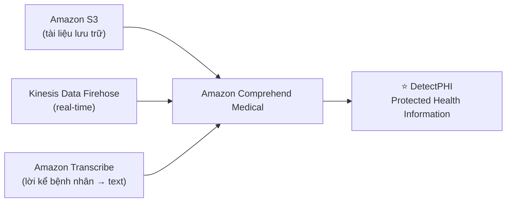

> ⭐⭐⭐ **Hai từ khóa độc quyền:**
> - ⭐⭐⭐ **PHI (Protected Health Information)** — thông tin sức khỏe được bảo vệ
> - ⭐⭐⭐ **`DetectPHI` API**
>
> ⭐⭐⭐ **Từ khóa nhận diện:** *"medical"*, *"clinical"*, *"patient"*, *"healthcare"*, *"HIPAA"*, *"PHI"* → **Comprehend Medical** (không phải Comprehend thường).
>
> ⭐⭐ **Kiến trúc ghép đáng nhớ:** **Transcribe → Comprehend Medical** (bác sĩ đọc, máy chép lại, rồi máy phân tích).

---

## 260. SageMaker AI Overview

### ⭐⭐⭐ Amazon SageMaker AI

- ⭐⭐⭐ **FULLY MANAGED service cho DEVELOPERS / DATA SCIENTISTS để XÂY DỰNG ML MODELS**
- ⭐⭐⭐ **Thông thường, RẤT KHÓ để làm tất cả các quy trình ở MỘT NƠI + phải provision servers**

**⭐⭐ Machine learning process (đơn giản hóa) — ví dụ dự đoán điểm thi của bạn:**

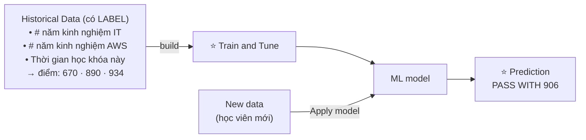

**Ba bước của quy trình ML:** ⭐⭐

1. ⭐⭐ **Historical Data có LABEL** (dữ liệu quá khứ đã biết kết quả)
2. ⭐⭐⭐ **BUILD → TRAIN AND TUNE → ra ML model**
3. ⭐⭐⭐ **APPLY MODEL lên dữ liệu mới → ra PREDICTION**

> ⭐⭐⭐ **Câu định vị:** **"SageMaker = TỰ XÂY DỰNG model ML của riêng bạn."**
>
> ⭐⭐⭐ **ĐÂY LÀ ĐIỂM PHÂN BIỆT QUAN TRỌNG NHẤT CỦA CẢ CHƯƠNG:**
>
> | Loại dịch vụ | Dịch vụ | Bạn phải làm gì |
> |---|---|---|
> | ⭐⭐⭐ **AI Services (dùng ngay)** | Rekognition, Transcribe, Polly, Translate, Lex, Comprehend, Textract, Kendra, Personalize | ✅ **Gọi API là xong — AWS đã train sẵn model** |
> | ⭐⭐⭐ **ML Platform (tự xây)** | **SageMaker** | ⚠️ **Bạn phải CHUẨN BỊ DỮ LIỆU, TRAIN, TUNE, DEPLOY model** |
>
> ⭐⭐⭐ **Đề thi hỏi:** *"Công ty muốn giải quyết bài toán ML ĐẶC THÙ mà không dịch vụ có sẵn nào làm được"* → **SageMaker**. Nếu bài toán là **nhận diện ảnh / chuyển giọng nói / dịch thuật thông thường** → **KHÔNG dùng SageMaker**, dùng dịch vụ AI có sẵn (nhanh hơn, rẻ hơn, không cần data scientist).

---

## 261. Kendra Overview

### ⭐⭐⭐ Amazon Kendra

- ⭐⭐⭐ **FULLY MANAGED DOCUMENT SEARCH SERVICE được hỗ trợ bởi Machine Learning**
- ⭐⭐⭐ **TRÍCH XUẤT CÂU TRẢ LỜI TỪ BÊN TRONG một tài liệu (text, PDF, HTML, PowerPoint, MS Word, FAQs…)**
- ⭐⭐⭐ **Khả năng TÌM KIẾM BẰNG NGÔN NGỮ TỰ NHIÊN (natural language search)**
- ⭐⭐⭐ **HỌC TỪ TƯƠNG TÁC/PHẢN HỒI của người dùng để ưu tiên kết quả được ưa thích — INCREMENTAL LEARNING**
- ⭐⭐ **Khả năng TINH CHỈNH THỦ CÔNG kết quả tìm kiếm** (độ quan trọng của dữ liệu, độ mới, tùy chỉnh…)

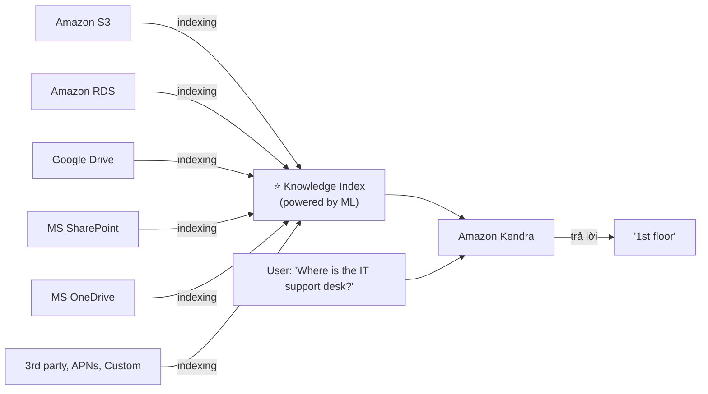

> ⭐⭐⭐ **Câu định vị:** **"Kendra = TÌM KIẾM TÀI LIỆU bằng ngôn ngữ tự nhiên, TRẢ VỀ CÂU TRẢ LỜI."**
>
> ⭐⭐⭐ **PHÂN BIỆT KENDRA vs OPENSEARCH — câu hỏi thi rất hay:**
>
> | | ⭐⭐⭐ **Amazon Kendra** | ⭐⭐⭐ **Amazon OpenSearch** |
> |---|---|---|
> | **Tìm gì** | ⭐⭐⭐ **TÀI LIỆU (PDF, Word, PowerPoint, FAQ…)** | **Dữ liệu JSON, log** |
> | **Cách hỏi** | ⭐⭐⭐ **NGÔN NGỮ TỰ NHIÊN** ("Bàn hỗ trợ IT ở đâu?") | **Cú pháp query, keyword** |
> | **Trả về** | ⭐⭐⭐ **CÂU TRẢ LỜI cụ thể** ("Tầng 1") | **Danh sách document khớp** |
> | **ML** | ⭐⭐⭐ **Có — Incremental Learning** | Không học từ người dùng |
> | **Use case** | **Tìm kiếm nội bộ doanh nghiệp, FAQ** | **Log analytics, search engine** |
>
> ⭐⭐⭐ **Từ khóa: "natural language question"** và **"enterprise document search"** → **Kendra**.

---

## 262. Personalize Overview

### ⭐⭐⭐ Amazon Personalize

- ⭐⭐⭐ **FULLY MANAGED ML-SERVICE để xây ứng dụng có GỢI Ý CÁ NHÂN HÓA THỜI GIAN THỰC (real-time personalized recommendations)**
- ⭐⭐ **Ví dụ: gợi ý sản phẩm cá nhân hóa / xếp hạng lại, direct marketing tùy chỉnh**
- ⭐⭐ **Ví dụ: người dùng mua dụng cụ làm vườn → gợi ý món tiếp theo nên mua**
- ⭐⭐⭐ **CÙNG CÔNG NGHỆ MÀ AMAZON.COM ĐANG DÙNG**
- ⭐⭐ **Tích hợp vào website, ứng dụng, SMS, hệ thống email marketing sẵn có…**
- ⭐⭐⭐ **Triển khai TRONG VÀI NGÀY, không phải vài tháng** (bạn **KHÔNG cần build, train và deploy ML solution**)
- ⭐⭐ **Use cases: cửa hàng bán lẻ, truyền thông và giải trí…**

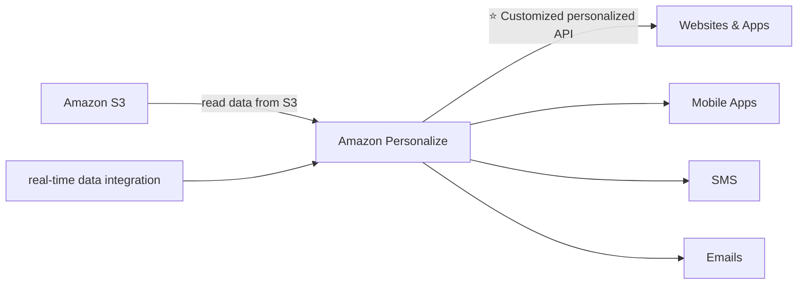

> ⭐⭐⭐ **Câu định vị:** **"Personalize = HỆ THỐNG GỢI Ý (recommendation) như Amazon.com."**
>
> ⭐⭐⭐ **Từ khóa nhận diện:** *"recommendation"*, *"personalized"*, *"users who bought X also bought Y"*, *"re-ranking"* → **Amazon Personalize**.
>
> ⚠️ **Phân biệt với Neptune (chương 21):** Neptune cũng có use case **"recommendation engine"**, nhưng:
> - **Personalize** = **dịch vụ ML CÓ SẴN**, gọi API là xong
> - **Neptune** = **CƠ SỞ DỮ LIỆU ĐỒ THỊ**, bạn tự xây thuật toán gợi ý dựa trên quan hệ
>
> Đề nói *"triển khai nhanh, không cần data scientist"* → **Personalize**.

---

## 263. Textract Overview

### ⭐⭐⭐ Amazon Textract

- ⭐⭐⭐ **TỰ ĐỘNG TRÍCH XUẤT TEXT, CHỮ VIẾT TAY (handwriting), và DỮ LIỆU từ BẤT KỲ TÀI LIỆU ĐƯỢC QUÉT nào bằng AI và ML**
- ⭐⭐⭐ **Trích xuất dữ liệu từ FORMS và TABLES (biểu mẫu và bảng)**
- ⭐⭐⭐ **Đọc và xử lý MỌI LOẠI TÀI LIỆU (PDFs, images, …)**

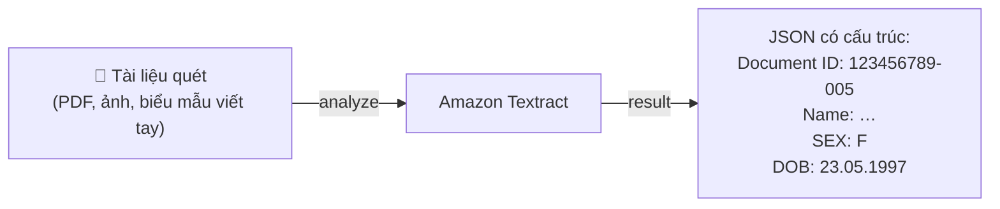

**⭐⭐⭐ Use cases:**

| Lĩnh vực | Ví dụ |
|---|---|
| ⭐⭐⭐ **Financial Services** | **hóa đơn, báo cáo tài chính** |
| ⭐⭐⭐ **Healthcare** | **hồ sơ y tế, yêu cầu bảo hiểm** |
| ⭐⭐⭐ **Public Sector** | **tờ khai thuế, giấy tờ tùy thân, hộ chiếu** |

> ⭐⭐⭐ **Câu định vị:** **"Textract = ĐỌC CHỮ từ tài liệu quét (OCR thông minh)."**
>
> ⭐⭐⭐ **PHÂN BIỆT BA DỊCH VỤ DỄ NHẦM NHẤT CHƯƠNG:**
>
> | Dịch vụ | Làm gì | Đầu vào |
> |---|---|---|
> | ⭐⭐⭐ **Textract** | **TRÍCH XUẤT chữ và dữ liệu có cấu trúc (form, table)** | **Tài liệu quét, PDF, ảnh chụp giấy tờ** |
> | ⭐⭐⭐ **Rekognition (Text Detection)** | **Phát hiện chữ TRONG ẢNH/VIDEO** (biển báo, biển số xe) | **Ảnh và video thông thường** |
> | ⭐⭐⭐ **Comprehend** | **HIỂU Ý NGHĨA của văn bản** | **Văn bản đã có sẵn dạng chữ** |
>
> ⭐⭐⭐ **Mẹo:** đề nhắc **"scanned document"**, **"form"**, **"table"**, **"handwriting"**, **"invoice"**, **"passport"** → **Textract**. Đề nhắc **"image"**, **"video"** → **Rekognition**.
>
> ⭐⭐ **Kiến trúc ghép hay gặp:** **Textract → Comprehend** (đọc chữ ra trước, rồi mới phân tích ý nghĩa).

---

## 264. Machine Learning Summary

### ⭐⭐⭐ AWS Machine Learning - Summary — BẢNG HỌC THUỘC

Đây là **slide tổng kết toàn bộ chương** — nếu chỉ học một thứ trong file này, **hãy học bảng này**:

| # | Dịch vụ | Câu chốt (nguyên văn slide) |
|---|---|---|
| 1 | ⭐⭐⭐ **Rekognition** | **face detection, labeling, celebrity recognition** |
| 2 | ⭐⭐⭐ **Transcribe** | **audio to text** (ví dụ: subtitles) |
| 3 | ⭐⭐⭐ **Polly** | **text to audio** |
| 4 | ⭐⭐⭐ **Translate** | **translations** |
| 5 | ⭐⭐⭐ **Lex** | **build conversational bots — chatbots** |
| 6 | ⭐⭐⭐ **Connect** | **cloud contact center** |
| 7 | ⭐⭐⭐ **Comprehend** | **natural language processing** |
| 8 | ⭐⭐⭐ **SageMaker** | **machine learning for every developer and data scientist** |
| 9 | ⭐⭐⭐ **Kendra** | **ML-powered search engine** |
| 10 | ⭐⭐⭐ **Personalize** | **real-time personalized recommendations** |
| 11 | ⭐⭐⭐ **Textract** | **detect text and data in documents** |

---

### 🧭 Sơ đồ phân loại theo giác quan ⭐⭐⭐

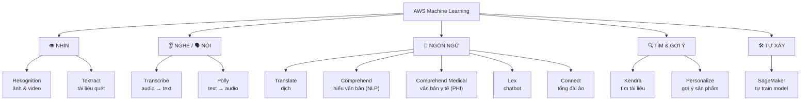

---

### 📌 Cheat Sheet từ khóa → dịch vụ ⭐⭐⭐

| Từ khóa trong đề | Đáp án |
|---|---|
| *"image", "video", "face", "object", "celebrity"* | **Rekognition** |
| *"nội dung phản cảm, kiểm duyệt ảnh"* | **Rekognition Content Moderation** (+ **A2I** nếu cần người duyệt) |
| *"audio to text", "subtitles", "closed captioning", "transcribe calls"* | **Transcribe** |
| *"che thông tin cá nhân trong bản ghi âm"* | **Transcribe PII Redaction** |
| *"text to speech", "ứng dụng biết nói"* | **Polly** |
| *"đọc đúng tên riêng / từ viết tắt"* | **Polly Pronunciation Lexicons** |
| *"điều khiển ngữ điệu, nhấn nhá, thì thầm"* | **Polly SSML** |
| *"dịch website sang nhiều ngôn ngữ", "localize"* | **Translate** |
| *"chatbot", "intent", "công nghệ của Alexa"* | **Lex** |
| *"contact center", "call center trên cloud", "rẻ hơn 80%"* | **Connect** |
| *"sentiment analysis", "NLP", "phân tích email khách hàng"* | **Comprehend** |
| *"clinical text", "patient", "PHI", "DetectPHI"* | **Comprehend Medical** |
| *"tự train model ML cho bài toán đặc thù"* | **SageMaker** |
| *"tìm kiếm tài liệu bằng câu hỏi tự nhiên", "enterprise search"* | **Kendra** |
| *"recommendation", "gợi ý sản phẩm real-time"* | **Personalize** |
| *"scanned document", "form", "table", "handwriting", "invoice", "passport"* | **Textract** |
| *"cần con người duyệt lại kết quả ML"* | **Amazon Augmented AI (A2I)** |

---

## Trắc nghiệm 20: Machine Learning Quiz

### Các điểm dễ bị bẫy

| Câu hỏi thường gặp | Đáp án đúng | Vì sao đáp án khác sai |
|---|---|---|
| Nhận diện khuôn mặt trong ảnh? | ⭐⭐⭐ **Rekognition** | |
| Nhận diện người nổi tiếng? | **Rekognition — Celebrity Recognition** | |
| Lọc nội dung phản cảm trên ảnh người dùng upload? | ⭐⭐⭐ **Rekognition Content Moderation** | |
| Cần con người duyệt lại nội dung bị gắn cờ? | ⭐⭐⭐ **Amazon Augmented AI (A2I)** | |
| Đặt ngưỡng để gắn cờ nội dung? | **Minimum Confidence Threshold** | |
| Chuyển audio thành text? | ⭐⭐⭐ **Transcribe** | ❌ Polly làm ngược lại |
| Tạo phụ đề tự động cho video? | ⭐⭐⭐ **Transcribe** (closed captioning, subtitling) | |
| Công nghệ deep learning Transcribe dùng? | **ASR — Automatic Speech Recognition** | |
| Che thông tin cá nhân trong bản ghi âm? | ⭐⭐⭐ **Transcribe PII Redaction** | |
| Audio nhiều ngôn ngữ, không biết trước ngôn ngữ nào? | **Transcribe Automatic Language Identification** | |
| Biến text thành giọng nói? | ⭐⭐⭐ **Polly** | ❌ Transcribe làm ngược lại |
| Làm Polly đọc đúng "AWS" thành "Amazon Web Services"? | ⭐⭐⭐ **Pronunciation Lexicons** | |
| Làm Polly nói theo phong cách người dẫn bản tin? | ⭐⭐⭐ **SSML** (Newscaster speaking style) | Lexicon chỉ chỉnh **phát âm từ** |
| Dịch website sang nhiều ngôn ngữ? | ⭐⭐⭐ **Translate** | |
| Xây chatbot hiểu ý định người dùng? | ⭐⭐⭐ **Lex** | |
| Lex dùng công nghệ giống sản phẩm nào? | **Alexa** | |
| Tổng đài chăm sóc khách hàng trên cloud? | ⭐⭐⭐ **Connect** | Lex chỉ là **bộ não chatbot** |
| Connect rẻ hơn giải pháp truyền thống bao nhiêu? | **80%**, không trả trước | |
| Phân tích email khách hàng xem tích cực hay tiêu cực? | ⭐⭐⭐ **Comprehend** (sentiment analysis) | |
| Comprehend làm gì? | **NLP — tìm insight, key phrases, sentiment, topic** | |
| Phân tích ghi chú bác sĩ, kết quả xét nghiệm? | ⭐⭐⭐ **Comprehend Medical** | Không phải Comprehend thường |
| API phát hiện thông tin sức khỏe được bảo vệ? | ⭐⭐⭐ **`DetectPHI`** | |
| Chuyển lời kể bệnh nhân thành text rồi phân tích? | ⭐⭐⭐ **Transcribe → Comprehend Medical** | |
| Bài toán ML đặc thù, không dịch vụ sẵn nào làm được? | ⭐⭐⭐ **SageMaker** | |
| Nhận diện ảnh thông thường — dùng SageMaker? | ❌ **KHÔNG — dùng Rekognition** | SageMaker cần tự train, tốn thời gian và cần data scientist |
| Ba bước của quy trình ML trong SageMaker? | **Historical data (có label) → Train and Tune → Apply model → Prediction** | |
| Tìm câu trả lời trong tài liệu nội bộ bằng câu hỏi tự nhiên? | ⭐⭐⭐ **Kendra** | |
| Kendra học từ phản hồi người dùng gọi là gì? | ⭐⭐⭐ **Incremental Learning** | |
| Kendra vs OpenSearch? | **Kendra: tài liệu + câu hỏi tự nhiên + trả lời cụ thể; OpenSearch: JSON/log + keyword** | |
| Gợi ý sản phẩm real-time như Amazon.com? | ⭐⭐⭐ **Personalize** | |
| Personalize mất bao lâu để triển khai? | **Vài NGÀY, không phải vài tháng** — không cần tự build/train/deploy | |
| Personalize vs Neptune cho recommendation? | **Personalize = dịch vụ có sẵn; Neptune = CSDL đồ thị tự xây thuật toán** | |
| Trích xuất dữ liệu từ hóa đơn quét, hộ chiếu, tờ khai thuế? | ⭐⭐⭐ **Textract** | |
| Textract đọc được chữ viết tay không? | ✅ **CÓ** (text, handwriting, forms, tables) | |
| Textract vs Rekognition Text Detection? | **Textract: tài liệu quét/form/table; Rekognition: chữ trong ảnh/video thông thường** | |
| Textract vs Comprehend? | **Textract ĐỌC CHỮ ra; Comprehend HIỂU Ý NGHĨA** | |

---

### Checklist tự kiểm tra trước khi làm quiz

- [ ] ⭐⭐⭐ **Thuộc bảng Summary bài 264** (11 dòng) — đây là thứ quan trọng nhất chương
- [ ] Nhớ cặp đối lập: **Transcribe (audio→text)** vs **Polly (text→audio)**
- [ ] Nhớ cặp đối lập: **Lex (bộ não chatbot)** vs **Connect (tổng đài ảo)**
- [ ] Nhớ bộ ba dễ nhầm: **Textract (đọc tài liệu quét)** vs **Rekognition (ảnh/video)** vs **Comprehend (hiểu nghĩa)**
- [ ] Nhớ **Comprehend Medical** cho văn bản y tế, API **`DetectPHI`**
- [ ] ⭐ Nhớ nguyên tắc lớn nhất: **dịch vụ AI có sẵn (gọi API) vs SageMaker (tự train)**
- [ ] Nhớ **Kendra = tìm tài liệu bằng ngôn ngữ tự nhiên**, có **Incremental Learning**
- [ ] Nhớ **Personalize = recommendation**, triển khai trong **vài ngày**
- [ ] Nhớ hai công cụ của Polly: **Lexicons (phát âm từ)** vs **SSML (ngữ điệu, phong cách)**
- [ ] Nhớ **Amazon Augmented AI (A2I)** = bước con người duyệt lại
- [ ] Nhớ **Transcribe PII Redaction** và **Automatic Language Identification**
- [ ] Đọc lại **Cheat Sheet từ khóa → dịch vụ** một lượt trước khi làm quiz

---

## Thuật ngữ Anh — Việt

| Tiếng Anh | Tiếng Việt |
|---|---|
| Machine Learning (ML) | Học máy |
| Artificial Intelligence (AI) | Trí tuệ nhân tạo |
| Deep learning | Học sâu |
| Amazon Rekognition | Dịch vụ nhận diện ảnh và video |
| Objects / People / Text / Scenes | Vật thể / người / chữ / khung cảnh |
| Facial analysis | Phân tích khuôn mặt |
| Facial search | Tìm kiếm theo khuôn mặt |
| User verification | Xác minh danh tính người dùng |
| People counting | Đếm số người |
| Familiar faces | Các khuôn mặt quen thuộc |
| Celebrity Recognition | Nhận diện người nổi tiếng |
| Labeling | Gắn nhãn cho nội dung |
| Content Moderation | Kiểm duyệt nội dung |
| Text Detection | Phát hiện chữ trong ảnh |
| Face Detection and Analysis | Phát hiện và phân tích khuôn mặt |
| Pathing | Theo dõi đường di chuyển |
| Inappropriate / offensive content | Nội dung không phù hợp / phản cảm |
| Broadcast media | Truyền thông phát sóng |
| Minimum Confidence Threshold | Ngưỡng tin cậy tối thiểu |
| Flag | Gắn cờ đánh dấu |
| Manual review | Xem xét lại thủ công |
| Amazon Augmented AI (A2I) | Dịch vụ đưa con người vào quy trình ML |
| Comply with regulations | Tuân thủ quy định pháp lý |
| Amazon Transcribe | Dịch vụ chuyển giọng nói thành văn bản |
| Speech to text | Giọng nói sang văn bản |
| Automatic Speech Recognition (ASR) | Nhận dạng giọng nói tự động |
| Personally Identifiable Information (PII) | Thông tin định danh cá nhân |
| Redaction | Che, bôi đen thông tin nhạy cảm |
| Automatic Language Identification | Tự động nhận diện ngôn ngữ |
| Multi-lingual audio | Âm thanh đa ngôn ngữ |
| Closed captioning / Subtitling | Phụ đề cho người khiếm thính / phụ đề |
| Media assets | Tài sản đa phương tiện |
| Searchable archive | Kho lưu trữ tìm kiếm được |
| Amazon Polly | Dịch vụ chuyển văn bản thành giọng nói |
| Text to speech | Văn bản sang giọng nói |
| Lifelike speech | Giọng nói giống người thật |
| Pronunciation lexicons | Từ điển tùy chỉnh cách phát âm |
| Stylized words | Từ viết kiểu cách điệu |
| Acronyms | Từ viết tắt |
| SynthesizeSpeech | Thao tác tổng hợp giọng nói |
| Speech Synthesis Markup Language (SSML) | Ngôn ngữ đánh dấu điều khiển giọng đọc |
| Emphasizing | Nhấn mạnh |
| Phonetic pronunciation | Phát âm theo phiên âm |
| Breathing sounds / whispering | Tiếng thở / tiếng thì thầm |
| Newscaster speaking style | Phong cách người dẫn bản tin |
| Amazon Translate | Dịch vụ dịch ngôn ngữ |
| Localize content | Bản địa hóa nội dung |
| International users | Người dùng quốc tế |
| Amazon Lex | Dịch vụ xây chatbot |
| Natural Language Understanding (NLU) | Hiểu ngôn ngữ tự nhiên |
| Intent | Ý định của người dùng |
| Chatbots / Call center bots | Bot trò chuyện / bot tổng đài |
| Amazon Connect | Tổng đài ảo trên cloud |
| Contact flows | Luồng xử lý cuộc gọi |
| Virtual contact center | Trung tâm liên lạc ảo |
| CRM (Customer Relationship Management) | Hệ thống quản lý quan hệ khách hàng |
| Upfront payments | Khoản trả trước |
| Amazon Comprehend | Dịch vụ xử lý ngôn ngữ tự nhiên |
| Natural Language Processing (NLP) | Xử lý ngôn ngữ tự nhiên |
| Insights | Hiểu biết rút ra từ dữ liệu |
| Key phrases | Cụm từ khóa quan trọng |
| Brands / Events | Thương hiệu / sự kiện |
| Sentiment | Sắc thái tình cảm (tích cực/tiêu cực) |
| Tokenization | Tách văn bản thành từ/đơn vị |
| Parts of speech | Từ loại trong câu |
| Topic | Chủ đề |
| Amazon Comprehend Medical | Comprehend chuyên cho văn bản y tế |
| Unstructured clinical text | Văn bản lâm sàng không cấu trúc |
| Physician's notes | Ghi chú của bác sĩ |
| Discharge summaries | Tóm tắt xuất viện |
| Test results | Kết quả xét nghiệm |
| Case notes | Ghi chú ca bệnh |
| Protected Health Information (PHI) | Thông tin sức khỏe được bảo vệ |
| DetectPHI API | API phát hiện thông tin sức khỏe |
| Patient narratives | Lời kể của bệnh nhân |
| Amazon SageMaker AI | Nền tảng xây dựng mô hình ML |
| Data scientists | Nhà khoa học dữ liệu |
| ML models | Mô hình học máy |
| Label | Nhãn (kết quả đã biết của dữ liệu) |
| Historical Data | Dữ liệu lịch sử |
| Train and Tune | Huấn luyện và tinh chỉnh mô hình |
| Apply model | Áp dụng mô hình lên dữ liệu mới |
| Prediction | Dự đoán |
| Amazon Kendra | Dịch vụ tìm kiếm tài liệu bằng ML |
| Document search service | Dịch vụ tìm kiếm trong tài liệu |
| Extract answers | Trích xuất câu trả lời |
| Natural language search | Tìm kiếm bằng ngôn ngữ tự nhiên |
| Incremental Learning | Học dần từ phản hồi người dùng |
| Fine-tune search results | Tinh chỉnh kết quả tìm kiếm |
| Freshness | Độ mới của dữ liệu |
| Knowledge Index | Chỉ mục tri thức |
| Data Sources | Các nguồn dữ liệu |
| Amazon Personalize | Dịch vụ gợi ý cá nhân hóa |
| Personalized recommendations | Gợi ý được cá nhân hóa |
| Re-ranking | Xếp hạng lại kết quả |
| Direct marketing | Tiếp thị trực tiếp |
| Real-time data integration | Tích hợp dữ liệu thời gian thực |
| Retail stores | Cửa hàng bán lẻ |
| Media and entertainment | Truyền thông và giải trí |
| Amazon Textract | Dịch vụ trích xuất chữ từ tài liệu |
| Handwriting | Chữ viết tay |
| Scanned documents | Tài liệu được quét |
| Forms and tables | Biểu mẫu và bảng biểu |
| Financial reports | Báo cáo tài chính |
| Insurance claims | Yêu cầu bồi thường bảo hiểm |
| Medical records | Hồ sơ y tế |
| Public Sector | Khu vực công |
| Tax forms | Tờ khai thuế |
| ID documents / passports | Giấy tờ tùy thân / hộ chiếu |
| Conversational bots | Bot hội thoại |
| ML-powered search engine | Công cụ tìm kiếm dùng học máy |

---

*Ghi chú: chương này **KHÔNG có bài Hands On nào**, **không có code kèm theo** và **không phát sinh chi phí** — cả 12 bài đều là slide giới thiệu, nên nội dung file bám sát 100% slide gốc (trang 560–574). ⭐ **Đây là chương DỄ NHẤT và NGẮN NHẤT của cả khóa học:** đề SAA-C03 **không hỏi kiến thức machine learning**, chỉ hỏi **"dịch vụ nào làm việc X"** — thuần túy nhận diện tên. **Nếu bạn sắp thi và thiếu thời gian, chỉ cần học thuộc bảng Summary ở bài 264** (11 dòng) cộng với **Cheat Sheet từ khóa** ở cuối chương. 💡 Các mục tôi bổ sung ngoài slide, đều có đánh dấu: **bảng phân biệt AI Services (gọi API là xong) vs SageMaker (tự train)** ở bài 260 — đây là nguyên tắc chọn dịch vụ quan trọng nhất chương; **bảng Kendra vs OpenSearch** ở bài 261; **bảng Textract vs Rekognition vs Comprehend** ở bài 263; và **so sánh Personalize vs Neptune** ở bài 262 (vì Neptune ở chương 21 cũng có use case "recommendation engine"). Ba bảng phân biệt này không có trên slide nhưng chính là chỗ đề thi hay bẫy.*
