# Phần 24 — AWS Monitoring & Audit: CloudWatch, CloudTrail & Config

> Khóa học: *Ultimate AWS Certified Solutions Architect Associate 2026* (Stéphane Maarek) — SAA-C03
> Nguồn tham chiếu: `AWS Certified Solutions Architect Slides v48.pdf` (phần "CloudWatch, CloudTrail & AWS Config")

---

## Mục lục

| # | Bài giảng | Thời lượng | Loại |
|---|-----------|-----------|------|
| 265 | [AWS Monitoring - Section Introduction](#265-aws-monitoring---section-introduction) | 1 phút | Video |
| 266 | [CloudWatch Metrics](#266-cloudwatch-metrics) | 4 phút | Video |
| 267 | [CloudWatch Logs](#267-cloudwatch-logs) | 6 phút | Video |
| 268 | [CloudWatch Logs - Hands On](#268-cloudwatch-logs---hands-on) | 9 phút | Video |
| 269 | [CloudWatch Logs - Live Tail - Hands On](#269-cloudwatch-logs---live-tail---hands-on) | 2 phút | Video |
| 270 | [CloudWatch Agent & CloudWatch Logs Agent](#270-cloudwatch-agent--cloudwatch-logs-agent) | 3 phút | Video |
| 271 | [CloudWatch Alarms](#271-cloudwatch-alarms) | 4 phút | Video |
| 272 | [CloudWatch Alarms Hands On](#272-cloudwatch-alarms-hands-on) | 5 phút | Video |
| 273 | [CloudWatch Network Synthetic Monitor](#273-cloudwatch-network-synthetic-monitor) | 1 phút | Video |
| 274 | [EventBridge Overview (formerly CloudWatch Events)](#274-eventbridge-overview-formerly-cloudwatch-events) | 7 phút | Video |
| 275 | [Amazon EventBridge - Hands On](#275-amazon-eventbridge---hands-on) | 6 phút | Video |
| 276 | [CloudWatch Insights and Operational Visibility](#276-cloudwatch-insights-and-operational-visibility) | 6 phút | Video |
| 277 | [CloudTrail Overview](#277-cloudtrail-overview) | 6 phút | Video |
| 278 | [CloudTrail Hands On](#278-cloudtrail-hands-on) | 2 phút | Video |
| 279 | [CloudTrail - EventBridge Integration](#279-cloudtrail---eventbridge-integration) | 2 phút | Video |
| 280 | [AWS Config - Overview](#280-aws-config---overview) | 5 phút | Video |
| 281 | [AWS Config - Hands On](#281-aws-config---hands-on) | 10 phút | Video |
| 282 | [CloudTrail vs CloudWatch vs Config](#282-cloudtrail-vs-cloudwatch-vs-config) | 2 phút | Video |
| — | [Trắc nghiệm 21: Monitoring & Auditing Quiz](#trắc-nghiệm-21-monitoring--auditing-quiz) | — | Quiz |

---

> 📌 **Đọc trước khi vào chương:** Đây là chương có **MỘT câu hỏi thi xuất hiện đi xuất hiện lại**: phân biệt **CloudWatch vs CloudTrail vs Config**. Bài 282 chỉ dài 2 phút nhưng là **bài quan trọng nhất chương**.
>
> ⭐⭐⭐ **Ba câu chốt để nhớ cả chương:**
> - **CloudWatch = HIỆU NĂNG** (metrics, logs, alarms — "máy đang chạy thế nào?")
> - **CloudTrail = AI LÀM GÌ** (API calls — "ai đã xóa cái này?")
> - **Config = CẤU HÌNH THAY ĐỔI RA SAO** (compliance — "security group này có bị mở SSH không?")

---

## 265. AWS Monitoring - Section Introduction

> 🎬 Bài giới thiệu 1 phút — **không có slide nội dung**.

Stéphane giới thiệu ba trụ cột của **monitoring & audit** trên AWS mà chương này sẽ đi qua:

| Dịch vụ | Trả lời câu hỏi |
|---|---|
| ⭐⭐⭐ **Amazon CloudWatch** | **"Hệ thống của tôi đang chạy thế nào?"** — metrics, logs, alarms, dashboards |
| ⭐⭐⭐ **AWS CloudTrail** | **"Ai đã làm gì trong tài khoản của tôi?"** — lịch sử API calls |
| ⭐⭐⭐ **AWS Config** | **"Cấu hình tài nguyên đã thay đổi ra sao, có tuân thủ không?"** |

> ⭐⭐ **Vì sao SAA-C03 quan tâm chương này?** Solutions Architect phải thiết kế hệ thống **quan sát được (observable)** và **kiểm toán được (auditable)**. Đề thi hay cho tình huống sự cố rồi hỏi **"dùng dịch vụ nào để điều tra/phát hiện"**.

---

## 266. CloudWatch Metrics

### ⭐⭐⭐ Amazon CloudWatch Metrics

- ⭐⭐⭐ **CloudWatch cung cấp METRICS cho MỌI dịch vụ trong AWS**
- ⭐⭐⭐ **Metric là một BIẾN SỐ để giám sát** (`CPUUtilization`, `NetworkIn`…)
- ⭐⭐⭐ **Metrics thuộc về các NAMESPACES**
- ⭐⭐⭐ **Dimension là một THUỘC TÍNH của metric** (instance id, environment, v.v…)
- ⭐⭐⭐ **TỐI ĐA 30 DIMENSIONS cho mỗi metric**
- ⭐⭐ **Metrics có TIMESTAMPS**
- ⭐⭐ **Có thể tạo CLOUDWATCH DASHBOARDS của metrics**
- ⭐⭐⭐ **Có thể tạo CLOUDWATCH CUSTOM METRICS (ví dụ cho RAM)**

> ⭐⭐⭐ **BẪY THI KINH ĐIỂN NHẤT VỀ CLOUDWATCH:**
> **RAM (memory) KHÔNG phải metric mặc định của EC2!** Muốn theo dõi RAM phải dùng **Custom Metric** (qua **CloudWatch Unified Agent** — bài 270).
>
> ⭐⭐⭐ **Metric mặc định của EC2 (out-of-the-box):** **CPU, Network, Disk (mức cao)** — **KHÔNG có RAM**.
>
> ⭐⭐ **Con số phải nhớ: 30 dimensions/metric.**

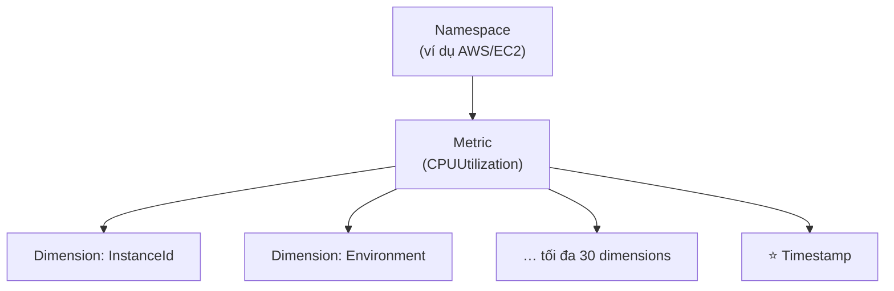

---

### ⭐⭐ CloudWatch Metric Streams

- ⭐⭐⭐ **LIÊN TỤC STREAM các CloudWatch metrics tới ĐÍCH BẠN CHỌN, với độ trễ THẤP và giao hàng GẦN THỜI GIAN THỰC (near-real-time)**

**Các đích đến:**

| Đích | Chi tiết |
|---|---|
| ⭐⭐⭐ **Amazon Kinesis Data Firehose** | **(và sau đó tới các đích của Firehose)** — S3, Redshift, Athena, OpenSearch |
| ⭐⭐ **3rd party service provider** | **Datadog, Dynatrace, New Relic, Splunk, Sumo Logic…** |

- ⭐⭐ **Có tùy chọn LỌC metrics để chỉ stream MỘT PHẦN**

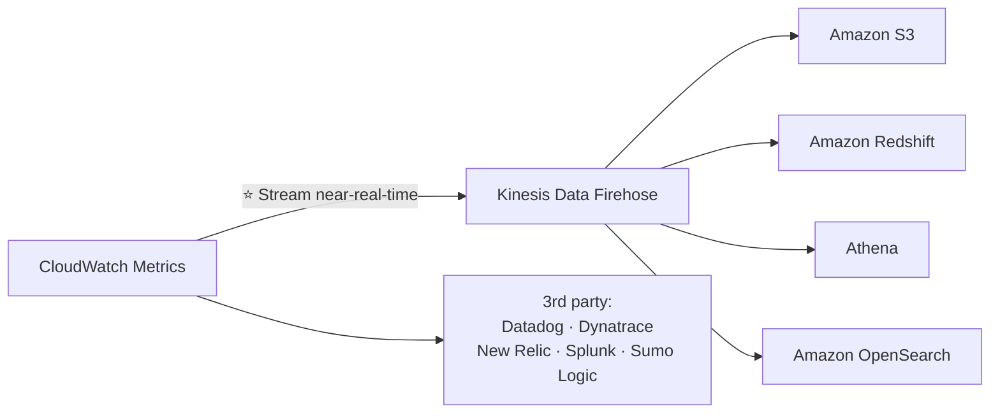

> ⭐⭐ **Từ khóa nhận diện:** *"đưa metrics ra ngoài AWS / vào data lake / vào công cụ giám sát bên thứ ba"* → **CloudWatch Metric Streams → Firehose**.

---

## 267. CloudWatch Logs

### ⭐⭐⭐ CloudWatch Logs — Cấu trúc

- ⭐⭐⭐ **Log groups: tên TÙY Ý, thường ĐẠI DIỆN CHO MỘT ỨNG DỤNG**
- ⭐⭐⭐ **Log stream: các INSTANCE trong ứng dụng / log files / containers**
- ⭐⭐⭐ **Có thể định nghĩa LOG EXPIRATION POLICIES (không bao giờ hết hạn, 1 NGÀY tới 10 NĂM…)**

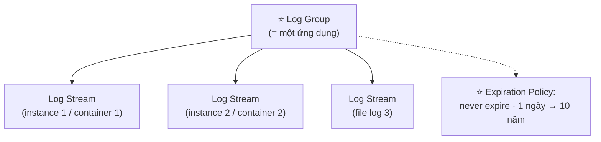

**⭐⭐⭐ CloudWatch Logs có thể GỬI log tới:**

| Đích |
|---|
| ⭐⭐⭐ **Amazon S3** (exports) |
| ⭐⭐⭐ **Kinesis Data Streams** |
| ⭐⭐⭐ **Kinesis Data Firehose** |
| ⭐⭐⭐ **AWS Lambda** |
| ⭐⭐⭐ **OpenSearch** |

- ⭐⭐⭐ **Logs được MÃ HÓA MẶC ĐỊNH**
- ⭐⭐ **Có thể thiết lập mã hóa dựa trên KMS với KEY CỦA BẠN**

---

### ⭐⭐⭐ CloudWatch Logs - Sources (nguồn log)

| Nguồn | Chi tiết |
|---|---|
| ⭐⭐⭐ **SDK, CloudWatch Logs Agent, CloudWatch Unified Agent** | |
| ⭐⭐ **Elastic Beanstalk** | **thu thập log từ ứng dụng** |
| ⭐⭐⭐ **ECS** | **thu thập từ containers** |
| ⭐⭐⭐ **AWS Lambda** | **thu thập từ function logs** |
| ⭐⭐⭐ **VPC Flow Logs** | **log riêng của VPC** |
| ⭐⭐ **API Gateway** | |
| ⭐⭐⭐ **CloudTrail** | **dựa trên filter** |
| ⭐⭐ **Route 53** | **Log DNS queries** |

---

### ⭐⭐⭐ CloudWatch Logs Insights

- ⭐⭐⭐ **TÌM KIẾM và PHÂN TÍCH dữ liệu log lưu trong CloudWatch Logs**
- ⭐⭐ **Ví dụ: tìm một IP cụ thể trong log, đếm số lần xuất hiện "ERROR"…**
- ⭐⭐⭐ **Cung cấp một NGÔN NGỮ TRUY VẤN CHUYÊN DỤNG (purpose-built query language)**
- ⭐⭐ **TỰ ĐỘNG PHÁT HIỆN các trường từ dịch vụ AWS và từ JSON log events**
- ⭐⭐ **Lấy trường mong muốn, lọc theo điều kiện, tính thống kê tổng hợp, sắp xếp, giới hạn số event…**
- ⭐⭐ **Có thể LƯU query và thêm vào CloudWatch Dashboards**
- ⭐⭐⭐ **Có thể query NHIỀU Log Group ở NHIỀU TÀI KHOẢN AWS khác nhau**
- ⚠️⭐⭐⭐ **NÓ LÀ QUERY ENGINE, KHÔNG PHẢI REAL-TIME ENGINE**

> ⭐⭐⭐ **Dòng cuối là điểm ra thi:** cần **real-time** → dùng **Logs Subscriptions** (hoặc **Live Tail**, bài 269), **KHÔNG phải** Logs Insights.

**Ví dụ cú pháp Logs Insights (bổ sung ngoài slide):**

```
fields @timestamp, @message
| filter @message like /ERROR/
| sort @timestamp desc
| limit 20
```

---

### ⭐⭐⭐ CloudWatch Logs – S3 Export

- ⚠️⭐⭐⭐ **Dữ liệu log có thể mất TỚI 12 GIỜ mới sẵn sàng để export**
- ⭐⭐⭐ **API call là `CreateExportTask`**
- ⚠️⭐⭐⭐ **KHÔNG phải near-real-time hay real-time… hãy dùng LOGS SUBSCRIPTIONS thay thế**

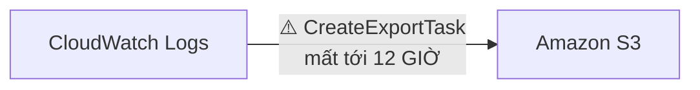

> ⭐⭐⭐ **Con số 12 GIỜ và tên API `CreateExportTask` đều ra thi.** Đề hay hỏi: *"cần đưa log sang S3 gần thời gian thực"* → **KHÔNG dùng S3 Export, dùng Subscription Filter → Firehose → S3**.

---

### ⭐⭐⭐ CloudWatch Logs Subscriptions

- ⭐⭐⭐ **Lấy log events THỜI GIAN THỰC từ CloudWatch Logs để xử lý và phân tích**
- ⭐⭐⭐ **Gửi tới: KINESIS DATA STREAMS, KINESIS DATA FIREHOSE, hoặc LAMBDA**
- ⭐⭐⭐ **SUBSCRIPTION FILTER — lọc xem log nào được giao tới đích của bạn**

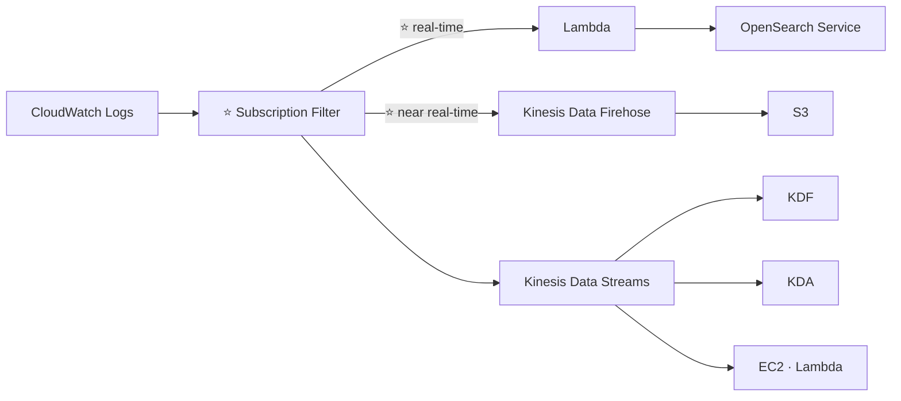

> ⭐⭐⭐ **QUY TẮC VÀNG (giống chương 22):** **Lambda = REAL-TIME; Firehose = NEAR REAL-TIME.**

---

### ⭐⭐ CloudWatch Logs Aggregation — Multi-Account & Multi-Region

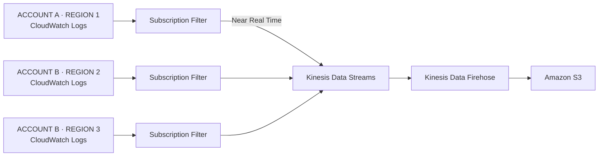

> ⭐⭐⭐ **Từ khóa:** *"gom log từ NHIỀU TÀI KHOẢN và NHIỀU REGION về một chỗ"* → **Subscription Filters → Kinesis Data Streams → Firehose → S3**.

---

### ⭐⭐ Cross-Account Subscription

- ⭐⭐⭐ **Gửi log events tới tài nguyên ở MỘT TÀI KHOẢN AWS KHÁC (KDS, KDF)**

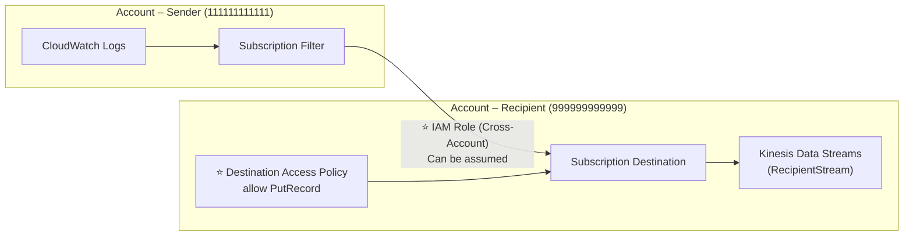

**Ba thành phần phải có:** ⭐⭐

1. ⭐⭐⭐ **IAM Role (Cross-Account)** — bên gửi assume được
2. ⭐⭐⭐ **Subscription Destination** ở tài khoản nhận
3. ⭐⭐⭐ **Destination Access Policy** — cho phép `PutRecord`

---

## 268. CloudWatch Logs - Hands On

> 🖐️ Bài Hands On — **không có slide**. Các bước Console.

### Bước 1 — Xem Log Groups

1. Console → tìm **CloudWatch** → **Logs** → **Log groups**
2. Nếu đã làm các chương trước, bạn sẽ thấy sẵn:
   - ⭐ `/aws/lambda/<tên-function>` — log của Lambda (chương 19)
   - ⭐ `/ecs/<tên-task>` — log của ECS (chương 18)
3. Bấm vào một log group → thấy danh sách **Log streams**
4. Bấm vào một log stream → thấy từng dòng log kèm timestamp

### Bước 2 — Cấu hình Retention ⭐⭐⭐

1. Chọn log group → **Actions** → ⭐ **Edit retention setting**
2. Chọn giá trị:

| Lựa chọn | Ghi chú |
|---|---|
| ⚠️⭐⭐⭐ **Never expire** | **MẶC ĐỊNH — log giữ MÃI MÃI và TÍNH TIỀN MÃI MÃI** |
| ⭐ **1 day → 10 years** | 1, 3, 5, 7, 14, 30, 60, 90, 120, 150, 180, 365, 400, 545, 731, 1096, 1827, 2192, 2557, 2922, 3288, 3653 ngày |

> ⚠️⭐⭐⭐ **Đây là cái bẫy chi phí lớn nhất của CloudWatch Logs:** mặc định là **Never expire**. Log Lambda/ECS tích tụ nhiều năm sẽ tốn tiền lưu trữ. **Luôn đặt retention** cho môi trường học tập (ví dụ 1 ngày).

### Bước 3 — Dùng CloudWatch Logs Insights ⭐⭐⭐

1. **Logs** → ⭐ **Logs Insights**
2. **Select log group(s)**: chọn một hoặc nhiều log group
3. Nhập query và bấm **Run query**:

```
fields @timestamp, @message
| sort @timestamp desc
| limit 20
```

**Các query mẫu hữu ích:**

```
# Đếm số lỗi
fields @timestamp, @message
| filter @message like /ERROR/
| stats count() as errorCount

# Tìm theo IP cụ thể
fields @timestamp, @message
| filter @message like /192.168.1.1/

# Với Lambda: thống kê thời lượng
filter @type = "REPORT"
| stats avg(@duration), max(@duration), min(@duration)

# Lọc theo trường JSON (tự động phát hiện)
fields @timestamp, level, msg
| filter level = "error"
| sort @timestamp desc
```

4. ⭐ Bấm **Save** để lưu query, hoặc **Add to dashboard**

### Bước 4 — Tạo Metric Filter ⭐⭐⭐

**Metric Filter** biến **log text** thành **CloudWatch Metric** để có thể đặt Alarm (dùng ở bài 271):

1. Chọn log group → tab **Metric filters** → **Create metric filter**
2. **Filter pattern**: `ERROR` (hoặc `?ERROR ?Error ?error` để bắt nhiều dạng)
3. **Test pattern** → xem dòng nào khớp
4. **Next** → đặt:
   - **Filter name**: `ErrorCount`
   - ⭐ **Metric namespace**: `MyApp`
   - ⭐ **Metric name**: `ErrorCount`
   - ⭐ **Metric value**: `1`
   - **Default value**: `0`
5. **Create metric filter**

> ⭐⭐⭐ **Metric Filter là cầu nối giữa Logs và Alarms.** Đề hỏi *"cảnh báo khi log xuất hiện từ ERROR"* → **Metric Filter → CloudWatch Alarm → SNS**.

### CLI hữu ích

```bash
# Liệt kê log groups
aws logs describe-log-groups

# Đặt retention 1 ngày (⭐ tránh tốn tiền)
aws logs put-retention-policy --log-group-name /aws/lambda/demo-lambda --retention-in-days 1

# Xem log theo thời gian thực
aws logs tail /aws/lambda/demo-lambda --follow

# Chạy Logs Insights query
aws logs start-query \
  --log-group-name /aws/lambda/demo-lambda \
  --start-time $(date -d '1 hour ago' +%s) \
  --end-time $(date +%s) \
  --query-string 'fields @timestamp, @message | filter @message like /ERROR/ | limit 20'

aws logs get-query-results --query-id <id>
```

---

## 269. CloudWatch Logs - Live Tail - Hands On

> 🖐️ Bài Hands On — **không có slide**. Tính năng tương đối mới của AWS.

### ⭐⭐⭐ Live Tail là gì?

- ⭐⭐⭐ **Xem log events chảy vào THEO THỜI GIAN THỰC ngay trên Console** — giống lệnh `tail -f` trên Linux
- ⭐⭐ Giải quyết đúng điểm yếu mà bài 267 nêu: **Logs Insights là query engine, không phải real-time engine**

### Các bước

1. CloudWatch → **Logs** → ⭐ **Live Tail**
2. **Select log groups**: chọn một hoặc nhiều log group (có thể **nhiều group cùng lúc**)
3. (Tùy chọn) **Select log streams**: lọc xuống stream cụ thể
4. (Tùy chọn) ⭐ **Add filter pattern**: ví dụ `ERROR` — chỉ hiện dòng khớp
5. Bấm ⭐ **Start** → log bắt đầu chảy ngay trên màn hình
6. Bấm vào một dòng để **highlight** và xem chi tiết
7. Bấm **Stop** khi xong

### ⭐⭐ Ba cách xem log real-time — so sánh

| Cách | Đặc điểm |
|---|---|
| ⭐⭐⭐ **Live Tail (Console)** | **Xem ngay trên trình duyệt, không cần setup, có filter pattern** |
| ⭐⭐ **`aws logs tail --follow` (CLI)** | Tương tự nhưng trên terminal |
| ⭐⭐⭐ **Subscription Filter → Lambda** | **Để XỬ LÝ TỰ ĐỘNG real-time**, không phải để người xem |

> ⚠️⭐⭐ **CHI PHÍ:** Live Tail tính phí **theo phút sử dụng** (~$0.01/phút). Nhớ bấm **Stop** sau khi xem xong — đừng để tab mở cả ngày.

---

## 270. CloudWatch Agent & CloudWatch Logs Agent

### ⭐⭐⭐ CloudWatch Logs for EC2

- ⚠️⭐⭐⭐ **MẶC ĐỊNH, KHÔNG CÓ LOG NÀO từ máy EC2 của bạn đi tới CloudWatch**
- ⭐⭐⭐ **Bạn PHẢI CHẠY MỘT CLOUDWATCH AGENT trên EC2 để đẩy các file log bạn muốn**
- ⭐⭐⭐ **Đảm bảo IAM PERMISSIONS ĐÚNG**
- ⭐⭐⭐ **CloudWatch log agent CŨNG CÀI ĐƯỢC TRÊN ON-PREMISES**

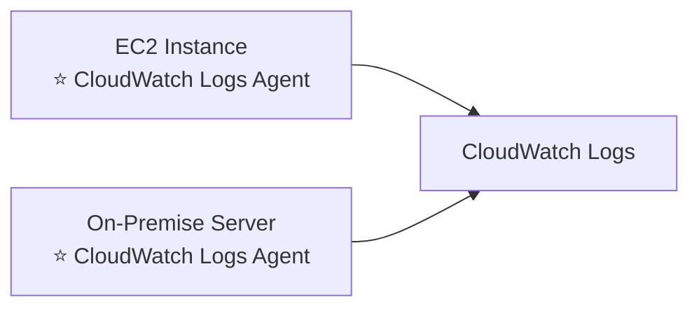

> ⭐⭐⭐ **Câu hỏi thi:** *"Không thấy log ứng dụng của EC2 trong CloudWatch, vì sao?"* → **Chưa cài agent**, hoặc **IAM role của EC2 thiếu quyền**.

---

### ⭐⭐⭐ CloudWatch Logs Agent & Unified Agent — BẢNG SO SÁNH

Cả hai đều dành cho **virtual servers (EC2 instances, on-premises servers…)**:

| | ⭐⭐⭐ **CloudWatch Logs Agent** | ⭐⭐⭐ **CloudWatch Unified Agent** |
|---|---|---|
| **Tình trạng** | ⚠️ **PHIÊN BẢN CŨ của agent** | ✅ **Phiên bản mới, khuyến nghị** |
| **Gửi được gì** | ⚠️⭐⭐⭐ **CHỈ gửi được tới CloudWatch LOGS** | ⭐⭐⭐ **Thu thập THÊM SYSTEM-LEVEL METRICS như RAM, processes, v.v…**<br/>⭐⭐⭐ **VÀ thu thập logs gửi tới CloudWatch Logs** |
| **Cấu hình** | — | ⭐⭐⭐ **CẤU HÌNH TẬP TRUNG bằng SSM PARAMETER STORE** |

> ⭐⭐⭐ **ĐÂY LÀ CÂU HỎI THI RẤT PHỔ BIẾN.** Đề nói *"cần giám sát RAM / processes của EC2"* → **CloudWatch Unified Agent** (Logs Agent cũ **không làm được**).
>
> ⭐⭐ **Và nhớ: cấu hình tập trung qua SSM Parameter Store** — chi tiết đặc trưng của Unified Agent.

---

### ⭐⭐⭐ CloudWatch Unified Agent – Metrics

**Thu thập TRỰC TIẾP trên Linux server / EC2 instance:**

| Nhóm metric | Chi tiết |
|---|---|
| ⭐⭐ **CPU** | **active, guest, idle, system, user, steal** |
| ⭐⭐ **Disk metrics** | **free, used, total** — **Disk IO**: writes, reads, bytes, iops |
| ⭐⭐⭐ **RAM** | **free, inactive, used, total, cached** |
| ⭐⭐ **Netstat** | **số kết nối TCP và UDP, net packets, bytes** |
| ⭐⭐ **Processes** | **total, dead, blocked, idle, running, sleep** |
| ⭐⭐ **Swap Space** | **free, used, used %** |

> ⭐⭐⭐ **Reminder in thẳng trên slide:** **metrics out-of-the-box của EC2 chỉ có DISK, CPU, NETWORK (mức cao)** — **KHÔNG có RAM**.
>
> 💡 **Mẹo nhớ:** EC2 là **máy ảo** — AWS nhìn thấy CPU/disk/network từ **bên ngoài hypervisor**, nhưng **RAM đang dùng bao nhiêu thì chỉ HỆ ĐIỀU HÀNH BÊN TRONG mới biết** → phải cài agent.

---

## 271. CloudWatch Alarms

### ⭐⭐⭐ CloudWatch Alarms

- ⭐⭐⭐ **Alarms dùng để KÍCH HOẠT THÔNG BÁO cho BẤT KỲ metric nào**
- ⭐⭐ **Nhiều tùy chọn (sampling, %, max, min, v.v…)**

**⭐⭐⭐ Alarm States (3 trạng thái — RA THI):**

| State | Ý nghĩa |
|---|---|
| ⭐⭐⭐ **`OK`** | Metric **trong ngưỡng cho phép** |
| ⭐⭐⭐ **`INSUFFICIENT_DATA`** | **KHÔNG đủ dữ liệu để đánh giá** |
| ⭐⭐⭐ **`ALARM`** | Metric **vượt ngưỡng** |

**⭐⭐⭐ Period:**

- ⭐⭐⭐ **Độ dài thời gian (tính bằng GIÂY) để đánh giá metric**
- ⭐⭐⭐ **High resolution custom metrics: 10 GIÂY, 30 GIÂY hoặc BỘI SỐ CỦA 60 GIÂY**

> ⭐⭐⭐ **Ba trạng thái và con số 10/30/60 giây đều ra thi.**

---

### ⭐⭐⭐ CloudWatch Alarm Targets (3 đích)

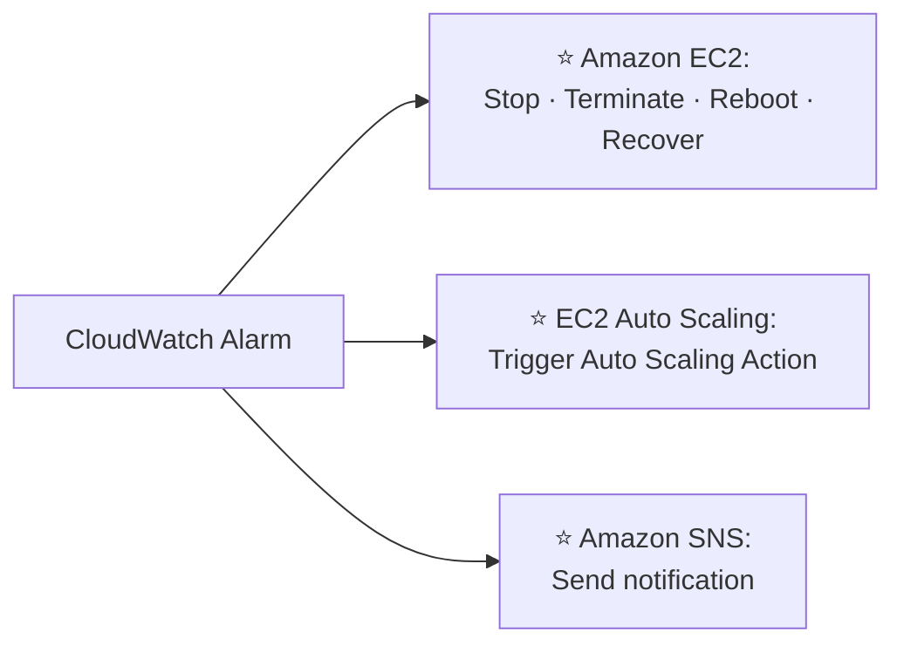

| Đích | Chi tiết |
|---|---|
| ⭐⭐⭐ **EC2 Instance** | **STOP, TERMINATE, REBOOT, hoặc RECOVER một EC2 Instance** |
| ⭐⭐⭐ **Auto Scaling** | **Trigger Auto Scaling Action** |
| ⭐⭐⭐ **SNS** | **Gửi notification tới SNS (từ đó bạn làm được gần như MỌI THỨ)** |

> ⭐⭐⭐ **Dòng SNS là chìa khóa mở rộng:** Alarm → SNS → Lambda → làm bất cứ gì. Đề hay hỏi *"tự động xử lý khi alarm kích hoạt"* → **SNS + Lambda**.

---

### ⭐⭐⭐ CloudWatch Alarms – Composite Alarms

- ⭐⭐⭐ **CloudWatch Alarms thường CHỈ trên MỘT metric**
- ⭐⭐⭐ **COMPOSITE ALARMS giám sát TRẠNG THÁI CỦA NHIỀU ALARM KHÁC**
- ⭐⭐⭐ **Điều kiện AND và OR**
- ⭐⭐⭐ **Hữu ích để GIẢM "ALARM NOISE" (tiếng ồn cảnh báo) bằng cách tạo composite alarm phức tạp**

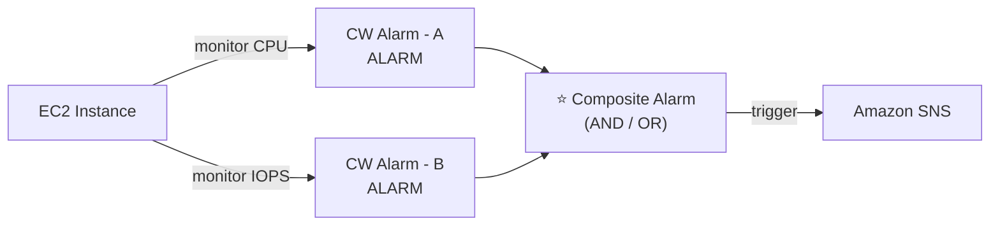

> ⭐⭐⭐ **Từ khóa nhận diện: "alarm noise", "chỉ báo động khi CẢ HAI điều kiện xảy ra"** → **Composite Alarm**.

---

### ⭐⭐⭐ EC2 Instance Recovery

**⭐⭐⭐ Status Check (3 loại):**

| Loại | Kiểm tra gì |
|---|---|
| ⭐⭐⭐ **Instance status** | **Kiểm tra EC2 VM** (phần mềm/OS của máy ảo) |
| ⭐⭐⭐ **System status** | **Kiểm tra PHẦN CỨNG BÊN DƯỚI (underlying hardware)** |
| ⭐⭐ **Attached EBS status** | **Kiểm tra các EBS volume đang gắn** |

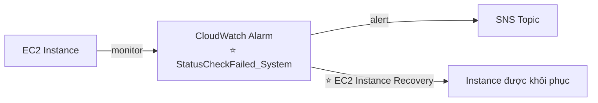

- ⭐⭐⭐ **Recovery: GIỮ NGUYÊN Private IP, Public IP, Elastic IP, metadata, placement group**

> ⭐⭐⭐ **Đây là câu hỏi thi rất hay gặp.** Đề nói *"phần cứng bên dưới EC2 bị lỗi, tự động khôi phục mà giữ nguyên IP"* → **CloudWatch Alarm trên `StatusCheckFailed_System` + hành động Recover**.
>
> ⚠️ **Phân biệt:** `StatusCheckFailed_System` = **phần cứng AWS lỗi** → **Recover**. `StatusCheckFailed_Instance` = **OS của bạn lỗi** → thường **Reboot**.

---

### ⭐⭐⭐ CloudWatch Alarm: good to know

- ⭐⭐⭐ **Alarms có thể được tạo dựa trên CLOUDWATCH LOGS METRICS FILTERS**

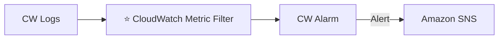

- ⭐⭐⭐ **Để TEST alarm và notification, ĐẶT TRẠNG THÁI ALARM bằng CLI:**

```bash
aws cloudwatch set-alarm-state --alarm-name "myalarm" --state-value ALARM --state-reason "testing purposes"
```

> ⭐⭐⭐ **Lệnh `set-alarm-state` này in thẳng trên slide và CÓ ra thi.** Đề hỏi *"làm sao test alarm mà không cần chờ metric thật vượt ngưỡng?"* → **lệnh này**.

---

## 272. CloudWatch Alarms Hands On

> 🖐️ Bài Hands On — **không có slide**. Các bước Console.

### Bước 1 — Tạo Alarm trên metric của EC2

1. CloudWatch → **Alarms** → **All alarms** → **Create alarm**
2. **Select metric** → **EC2** → **Per-Instance Metrics** → chọn `CPUUtilization` của một instance
3. ⭐⭐ **Metric configuration**:
   - **Statistic**: `Average` (hoặc Maximum, Minimum, Sum…)
   - ⭐⭐⭐ **Period**: `5 minutes` (hoặc 10s/30s nếu là high-resolution metric)
4. ⭐⭐⭐ **Conditions**:
   - **Threshold type**: **Static**
   - **Whenever CPUUtilization is…**: `Greater` **than** `80`
5. **Additional configuration**:
   - ⭐⭐ **Datapoints to alarm**: `1 out of 1` (hoặc `2 out of 3` để giảm báo động giả)
   - ⭐⭐⭐ **Missing data treatment**: `Treat missing data as missing` / `good` / `bad` / `ignore`
6. **Next**

### Bước 2 — Cấu hình hành động ⭐⭐⭐

| Loại hành động | Cấu hình |
|---|---|
| ⭐⭐⭐ **Notification** | **Alarm state trigger**: `In alarm` → chọn/tạo **SNS topic** → nhập email |
| ⭐⭐⭐ **Auto Scaling action** | Chọn ASG và policy |
| ⭐⭐⭐ **EC2 action** | ⭐ **Stop / Terminate / Reboot / Recover this instance** |
| ⭐⭐ **Systems Manager action** | Tạo OpsItem/Incident |

7. **Next** → **Alarm name**: `HighCPUAlarm` → **Next** → **Create alarm**
8. ⚠️ Nếu tạo SNS topic mới: **mở email và bấm Confirm subscription**

### Bước 3 — ⭐⭐⭐ Test alarm bằng CLI (không cần chờ)

```bash
# Đẩy alarm sang trạng thái ALARM để test
aws cloudwatch set-alarm-state \
  --alarm-name "HighCPUAlarm" \
  --state-value ALARM \
  --state-reason "testing purposes"

# Đưa về OK
aws cloudwatch set-alarm-state \
  --alarm-name "HighCPUAlarm" \
  --state-value OK \
  --state-reason "test done"
```

→ Kiểm tra email, và xem lịch sử ở tab **History** của alarm.

### Bước 4 — Tạo Alarm phục hồi EC2 ⭐⭐⭐

1. **Create alarm** → **Select metric** → **EC2** → **Per-Instance Metrics** → ⭐ **`StatusCheckFailed_System`**
2. **Statistic**: `Maximum`, **Period**: `1 minute`
3. **Condition**: `Greater/Equal` than `1`
4. ⭐⭐⭐ **EC2 action** → **Recover this instance**
5. Đặt tên → **Create alarm**

### Bước 5 — Tạo Billing Alarm ⭐⭐

⚠️ **Billing metrics CHỈ có ở Region `us-east-1`.**

1. Đổi Region sang ⭐ **N. Virginia (us-east-1)**
2. **Create alarm** → **Select metric** → **Billing** → **Total Estimated Charge** → `USD`
3. **Period**: `6 hours`, **Condition**: `Greater` than `10` (USD)
4. Gửi tới SNS topic → **Create alarm**

> ⭐⭐⭐ **Đây là alarm nên tạo thật cho tài khoản học tập của bạn** — cảnh báo khi hóa đơn vượt ngưỡng, rất hữu ích sau các chương tốn tiền như 18 (EKS) và 22 (Flink).

### Dọn dẹp

```bash
# Liệt kê alarm
aws cloudwatch describe-alarms --query 'MetricAlarms[].AlarmName'

# Xóa alarm
aws cloudwatch delete-alarms --alarm-names HighCPUAlarm
```

> 💡 **CloudWatch Alarms có Free Tier: 10 alarm/tháng miễn phí.** Bài này an toàn.

---

## 273. CloudWatch Network Synthetic Monitor

### ⭐⭐ CloudWatch Network Synthetic Monitor

- ⭐⭐⭐ **GIÁM SÁT và PHÁT HIỆN các vấn đề mạng GIỮA ứng dụng của bạn trên AWS VÀ trung tâm dữ liệu on-premises**
- ⭐⭐⭐ **Xác định BẤT KỲ SUY GIẢM HIỆU NĂNG MẠNG nào** (ví dụ: **packet loss, latency, jitter…**)
- ⭐⭐⭐ **KHÔNG CẦN CÀI AGENT (No agents required)**
- ⭐⭐⭐ **Test lưu lượng ICMP hoặc TCP tới các đích IPv4 on-premises qua DIRECT CONNECT hoặc SITE-TO-SITE VPN**
- ⭐⭐⭐ **Publish dữ liệu vào CLOUDWATCH METRICS**

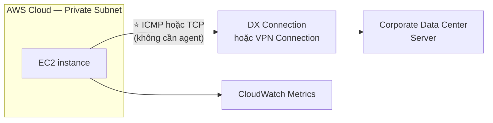

> ⭐⭐⭐ **Hai từ khóa nhận diện:** **"packet loss / latency / jitter giữa AWS và on-premises"** và **"KHÔNG cần cài agent"** → **CloudWatch Network Synthetic Monitor**.
>
> ⚠️ **Đừng nhầm với "CloudWatch Synthetics Canary"** — cái đó giám sát **endpoint HTTP/API từ bên ngoài**; cái này giám sát **mạng lai AWS ↔ on-premises**.

---

## 274. EventBridge Overview (formerly CloudWatch Events)

### ⭐⭐⭐ Amazon EventBridge — Hai chế độ kích hoạt

| Chế độ | Chi tiết | Ví dụ |
|---|---|---|
| ⭐⭐⭐ **Schedule** | **Cron jobs (scheduled scripts)** | **Schedule Every hour → Trigger script on Lambda function** |
| ⭐⭐⭐ **Event Pattern** | **Event rules để PHẢN ỨNG khi một dịch vụ làm gì đó** | **IAM Root User Sign in Event → SNS Topic with Email Notification** |

- ⭐⭐⭐ **Trigger Lambda functions, gửi SQS/SNS messages…**

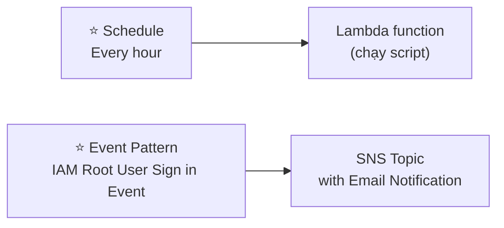

> ⭐⭐⭐ **Ví dụ "IAM Root User Sign in" là use case bảo mật kinh điển** — cảnh báo ngay khi có người đăng nhập bằng root.

---

### ⭐⭐⭐ Amazon EventBridge Rules

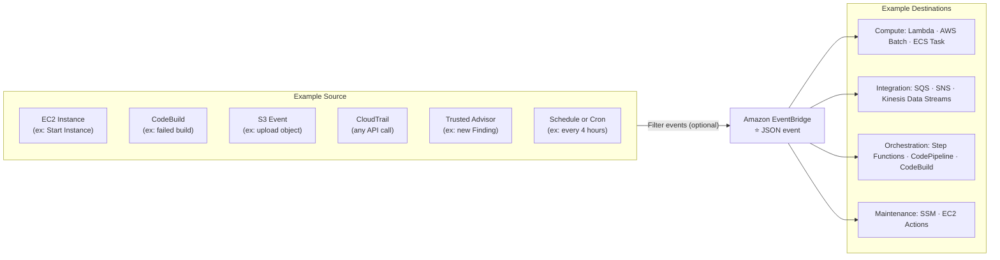

**⭐⭐ Event có dạng JSON:**

```json
{
  "version": "0",
  "id": "6a7e8feb-b491",
  "detail-type": "EC2 Instance State-change Notification",
  "...": "..."
}
```

> ⭐⭐⭐ **Nhớ 4 nhóm đích:** **Compute** (Lambda, Batch, ECS Task), **Integration** (SQS, SNS, Kinesis), **Orchestration** (Step Functions, CodePipeline, CodeBuild), **Maintenance** (SSM, EC2 Actions).

---

### ⭐⭐⭐ Amazon EventBridge — Event Buses (3 loại)

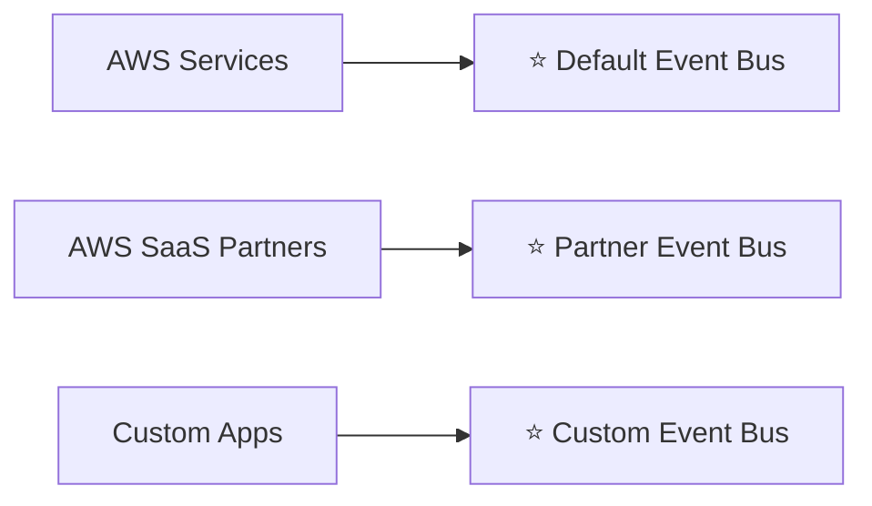

| Bus | Nguồn |
|---|---|
| ⭐⭐⭐ **Default Event Bus** | **AWS Services** |
| ⭐⭐⭐ **Partner Event Bus** | **AWS SaaS Partners** (Datadog, Zendesk, Auth0…) |
| ⭐⭐⭐ **Custom Event Bus** | **Custom Apps** (ứng dụng của bạn) |

**Ba tính năng quan trọng:** ⭐⭐⭐

- ⭐⭐⭐ **Event buses TRUY CẬP ĐƯỢC TỪ TÀI KHOẢN AWS KHÁC bằng RESOURCE-BASED POLICIES**
- ⭐⭐⭐ **Có thể ARCHIVE events (tất cả/có lọc) gửi tới event bus (VÔ THỜI HẠN hoặc theo khoảng thời gian đặt trước)**
- ⭐⭐⭐ **Khả năng REPLAY các archived events**

> ⭐⭐⭐ **Archive + Replay là cặp tính năng ra thi:** *"cần phát lại sự kiện cũ để debug / để hệ thống mới xử lý lại"* → **EventBridge Archive & Replay**.

---

### ⭐⭐ Amazon EventBridge – Schema Registry

- ⭐⭐⭐ **EventBridge có thể PHÂN TÍCH events trong bus và SUY RA SCHEMA**
- ⭐⭐⭐ **Schema Registry cho phép SINH CODE cho ứng dụng của bạn, để biết trước dữ liệu trong event bus có cấu trúc thế nào**
- ⭐⭐ **Schema có thể ĐÁNH PHIÊN BẢN (versioned)**

---

### ⭐⭐⭐ Amazon EventBridge – Resource-based Policy

- ⭐⭐⭐ **Quản lý quyền cho MỘT EVENT BUS CỤ THỂ**
- ⭐⭐ **Ví dụ: cho phép/từ chối events từ một tài khoản AWS khác hoặc region khác**
- ⭐⭐⭐ **Use case: GOM TẤT CẢ events từ AWS ORGANIZATION về MỘT tài khoản AWS hoặc MỘT region duy nhất**

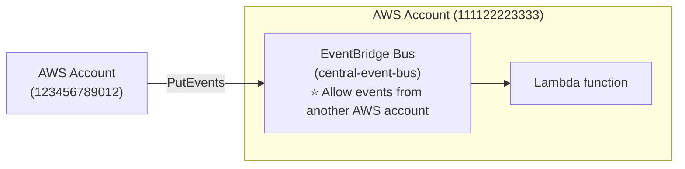

> ⭐⭐⭐ **Từ khóa:** *"tập trung sự kiện toàn Organization về một tài khoản"* → **EventBridge Resource-based Policy**.

---

## 275. Amazon EventBridge - Hands On

> 🖐️ Bài Hands On — **không có slide**. Các bước Console.

### Bước 1 — Tạo Rule theo Schedule ⭐

1. Console → **Amazon EventBridge** → **Rules** → **Create rule**
2. **Name**: `demo-schedule-rule`
3. ⭐ **Event bus**: `default`
4. ⭐⭐⭐ **Rule type**: **Schedule** (hoặc **Rule with an event pattern**)
5. Nếu chọn Schedule:
   - ⭐ **A fine-grained schedule**: cron expression, ví dụ `cron(0 * * * ? *)` (mỗi giờ)
   - hoặc **A schedule that runs at a regular rate**: `rate(1 hour)`
6. **Target**: chọn **Lambda function** → chọn function
7. **Create rule**

> ⭐⭐ **Lưu ý cú pháp cron của AWS có 6 trường** (phút, giờ, ngày, tháng, thứ, năm) — khác cron Linux 5 trường.

### Bước 2 — Tạo Rule theo Event Pattern ⭐⭐⭐

1. **Create rule** → **Name**: `demo-ec2-state-change`
2. **Rule type**: ⭐ **Rule with an event pattern** → **Next**
3. **Event source**: **AWS events or EventBridge partner events**
4. ⭐⭐⭐ **Event pattern** — dùng **Pattern form** cho dễ:
   - **Event source**: `AWS services`
   - **AWS service**: `EC2`
   - **Event type**: `EC2 Instance State-change Notification`
   - **Specific state(s)**: `running`, `stopped`
5. Hoặc dán JSON trực tiếp:

```json
{
  "source": ["aws.ec2"],
  "detail-type": ["EC2 Instance State-change Notification"],
  "detail": {
    "state": ["running", "stopped"]
  }
}
```

6. **Next** → **Target**: **SNS topic** → chọn topic đã tạo ở chương 17
7. **Create rule**

### Bước 3 — Kiểm chứng

1. Vào **EC2** → **Stop** rồi **Start** một instance
2. Kiểm tra email (qua SNS) → nhận được event JSON
3. Xem **Monitoring** của rule → metrics `Invocations`, `TriggeredRules`, `FailedInvocations`

### ⭐⭐ Xem Event JSON mẫu

```json
{
  "version": "0",
  "id": "7bf73129-1428-4cd3-a780-95db273d1602",
  "detail-type": "EC2 Instance State-change Notification",
  "source": "aws.ec2",
  "account": "123456789012",
  "time": "2026-09-20T12:00:00Z",
  "region": "us-east-1",
  "resources": ["arn:aws:ec2:us-east-1:123456789012:instance/i-abcd1111"],
  "detail": {
    "instance-id": "i-abcd1111",
    "state": "running"
  }
}
```

### Bước 4 — Xem Event Buses và Archives ⭐

- **Event buses** → thấy `default` + tạo được **Custom event bus**
- Chọn bus → tab ⭐ **Archives** → **Create archive** (đặt **Retention period**)
- Sau khi có archive → ⭐ **Replays** → **Start new replay** để phát lại sự kiện cũ

### CLI

```bash
# Liệt kê rules
aws events list-rules

# Xem chi tiết một rule
aws events describe-rule --name demo-ec2-state-change

# Gửi event tùy chỉnh vào bus
aws events put-events --entries '[{
  "Source": "my.app",
  "DetailType": "OrderPlaced",
  "Detail": "{\"orderId\":\"1036\"}"
}]'

# Xóa rule (phải gỡ target trước)
aws events remove-targets --rule demo-ec2-state-change --ids 1
aws events delete-rule --name demo-ec2-state-change
```

> 💡 **EventBridge rất rẻ:** events từ AWS services là **miễn phí**; custom events **$1/triệu event**. Bài này an toàn.

---

## 276. CloudWatch Insights and Operational Visibility

Bài này giới thiệu **4 loại Insights** — slide cuối tổng kết cả bốn, nên tôi trình bày từng cái rồi chốt bảng.

---

### ⭐⭐⭐ 1️⃣ CloudWatch Container Insights

- ⭐⭐⭐ **THU THẬP, TỔNG HỢP, TÓM TẮT metrics và logs từ CONTAINERS**
- ⭐⭐⭐ **Có sẵn cho containers trên:**
  - **Amazon ECS**
  - **Amazon EKS**
  - **Kubernetes platforms trên EC2**
  - **Fargate (cả ECS và EKS)**
- ⚠️⭐⭐⭐ **Trong Amazon EKS và Kubernetes, CloudWatch Insights DÙNG MỘT PHIÊN BẢN ĐÓNG CONTAINER CỦA CLOUDWATCH AGENT để khám phá containers**

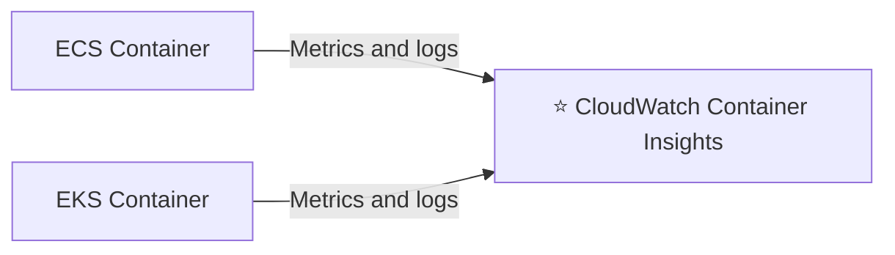

> ⭐⭐⭐ **Điểm ra thi:** **EKS/Kubernetes CẦN AGENT**, ECS/Fargate thì không. Slide tổng kết ghi rõ: *"needs agent for Kubernetes"*.

---

### ⭐⭐⭐ 2️⃣ CloudWatch Lambda Insights

- ⭐⭐⭐ **Giải pháp GIÁM SÁT và GỠ LỖI cho ứng dụng SERVERLESS chạy trên AWS LAMBDA**
- ⭐⭐⭐ **Thu thập, tổng hợp, tóm tắt SYSTEM-LEVEL METRICS gồm CPU time, MEMORY, DISK, và NETWORK**
- ⭐⭐⭐ **Thu thập, tổng hợp, tóm tắt THÔNG TIN CHẨN ĐOÁN như COLD STARTS và LAMBDA WORKER SHUTDOWNS**
- ⭐⭐⭐ **Lambda Insights được cung cấp dưới dạng một LAMBDA LAYER**

> ⭐⭐⭐ **Từ khóa "cold starts" nối thẳng với chương 19** — muốn **đo lường** cold start thì dùng **Lambda Insights**; muốn **loại bỏ** cold start thì dùng **Provisioned Concurrency / SnapStart**.
>
> ⭐⭐ **Và nhớ: nó là một LAMBDA LAYER.**

---

### ⭐⭐⭐ 3️⃣ CloudWatch Contributor Insights

- ⭐⭐⭐ **PHÂN TÍCH dữ liệu log và tạo TIME SERIES hiển thị DỮ LIỆU NGƯỜI ĐÓNG GÓP (contributor data)**
- ⭐⭐⭐ **Xem metrics về TOP-N CONTRIBUTORS**
- ⭐⭐ **Tổng số contributor duy nhất, và mức sử dụng của họ**
- ⭐⭐⭐ **Giúp TÌM RA "TOP TALKERS" và hiểu AI hoặc CÁI GÌ đang ảnh hưởng tới hiệu năng hệ thống**
- ⭐⭐⭐ **Hoạt động với BẤT KỲ log nào do AWS sinh ra (VPC, DNS, v.v…)**
- ⭐⭐ **Ví dụ: tìm HOST XẤU, xác định NGƯỜI DÙNG MẠNG NẶNG NHẤT, hoặc tìm URL SINH RA NHIỀU LỖI NHẤT**
- ⭐⭐ **Xây rule từ đầu, hoặc dùng SAMPLE RULES mà AWS đã tạo sẵn**
- ⭐⭐ **CloudWatch cũng cung cấp BUILT-IN RULES để phân tích metrics từ các dịch vụ AWS khác**

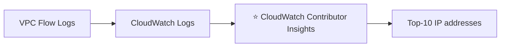

> ⭐⭐⭐ **Từ khóa nhận diện cực rõ:** **"Top-N"**, **"top talkers"**, **"IP nào gọi nhiều nhất"**, **"URL nào lỗi nhiều nhất"** → **Contributor Insights**.

---

### ⭐⭐ 4️⃣ CloudWatch Application Insights

- ⭐⭐⭐ **Cung cấp DASHBOARD TỰ ĐỘNG hiển thị các VẤN ĐỀ TIỀM ẨN của ứng dụng được giám sát, giúp KHOANH VÙNG sự cố đang diễn ra**
- ⭐⭐ **Ứng dụng của bạn chạy trên EC2 Instances với CÁC CÔNG NGHỆ ĐƯỢC CHỌN** (Java, .NET, Microsoft IIS Web Server, databases…)
- ⭐⭐ **Và có thể dùng các tài nguyên AWS khác: EBS, RDS, ELB, ASG, Lambda, SQS, DynamoDB, S3, ECS, EKS, SNS, API Gateway…**
- ⭐⭐⭐ **ĐƯỢC HỖ TRỢ BỞI SAGEMAKER (Powered by SageMaker)**
- ⭐⭐ **Tăng khả năng quan sát sức khỏe ứng dụng, giảm thời gian gỡ lỗi và sửa chữa**
- ⭐⭐⭐ **Findings và alerts được gửi tới AMAZON EVENTBRIDGE và SSM OPSCENTER**

> ⭐⭐ **Hai chi tiết đặc trưng: "powered by SageMaker"** và **"gửi tới EventBridge + SSM OpsCenter"**.

---

### ⭐⭐⭐ Bảng tổng kết 4 loại Insights (slide chốt)

| Loại | Dùng cho | Điểm nhận diện |
|---|---|---|
| ⭐⭐⭐ **Container Insights** | **ECS, EKS, Kubernetes trên EC2, Fargate** | ⭐ **CẦN AGENT cho Kubernetes** · **Metrics và logs** |
| ⭐⭐⭐ **Lambda Insights** | **Ứng dụng serverless** | ⭐ **Metrics chi tiết để gỡ lỗi serverless** · **Cold starts** · là **Lambda Layer** |
| ⭐⭐⭐ **Contributors Insights** | **Bất kỳ log nào của AWS** | ⭐ **Tìm "Top-N" Contributors qua CloudWatch Logs** |
| ⭐⭐⭐ **Application Insights** | **Ứng dụng trên EC2 (Java, .NET, IIS…)** | ⭐ **Dashboard TỰ ĐỘNG để gỡ lỗi ứng dụng và dịch vụ AWS liên quan** |

---

## 277. CloudTrail Overview

### ⭐⭐⭐ AWS CloudTrail

- ⭐⭐⭐ **Cung cấp GOVERNANCE, COMPLIANCE và AUDIT cho tài khoản AWS của bạn**
- ⭐⭐⭐ **CLOUDTRAIL ĐƯỢC BẬT MẶC ĐỊNH!**
- ⭐⭐⭐ **Lấy LỊCH SỬ events / API CALLS thực hiện trong tài khoản AWS bởi:**
  - **Console**
  - **SDK**
  - **CLI**
  - **AWS Services**
- ⭐⭐⭐ **Có thể đưa log của CloudTrail vào CLOUDWATCH LOGS hoặc S3**
- ⭐⭐⭐ **Một trail có thể áp dụng cho TẤT CẢ REGIONS (mặc định) hoặc MỘT Region duy nhất**
- ⭐⭐⭐ **NẾU MỘT TÀI NGUYÊN BỊ XÓA TRONG AWS, HÃY ĐIỀU TRA CLOUDTRAIL TRƯỚC TIÊN!**

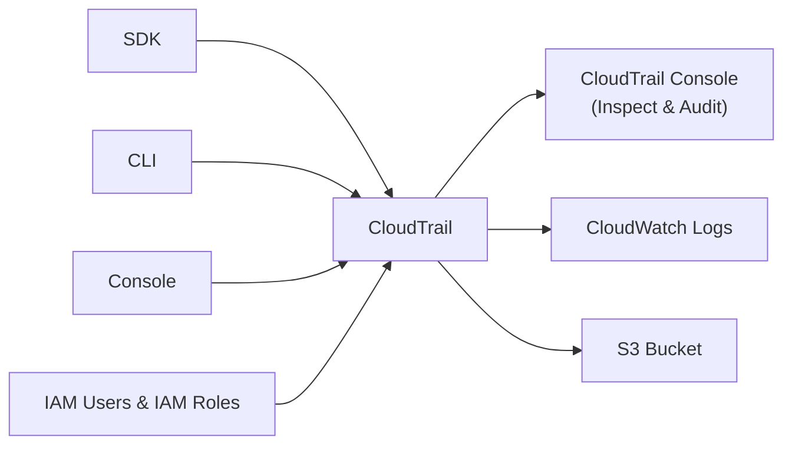

> ⭐⭐⭐ **Câu cuối là CÂU HỎI THI KINH ĐIỂN NHẤT VỀ CLOUDTRAIL:**
> *"Một EC2 instance / S3 bucket / DynamoDB table bị xóa, làm sao tìm ra AI đã xóa?"* → **AWS CloudTrail**.
>
> ⭐⭐⭐ **Hai điểm dễ quên:** CloudTrail **BẬT SẴN mặc định**, và trail mặc định áp dụng cho **TẤT CẢ Region**.

---

### ⭐⭐⭐ CloudTrail Events — 3 loại (RA THI CHẮC CHẮN)

**1️⃣ Management Events:** ⭐⭐⭐

- ⭐⭐⭐ **Các thao tác thực hiện TRÊN TÀI NGUYÊN trong tài khoản AWS**
- **Ví dụ:**
  - **Cấu hình bảo mật** (`IAM AttachRolePolicy`)
  - **Cấu hình quy tắc định tuyến dữ liệu** (`Amazon EC2 CreateSubnet`)
  - **Thiết lập logging** (`AWS CloudTrail CreateTrail`)
- ⭐⭐⭐ **MẶC ĐỊNH, trails được cấu hình để GHI LẠI MANAGEMENT EVENTS**
- ⭐⭐⭐ **Có thể TÁCH RIÊNG Read Events (không sửa tài nguyên) khỏi Write Events (có thể sửa tài nguyên)**

**2️⃣ Data Events:** ⭐⭐⭐

- ⚠️⭐⭐⭐ **MẶC ĐỊNH, DATA EVENTS KHÔNG ĐƯỢC GHI LẠI (vì là thao tác KHỐI LƯỢNG LỚN)**
- ⭐⭐⭐ **Hoạt động MỨC OBJECT của Amazon S3** (ví dụ: `GetObject`, `DeleteObject`, `PutObject`) — **tách được Read và Write Events**
- ⭐⭐⭐ **Hoạt động thực thi của AWS Lambda function (API `Invoke`)**

**3️⃣ CloudTrail Insights Events:** ⭐⭐ — xem phần dưới

> ⭐⭐⭐ **BẪY THI QUAN TRỌNG:** Đề hỏi *"ai đã xóa object trong S3 bucket?"* → cần **Data Events**, mà **Data Events KHÔNG bật mặc định** → phải **bật thủ công**. Nếu chưa bật thì **không có log để tra**.
>
> 💡 **Mẹo nhớ:** **Management = thao tác lên TÀI NGUYÊN** (tạo bucket, sửa IAM). **Data = thao tác lên DỮ LIỆU BÊN TRONG** (đọc/ghi object, gọi Lambda).

---

### ⭐⭐ CloudTrail Insights

- ⭐⭐⭐ **Bật CloudTrail Insights để PHÁT HIỆN HOẠT ĐỘNG BẤT THƯỜNG trong tài khoản:**

| Loại bất thường |
|---|
| ⭐⭐ **Cấp phát tài nguyên không chính xác (inaccurate resource provisioning)** |
| ⭐⭐ **Chạm giới hạn dịch vụ (hitting service limits)** |
| ⭐⭐ **Bùng nổ các hành động AWS IAM (bursts of IAM actions)** |
| ⭐⭐ **Khoảng trống trong hoạt động bảo trì định kỳ** |

- ⭐⭐⭐ **CloudTrail Insights PHÂN TÍCH các MANAGEMENT EVENTS BÌNH THƯỜNG để tạo một BASELINE**
- ⭐⭐⭐ **Rồi LIÊN TỤC phân tích WRITE EVENTS để phát hiện MẪU BẤT THƯỜNG**

**Bất thường được đưa đi đâu:** ⭐⭐

```mermaid
flowchart LR
    ME["Management Events"] -->|"Continuous analysis"| CI["⭐ CloudTrail Insights"]
    CI -->|"generate"| IE["Insights Events"]
    IE --> C["CloudTrail Console"]
    IE --> S3["S3 Bucket"]
    IE --> EB["EventBridge event<br/>(cho nhu cầu tự động hóa)"]
```

> ⭐⭐⭐ **Nhớ: baseline dựa trên MANAGEMENT events, phân tích liên tục các WRITE events.**

---

### ⭐⭐⭐ CloudTrail Events Retention

- ⭐⭐⭐ **Events được lưu trong CLOUDTRAIL 90 NGÀY**
- ⭐⭐⭐ **Để giữ events LÂU HƠN, hãy ĐƯA LOG VÀO S3 và dùng ATHENA**

```mermaid
flowchart LR
    ME["Management Events"] --> CT["CloudTrail<br/>⭐ 90 days retention"]
    DE["Data Events"] --> CT
    IE["Insights Events"] --> CT
    CT -->|"log"| S3["S3 Bucket<br/>⭐ Long-term retention"]
    S3 -->|"analyze"| AT["Athena"]
```

> ⭐⭐⭐ **CON SỐ 90 NGÀY LÀ MỘT TRONG NHỮNG CON SỐ RA THI NHIỀU NHẤT CHƯƠNG NÀY.**
>
> **Câu hỏi thi:** *"Cần giữ log audit 3 năm cho compliance"* → **CloudTrail → S3 → Athena** (CloudTrail Console chỉ giữ 90 ngày).

---

## 278. CloudTrail Hands On

> 🖐️ Bài Hands On — **không có slide**. Bài ngắn (2 phút).

### Bước 1 — Xem Event history ⭐⭐⭐

1. Console → tìm **CloudTrail** → ⭐ **Event history**
2. Thấy ngay danh sách API calls **90 ngày gần nhất** — **không cần cấu hình gì** (vì CloudTrail bật sẵn)
3. Lọc theo:

| Bộ lọc | Ví dụ |
|---|---|
| ⭐⭐ **Event name** | `TerminateInstances`, `DeleteBucket` |
| ⭐⭐ **User name** | tên IAM user |
| ⭐⭐ **Resource type** | `AWS::EC2::Instance` |
| ⭐⭐ **Event source** | `ec2.amazonaws.com` |
| ⭐ **Read-only** | `true` / `false` |

### Bước 2 — Thử nghiệm: xóa một tài nguyên rồi truy vết ⭐⭐⭐

1. Vào **EC2** → **Terminate** một instance test (hoặc xóa một security group)
2. Quay lại CloudTrail → **Event history** → chờ **~5–15 phút**
3. Tìm event `TerminateInstances` → bấm vào xem chi tiết

**Các trường quan trọng trong event JSON:** ⭐⭐⭐

```json
{
  "eventTime": "2026-09-20T12:34:56Z",
  "eventSource": "ec2.amazonaws.com",
  "eventName": "TerminateInstances",
  "awsRegion": "us-east-1",
  "sourceIPAddress": "203.0.113.42",
  "userIdentity": {
    "type": "IAMUser",
    "userName": "stephane",
    "arn": "arn:aws:iam::123456789012:user/stephane"
  },
  "requestParameters": {
    "instancesSet": { "items": [{ "instanceId": "i-abcd1111" }] }
  },
  "errorCode": null
}
```

| Trường | Ý nghĩa |
|---|---|
| ⭐⭐⭐ **`userIdentity`** | **AI đã làm** |
| ⭐⭐⭐ **`eventName`** | **LÀM GÌ** |
| ⭐⭐⭐ **`eventTime`** | **KHI NÀO** |
| ⭐⭐⭐ **`sourceIPAddress`** | **TỪ ĐÂU** |
| ⭐⭐ **`errorCode`** | Có bị từ chối không |

> ⭐⭐⭐ **Bốn trường đầu trả lời đúng câu hỏi "ai đã xóa cái này?"** — đó là lý do slide nói *"investigate CloudTrail first"*.

### Bước 3 — Tạo Trail để lưu dài hạn ⭐⭐⭐

1. CloudTrail → **Trails** → **Create trail**
2. **Trail name**: `my-audit-trail`
3. ⭐⭐⭐ **Apply trail to all regions**: **Enabled** (mặc định, khuyến nghị)
4. **Storage location**: **Create new S3 bucket** hoặc chọn bucket có sẵn
5. ⭐ **Log file SSE-KMS encryption**: Enabled (khuyến nghị)
6. (Tùy chọn) ⭐ **CloudWatch Logs**: Enabled → để tạo Metric Filter + Alarm trên API calls
7. **Next** → ⭐⭐⭐ **Choose log events**:

| Loại | Mặc định |
|---|---|
| ⭐⭐⭐ **Management events** | ✅ **Bật sẵn** (chọn Read / Write) |
| ⚠️⭐⭐⭐ **Data events** | ❌ **TẮT — phải bật thủ công** (S3, Lambda, DynamoDB…) |
| ⭐⭐ **Insights events** | ❌ Tắt (tốn phí thêm) |

8. **Next** → **Create trail**

### CLI

```bash
# Xem event history 90 ngày
aws cloudtrail lookup-events --max-results 10

# Lọc theo tên event
aws cloudtrail lookup-events \
  --lookup-attributes AttributeKey=EventName,AttributeValue=TerminateInstances

# Lọc theo user
aws cloudtrail lookup-events \
  --lookup-attributes AttributeKey=Username,AttributeValue=stephane

# Liệt kê trails
aws cloudtrail describe-trails
```

> ⚠️ **CHI PHÍ:** **Event history (90 ngày) MIỄN PHÍ.** Nhưng **trail đầu tiên ghi Management events vào S3 cũng miễn phí**; **trail thứ hai trở đi, Data events và Insights events đều TÍNH PHÍ**. Data events trên S3 bucket bận có thể rất đắt — chỉ bật cho bucket thực sự cần audit.

---

## 279. CloudTrail - EventBridge Integration

### ⭐⭐⭐ Amazon EventBridge – Intercept API Calls

```mermaid
flowchart LR
    U["User"] -->|"💥 DeleteTable API Call"| D["DynamoDB"]
    D -->|"Log API call"| CT["CloudTrail<br/>(any API call)"]
    CT -->|"event"| EB["Amazon EventBridge"]
    EB -->|"alert"| S["SNS"]
```

> ⭐⭐⭐ **ĐÂY LÀ PATTERN QUAN TRỌNG NHẤT CỦA BÀI 279:**
> **CloudTrail ghi MỌI API call → EventBridge bắt được → kích hoạt hành động.**
>
> Nhờ đó bạn có thể **cảnh báo TỨC THÌ khi có thao tác nguy hiểm** (`DeleteTable`, `DeleteBucket`, `StopInstances`…) thay vì phát hiện muộn khi tra log.

---

### ⭐⭐⭐ Amazon EventBridge + CloudTrail — Hai ví dụ

**Ví dụ 1 — Phát hiện `AssumeRole`:**

```mermaid
flowchart LR
    U["User"] -->|"AssumeRole"| I["IAM Role"]
    I -->|"API Call logs"| CT["CloudTrail"]
    CT -->|"event"| EB["EventBridge"]
    EB --> S["SNS"]
```

**Ví dụ 2 — Phát hiện mở Security Group:**

```mermaid
flowchart LR
    U["User"] -->|"edit SG Inbound Rules<br/>AuthorizeSecurityGroupIngress"| SG["EC2 Security Group"]
    SG -->|"API Call logs"| CT["CloudTrail"]
    CT -->|"event"| EB["EventBridge"]
    EB --> S["SNS"]
```

> ⭐⭐⭐ **Hai API name trên slide đều là từ khóa ra thi:**
> - ⭐⭐⭐ **`AssumeRole`** — ai đó đang mượn quyền của role
> - ⭐⭐⭐ **`AuthorizeSecurityGroupIngress`** — ai đó vừa **MỞ CỔNG** trên security group (rủi ro bảo mật cao)
>
> **Câu hỏi thi:** *"Cảnh báo ngay khi có người mở port 22 cho 0.0.0.0/0"* → **CloudTrail → EventBridge rule khớp `AuthorizeSecurityGroupIngress` → SNS**.

**Ví dụ EventBridge rule pattern (bổ sung ngoài slide):**

```json
{
  "source": ["aws.ec2"],
  "detail-type": ["AWS API Call via CloudTrail"],
  "detail": {
    "eventSource": ["ec2.amazonaws.com"],
    "eventName": ["AuthorizeSecurityGroupIngress"]
  }
}
```

> ⭐⭐ **Nhớ `detail-type` là `"AWS API Call via CloudTrail"`** — đây là cách EventBridge nhận diện event đến từ CloudTrail.

---

## 280. AWS Config - Overview

### ⭐⭐⭐ AWS Config

- ⭐⭐⭐ **Giúp AUDITING và GHI LẠI COMPLIANCE của các tài nguyên AWS**
- ⭐⭐⭐ **Giúp GHI LẠI CẤU HÌNH và CÁC THAY ĐỔI THEO THỜI GIAN**

**⭐⭐⭐ Những câu hỏi AWS Config giải quyết được:**

| Câu hỏi |
|---|
| ⭐⭐⭐ **"Có security group nào của tôi cho phép SSH KHÔNG GIỚI HẠN không?"** |
| ⭐⭐⭐ **"Các bucket của tôi có bị PUBLIC ACCESS không?"** |
| ⭐⭐⭐ **"Cấu hình ALB của tôi ĐÃ THAY ĐỔI THẾ NÀO theo thời gian?"** |

- ⭐⭐⭐ **Bạn có thể nhận CẢNH BÁO (SNS notifications) cho BẤT KỲ thay đổi nào**
- ⚠️⭐⭐⭐ **AWS Config là dịch vụ THEO TỪNG REGION (per-region service)**
- ⭐⭐⭐ **CÓ THỂ TỔNG HỢP (aggregate) qua NHIỀU REGION và NHIỀU TÀI KHOẢN**
- ⭐⭐ **Có thể lưu dữ liệu cấu hình vào S3 (phân tích bằng Athena)**

> ⭐⭐⭐ **"Per-region service" là bẫy thi:** khác với CloudTrail (global, trail áp dụng mọi region), **Config phải bật riêng cho TỪNG region**. Muốn nhìn toàn cục thì dùng **Aggregator**.

---

### ⭐⭐⭐ Config Rules

- ⭐⭐⭐ **Có thể dùng AWS MANAGED CONFIG RULES (HƠN 75 rule có sẵn)**
- ⭐⭐⭐ **Có thể tạo CUSTOM CONFIG RULES (PHẢI ĐỊNH NGHĨA TRONG AWS LAMBDA)**
  - **Ví dụ: đánh giá xem mỗi EBS disk có phải loại `gp2` không**
  - **Ví dụ: đánh giá xem mỗi EC2 instance có phải `t2.micro` không**

**⭐⭐⭐ Rules được đánh giá / kích hoạt khi:**

| Thời điểm |
|---|
| ⭐⭐⭐ **MỖI KHI CÓ THAY ĐỔI CẤU HÌNH (for each config change)** |
| ⭐⭐⭐ **VÀ/HOẶC: THEO KHOẢNG THỜI GIAN ĐỊNH KỲ (at regular time intervals)** |

- ⚠️⭐⭐⭐ **AWS CONFIG RULES KHÔNG NGĂN CHẶN HÀNH ĐỘNG XẢY RA (no deny)**

**⭐⭐ Pricing:**

- ⚠️⭐⭐ **KHÔNG CÓ FREE TIER**
- ⭐⭐ **$0.003 cho mỗi configuration item được ghi, mỗi region**
- ⭐⭐ **$0.001 cho mỗi lần đánh giá config rule, mỗi region**

> ⭐⭐⭐ **DÒNG "KHÔNG NGĂN CHẶN" LÀ BẪY THI SỐ MỘT CỦA AWS CONFIG.**
>
> Config chỉ **PHÁT HIỆN và BÁO CÁO** vi phạm, **KHÔNG chặn**. Muốn **CHẶN** thì dùng:
> - **IAM Policies / SCPs (Service Control Policies)** — chặn ở tầng quyền
> - **Security Group / NACL** — chặn ở tầng mạng
>
> **Câu hỏi thi:** *"Ngăn không cho ai tạo bucket public"* → **SCP**, KHÔNG phải Config. *"Phát hiện bucket nào đang public"* → **Config**.
>
> ⭐⭐⭐ **Và nhớ: Custom rule PHẢI viết bằng LAMBDA.**

---

### ⭐⭐ AWS Config Resource — Ba góc nhìn theo thời gian

| Góc nhìn |
|---|
| ⭐⭐⭐ **Xem COMPLIANCE của một tài nguyên THEO THỜI GIAN** |
| ⭐⭐⭐ **Xem CẤU HÌNH của một tài nguyên THEO THỜI GIAN** |
| ⭐⭐⭐ **Xem các CLOUDTRAIL API CALLS của một tài nguyên THEO THỜI GIAN** |

> ⭐⭐⭐ **Điểm đáng chú ý: Config TÍCH HỢP với CloudTrail** — trên cùng một màn hình tài nguyên, bạn thấy cả **cấu hình đã đổi thế nào** (Config) **và ai đã đổi** (CloudTrail).

---

### ⭐⭐⭐ Config Rules – Remediations

- ⭐⭐⭐ **TỰ ĐỘNG KHẮC PHỤC (remediation) các tài nguyên không tuân thủ bằng SSM AUTOMATION DOCUMENTS**
- ⭐⭐⭐ **Dùng AWS-Managed Automation Documents hoặc tạo Custom Automation Documents**
- ⭐⭐ **Tip: có thể tạo custom Automation Document GỌI TỚI LAMBDA FUNCTION**
- ⭐⭐⭐ **Có thể đặt REMEDIATION RETRIES nếu tài nguyên vẫn không tuân thủ sau khi tự động khắc phục**

```mermaid
flowchart LR
    K["IAM Access Key<br/>(NON_COMPLIANT — expired)"] -->|"monitor"| C["AWS Config"]
    C -->|"trigger"| A["⭐ Auto-Remediation Action<br/>SSM Document:<br/>AWSConfigRemediationRevokeUnusedIAMUserCredentials<br/>Retries: 5"]
    A -->|"deactivate"| K
```

> ⭐⭐⭐ **Đây là cách Config "sửa" được vấn đề dù bản thân nó không chặn được.** Từ khóa: **"auto-remediation"**, **"SSM Automation Documents"**.

---

### ⭐⭐⭐ Config Rules – Notifications

**Cách 1 — Dùng EventBridge:** ⭐⭐⭐

- ⭐⭐⭐ **Dùng EVENTBRIDGE để kích hoạt thông báo khi tài nguyên AWS KHÔNG TUÂN THỦ**

```mermaid
flowchart LR
    R["AWS Resources<br/>(Security group, …)"] -->|"monitor"| C["AWS Config"]
    C -->|"NON_COMPLIANT<br/>trigger"| EB["EventBridge"]
    EB --> L["Lambda"]
    EB --> S["SNS"]
    EB --> Q["SQS"]
```

**Cách 2 — Gửi thẳng tới SNS:** ⭐⭐

- ⭐⭐⭐ **Khả năng gửi CONFIGURATION CHANGES và COMPLIANCE STATE NOTIFICATIONS tới SNS (TẤT CẢ events — dùng SNS FILTERING hoặc lọc ở phía client)**

```mermaid
flowchart LR
    R["AWS Resources<br/>(Security group, …)"] -->|"monitor"| C["AWS Config"]
    C -->|"⭐ All events<br/>(configuration changes,<br/>compliance state…)"| S["SNS"]
    S -->|"notification"| A["Admin"]
```

> ⭐⭐⭐ **Phân biệt hai cách:**
> - **EventBridge** → **lọc được ngay tại rule**, định tuyến tới nhiều đích (Lambda/SNS/SQS)
> - **SNS trực tiếp** → nhận **TẤT CẢ events**, phải dùng **SNS Filtering** hoặc **lọc ở client**

---

## 281. AWS Config - Hands On

> 🖐️ Bài Hands On — **không có slide**. ⚠️ Đây là **bài TỐN TIỀN** — đọc cảnh báo cuối bài.

### Bước 1 — Thiết lập AWS Config

1. Console → tìm **Config** → **Get started** (lần đầu) hoặc **Settings**
2. ⭐⭐ **Recording strategy**:

| Lựa chọn | Ghi chú |
|---|---|
| ⚠️⭐⭐⭐ **Record all current and future resource types** | **Ghi MỌI THỨ — TỐN TIỀN NHẤT** |
| ⭐⭐ **Record specific resource types** | ⭐ **Khuyến nghị cho học tập** — chỉ chọn vài loại, ví dụ `AWS::EC2::SecurityGroup` |

3. ⭐⭐ **Recording frequency**: **Continuous recording** hoặc **Daily recording**
4. ⭐⭐⭐ **Delivery method**: chọn/tạo **S3 bucket** để lưu configuration snapshots
5. (Tùy chọn) **SNS topic** cho thông báo
6. ⭐ **IAM role**: dùng service-linked role mặc định
7. **Next**

### Bước 2 — Thêm Config Rules ⭐⭐⭐

1. Trang **Rules** → **Add rule** → ⭐ **Add AWS managed rule**
2. Tìm và chọn rule, ví dụ:

| Managed Rule | Kiểm tra gì |
|---|---|
| ⭐⭐⭐ **`restricted-ssh`** | **Security group có mở SSH (port 22) không giới hạn không** |
| ⭐⭐⭐ **`s3-bucket-public-read-prohibited`** | **Bucket có cho phép đọc công khai không** |
| ⭐⭐⭐ **`s3-bucket-public-write-prohibited`** | **Bucket có cho phép ghi công khai không** |
| ⭐⭐ **`ec2-instance-no-public-ip`** | **EC2 có public IP không** |
| ⭐⭐ **`iam-password-policy`** | **Chính sách mật khẩu có đủ mạnh không** |
| ⭐⭐ **`required-tags`** | **Tài nguyên có đủ tag bắt buộc không** |

3. ⭐⭐⭐ **Trigger type**:
   - **Configuration changes** (mỗi khi cấu hình đổi)
   - **Periodic** (định kỳ: 1, 3, 6, 12, 24 giờ)
4. **Next** → **Add rule**

### Bước 3 — Xem kết quả compliance ⭐

1. Chờ **vài phút** để Config đánh giá
2. Trang **Rules** → thấy cột **Compliance**: `Compliant` / `Noncompliant`
3. Bấm vào rule → thấy **danh sách tài nguyên vi phạm**

### Bước 4 — Thử nghiệm: tạo vi phạm ⭐⭐⭐

1. Vào **EC2** → **Security Groups** → chọn một SG → **Edit inbound rules**
2. Thêm rule: **Type** `SSH`, **Source** `0.0.0.0/0` → **Save**
3. Quay lại Config → chờ vài phút → rule `restricted-ssh` chuyển sang ⭐ **Noncompliant**
4. Bấm vào tài nguyên → tab ⭐ **Resource timeline** → thấy:
   - **Configuration timeline** — cấu hình đã đổi thế nào
   - **Compliance timeline** — khi nào bắt đầu vi phạm
   - ⭐⭐⭐ **CloudTrail events** — **AI đã thực hiện thay đổi đó**

> ⭐⭐⭐ **Bước 4 chính là minh họa sống động cho bài 280:** Config cho biết **cái gì sai và từ bao giờ**, CloudTrail cho biết **ai làm**.

### Bước 5 — Cấu hình Auto-Remediation ⭐⭐

1. Chọn rule → **Actions** → ⭐ **Manage remediation**
2. **Remediation method**: **Automatic remediation**
3. ⭐ **Remediation action**: chọn SSM Automation Document, ví dụ `AWS-DisablePublicAccessForSecurityGroup`
4. ⭐ **Rate limits**: **Retries** `5`, **Seconds** `60`
5. **Resource ID parameter**: chọn tham số phù hợp
6. **Save changes**

### CLI

```bash
# Xem trạng thái recorder
aws configservice describe-configuration-recorder-status

# Liệt kê rules
aws configservice describe-config-rules --query 'ConfigRules[].ConfigRuleName'

# Xem tài nguyên vi phạm của một rule
aws configservice get-compliance-details-by-config-rule \
  --config-rule-name restricted-ssh \
  --compliance-types NON_COMPLIANT

# Xem lịch sử cấu hình của một tài nguyên
aws configservice get-resource-config-history \
  --resource-type AWS::EC2::SecurityGroup \
  --resource-id sg-0123456789abcdef0
```

### ⚠️⭐⭐⭐ DỌN DẸP — BẮT BUỘC

| # | Việc |
|---|---|
| 1 | ⭐⭐⭐ **Xóa các Config Rules** (Rules → chọn → **Delete rule**) |
| 2 | ⭐⭐⭐ **TẮT recorder**: Settings → **Edit** → bỏ **Enable recording** (hoặc CLI `stop-configuration-recorder`) |
| 3 | ⭐⭐ **Xóa S3 bucket** chứa config snapshots |
| 4 | ⭐ Sửa lại security group đã mở SSH ở bước 4 |

```bash
# Dừng ghi (cách nhanh nhất để ngừng tính tiền)
aws configservice stop-configuration-recorder --configuration-recorder-name default
```

> ⚠️⚠️⭐⭐⭐ **CẢNH BÁO CHI PHÍ:** **AWS Config KHÔNG CÓ FREE TIER.** Tính **$0.003/configuration item** và **$0.001/lần đánh giá rule**. Nghe nhỏ nhưng nếu chọn **"Record all resource types"** với **Continuous recording** trên một tài khoản có nhiều tài nguyên thì **mỗi thay đổi nhỏ đều sinh configuration item** — có thể tốn **vài đô/tháng** mà không nhận ra. **Luôn TẮT recorder sau khi học xong.**

---

## 282. CloudTrail vs CloudWatch vs Config

### ⭐⭐⭐ BẢNG QUAN TRỌNG NHẤT CỦA CẢ CHƯƠNG

| Dịch vụ | Vai trò |
|---|---|
| ⭐⭐⭐ **CloudWatch** | **PERFORMANCE MONITORING** (metrics, CPU, network, v.v…) & **DASHBOARDS**<br/>**EVENTS & ALERTING**<br/>**LOG AGGREGATION & ANALYSIS** |
| ⭐⭐⭐ **CloudTrail** | **GHI LẠI API CALLS thực hiện trong tài khoản bởi MỌI NGƯỜI**<br/>**Có thể định nghĩa trails cho tài nguyên cụ thể**<br/>⭐⭐⭐ **GLOBAL SERVICE** |
| ⭐⭐⭐ **Config** | **GHI LẠI CÁC THAY ĐỔI CẤU HÌNH**<br/>**ĐÁNH GIÁ tài nguyên theo COMPLIANCE RULES**<br/>**Lấy TIMELINE của các thay đổi và compliance** |

```mermaid
flowchart TD
    Q{"Bạn cần biết gì?"}
    Q -->|"Hệ thống chạy thế nào?<br/>CPU, RAM, network, log"| CW["⭐ CloudWatch"]
    Q -->|"AI đã làm gì?<br/>API call nào, lúc nào"| CT["⭐ CloudTrail"]
    Q -->|"Cấu hình đổi ra sao?<br/>Có tuân thủ không?"| CF["⭐ Config"]
```

> ⚠️⭐⭐⭐ **LƯU Ý VỀ "GLOBAL SERVICE":** Slide ghi **CloudTrail là Global Service** (một trail áp dụng mọi region), còn **Config là per-region** (bài 280). Đây là **điểm phân biệt hay ra thi**.

---

### ⭐⭐⭐ For an Elastic Load Balancer — Ví dụ minh họa 3 dịch vụ

Slide này dùng **cùng một tài nguyên (ELB)** để cho thấy ba dịch vụ trả lời ba câu hỏi khác nhau:

| Dịch vụ | Với ELB thì làm gì |
|---|---|
| ⭐⭐⭐ **CloudWatch** | **Giám sát metric "Incoming connections"**<br/>**Trực quan hóa error codes dưới dạng % theo thời gian**<br/>**Tạo dashboard để nắm tải của load balancer** |
| ⭐⭐⭐ **Config** | **Theo dõi SECURITY GROUP RULES của Load Balancer**<br/>**Theo dõi CÁC THAY ĐỔI CẤU HÌNH của Load Balancer**<br/>**Đảm bảo SSL CERTIFICATE LUÔN được gán (compliance)** |
| ⭐⭐⭐ **CloudTrail** | **Theo dõi AI đã thực hiện thay đổi trên Load Balancer bằng API calls** |

> ⭐⭐⭐ **HÃY HỌC THUỘC VÍ DỤ NÀY.** Đề thi SAA-C03 hỏi gần như nguyên văn: cho một tình huống về ELB/RDS/S3 rồi hỏi dùng dịch vụ nào.
>
> 💡 **Mẹo nhớ ba động từ:**
> - **CloudWatch = ĐO** (bao nhiêu, nhanh chậm ra sao)
> - **Config = SO** (cấu hình có đúng chuẩn không, đã đổi gì)
> - **CloudTrail = TRUY** (ai làm, lúc nào)

---

## 🧭 Cheat Sheet toàn chương ⭐⭐⭐

| Từ khóa trong đề | Đáp án |
|---|---|
| *"CPU, network, disk metrics"* | **CloudWatch Metrics** |
| ⭐ *"giám sát RAM / memory / processes của EC2"* | **CloudWatch Unified Agent** (custom metric) |
| *"metric mặc định của EC2 gồm những gì"* | **CPU, Network, Disk** — ❌ **KHÔNG có RAM** |
| *"tối đa bao nhiêu dimension/metric"* | **30** |
| *"stream metrics ra ngoài AWS / Datadog / Splunk"* | **CloudWatch Metric Streams → Firehose** |
| *"log giữ bao lâu"* | **Never expire (mặc định) hoặc 1 ngày → 10 năm** |
| *"tìm ERROR trong log, đếm số lần"* | **CloudWatch Logs Insights** |
| ⚠️ *"Logs Insights có real-time không"* | ❌ **KHÔNG — là query engine** |
| *"xem log chảy real-time trên Console"* | **Live Tail** |
| *"export log sang S3 mất bao lâu"* | **Tới 12 giờ**, API **`CreateExportTask`** |
| *"đưa log sang S3 near-real-time"* | **Subscription Filter → Firehose → S3** |
| *"xử lý log real-time"* | **Subscription Filter → Lambda** |
| *"gom log nhiều account nhiều region"* | **Subscription Filters → Kinesis Data Streams → Firehose → S3** |
| *"3 trạng thái alarm"* | **OK · INSUFFICIENT_DATA · ALARM** |
| *"period cho high-resolution metric"* | **10s, 30s, hoặc bội số của 60s** |
| *"alarm làm được gì với EC2"* | **Stop · Terminate · Reboot · Recover** |
| *"giảm alarm noise, kết hợp nhiều alarm"* | **Composite Alarm (AND/OR)** |
| ⭐ *"phần cứng bên dưới EC2 lỗi, tự khôi phục giữ nguyên IP"* | **Alarm trên `StatusCheckFailed_System` → Recover** |
| *"cảnh báo khi log có từ ERROR"* | **Metric Filter → Alarm → SNS** |
| *"test alarm không cần chờ"* | **`aws cloudwatch set-alarm-state`** |
| ⭐ *"packet loss/latency giữa AWS và on-premises, không cài agent"* | **CloudWatch Network Synthetic Monitor** |
| *"cron job serverless"* | **EventBridge Schedule → Lambda** |
| *"phản ứng khi root user đăng nhập"* | **EventBridge Event Pattern → SNS** |
| *"phát lại sự kiện cũ"* | **EventBridge Archive & Replay** |
| *"gom event toàn Organization về 1 account"* | **EventBridge Resource-based Policy** |
| *"metrics/logs cho ECS, EKS, Fargate"* | **Container Insights** (⭐ **cần agent cho Kubernetes**) |
| *"gỡ lỗi Lambda, xem cold start"* | **Lambda Insights** (là **Lambda Layer**) |
| ⭐ *"Top-N, top talkers, IP gọi nhiều nhất"* | **Contributor Insights** |
| *"dashboard tự động phát hiện vấn đề ứng dụng"* | **Application Insights** (powered by **SageMaker**) |
| ⭐⭐ *"AI đã xóa tài nguyên này?"* | **CloudTrail** |
| *"CloudTrail có bật sẵn không"* | ✅ **CÓ — mặc định** |
| ⚠️ *"ai đã xóa object trong S3"* | **CloudTrail DATA EVENTS** — ⚠️ **không bật mặc định** |
| ⭐ *"CloudTrail giữ log bao lâu"* | **90 ngày** — lâu hơn → **S3 + Athena** |
| *"phát hiện hoạt động bất thường trong tài khoản"* | **CloudTrail Insights** |
| *"cảnh báo ngay khi có người mở security group"* | **CloudTrail → EventBridge (`AuthorizeSecurityGroupIngress`) → SNS** |
| ⭐ *"security group nào mở SSH cho cả thế giới?"* | **AWS Config** (rule `restricted-ssh`) |
| *"cấu hình ALB đã đổi thế nào theo thời gian"* | **AWS Config** |
| ⚠️ *"NGĂN không cho tạo bucket public"* | ❌ **KHÔNG phải Config** → **SCP / IAM Policy** |
| *"custom config rule viết bằng gì"* | **AWS Lambda** |
| *"tự động sửa tài nguyên vi phạm"* | **Config Remediation + SSM Automation Documents** |
| *"Config là global hay per-region"* | ⭐ **PER-REGION** (CloudTrail mới là global) |

---

## Trắc nghiệm 21: Monitoring & Auditing Quiz

### Các điểm dễ bị bẫy

| Câu hỏi thường gặp | Đáp án đúng | Vì sao đáp án khác sai |
|---|---|---|
| Metric mặc định của EC2 có RAM không? | ❌ **KHÔNG** — chỉ CPU, Network, Disk | RAM phải dùng **Unified Agent** + custom metric |
| Giám sát RAM và processes của EC2? | ⭐⭐⭐ **CloudWatch Unified Agent** | **Logs Agent (cũ) chỉ gửi được LOG** |
| Cấu hình Unified Agent tập trung bằng gì? | ⭐⭐ **SSM Parameter Store** | |
| Tối đa bao nhiêu dimension mỗi metric? | **30** | |
| Log group đại diện cho gì? | **Một ứng dụng**; log stream = instance/container/file | |
| Retention mặc định của Log Group? | ⚠️ **Never expire** (giữ mãi, tốn tiền) | |
| Logs Insights có phải real-time engine? | ❌ **KHÔNG — là query engine** | Real-time → **Live Tail** hoặc **Subscription Filter** |
| Export log sang S3 mất bao lâu, API gì? | **Tới 12 giờ**, **`CreateExportTask`** | |
| Cần log sang S3 near-real-time? | ⭐ **Subscription Filter → Firehose → S3** | ❌ Không dùng S3 Export |
| Subscription Filter gửi được tới đâu? | **Kinesis Data Streams, Firehose, Lambda** | |
| Lambda vs Firehose trong subscription? | **Lambda = real-time; Firehose = near real-time** | |
| Ba trạng thái của Alarm? | **OK, INSUFFICIENT_DATA, ALARM** | |
| Period của high-resolution custom metric? | **10s, 30s, hoặc bội số 60s** | |
| Alarm có thể làm gì với EC2? | **Stop, Terminate, Reboot, Recover** | |
| Kết hợp nhiều alarm bằng AND/OR? | ⭐ **Composite Alarm** | Giảm **alarm noise** |
| Metric nào để tự phục hồi EC2 khi hardware lỗi? | ⭐⭐⭐ **`StatusCheckFailed_System`** | `StatusCheckFailed_Instance` là lỗi OS |
| Recovery có giữ nguyên IP không? | ✅ **CÓ** — Private, Public, Elastic IP, metadata, placement group | |
| Test alarm không cần chờ metric thật? | ⭐ **`aws cloudwatch set-alarm-state`** | |
| Giám sát mạng AWS ↔ on-premises, không cài agent? | ⭐⭐⭐ **CloudWatch Network Synthetic Monitor** | Test **ICMP/TCP** qua **DX hoặc S2S VPN** |
| EventBridge tên cũ là gì? | **CloudWatch Events** | |
| Ba loại Event Bus? | **Default (AWS services), Partner (SaaS), Custom (app của bạn)** | |
| Phát lại sự kiện cũ để debug? | ⭐ **Archive + Replay** | |
| Cho account khác gửi event vào bus? | ⭐ **Resource-based Policy** | |
| EventBridge suy ra cấu trúc event? | **Schema Registry** (có versioning) | |
| Container Insights cần agent ở đâu? | ⭐⭐⭐ **Kubernetes/EKS** | ECS/Fargate không cần |
| Xem cold start của Lambda? | ⭐ **Lambda Insights** (là **Lambda Layer**) | |
| Tìm "Top-10 IP" trong VPC Flow Logs? | ⭐⭐⭐ **Contributor Insights** | |
| Dashboard tự động phát hiện vấn đề app? | **Application Insights** (powered by **SageMaker**) | Gửi tới **EventBridge + SSM OpsCenter** |
| CloudTrail có cần bật không? | ✅ **Bật SẴN mặc định** | |
| Trail mặc định áp dụng mấy region? | ⭐ **TẤT CẢ regions** | |
| Tài nguyên bị xóa, điều tra ở đâu đầu tiên? | ⭐⭐⭐ **CloudTrail** | |
| Management Events là gì? | **Thao tác trên TÀI NGUYÊN** (`AttachRolePolicy`, `CreateSubnet`) — **bật mặc định** | |
| Data Events là gì, có bật mặc định không? | **S3 object-level, Lambda Invoke** — ⚠️ **KHÔNG bật mặc định** | Vì khối lượng lớn, tốn tiền |
| Ai đã xóa object trong S3 bucket? | **CloudTrail Data Events** (phải bật trước) | |
| CloudTrail giữ event bao lâu? | ⭐⭐⭐ **90 ngày** | Lâu hơn → **S3 + Athena** |
| CloudTrail Insights tạo baseline từ đâu? | **Management events**, rồi phân tích liên tục **write events** | |
| Cảnh báo tức thì khi có `DeleteTable`? | ⭐ **CloudTrail → EventBridge → SNS** | |
| `detail-type` của event từ CloudTrail? | **`"AWS API Call via CloudTrail"`** | |
| AWS Config làm được gì? | **Ghi cấu hình + thay đổi, đánh giá compliance** | |
| Config là global hay per-region? | ⚠️⭐⭐⭐ **PER-REGION** (aggregate được đa region/account) | CloudTrail mới là **global** |
| Config có bao nhiêu managed rules? | **Hơn 75** | |
| Custom Config rule viết bằng gì? | ⭐⭐⭐ **AWS Lambda** | |
| Config rule đánh giá khi nào? | **Mỗi khi config thay đổi** và/hoặc **định kỳ** | |
| Config có NGĂN được hành động không? | ❌⭐⭐⭐ **KHÔNG (no deny)** — chỉ phát hiện, báo cáo | Muốn chặn → **SCP / IAM Policy** |
| Tự động khắc phục tài nguyên vi phạm? | ⭐ **SSM Automation Documents** + **Remediation Retries** | |
| Config có Free Tier không? | ❌ **KHÔNG** — $0.003/item, $0.001/đánh giá | |
| Ba dịch vụ trả lời ba câu hỏi nào? | **CloudWatch = hiệu năng; CloudTrail = ai làm gì; Config = cấu hình/compliance** | |
| Với ELB: theo dõi ai đổi cấu hình? | **CloudTrail** | Config theo dõi **cấu hình đổi thế nào** |
| Với ELB: đảm bảo luôn có SSL certificate? | **Config** (compliance rule) | |
| Với ELB: xem % error codes theo thời gian? | **CloudWatch** | |

---

### Checklist tự kiểm tra trước khi làm quiz

**CloudWatch:**
- [ ] ⭐ Nhớ **EC2 KHÔNG có metric RAM mặc định** → cần **Unified Agent**
- [ ] Phân biệt **Logs Agent (cũ, chỉ log)** vs **Unified Agent (log + system metrics + SSM Parameter Store)**
- [ ] Nhớ **30 dimensions/metric**
- [ ] Nhớ **Logs Insights là query engine, KHÔNG real-time**
- [ ] Nhớ **S3 Export mất tới 12 giờ**, API **`CreateExportTask`**
- [ ] Thuộc quy tắc **Lambda = real-time, Firehose = near real-time**
- [ ] Thuộc **3 alarm states** và **period 10s/30s/bội số 60s**
- [ ] Nhớ **4 hành động EC2 của alarm**: Stop, Terminate, Reboot, **Recover**
- [ ] ⭐ Nhớ **`StatusCheckFailed_System` → Recover, giữ nguyên IP**
- [ ] Nhớ **Composite Alarm** để giảm alarm noise
- [ ] Nhớ lệnh test **`set-alarm-state`**
- [ ] Nhớ **Network Synthetic Monitor: ICMP/TCP, không cần agent, qua DX/VPN**

**EventBridge & Insights:**
- [ ] Nhớ **tên cũ là CloudWatch Events**, 2 chế độ **Schedule** vs **Event Pattern**
- [ ] Thuộc **3 Event Bus** và tính năng **Archive + Replay**
- [ ] Thuộc **4 loại Insights**: Container (cần agent cho K8s) · Lambda (cold start, Layer) · Contributor (Top-N) · Application (SageMaker)

**CloudTrail & Config:**
- [ ] Nhớ **CloudTrail bật sẵn, global, mặc định mọi region**
- [ ] ⭐ Phân biệt **Management Events (bật sẵn)** vs **Data Events (KHÔNG bật sẵn)**
- [ ] ⭐ Nhớ **90 ngày** → muốn lâu hơn thì **S3 + Athena**
- [ ] Nhớ pattern **CloudTrail → EventBridge → SNS** để cảnh báo API nguy hiểm
- [ ] ⭐ Nhớ **Config là PER-REGION**, custom rule viết bằng **Lambda**
- [ ] ⭐⭐ Nhớ **Config KHÔNG CHẶN được hành động** — muốn chặn dùng **SCP/IAM**
- [ ] Nhớ **Remediation qua SSM Automation Documents**
- [ ] ⭐⭐⭐ **Học thuộc ví dụ ELB ở bài 282** — ba dịch vụ, ba câu hỏi

---

## Thuật ngữ Anh — Việt

| Tiếng Anh | Tiếng Việt |
|---|---|
| Monitoring | Giám sát |
| Audit | Kiểm toán, rà soát |
| Governance | Quản trị, điều hành |
| Compliance | Tuân thủ quy định |
| Observability | Khả năng quan sát hệ thống |
| Metric | Chỉ số đo lường |
| Namespace | Không gian tên nhóm metric |
| Dimension | Thuộc tính phân loại của metric |
| Timestamp | Dấu thời gian |
| Dashboard | Bảng điều khiển trực quan |
| Custom Metrics | Chỉ số tự định nghĩa |
| Metric Streams | Luồng đẩy metric liên tục |
| Near-real-time | Gần thời gian thực |
| Log group | Nhóm log (thường là một ứng dụng) |
| Log stream | Luồng log (một instance/container/file) |
| Log expiration policy | Chính sách hết hạn log |
| Retention | Thời gian lưu giữ |
| Logs Insights | Công cụ truy vấn và phân tích log |
| Purpose-built query language | Ngôn ngữ truy vấn chuyên dụng |
| Aggregate statistics | Thống kê tổng hợp |
| Query engine | Bộ máy truy vấn (không phải real-time) |
| CreateExportTask | API xuất log sang S3 |
| Subscriptions | Đăng ký nhận luồng log |
| Subscription Filter | Bộ lọc luồng log gửi tới đích |
| Cross-Account Subscription | Đăng ký log xuyên tài khoản |
| Subscription Destination | Điểm đích nhận log |
| Destination Access Policy | Chính sách cho phép ghi vào đích |
| Live Tail | Xem log chảy theo thời gian thực |
| Metric Filter | Bộ lọc biến log thành metric |
| CloudWatch Agent | Tác nhân thu thập dữ liệu trên máy |
| Unified Agent | Tác nhân hợp nhất (log + metric hệ thống) |
| System-level metrics | Chỉ số mức hệ điều hành |
| SSM Parameter Store | Kho lưu tham số cấu hình tập trung |
| Out-of-the-box metrics | Chỉ số có sẵn không cần cấu hình |
| Netstat | Thống kê kết nối mạng |
| Swap Space | Vùng nhớ tráo đổi trên đĩa |
| Alarm | Cảnh báo khi metric vượt ngưỡng |
| Alarm States | Các trạng thái cảnh báo |
| INSUFFICIENT_DATA | Không đủ dữ liệu để đánh giá |
| Period | Khoảng thời gian đánh giá metric |
| High resolution metrics | Chỉ số độ phân giải cao (dưới 1 phút) |
| Sampling | Lấy mẫu |
| Alarm Targets | Các đích hành động của cảnh báo |
| Composite Alarms | Cảnh báo tổng hợp nhiều alarm |
| Alarm noise | Nhiễu cảnh báo (quá nhiều báo động) |
| Status Check | Kiểm tra tình trạng |
| Instance status | Tình trạng máy ảo |
| System status | Tình trạng phần cứng bên dưới |
| StatusCheckFailed_System | Chỉ số báo phần cứng lỗi |
| EC2 Instance Recovery | Khôi phục instance sang phần cứng khác |
| Placement group | Nhóm đặt instance |
| Network Synthetic Monitor | Giám sát mạng bằng phép thử chủ động |
| Network performance degradation | Suy giảm hiệu năng mạng |
| Packet loss / Latency / Jitter | Mất gói / độ trễ / độ rung độ trễ |
| ICMP / TCP traffic | Lưu lượng giao thức kiểm tra mạng |
| Direct Connect (DX) | Kết nối riêng tới AWS |
| S2S VPN | VPN site-to-site |
| EventBridge | Dịch vụ định tuyến sự kiện |
| Schedule / Cron jobs | Lịch chạy định kỳ |
| Event Pattern | Mẫu khớp sự kiện |
| Event Bus | Kênh trung chuyển sự kiện |
| Default / Partner / Custom Event Bus | Kênh mặc định / đối tác / tùy chỉnh |
| Resource-based Policies | Chính sách gắn trên tài nguyên |
| Archive events | Lưu trữ sự kiện |
| Replay | Phát lại sự kiện đã lưu |
| Schema Registry | Kho lược đồ dữ liệu sự kiện |
| Container Insights | Giám sát chuyên sâu cho container |
| Lambda Insights | Giám sát chuyên sâu cho Lambda |
| Lambda Layer | Lớp thư viện dùng chung cho Lambda |
| Cold starts | Độ trễ lần khởi động đầu |
| Worker shutdowns | Việc tắt tiến trình xử lý |
| Contributor Insights | Phân tích ai/cái gì đóng góp nhiều nhất |
| Top-N contributors | N đối tượng đóng góp nhiều nhất |
| Top talkers | Những nguồn phát sinh lưu lượng lớn nhất |
| Application Insights | Giám sát và chẩn đoán ứng dụng |
| Isolate ongoing issues | Khoanh vùng sự cố đang diễn ra |
| SSM OpsCenter | Trung tâm quản lý sự cố vận hành |
| CloudTrail | Dịch vụ ghi lại lịch sử API call |
| API calls | Lời gọi giao diện lập trình |
| Trail | Đường ghi log của CloudTrail |
| Management Events | Sự kiện thao tác trên tài nguyên |
| Data Events | Sự kiện thao tác trên dữ liệu |
| Read Events / Write Events | Sự kiện chỉ đọc / có thể thay đổi |
| Object-level activity | Hoạt động ở mức từng object |
| CloudTrail Insights | Phát hiện hoạt động bất thường |
| Baseline | Mốc chuẩn hành vi bình thường |
| Unusual patterns | Mẫu hành vi bất thường |
| Anomalies | Các dấu hiệu bất thường |
| Service limits | Giới hạn dịch vụ |
| Long-term retention | Lưu trữ dài hạn |
| Intercept API Calls | Chặn bắt lời gọi API |
| AssumeRole | Hành động mượn quyền của một role |
| AuthorizeSecurityGroupIngress | Hành động mở luật vào của security group |
| AWS Config | Dịch vụ ghi lại và đánh giá cấu hình |
| Configuration item | Bản ghi trạng thái cấu hình |
| Config Rules | Quy tắc đánh giá tuân thủ |
| AWS managed config rules | Quy tắc do AWS cung cấp sẵn |
| Custom config rules | Quy tắc tự định nghĩa (bằng Lambda) |
| Compliant / Non-compliant | Tuân thủ / vi phạm |
| Per-region service | Dịch vụ hoạt động theo từng vùng |
| Aggregated | Được tổng hợp lại |
| Remediation | Khắc phục, sửa chữa vi phạm |
| Auto-Remediation | Tự động khắc phục |
| SSM Automation Documents | Kịch bản tự động hóa của Systems Manager |
| Remediation Retries | Số lần thử khắc phục lại |
| Resource timeline | Dòng thời gian của tài nguyên |
| Configuration changes | Các thay đổi cấu hình |
| Compliance state | Trạng thái tuân thủ |
| SNS Filtering | Lọc thông báo phía SNS |
| Service Control Policies (SCPs) | Chính sách kiểm soát ở cấp tổ chức |
| Global service | Dịch vụ toàn cầu, không theo region |
| Unrestricted SSH access | Truy cập SSH không giới hạn nguồn |
| Public access | Truy cập công khai |

---

*Ghi chú: các phần Hands On (bài 268, 269, 272, 275, 278, 281) được tóm tắt lại các bước thao tác chính trên AWS Console — giao diện có thể thay đổi theo thời gian, logic và khái niệm vẫn giữ nguyên. Chương này **không có thư mục code riêng** trong `code_v2025-10-27/`; các lệnh CLI, query Logs Insights và JSON event pattern trong file là bổ sung thực hành — **riêng lệnh `aws cloudwatch set-alarm-state` ở bài 271 là trích NGUYÊN VĂN từ slide**. ⚠️ **CẢNH BÁO CHI PHÍ — ba thứ cần chú ý:** **1.** ⭐ **Log Group mặc định là "Never expire"** — log Lambda/ECS tích tụ sẽ tốn tiền lưu trữ, nên đặt retention (bài 268). **2. Live Tail tính phí theo PHÚT sử dụng** (~$0.01/phút) — nhớ bấm **Stop** (bài 269). **3.** ⚠️⚠️ **AWS Config KHÔNG CÓ FREE TIER** ($0.003/configuration item + $0.001/lần đánh giá rule); nếu chọn "Record all resource types" với Continuous recording thì mỗi thay đổi nhỏ đều sinh chi phí — **bắt buộc TẮT recorder sau bài 281**. 💡 **Ngược lại, CloudTrail Event history (90 ngày) và EventBridge events từ AWS services đều MIỄN PHÍ**, CloudWatch Alarms có Free Tier 10 alarm/tháng. ⭐ **Lời khuyên ôn thi: bài 282 chỉ dài 2 phút nhưng là bài quan trọng nhất chương** — ví dụ về ELB ở cuối bài gần như là nguyên mẫu câu hỏi thi. Ba bẫy lớn nhất cần khắc cốt: **EC2 không có metric RAM mặc định**, **CloudTrail Data Events không bật mặc định**, và **AWS Config KHÔNG ngăn chặn được hành động**.*
