# Phần 25 — Identity and Access Management (IAM) — Advanced

> Khóa học: *Ultimate AWS Certified Solutions Architect Associate 2026* (Stéphane Maarek) — SAA-C03
> Nguồn tham chiếu: `AWS Certified Solutions Architect Slides v48.pdf` (phần "Advanced Identity")

---

## Mục lục

| # | Bài giảng | Thời lượng | Loại |
|---|-----------|-----------|------|
| 283 | [Organizations - Overview](#283-organizations---overview) | 7 phút | Video |
| 284 | [Organizations - Hands On](#284-organizations---hands-on) | 10 phút | Video |
| 285 | [Organizations - Tag Policies](#285-organizations---tag-policies) | 1 phút | Video |
| 286 | [IAM - Advanced Policies](#286-iam---advanced-policies) | 4 phút | Video |
| 287 | [IAM - Resource-based Policies vs IAM Roles](#287-iam---resource-based-policies-vs-iam-roles) | 4 phút | Video |
| 288 | [IAM - Policy Evaluation Logic](#288-iam---policy-evaluation-logic) | 7 phút | Video |
| 289 | [AWS IAM Identity Center](#289-aws-iam-identity-center) | 7 phút | Video |
| 290 | [AWS Directory Services](#290-aws-directory-services) | 6 phút | Video |
| 291 | [AWS Directory Services - Hands On](#291-aws-directory-services---hands-on) | 1 phút | Video |
| 292 | [AWS Control Tower](#292-aws-control-tower) | 3 phút | Video |
| — | [Trắc nghiệm 22: IAM Advanced Quiz](#trắc-nghiệm-22-iam-advanced-quiz) | — | Quiz |

---

> 📌 **Đọc trước khi vào chương:** Đây là chương **nối tiếp chương 4 (IAM cơ bản)**, tập trung vào **quản lý NHIỀU TÀI KHOẢN** và **các cơ chế phân quyền nâng cao**.
>
> ⭐⭐⭐ **Ba nhóm kiến thức chính:**
> 1. **AWS Organizations + SCP** (bài 283–285) — quản trị nhiều account
> 2. **IAM nâng cao** (bài 286–288) — Conditions, Resource-based Policies, Permission Boundaries, **thứ tự đánh giá policy**
> 3. **Danh tính doanh nghiệp** (bài 289–292) — IAM Identity Center, Directory Services, Control Tower
>
> ⭐⭐⭐ **Bài quan trọng nhất: 288 (Policy Evaluation Logic)** — nắm được sơ đồ đánh giá là trả lời được rất nhiều câu hỏi thi.

---

## 283. Organizations - Overview

### ⭐⭐⭐ AWS Organizations

- ⭐⭐⭐ **GLOBAL SERVICE**
- ⭐⭐⭐ **Cho phép QUẢN LÝ NHIỀU TÀI KHOẢN AWS**
- ⭐⭐⭐ **Tài khoản chính là MANAGEMENT ACCOUNT**
- ⭐⭐⭐ **Các tài khoản khác là MEMBER ACCOUNTS**
- ⭐⭐⭐ **Member account CHỈ có thể thuộc VỀ MỘT organization duy nhất**
- ⭐⭐⭐ **CONSOLIDATED BILLING trên tất cả tài khoản — MỘT phương thức thanh toán duy nhất**
- ⭐⭐⭐ **Lợi ích về giá nhờ GỘP MỨC SỬ DỤNG (volume discount cho EC2, S3…)**
- ⭐⭐⭐ **CHIA SẺ giảm giá Reserved Instances và Savings Plans GIỮA CÁC TÀI KHOẢN**
- ⭐⭐ **Có API để TỰ ĐỘNG HÓA việc tạo tài khoản AWS**

> ⭐⭐⭐ **Ba lợi ích tài chính là điểm ra thi:** **consolidated billing**, **volume discount**, và **chia sẻ RI/Savings Plans**. Đề hay hỏi *"nhiều team dùng AWS riêng, làm sao tối ưu chi phí?"* → **gộp vào một Organization**.

---

### ⭐⭐ Cấu trúc Organization

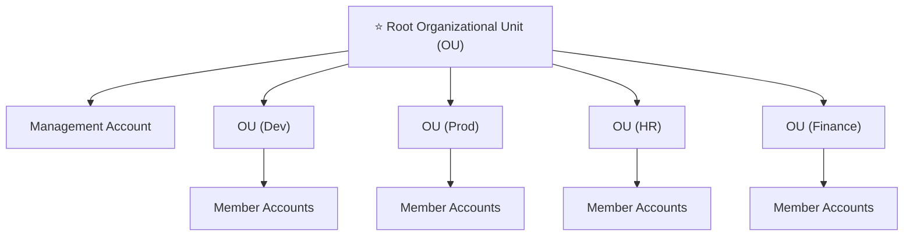

---

### ⭐⭐ Organizational Units (OU) — 3 cách tổ chức ví dụ

| Cách | Cấu trúc |
|---|---|
| ⭐⭐ **Business Unit** | **Sales OU · Retail OU · Finance OU** → mỗi OU chứa các account của bộ phận đó |
| ⭐⭐ **Environmental Lifecycle** | **Prod OU · Dev OU · Test OU** → tách theo môi trường |
| ⭐⭐ **Project-Based** | **Project 1 OU · Project 2 OU · Project 3 OU** → tách theo dự án |

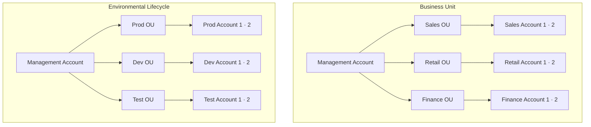

---

### ⭐⭐⭐ Advantages (lợi ích khi dùng nhiều account)

| Lợi ích |
|---|
| ⭐⭐⭐ **Multi Account thay vì One Account Multi VPC** |
| ⭐⭐ **Dùng chuẩn TAGGING cho mục đích billing** |
| ⭐⭐⭐ **Bật CLOUDTRAIL trên TẤT CẢ tài khoản, gửi log về MỘT S3 ACCOUNT TRUNG TÂM** |
| ⭐⭐⭐ **Gửi CLOUDWATCH LOGS về MỘT TÀI KHOẢN LOGGING TRUNG TÂM** |
| ⭐⭐⭐ **Thiết lập CROSS ACCOUNT ROLES cho mục đích quản trị** |

> ⭐⭐⭐ **Hai dòng về log trung tâm nối thẳng với chương 24** — đây là pattern audit chuẩn của doanh nghiệp lớn.

---

### ⭐⭐⭐ Security: Service Control Policies (SCP)

- ⭐⭐⭐ **IAM policies áp dụng lên OU hoặc ACCOUNTS để HẠN CHẾ Users và Roles**
- ⚠️⭐⭐⭐ **CHÚNG KHÔNG ÁP DỤNG CHO MANAGEMENT ACCOUNT (management account có toàn quyền admin)**
- ⚠️⭐⭐⭐ **PHẢI CÓ EXPLICIT ALLOW từ ROOT đi QUA TỪNG OU trên đường trực tiếp tới tài khoản đích** (⭐ **KHÔNG cho phép gì theo mặc định — giống IAM**)

> ⭐⭐⭐ **Hai dòng này là hai câu hỏi thi riêng biệt:**
> 1. **SCP KHÔNG áp dụng cho Management Account** — đây là bẫy rất hay gặp
> 2. **SCP mặc định KHÔNG cho phép gì** — phải allow xuyên suốt từ Root xuống

---

### ⭐⭐⭐ SCP Hierarchy — Ví dụ chi tiết (RA THI)

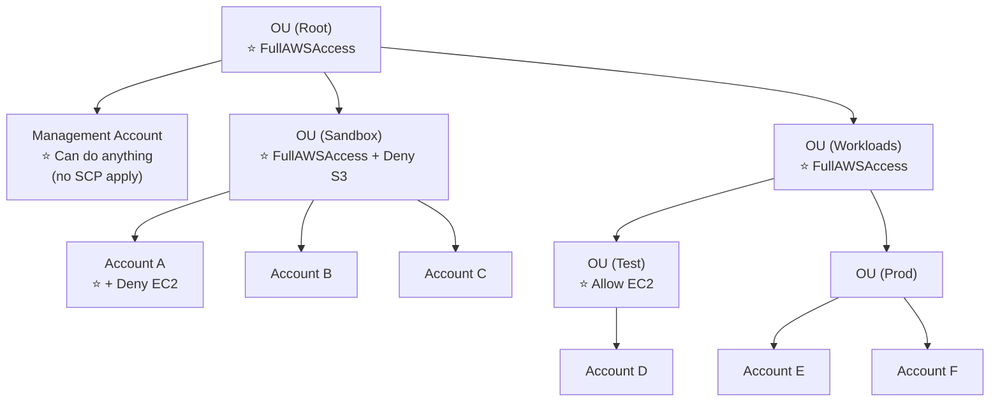

**Kết quả từng tài khoản:** ⭐⭐⭐

| Tài khoản | Quyền |
|---|---|
| ⭐⭐⭐ **Management Account** | **Làm được MỌI THỨ (SCP không áp dụng)** |
| ⭐⭐⭐ **Account A** | **Làm được mọi thứ NGOẠI TRỪ S3** (explicit Deny từ Sandbox OU) **và NGOẠI TRỪ EC2** (explicit Deny riêng) |
| ⭐⭐⭐ **Account B & C** | **Làm được mọi thứ NGOẠI TRỪ S3** (explicit Deny từ Sandbox OU) |
| ⭐⭐⭐ **Account D** | **Truy cập được EC2** |
| ⭐⭐⭐ **Prod OU & Account E & F** | **Làm được mọi thứ** |

> ⭐⭐⭐ **Đây là sơ đồ ra thi gần như nguyên văn.** Điểm mấu chốt: **Deny ở OU CHA sẽ kế thừa xuống TẤT CẢ account con**, và **Deny luôn thắng**.

---

### ⭐⭐ SCP Examples — Blocklist và Allowlist strategies

| Chiến lược | Cách làm |
|---|---|
| ⭐⭐⭐ **Blocklist** (phổ biến hơn) | **Gắn `FullAWSAccess` rồi thêm `Deny` cho những gì không muốn** |
| ⭐⭐ **Allowlist** | **Gỡ `FullAWSAccess`, chỉ `Allow` đúng những gì cần** |

**Ví dụ SCP chặn theo Region (bổ sung ngoài slide, rất hay dùng):**

```json
{
  "Version": "2012-10-17",
  "Statement": [{
    "Effect": "Deny",
    "NotAction": ["iam:*", "organizations:*", "route53:*", "cloudfront:*", "support:*"],
    "Resource": "*",
    "Condition": {
      "StringNotEquals": {
        "aws:RequestedRegion": ["us-east-1", "eu-west-1"]
      }
    }
  }]
}
```

> ⭐⭐ **Lưu ý:** các dịch vụ **global** (IAM, Organizations, Route 53, CloudFront, Support) phải đưa vào `NotAction`, nếu không sẽ bị chặn nhầm.

---

## 284. Organizations - Hands On

> 🖐️ Bài Hands On — **không có slide**. Các bước Console.

### Bước 1 — Tạo Organization

1. Console → tìm **AWS Organizations** → **Create an organization**
2. Chọn ⭐ **Enable all features** (khuyến nghị) thay vì chỉ **Consolidated billing**
   - ⚠️⭐⭐⭐ **SCP CHỈ dùng được khi bật "All features"**
3. AWS gửi email xác nhận tới địa chỉ của management account → **bấm link xác nhận**

### Bước 2 — Thêm tài khoản

| Cách | Thao tác |
|---|---|
| ⭐⭐ **Create an AWS account** | Nhập **Account name**, **Email** (⚠️ **phải là email CHƯA từng dùng cho AWS**), **IAM role name** (mặc định `OrganizationAccountAccessRole`) |
| ⭐⭐ **Invite an existing AWS account** | Nhập email hoặc Account ID → tài khoản kia phải **Accept invitation** |

> ⭐⭐⭐ **`OrganizationAccountAccessRole`** là role AWS tự tạo trong account mới, cho phép **management account assume vào để quản trị**. Đây chính là **Cross Account Role** mà bài 283 nhắc tới.

### Bước 3 — Tạo Organizational Units

1. Tab **AWS accounts** → chọn **Root** → **Actions** → ⭐ **Create new** (Organizational unit)
2. Đặt tên: `Sandbox`, `Workloads`…
3. Chọn account → **Actions** → ⭐ **Move** → chọn OU đích

### Bước 4 — Bật và gắn Service Control Policies ⭐⭐⭐

1. Menu trái → **Policies** → ⭐ **Service control policies** → **Enable service control policies**
   - ⚠️ Mặc định **chưa bật**, phải bật thủ công
2. Thấy sẵn policy ⭐ **`FullAWSAccess`** (gắn vào Root mặc định)
3. **Create policy** → ví dụ chặn S3:

```json
{
  "Version": "2012-10-17",
  "Statement": [{
    "Sid": "DenyS3",
    "Effect": "Deny",
    "Action": "s3:*",
    "Resource": "*"
  }]
}
```

4. Đặt tên `Deny-S3` → **Create policy**
5. Vào **AWS accounts** → chọn OU `Sandbox` → tab **Policies** → **Service control policies** → **Attach** → chọn `Deny-S3`

### Bước 5 — Kiểm chứng ⭐⭐⭐

1. Đăng nhập (hoặc switch role) vào một account trong OU `Sandbox`
2. Thử vào **S3** → ⭐ **Access Denied** dù IAM user có `AdministratorAccess`
3. Quay lại **Management Account** → vào S3 → ⭐ **vẫn vào được bình thường**

> ⭐⭐⭐ **Bước 5 chứng minh hai điều của bài 283:** **SCP ghi đè cả quyền admin của IAM**, và **SCP không áp dụng cho Management Account**.

### Bước 6 — Xem Consolidated Billing

- **Billing and Cost Management** (ở management account) → thấy chi phí **gộp của tất cả member accounts**

### CLI

```bash
# Xem thông tin organization
aws organizations describe-organization

# Liệt kê accounts
aws organizations list-accounts

# Liệt kê OU trong root
aws organizations list-roots
aws organizations list-organizational-units-for-parent --parent-id r-xxxx

# Liệt kê SCP đang gắn vào một target
aws organizations list-policies-for-target \
  --target-id ou-xxxx-yyyyyyyy --filter SERVICE_CONTROL_POLICY
```

> ⚠️ **Lưu ý khi học:** tạo Organization **miễn phí**, nhưng **mỗi member account là một tài khoản AWS riêng** với Free Tier riêng. **Rời khỏi organization** (Leave organization) đòi hỏi account đó phải có đủ thông tin thanh toán riêng.

---

## 285. Organizations - Tag Policies

### ⭐⭐ AWS Organizations – Tag Policies

- ⭐⭐⭐ **Giúp CHUẨN HÓA TAGS trên các tài nguyên trong một AWS Organization**
- ⭐⭐ **Đảm bảo TAG NHẤT QUÁN, audit tài nguyên đã gắn tag, duy trì phân loại tài nguyên đúng đắn…**
- ⭐⭐⭐ **Bạn định nghĩa TAG KEYS và CÁC GIÁ TRỊ ĐƯỢC PHÉP của chúng**
- ⭐⭐⭐ **Hỗ trợ AWS COST ALLOCATION TAGS và ATTRIBUTE-BASED ACCESS CONTROL (ABAC)**
- ⭐⭐⭐ **NGĂN CHẶN các thao tác gắn tag KHÔNG TUÂN THỦ trên các dịch vụ và tài nguyên được chỉ định** (⚠️ **KHÔNG có tác dụng với tài nguyên KHÔNG CÓ TAG**)
- ⭐⭐ **Sinh BÁO CÁO liệt kê tất cả tài nguyên đã gắn tag / không tuân thủ**
- ⭐⭐⭐ **Dùng EVENTBRIDGE để giám sát các tag không tuân thủ**

> ⭐⭐⭐ **Điểm bẫy quan trọng:** Tag Policy **chỉ kiểm soát GIÁ TRỊ của tag khi tag được gắn** — nó **KHÔNG bắt buộc tài nguyên phải có tag**. Muốn phát hiện tài nguyên **thiếu tag** thì dùng **AWS Config rule `required-tags`** (chương 24).
>
> ⭐⭐ **Hai ứng dụng của tag chuẩn hóa:** **Cost Allocation Tags** (phân bổ chi phí) và **ABAC** (phân quyền theo thuộc tính).

---

## 286. IAM - Advanced Policies

### ⭐⭐⭐ IAM Conditions — 4 condition key phải thuộc

| Condition key | Tác dụng |
|---|---|
| ⭐⭐⭐ **`aws:SourceIp`** | **Giới hạn IP CLIENT mà từ đó API call được thực hiện** |
| ⭐⭐⭐ **`aws:RequestedRegion`** | **Giới hạn REGION mà API call được gửi tới** |
| ⭐⭐⭐ **`ec2:ResourceTag`** | **Giới hạn dựa trên TAGS** |
| ⭐⭐⭐ **`aws:MultiFactorAuthPresent`** | **BẮT BUỘC MFA** |

**Ví dụ policy dùng các condition này (bổ sung ngoài slide):**

```json
{
  "Version": "2012-10-17",
  "Statement": [{
    "Effect": "Allow",
    "Action": "ec2:TerminateInstances",
    "Resource": "*",
    "Condition": {
      "IpAddress":   { "aws:SourceIp": "203.0.113.0/24" },
      "StringEquals":{ "aws:RequestedRegion": "us-east-1" },
      "Bool":        { "aws:MultiFactorAuthPresent": "true" }
    }
  }]
}
```

> ⭐⭐⭐ **Bốn key này ra thi rất đều.** Từ khóa nhận diện:
> - *"chỉ cho phép từ dải IP văn phòng"* → **`aws:SourceIp`**
> - *"chỉ cho phép làm việc ở một số region"* → **`aws:RequestedRegion`** (cũng dùng trong SCP)
> - *"chỉ thao tác được trên tài nguyên có tag Environment=Dev"* → **`ec2:ResourceTag`**
> - *"bắt buộc bật MFA mới được xóa"* → **`aws:MultiFactorAuthPresent`**

---

### ⭐⭐⭐ IAM for S3 — Bucket level vs Object level

| Permission | Áp dụng lên ARN | Cấp độ |
|---|---|---|
| ⭐⭐⭐ **`s3:ListBucket`** | **`arn:aws:s3:::test`** | ⭐⭐⭐ **BUCKET LEVEL permission** |
| ⭐⭐⭐ **`s3:GetObject`, `s3:PutObject`, `s3:DeleteObject`** | **`arn:aws:s3:::test/*`** | ⭐⭐⭐ **OBJECT LEVEL permission** |

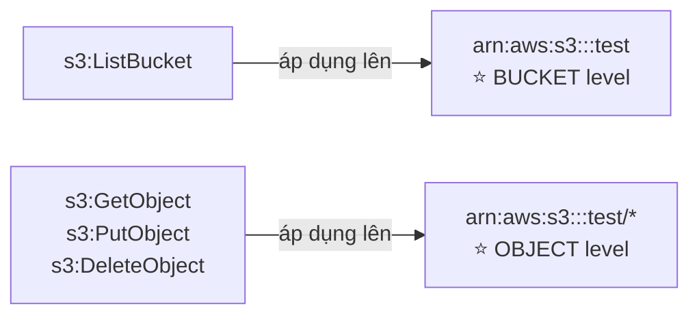

> ⭐⭐⭐ **ĐÂY LÀ LỖI PHỔ BIẾN NHẤT KHI VIẾT S3 POLICY — và là câu hỏi thi rất hay gặp.**
>
> Viết `"Resource": "arn:aws:s3:::test"` cho `s3:GetObject` → **KHÔNG hoạt động** (thiếu `/*`).
> Viết `"Resource": "arn:aws:s3:::test/*"` cho `s3:ListBucket` → **cũng KHÔNG hoạt động** (thừa `/*`).
>
> 💡 **Mẹo nhớ:** **ListBucket là thao tác lên CÁI THÙNG** → ARN thùng. **GetObject là thao tác lên ĐỒ TRONG THÙNG** → ARN thùng **`/*`**.

---

### ⭐⭐⭐ Resource Policies & `aws:PrincipalOrgID`

- ⭐⭐⭐ **`aws:PrincipalOrgID` dùng được trong BẤT KỲ resource policy nào để GIỚI HẠN TRUY CẬP chỉ cho các tài khoản LÀ THÀNH VIÊN của một AWS Organization**

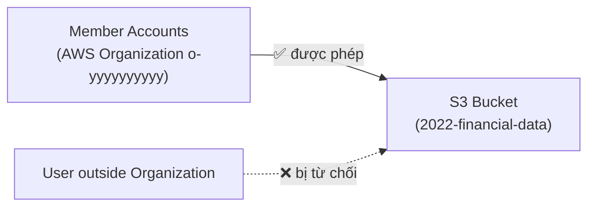

**Ví dụ bucket policy:**

```json
{
  "Version": "2012-10-17",
  "Statement": [{
    "Effect": "Allow",
    "Principal": "*",
    "Action": ["s3:GetObject"],
    "Resource": "arn:aws:s3:::2022-financial-data/*",
    "Condition": {
      "StringEquals": { "aws:PrincipalOrgID": "o-yyyyyyyyyy" }
    }
  }]
}
```

> ⭐⭐⭐ **Từ khóa nhận diện:** *"chỉ cho phép các tài khoản trong Organization truy cập bucket này"* → **`aws:PrincipalOrgID`**.
>
> ⭐⭐ **Lợi ích:** không cần liệt kê từng Account ID — thêm account mới vào Organization là tự động có quyền.

---

## 287. IAM - Resource-based Policies vs IAM Roles

### ⭐⭐⭐ Hai cách truy cập Cross-Account

| Cách | Mô tả |
|---|---|
| ⭐⭐⭐ **Resource-based policy** | **Gắn policy VÀO TÀI NGUYÊN** (ví dụ S3 bucket policy) |
| ⭐⭐⭐ **Dùng ROLE làm PROXY** | **Assume role ở tài khoản kia** |

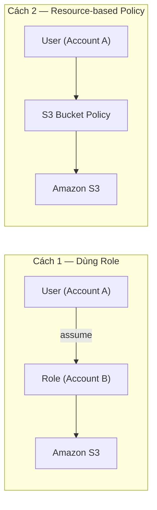

---

### ⭐⭐⭐ KHÁC BIỆT CỐT LÕI — RA THI CHẮC CHẮN

- ⚠️⭐⭐⭐ **Khi bạn ASSUME một role (user, application hoặc service), bạn TỪ BỎ QUYỀN GỐC của mình và nhận quyền được gán cho role đó**
- ⭐⭐⭐ **Khi dùng RESOURCE-BASED POLICY, principal KHÔNG PHẢI TỪ BỎ quyền của mình**

**⭐⭐⭐ Ví dụ kinh điển trên slide:**

> **User ở Account A cần SCAN một DynamoDB table ở Account A VÀ ĐỔ dữ liệu vào S3 bucket ở Account B.**

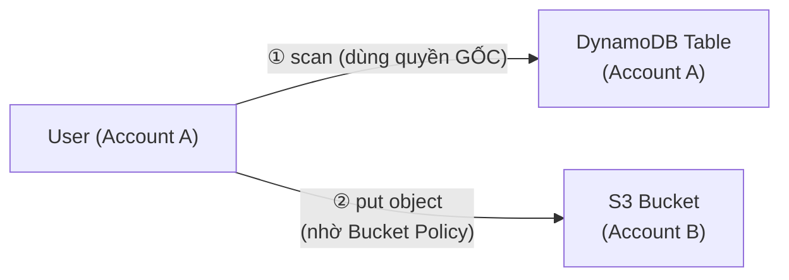

> ⭐⭐⭐ **Vì sao phải dùng Resource-based Policy trong ví dụ này?**
> Nếu user **assume role sang Account B**, họ sẽ **MẤT quyền đọc DynamoDB ở Account A** → không scan được nữa.
> Dùng **S3 Bucket Policy ở Account B** thì user **giữ nguyên quyền gốc** và vẫn ghi được sang B. ✅
>
> ⭐⭐⭐ **Đây là câu hỏi thi rất phổ biến.** Từ khóa: *"cần dùng quyền ở CẢ HAI tài khoản cùng lúc"* → **Resource-based Policy**, KHÔNG phải assume role.

- ⭐⭐⭐ **Được hỗ trợ bởi: Amazon S3 buckets, SNS topics, SQS queues, v.v…**

---

### ⭐⭐ Amazon EventBridge – Security

- ⭐⭐⭐ **Khi một rule chạy, nó CẦN QUYỀN TRÊN TARGET**

| Loại target | Cơ chế quyền |
|---|---|
| ⭐⭐⭐ **Resource-based policy** | **Lambda, SNS, SQS, S3 buckets, API Gateway…** |
| ⭐⭐⭐ **IAM role** | **EC2 Auto Scaling, Systems Manager Run Command, ECS task…** |

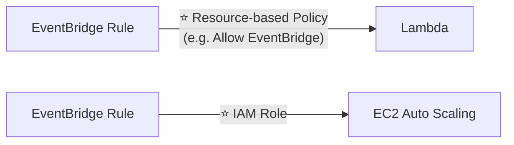

> ⭐⭐ **Cách nhớ:** dịch vụ nào **có resource policy riêng** (Lambda, SNS, SQS, S3, API Gateway) thì EventBridge dùng resource policy; dịch vụ nào **không có** thì phải cấp **IAM role** cho EventBridge.

---

## 288. IAM - Policy Evaluation Logic

### ⭐⭐⭐ IAM Permission Boundaries

- ⭐⭐⭐ **IAM Permission Boundaries được hỗ trợ cho USERS và ROLES (⚠️ KHÔNG phải GROUPS)**
- ⭐⭐⭐ **Tính năng NÂNG CAO dùng một MANAGED POLICY để đặt QUYỀN TỐI ĐA mà một IAM entity có thể có**

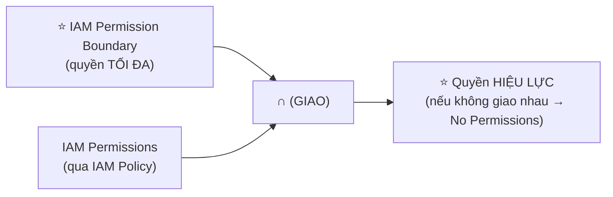

> ⭐⭐⭐ **Permission Boundary hoạt động như một "TRẦN QUYỀN".** Quyền thực tế = **GIAO của IAM Policy và Permission Boundary**. Nếu IAM Policy cho phép `s3:*` nhưng Boundary chỉ cho `ec2:*` → **không có quyền nào cả**.

**⭐⭐⭐ Use cases:**

| Use case |
|---|
| ⭐⭐⭐ **Có thể kết hợp với AWS Organizations SCP** |
| ⭐⭐⭐ **ỦY QUYỀN trách nhiệm cho người KHÔNG PHẢI admin trong giới hạn quyền của họ** — ví dụ cho phép họ **tạo IAM user mới** |
| ⭐⭐⭐ **Cho phép developer TỰ GÁN POLICY và tự quản lý quyền của mình, đồng thời ĐẢM BẢO HỌ KHÔNG THỂ "LEO THANG" ĐẶC QUYỀN (= tự biến mình thành admin)** |
| ⭐⭐⭐ **Hữu ích để GIỚI HẠN MỘT USER CỤ THỂ** (thay vì cả tài khoản như Organizations & SCP) |

> ⭐⭐⭐ **Từ khóa nhận diện cực rõ: "privilege escalation"** (leo thang đặc quyền) → **Permission Boundaries**.
>
> ⭐⭐⭐ **Phân biệt phạm vi:**
> - **SCP** → giới hạn cả **TÀI KHOẢN / OU**
> - **Permission Boundary** → giới hạn **MỘT user hoặc role cụ thể**

---

### ⭐⭐⭐ IAM Policy Evaluation Logic — SƠ ĐỒ QUAN TRỌNG NHẤT CHƯƠNG

Thứ tự đánh giá khi một request tới AWS:

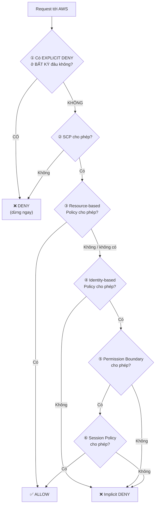

**⭐⭐⭐ BA NGUYÊN TẮC VÀNG PHẢI THUỘC:**

| # | Nguyên tắc |
|---|---|
| 1 | ⭐⭐⭐ **EXPLICIT DENY luôn THẮNG mọi thứ** — ở bất kỳ tầng nào |
| 2 | ⭐⭐⭐ **Mặc định là IMPLICIT DENY** — không có Allow nào thì bị từ chối |
| 3 | ⭐⭐⭐ **Một Allow ở bất kỳ tầng nào (và không có Deny) thì được phép** |

> ⭐⭐⭐ **Đề thi rất thích dạng:** cho một IAM policy `Allow s3:*` và một SCP `Deny s3:*` → hỏi kết quả → **DENY** (explicit deny thắng).
>
> 💡 **Mẹo nhớ ngắn gọn:** **"Deny thắng tất, không Allow thì cũng coi như Deny."**

---

### ⭐⭐ Example IAM Policy — Bài tập tự kiểm tra

Slide đưa ra một policy rồi hỏi ba câu:

| Câu hỏi |
|---|
| ⭐⭐ **Bạn có thực hiện được `sqs:CreateQueue` không?** |
| ⭐⭐ **Bạn có thực hiện được `sqs:DeleteQueue` không?** |
| ⭐⭐ **Bạn có thực hiện được `ec2:DescribeInstances` không?** |

> ⭐⭐⭐ **Cách làm dạng bài này trong phòng thi — 3 bước:**
> 1. **Tìm `Deny` trước** — nếu action nằm trong statement `Deny` → **KHÔNG được**, dừng luôn
> 2. **Tìm `Allow`** — action có khớp `Action` VÀ `Resource` không?
> 3. **Kiểm tra `Condition`** — điều kiện có thỏa không?
>
> ⚠️ **Chú ý wildcard:** `sqs:*` khớp cả `CreateQueue` và `DeleteQueue`; `sqs:Create*` chỉ khớp `CreateQueue`. Và **không có Allow nào khớp = implicit deny**.

---

## 289. AWS IAM Identity Center

### ⭐⭐⭐ AWS IAM Identity Center (successor to AWS Single Sign-On)

- ⭐⭐⭐ **MỘT LẦN ĐĂNG NHẬP (single sign-on) cho TẤT CẢ:**

| Đối tượng |
|---|
| ⭐⭐⭐ **Các tài khoản AWS trong AWS Organizations** |
| ⭐⭐⭐ **Ứng dụng đám mây doanh nghiệp** (ví dụ **Salesforce, Box, Microsoft 365**…) |
| ⭐⭐⭐ **Ứng dụng hỗ trợ SAML 2.0** |
| ⭐⭐⭐ **EC2 Windows Instances** |

**⭐⭐⭐ Identity providers (nguồn danh tính):**

| Nguồn |
|---|
| ⭐⭐⭐ **Built-in identity store TRONG IAM Identity Center** |
| ⭐⭐⭐ **Bên thứ ba: Active Directory (AD), OneLogin, Okta…** |

> ⭐⭐⭐ **Nhớ tên cũ: AWS Single Sign-On (SSO).** Đề thi có thể dùng **cả hai tên**.

---

### ⭐⭐ Login Flow

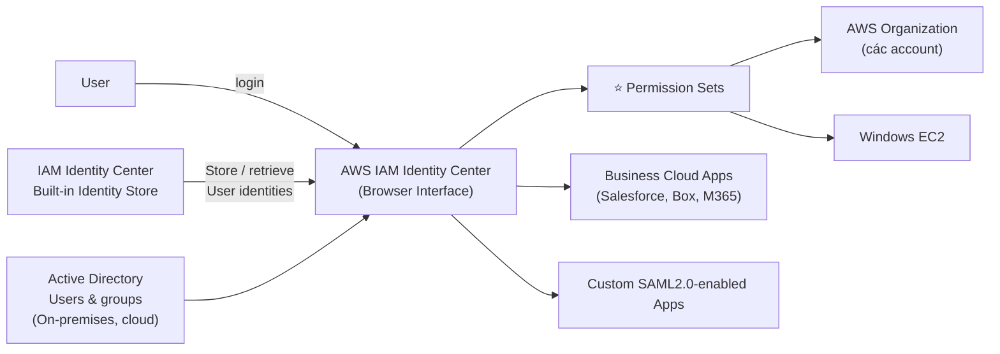

---

### ⭐⭐⭐ Permission Sets — Khái niệm cốt lõi

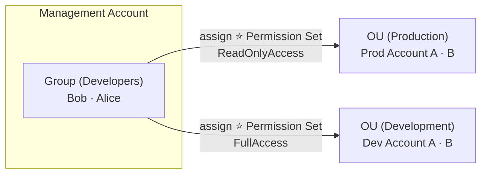

> ⭐⭐⭐ **Permission Set = MỘT TẬP HỢP các IAM Policies được gán cho users và groups để định nghĩa quyền truy cập AWS.**
>
> Ví dụ trên: nhóm **Developers** có **FullAccess** ở môi trường **Dev**, nhưng chỉ **ReadOnlyAccess** ở **Production** — **cùng một nhóm người, quyền khác nhau theo account**.

---

### ⭐⭐⭐ Ba nhóm tính năng của IAM Identity Center

| Nhóm | Chi tiết |
|---|---|
| ⭐⭐⭐ **Multi-Account Permissions** | **Quản lý truy cập XUYÊN CÁC TÀI KHOẢN AWS trong Organization**<br/>⭐⭐⭐ **PERMISSION SETS — một tập hợp một hoặc nhiều IAM Policies gán cho users/groups** |
| ⭐⭐⭐ **Application Assignments** | **SSO tới nhiều ứng dụng doanh nghiệp SAML 2.0** (Salesforce, Box, Microsoft 365…)<br/>**Cung cấp URL, certificates và metadata cần thiết** |
| ⭐⭐⭐ **Attribute-Based Access Control (ABAC)** | **Quyền CHI TIẾT dựa trên THUỘC TÍNH của user lưu trong IAM Identity Center Identity Store**<br/>**Ví dụ: cost center, title, locale…**<br/>⭐⭐⭐ **Use case: ĐỊNH NGHĨA QUYỀN MỘT LẦN, rồi thay đổi truy cập AWS bằng cách ĐỔI THUỘC TÍNH** |

> ⭐⭐⭐ **ABAC là từ khóa ra thi:** *"không muốn sửa policy mỗi khi nhân viên đổi phòng ban"* → **Attribute-Based Access Control**.

---

### ⭐⭐ Fine-grained Permissions and Assignments

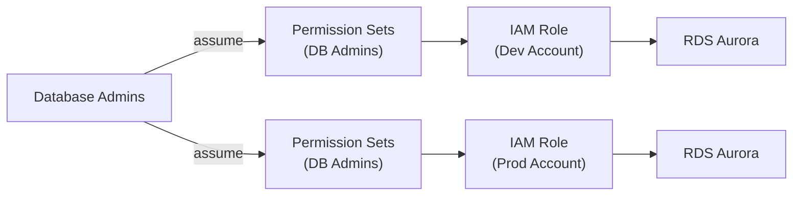

> ⭐⭐ **Cơ chế bên dưới:** Permission Set thực chất **tạo ra IAM Role trong từng member account**, và user **assume role đó** khi chọn account để làm việc.

---

## 290. AWS Directory Services

### ⭐⭐ What is Microsoft Active Directory (AD)?

- ⭐⭐⭐ **Có trên MỌI Windows Server có AD DOMAIN SERVICES**
- ⭐⭐⭐ **Là CƠ SỞ DỮ LIỆU CÁC ĐỐI TƯỢNG: User Accounts, Computers, Printers, File Shares, Security Groups**
- ⭐⭐ **Quản lý bảo mật TẬP TRUNG, tạo tài khoản, gán quyền**
- ⭐⭐⭐ **Các đối tượng được tổ chức thành CÂY (trees)**
- ⭐⭐⭐ **Một NHÓM CÁC CÂY là một FOREST**

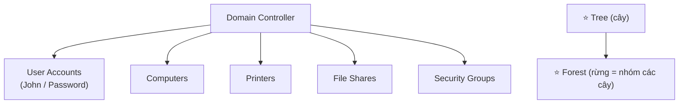

> ⭐⭐ **Nhớ ba thuật ngữ: Domain Controller, Tree, Forest.**

---

### ⭐⭐⭐ AWS Directory Services — BA LOẠI (RA THI CHẮC CHẮN)

| Loại | Đặc điểm |
|---|---|
| ⭐⭐⭐ **AWS Managed Microsoft AD** | **TẠO AD RIÊNG CỦA BẠN TRONG AWS, quản lý users TẠI CHỖ (locally), hỗ trợ MFA**<br/>⭐⭐⭐ **Thiết lập kết nối "TRUST" với AD on-premises của bạn** |
| ⭐⭐⭐ **AD Connector** | ⭐⭐⭐ **Directory GATEWAY (PROXY) để CHUYỂN TIẾP tới AD on-premises, hỗ trợ MFA**<br/>⚠️⭐⭐⭐ **USERS ĐƯỢC QUẢN LÝ TRÊN AD ON-PREMISES** (không lưu trên AWS) |
| ⭐⭐⭐ **Simple AD** | ⭐⭐⭐ **Directory được quản lý TƯƠNG THÍCH AD trên AWS**<br/>⚠️⭐⭐⭐ **KHÔNG THỂ nối (joined) với AD on-premises** |

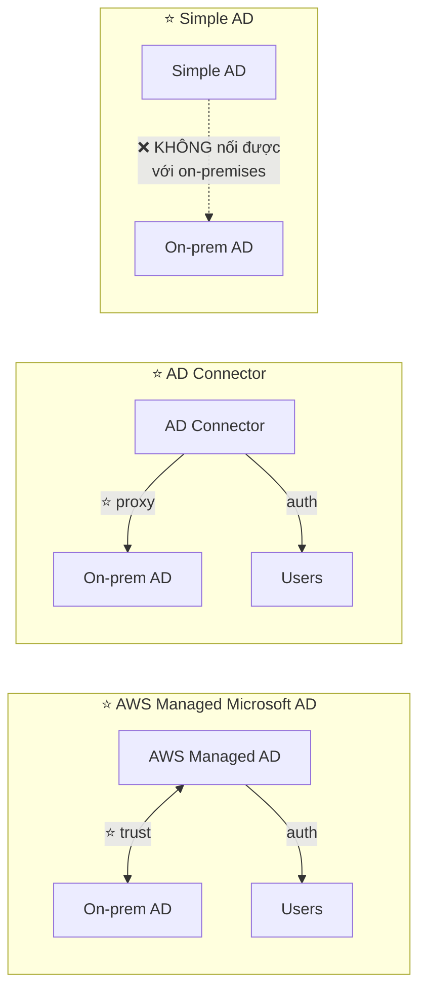

> ⭐⭐⭐ **CÁCH CHỌN TRONG PHÒNG THI:**
>
> | Yêu cầu trong đề | Đáp án |
> |---|---|
> | *"Cần AD trên AWS VÀ kết nối với AD on-premises"* | ⭐⭐⭐ **AWS Managed Microsoft AD** (trust relationship) |
> | *"KHÔNG muốn lưu user trên AWS, giữ nguyên AD on-premises"* | ⭐⭐⭐ **AD Connector** (proxy) |
> | *"Chỉ cần directory đơn giản trên AWS, KHÔNG cần nối on-premises"* | ⭐⭐⭐ **Simple AD** |
>
> 💡 **Mẹo nhớ:** **Managed = có AD RIÊNG trên AWS + trust. Connector = KHÔNG lưu gì, chỉ chuyển tiếp. Simple = đơn độc, không nối được.**

---

### ⭐⭐ IAM Identity Center – Active Directory Setup

**Trường hợp 1 — Kết nối tới AWS Managed Microsoft AD:**

- ⭐⭐⭐ **Tích hợp CÓ SẴN (out of the box)**

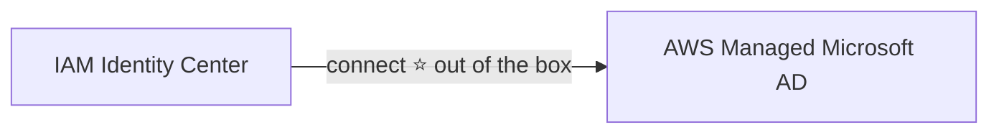

**Trường hợp 2 — Kết nối tới Self-Managed Directory (hai cách):**

| Cách | Chi tiết |
|---|---|
| ⭐⭐⭐ **Tạo TWO-WAY TRUST RELATIONSHIP** dùng AWS Managed Microsoft AD | |
| ⭐⭐⭐ **Tạo một AD CONNECTOR** | |

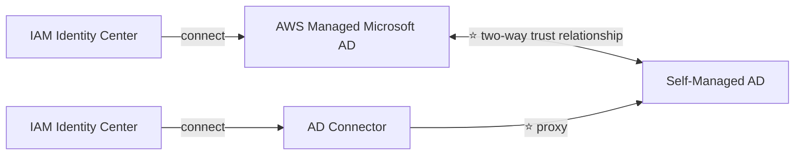

> ⭐⭐ **Nhớ cụm "two-way trust relationship"** — đây là cách nối IAM Identity Center với AD tự quản.

---

## 291. AWS Directory Services - Hands On

> 🖐️ Bài Hands On — **không có slide**. Bài rất ngắn (1 phút) — **chủ yếu tham quan giao diện**.

### Các bước Console

1. Console → tìm **Directory Service** → **Directories** → **Set up directory**
2. Chọn **Directory type**:

| Loại | Chi phí tham khảo |
|---|---|
| ⭐⭐⭐ **AWS Managed Microsoft AD** | **Standard ~$0.40/giờ (~$290/tháng)**, Enterprise đắt hơn |
| ⭐⭐⭐ **AD Connector** | **Small ~$0.05/giờ (~$36/tháng)** |
| ⭐⭐⭐ **Simple AD** | **Small ~$0.05/giờ (~$36/tháng)** |
| **Amazon Cognito User Pools** | (xuất hiện trong danh sách, đã học ở chương 19) |

3. Nếu chọn **AWS Managed Microsoft AD**:
   - **Edition**: **Standard** (≤ 5.000 users) hoặc **Enterprise** (≤ 50.000 users)
   - ⭐ **Directory DNS name**: `corp.example.com`
   - **Directory NetBIOS name**: `CORP`
   - ⭐ **Admin password** (cho tài khoản `Admin`)
   - ⭐⭐ **VPC và Subnets**: phải chọn **2 subnet ở 2 AZ khác nhau**
4. **Create directory** → mất **~20–40 phút**

### Sau khi tạo

- Tab **Directory details** → thấy ⭐ **DNS addresses** (2 IP của domain controller)
- ⭐⭐ **Networking & security** → **Directory sharing**, **AWS apps & services**
- ⭐⭐ Có thể bật tích hợp với: **Amazon WorkSpaces, Amazon QuickSight, Amazon Connect, AWS IAM Identity Center, Amazon RDS for SQL Server, FSx for Windows File Server**

> ⭐⭐ **Điểm liên hệ chương cũ:** đây chính là **AWS Managed Microsoft AD** mà **FSx for Windows File Server** (chương 16, bài 177) bắt buộc phải có.

### CLI

```bash
# Liệt kê directories
aws ds describe-directories

# Xem chi tiết
aws ds describe-directories --directory-ids d-1234567890

# Xóa directory
aws ds delete-directory --directory-id d-1234567890
```

> ⚠️⚠️⭐⭐⭐ **CẢNH BÁO CHI PHÍ — RẤT QUAN TRỌNG:** **AWS Directory Service KHÔNG có Free Tier** (ngoài 30 ngày dùng thử cho Managed Microsoft AD). **AWS Managed Microsoft AD Standard tốn ~$290/THÁNG** — đây là **một trong những dịch vụ đắt nhất** bạn có thể vô tình để chạy.
>
> 💡 **Khuyến nghị: CHỈ XEM VIDEO, KHÔNG TẠO THẬT.** Nếu đã lỡ tạo, **Delete directory NGAY**. Đây cũng chính là cảnh báo tôi đã ghi ở **chương 16 bài 177** (FSx for Windows) — nhiều người xóa FSx nhưng **quên xóa Directory**.

---

## 292. AWS Control Tower

### ⭐⭐⭐ AWS Control Tower

- ⭐⭐⭐ **Cách DỄ DÀNG để THIẾT LẬP và QUẢN TRỊ một môi trường AWS ĐA TÀI KHOẢN an toàn và tuân thủ, DỰA TRÊN BEST PRACTICES**
- ⭐⭐⭐ **AWS Control Tower DÙNG AWS ORGANIZATIONS để tạo tài khoản**

**⭐⭐⭐ Benefits (4 lợi ích):**

| Lợi ích |
|---|
| ⭐⭐⭐ **TỰ ĐỘNG thiết lập môi trường chỉ trong vài cú click** |
| ⭐⭐⭐ **TỰ ĐỘNG quản lý policy liên tục bằng GUARDRAILS** |
| ⭐⭐⭐ **PHÁT HIỆN vi phạm policy và KHẮC PHỤC chúng** |
| ⭐⭐⭐ **GIÁM SÁT compliance qua DASHBOARD TƯƠNG TÁC** |

> ⭐⭐⭐ **Quan hệ với Organizations:** **Control Tower KHÔNG thay thế Organizations — nó XÂY DỰNG TRÊN Organizations.**
>
> 💡 **Cách hiểu:** **Organizations** = bộ khung thô (tạo account, OU, SCP thủ công). **Control Tower** = **bộ setup tự động theo best practice** + **guardrails** + **dashboard**.

---

### ⭐⭐⭐ AWS Control Tower – Guardrails

- ⭐⭐⭐ **Cung cấp QUẢN TRỊ LIÊN TỤC cho môi trường Control Tower (các tài khoản AWS)**

| Loại Guardrail | Cơ chế | Ví dụ |
|---|---|---|
| ⭐⭐⭐ **Preventive Guardrail** | **Dùng SCPs** | **Hạn chế Regions trên tất cả tài khoản** |
| ⭐⭐⭐ **Detective Guardrail** | **Dùng AWS Config** | **Xác định các tài nguyên KHÔNG GẮN TAG** |

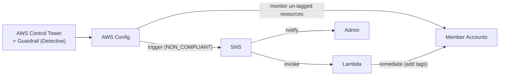

> ⭐⭐⭐ **ĐÂY LÀ BẢNG RA THI CỦA BÀI 292 — và nó nối thẳng với chương 24:**
> - **Preventive = SCP = NGĂN CHẶN trước** (nhớ: SCP **chặn được**)
> - **Detective = AWS Config = PHÁT HIỆN sau** (nhớ: Config **không chặn được**, chỉ phát hiện — bài 280 chương 24)
>
> 💡 **Mẹo nhớ:** **Preventive = "cấm cửa" (SCP). Detective = "thám tử" (Config).**

---

## 🧭 Cheat Sheet toàn chương ⭐⭐⭐

| Từ khóa trong đề | Đáp án |
|---|---|
| *"quản lý nhiều tài khoản AWS, gộp hóa đơn"* | **AWS Organizations** |
| *"chia sẻ giảm giá RI/Savings Plans giữa các account"* | **Consolidated Billing trong Organizations** |
| *"hạn chế quyền của cả một OU/account"* | ⭐ **Service Control Policy (SCP)** |
| ⚠️ *"SCP có áp dụng cho Management Account không?"* | ❌ **KHÔNG** |
| *"chuẩn hóa tag trên toàn Organization"* | **Tag Policies** |
| ⚠️ *"phát hiện tài nguyên THIẾU tag"* | **AWS Config `required-tags`** (Tag Policy không làm được) |
| *"chỉ cho phép gọi API từ dải IP văn phòng"* | **`aws:SourceIp`** |
| *"giới hạn region được dùng"* | **`aws:RequestedRegion`** |
| *"bắt buộc MFA"* | **`aws:MultiFactorAuthPresent`** |
| *"phân quyền theo tag của tài nguyên"* | **`ec2:ResourceTag`** |
| ⭐ *"policy S3 liệt kê bucket"* | **`s3:ListBucket` → ARN `arn:aws:s3:::test`** (KHÔNG có `/*`) |
| ⭐ *"policy S3 đọc/ghi object"* | **`s3:GetObject` → ARN `arn:aws:s3:::test/*`** (CÓ `/*`) |
| *"chỉ cho account trong Organization truy cập bucket"* | ⭐ **`aws:PrincipalOrgID`** |
| ⭐⭐ *"cần dùng quyền ở CẢ HAI account cùng lúc"* | **Resource-based Policy** (assume role sẽ MẤT quyền gốc) |
| *"EventBridge gọi Lambda cần quyền gì"* | **Resource-based policy** (EC2 ASG/SSM/ECS thì dùng **IAM Role**) |
| ⭐⭐ *"ngăn developer tự biến mình thành admin"* | **IAM Permission Boundaries** |
| *"Permission Boundary áp dụng cho gì"* | **Users và Roles** — ❌ **KHÔNG phải Groups** |
| ⭐⭐⭐ *"IAM Policy Allow nhưng SCP Deny"* | ❌ **DENY** — explicit deny luôn thắng |
| *"single sign-on cho nhiều AWS account + Salesforce/M365"* | ⭐ **AWS IAM Identity Center** (tên cũ **AWS SSO**) |
| *"tập hợp IAM policies gán cho user/group trong Identity Center"* | ⭐ **Permission Set** |
| *"đổi quyền bằng cách đổi thuộc tính nhân viên"* | ⭐ **ABAC (Attribute-Based Access Control)** |
| ⭐ *"cần AD trên AWS + kết nối AD on-premises"* | **AWS Managed Microsoft AD** (trust) |
| ⭐ *"không lưu user trên AWS, chỉ chuyển tiếp về on-premises"* | **AD Connector** (proxy) |
| ⭐ *"directory đơn giản, không cần nối on-premises"* | **Simple AD** |
| *"thiết lập môi trường multi-account theo best practice"* | ⭐ **AWS Control Tower** |
| ⭐ *"guardrail NGĂN CHẶN"* | **Preventive → SCP** |
| ⭐ *"guardrail PHÁT HIỆN"* | **Detective → AWS Config** |

---

## Trắc nghiệm 22: IAM Advanced Quiz

### Các điểm dễ bị bẫy

| Câu hỏi thường gặp | Đáp án đúng | Vì sao đáp án khác sai |
|---|---|---|
| AWS Organizations là global hay regional? | ⭐ **GLOBAL service** | |
| Một member account thuộc mấy organization? | ⭐ **CHỈ MỘT** | |
| Lợi ích chi phí của Organizations? | **Consolidated billing, volume discount, chia sẻ RI & Savings Plans** | |
| SCP áp dụng cho Management Account không? | ❌⭐⭐⭐ **KHÔNG — management account toàn quyền** | Đây là bẫy số 1 |
| SCP mặc định cho phép gì? | ⭐ **KHÔNG GÌ CẢ** — phải explicit allow từ Root xuống | Giống IAM |
| Account trong OU có SCP `Deny S3` thì sao? | ⭐ **Không dùng được S3 dù IAM là Administrator** | SCP ghi đè IAM |
| Bật SCP cần điều kiện gì? | ⭐⭐ **Organization phải bật "All features"** | Chỉ Consolidated billing thì không có SCP |
| Tag Policy bắt tài nguyên phải có tag không? | ❌⭐⭐ **KHÔNG — chỉ kiểm soát GIÁ TRỊ tag khi gắn** | Muốn bắt buộc có tag → **Config `required-tags`** |
| Tag Policy hỗ trợ gì? | **Cost Allocation Tags và ABAC** | |
| Giới hạn IP gọi API? | **`aws:SourceIp`** | |
| Giới hạn region? | **`aws:RequestedRegion`** | |
| Bắt buộc MFA? | **`aws:MultiFactorAuthPresent`** | |
| `s3:ListBucket` dùng ARN nào? | ⭐⭐⭐ **`arn:aws:s3:::test`** (bucket level) | ❌ Không có `/*` |
| `s3:GetObject` dùng ARN nào? | ⭐⭐⭐ **`arn:aws:s3:::test/*`** (object level) | ❌ Thiếu `/*` là không chạy |
| Chỉ cho account trong Org truy cập bucket? | ⭐ **`aws:PrincipalOrgID`** | Không cần liệt kê từng Account ID |
| Assume role thì quyền gốc thế nào? | ⚠️⭐⭐⭐ **BỊ TỪ BỎ (give up)** | Resource-based policy thì **giữ nguyên** |
| User account A scan DynamoDB ở A + ghi S3 ở B? | ⭐⭐⭐ **S3 Bucket Policy ở B** (resource-based) | ❌ Assume role sang B sẽ mất quyền đọc DynamoDB ở A |
| Dịch vụ nào hỗ trợ resource-based policy? | **S3, SNS, SQS…** | |
| EventBridge gọi Lambda cần gì? | **Resource-based policy** | EC2 ASG/SSM/ECS task → **IAM Role** |
| Permission Boundary áp dụng cho ai? | ⭐⭐⭐ **Users và Roles** — ❌ **KHÔNG phải Groups** | |
| Permission Boundary làm gì? | ⭐ **Đặt QUYỀN TỐI ĐA** — quyền thực tế = **GIAO** với IAM policy | |
| Ngăn developer tự leo thang đặc quyền? | ⭐⭐⭐ **Permission Boundaries** | Từ khóa **"privilege escalation"** |
| Phân biệt SCP và Permission Boundary? | **SCP = cả account/OU; Boundary = MỘT user/role cụ thể** | |
| Explicit Deny vs Allow? | ⭐⭐⭐ **Explicit DENY LUÔN THẮNG** | |
| Không có Allow nào thì sao? | ⭐ **Implicit Deny** | |
| IAM Identity Center tên cũ là gì? | **AWS Single Sign-On (SSO)** | |
| Identity Center đăng nhập được vào đâu? | **AWS accounts trong Org, business cloud apps, SAML 2.0 apps, EC2 Windows** | |
| Permission Set là gì? | ⭐⭐⭐ **Tập hợp một hoặc nhiều IAM Policies gán cho users/groups** | |
| Đổi quyền theo thuộc tính nhân viên? | ⭐ **ABAC** (cost center, title, locale…) | |
| Nhóm đối tượng trong AD gọi là gì? | **Trees**; nhóm các tree là ⭐ **Forest** | |
| Cần AD riêng trên AWS + trust với on-premises? | ⭐⭐⭐ **AWS Managed Microsoft AD** | |
| Giữ user ở on-premises, AWS chỉ proxy? | ⭐⭐⭐ **AD Connector** | |
| Directory đơn giản không nối on-premises? | ⭐⭐⭐ **Simple AD** | ⚠️ **KHÔNG join được với on-prem AD** |
| Loại nào hỗ trợ MFA? | **AWS Managed Microsoft AD và AD Connector** | |
| IAM Identity Center + self-managed AD? | **Two-way trust với AWS Managed Microsoft AD, HOẶC AD Connector** | |
| Control Tower dùng dịch vụ nào để tạo account? | ⭐⭐⭐ **AWS Organizations** | |
| Preventive Guardrail dùng gì? | ⭐⭐⭐ **SCPs** (ví dụ: hạn chế Regions) | |
| Detective Guardrail dùng gì? | ⭐⭐⭐ **AWS Config** (ví dụ: tìm tài nguyên chưa gắn tag) | |
| Control Tower có thay thế Organizations không? | ❌ **KHÔNG — xây DỰNG TRÊN Organizations** | |

---

### Checklist tự kiểm tra trước khi làm quiz

**Organizations & SCP:**
- [ ] Nhớ **Organizations là GLOBAL**, member account chỉ thuộc **1** organization
- [ ] Thuộc 3 lợi ích chi phí: **consolidated billing, volume discount, chia sẻ RI/Savings Plans**
- [ ] ⭐ Nhớ **SCP KHÔNG áp dụng cho Management Account**
- [ ] ⭐ Nhớ **SCP mặc định không cho phép gì**, phải allow xuyên suốt từ Root
- [ ] Hiểu **sơ đồ SCP Hierarchy** ở bài 283 (Account A/B/C/D/E/F)
- [ ] Nhớ **SCP cần bật "All features"**
- [ ] ⭐ Phân biệt **Tag Policy (kiểm soát giá trị tag)** vs **Config `required-tags` (bắt buộc có tag)**

**IAM nâng cao:**
- [ ] Thuộc **4 condition key**: `aws:SourceIp`, `aws:RequestedRegion`, `ec2:ResourceTag`, `aws:MultiFactorAuthPresent`
- [ ] ⭐⭐ Nhớ **`s3:ListBucket` → ARN bucket**; **`s3:GetObject` → ARN bucket + `/*`**
- [ ] Nhớ **`aws:PrincipalOrgID`** để giới hạn theo Organization
- [ ] ⭐⭐⭐ Hiểu **assume role = MẤT quyền gốc**; **resource-based policy = GIỮ quyền gốc**
- [ ] Thuộc **ví dụ DynamoDB Account A + S3 Account B**
- [ ] ⭐ Nhớ **Permission Boundary chỉ cho Users và Roles**, dùng chống **privilege escalation**
- [ ] ⭐⭐⭐ Thuộc **3 nguyên tắc đánh giá policy**: Deny thắng tất · mặc định implicit deny · Allow ở bất kỳ tầng nào (không Deny) thì được

**Danh tính doanh nghiệp:**
- [ ] Nhớ **IAM Identity Center = AWS SSO cũ**, khái niệm **Permission Set**
- [ ] Nhớ **ABAC** để đổi quyền bằng thuộc tính
- [ ] ⭐⭐ Thuộc **3 loại Directory Service** và cách chọn (Managed / Connector / Simple)
- [ ] Nhớ **Simple AD KHÔNG join được on-premises AD**
- [ ] ⭐ Nhớ **Control Tower: Preventive = SCP, Detective = AWS Config**

---

## Thuật ngữ Anh — Việt

| Tiếng Anh | Tiếng Việt |
|---|---|
| AWS Organizations | Dịch vụ quản lý nhiều tài khoản AWS |
| Global service | Dịch vụ toàn cầu, không theo region |
| Management account | Tài khoản quản lý (tài khoản chính) |
| Member accounts | Các tài khoản thành viên |
| Consolidated Billing | Gộp hóa đơn về một đầu mối |
| Volume discount | Giảm giá theo mức sử dụng gộp |
| Reserved Instances | Máy chủ đặt trước để giảm giá |
| Savings Plans | Gói cam kết chi tiêu để giảm giá |
| Organizational Unit (OU) | Đơn vị tổ chức nhóm các tài khoản |
| Root OU | Đơn vị tổ chức gốc |
| Business Unit | Đơn vị kinh doanh |
| Environmental Lifecycle | Vòng đời môi trường (dev/test/prod) |
| Project-Based | Tổ chức theo dự án |
| Tagging standards | Chuẩn gắn nhãn tài nguyên |
| Cross Account Roles | Vai trò dùng chung giữa các tài khoản |
| Service Control Policies (SCP) | Chính sách kiểm soát dịch vụ cấp tổ chức |
| Explicit allow / Explicit deny | Cho phép / từ chối tường minh |
| Implicit deny | Từ chối ngầm định (do không có allow) |
| Blocklist / Allowlist strategy | Chiến lược chặn / chỉ cho phép |
| FullAWSAccess | Chính sách cho toàn quyền AWS |
| Tag Policies | Chính sách chuẩn hóa nhãn |
| Standardize tags | Chuẩn hóa nhãn |
| Cost Allocation Tags | Nhãn dùng để phân bổ chi phí |
| Attribute-based Access Control (ABAC) | Phân quyền theo thuộc tính |
| Non-compliant | Không tuân thủ |
| IAM Conditions | Điều kiện trong chính sách IAM |
| aws:SourceIp | Điều kiện giới hạn IP nguồn |
| aws:RequestedRegion | Điều kiện giới hạn vùng được gọi |
| ec2:ResourceTag | Điều kiện dựa trên nhãn tài nguyên |
| aws:MultiFactorAuthPresent | Điều kiện bắt buộc xác thực hai lớp |
| Bucket level permission | Quyền ở mức thùng chứa |
| Object level permission | Quyền ở mức đối tượng bên trong |
| ARN (Amazon Resource Name) | Định danh tài nguyên của AWS |
| Resource policies | Chính sách gắn trên tài nguyên |
| aws:PrincipalOrgID | Điều kiện giới hạn theo tổ chức |
| Principal | Chủ thể thực hiện hành động |
| Cross account | Xuyên tài khoản |
| Assume a role | Mượn quyền của một vai trò |
| Give up permissions | Từ bỏ quyền hiện có |
| Proxy | Trung gian chuyển tiếp |
| Resource-based policy | Chính sách gắn trên tài nguyên |
| Identity-based policy | Chính sách gắn trên danh tính |
| IAM Permission Boundaries | Giới hạn quyền tối đa của một thực thể |
| Managed policy | Chính sách được quản lý sẵn |
| Maximum permissions | Quyền tối đa có thể có |
| Delegate responsibilities | Ủy quyền trách nhiệm |
| Privilege escalation | Leo thang đặc quyền |
| Policy Evaluation Logic | Logic đánh giá chính sách |
| Session Policy | Chính sách áp dụng cho phiên làm việc |
| AWS IAM Identity Center | Dịch vụ đăng nhập một lần cho AWS |
| Single Sign-On (SSO) | Đăng nhập một lần dùng cho nhiều nơi |
| Identity providers | Nhà cung cấp danh tính |
| Built-in identity store | Kho danh tính có sẵn |
| SAML 2.0 | Chuẩn trao đổi xác thực doanh nghiệp |
| Business cloud applications | Ứng dụng đám mây doanh nghiệp |
| Permission Sets | Tập hợp chính sách gán cho người dùng |
| Multi-Account Permissions | Phân quyền xuyên nhiều tài khoản |
| Application Assignments | Gán quyền truy cập ứng dụng |
| Fine-grained permissions | Phân quyền chi tiết |
| Identity Store | Kho lưu danh tính người dùng |
| Microsoft Active Directory (AD) | Dịch vụ thư mục của Microsoft |
| AD Domain Services | Dịch vụ miền của Active Directory |
| Domain Controller | Máy chủ điều khiển miền |
| User Accounts / Computers / Printers | Tài khoản / máy tính / máy in |
| File Shares | Thư mục chia sẻ |
| Security Groups (AD) | Nhóm bảo mật trong AD |
| Trees / Forest | Cây đối tượng / rừng (nhóm các cây) |
| AWS Directory Services | Dịch vụ thư mục của AWS |
| AWS Managed Microsoft AD | AD do AWS quản lý, đặt trên AWS |
| Trust connection | Kết nối tin cậy giữa hai miền |
| Two-way trust relationship | Quan hệ tin cậy hai chiều |
| AD Connector | Cổng trung chuyển tới AD tại chỗ |
| Directory Gateway | Cổng thư mục |
| Simple AD | Thư mục đơn giản tương thích AD |
| Self-Managed Directory | Thư mục tự quản lý |
| Out of the box | Có sẵn, không cần cấu hình thêm |
| AWS Control Tower | Dịch vụ thiết lập môi trường đa tài khoản |
| Multi-account environment | Môi trường nhiều tài khoản |
| Best practices | Thực hành tốt nhất |
| Guardrails | Rào chắn quản trị |
| Preventive Guardrail | Rào chắn ngăn chặn (dùng SCP) |
| Detective Guardrail | Rào chắn phát hiện (dùng Config) |
| Policy violations | Vi phạm chính sách |
| Remediate | Khắc phục |
| Interactive dashboard | Bảng điều khiển tương tác |
| Ongoing governance | Quản trị liên tục |

---

*Ghi chú: các phần Hands On (bài 284, 291) được tóm tắt lại các bước thao tác chính trên AWS Console — giao diện có thể thay đổi theo thời gian, logic và khái niệm vẫn giữ nguyên. Chương này **không có thư mục code riêng** trong `code_v2025-10-27/`; các đoạn JSON policy và lệnh CLI trong file là bổ sung thực hành. ⚠️⚠️ **CẢNH BÁO CHI PHÍ — bài 291 là bài NGUY HIỂM NHẤT chương:** **AWS Directory Service KHÔNG có Free Tier** và **AWS Managed Microsoft AD Standard tốn ~$0.40/giờ ≈ $290/THÁNG** — đây là một trong những dịch vụ đắt nhất có thể vô tình để chạy. Bài này chỉ dài **1 phút** nên **chỉ XEM VIDEO, KHÔNG TẠO THẬT**; nếu đã tạo thì **Delete directory ngay**. Đây cũng là cảnh báo đã nêu ở **chương 16 bài 177** (FSx for Windows) — nhiều người xóa FSx nhưng quên xóa Directory. 💡 **Ngược lại, AWS Organizations, SCP, Tag Policies, Permission Boundaries và Control Tower đều MIỄN PHÍ** (chỉ trả tiền cho tài nguyên bên dưới). 💡 Các mục tôi bổ sung ngoài slide, đều có đánh dấu: **sơ đồ Policy Evaluation Logic đầy đủ 6 bước** (bài 288 — slide chỉ để link tài liệu AWS), **ví dụ SCP chặn Region với `NotAction`** (bài 283), **cách làm bài tập đọc IAM policy 3 bước** (bài 288), và **bảng giá tham khảo của 3 loại Directory Service** (bài 291). ⭐ **Lời khuyên ôn thi: ba thứ đáng học thuộc nhất chương là (1) sơ đồ SCP Hierarchy ở bài 283, (2) ba nguyên tắc đánh giá policy ở bài 288 — "Deny thắng tất, không Allow cũng là Deny", và (3) cách chọn giữa 3 loại Directory Service ở bài 290.***
