# Phần 26 — AWS Security & Encryption: KMS, SSM Parameter Store, Shield, WAF

> Khóa học: *Ultimate AWS Certified Solutions Architect Associate 2026* (Stéphane Maarek) — SAA-C03
> Nguồn tham chiếu: `AWS Certified Solutions Architect Slides v48.pdf` (phần "KMS, Encryption SDK, SSM Parameter Store")
> Code kèm theo: `code_v2025-10-27/kms/kms-demo-cli.sh`, `code_v2025-10-27/ssm/cli.sh`, `code_v2025-10-27/ssm/handler.py`

---

## Mục lục

| # | Bài giảng | Thời lượng | Loại |
|---|-----------|-----------|------|
| 293 | [AWS Security - Section Introduction](#293-aws-security---section-introduction) | 1 phút | Video |
| 294 | [Encryption 101](#294-encryption-101) | 4 phút | Video |
| 295 | [KMS Overview](#295-kms-overview) | 7 phút | Video |
| 296 | [KMS Hands On w/ CLI](#296-kms-hands-on-w-cli) | 10 phút | Video |
| 297 | [KMS - Multi-Region Keys](#297-kms---multi-region-keys) | 6 phút | Video |
| 298 | [S3 Replication with Encryption](#298-s3-replication-with-encryption) | 2 phút | Video |
| 299 | [Encrypted AMI Sharing Process](#299-encrypted-ami-sharing-process) | 2 phút | Video |
| 300 | [SSM Parameter Store Overview](#300-ssm-parameter-store-overview) | 4 phút | Video |
| 301 | [SSM Parameter Store Hands On (CLI)](#301-ssm-parameter-store-hands-on-cli) | 7 phút | Video |
| 302 | [AWS Secrets Manager - Overview](#302-aws-secrets-manager---overview) | 2 phút | Video |
| 303 | [AWS Secrets Manager - Hands On](#303-aws-secrets-manager---hands-on) | 4 phút | Video |
| 304 | [AWS Certificate Manager (ACM)](#304-aws-certificate-manager-acm) | 8 phút | Video |
| 305 | [AWS CloudHSM](#305-aws-cloudhsm) | 5 phút | Video |
| 306 | [Web Application Firewall (WAF)](#306-web-application-firewall-waf) | 3 phút | Video |
| 307 | [Shield - DDoS Protection](#307-shield---ddos-protection) | 2 phút | Video |
| 308 | [Firewall Manager](#308-firewall-manager) | 3 phút | Video |
| 309 | [WAF & Shield - Hands On](#309-waf--shield---hands-on) | 6 phút | Video |
| 310 | [DDoS Protection Best Practices](#310-ddos-protection-best-practices) | 6 phút | Video |
| 311 | [Amazon GuardDuty](#311-amazon-guardduty) | 3 phút | Video |
| 312 | [Amazon Inspector](#312-amazon-inspector) | 2 phút | Video |
| 313 | [Amazon Macie](#313-amazon-macie) | 1 phút | Video |
| — | [Trắc nghiệm 23: AWS Security & Encryption Quiz](#trắc-nghiệm-23-aws-security--encryption-quiz) | — | Quiz |

---

> 📌 **Đọc trước khi vào chương:** Đây là **chương DÀI NHẤT của cả khóa** (21 bài), nhưng chia thành **ba nhóm rõ rệt**:
>
> | Nhóm | Bài | Nội dung |
> |---|---|---|
> | ⭐⭐⭐ **1. Mã hóa & quản lý khóa** | 293–305 | **KMS, SSM Parameter Store, Secrets Manager, ACM, CloudHSM** |
> | ⭐⭐⭐ **2. Bảo vệ tầng mạng/ứng dụng** | 306–310 | **WAF, Shield, Firewall Manager, DDoS Best Practices** |
> | ⭐⭐⭐ **3. Phát hiện mối đe dọa** | 311–313 | **GuardDuty, Inspector, Macie** — mỗi cái chỉ cần **một câu định vị** |
>
> ⭐⭐⭐ **Ba bảng so sánh ra thi nhiều nhất:** **KMS vs CloudHSM** (bài 305), **WAF vs Firewall Manager vs Shield** (bài 308), và **Parameter Store vs Secrets Manager** (bài 302).

---

## 293. AWS Security - Section Introduction

> 🎬 Bài giới thiệu 1 phút — **không có slide nội dung**.

Stéphane giới thiệu chương bảo mật, gồm ba trụ cột mà SAA-C03 quan tâm:

| Trụ cột | Câu hỏi trả lời |
|---|---|
| ⭐⭐⭐ **Encryption & Key Management** | **"Dữ liệu của tôi được mã hóa thế nào, khóa ở đâu?"** |
| ⭐⭐⭐ **Network & Application Protection** | **"Làm sao chặn tấn công vào ứng dụng của tôi?"** |
| ⭐⭐⭐ **Threat Detection** | **"Làm sao biết mình đang bị tấn công hoặc rò rỉ dữ liệu?"** |

---

## 294. Encryption 101

### ⭐⭐⭐ Ba kiểu mã hóa — BẢNG NỀN TẢNG CỦA CẢ CHƯƠNG

**1️⃣ Encryption in flight (TLS / SSL):** ⭐⭐⭐

- ⭐⭐⭐ **Dữ liệu được MÃ HÓA TRƯỚC KHI GỬI và GIẢI MÃ SAU KHI NHẬN**
- ⭐⭐⭐ **TLS certificates hỗ trợ việc mã hóa (HTTPS)**
- ⭐⭐⭐ **Đảm bảo KHÔNG CÓ TẤN CÔNG MITM (man in the middle) nào xảy ra được**

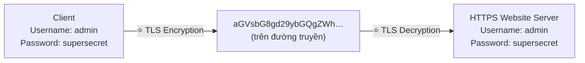

**2️⃣ Server-side encryption at rest:** ⭐⭐⭐

- ⭐⭐⭐ **Dữ liệu được MÃ HÓA SAU KHI SERVER NHẬN ĐƯỢC**
- ⭐⭐⭐ **Dữ liệu được GIẢI MÃ TRƯỚC KHI GỬI ĐI**
- ⭐⭐⭐ **Được lưu ở dạng đã mã hóa nhờ một KEY (thường là DATA KEY)**
- ⭐⭐⭐ **Khóa mã hóa/giải mã PHẢI ĐƯỢC QUẢN LÝ Ở ĐÂU ĐÓ, và SERVER PHẢI TRUY CẬP ĐƯỢC nó**

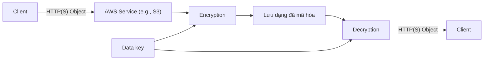

**3️⃣ Client-side encryption:** ⭐⭐⭐

- ⭐⭐⭐ **Dữ liệu được MÃ HÓA BỞI CLIENT và KHÔNG BAO GIỜ được server giải mã**
- ⭐⭐⭐ **Dữ liệu sẽ được GIẢI MÃ BỞI CLIENT NHẬN**
- ⭐⭐⭐ **SERVER KHÔNG THỂ giải mã được dữ liệu**
- ⭐⭐ **Có thể tận dụng ENVELOPE ENCRYPTION**

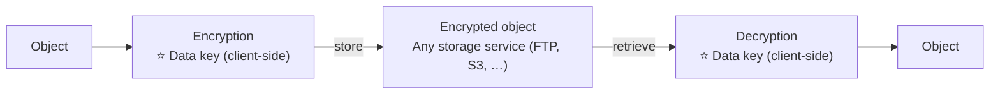

> ⭐⭐⭐ **BẢNG CHỐT BA KIỂU — RA THI RẤT NHIỀU:**

| | **In flight (TLS)** | **Server-side at rest** | **Client-side** |
|---|---|---|---|
| **Ai mã hóa** | Client + Server (kênh truyền) | ⭐ **SERVER** | ⭐ **CLIENT** |
| **Server có giải mã được?** | — | ✅ **CÓ** | ❌ ⭐ **KHÔNG** |
| **Khóa ở đâu** | Certificate | ⭐ **Server quản lý (KMS)** | ⭐ **Client giữ** |
| **Dùng khi** | Mọi giao tiếp HTTPS | Mặc định của hầu hết dịch vụ AWS | ⭐ **Không tin tưởng cả nhà cung cấp cloud** |

---

## 295. KMS Overview

### ⭐⭐⭐ AWS KMS (Key Management Service)

- ⭐⭐⭐ **HỄ NGHE "ENCRYPTION" cho một dịch vụ AWS thì KHẢ NĂNG CAO NHẤT LÀ KMS**
- ⭐⭐⭐ **AWS QUẢN LÝ KHÓA MÃ HÓA GIÙM TA**
- ⭐⭐⭐ **Tích hợp hoàn toàn với IAM để phân quyền**
- ⭐⭐ **Cách dễ dàng để kiểm soát truy cập dữ liệu**
- ⭐⭐⭐ **Có thể AUDIT việc dùng KMS Key bằng CLOUDTRAIL**
- ⭐⭐⭐ **Tích hợp liền mạch vào hầu hết dịch vụ AWS (EBS, S3, RDS, SSM…)**
- ⚠️⭐⭐⭐ **TUYỆT ĐỐI KHÔNG BAO GIỜ lưu secrets ở dạng plaintext, đặc biệt là TRONG CODE!**
- ⭐⭐ **KMS Key Encryption cũng dùng được qua API calls (SDK, CLI)**
- ⭐⭐ **Secrets đã mã hóa có thể lưu trong code / environment variables**

---

### ⭐⭐⭐ KMS Keys Types — Symmetric vs Asymmetric

- ⭐⭐ **"KMS Keys" là TÊN MỚI của "KMS Customer Master Key" (CMK)**

| | ⭐⭐⭐ **Symmetric (AES-256 keys)** | ⭐⭐⭐ **Asymmetric (RSA & ECC key pairs)** |
|---|---|---|
| **Cấu tạo** | ⭐⭐⭐ **MỘT khóa duy nhất dùng để CẢ Encrypt VÀ Decrypt** | ⭐⭐⭐ **Cặp Public Key (Encrypt) và Private Key (Decrypt)** |
| **Dùng cho** | ⭐⭐⭐ **Các dịch vụ AWS tích hợp với KMS đều dùng SYMMETRIC CMK** | **Encrypt/Decrypt, hoặc Sign/Verify** |
| **Truy cập khóa** | ⚠️⭐⭐⭐ **BẠN KHÔNG BAO GIỜ lấy được KMS Key ở dạng chưa mã hóa (phải gọi KMS API)** | ⭐⭐ **Public key TẢI VỀ ĐƯỢC, nhưng KHÔNG truy cập được Private Key chưa mã hóa** |
| **Use case** | Mặc định cho mọi thứ | ⭐⭐⭐ **Mã hóa NGOÀI AWS bởi user KHÔNG GỌI ĐƯỢC KMS API** |

> ⭐⭐⭐ **Dòng cuối của Asymmetric là câu hỏi thi:** *"đối tác bên ngoài cần mã hóa dữ liệu gửi cho ta nhưng không có tài khoản AWS"* → **Asymmetric KMS Key** (đưa họ public key).

---

### ⭐⭐⭐ Types of KMS Keys — BẢNG GIÁ (RA THI)

| Loại | Chi phí |
|---|---|
| ⭐⭐⭐ **AWS Owned Keys** | ⭐⭐⭐ **MIỄN PHÍ** — dùng cho **SSE-S3, SSE-SQS, SSE-DDB** (default key) |
| ⭐⭐⭐ **AWS Managed Key** | ⭐⭐⭐ **MIỄN PHÍ** — dạng `aws/service-name`, ví dụ **`aws/rds`** hoặc **`aws/ebs`** |
| ⭐⭐⭐ **Customer managed keys TẠO TRONG KMS** | ⭐⭐⭐ **$1 / THÁNG** |
| ⭐⭐⭐ **Customer managed keys IMPORT VÀO** | ⭐⭐⭐ **$1 / THÁNG** |
| ⭐⭐ **Cộng thêm** | **phí API call tới KMS: $0.03 / 10.000 calls** |

---

### ⭐⭐⭐ Automatic Key Rotation — BẢNG RA THI

| Loại key | Cơ chế xoay khóa |
|---|---|
| ⭐⭐⭐ **AWS-managed KMS Key** | ⭐⭐⭐ **TỰ ĐỘNG MỖI 1 NĂM** |
| ⭐⭐⭐ **Customer-managed KMS Key** | ⭐⭐⭐ **(PHẢI BẬT) tự động & theo yêu cầu (on-demand)** |
| ⭐⭐⭐ **Imported KMS Key** | ⚠️⭐⭐⭐ **CHỈ xoay THỦ CÔNG được, dùng ALIAS** |

> ⭐⭐⭐ **Ba dòng này ra thi rất đều.** Nhớ: **AWS-managed = tự động 1 năm; Customer-managed = phải BẬT; Imported = chỉ thủ công.**

---

### ⭐⭐⭐ Copying Snapshots across regions

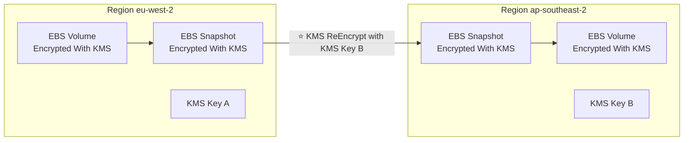

> ⭐⭐⭐ **Điểm mấu chốt: KMS Key là THEO REGION.** Copy snapshot sang region khác **bắt buộc phải RE-ENCRYPT bằng key của region đích**. (Đây chính là lý do tồn tại **Multi-Region Keys** ở bài 297.)

---

### ⭐⭐⭐ KMS Key Policies

- ⭐⭐⭐ **Kiểm soát truy cập tới KMS keys, "TƯƠNG TỰ" S3 bucket policies**
- ⚠️⭐⭐⭐ **KHÁC BIỆT: BẠN KHÔNG THỂ kiểm soát truy cập NẾU KHÔNG CÓ chúng**

| Loại | Đặc điểm |
|---|---|
| ⭐⭐⭐ **Default KMS Key Policy** | **Được tạo nếu bạn KHÔNG cung cấp policy cụ thể**<br/>⭐⭐⭐ **Cho ROOT USER toàn quyền với key = TOÀN BỘ tài khoản AWS** |
| ⭐⭐⭐ **Custom KMS Key Policy** | **Định nghĩa users, roles nào truy cập được key**<br/>**Định nghĩa AI QUẢN TRỊ được key**<br/>⭐⭐⭐ **Hữu ích cho CROSS-ACCOUNT ACCESS tới KMS key** |

> ⭐⭐⭐ **Điểm khác S3:** bucket không có policy thì IAM vẫn cấp quyền được; **KMS key KHÔNG có key policy thì KHÔNG AI dùng được**, kể cả admin.

---

### ⭐⭐⭐ Copying Snapshots across accounts — 5 bước (RA THI)

| # | Bước |
|---|---|
| 1 | ⭐⭐⭐ **Tạo Snapshot, mã hóa bằng KMS Key CỦA BẠN (Customer Managed Key)** |
| 2 | ⭐⭐⭐ **Gắn KMS KEY POLICY để cho phép cross-account access** |
| 3 | ⭐⭐⭐ **Chia sẻ encrypted snapshot** |
| 4 | ⭐⭐⭐ **(Ở tài khoản đích) Tạo BẢN SAO của Snapshot, mã hóa bằng CMK TRONG TÀI KHOẢN CỦA HỌ** |
| 5 | ⭐⭐⭐ **Tạo volume từ snapshot** |

> ⭐⭐⭐ **Nhớ bước 1: PHẢI dùng Customer Managed Key.** Snapshot mã hóa bằng **AWS Managed Key (`aws/ebs`) KHÔNG chia sẻ được** — đây là bẫy thi rất hay gặp.

---

## 296. KMS Hands On w/ CLI

> 🖐️ Bài Hands On — **không có slide**, nhưng **CÓ code chính thức** trong `code_v2025-10-27/kms/`.

### Bước 1 — Tạo KMS Key trên Console

1. Console → tìm **KMS** → **Customer managed keys** → **Create key**
2. ⭐⭐⭐ **Key type**: **Symmetric** (hoặc Asymmetric)
3. ⭐⭐ **Key usage**: **Encrypt and decrypt**
4. **Advanced options**:
   - ⭐ **Key material origin**: **KMS** (AWS sinh khóa) / **External** (import) / **Custom key store (CloudHSM)**
   - ⭐⭐ **Regionality**: **Single-Region key** hoặc ⭐ **Multi-Region key** (bài 297)
5. **Alias**: `tutorial` → ⭐ alias đầy đủ sẽ là **`alias/tutorial`**
6. ⭐⭐⭐ **Define key administrative permissions**: chọn IAM user/role quản trị key
7. ⭐⭐⭐ **Define key usage permissions**: chọn ai được dùng key để mã hóa/giải mã
8. Xem lại **Key policy** (JSON) → **Finish**

### Bước 2 — File bí mật mẫu

⭐ File `code_v2025-10-27/kms/ExampleSecretFile.txt` chỉ chứa một dòng:

```
SuperSecretPassword
```

### ⭐⭐ Code CLI chính thức — `code_v2025-10-27/kms/kms-demo-cli.sh`

```bash
# 1) encryption
aws kms encrypt --key-id alias/tutorial --plaintext fileb://ExampleSecretFile.txt --output text --query CiphertextBlob  --region eu-west-2 > ExampleSecretFileEncrypted.base64

# base64 decode for Linux or Mac OS 
cat ExampleSecretFileEncrypted.base64 | base64 --decode > ExampleSecretFileEncrypted

# base64 decode for Windows
certutil -decode .\ExampleSecretFileEncrypted.base64 .\ExampleSecretFileEncrypted


# 2) decryption

aws kms decrypt --ciphertext-blob fileb://ExampleSecretFileEncrypted   --output text --query Plaintext > ExampleFileDecrypted.base64  --region eu-west-2

# base64 decode for Linux or Mac OS 
cat ExampleFileDecrypted.base64 | base64 --decode > ExampleFileDecrypted.txt


# base64 decode for Windows
certutil -decode .\ExampleFileDecrypted.base64 .\ExampleFileDecrypted.txt
```

### ⭐⭐⭐ Giải thích từng phần (phần này giúp hiểu bản chất KMS)

| Thành phần | Ý nghĩa |
|---|---|
| ⭐⭐⭐ **`--key-id alias/tutorial`** | **Dùng ALIAS thay vì key ID dài** — alias trỏ tới key thật, đổi key không cần sửa code |
| ⭐⭐⭐ **`fileb://`** | ⚠️ **`fileb` (b = binary) chứ KHÔNG phải `file://`** — KMS cần dữ liệu nhị phân |
| ⭐⭐⭐ **`--query CiphertextBlob`** | Lấy đúng phần dữ liệu đã mã hóa từ JSON kết quả |
| ⭐⭐⭐ **`base64 --decode`** | ⭐ **KMS trả kết quả dạng BASE64**, phải decode mới ra binary thật |
| ⭐⭐⭐ **`--region eu-west-2`** | ⚠️⭐⭐⭐ **PHẢI đúng region của key** — KMS key là **per-region** |
| ⭐⭐⭐ **`decrypt` KHÔNG cần `--key-id`** | ⭐ **Ciphertext đã CHỨA SẴN thông tin key nào đã mã hóa nó** |

> ⭐⭐⭐ **Ba điều rút ra từ bài Hands On này — đều ra thi:**
> 1. **KMS key là per-region** — sai region là lỗi ngay
> 2. **`decrypt` không cần chỉ định key** vì ciphertext tự mang metadata
> 3. ⚠️⭐⭐⭐ **KMS chỉ mã hóa được dữ liệu TỐI ĐA 4 KB** — lớn hơn phải dùng **Envelope Encryption** (GenerateDataKey)

### ⭐⭐ Envelope Encryption (bổ sung ngoài slide, quan trọng)

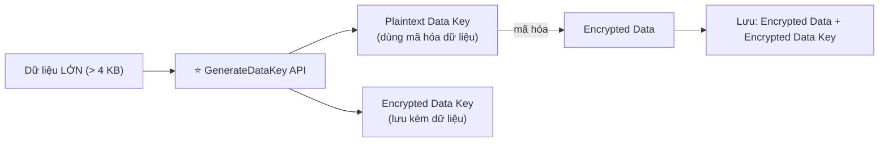

> ⭐⭐⭐ **Câu hỏi thi:** *"cần mã hóa file 10 MB bằng KMS"* → **KHÔNG gọi `Encrypt` trực tiếp được (giới hạn 4 KB)** → **dùng Envelope Encryption qua `GenerateDataKey`**.

```bash
# Liệt kê keys
aws kms list-keys
aws kms list-aliases

# Sinh data key cho envelope encryption
aws kms generate-data-key --key-id alias/tutorial --key-spec AES_256 --region eu-west-2
```

> 💡 **CHI PHÍ:** Customer managed key **$1/tháng** + **$0.03/10.000 API calls**. Rất rẻ, nhưng nhớ **Schedule key deletion** (tối thiểu **7 ngày**, tối đa 30 ngày chờ) nếu không dùng nữa.

---

## 297. KMS - Multi-Region Keys

### ⭐⭐⭐ KMS Multi-Region Keys

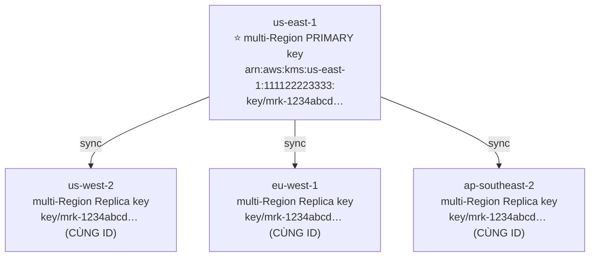

- ⭐⭐⭐ **Các KMS key GIỐNG HỆT NHAU ở các AWS Region khác nhau, DÙNG THAY THẾ CHO NHAU ĐƯỢC**
- ⭐⭐⭐ **Multi-Region keys có CÙNG key ID, CÙNG key material, CÙNG automatic rotation…**
- ⭐⭐⭐ **MÃ HÓA ở một Region và GIẢI MÃ ở Region khác**
- ⭐⭐⭐ **KHÔNG cần re-encrypt hay gọi cross-Region API**
- ⚠️⭐⭐⭐ **KMS Multi-Region KHÔNG PHẢI GLOBAL (là Primary + Replicas)**
- ⭐⭐⭐ **Mỗi Multi-Region key được QUẢN LÝ ĐỘC LẬP**
- ⭐⭐⭐ **Use cases: global client-side encryption, encryption trên Global DynamoDB, Global Aurora**

> ⭐⭐⭐ **Hai dòng cảnh báo là điểm ra thi:** Multi-Region key **KHÔNG phải một key global** — nó là **primary + các replica được quản lý ĐỘC LẬP** (key policy riêng, quyền riêng).
>
> 💡 **Nhận diện: key ID bắt đầu bằng `mrk-`.**

---

### ⭐⭐ DynamoDB Global Tables + KMS Multi-Region Keys (Client-Side encryption)

- ⭐⭐⭐ **Mã hóa CÁC THUỘC TÍNH CỤ THỂ ở phía client trong DynamoDB table bằng AMAZON DYNAMODB ENCRYPTION CLIENT**
- ⭐⭐ **Kết hợp với Global Tables, dữ liệu đã mã hóa phía client được replicate sang region khác**
- ⭐⭐⭐ **Dùng client-side encryption để BẢO VỆ CÁC TRƯỜNG CỤ THỂ và đảm bảo CHỈ GIẢI MÃ ĐƯỢC nếu client có API key**
- ⭐⭐⭐ **Nếu dùng multi-region key replicate cùng region với DynamoDB Global table, client ở các region đó gọi KMS NỘI VÙNG với ĐỘ TRỄ THẤP để giải mã**

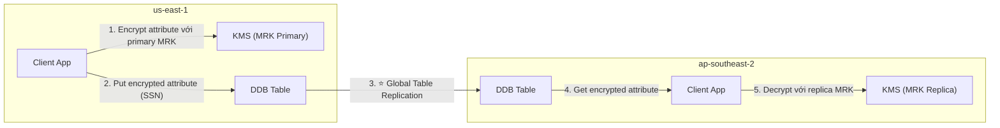

---

### ⭐⭐ Global Aurora + KMS Multi-Region Keys (Client-Side encryption)

- ⭐⭐⭐ **Mã hóa các CỘT cụ thể phía client trong Aurora table bằng AWS ENCRYPTION SDK**
- ⭐⭐ **Kết hợp Aurora Global Tables, dữ liệu mã hóa client-side được replicate sang region khác**
- ⭐⭐⭐ **Bảo vệ được các trường cụ thể NGAY CẢ TRƯỚC DATABASE ADMINS**

> ⭐⭐⭐ **Câu "protect specific fields even from database admins" là từ khóa ra thi** — chỉ **client-side encryption** mới làm được điều này (server-side thì DBA vẫn đọc được).
>
> ⭐⭐ **Hai SDK khác nhau:** **DynamoDB Encryption Client** (cho DynamoDB) vs **AWS Encryption SDK** (cho Aurora/tổng quát).

---

## 298. S3 Replication with Encryption

### ⭐⭐⭐ S3 Replication — Encryption Considerations

| Loại object | Có được replicate không |
|---|---|
| ⭐⭐⭐ **Object KHÔNG mã hóa** | ✅ **Replicate MẶC ĐỊNH** |
| ⭐⭐⭐ **Object mã hóa SSE-S3** | ✅ **Replicate MẶC ĐỊNH** |
| ⭐⭐⭐ **Object mã hóa SSE-C** (customer provided key) | ✅ **Replicate được** |
| ⚠️⭐⭐⭐ **Object mã hóa SSE-KMS** | ⚠️⭐⭐⭐ **PHẢI BẬT TÙY CHỌN** |

**⭐⭐⭐ Khi bật replication cho SSE-KMS, phải làm 3 việc:**

| # | Việc |
|---|---|
| 1 | ⭐⭐⭐ **Chỉ định KMS Key nào dùng để mã hóa object ở BUCKET ĐÍCH** |
| 2 | ⭐⭐⭐ **Điều chỉnh KMS Key Policy cho key đích** |
| 3 | ⭐⭐⭐ **Một IAM Role có `kms:Decrypt` cho KEY NGUỒN và `kms:Encrypt` cho KEY ĐÍCH** |

- ⚠️⭐⭐ **Có thể gặp lỗi KMS THROTTLING, khi đó xin tăng Service Quotas**
- ⚠️⭐⭐⭐ **Dùng được multi-region KMS Keys, NHƯNG hiện tại S3 coi chúng là CÁC KEY ĐỘC LẬP** (object vẫn bị giải mã rồi mã hóa lại)

> ⭐⭐⭐ **Ba điểm ra thi:** **SSE-KMS phải bật thủ công**, **cần IAM role với `kms:Decrypt` + `kms:Encrypt`**, và **KMS throttling** là lỗi thường gặp khi replicate khối lượng lớn.

---

## 299. Encrypted AMI Sharing Process

### ⭐⭐⭐ AMI Sharing Process Encrypted via KMS — 5 bước (RA THI)

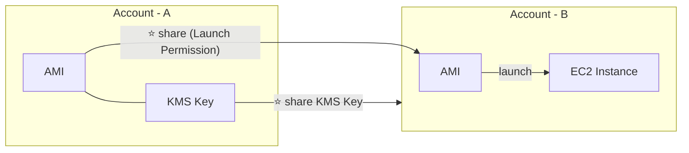

| # | Bước |
|---|---|
| 1 | ⭐⭐⭐ **AMI ở Source Account được mã hóa bằng KMS Key của Source Account** |
| 2 | ⭐⭐⭐ **PHẢI sửa IMAGE ATTRIBUTE để thêm LAUNCH PERMISSION tương ứng với tài khoản AWS đích** |
| 3 | ⭐⭐⭐ **PHẢI CHIA SẺ KMS Keys đã dùng để mã hóa snapshot mà AMI tham chiếu, với tài khoản đích / IAM Role** |
| 4 | ⭐⭐⭐ **IAM Role/User ở tài khoản đích PHẢI có quyền `DescribeKey`, `ReEncrypt*`, `CreateGrant`, `Decrypt`** |
| 5 | ⭐⭐ **Khi launch EC2 từ AMI, tài khoản đích CÓ THỂ chỉ định KMS key MỚI trong tài khoản của họ để re-encrypt volumes** |

> ⭐⭐⭐ **BỐN QUYỀN Ở BƯỚC 4 LÀ ĐIỂM RA THI:** **`DescribeKey`, `ReEncrypt*`, `CreateGrant`, `Decrypt`**. Đề hay hỏi *"chia sẻ AMI mã hóa nhưng tài khoản đích không launch được"* → **thiếu một trong bốn quyền này**, hoặc **chưa share KMS key**.
>
> 💡 **Hai thứ PHẢI share, không phải một:** **AMI (launch permission)** VÀ **KMS key**.

---

## 300. SSM Parameter Store Overview

### ⭐⭐⭐ SSM Parameter Store

- ⭐⭐⭐ **LƯU TRỮ AN TOÀN cho CONFIGURATION và SECRETS**
- ⭐⭐⭐ **MÃ HÓA LIỀN MẠCH TÙY CHỌN bằng KMS (Optional Seamless Encryption)**
- ⭐⭐⭐ **Serverless, scalable, durable, SDK dễ dùng**
- ⭐⭐⭐ **THEO DÕI PHIÊN BẢN (version tracking) của configurations / secrets**
- ⭐⭐ **Bảo mật qua IAM**
- ⭐⭐ **Thông báo với Amazon EventBridge**
- ⭐⭐ **Tích hợp với CloudFormation**

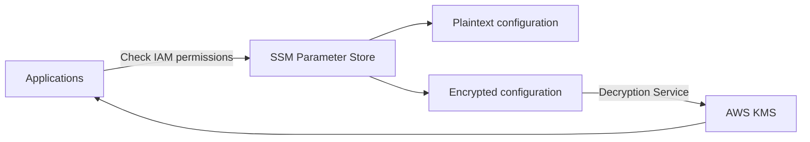

---

### ⭐⭐⭐ SSM Parameter Store Hierarchy

```
/my-department/
    my-app/
        dev/
            db-url
            db-password
        prod/
            db-url
            db-password
    other-app/
/other-department/
/aws/reference/secretsmanager/secret_ID_in_Secrets_Manager
/aws/service/ami-amazon-linux-latest/amzn2-ami-hvm-x86_64-gp2   (public)
```

- ⭐⭐⭐ **API để lấy: `GetParameters` hoặc `GetParametersByPath`**

> ⭐⭐⭐ **HAI ĐƯỜNG DẪN ĐẶC BIỆT Ở CUỐI LÀ ĐIỂM RA THI:**
> - ⭐⭐⭐ **`/aws/reference/secretsmanager/<secret_ID>`** → **Parameter Store ĐỌC ĐƯỢC secret từ Secrets Manager!**
> - ⭐⭐⭐ **`/aws/service/ami-amazon-linux-latest/...`** → **AWS công khai AMI ID mới nhất qua Parameter Store** (rất tiện cho CloudFormation).

---

### ⭐⭐⭐ Standard vs Advanced parameter tiers — BẢNG RA THI

| | ⭐⭐⭐ **Standard** | ⭐⭐⭐ **Advanced** |
|---|---|---|
| **Số parameter tối đa** (mỗi account + Region) | **10.000** | **100.000** |
| ⭐⭐⭐ **Kích thước tối đa của giá trị** | **4 KB** | **8 KB** |
| ⭐⭐⭐ **Parameter policies** | ❌ **KHÔNG** | ✅ **CÓ** |
| **Chi phí** | ⭐⭐⭐ **MIỄN PHÍ** | **Tính phí** |
| **Storage Pricing** | **Free** | **$0.05 / advanced parameter / tháng** |

---

### ⭐⭐ Parameters Policies (chỉ cho advanced parameters)

- ⭐⭐⭐ **Cho phép gán TTL cho parameter (ngày hết hạn) để BẮT BUỘC cập nhật hoặc xóa dữ liệu nhạy cảm như mật khẩu**
- ⭐⭐ **Gán được NHIỀU policy cùng lúc**

| Policy | Tác dụng |
|---|---|
| ⭐⭐ **Expiration** | **Xóa parameter khi tới hạn** |
| ⭐⭐ **ExpirationNotification** | **Thông báo qua EventBridge trước khi hết hạn** |
| ⭐⭐ **NoChangeNotification** | **Thông báo qua EventBridge nếu parameter KHÔNG được thay đổi trong X ngày** |

> ⭐⭐ **Từ khóa: "bắt buộc xoay mật khẩu định kỳ" → Parameter Policies (Advanced tier)**. Nhưng nếu đề nói **"TỰ ĐỘNG xoay"** thì đáp án là **Secrets Manager** (bài 302).

---

## 301. SSM Parameter Store Hands On (CLI)

> 🖐️ Bài Hands On — **không có slide**, nhưng **CÓ code chính thức** trong `code_v2025-10-27/ssm/`.

### Bước 1 — Tạo parameters trên Console

1. Console → **Systems Manager** → **Parameter Store** → **Create parameter**
2. ⭐⭐⭐ **Name**: `/my-app/dev/db-url` (dùng **dấu `/` để tạo phân cấp**)
3. ⭐⭐ **Tier**: **Standard** (miễn phí) hoặc **Advanced**
4. ⭐⭐⭐ **Type**:

| Type | Ý nghĩa |
|---|---|
| ⭐⭐⭐ **String** | Chuỗi thường, **không mã hóa** |
| ⭐⭐ **StringList** | Danh sách phân tách bằng dấu phẩy |
| ⭐⭐⭐ **SecureString** | ⭐ **MÃ HÓA bằng KMS** — dùng cho mật khẩu |

5. **Value**: `dev.database.com` → **Create parameter**
6. Lặp lại với `/my-app/dev/db-password` → **Type: SecureString** → chọn **KMS key** (`alias/aws/ssm` mặc định)
7. Tạo thêm `/my-app/prod/db-url` và `/my-app/prod/db-password`

### ⭐⭐ Code CLI chính thức — `code_v2025-10-27/ssm/cli.sh`

```bash
# GET PARAMETERS
aws ssm get-parameters --names /my-app/dev/db-url /my-app/dev/db-password
# GET PARAMETERS WITH DECRYPTION
aws ssm get-parameters --names /my-app/dev/db-url /my-app/dev/db-password --with-decryption

# GET PARAMETERS BY PATH
aws ssm get-parameters-by-path --path /my-app/dev/
# GET PARAMETERS BY PATH RECURSIVE
aws ssm get-parameters-by-path --path /my-app/ --recursive
# GET PARAMETERS BY PATH WITH DECRYPTION
aws ssm get-parameters-by-path --path /my-app/ --recursive --with-decryption
```

### ⭐⭐⭐ Giải thích ba điểm quan trọng

| Điểm | Ý nghĩa |
|---|---|
| ⚠️⭐⭐⭐ **`--with-decryption`** | **KHÔNG có flag này thì SecureString trả về dạng MÃ HÓA** (chuỗi base64 khó hiểu) |
| ⭐⭐⭐ **`get-parameters-by-path --path`** | **Lấy TẤT CẢ parameter trong một nhánh** — rất tiện cho ứng dụng theo môi trường |
| ⭐⭐⭐ **`--recursive`** | **Lấy cả các nhánh con** (ví dụ `/my-app/` sẽ lấy cả `dev/` và `prod/`) |

> ⭐⭐⭐ **Đây chính là lý do phải thiết kế phân cấp tốt:** ứng dụng dev chỉ cần gọi **một lệnh** với path `/my-app/dev/` là lấy đủ config.

### ⭐⭐ Code Lambda chính thức — `code_v2025-10-27/ssm/handler.py`

```python
import json
import boto3
import os

ssm = boto3.client('ssm', region_name="eu-west-3")
dev_or_prod = os.environ['DEV_OR_PROD']

def lambda_handler(event, context):
    db_url = ssm.get_parameters(Names=["/my-app/" + dev_or_prod + "/db-url"])
    print(db_url)   
    db_password = ssm.get_parameters(Names=["/my-app/" + dev_or_prod + "/db-password"], WithDecryption=True)
    print(db_password)
    return "worked!"
```

**Ba điểm đáng chú ý trong đoạn code:** ⭐⭐⭐

| Điểm | Ý nghĩa |
|---|---|
| ⭐⭐⭐ **`os.environ['DEV_OR_PROD']`** | ⭐ **CÙNG MỘT CODE chạy cho cả dev và prod**, chỉ khác environment variable |
| ⭐⭐⭐ **`WithDecryption=True`** | **Chỉ dùng cho `db-password`** (SecureString); `db-url` là String thường nên không cần |
| ⚠️⭐⭐⭐ **IAM Role của Lambda** | **PHẢI có `ssm:GetParameters`** VÀ ⭐ **`kms:Decrypt`** cho KMS key |

> ⭐⭐⭐ **Đây là pattern chuẩn để đưa secret vào Lambda:** **KHÔNG hardcode trong code, KHÔNG để plaintext trong environment variable** — mà **đọc từ Parameter Store lúc runtime**.
>
> ⚠️ **Lỗi thường gặp:** Lambda chạy được `db-url` nhưng lỗi `AccessDeniedException` ở `db-password` → **thiếu quyền `kms:Decrypt`**.

### CLI bổ sung

```bash
# Tạo parameter
aws ssm put-parameter --name "/my-app/dev/db-url" --value "dev.database.com" --type String

# Tạo SecureString
aws ssm put-parameter --name "/my-app/dev/db-password" --value "SuperSecret" \
  --type SecureString --key-id alias/aws/ssm

# Cập nhật (phải có --overwrite)
aws ssm put-parameter --name "/my-app/dev/db-url" --value "new.database.com" \
  --type String --overwrite

# Xem lịch sử phiên bản ⭐
aws ssm get-parameter-history --name "/my-app/dev/db-url"

# Lấy AMI Amazon Linux mới nhất (public parameter) ⭐
aws ssm get-parameters --names /aws/service/ami-amazon-linux-latest/amzn2-ami-hvm-x86_64-gp2

# Xóa
aws ssm delete-parameter --name "/my-app/dev/db-url"
```

> 💡 **CHI PHÍ: Standard tier HOÀN TOÀN MIỄN PHÍ** (10.000 parameter). Bài này an toàn tuyệt đối.

---

## 302. AWS Secrets Manager - Overview

### ⭐⭐⭐ AWS Secrets Manager

- ⭐⭐⭐ **Dịch vụ MỚI HƠN, SINH RA ĐỂ LƯU SECRETS**
- ⭐⭐⭐ **Khả năng BẮT BUỘC XOAY SECRETS MỖI X NGÀY (force rotation)**
- ⭐⭐⭐ **TỰ ĐỘNG SINH secrets khi xoay (dùng LAMBDA)**
- ⭐⭐⭐ **Tích hợp với Amazon RDS (MySQL, PostgreSQL, Aurora)**
- ⭐⭐ **Secrets được mã hóa bằng KMS**
- ⭐⭐⭐ **CHỦ YẾU dành cho tích hợp RDS**

> ⭐⭐⭐ **BẢNG SO SÁNH QUAN TRỌNG NHẤT — Parameter Store vs Secrets Manager:**

| | ⭐⭐⭐ **SSM Parameter Store** | ⭐⭐⭐ **Secrets Manager** |
|---|---|---|
| **Chi phí** | ⭐⭐⭐ **MIỄN PHÍ (Standard tier)** | ⚠️⭐⭐⭐ **TÍNH PHÍ (~$0.40/secret/tháng)** |
| ⭐⭐⭐ **Tự động xoay secret** | ❌ **KHÔNG** (chỉ có TTL nhắc nhở ở Advanced) | ✅⭐⭐⭐ **CÓ — tự động mỗi X ngày, dùng Lambda** |
| ⭐⭐⭐ **Tích hợp RDS sẵn** | ❌ Không | ✅⭐⭐⭐ **CÓ (MySQL, PostgreSQL, Aurora)** |
| **Mã hóa** | Tùy chọn (SecureString + KMS) | ⭐ **Luôn mã hóa bằng KMS** |
| **Version tracking** | ✅ Có | ✅ Có |
| **Khi nào dùng** | ⭐⭐⭐ **Config thường + secret đơn giản, muốn MIỄN PHÍ** | ⭐⭐⭐ **Secret CẦN TỰ ĐỘNG XOAY, đặc biệt là DB credentials** |

> ⭐⭐⭐ **Cách chọn trong phòng thi:** đề nhắc **"automatic rotation"** hoặc **"RDS credentials"** → **Secrets Manager**. Đề nhắc **"tối ưu chi phí"** hoặc **"lưu configuration"** → **Parameter Store**.

---

### ⭐⭐ AWS Secrets Manager – Multi-Region Secrets

- ⭐⭐⭐ **REPLICATE Secrets sang NHIỀU AWS Regions**
- ⭐⭐⭐ **Secrets Manager giữ READ REPLICAS đồng bộ với Secret gốc (primary)**
- ⭐⭐⭐ **Có thể THĂNG CẤP (promote) một replica secret thành STANDALONE Secret**
- ⭐⭐ **Use cases: ứng dụng multi-region, chiến lược disaster recovery, DB đa vùng…**

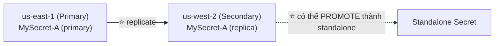

> ⭐⭐ **Từ khóa: "disaster recovery cho secrets"** → **Multi-Region Secrets + promote replica**.

---

## 303. AWS Secrets Manager - Hands On

> 🖐️ Bài Hands On — **không có slide**. Các bước Console.

### Bước 1 — Tạo Secret

1. Console → **Secrets Manager** → **Store a new secret**
2. ⭐⭐⭐ **Secret type**:

| Loại | Dùng khi |
|---|---|
| ⭐⭐⭐ **Credentials for Amazon RDS database** | ⭐ **Có tự động rotation sẵn** |
| ⭐⭐ **Credentials for Amazon DocumentDB / Redshift / other database** | |
| ⭐⭐ **Credentials for other database** | |
| ⭐⭐⭐ **Other type of secret** | **API key, token tùy ý** (dạng key/value hoặc plaintext) |

3. Nhập **Key/value**, ví dụ: `username` = `admin`, `password` = `MyPassword123`
4. ⭐⭐ **Encryption key**: `aws/secretsmanager` (mặc định) hoặc CMK riêng
5. **Next** → **Secret name**: `prod/myapp/db-credentials` → **Next**

### Bước 2 — Cấu hình Automatic rotation ⭐⭐⭐

1. ⭐⭐⭐ **Automatic rotation**: **Enable**
2. ⭐⭐ **Rotation schedule**: ví dụ **30 days** (hoặc cron expression)
3. ⭐⭐⭐ **Rotation function**: 
   - **Create a new Lambda function** (AWS tạo sẵn từ template), hoặc
   - **Use an existing Lambda function**
4. **Next** → **Store**

> ⭐⭐⭐ **Điểm mấu chốt:** **rotation được thực hiện bởi một LAMBDA FUNCTION** mà AWS tạo sẵn cho RDS. Với secret loại khác, **bạn phải tự viết Lambda rotation**.

### Bước 3 — Lấy secret bằng CLI

```bash
# Lấy giá trị secret
aws secretsmanager get-secret-value --secret-id prod/myapp/db-credentials

# Chỉ lấy phần giá trị
aws secretsmanager get-secret-value --secret-id prod/myapp/db-credentials \
  --query SecretString --output text

# Liệt kê secrets
aws secretsmanager list-secrets

# Xoay secret ngay lập tức
aws secretsmanager rotate-secret --secret-id prod/myapp/db-credentials

# Tạo replica sang region khác ⭐
aws secretsmanager replicate-secret-to-regions \
  --secret-id prod/myapp/db-credentials \
  --add-replica-regions Region=us-west-2
```

### ⭐⭐ Đọc secret từ Parameter Store (liên kết bài 300)

```bash
# ⭐ Đường dẫn đặc biệt: đọc Secrets Manager QUA Parameter Store
aws ssm get-parameter \
  --name /aws/reference/secretsmanager/prod/myapp/db-credentials \
  --with-decryption
```

> ⭐⭐⭐ **Đây là điểm tích hợp hay ra thi:** ứng dụng chỉ cần biết **một API (Parameter Store)** nhưng vẫn đọc được secret từ **Secrets Manager**.

### ⚠️ Dọn dẹp

1. Chọn secret → **Actions** → **Delete secret**
2. ⚠️⭐⭐ **Waiting period**: tối thiểu **7 ngày**, tối đa **30 ngày** — secret **không xóa ngay**
3. Nếu có tạo Lambda rotation → xóa Lambda function

> ⚠️ **CHI PHÍ: Secrets Manager KHÔNG có Free Tier lâu dài** (chỉ 30 ngày dùng thử). **$0.40/secret/tháng + $0.05/10.000 API calls**. Nhớ xóa sau khi học. Nếu chỉ cần lưu config → **dùng Parameter Store Standard (miễn phí)**.

---

## 304. AWS Certificate Manager (ACM)

### ⭐⭐⭐ AWS Certificate Manager (ACM)

- ⭐⭐⭐ **Dễ dàng CẤP PHÁT, QUẢN LÝ và TRIỂN KHAI TLS Certificates**
- ⭐⭐⭐ **Cung cấp MÃ HÓA KHI TRUYỀN cho websites (HTTPS)**
- ⭐⭐⭐ **Hỗ trợ CẢ public VÀ private TLS certificates**
- ⭐⭐⭐ **MIỄN PHÍ cho public TLS certificates**
- ⭐⭐⭐ **TỰ ĐỘNG GIA HẠN TLS certificate**

**⭐⭐⭐ Tích hợp với (load TLS certificates lên):**

| Dịch vụ |
|---|
| ⭐⭐⭐ **Elastic Load Balancers (CLB, ALB, NLB)** |
| ⭐⭐⭐ **CloudFront Distributions** |
| ⭐⭐⭐ **APIs on API Gateway** |

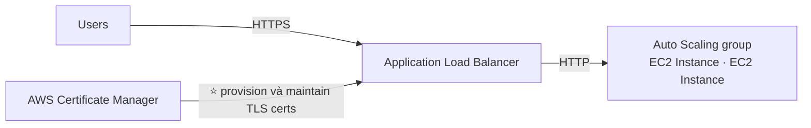

> ⭐⭐⭐ **Lưu ý kiến trúc:** **HTTPS kết thúc ở ALB**, giữa ALB và EC2 chỉ là **HTTP** — gọi là **SSL Termination**.

---

### ⭐⭐⭐ ACM – Requesting Public Certificates (4 bước)

| # | Bước |
|---|---|
| 1 | ⭐⭐⭐ **Liệt kê DOMAIN NAMES đưa vào certificate:**<br/>**Fully Qualified Domain Name (FQDN): `corp.example.com`**<br/>⭐⭐ **Wildcard Domain: `*.example.com`** |
| 2 | ⭐⭐⭐ **Chọn VALIDATION METHOD: DNS Validation hoặc Email validation**<br/>⭐⭐⭐ **DNS Validation ĐƯỢC ƯA CHUỘNG cho mục đích TỰ ĐỘNG HÓA**<br/>**Email validation gửi email tới địa chỉ liên hệ trong WHOIS database**<br/>⭐⭐⭐ **DNS Validation dùng một CNAME record trong cấu hình DNS (ví dụ Route 53)** |
| 3 | ⭐⭐ **Mất VÀI GIỜ để được xác thực** |
| 4 | ⭐⭐⭐ **Public Certificate sẽ được đăng ký TỰ ĐỘNG GIA HẠN**<br/>⭐⭐⭐ **ACM tự động gia hạn certificate do ACM tạo ra, 60 NGÀY TRƯỚC KHI HẾT HẠN** |

> ⭐⭐⭐ **Hai điểm ra thi:** **DNS Validation được ưa chuộng** (tự động hóa được), và **tự động gia hạn trước 60 ngày**.

---

### ⭐⭐⭐ ACM – Importing Public Certificates

- ⭐⭐ **Tùy chọn TẠO certificate NGOÀI ACM rồi IMPORT vào**
- ⚠️⭐⭐⭐ **KHÔNG CÓ TỰ ĐỘNG GIA HẠN — phải import certificate MỚI trước khi hết hạn**
- ⭐⭐⭐ **ACM gửi DAILY EXPIRATION EVENTS bắt đầu từ 45 NGÀY TRƯỚC KHI HẾT HẠN**
  - ⭐ **Số ngày này CẤU HÌNH ĐƯỢC**
  - ⭐⭐⭐ **Events xuất hiện trong EVENTBRIDGE**
- ⭐⭐⭐ **AWS Config có managed rule tên `acm-certificate-expiration-check` để kiểm tra certificate sắp hết hạn (số ngày cấu hình được)**

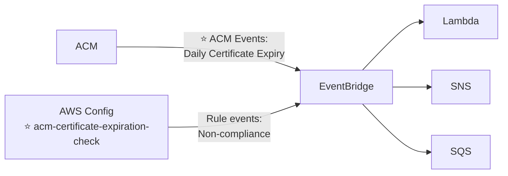

> ⭐⭐⭐ **HAI CON SỐ DỄ NHẦM:**
> - ⭐⭐⭐ **60 ngày** = ACM **tự động gia hạn** certificate **do ACM tạo**
> - ⭐⭐⭐ **45 ngày** = ACM bắt đầu gửi **cảnh báo hết hạn** cho certificate **được IMPORT**
>
> ⭐⭐ **Và nhớ tên rule của Config: `acm-certificate-expiration-check`.**

---

### ⭐⭐⭐ ACM – Integration với ALB

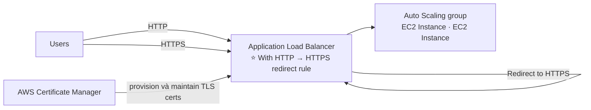

> ⭐⭐ **Pattern chuẩn: ALB có rule chuyển hướng HTTP → HTTPS**, đảm bảo mọi traffic đều mã hóa.

---

### ⭐⭐⭐ ACM – Integration với API Gateway

**Nhắc lại 3 Endpoint Types (đã học chương 19):** **Edge-Optimized** (mặc định, qua CloudFront, **API Gateway vẫn chỉ ở MỘT region**), **Regional**, **Private**.

**⭐⭐⭐ Quy tắc đặt certificate:**

| Endpoint Type | Certificate phải ở đâu |
|---|---|
| ⭐⭐⭐ **Edge-Optimized** | ⚠️⭐⭐⭐ **PHẢI ở `us-east-1`** (cùng region với CloudFront) |
| ⭐⭐⭐ **Regional** | ⭐⭐⭐ **PHẢI import vào API Gateway, CÙNG REGION với API Stage** |

- ⭐⭐⭐ **Sau đó thiết lập CNAME hoặc (tốt hơn) A-Alias record trong Route 53**

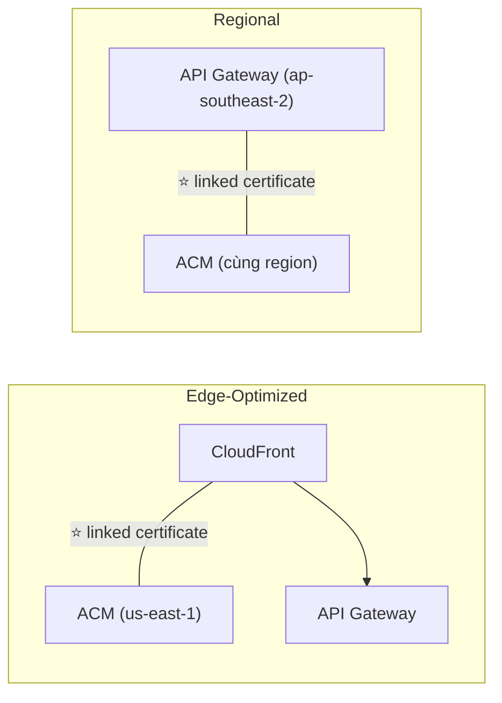

> ⭐⭐⭐ **Quy tắc `us-east-1` cho Edge giống hệt CloudFront (chương 15) — đây là câu hỏi thi lặp lại nhiều lần trong khóa.**

---

## 305. AWS CloudHSM

### ⭐⭐⭐ CloudHSM

- ⭐⭐⭐ **KMS ⇒ AWS QUẢN LÝ PHẦN MỀM mã hóa**
- ⭐⭐⭐ **CloudHSM ⇒ AWS CUNG CẤP PHẦN CỨNG mã hóa**
- ⭐⭐⭐ **PHẦN CỨNG CHUYÊN DỤNG (HSM = Hardware Security Module)**
- ⭐⭐⭐ **BẠN quản lý HOÀN TOÀN khóa mã hóa của mình (KHÔNG phải AWS)**
- ⭐⭐⭐ **Thiết bị HSM CHỐNG GIẢ MẠO (tamper resistant), tuân thủ FIPS 140-2 Level 3**
- ⭐⭐⭐ **Hỗ trợ CẢ symmetric VÀ asymmetric encryption (SSL/TLS keys)**
- ⚠️⭐⭐⭐ **KHÔNG CÓ FREE TIER**
- ⭐⭐⭐ **PHẢI dùng CloudHSM Client Software**
- ⭐⭐⭐ **Redshift hỗ trợ CloudHSM cho database encryption và key management**
- ⭐⭐⭐ **Lựa chọn TỐT để dùng với SSE-C encryption**

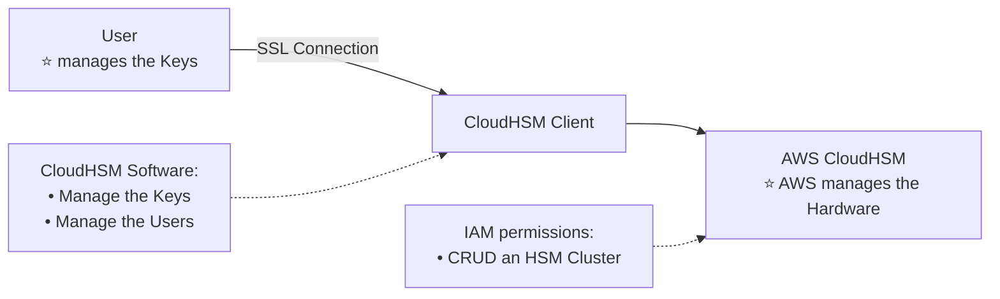

> ⭐⭐⭐ **PHÂN CHIA TRÁCH NHIỆM LÀ ĐIỂM RA THI:**
> - **AWS quản lý PHẦN CỨNG**
> - **BẠN quản lý KHÓA và NGƯỜI DÙNG** (qua CloudHSM Software)
> - **IAM chỉ quản lý được việc CRUD cụm HSM**, KHÔNG quản lý được khóa bên trong
>
> ⭐⭐⭐ **Từ khóa nhận diện: "FIPS 140-2 Level 3"**, **"dedicated hardware"**, **"tôi phải tự quản lý khóa, AWS không được chạm vào"**, **"SSE-C"**.

---

### ⭐⭐ CloudHSM – High Availability

- ⭐⭐⭐ **CloudHSM clusters TRẢI TRÊN NHIỀU AZ (HA)**
- ⭐⭐ **Rất tốt cho tính sẵn sàng và độ bền**

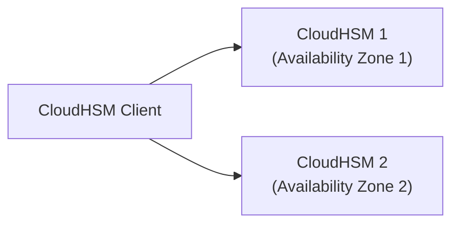

---

### ⭐⭐ CloudHSM – Integration with AWS Services

- ⭐⭐⭐ **Thông qua tích hợp với AWS KMS**
- ⭐⭐⭐ **Cấu hình KMS CUSTOM KEY STORE với CloudHSM**
- ⭐⭐ **Ví dụ: EBS, S3, RDS…**

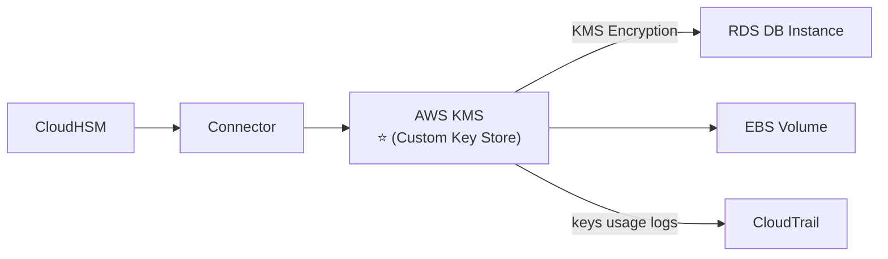

> ⭐⭐⭐ **"KMS Custom Key Store" là từ khóa:** cho phép **dùng CloudHSM làm nơi lưu khóa** nhưng **vẫn dùng API của KMS** — kết hợp được cả hai thế giới.

---

### ⭐⭐⭐ CloudHSM vs. KMS — BẢNG SO SÁNH RA THI

| Feature | ⭐⭐⭐ **AWS KMS** | ⭐⭐⭐ **AWS CloudHSM** |
|---|---|---|
| ⭐⭐⭐ **Tenancy** | **MULTI-Tenant** | ⭐⭐⭐ **SINGLE-Tenant** |
| **Standard** | **FIPS 140-2 Level 3** | **FIPS 140-2 Level 3** |
| ⭐⭐⭐ **Master Keys** | **AWS Owned CMK · AWS Managed CMK · Customer Managed CMK** | ⭐⭐⭐ **CHỈ Customer Managed CMK** |
| **Key Types** | Symmetric · Asymmetric · Digital Signing | Symmetric · Asymmetric · ⭐ **Digital Signing & HASHING** |
| ⭐⭐ **Key Accessibility** | **Truy cập được ở nhiều AWS region** (không truy cập được ngoài region tạo ra) | **Triển khai và quản lý TRONG VPC**<br/>⭐ **Chia sẻ được qua VPC Peering** |
| ⭐⭐⭐ **Cryptographic Acceleration** | ❌ **KHÔNG CÓ** | ✅⭐⭐⭐ **SSL/TLS Acceleration · Oracle TDE Acceleration** |
| ⭐⭐⭐ **Access & Authentication** | **AWS IAM** | ⭐⭐⭐ **BẠN tạo users và quản lý quyền của họ** |
| ⭐⭐ **High Availability** | **AWS Managed Service** | **Thêm nhiều HSM trên các AZ khác nhau** |
| ⭐⭐ **Audit Capability** | **CloudTrail · CloudWatch** | **CloudTrail · CloudWatch · ⭐ MFA support** |
| ⭐⭐⭐ **Free Tier** | ✅ **Yes** | ❌⭐⭐⭐ **No** |

> ⭐⭐⭐ **BỐN DÒNG RA THI NHIỀU NHẤT:**
> 1. **Multi-Tenant (KMS) vs Single-Tenant (CloudHSM)**
> 2. **Cryptographic Acceleration chỉ có ở CloudHSM** (SSL/TLS, Oracle TDE)
> 3. **IAM (KMS) vs tự quản lý users (CloudHSM)**
> 4. **CloudHSM KHÔNG có Free Tier**

---

## 306. Web Application Firewall (WAF)

### ⭐⭐⭐ AWS WAF – Web Application Firewall

- ⭐⭐⭐ **BẢO VỆ ứng dụng web khỏi các khai thác web phổ biến (LAYER 7)**
- ⭐⭐⭐ **Layer 7 là HTTP (còn Layer 4 là TCP/UDP)**

**⭐⭐⭐ Triển khai được trên (5 dịch vụ — HỌC THUỘC):**

| Dịch vụ |
|---|
| ⭐⭐⭐ **Application Load Balancer** |
| ⭐⭐⭐ **API Gateway** |
| ⭐⭐⭐ **CloudFront** |
| ⭐⭐ **AppSync GraphQL API** |
| ⭐⭐ **Cognito User Pool** |

> ⚠️⭐⭐⭐ **LƯU Ý QUAN TRỌNG: KHÔNG CÓ Network Load Balancer trong danh sách** — vì NLB là **Layer 4**, còn WAF là **Layer 7**.

---

### ⭐⭐⭐ Web ACL Rules (Web Access Control List)

| Loại rule | Chi tiết |
|---|---|
| ⭐⭐⭐ **IP Set** | **TỚI 10.000 địa chỉ IP** — dùng NHIỀU Rule nếu cần nhiều IP hơn |
| ⭐⭐⭐ **HTTP headers, HTTP body, hoặc URI strings** | **Bảo vệ khỏi tấn công phổ biến — SQL INJECTION và CROSS-SITE SCRIPTING (XSS)** |
| ⭐⭐ **Size constraints, geo-match** | **Chặn theo quốc gia** |
| ⭐⭐⭐ **Rate-based rules** | **Đếm số lần xảy ra sự kiện — DÙNG ĐỂ CHỐNG DDoS** |

- ⚠️⭐⭐⭐ **Web ACL là THEO REGION, NGOẠI TRỪ CloudFront** (CloudFront thì là global)
- ⭐⭐ **Rule group là một TẬP RULE TÁI SỬ DỤNG được, thêm vào web ACL**

> ⭐⭐⭐ **Ba con số/từ khóa ra thi:** **10.000 IP mỗi IP Set**, **SQL injection & XSS**, **Rate-based rules cho DDoS**.

---

### ⭐⭐⭐ WAF – Fixed IP while using WAF with a Load Balancer

- ⚠️⭐⭐⭐ **WAF KHÔNG HỖ TRỢ Network Load Balancer (Layer 4)**
- ⭐⭐⭐ **Ta có thể dùng GLOBAL ACCELERATOR để có FIXED IP và WAF trên ALB**

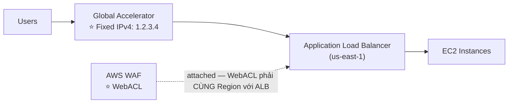

> ⭐⭐⭐ **ĐÂY LÀ CÂU HỎI THI RẤT ĐẶC TRƯNG:**
> *"Cần ĐỊA CHỈ IP CỐ ĐỊNH cho ứng dụng NHƯNG vẫn muốn dùng WAF. Làm sao?"*
> → **Global Accelerator (cho fixed IP) + ALB (cho WAF)**.
> ❌ **Đáp án sai: "Dùng NLB để có fixed IP"** — vì **NLB không dùng được WAF**.
>
> ⭐⭐ **Và nhớ: WebACL phải CÙNG Region với ALB.**

---

## 307. Shield - DDoS Protection

### ⭐⭐⭐ AWS Shield

- ⭐⭐⭐ **DDoS: Distributed Denial of Service — RẤT NHIỀU request CÙNG LÚC**

| | ⭐⭐⭐ **AWS Shield Standard** | ⭐⭐⭐ **AWS Shield Advanced** |
|---|---|---|
| **Chi phí** | ⭐⭐⭐ **MIỄN PHÍ — kích hoạt sẵn cho MỌI khách hàng AWS** | ⚠️⭐⭐⭐ **$3.000 / THÁNG / ORGANIZATION** |
| **Bảo vệ khỏi** | ⭐⭐⭐ **SYN/UDP Floods, Reflection attacks và các tấn công LAYER 3 / LAYER 4 khác** | ⭐⭐⭐ **Tấn công TINH VI HƠN** |
| **Áp dụng cho** | Mọi tài nguyên | ⭐⭐⭐ **Amazon EC2, Elastic Load Balancing (ELB), Amazon CloudFront, AWS Global Accelerator, và Route 53** |
| **Hỗ trợ** | — | ⭐⭐⭐ **Truy cập 24/7 đội DDoS response team (DRP)** |
| **Chi phí phát sinh** | — | ⭐⭐⭐ **BẢO VỆ khỏi phí cao bất thường do DDoS gây tăng usage** |
| **Tự động hóa** | — | ⭐⭐⭐ **Shield Advanced automatic application layer DDoS mitigation — TỰ ĐỘNG TẠO, ĐÁNH GIÁ và TRIỂN KHAI AWS WAF rules để giảm thiểu tấn công LAYER 7** |

> ⭐⭐⭐ **BỐN ĐIỂM RA THI:**
> 1. **Standard MIỄN PHÍ, bật sẵn, chống Layer 3/4**
> 2. **Advanced $3.000/tháng**
> 3. **5 dịch vụ được Advanced bảo vệ: EC2, ELB, CloudFront, Global Accelerator, Route 53**
> 4. ⭐ **"Protect against higher fees during usage spikes"** — nếu bị DDoS làm ASG scale ồ ạt, **AWS hoàn tiền phần phát sinh**

---

## 308. Firewall Manager

### ⭐⭐⭐ AWS Firewall Manager

- ⭐⭐⭐ **QUẢN LÝ RULES TRONG TẤT CẢ TÀI KHOẢN của một AWS Organization**
- ⭐⭐⭐ **Security policy: TẬP RULE BẢO MẬT CHUNG**

**⭐⭐⭐ Quản lý được những gì:**

| Loại |
|---|
| ⭐⭐⭐ **WAF rules** (Application Load Balancer, API Gateways, CloudFront) |
| ⭐⭐⭐ **AWS Shield Advanced** (ALB, CLB, NLB, Elastic IP, CloudFront) |
| ⭐⭐⭐ **Security Groups** cho EC2, Application Load Balancer và ENI resources trong VPC |
| ⭐⭐ **AWS Network Firewall** (VPC Level) |
| ⭐⭐ **Amazon Route 53 Resolver DNS Firewall** |

- ⭐⭐ **Policies được tạo ở MỨC REGION**
- ⭐⭐⭐ **Rules được ÁP DỤNG CHO TÀI NGUYÊN MỚI NGAY KHI CHÚNG ĐƯỢC TẠO (tốt cho compliance) trên TẤT CẢ tài khoản hiện tại VÀ TƯƠNG LAI trong Organization**

> ⭐⭐⭐ **Dòng cuối là giá trị cốt lõi:** **tài nguyên mới tạo TỰ ĐỘNG được bảo vệ** — không cần nhớ gắn WAF thủ công.

---

### ⭐⭐⭐ WAF vs. Firewall Manager vs. Shield — BẢNG QUYẾT ĐỊNH

- ⭐⭐⭐ **WAF, Shield và Firewall Manager ĐƯỢC DÙNG CÙNG NHAU để bảo vệ toàn diện**

| Tình huống | Chọn gì |
|---|---|
| ⭐⭐⭐ **Định nghĩa Web ACL rules** | **WAF** |
| ⭐⭐⭐ **Bảo vệ CHI TIẾT (granular) cho tài nguyên của bạn** | ⭐⭐⭐ **WAF MỘT MÌNH là lựa chọn đúng** |
| ⭐⭐⭐ **Dùng WAF XUYÊN NHIỀU TÀI KHOẢN, TĂNG TỐC cấu hình WAF, TỰ ĐỘNG bảo vệ tài nguyên mới** | ⭐⭐⭐ **Firewall Manager + AWS WAF** |
| ⭐⭐⭐ **Cần dedicated support từ Shield Response Team (SRT) và advanced reporting** | ⭐⭐⭐ **Shield Advanced** |
| ⭐⭐⭐ **Thường xuyên bị DDoS tấn công** | ⭐⭐⭐ **Cân nhắc mua Shield Advanced** |

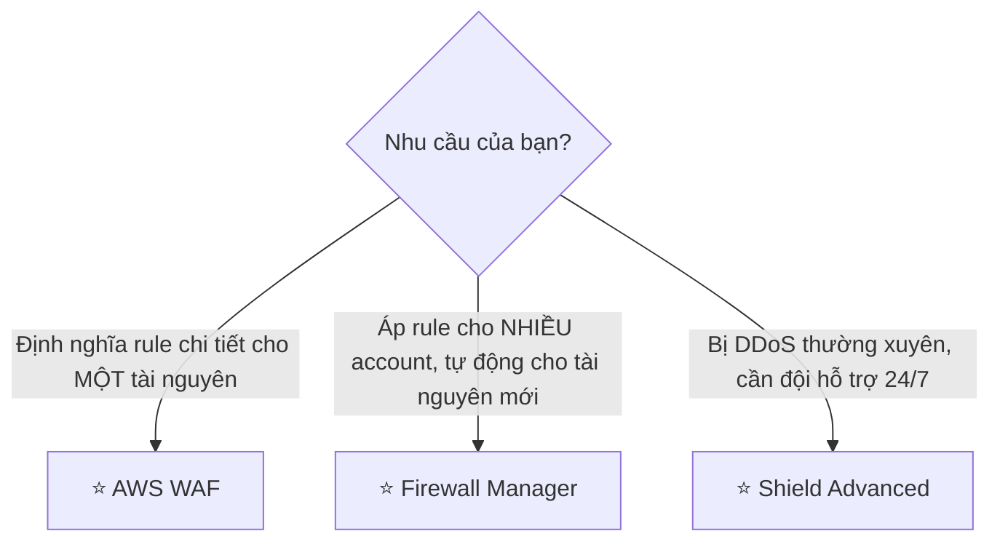

> ⭐⭐⭐ **Đây là bảng ra thi nhiều nhất của nhóm bài 306–308.** Mẹo: **WAF = chi tiết một chỗ. Firewall Manager = diện rộng nhiều account. Shield Advanced = chống DDoS cao cấp + hỗ trợ con người.**

---

## 309. WAF & Shield - Hands On

> 🖐️ Bài Hands On — **không có slide**. Các bước Console.

### Bước 1 — Tạo Web ACL

1. Console → **WAF & Shield** → **Web ACLs** → **Create web ACL**
2. ⭐⭐⭐ **Resource type**:

| Lựa chọn | Ghi chú |
|---|---|
| ⭐⭐⭐ **Regional resources** | **ALB, API Gateway, AppSync, Cognito User Pool** — ⭐ phải chọn **đúng Region** |
| ⭐⭐⭐ **CloudFront distributions** | ⭐ **Region tự động là Global** |

3. **Name**: `my-web-acl`
4. **Associated AWS resources** → **Add AWS resources** → chọn ALB/CloudFront của bạn
5. **Next**

### Bước 2 — Thêm Rules ⭐⭐⭐

1. **Add rules** → có ba lựa chọn:

| Lựa chọn | Chi tiết |
|---|---|
| ⭐⭐⭐ **Add managed rule groups** | ⭐ **Rule dựng sẵn của AWS và bên thứ ba** |
| ⭐⭐⭐ **Add my own rules and rule groups** | Tự viết rule |
| **Add existing rule group** | Dùng lại rule group đã có |

2. ⭐⭐ **Managed rule groups đáng chú ý của AWS** (miễn phí):

| Rule group | Chặn gì |
|---|---|
| ⭐⭐⭐ **Core rule set (CRS)** | Các lỗ hổng phổ biến OWASP |
| ⭐⭐⭐ **SQL database** | ⭐ **SQL injection** |
| ⭐⭐ **Known bad inputs** | Các payload độc hại đã biết |
| ⭐⭐⭐ **Amazon IP reputation list** | IP có tiếng xấu |
| ⭐⭐ **Anonymous IP list** | VPN, Tor, proxy ẩn danh |
| ⭐⭐ **Linux / Windows / PHP / WordPress** | Lỗ hổng theo nền tảng |

3. ⭐⭐⭐ **Tự tạo Rate-based rule (chống DDoS):**
   - **Add my own rules** → **Rule type**: ⭐ **Rate-based rule**
   - **Rate limit**: ví dụ `100` (request trong 5 phút từ một IP)
   - **Action**: ⭐ **Block**
4. ⭐⭐⭐ **Tự tạo IP Set rule:**
   - Trước tiên: **IP sets** → **Create IP set** → thêm CIDR (ví dụ `203.0.113.0/24`)
   - Rồi tạo rule kiểu **IP set** → Action **Block** hoặc **Allow**
5. ⭐⭐⭐ **Geo-match rule:** Rule type **Geographic match** → chọn quốc gia → **Block**

### Bước 3 — Default action và thứ tự rule

1. ⭐⭐⭐ **Default web ACL action for requests that don't match any rules**: **Allow** hoặc **Block**
2. ⭐⭐⭐ **Set rule priority** — ⚠️ **thứ tự QUAN TRỌNG**: rule chạy từ trên xuống, **rule đầu tiên khớp sẽ quyết định**
3. **Next** → **Configure metrics** → **Next** → **Create web ACL**

### Bước 4 — Kiểm chứng

1. Truy cập ứng dụng qua ALB/CloudFront → bình thường
2. ⭐ Thử gửi request có chứa SQL injection, ví dụ: `?id=1' OR '1'='1` → nhận **403 Forbidden**
3. Xem **Web ACL** → tab ⭐ **Overview** → biểu đồ **Allowed vs Blocked requests**
4. ⭐⭐ Bật **Logging and metrics** → gửi log tới **Kinesis Data Firehose** hoặc **CloudWatch Logs** / **S3**

### Bước 5 — Xem AWS Shield

1. **WAF & Shield** → **AWS Shield** → **Overview**
2. ⭐⭐⭐ Thấy **Shield Standard đã BẬT SẴN và MIỄN PHÍ** — không cần làm gì
3. Tab **Protected resources** → nếu muốn **Shield Advanced** thì phải **Subscribe** (⚠️ **$3.000/tháng, cam kết 1 năm**)

> ⚠️⚠️⭐⭐⭐ **TUYỆT ĐỐI KHÔNG BẤM SUBSCRIBE SHIELD ADVANCED.** Phí là **$3.000/tháng với cam kết tối thiểu 1 NĂM** — đây là thao tác tốn kém nhất có thể làm nhầm trong toàn bộ khóa học.

### ⚠️ Dọn dẹp

| # | Việc |
|---|---|
| 1 | ⭐⭐⭐ **Gỡ liên kết Web ACL khỏi ALB/CloudFront** (Associated AWS resources → Remove) |
| 2 | ⭐⭐⭐ **Xóa Web ACL** |
| 3 | ⭐⭐ **Xóa IP sets và Rule groups tự tạo** |
| 4 | ⭐⭐ Tắt **Logging** nếu đã bật |

```bash
# Liệt kê web ACL (regional)
aws wafv2 list-web-acls --scope REGIONAL --region us-east-1

# Liệt kê web ACL cho CloudFront (phải ở us-east-1)
aws wafv2 list-web-acls --scope CLOUDFRONT --region us-east-1
```

> ⚠️ **CHI PHÍ WAF:** **$5/tháng mỗi Web ACL** + **$1/tháng mỗi rule** + **$0.60/triệu request**. Không đắt nhưng **không miễn phí** — nhớ xóa Web ACL sau khi học.

---

## 310. DDoS Protection Best Practices

Slide chia best practices thành **4 nhóm**, mỗi biện pháp được đánh số **BP** (Best Practice).

---

### ⭐⭐⭐ Nhóm 1 — Edge Location Mitigation (BP1, BP3)

| BP | Dịch vụ | Vai trò |
|---|---|---|
| ⭐⭐⭐ **BP1** | **CloudFront** | **Phân phối ứng dụng web TẠI EDGE**<br/>⭐⭐⭐ **Bảo vệ khỏi DDoS Common Attacks (SYN floods, UDP reflection…)** |
| ⭐⭐⭐ **BP1** | **Global Accelerator** | **Truy cập ứng dụng từ edge**<br/>⭐⭐⭐ **Tích hợp với Shield để chống DDoS**<br/>⭐⭐⭐ **HỮU ÍCH KHI backend KHÔNG TƯƠNG THÍCH với CloudFront** |
| ⭐⭐⭐ **BP3** | **Route 53** | **Phân giải tên miền tại edge**<br/>**Cơ chế chống DDoS** |

> ⭐⭐⭐ **Dòng "helpful if your backend is not compatible with CloudFront" là điểm ra thi** — ví dụ ứng dụng dùng **TCP/UDP thuần** (game, IoT) thì CloudFront không dùng được, phải dùng **Global Accelerator**.

---

### ⭐⭐ Nhóm 2 — Best practices for DDoS mitigation (hạ tầng)

| BP | Biện pháp |
|---|---|
| ⭐⭐⭐ **BP1, BP3, BP6** | **Infrastructure layer defense — BẢO VỆ Amazon EC2 khỏi traffic cao**, dùng **Global Accelerator, Route 53, CloudFront, Elastic Load Balancing** |
| ⭐⭐⭐ **BP7** | **Amazon EC2 với AUTO SCALING — giúp scale khi có traffic tăng đột ngột, kể cả flash crowd hay DDoS** |
| ⭐⭐⭐ **BP6** | **Elastic Load Balancing — TỰ SCALE theo traffic và PHÂN PHỐI traffic tới nhiều EC2 instances** |

> ⭐⭐⭐ **Ý tưởng cốt lõi: Auto Scaling + ELB là "tấm đệm" hấp thụ tấn công** — thay vì sập, hệ thống nở ra.

---

### ⭐⭐⭐ Nhóm 3 — Application Layer Defense (BP1, BP2, BP6)

| Biện pháp |
|---|
| ⭐⭐⭐ **CloudFront CACHE nội dung tĩnh và phục vụ từ edge locations, BẢO VỆ backend của bạn** |
| ⭐⭐⭐ **AWS WAF dùng TRÊN CloudFront và ALB để LỌC và CHẶN request dựa trên request signatures** |
| ⭐⭐⭐ **WAF RATE-BASED RULES có thể TỰ ĐỘNG CHẶN IP của kẻ xấu** |
| ⭐⭐⭐ **Dùng MANAGED RULES trên WAF để chặn tấn công dựa trên IP REPUTATION, hoặc chặn ANONYMOUS IPs** |
| ⭐⭐⭐ **CloudFront có thể CHẶN THEO KHU VỰC ĐỊA LÝ cụ thể** |
| ⭐⭐⭐ **Shield Advanced (BP1, BP2, BP6) — TỰ ĐỘNG tạo, đánh giá và triển khai WAF rules để giảm thiểu tấn công layer 7** |

---

### ⭐⭐ Nhóm 4 — Attack surface reduction (giảm bề mặt tấn công)

| BP | Biện pháp |
|---|---|
| ⭐⭐⭐ **BP1, BP4, BP6** | **OBFUSCATING AWS resources — dùng CloudFront, API Gateway, ELB để ẨN tài nguyên backend (Lambda functions, EC2 instances)** |
| ⭐⭐⭐ **BP5** | **Security groups và Network ACLs — lọc traffic theo IP cụ thể ở mức SUBNET hoặc ENI**<br/>⭐⭐ **Elastic IP được Shield Advanced bảo vệ** |
| ⭐⭐⭐ **BP4** | **Protecting API endpoints — ẨN EC2, Lambda…**<br/>**Dùng Edge-optimized mode, hoặc CloudFront + regional mode (kiểm soát DDoS tốt hơn)**<br/>⭐⭐ **WAF + API Gateway: burst limits, headers filtering, dùng API keys** |

> ⭐⭐⭐ **Từ khóa "obfuscating" / "hide your backend"** → **đặt CloudFront/API Gateway/ELB phía trước**. Đây là nguyên tắc lặp lại nhiều lần trong khóa (chương 20 bài 230 cũng vậy).

---

### 🧭 Tổng kết DDoS Best Practices ⭐⭐⭐

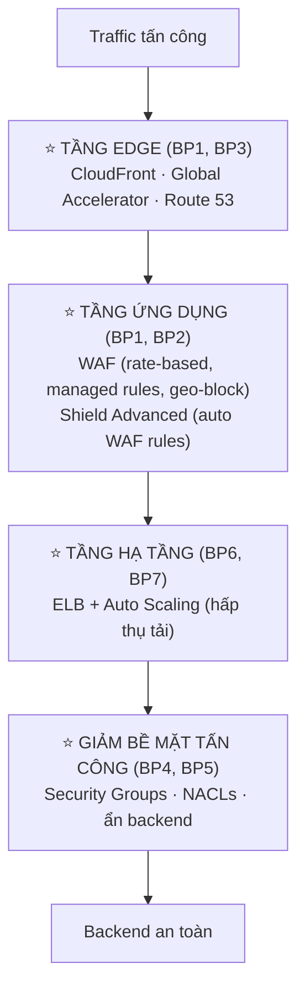

---

## 311. Amazon GuardDuty

### ⭐⭐⭐ Amazon GuardDuty

- ⭐⭐⭐ **INTELLIGENT THREAT DISCOVERY để bảo vệ tài khoản AWS của bạn**
- ⭐⭐⭐ **Dùng thuật toán MACHINE LEARNING, ANOMALY DETECTION, dữ liệu BÊN THỨ BA**
- ⭐⭐⭐ **BẬT CHỈ BẰNG MỘT CLICK (dùng thử 30 ngày), KHÔNG cần cài phần mềm**

**⭐⭐⭐ Dữ liệu đầu vào (input data) — RA THI:**

| Nguồn | Phát hiện gì |
|---|---|
| ⭐⭐⭐ **CloudTrail Events Logs** | **API call bất thường, deployment trái phép** |
| ⭐⭐ **CloudTrail Management Events** | **create VPC subnet, create trail…** |
| ⭐⭐⭐ **CloudTrail S3 Data Events** | **get object, list objects, delete object…** |
| ⭐⭐⭐ **VPC Flow Logs** | **traffic nội bộ bất thường, IP address bất thường** |
| ⭐⭐⭐ **DNS Logs** | ⭐ **EC2 instance bị xâm nhập đang GỬI DỮ LIỆU MÃ HÓA TRONG DNS QUERIES** |
| ⭐⭐ **Optional Features** | **EKS Audit Logs, RDS & Aurora, EBS, Lambda, S3 Data Events…** |

```mermaid
flowchart LR
    V["VPC Flow Logs"] --> G["⭐ GuardDuty"]
    C["CloudTrail Logs"] --> G
    D["DNS Logs (AWS DNS)"] --> G
    O["Optional Features:<br/>S3 Logs · EBS Volumes<br/>Lambda Network Activity<br/>RDS & Aurora Login Activity<br/>EKS Audit Logs & Runtime Monitoring"] --> G
    G --> EB["EventBridge"]
    EB --> SNS["SNS"]
    EB --> L["Lambda"]
```

- ⭐⭐⭐ **Có thể thiết lập EVENTBRIDGE RULES để được thông báo khi có findings**
- ⭐⭐⭐ **EventBridge rules có thể nhắm tới AWS LAMBDA hoặc SNS**
- ⭐⭐⭐ **Bảo vệ được khỏi tấn công CRYPTOCURRENCY (có một "finding" chuyên biệt cho nó)**

> ⭐⭐⭐ **Từ khóa nhận diện GuardDuty:** *"intelligent threat detection"*, *"machine learning"*, *"anomaly detection"*, *"one click, no software to install"*, ⭐ *"CryptoCurrency"*.
>
> ⭐⭐⭐ **Ba nguồn log CỐT LÕI phải nhớ: CloudTrail, VPC Flow Logs, DNS Logs.**

---

## 312. Amazon Inspector

### ⭐⭐⭐ Amazon Inspector

- ⭐⭐⭐ **AUTOMATED SECURITY ASSESSMENTS (đánh giá bảo mật tự động)**

**⭐⭐⭐ CHỈ dành cho BA loại tài nguyên:**

| Đối tượng | Làm gì |
|---|---|
| ⭐⭐⭐ **EC2 instances** | **Tận dụng AWS SYSTEM MANAGER (SSM) AGENT**<br/>⭐⭐⭐ **Phân tích NETWORK ACCESSIBILITY ngoài ý muốn**<br/>⭐⭐⭐ **Phân tích HỆ ĐIỀU HÀNH đang chạy so với các lỗ hổng ĐÃ BIẾT** |
| ⭐⭐⭐ **Container Images push lên Amazon ECR** | **Đánh giá Container Images NGAY KHI chúng được push** |
| ⭐⭐⭐ **Lambda Functions** | **Xác định lỗ hổng phần mềm trong CODE và PACKAGE DEPENDENCIES**<br/>**Đánh giá functions NGAY KHI chúng được deploy** |

- ⭐⭐⭐ **Báo cáo & tích hợp với AWS SECURITY HUB**
- ⭐⭐⭐ **Gửi findings tới Amazon EVENTBRIDGE**

```mermaid
flowchart LR
    E["EC2 Instance<br/>(qua ⭐ SSM Agent)"] --> I["⭐ Amazon Inspector"]
    C["Amazon ECR<br/>Container Image"] --> I
    L["Lambda Function"] --> I
    I -->|"assessment run state & findings"| SH["AWS Security Hub"]
    I --> EB["EventBridge"]
```

---

### ⭐⭐⭐ What does Amazon Inspector evaluate?

- ⚠️⭐⭐⭐ **NHỚ: CHỈ dành cho EC2 instances, Container Images & Lambda functions**
- ⭐⭐⭐ **QUÉT LIÊN TỤC hạ tầng, CHỈ KHI CẦN THIẾT**
- ⭐⭐⭐ **Package vulnerabilities (EC2, ECR & Lambda) — dựa trên CƠ SỞ DỮ LIỆU CVE**
- ⭐⭐⭐ **Network reachability (CHỈ EC2)**
- ⭐⭐⭐ **Một RISK SCORE được gán cho TẤT CẢ lỗ hổng để ƯU TIÊN XỬ LÝ**

> ⭐⭐⭐ **Ba từ khóa ra thi: "CVE database"**, **"network reachability"**, **"risk score"**.
>
> ⚠️⭐⭐⭐ **Bẫy thi:** Inspector **KHÔNG quét S3, RDS, hay bất cứ thứ gì khác** — chỉ **EC2, ECR container images, Lambda**.

---

## 313. Amazon Macie

### ⭐⭐⭐ Amazon Macie

- ⭐⭐⭐ **Dịch vụ DATA SECURITY và DATA PRIVACY được quản lý hoàn toàn, dùng MACHINE LEARNING và PATTERN MATCHING để KHÁM PHÁ và BẢO VỆ DỮ LIỆU NHẠY CẢM trong AWS**
- ⭐⭐⭐ **Macie giúp XÁC ĐỊNH và CẢNH BÁO về dữ liệu nhạy cảm, như PERSONALLY IDENTIFIABLE INFORMATION (PII)**

```mermaid
flowchart LR
    S3["S3 Buckets"] -->|"analyze"| M["⭐ Macie<br/>Discover Sensitive Data (PII)"]
    M -->|"notify"| EB["Amazon EventBridge"]
    EB --> I["integrations<br/>(SNS, Lambda…)"]
```

> ⭐⭐⭐ **Câu định vị PHẢI THUỘC:** **"Macie = TÌM DỮ LIỆU NHẠY CẢM (PII) TRONG S3."**
>
> ⭐⭐⭐ **Từ khóa nhận diện:** *"PII"*, *"sensitive data"*, *"data privacy"*, *"phát hiện số thẻ tín dụng / số CMND trong S3"* → **Macie**.
>
> ⚠️ **Đừng nhầm ba dịch vụ "phát hiện":**
> - ⭐⭐⭐ **GuardDuty** = phát hiện **HÀNH VI TẤN CÔNG** (từ log)
> - ⭐⭐⭐ **Inspector** = phát hiện **LỖ HỔNG PHẦN MỀM** (EC2/ECR/Lambda)
> - ⭐⭐⭐ **Macie** = phát hiện **DỮ LIỆU NHẠY CẢM** (trong S3)

---

## 🧭 Cheat Sheet toàn chương ⭐⭐⭐

| Từ khóa trong đề | Đáp án |
|---|---|
| *"encryption" cho một dịch vụ AWS* | **KMS** (khả năng cao nhất) |
| *"khóa đối xứng, AWS services tích hợp"* | **Symmetric KMS Key** |
| *"đối tác ngoài AWS cần mã hóa, không gọi được API"* | **Asymmetric KMS Key** (đưa public key) |
| *"AWS-managed key xoay bao lâu"* | **Tự động mỗi 1 năm** |
| *"customer-managed key xoay thế nào"* | **Phải BẬT, tự động & on-demand** |
| *"imported key xoay thế nào"* | **Chỉ THỦ CÔNG, dùng alias** |
| ⚠️ *"mã hóa file > 4 KB bằng KMS"* | **Envelope Encryption (`GenerateDataKey`)** |
| *"copy snapshot sang region khác"* | **Phải re-encrypt bằng key của region đích** |
| *"chia sẻ snapshot mã hóa sang account khác"* | **Phải dùng Customer Managed Key + chia sẻ KMS Key Policy** |
| ⭐ *"mã hóa ở region này, giải mã ở region khác, không re-encrypt"* | **KMS Multi-Region Keys** (`mrk-`) |
| *"bảo vệ trường dữ liệu ngay cả với DBA"* | **Client-side encryption** |
| ⚠️ *"S3 replication với SSE-KMS"* | **Phải BẬT tùy chọn + IAM role có `kms:Decrypt`/`kms:Encrypt`** |
| ⭐ *"chia sẻ AMI mã hóa"* | **Launch Permission + share KMS Key + 4 quyền `DescribeKey`, `ReEncrypt*`, `CreateGrant`, `Decrypt`** |
| *"lưu config và secret, miễn phí"* | **SSM Parameter Store (Standard)** |
| *"parameter tối đa bao nhiêu"* | **Standard: 10.000 / 4 KB — Advanced: 100.000 / 8 KB** |
| ⭐ *"TỰ ĐỘNG xoay mật khẩu database"* | **Secrets Manager** (dùng Lambda) |
| *"tích hợp sẵn với RDS để xoay credentials"* | **Secrets Manager** |
| *"đọc Secrets Manager qua Parameter Store"* | **`/aws/reference/secretsmanager/<secret_ID>`** |
| *"lấy AMI ID mới nhất"* | **`/aws/service/ami-amazon-linux-latest/...`** |
| *"TLS certificate miễn phí, tự động gia hạn"* | **ACM** |
| *"validation nào nên dùng cho tự động hóa"* | **DNS Validation** (CNAME) |
| ⭐ *"ACM tự gia hạn trước bao nhiêu ngày"* | **60 ngày** (certificate do ACM tạo) |
| ⭐ *"cảnh báo certificate IMPORT sắp hết hạn"* | **45 ngày**, qua **EventBridge**; Config rule **`acm-certificate-expiration-check`** |
| *"certificate cho Edge-Optimized API Gateway / CloudFront"* | **Phải ở `us-east-1`** |
| ⭐ *"tôi phải tự quản lý khóa, AWS không được chạm vào"* | **CloudHSM** |
| *"FIPS 140-2 Level 3, dedicated hardware"* | **CloudHSM** |
| *"SSL/TLS Acceleration, Oracle TDE Acceleration"* | **CloudHSM** (KMS không có) |
| *"dùng CloudHSM nhưng qua API của KMS"* | **KMS Custom Key Store** |
| *"chặn SQL injection, XSS"* | **AWS WAF** (Layer 7) |
| *"WAF deploy được ở đâu"* | **ALB, API Gateway, CloudFront, AppSync, Cognito User Pool** |
| ⚠️ *"WAF trên NLB"* | ❌ **KHÔNG được** (NLB là Layer 4) |
| ⭐⭐ *"cần fixed IP NHƯNG vẫn muốn WAF"* | **Global Accelerator + ALB + WAF** |
| *"IP Set tối đa bao nhiêu IP"* | **10.000** |
| *"chống DDoS bằng WAF"* | **Rate-based rules** |
| *"chống DDoS miễn phí, Layer 3/4"* | **Shield Standard** (bật sẵn) |
| ⭐ *"chống DDoS nâng cao, có đội hỗ trợ 24/7"* | **Shield Advanced ($3.000/tháng)** |
| *"Shield Advanced bảo vệ dịch vụ nào"* | **EC2, ELB, CloudFront, Global Accelerator, Route 53** |
| ⭐ *"áp WAF rule cho TẤT CẢ account trong Organization"* | **Firewall Manager** |
| *"tài nguyên mới tạo tự động được bảo vệ"* | **Firewall Manager** |
| *"backend không tương thích CloudFront, vẫn cần edge"* | **Global Accelerator** |
| ⭐ *"phát hiện hành vi tấn công từ log (ML)"* | **GuardDuty** |
| *"GuardDuty đọc log gì"* | **CloudTrail, VPC Flow Logs, DNS Logs** (+ optional) |
| *"phát hiện đào tiền ảo"* | **GuardDuty** |
| ⭐ *"quét lỗ hổng phần mềm EC2/container/Lambda"* | **Inspector** |
| *"CVE database, network reachability, risk score"* | **Inspector** |
| ⭐ *"tìm dữ liệu nhạy cảm PII trong S3"* | **Macie** |

---

## Trắc nghiệm 23: AWS Security & Encryption Quiz

### Các điểm dễ bị bẫy

| Câu hỏi thường gặp | Đáp án đúng | Vì sao đáp án khác sai |
|---|---|---|
| Ba kiểu mã hóa là gì? | **In flight (TLS), Server-side at rest, Client-side** | |
| Server KHÔNG giải mã được dữ liệu — kiểu nào? | ⭐ **Client-side encryption** | |
| Dịch vụ AWS tích hợp KMS dùng loại key nào? | ⭐⭐⭐ **Symmetric CMK** | |
| Lấy được KMS key ở dạng plaintext không? | ❌ **KHÔNG — phải gọi KMS API** | |
| Khi nào dùng Asymmetric KMS Key? | ⭐ **Mã hóa NGOÀI AWS bởi user không gọi được KMS API** | |
| Customer managed key giá bao nhiêu? | **$1/tháng** + **$0.03/10.000 API calls** | AWS Owned và AWS Managed keys **miễn phí** |
| AWS-managed key xoay tự động mấy năm? | ⭐ **1 năm** | Customer-managed phải **BẬT**; Imported chỉ **thủ công** |
| KMS mã hóa tối đa bao nhiêu dữ liệu? | ⚠️⭐⭐⭐ **4 KB** — lớn hơn dùng **Envelope Encryption** | |
| `decrypt` có cần `--key-id` không? | ❌ **KHÔNG — ciphertext đã chứa metadata** | |
| Copy snapshot mã hóa sang region khác? | **Phải RE-ENCRYPT bằng key region đích** | |
| Chia sẻ snapshot mã hóa cross-account cần gì? | ⭐ **Customer Managed Key** + **KMS Key Policy** | ❌ AWS Managed Key **không chia sẻ được** |
| KMS Key không có Key Policy thì sao? | ⚠️ **KHÔNG AI dùng được** (khác S3 bucket) | |
| Multi-Region Key có phải global không? | ❌⭐⭐⭐ **KHÔNG — là Primary + Replicas, quản lý ĐỘC LẬP** | |
| Multi-Region Key nhận diện thế nào? | **Key ID bắt đầu `mrk-`**, cùng key material | |
| Bảo vệ trường dữ liệu khỏi cả DBA? | ⭐ **Client-side encryption** (AWS Encryption SDK) | Server-side thì DBA vẫn đọc được |
| S3 replication object SSE-KMS? | ⚠️ **PHẢI BẬT tùy chọn** | Unencrypted và SSE-S3 replicate **mặc định** |
| S3 replication SSE-KMS cần IAM role gì? | ⭐ **`kms:Decrypt` key nguồn + `kms:Encrypt` key đích** | |
| Chia sẻ AMI mã hóa cần mấy thứ? | ⭐⭐ **HAI: Launch Permission + KMS Key** | |
| Bốn quyền tài khoản đích cần có? | ⭐⭐⭐ **`DescribeKey`, `ReEncrypt*`, `CreateGrant`, `Decrypt`** | |
| Parameter Store Standard giới hạn? | **10.000 parameter, 4 KB/giá trị, MIỄN PHÍ** | Advanced: **100.000 / 8 KB / tính phí** |
| SecureString lấy về bị mã hóa? | ⭐ **Thiếu `--with-decryption`** | |
| Lấy tất cả parameter trong một nhánh? | ⭐ **`get-parameters-by-path --recursive`** | |
| Lambda đọc được db-url nhưng lỗi db-password? | ⭐⭐⭐ **Thiếu quyền `kms:Decrypt`** | |
| Tự động xoay DB credentials? | ⭐⭐⭐ **Secrets Manager** (dùng Lambda) | Parameter Store **không tự xoay được** |
| Secrets Manager tích hợp sẵn DB nào? | **MySQL, PostgreSQL, Aurora** | |
| Muốn lưu config miễn phí? | ⭐ **Parameter Store Standard** | Secrets Manager **$0.40/secret/tháng** |
| Đọc Secrets Manager qua Parameter Store? | ⭐ **`/aws/reference/secretsmanager/<id>`** | |
| ACM public certificate giá bao nhiêu? | ⭐ **MIỄN PHÍ**, tự động gia hạn | |
| Validation nào ưa chuộng? | ⭐ **DNS Validation** (dùng CNAME, tự động hóa được) | |
| ACM tự gia hạn trước bao nhiêu ngày? | ⭐⭐⭐ **60 ngày** | ⚠️ **45 ngày** là cảnh báo cho cert **IMPORT** |
| Certificate import có tự gia hạn không? | ❌ **KHÔNG — phải import mới trước khi hết hạn** | |
| Config rule kiểm tra cert hết hạn? | **`acm-certificate-expiration-check`** | |
| Certificate cho Edge-Optimized API Gateway? | ⭐⭐⭐ **`us-east-1`** | Regional → **cùng region với API Stage** |
| KMS vs CloudHSM về tenancy? | ⭐⭐⭐ **KMS: Multi-Tenant — CloudHSM: Single-Tenant** | |
| Ai quản lý khóa trong CloudHSM? | ⭐⭐⭐ **BẠN** (AWS chỉ quản lý phần cứng) | |
| CloudHSM có Free Tier không? | ❌ **KHÔNG** | KMS thì **có** |
| Cần SSL/TLS hoặc Oracle TDE Acceleration? | ⭐⭐⭐ **CloudHSM** | KMS **không có** |
| CloudHSM xác thực bằng gì? | ⭐ **Bạn tạo users và quản lý quyền** | KMS dùng **IAM** |
| WAF bảo vệ ở layer nào? | ⭐⭐⭐ **Layer 7 (HTTP)** | Layer 4 là TCP/UDP |
| WAF deploy được ở đâu? | **ALB, API Gateway, CloudFront, AppSync, Cognito User Pool** | ⚠️ **KHÔNG có NLB** |
| Cần fixed IP + WAF? | ⭐⭐⭐ **Global Accelerator + ALB + WAF** | ❌ NLB có fixed IP nhưng **không dùng được WAF** |
| IP Set tối đa bao nhiêu IP? | **10.000** — nhiều hơn thì dùng nhiều rule | |
| Web ACL là regional hay global? | ⭐ **Regional, NGOẠI TRỪ CloudFront** | |
| Chống DDoS bằng WAF rule nào? | ⭐ **Rate-based rules** | |
| Shield Standard giá bao nhiêu? | ⭐ **MIỄN PHÍ, bật sẵn cho mọi khách hàng** | Chống **Layer 3/4** |
| Shield Advanced giá bao nhiêu? | ⭐⭐⭐ **$3.000/tháng/organization** | |
| Shield Advanced bảo vệ dịch vụ nào? | **EC2, ELB, CloudFront, Global Accelerator, Route 53** | |
| Shield Advanced có hoàn phí DDoS không? | ✅ **CÓ** — bảo vệ khỏi phí cao do usage spike | |
| Áp WAF rule cho toàn Organization? | ⭐⭐⭐ **Firewall Manager** | |
| Tài nguyên mới tự động được bảo vệ? | ⭐ **Firewall Manager** | |
| Chỉ cần bảo vệ chi tiết một tài nguyên? | ⭐ **WAF một mình là đủ** | |
| Backend không tương thích CloudFront? | ⭐ **Global Accelerator** | |
| GuardDuty đọc những log nào? | ⭐⭐⭐ **CloudTrail, VPC Flow Logs, DNS Logs** (+ optional) | |
| GuardDuty cần cài agent không? | ❌ **KHÔNG — một click, 30 ngày dùng thử** | |
| Phát hiện đào tiền ảo? | ⭐ **GuardDuty** (có finding riêng) | |
| Inspector quét được gì? | ⚠️⭐⭐⭐ **CHỈ EC2, ECR Container Images, Lambda** | ❌ Không quét S3/RDS |
| Inspector dùng gì cho EC2? | ⭐ **SSM Agent** | |
| Inspector đánh giá gì? | **Package vulnerabilities (CVE), Network reachability (EC2), Risk score** | |
| Inspector gửi findings đi đâu? | **AWS Security Hub và EventBridge** | |
| Tìm PII trong S3? | ⭐⭐⭐ **Macie** | |
| Phân biệt GuardDuty/Inspector/Macie? | **GuardDuty = hành vi tấn công; Inspector = lỗ hổng phần mềm; Macie = dữ liệu nhạy cảm** | |

---

### Checklist tự kiểm tra trước khi làm quiz

**KMS & mã hóa:**
- [ ] Thuộc **3 kiểu mã hóa** và ai giải mã được
- [ ] Phân biệt **Symmetric (dịch vụ AWS dùng) vs Asymmetric (bên ngoài AWS)**
- [ ] Thuộc **bảng giá 4 loại KMS key** và **3 cơ chế xoay khóa**
- [ ] ⭐ Nhớ **giới hạn 4 KB → Envelope Encryption**
- [ ] Nhớ **KMS key là PER-REGION**, copy snapshot phải re-encrypt
- [ ] ⭐ Nhớ **chia sẻ snapshot/AMI mã hóa cần Customer Managed Key**
- [ ] Thuộc **4 quyền chia sẻ AMI**: `DescribeKey`, `ReEncrypt*`, `CreateGrant`, `Decrypt`
- [ ] ⭐ Nhớ **Multi-Region Key KHÔNG phải global** (primary + replica độc lập)
- [ ] Nhớ **S3 replication SSE-KMS phải bật thủ công**

**Secrets & certificates:**
- [ ] ⭐ Thuộc **bảng Parameter Store vs Secrets Manager** (miễn phí vs tự xoay)
- [ ] Nhớ **Standard 10.000/4 KB, Advanced 100.000/8 KB**
- [ ] Nhớ **`--with-decryption`** và **`kms:Decrypt`** cho SecureString
- [ ] ⭐ Nhớ hai đường dẫn đặc biệt: **`/aws/reference/secretsmanager/`** và **`/aws/service/ami-amazon-linux-latest/`**
- [ ] ⭐⭐ Phân biệt **60 ngày (ACM tự gia hạn)** vs **45 ngày (cảnh báo cert import)**
- [ ] Nhớ **DNS Validation** và **certificate Edge phải ở `us-east-1`**
- [ ] ⭐ Thuộc **bảng KMS vs CloudHSM** (4 dòng chính)

**Bảo vệ & phát hiện:**
- [ ] Nhớ **WAF là Layer 7**, deploy trên **5 dịch vụ**, ⚠️ **KHÔNG có NLB**
- [ ] ⭐⭐ Nhớ pattern **Global Accelerator + ALB + WAF** để có fixed IP
- [ ] Nhớ **Shield Standard miễn phí (L3/4)** vs **Advanced $3.000/tháng**
- [ ] ⭐ Thuộc **bảng WAF vs Firewall Manager vs Shield**
- [ ] Thuộc **4 nhóm DDoS Best Practices** (edge, hạ tầng, ứng dụng, giảm bề mặt)
- [ ] ⭐⭐⭐ Phân biệt **GuardDuty (hành vi) / Inspector (lỗ hổng) / Macie (dữ liệu nhạy cảm)**
- [ ] Nhớ **Inspector CHỈ quét EC2, ECR, Lambda**

---

## Thuật ngữ Anh — Việt

| Tiếng Anh | Tiếng Việt |
|---|---|
| Encryption in flight | Mã hóa khi truyền trên đường |
| Encryption at rest | Mã hóa khi lưu trữ |
| Client-side encryption | Mã hóa phía người dùng |
| Server-side encryption | Mã hóa phía máy chủ |
| MITM (man in the middle) | Tấn công xen giữa |
| TLS / SSL certificates | Chứng chỉ mã hóa kênh truyền |
| Data key | Khóa dùng để mã hóa dữ liệu |
| Envelope Encryption | Mã hóa lồng (khóa mã hóa khóa) |
| Key Management Service (KMS) | Dịch vụ quản lý khóa của AWS |
| Customer Master Key (CMK) | Tên cũ của KMS Key |
| Symmetric / Asymmetric | Đối xứng / bất đối xứng |
| AES-256 | Thuật toán mã hóa đối xứng 256 bit |
| RSA & ECC key pairs | Các cặp khóa bất đối xứng |
| Public Key / Private Key | Khóa công khai / khóa riêng tư |
| Sign / Verify | Ký số / xác minh chữ ký |
| AWS Owned Keys | Khóa do AWS sở hữu (miễn phí) |
| AWS Managed Key | Khóa do AWS quản lý cho từng dịch vụ |
| Customer managed keys | Khóa do khách hàng tự tạo và quản lý |
| Automatic Key rotation | Tự động xoay vòng khóa |
| Alias | Bí danh trỏ tới khóa thật |
| KMS Key Policies | Chính sách truy cập khóa KMS |
| Cross-account access | Truy cập từ tài khoản khác |
| ReEncrypt | Mã hóa lại bằng khóa khác |
| CreateGrant | Cấp quyền tạm thời trên khóa |
| Multi-Region Keys | Khóa nhân bản sang nhiều vùng |
| Primary key / Replica key | Khóa gốc / khóa nhân bản |
| Key material | Vật liệu khóa (nội dung khóa thật) |
| DynamoDB Encryption Client | Thư viện mã hóa phía client cho DynamoDB |
| AWS Encryption SDK | Bộ thư viện mã hóa của AWS |
| Launch Permission | Quyền khởi chạy từ một AMI |
| SSM Parameter Store | Kho lưu cấu hình và bí mật |
| Seamless Encryption | Mã hóa liền mạch, trong suốt |
| Version tracking | Theo dõi phiên bản |
| Hierarchy | Cấu trúc phân cấp |
| GetParameters / GetParametersByPath | Các API lấy tham số |
| Standard / Advanced tier | Bậc tiêu chuẩn / nâng cao |
| Parameter policies | Chính sách vòng đời tham số |
| TTL (Time To Live) | Thời hạn sống của dữ liệu |
| SecureString | Kiểu tham số được mã hóa |
| Secrets Manager | Dịch vụ quản lý bí mật |
| Force rotation | Bắt buộc xoay vòng bí mật |
| Read replicas (Secrets) | Bản sao chỉ đọc của bí mật |
| Promote | Thăng cấp bản sao thành bản chính |
| Certificate Manager (ACM) | Dịch vụ quản lý chứng chỉ TLS |
| Provision | Cấp phát |
| Fully Qualified Domain Name (FQDN) | Tên miền đầy đủ |
| Wildcard Domain | Tên miền đại diện (*.example.com) |
| DNS Validation / Email validation | Xác thực bằng DNS / bằng email |
| WHOIS database | Cơ sở dữ liệu thông tin chủ tên miền |
| CNAME record | Bản ghi DNS trỏ tên sang tên khác |
| A-Alias record | Bản ghi alias của Route 53 |
| Automatic renewal | Tự động gia hạn |
| Expiration events | Sự kiện báo sắp hết hạn |
| SSL Termination | Kết thúc mã hóa tại load balancer |
| CloudHSM | Mô-đun bảo mật phần cứng trên AWS |
| Hardware Security Module (HSM) | Thiết bị phần cứng chuyên mã hóa |
| Dedicated Hardware | Phần cứng chuyên dụng riêng |
| Tamper resistant | Chống can thiệp vật lý |
| FIPS 140-2 Level 3 | Chuẩn bảo mật phần cứng mã hóa |
| Multi-Tenant / Single-Tenant | Dùng chung / dùng riêng hạ tầng |
| Cryptographic Acceleration | Tăng tốc phần cứng cho mã hóa |
| Oracle TDE | Mã hóa dữ liệu trong suốt của Oracle |
| Custom Key Store | Kho khóa tùy chỉnh (KMS + CloudHSM) |
| Web Application Firewall (WAF) | Tường lửa ứng dụng web |
| Web exploits | Các cách khai thác lỗ hổng web |
| Layer 7 / Layer 4 | Tầng ứng dụng / tầng giao vận |
| Web ACL (Web Access Control List) | Danh sách kiểm soát truy cập web |
| IP Set | Tập hợp địa chỉ IP |
| SQL injection | Tấn công chèn câu lệnh SQL |
| Cross-Site Scripting (XSS) | Tấn công chèn mã script |
| Size constraints | Ràng buộc kích thước request |
| Geo-match | Đối sánh theo vị trí địa lý |
| Rate-based rules | Quy tắc giới hạn theo tần suất |
| Rule group | Nhóm quy tắc tái sử dụng |
| Managed rule groups | Nhóm quy tắc dựng sẵn |
| IP reputation | Uy tín của địa chỉ IP |
| Anonymous IPs | IP ẩn danh (VPN, Tor, proxy) |
| DDoS (Distributed Denial of Service) | Tấn công từ chối dịch vụ phân tán |
| SYN/UDP Floods | Tấn công làm ngập gói tin |
| Reflection attacks | Tấn công phản xạ khuếch đại |
| Shield Standard / Advanced | Hai mức dịch vụ chống DDoS |
| DDoS response team (DRP/SRT) | Đội ứng phó tấn công DDoS |
| Usage spikes | Tăng vọt mức sử dụng |
| Mitigation | Giảm thiểu tác hại |
| Firewall Manager | Quản lý tường lửa tập trung |
| Security policy | Chính sách bảo mật chung |
| Network Firewall | Tường lửa mức VPC |
| Resolver DNS Firewall | Tường lửa lọc truy vấn DNS |
| Best Practice (BP) | Thực hành tốt nhất |
| Flash crowd | Lượng truy cập tăng vọt hợp lệ |
| Request signatures | Đặc trưng nhận dạng của request |
| Obfuscating resources | Che giấu tài nguyên phía sau |
| Attack surface reduction | Giảm bề mặt bị tấn công |
| Burst limits | Giới hạn số request dồn dập |
| GuardDuty | Dịch vụ phát hiện mối đe dọa |
| Intelligent Threat discovery | Phát hiện mối đe dọa thông minh |
| Anomaly detection | Phát hiện bất thường |
| Findings | Các phát hiện, cảnh báo |
| CryptoCurrency attacks | Tấn công lợi dụng máy để đào tiền ảo |
| Amazon Inspector | Dịch vụ đánh giá bảo mật tự động |
| Security Assessments | Đánh giá bảo mật |
| Network accessibility | Khả năng bị truy cập từ mạng |
| Known vulnerabilities | Các lỗ hổng đã biết |
| Package dependencies | Các thư viện phụ thuộc |
| CVE (Common Vulnerabilities and Exposures) | Danh mục lỗ hổng bảo mật công khai |
| Network reachability | Khả năng tiếp cận qua mạng |
| Risk score | Điểm rủi ro để ưu tiên xử lý |
| AWS Security Hub | Trung tâm tổng hợp cảnh báo bảo mật |
| Amazon Macie | Dịch vụ phát hiện dữ liệu nhạy cảm |
| Data privacy | Quyền riêng tư dữ liệu |
| Pattern matching | Đối sánh theo mẫu |
| Personally Identifiable Information (PII) | Thông tin định danh cá nhân |

---

*Ghi chú: các phần Hands On (bài 296, 301, 303, 309) được tóm tắt lại các bước thao tác chính trên AWS Console — giao diện có thể thay đổi theo thời gian, logic và khái niệm vẫn giữ nguyên. Code ở bài 296 và 301 được trích **NGUYÊN VĂN** từ `code_v2025-10-27/kms/kms-demo-cli.sh`, `code_v2025-10-27/ssm/cli.sh` và `code_v2025-10-27/ssm/handler.py`. ⚠️⚠️⚠️ **CẢNH BÁO CHI PHÍ — MỘT THAO TÁC CỰC KỲ NGUY HIỂM Ở BÀI 309:** trong màn hình **AWS Shield** có nút **Subscribe to Shield Advanced** — phí là **$3.000/THÁNG với CAM KẾT TỐI THIỂU 1 NĂM**. **TUYỆT ĐỐI KHÔNG BẤM.** Đây là thao tác tốn kém nhất có thể làm nhầm trong toàn khóa học. 💡 **Các mức chi phí khác của chương:** **Parameter Store Standard MIỄN PHÍ hoàn toàn** (bài 301 an toàn tuyệt đối); **KMS customer managed key $1/tháng** (nhớ Schedule key deletion, chờ tối thiểu 7 ngày); **Secrets Manager $0.40/secret/tháng**, xóa cũng phải chờ **7–30 ngày**; **WAF $5/tháng mỗi Web ACL + $1/rule**; **CloudHSM không có Free Tier** (bài 305 chỉ là lý thuyết, không có hands-on — may mắn). 💡 Các mục tôi bổ sung ngoài slide, đều có đánh dấu: **Envelope Encryption và giới hạn 4 KB của KMS** (bài 296 — slide không nói nhưng ra thi), **giải thích `fileb://` vs `file://`** (bài 296), **danh sách managed rule groups của WAF** (bài 309), và **bảng so sánh Parameter Store vs Secrets Manager** (bài 302 — hai bài riêng biệt trên slide nhưng đề thi luôn hỏi so sánh). ⭐ **Lời khuyên ôn thi: ba bảng đáng học thuộc nhất là (1) KMS vs CloudHSM ở bài 305, (2) WAF vs Firewall Manager vs Shield ở bài 308, và (3) phân biệt GuardDuty / Inspector / Macie ở bài 313.***
