# Phần 27 — Networking: VPC

> Khóa học: *Ultimate AWS Certified Solutions Architect Associate 2026* (Stéphane Maarek) — SAA-C03
> Nguồn tham chiếu: `AWS Certified Solutions Architect Slides v48.pdf` (phần "Amazon VPC" — trang 698–774)

---

## Mục lục

| # | Bài giảng | Thời lượng | Loại |
|---|-----------|-----------|------|
| 313 | [Section Introduction](#313-section-introduction) | 1 phút | Video |
| 314 | [CIDR, Private vs Public IP](#314-cidr-private-vs-public-ip) | 7 phút | Video |
| 315 | [Default VPC Overview](#315-default-vpc-overview) | 5 phút | Video |
| 316 | [VPC Overview](#316-vpc-overview) | 1 phút | Video |
| 317 | [VPC Hands On](#317-vpc-hands-on) | 2 phút | Video |
| 318 | [Subnet Overview](#318-subnet-overview) | 2 phút | Video |
| 319 | [Subnet Hands On](#319-subnet-hands-on) | 4 phút | Video |
| 320 | [Internet Gateways & Route Tables](#320-internet-gateways--route-tables) | 1 phút | Video |
| 321 | [Internet Gateways & Route Tables Hands On](#321-internet-gateways--route-tables-hands-on) | 7 phút | Video |
| 322 | [Bastion Hosts](#322-bastion-hosts) | 3 phút | Video |
| 323 | [Bastion Hosts Hands On](#323-bastion-hosts-hands-on) | 5 phút | Video |
| 324 | [NAT Instances](#324-nat-instances) | 4 phút | Video |
| 325 | [NAT Instances Hands On](#325-nat-instances-hands-on) | 6 phút | Video |
| 326 | [NAT Gateways](#326-nat-gateways) | 4 phút | Video |
| 327 | [NAT Gateways Hands On](#327-nat-gateways-hands-on) | 3 phút | Video |
| 328 | [Regional NAT Gateway](#328-regional-nat-gateway) | 1 phút | Video |
| 329 | [NACL & Security Groups](#329-nacl--security-groups) | 11 phút | Video |
| 330 | [NACL & Security Groups Hands On](#330-nacl--security-groups-hands-on) | 7 phút | Video |
| 331 | [VPC Peering](#331-vpc-peering) | 2 phút | Video |
| 332 | [VPC Peering Hands On](#332-vpc-peering-hands-on) | 6 phút | Video |
| 333 | [VPC Endpoints](#333-vpc-endpoints) | 6 phút | Video |
| 334 | [VPC Endpoints Hands On](#334-vpc-endpoints-hands-on) | 7 phút | Video |
| 335 | [VPC Flow Logs](#335-vpc-flow-logs) | 4 phút | Video |
| 336 | [VPC Flow Logs Hands On + Athena](#336-vpc-flow-logs-hands-on--athena) | 10 phút | Video |
| 337 | [Site to Site VPN, Virtual Private Gateway & Customer Gateway](#337-site-to-site-vpn-virtual-private-gateway--customer-gateway) | 4 phút | Video |
| 338 | [Site to Site VPN … Hands On](#338-site-to-site-vpn--hands-on) | 2 phút | Video |
| 339 | [Direct Connect & Direct Connect Gateway](#339-direct-connect--direct-connect-gateway) | 6 phút | Video |
| 340 | [Direct Connect + Site to Site VPN](#340-direct-connect--site-to-site-vpn) | 1 phút | Video |
| 341 | [Transit Gateway](#341-transit-gateway) | 5 phút | Video |
| 342 | [VPC Traffic Mirroring](#342-vpc-traffic-mirroring) | — | Video |
| 343 | [IPv6 trong VPC](#343-ipv6-trong-vpc) ⚠️ | — | Video |
| 344 | [Egress-only Internet Gateway](#344-egress-only-internet-gateway) ⚠️ | — | Video |
| 345 | [VPC Section Summary](#345-vpc-section-summary) ⚠️ | — | Video |
| 346 | [Networking Costs in AWS](#346-networking-costs-in-aws) ⚠️ | — | Video |
| 347 | [AWS Network Firewall](#347-aws-network-firewall) ⚠️ | — | Video |
| — | [Trắc nghiệm 24: VPC & Networking Quiz](#trắc-nghiệm-24-vpc--networking-quiz) | — | Quiz |

> ⚠️ **Ghi chú về mục lục:** Danh sách bài giảng bạn dán **bị cắt ở bài 342 (VPC Traffic Mirroring)**. Các bài **343–347** tôi **suy ra từ slide** (trang 760–774) và đặt tên theo tiêu đề slide — **số thứ tự và thời lượng có thể khác** với Udemy. **Nội dung thì đầy đủ 100%** vì lấy trực tiếp từ PDF.

---

> 📌 **Đọc trước khi vào chương:** Đây là **chương DÀI NHẤT và QUAN TRỌNG NHẤT của cả khóa** — VPC chiếm tỉ trọng lớn trong đề SAA-C03. Chia thành **bốn nhóm**:
>
> | Nhóm | Bài | Nội dung |
> |---|---|---|
> | ⭐⭐⭐ **1. Nền tảng** | 313–321 | **CIDR, VPC, Subnet, Internet Gateway, Route Tables** |
> | ⭐⭐⭐ **2. Truy cập Internet** | 322–328 | **Bastion Host, NAT Instance, NAT Gateway** |
> | ⭐⭐⭐ **3. Bảo mật & kết nối** | 329–336 | **NACL vs SG, VPC Peering, VPC Endpoints, Flow Logs** |
> | ⭐⭐⭐ **4. Kết nối lai (hybrid)** | 337–347 | **Site-to-Site VPN, Direct Connect, Transit Gateway, IPv6, Network Firewall** |
>
> ⭐⭐⭐ **Ba thứ ra thi nhiều nhất:** **NACL vs Security Group** (bài 329), **Gateway vs Interface Endpoint** (bài 333), và **quy tắc 5 IP bị AWS giữ lại trong mỗi subnet** (bài 318).

---

## 313. Section Introduction

> 🎬 Bài giới thiệu 1 phút — **không có slide nội dung**.

Stéphane cảnh báo đây là chương **nặng nhất** của khóa học. VPC là **nền móng mạng** của mọi thứ đã học: EC2 nằm trong subnet, RDS nằm trong subnet, Lambda có thể vào VPC, ALB cần subnet ở nhiều AZ…

> ⭐⭐⭐ **Lời khuyên học:** đừng cố nhớ máy móc. Hãy **vẽ lại sơ đồ VPC** sau mỗi bài — từ VPC rỗng, thêm subnet, thêm IGW, thêm route table, thêm NAT… Sơ đồ trong chương này được xây **tăng dần**, đúng như cách Stéphane giảng.

---

## 314. CIDR, Private vs Public IP

### ⭐⭐⭐ Understanding CIDR – IPv4

- ⭐⭐⭐ **CIDR = Classless Inter-Domain Routing — phương pháp CẤP PHÁT địa chỉ IP**
- ⭐⭐⭐ **Dùng trong Security Groups rules và networking của AWS nói chung**
- ⭐⭐⭐ **Giúp định nghĩa một DẢI địa chỉ IP:**
  - **`WW.XX.YY.ZZ/32` ⇒ MỘT IP**
  - **`0.0.0.0/0` ⇒ TẤT CẢ IP**
  - **`192.168.0.0/26` ⇒ `192.168.0.0` – `192.168.0.63` (64 địa chỉ)**

**⭐⭐⭐ CIDR gồm HAI thành phần:**

| Thành phần | Ý nghĩa |
|---|---|
| ⭐⭐⭐ **Base IP** | **Đại diện cho một IP nằm trong dải** (`XX.XX.XX.XX`)<br/>Ví dụ: `10.0.0.0`, `192.168.0.0` |
| ⭐⭐⭐ **Subnet Mask** | **Định nghĩa BAO NHIÊU BIT được phép thay đổi trong IP**<br/>Ví dụ: `/0`, `/24`, `/32`<br/>Hai dạng viết: `/8` ⟺ `255.0.0.0` · `/16` ⟺ `255.255.0.0` · `/24` ⟺ `255.255.255.0` · `/32` ⟺ `255.255.255.255` |

---

### ⭐⭐⭐ Understanding CIDR – Subnet Mask (BẢNG PHẢI THUỘC)

| Subnet Mask | Số IP | Công thức | Dải ví dụ từ `192.168.0.0` |
|---|---|---|---|
| **/32** | **1 IP** | 2⁰ | `192.168.0.0` |
| **/31** | **2 IP** | 2¹ | `192.168.0.0` → `192.168.0.1` |
| **/30** | **4 IP** | 2² | `192.168.0.0` → `192.168.0.3` |
| **/29** | **8 IP** | 2³ | `192.168.0.0` → `192.168.0.7` |
| ⭐⭐⭐ **/28** | ⭐⭐⭐ **16 IP** | 2⁴ | `192.168.0.0` → `192.168.0.15` |
| **/27** | **32 IP** | 2⁵ | `192.168.0.0` → `192.168.0.31` |
| ⭐⭐⭐ **/26** | ⭐⭐⭐ **64 IP** | 2⁶ | `192.168.0.0` → `192.168.0.63` |
| **/25** | **128 IP** | 2⁷ | `192.168.0.0` → `192.168.0.127` |
| ⭐⭐⭐ **/24** | ⭐⭐⭐ **256 IP** | 2⁸ | `192.168.0.0` → `192.168.0.255` |
| ⭐⭐⭐ **/16** | ⭐⭐⭐ **65.536 IP** | 2¹⁶ | `192.168.0.0` → `192.168.255.255` |
| **/0** | **TẤT CẢ IP** | — | `0.0.0.0` → `255.255.255.255` |

**⭐⭐⭐ Quick Memo (mẹo nhớ theo octet):**

| Mask | Octet nào thay đổi được |
|---|---|
| ⭐⭐ **/32** | **KHÔNG octet nào đổi được** |
| ⭐⭐⭐ **/24** | **Octet CUỐI đổi được** |
| ⭐⭐⭐ **/16** | **2 octet CUỐI đổi được** |
| ⭐⭐ **/8** | **3 octet CUỐI đổi được** |
| ⭐⭐ **/0** | **TẤT CẢ octet đổi được** |

> ⭐⭐⭐ **Mẹo tính nhanh trong phòng thi:** **số IP = 2^(32 − mask)**. Ví dụ `/26` → 2^(32−26) = 2⁶ = **64 IP**.
>
> ⭐⭐ **Khi phân vân, slide gợi ý trang: https://www.ipaddressguide.com/cidr**

---

### ⭐⭐⭐ Public vs. Private IP (IPv4)

- ⭐⭐ **IANA (Internet Assigned Numbers Authority) đã quy định các KHỐI địa chỉ IPv4 dành cho mạng RIÊNG (LAN) và mạng CÔNG CỘNG (Internet)**

**⭐⭐⭐ Private IP CHỈ được dùng các dải sau (PHẢI THUỘC):**

| Dải | CIDR | Dùng cho |
|---|---|---|
| ⭐⭐⭐ **`10.0.0.0` – `10.255.255.255`** | **`10.0.0.0/8`** | ⭐ **Mạng LỚN** |
| ⭐⭐⭐ **`172.16.0.0` – `172.31.255.255`** | **`172.16.0.0/12`** | ⭐⭐⭐ **AWS DEFAULT VPC nằm trong dải này** |
| ⭐⭐⭐ **`192.168.0.0` – `192.168.255.255`** | **`192.168.0.0/16`** | ⭐ **Mạng gia đình** |

- ⭐⭐⭐ **TẤT CẢ các IP còn lại trên Internet là PUBLIC**

> ⭐⭐⭐ **Ba dải này ra thi rất đều.** Nhớ đặc biệt: **AWS Default VPC dùng dải `172.31.0.0/16`** (nằm trong `172.16.0.0/12`).

---

## 315. Default VPC Overview

### ⭐⭐⭐ Default VPC Walkthrough

- ⭐⭐⭐ **MỌI tài khoản AWS mới đều có một DEFAULT VPC**
- ⭐⭐⭐ **EC2 instance mới được khởi chạy vào Default VPC NẾU KHÔNG chỉ định subnet**
- ⭐⭐⭐ **Default VPC CÓ KẾT NỐI INTERNET và MỌI EC2 instance trong đó đều có PUBLIC IPv4**
- ⭐⭐ **Ta cũng nhận được một public và một private IPv4 DNS name**

> ⭐⭐⭐ **Đây là lý do vì sao ở chương 5 bạn launch EC2 là dùng được Internet ngay** — Default VPC đã cấu hình sẵn **IGW + Route Table + Public IP tự động**.
>
> ⚠️ **Bẫy thi:** khi bạn **tự tạo VPC**, **KHÔNG có gì được cấu hình sẵn** — phải tự thêm IGW, route, và bật auto-assign public IP.

---

## 316. VPC Overview

### ⭐⭐⭐ VPC in AWS – IPv4 (BẢNG CON SỐ RA THI)

- ⭐⭐⭐ **VPC = Virtual Private Cloud**

| Giới hạn | Giá trị |
|---|---|
| ⭐⭐⭐ **Số VPC trong một AWS region** | **TỐI ĐA 5 (soft limit — xin tăng được)** |
| ⭐⭐⭐ **Số CIDR tối đa mỗi VPC** | **5** |
| ⭐⭐⭐ **Kích thước CIDR NHỎ NHẤT** | **/28 (16 địa chỉ IP)** |
| ⭐⭐⭐ **Kích thước CIDR LỚN NHẤT** | **/16 (65.536 địa chỉ IP)** |

- ⭐⭐⭐ **Vì VPC là mạng RIÊNG, CHỈ được dùng các dải Private IPv4:**
  - **`10.0.0.0/8`** · **`172.16.0.0/12`** · **`192.168.0.0/16`**
- ⚠️⭐⭐⭐ **CIDR của VPC KHÔNG ĐƯỢC CHỒNG LẤN (overlap) với các mạng khác của bạn** (ví dụ mạng công ty)

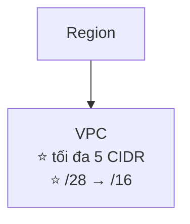

> ⭐⭐⭐ **Bốn con số PHẢI THUỘC: 5 VPC/region · 5 CIDR/VPC · /28 nhỏ nhất · /16 lớn nhất.**
>
> ⭐⭐⭐ **Và nhớ quy tắc KHÔNG OVERLAP** — đây là lý do VPC Peering yêu cầu CIDR không chồng lấn (bài 331).

---

## 317. VPC Hands On

> 🖐️ Bài Hands On — **không có slide**. Bài ngắn (2 phút).

### Tạo VPC

1. Console → **VPC** → **Your VPCs** → **Create VPC**
2. ⭐⭐⭐ **Resources to create**:

| Lựa chọn | Ghi chú |
|---|---|
| ⭐⭐⭐ **VPC only** | ⭐ **Chọn cái này để học từng bước** (Stéphane dùng cách này) |
| ⭐⭐ **VPC and more** | AWS tự tạo luôn subnet, IGW, route table, NAT Gateway |

3. **Name tag**: `Demo VPC`
4. ⭐⭐⭐ **IPv4 CIDR block**: **IPv4 CIDR manual input** → `10.0.0.0/16`
5. **IPv6 CIDR block**: **No IPv6 CIDR block** (sẽ học ở bài 343)
6. ⭐⭐ **Tenancy**: **Default** (hoặc **Dedicated** — phần cứng riêng, rất đắt)
7. **Create VPC**

### Quan sát sau khi tạo ⭐⭐⭐

AWS **tự động tạo kèm 3 thứ**:

| Thành phần | Trạng thái |
|---|---|
| ⭐⭐⭐ **Main Route Table** | Chỉ có **1 route `local`** (`10.0.0.0/16 → local`) — ⚠️ **chưa có đường ra Internet** |
| ⭐⭐⭐ **Default NACL** | **Cho phép TẤT CẢ inbound và outbound** |
| ⭐⭐⭐ **Default Security Group** | **Chặn inbound, cho phép outbound** |

- ⚠️⭐⭐⭐ **KHÔNG có Internet Gateway, KHÔNG có Subnet** — phải tự tạo

```bash
# CLI tương đương
aws ec2 create-vpc --cidr-block 10.0.0.0/16 \
  --tag-specifications 'ResourceType=vpc,Tags=[{Key=Name,Value=Demo VPC}]'

aws ec2 describe-vpcs
```

> 💡 **CHI PHÍ: Tạo VPC, subnet, route table, IGW, NACL, Security Group đều MIỄN PHÍ.** Chỉ **NAT Gateway, VPC Endpoint (Interface), VPN, Direct Connect, Transit Gateway** mới tốn tiền.

---

## 318. Subnet Overview

### ⭐⭐⭐ VPC – Subnet (IPv4) — QUY TẮC 5 IP BỊ GIỮ LẠI

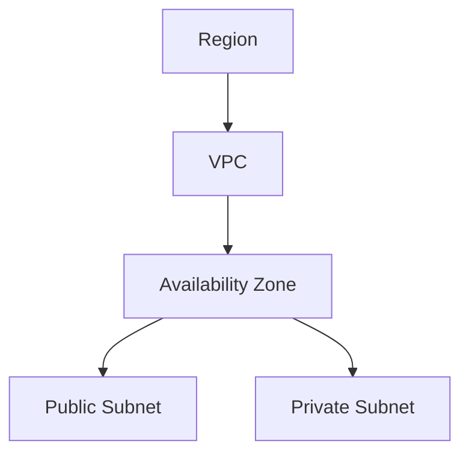

- ⚠️⭐⭐⭐ **AWS GIỮ LẠI 5 ĐỊA CHỈ IP (4 địa chỉ ĐẦU & 1 địa chỉ CUỐI) trong MỖI subnet**
- ⭐⭐⭐ **5 địa chỉ này KHÔNG DÙNG ĐƯỢC và KHÔNG gán được cho EC2 instance**

**⭐⭐⭐ Ví dụ với CIDR `10.0.0.0/24`:**

| Địa chỉ | Mục đích |
|---|---|
| ⭐⭐⭐ **`10.0.0.0`** | **Network Address** |
| ⭐⭐⭐ **`10.0.0.1`** | **AWS giữ cho VPC ROUTER** |
| ⭐⭐⭐ **`10.0.0.2`** | **AWS giữ để ánh xạ tới Amazon-provided DNS** |
| ⭐⭐⭐ **`10.0.0.3`** | **AWS giữ cho tương lai** |
| ⭐⭐⭐ **`10.0.0.255`** | **Network Broadcast Address** — AWS **không hỗ trợ broadcast** trong VPC nên giữ luôn |

> ⭐⭐⭐ **EXAM TIP IN THẲNG TRÊN SLIDE:**
> **Nếu bạn cần 29 địa chỉ IP cho EC2 instances:**
> - ❌ **KHÔNG chọn được subnet `/27`** (32 IP, **32 − 5 = 27 < 29**)
> - ✅ **PHẢI chọn subnet `/26`** (64 IP, **64 − 5 = 59 > 29**)
>
> ⭐⭐⭐ **Đây là dạng câu hỏi ra thi CHẮC CHẮN.** Công thức: **số IP dùng được = 2^(32−mask) − 5**.

**⭐⭐ Bảng tra nhanh (bổ sung ngoài slide):**

| Subnet | Tổng IP | ⭐ IP dùng được |
|---|---|---|
| **/28** | 16 | **11** |
| **/27** | 32 | **27** |
| **/26** | 64 | **59** |
| **/25** | 128 | **123** |
| **/24** | 256 | **251** |

---

## 319. Subnet Hands On

> 🖐️ Bài Hands On — **không có slide**.

### Tạo Subnets

1. **VPC** → **Subnets** → **Create subnet**
2. **VPC ID**: chọn `Demo VPC`
3. ⭐⭐⭐ **Subnet 1**:
   - **Subnet name**: `Public Subnet AZ-A`
   - ⭐⭐⭐ **Availability Zone**: `us-east-1a` — ⚠️ **subnet LUÔN gắn với MỘT AZ**
   - **IPv4 subnet CIDR block**: `10.0.0.0/24`
4. **Add new subnet** → **Subnet 2**:
   - **Subnet name**: `Private Subnet AZ-A`
   - **Availability Zone**: `us-east-1a`
   - **IPv4 CIDR**: `10.0.1.0/24`
5. Tạo thêm cho AZ-B: `10.0.2.0/24` (public) và `10.0.3.0/24` (private)
6. **Create subnet**

> ⭐⭐⭐ **Quan sát cột "Available IPv4 addresses":** subnet `/24` có **256 IP** nhưng Console hiển thị **251** — đúng bằng **256 − 5**, chứng minh quy tắc bài 318.

### ⭐⭐⭐ Bật Auto-assign Public IPv4

1. Chọn `Public Subnet AZ-A` → **Actions** → ⭐ **Edit subnet settings**
2. Tích ⭐⭐⭐ **Enable auto-assign public IPv4 address** → **Save**

> ⭐⭐⭐ **Đây là điểm phân biệt "public subnet" ở tầng tiện lợi** — nhưng ⚠️ **subnet chỉ THỰC SỰ public khi route table của nó có đường ra Internet Gateway** (bài 320).

```bash
aws ec2 create-subnet --vpc-id vpc-xxx --cidr-block 10.0.0.0/24 \
  --availability-zone us-east-1a

aws ec2 modify-subnet-attribute --subnet-id subnet-xxx --map-public-ip-on-launch
```

---

## 320. Internet Gateways & Route Tables

### ⭐⭐⭐ Internet Gateway (IGW)

- ⭐⭐⭐ **Cho phép tài nguyên (ví dụ EC2) trong VPC KẾT NỐI RA INTERNET**
- ⭐⭐ **SCALE THEO CHIỀU NGANG, có tính sẵn sàng cao và dự phòng**
- ⭐⭐⭐ **PHẢI được tạo RIÊNG, tách khỏi VPC**
- ⚠️⭐⭐⭐ **MỘT VPC chỉ gắn được với MỘT IGW và ngược lại (quan hệ 1–1)**
- ⚠️⭐⭐⭐ **IGW TỰ NÓ KHÔNG CHO PHÉP truy cập Internet… PHẢI SỬA ROUTE TABLES nữa!**

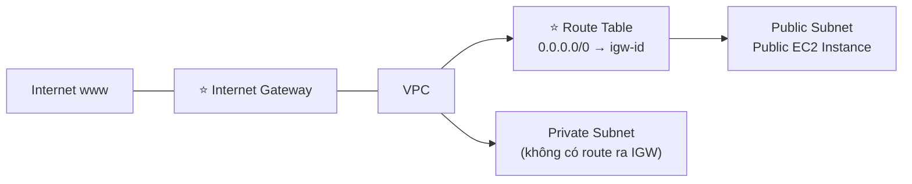

> ⭐⭐⭐ **HAI DÒNG CUỐI LÀ CÂU HỎI THI KINH ĐIỂN:**
> *"Đã tạo và gắn IGW nhưng EC2 vẫn không ra được Internet, vì sao?"* → ⭐ **Chưa thêm route `0.0.0.0/0 → igw-id` vào Route Table của subnet**.
>
> ⭐⭐⭐ **Định nghĩa chuẩn:**
> - **PUBLIC subnet = route table CÓ đường tới IGW**
> - **PRIVATE subnet = route table KHÔNG có đường tới IGW**

---

## 321. Internet Gateways & Route Tables Hands On

> 🖐️ Bài Hands On — **không có slide**.

### Bước 1 — Tạo và gắn Internet Gateway

1. **VPC** → **Internet gateways** → **Create internet gateway**
2. **Name tag**: `Demo IGW` → **Create**
3. ⭐⭐⭐ Chọn IGW → **Actions** → **Attach to VPC** → chọn `Demo VPC`
   - ⚠️ Trạng thái chuyển từ **Detached** sang **Attached**

### Bước 2 — Tạo Route Table cho Public Subnet ⭐⭐⭐

1. **Route tables** → **Create route table**
2. **Name**: `Public Route Table`, **VPC**: `Demo VPC` → **Create**
3. Chọn route table → tab ⭐⭐⭐ **Routes** → **Edit routes** → **Add route**:

| Destination | Target |
|---|---|
| **`10.0.0.0/16`** | **`local`** (⭐ có sẵn, không xóa được) |
| ⭐⭐⭐ **`0.0.0.0/0`** | ⭐⭐⭐ **Internet Gateway → `igw-xxx`** |

4. **Save changes**
5. Tab ⭐⭐⭐ **Subnet associations** → **Edit subnet associations** → tích **Public Subnet AZ-A** và **AZ-B** → **Save**

### Bước 3 — Kiểm chứng ⭐⭐⭐

1. Launch một EC2 instance vào **Public Subnet AZ-A**, bật **Auto-assign public IP**
2. Security Group: cho phép **SSH (22)** từ IP của bạn
3. SSH vào instance → chạy `ping google.com` → ✅ **thành công**
4. Launch instance thứ hai vào **Private Subnet** → ⚠️ **không SSH trực tiếp được** (không có public IP)

### ⭐⭐ Hiểu route `local`

```
Destination: 10.0.0.0/16  →  Target: local
```

> ⭐⭐⭐ **Route `local` là lý do MỌI subnet trong cùng VPC nói chuyện được với nhau MẶC ĐỊNH** — không cần cấu hình gì. Route này **không xóa và không sửa được**.

```bash
aws ec2 create-internet-gateway
aws ec2 attach-internet-gateway --vpc-id vpc-xxx --internet-gateway-id igw-xxx

aws ec2 create-route-table --vpc-id vpc-xxx
aws ec2 create-route --route-table-id rtb-xxx \
  --destination-cidr-block 0.0.0.0/0 --gateway-id igw-xxx
aws ec2 associate-route-table --route-table-id rtb-xxx --subnet-id subnet-xxx
```

---

## 322. Bastion Hosts

### ⭐⭐⭐ Bastion Hosts

- ⭐⭐⭐ **Dùng Bastion Host để SSH vào các EC2 instance PRIVATE của chúng ta**
- ⭐⭐⭐ **Bastion nằm trong PUBLIC SUBNET, từ đó kết nối tới tất cả private subnet**

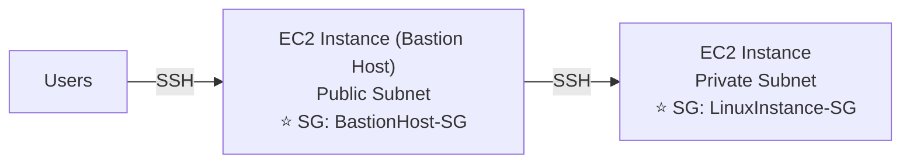

**⭐⭐⭐ HAI Security Group phải cấu hình đúng:**

| SG | Rule |
|---|---|
| ⭐⭐⭐ **Bastion Host SG** | **Cho phép INBOUND từ Internet trên PORT 22, từ CIDR BỊ GIỚI HẠN** — ví dụ **public CIDR của công ty bạn** |
| ⭐⭐⭐ **EC2 Instances SG** | **Cho phép SECURITY GROUP CỦA BASTION HOST, hoặc PRIVATE IP của Bastion host** |

> ⭐⭐⭐ **ĐÂY LÀ CÂU HỎI THI RẤT PHỔ BIẾN.** Điểm mấu chốt:
> - ❌ **KHÔNG mở port 22 cho `0.0.0.0/0`** trên Bastion — phải giới hạn CIDR
> - ⭐⭐⭐ **Private instance SG tham chiếu SG của Bastion**, KHÔNG phải `0.0.0.0/0`
>
> 💡 **Xu hướng hiện đại (bổ sung):** **AWS Systems Manager Session Manager** thay thế được Bastion Host — không cần public instance, không cần mở port 22, không cần SSH key.

---

## 323. Bastion Hosts Hands On

> 🖐️ Bài Hands On — **không có slide**.

### Các bước

1. **Launch EC2 instance** tên `Bastion Host` vào **Public Subnet**, bật public IP
   - **Security Group** `BastionHost-SG`: Inbound **SSH (22)** từ ⭐ **My IP** (không phải `0.0.0.0/0`)
2. **Launch EC2 instance** tên `Private Instance` vào **Private Subnet**, **KHÔNG** public IP
   - **Security Group** `LinuxInstance-SG`: Inbound **SSH (22)** ⭐ **Source = `BastionHost-SG`** (chọn Security Group, không phải CIDR)
3. SSH vào Bastion:

```bash
ssh -i my-key.pem ec2-user@<BASTION_PUBLIC_IP>
```

4. ⭐⭐⭐ **Từ Bastion SSH tiếp vào Private Instance** — nhưng key không có trên Bastion!

### ⭐⭐⭐ Hai cách giải quyết vấn đề SSH key

**❌ Cách xấu — copy key lên Bastion:**

```bash
scp -i my-key.pem my-key.pem ec2-user@<BASTION_IP>:~/
# ⚠️ RẤT NGUY HIỂM: private key nằm trên máy public
```

**✅ Cách tốt — SSH Agent Forwarding:**

```bash
# Trên máy của bạn
ssh-add my-key.pem
ssh -A ec2-user@<BASTION_PUBLIC_IP>     # ⭐ -A = agent forwarding

# Từ Bastion, SSH tiếp mà KHÔNG cần key trên đó
ssh ec2-user@<PRIVATE_INSTANCE_PRIVATE_IP>
```

> ⭐⭐⭐ **`ssh -A` là cách chuẩn** — private key **không bao giờ rời khỏi máy bạn**.

5. Kiểm chứng: từ Private Instance chạy `ping google.com` → ❌ **KHÔNG thành công** (chưa có NAT — đó là bài 324–327)

---

## 324. NAT Instances

### ⭐⭐⭐ NAT Instance (outdated, nhưng VẪN RA THI)

- ⭐⭐ **NAT = Network Address Translation**
- ⭐⭐⭐ **Cho phép EC2 instances trong PRIVATE SUBNET kết nối RA Internet**

**⭐⭐⭐ BỐN yêu cầu bắt buộc (RA THI):**

| # | Yêu cầu |
|---|---|
| 1 | ⭐⭐⭐ **PHẢI launch trong PUBLIC SUBNET** |
| 2 | ⚠️⭐⭐⭐ **PHẢI TẮT cài đặt EC2: "Source / Destination Check"** |
| 3 | ⭐⭐⭐ **PHẢI gắn ELASTIC IP** |
| 4 | ⭐⭐⭐ **Route Tables PHẢI được cấu hình để định tuyến traffic từ private subnet tới NAT Instance** |

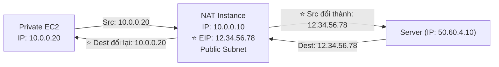

> ⭐⭐⭐ **Yêu cầu số 2 (Source/Destination Check) là câu hỏi thi đặc trưng.** Mặc định EC2 **từ chối** gói tin không phải gửi cho mình — NAT Instance thì **phải chuyển tiếp hộ**, nên phải tắt kiểm tra này.

---

### ⭐⭐ NAT Instance – Comments (nhược điểm)

| Nhược điểm |
|---|
| ⭐⭐ **Có AMI Amazon Linux cấu hình sẵn — nhưng ĐÃ KẾT THÚC HỖ TRỢ CHUẨN từ 31/12/2020** |
| ⚠️⭐⭐⭐ **KHÔNG có tính sẵn sàng cao / dự phòng sẵn** — bạn phải tự tạo **ASG multi-AZ + user-data script** |
| ⚠️⭐⭐⭐ **Băng thông Internet PHỤ THUỘC VÀO LOẠI EC2 INSTANCE** |
| ⚠️⭐⭐⭐ **BẠN phải tự quản lý Security Groups & rules** |

**Security Group rules cần thiết:**

| Chiều | Rule |
|---|---|
| ⭐⭐ **Inbound** | **Cho phép HTTP/HTTPS từ PRIVATE SUBNETS**<br/>**Cho phép SSH từ mạng nhà bạn** (qua Internet Gateway) |
| ⭐⭐ **Outbound** | **Cho phép HTTP/HTTPS ra Internet** |

> ⭐⭐⭐ **Vì sao vẫn phải học NAT Instance?** Vì đề thi hay hỏi **so sánh với NAT Gateway** (bài 326), và các từ khóa **"Source/Destination Check"**, **"Elastic IP"**, **"dùng làm Bastion Host được"** chỉ đúng với NAT Instance.

---

## 325. NAT Instances Hands On

> 🖐️ Bài Hands On — **không có slide**. ⚠️ Bài này **chủ yếu để hiểu khái niệm** — thực tế nên dùng NAT Gateway.

### Các bước

1. **Launch EC2 instance** vào **Public Subnet**:
   - ⭐⭐ **AMI**: tìm AMI cộng đồng `amzn-ami-vpc-nat` (⚠️ đã cũ), hoặc dùng Amazon Linux 2023 rồi **tự cấu hình NAT**
2. ⭐⭐⭐ **TẮT Source/Destination Check**:
   - Chọn instance → **Actions** → **Networking** → ⭐ **Change source/destination check** → tích **Stop** → **Save**
3. ⭐⭐⭐ **Gắn Elastic IP**:
   - **Elastic IPs** → **Allocate Elastic IP address** → **Associate** với NAT instance
4. ⭐⭐⭐ **Sửa Route Table của Private Subnet**:

| Destination | Target |
|---|---|
| `10.0.0.0/16` | `local` |
| ⭐⭐⭐ **`0.0.0.0/0`** | ⭐⭐⭐ **Instance → `i-xxx` (NAT instance)** |

5. **Security Group của NAT instance**: Inbound **HTTP/HTTPS từ `10.0.0.0/16`**, Outbound **All traffic**
6. Kiểm chứng: SSH vào Private Instance (qua Bastion) → `ping google.com` → ✅ **thành công**

### ⭐⭐ Nếu tự cấu hình NAT trên Amazon Linux 2023

```bash
# Bật IP forwarding
sudo sysctl -w net.ipv4.ip_forward=1
sudo sysctl -w net.ipv4.conf.eth0.send_redirects=0

# Cấu hình iptables NAT (masquerade)
sudo /sbin/iptables -t nat -A POSTROUTING -o eth0 -j MASQUERADE
sudo /sbin/iptables -F FORWARD
sudo service iptables save
```

> ⚠️ **Đây là lý do NAT Instance bị coi là lỗi thời:** bạn phải **tự làm mọi thứ**. NAT Gateway (bài 326) làm sẵn tất cả.
>
> ⚠️ **DỌN DẸP:** **Terminate NAT instance** và ⭐ **RELEASE Elastic IP** (EIP không gắn vào gì vẫn **tính phí ~$3.6/tháng**).

---

## 326. NAT Gateways

### ⭐⭐⭐ NAT Gateway — BẢNG ĐẶC ĐIỂM (RA THI)

| Đặc điểm |
|---|
| ⭐⭐⭐ **NAT do AWS QUẢN LÝ, băng thông CAO HƠN, tính sẵn sàng cao, KHÔNG cần quản trị** |
| ⭐⭐⭐ **Trả tiền THEO GIỜ sử dụng và THEO BĂNG THÔNG** |
| ⭐⭐⭐ **NATGW được tạo trong MỘT Availability Zone CỤ THỂ, dùng một ELASTIC IP** |
| ⚠️⭐⭐⭐ **KHÔNG dùng được bởi EC2 instance TRONG CÙNG SUBNET (chỉ từ subnet KHÁC)** |
| ⭐⭐⭐ **YÊU CẦU một IGW (Private Subnet ⇒ NATGW ⇒ IGW)** |
| ⭐⭐⭐ **5 Gbps băng thông, TỰ ĐỘNG SCALE lên tới 100 Gbps** |
| ⭐⭐⭐ **KHÔNG có Security Groups để quản lý / không cần** |

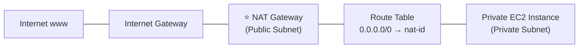

> ⭐⭐⭐ **Chuỗi bắt buộc phải nhớ: Private Subnet → NAT Gateway → Internet Gateway → Internet.**
>
> ⭐⭐⭐ **Ba con số: 5 Gbps → 100 Gbps tự scale.**

---

### ⭐⭐⭐ NAT Gateway with High Availability

- ⭐⭐⭐ **NAT Gateway CHỈ có khả năng chịu lỗi TRONG MỘT AZ DUY NHẤT (resilient within a single AZ)**
- ⭐⭐⭐ **PHẢI tạo NHIỀU NAT Gateway ở NHIỀU AZ để có fault-tolerance**
- ⭐⭐ **KHÔNG cần cross-AZ failover, vì nếu một AZ sập thì AZ đó cũng chẳng cần NAT nữa**

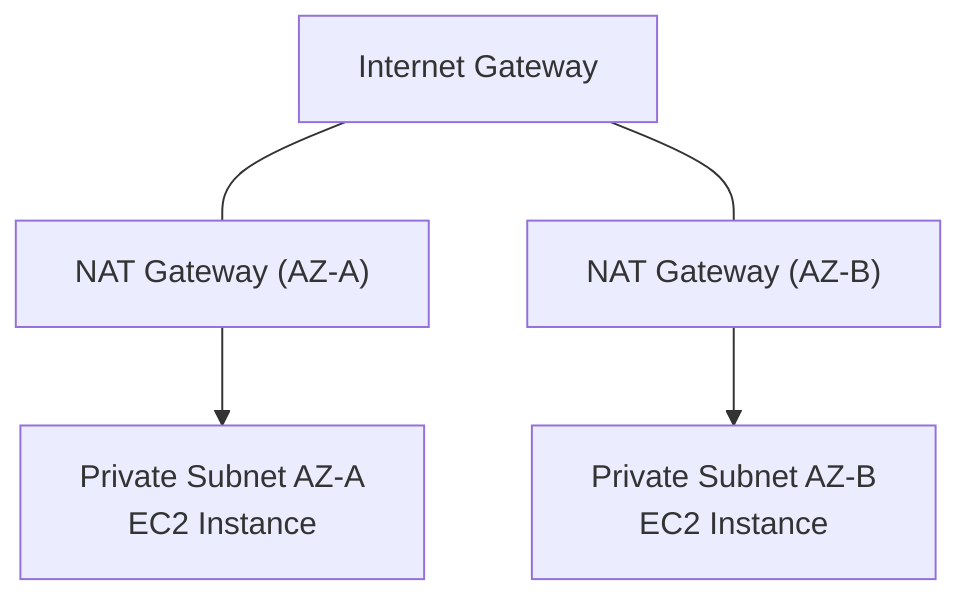

> ⭐⭐⭐ **Câu hỏi thi:** *"Kiến trúc NAT Gateway có tính sẵn sàng cao thì làm thế nào?"* → **Tạo MỘT NAT Gateway trong MỖI AZ**, và mỗi private subnet trỏ route về NAT Gateway **cùng AZ** của nó.

---

### ⭐⭐⭐ NAT Gateway vs. NAT Instance — BẢNG SO SÁNH ĐINH

| | ⭐⭐⭐ **NAT Gateway** | ⭐⭐⭐ **NAT Instance** |
|---|---|---|
| ⭐⭐⭐ **Availability** | **Sẵn sàng cao TRONG AZ** (tạo thêm ở AZ khác) | ⚠️ **Dùng SCRIPT để quản lý failover giữa các instance** |
| ⭐⭐⭐ **Bandwidth** | **Lên tới 100 Gbps** | ⚠️ **PHỤ THUỘC loại EC2 instance** |
| ⭐⭐⭐ **Maintenance** | ✅ **AWS quản lý** | ⚠️ **BẠN quản lý** (phần mềm, vá OS…) |
| ⭐⭐⭐ **Cost** | **Theo GIỜ + lượng dữ liệu truyền** | **Theo giờ, loại & size EC2, + phí mạng** |
| ⭐⭐ **Public IPv4** | ✅ | ✅ |
| ⭐⭐ **Private IPv4** | ✅ | ✅ |
| ⚠️⭐⭐⭐ **Security Groups** | ❌ **KHÔNG có** | ✅ **CÓ** |
| ⚠️⭐⭐⭐ **Dùng làm Bastion Host?** | ❌ **KHÔNG** | ✅ ⭐ **CÓ** |

> ⭐⭐⭐ **HAI DÒNG CUỐI LÀ ĐIỂM RA THI NHIỀU NHẤT:**
> - **NAT Gateway KHÔNG có Security Group** (vì nó là dịch vụ quản lý)
> - ⭐ **CHỈ NAT Instance dùng được làm Bastion Host** (vì nó là một EC2 thật)

---

## 327. NAT Gateways Hands On

> 🖐️ Bài Hands On — **không có slide**. ⚠️ **BÀI NÀY TỐN TIỀN** — đọc cảnh báo cuối bài.

### Các bước

1. **VPC** → **NAT gateways** → **Create NAT gateway**
2. **Name**: `Demo NAT GW`
3. ⚠️⭐⭐⭐ **Subnet**: chọn **PUBLIC SUBNET** (không phải private!)
4. ⭐⭐ **Connectivity type**:

| Loại | Ghi chú |
|---|---|
| ⭐⭐⭐ **Public** | Cần **Elastic IP** — ra được Internet |
| ⭐⭐ **Private** | Chỉ để nối sang VPC khác / on-premises, **không ra Internet** |

5. ⭐⭐⭐ **Elastic IP allocation ID** → **Allocate Elastic IP**
6. **Create NAT gateway** → chờ trạng thái **Available** (~1–2 phút)

### Sửa Route Table của Private Subnet ⭐⭐⭐

1. **Route tables** → tạo `Private Route Table` (nếu chưa có)
2. **Edit routes** → **Add route**:

| Destination | Target |
|---|---|
| `10.0.0.0/16` | `local` |
| ⭐⭐⭐ **`0.0.0.0/0`** | ⭐⭐⭐ **NAT Gateway → `nat-xxx`** |

3. **Subnet associations** → gắn với **Private Subnet**

### Kiểm chứng

```bash
# SSH vào Bastion rồi sang Private Instance
ssh -A ec2-user@<BASTION_IP>
ssh ec2-user@<PRIVATE_IP>

# Từ Private Instance
ping -c 3 google.com          # ✅ thành công
curl https://aws.amazon.com   # ✅ thành công
curl ifconfig.me              # ⭐ trả về Elastic IP của NAT Gateway
```

> ⭐⭐⭐ **Lệnh `curl ifconfig.me` rất hay để hiểu bản chất NAT:** instance private **không có public IP**, nhưng thế giới bên ngoài **nhìn thấy IP của NAT Gateway**.

### ⚠️⚠️ DỌN DẸP — BẮT BUỘC

| # | Việc |
|---|---|
| 1 | ⭐⭐⭐ **Delete NAT Gateway** |
| 2 | ⭐⭐⭐ **RELEASE Elastic IP** (rất dễ quên!) |
| 3 | Xóa route `0.0.0.0/0 → nat-xxx` |

> ⚠️⚠️⭐⭐⭐ **CẢNH BÁO CHI PHÍ:** **NAT Gateway là một trong những dịch vụ tốn tiền âm thầm nhất của AWS.** **$0.045/giờ ≈ $32/THÁNG** cộng **$0.045/GB dữ liệu xử lý** — **tính tiền kể cả khi KHÔNG có traffic nào**. Elastic IP không gắn vào gì cũng tính **~$3.6/tháng**.
>
> 💡 Đây chính là lý do ở các chương trước (18 — EKS, 22 — Flink) tôi luôn nhắc kiểm tra NAT Gateway khi dọn dẹp.

---

## 328. Regional NAT Gateway

### ⭐⭐ Regional NAT Gateway (RNAT) — tính năng mới

- ⭐⭐⭐ **NAT Gateway có tính sẵn sàng cao, gắn với CẢ VPC (không phải một AZ)**
- ⭐⭐ **RNAT có ROUTE TABLES RIÊNG của nó**
- ⭐⭐⭐ **LOẠI BỎ nhu cầu triển khai THEO TỪNG AZ (dùng chung cho mọi AZ)**
- ⭐⭐⭐ **BẠN KHÔNG CẦN tạo Public Subnets trong VPC để chứa RNAT**
- ⭐⭐⭐ **TỰ ĐỘNG phát hiện tài nguyên ở AZ mới và MỞ RỘNG sang AZ đó**

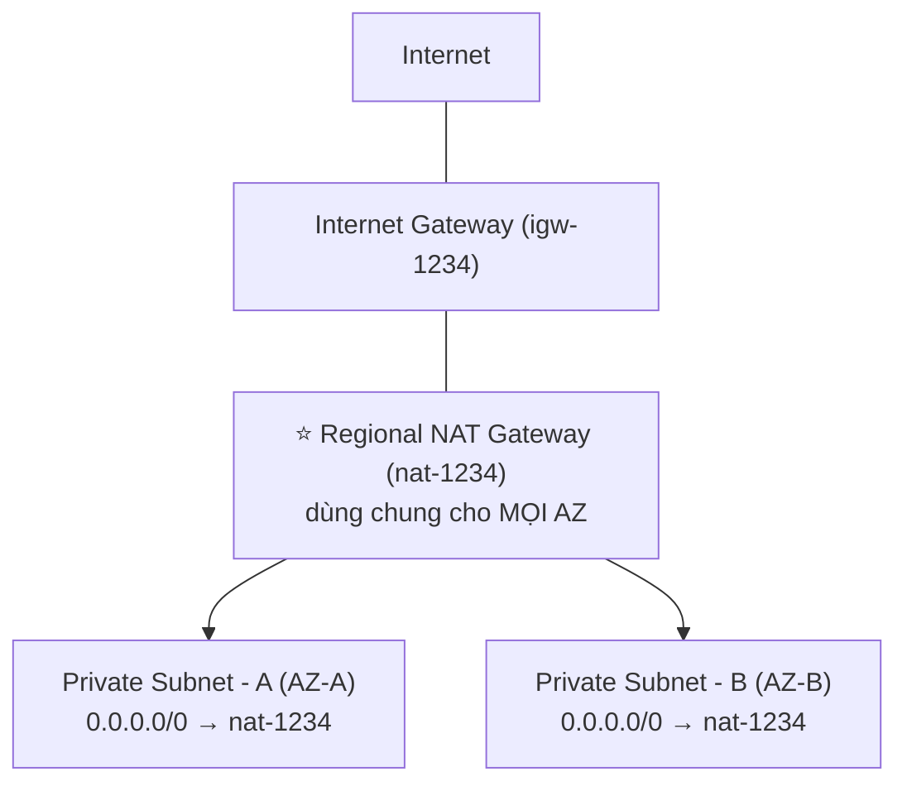

> ⭐⭐⭐ **So sánh với NAT Gateway thường (bài 326):**
>
> | | **NAT Gateway thường** | ⭐ **Regional NAT Gateway** |
> |---|---|---|
> | **Phạm vi** | **MỘT AZ** | ⭐ **CẢ VPC (mọi AZ)** |
> | **Để HA cần** | ⚠️ **Tạo NHIỀU cái, mỗi AZ một cái** | ✅ **CHỈ MỘT cái** |
> | **Public Subnet** | ⚠️ **BẮT BUỘC phải có** | ✅ ⭐ **KHÔNG cần** |
> | **AZ mới** | Phải tạo thêm thủ công | ⭐ **Tự động mở rộng** |
>
> 💡 **Đây là tính năng rất mới** — nếu đề thi cũ thì vẫn hỏi theo NAT Gateway thường (phải tạo nhiều cái cho HA).

---

## 329. NACL & Security Groups

### ⭐⭐⭐ Luồng traffic qua NACL và Security Group

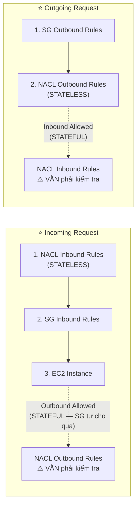

> ⭐⭐⭐ **Thứ tự QUAN TRỌNG: NACL trước (mức subnet), rồi mới tới Security Group (mức instance).**

---

### ⭐⭐⭐ Network Access Control List (NACL)

- ⭐⭐⭐ **NACL giống một FIREWALL kiểm soát traffic TỪ và TỚI SUBNETS**
- ⭐⭐⭐ **MỘT NACL cho MỘT SUBNET; subnet mới được gán Default NACL**

**⭐⭐⭐ Quy tắc của NACL Rules:**

| Quy tắc |
|---|
| ⭐⭐⭐ **Rules có SỐ THỨ TỰ (1–32766), SỐ CÀNG NHỎ thì ĐỘ ƯU TIÊN CÀNG CAO** |
| ⭐⭐⭐ **RULE KHỚP ĐẦU TIÊN sẽ quyết định** |
| ⭐⭐⭐ **Ví dụ: `#100 ALLOW 10.0.0.10/32` và `#200 DENY 10.0.0.10/32` → IP được ALLOW** vì 100 ưu tiên hơn 200 |
| ⭐⭐⭐ **Rule CUỐI CÙNG là dấu sao `*`, TỪ CHỐI request nếu không khớp rule nào** |
| ⭐⭐ **AWS khuyến nghị thêm rule theo bước 100** |

- ⚠️⭐⭐⭐ **NACL MỚI TẠO sẽ TỪ CHỐI MỌI THỨ (deny everything)**
- ⭐⭐⭐ **NACL là cách TUYỆT VỜI để CHẶN MỘT ĐỊA CHỈ IP CỤ THỂ ở mức subnet**

> ⭐⭐⭐ **HAI CÂU HỎI THI KINH ĐIỂN:**
> 1. *"Chặn một IP độc hại"* → ⭐ **NACL** (Security Group **KHÔNG có rule DENY**)
> 2. *"NACL mới tạo có cho traffic qua không?"* → ❌ **KHÔNG — deny mọi thứ**

---

### ⭐⭐ Default NACL

- ⭐⭐⭐ **CHẤP NHẬN mọi thứ inbound/outbound với các subnet nó được gắn**
- ⚠️⭐⭐⭐ **KHÔNG sửa Default NACL — thay vào đó hãy TẠO CUSTOM NACL**

**Default NACL cho VPC hỗ trợ IPv4:**

**Inbound Rules:**

| Rule # | Type | Protocol | Port Range | Source | Allow/Deny |
|---|---|---|---|---|---|
| **100** | All IPv4 Traffic | All | All | `0.0.0.0/0` | ⭐ **ALLOW** |
| **`*`** | All IPv4 Traffic | All | All | `0.0.0.0/0` | ⭐ **DENY** |

**Outbound Rules:**

| Rule # | Type | Protocol | Port Range | Destination | Allow/Deny |
|---|---|---|---|---|---|
| **100** | All IPv4 Traffic | All | All | `0.0.0.0/0` | ⭐ **ALLOW** |
| **`*`** | All IPv4 Traffic | All | All | `0.0.0.0/0` | ⭐ **DENY** |

---

### ⭐⭐⭐ Ephemeral Ports — KHÁI NIỆM PHẢI HIỂU

- ⭐⭐⭐ **Để hai endpoint thiết lập kết nối, chúng PHẢI dùng PORT**
- ⭐⭐⭐ **Client kết nối tới một port XÁC ĐỊNH, và MONG ĐỢI phản hồi trên một EPHEMERAL PORT**
- ⭐⭐⭐ **Hệ điều hành khác nhau dùng dải port khác nhau:**

| Hệ điều hành | Dải Ephemeral Port |
|---|---|
| ⭐⭐⭐ **IANA & MS Windows 10** | **49152 – 65535** |
| ⭐⭐⭐ **Nhiều Linux Kernel** | **32768 – 60999** |

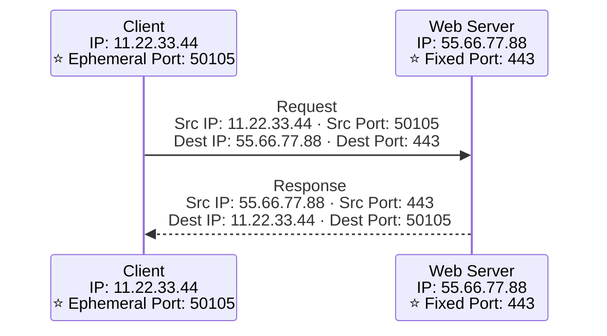

> ⭐⭐⭐ **VÌ SAO ĐIỀU NÀY QUAN TRỌNG?** Vì **NACL là STATELESS** — nó **không nhớ** rằng bạn vừa gửi request đi. Khi response quay về trên **ephemeral port**, NACL sẽ **kiểm tra lại từ đầu** → **PHẢI có rule cho phép dải ephemeral port**.
>
> ⭐⭐⭐ **Security Group là STATEFUL** nên **không gặp vấn đề này**.

---

### ⭐⭐⭐ NACL with Ephemeral Ports — Ví dụ Web Tier ↔ DB Tier

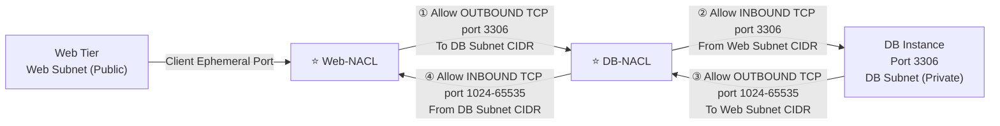

**⭐⭐⭐ BỐN rule cần thiết cho MỘT kết nối:**

| # | NACL | Chiều | Port | Nguồn/Đích |
|---|---|---|---|---|
| 1 | **Web-NACL** | **Outbound** | **3306** | **To DB Subnet CIDR** |
| 2 | **DB-NACL** | **Inbound** | **3306** | **From Web Subnet CIDR** |
| 3 | **DB-NACL** | **Outbound** | ⭐ **1024–65535** | **To Web Subnet CIDR** |
| 4 | **Web-NACL** | **Inbound** | ⭐ **1024–65535** | **From DB Subnet CIDR** |

> ⭐⭐⭐ **ĐÂY LÀ ĐIỂM RA THI ĐẶC TRƯNG NHẤT CỦA NACL.** Đề hay hỏi: *"Web server không kết nối được DB dù đã mở port 3306 hai chiều"* → **thiếu rule cho EPHEMERAL PORTS (1024–65535)**.
>
> ⭐⭐ **Với kiến trúc nhiều subnet (multi-AZ): phải tạo NACL rules cho CIDR của TỪNG subnet đích.**

---

### ⭐⭐⭐ Security Group vs. NACLs — BẢNG QUAN TRỌNG NHẤT CHƯƠNG

| ⭐⭐⭐ **Security Group** | ⭐⭐⭐ **NACL** |
|---|---|
| ⭐⭐⭐ **Hoạt động ở MỨC INSTANCE** | ⭐⭐⭐ **Hoạt động ở MỨC SUBNET** |
| ⭐⭐⭐ **CHỈ hỗ trợ rule ALLOW** | ⭐⭐⭐ **Hỗ trợ CẢ rule ALLOW và DENY** |
| ⭐⭐⭐ **STATEFUL: traffic trả về được TỰ ĐỘNG cho phép, bất kể rule nào** | ⭐⭐⭐ **STATELESS: traffic trả về PHẢI được cho phép TƯỜNG MINH bằng rule** (nhớ ephemeral ports) |
| ⭐⭐⭐ **TẤT CẢ rules được đánh giá TRƯỚC KHI quyết định** | ⭐⭐⭐ **Rules được đánh giá THEO THỨ TỰ (thấp → cao), KHỚP ĐẦU TIÊN THẮNG** |
| ⭐⭐⭐ **Áp dụng cho EC2 instance KHI ĐƯỢC AI ĐÓ CHỈ ĐỊNH** | ⭐⭐⭐ **TỰ ĐỘNG áp dụng cho MỌI EC2 instance trong subnet nó gắn vào** |

> ⭐⭐⭐ **NẾU CHỈ HỌC THUỘC MỘT BẢNG TRONG CẢ CHƯƠNG, HÃY CHỌN BẢNG NÀY.**
>
> 💡 **Mẹo nhớ 5 dòng:** **Instance vs Subnet · Chỉ Allow vs Allow+Deny · Stateful vs Stateless · Tất cả rule vs Khớp đầu tiên · Gán thủ công vs Tự động.**

---

## 330. NACL & Security Groups Hands On

> 🖐️ Bài Hands On — **không có slide**.

### Bước 1 — Quan sát Default NACL

1. **VPC** → **Network ACLs** → chọn Default NACL của `Demo VPC`
2. Tab **Inbound rules** → thấy rule **100 ALLOW All** và **`*` DENY All**
3. Tab **Subnet associations** → thấy **tất cả subnet** đang gắn vào nó

### Bước 2 — Tạo Custom NACL và chặn HTTP ⭐⭐⭐

1. **Create network ACL** → Name `Demo NACL`, VPC `Demo VPC` → **Create**
2. ⚠️ Quan sát: NACL mới **chỉ có rule `*` DENY** — **chặn mọi thứ**
3. **Edit inbound rules** → **Add new rule**:

| Rule # | Type | Source | Allow/Deny |
|---|---|---|---|
| **100** | **All traffic** | `0.0.0.0/0` | **ALLOW** |

4. Làm tương tự cho **Outbound rules**
5. **Subnet associations** → gắn vào **Public Subnet**

### Bước 3 — Thử nghiệm chặn HTTP ⭐⭐⭐

1. Trước tiên đảm bảo EC2 public có web server chạy (port 80) và truy cập được
2. **Edit inbound rules** → thêm rule **ƯU TIÊN CAO HƠN**:

| Rule # | Type | Source | Allow/Deny |
|---|---|---|---|
| ⭐ **90** | **HTTP (80)** | `0.0.0.0/0` | ⭐ **DENY** |
| 100 | All traffic | `0.0.0.0/0` | ALLOW |

3. Refresh trang web → ⭐ **KHÔNG truy cập được** (rule 90 khớp trước rule 100)
4. Đổi số rule DENY từ **90** thành **110** → refresh → ⭐ **truy cập được lại** (rule 100 khớp trước)

> ⭐⭐⭐ **Thí nghiệm này chứng minh trực tiếp quy tắc "số nhỏ ưu tiên cao, khớp đầu tiên thắng"** — đây chính là điều slide bài 329 nói.

### Bước 4 — Thử tính STATELESS ⭐⭐⭐

1. **Xóa hết Outbound rules**, chỉ để `*` DENY
2. Thử truy cập web → ❌ **không được**, dù Inbound vẫn ALLOW
3. Thêm Outbound rule **100 ALLOW port 1024–65535** (⭐ ephemeral ports) → ✅ **được lại**

> ⭐⭐⭐ **Đây là minh họa sống động nhất cho khái niệm STATELESS và EPHEMERAL PORTS.** Security Group thì không cần làm gì cả.

### Bước 5 — So sánh với Security Group

1. Vào **Security Groups** → thử tìm nút **Deny** → ⭐ **KHÔNG CÓ** (chỉ có Allow)
2. Xóa hết Outbound rules của SG → web vẫn truy cập được → ⭐ **chứng minh STATEFUL**

### Dọn dẹp

- Gỡ Custom NACL khỏi subnet (subnet tự quay về Default NACL) → **Delete network ACL**

---

## 331. VPC Peering

### ⭐⭐⭐ VPC Peering

- ⭐⭐⭐ **Kết nối RIÊNG TƯ hai VPC dùng MẠNG NỘI BỘ của AWS**
- ⭐⭐⭐ **Làm chúng hoạt động NHƯ THỂ đang ở CÙNG một mạng**
- ⚠️⭐⭐⭐ **KHÔNG được có CIDR CHỒNG LẤN (overlapping)**
- ⚠️⭐⭐⭐ **VPC Peering connection KHÔNG BẮC CẦU (NOT transitive)** — phải thiết lập RIÊNG cho MỖI CẶP VPC cần giao tiếp
- ⭐⭐⭐ **PHẢI CẬP NHẬT route tables ở TỪNG subnet của MỖI VPC** để EC2 instance giao tiếp được

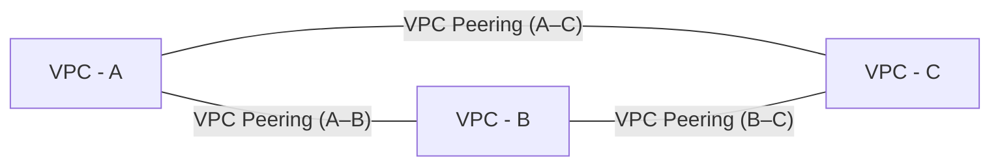

> ⚠️⭐⭐⭐ **"NOT TRANSITIVE" LÀ ĐIỂM RA THI QUAN TRỌNG NHẤT CỦA BÀI NÀY.**
>
> Nhìn sơ đồ trên: **A peer với B, B peer với C** — nhưng **A KHÔNG tự động nói chuyện được với C**. Phải tạo **RIÊNG một VPC Peering connection A–C**.
>
> ⭐⭐⭐ **Câu hỏi thi:** *"Có 3 VPC cần giao tiếp với nhau qua lại, cần bao nhiêu VPC Peering connection?"* → **3 connections** (mỗi cặp một cái). Với N VPC cần giao tiếp đầy đủ: **N×(N−1)/2 connections** — đây cũng là lý do tồn tại **Transit Gateway** (bài 341).

---

### ⭐⭐ VPC Peering – Good to know

- ⭐⭐⭐ **Tạo được VPC Peering connection giữa các VPC ở TÀI KHOẢN/REGION KHÁC NHAU**
- ⭐⭐⭐ **Có thể THAM CHIẾU một Security Group trong VPC được peer** (hoạt động **cross-account, CÙNG region**)

> ⭐⭐ **Điểm hay bị hỏi:** tham chiếu Security Group qua peering **chỉ hoạt động khi CÙNG REGION** — khác region thì **không tham chiếu SG được**, phải dùng CIDR.

---

## 332. VPC Peering Hands On

> 🖐️ Bài Hands On — **không có slide**.

### Bước 1 — Tạo VPC thứ hai

1. Tạo `Demo VPC 2` với CIDR ⭐⭐⭐ **`10.1.0.0/16`** (⚠️ **PHẢI khác** `10.0.0.0/16` của VPC đầu — không overlap)
2. Tạo một subnet và một EC2 instance test trong đó

### Bước 2 — Tạo Peering Connection

1. **VPC** → **Peering connections** → **Create peering connection**
2. **Name**: `Demo-VPC-to-Demo-VPC-2`
3. **VPC (Requester)**: `Demo VPC` (`10.0.0.0/16`)
4. ⭐⭐ **VPC (Accepter)**: chọn `Demo VPC 2` — có thể **My account** (cùng account) hoặc **Another account**
5. **Create peering connection**

### Bước 3 — Chấp nhận Peering ⭐⭐⭐

1. Trạng thái ban đầu: **Pending Acceptance**
2. Chọn connection → **Actions** → ⭐⭐⭐ **Accept request**
3. Trạng thái chuyển thành **Active**

> ⭐⭐⭐ **Đây là bước dễ quên nhất:** tạo peering connection **KHÔNG tự động kích hoạt** — bên kia (hoặc chính bạn nếu cùng account) phải **Accept**.

### Bước 4 — Sửa Route Tables ở CẢ HAI VPC ⭐⭐⭐

**Route table của `Demo VPC` (subnet):**

| Destination | Target |
|---|---|
| `10.0.0.0/16` | `local` |
| ⭐⭐⭐ **`10.1.0.0/16`** | ⭐⭐⭐ **Peering Connection → `pcx-xxx`** |

**Route table của `Demo VPC 2` (subnet):**

| Destination | Target |
|---|---|
| `10.1.0.0/16` | `local` |
| ⭐⭐⭐ **`10.0.0.0/16`** | ⭐⭐⭐ **Peering Connection → `pcx-xxx`** |

> ⭐⭐⭐ **Quên bước này là lỗi phổ biến nhất:** Peering **Active** không có nghĩa là **traffic tự đi được** — giống hệt bài học của IGW ở bài 320, **route table luôn phải sửa thủ công**.

### Bước 5 — Kiểm chứng

1. Sửa Security Group của EC2 ở `Demo VPC 2` → Inbound cho phép ICMP/SSH từ `10.0.0.0/16`
2. SSH vào EC2 ở `Demo VPC` → `ping <private-IP-của-EC2-ở-VPC-2>` → ✅ **thành công**

```bash
aws ec2 create-vpc-peering-connection --vpc-id vpc-A --peer-vpc-id vpc-B
aws ec2 accept-vpc-peering-connection --vpc-peering-connection-id pcx-xxx
aws ec2 create-route --route-table-id rtb-A \
  --destination-cidr-block 10.1.0.0/16 --vpc-peering-connection-id pcx-xxx
```

> 💡 **CHI PHÍ:** VPC Peering **miễn phí để TẠO**, chỉ tính **data transfer** khi có traffic thật chạy qua (rẻ, theo GB). Nhớ **Delete peering connection** sau khi học.

---

## 333. VPC Endpoints

### ⭐⭐⭐ VPC Endpoints (AWS PrivateLink)

- ⭐⭐⭐ **MỌI dịch vụ AWS đều được PUBLIC EXPOSE (có public URL)**
- ⭐⭐⭐ **VPC Endpoints (được cung cấp bởi AWS PRIVATELINK) cho phép kết nối tới dịch vụ AWS bằng MẠNG RIÊNG thay vì Internet công cộng**
- ⭐⭐ **Dự phòng và SCALE THEO CHIỀU NGANG**
- ⭐⭐⭐ **LOẠI BỎ nhu cầu dùng IGW, NATGW… để truy cập dịch vụ AWS**

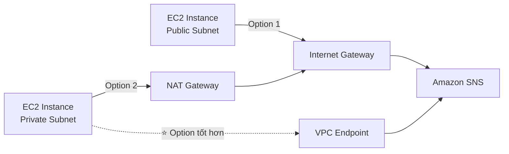

**Khi có sự cố, kiểm tra:** ⭐⭐

- **DNS Setting Resolution trong VPC của bạn**
- **Route Tables**

> ⭐⭐⭐ **Từ khóa nhận diện:** *"truy cập dịch vụ AWS mà KHÔNG đi qua Internet công cộng"* → **VPC Endpoint**.

---

### ⭐⭐⭐ Types of Endpoints — BẢNG ĐINH CỦA BÀI NÀY

| | ⭐⭐⭐ **Interface Endpoints** | ⭐⭐⭐ **Gateway Endpoints** |
|---|---|---|
| **Công nghệ** | ⭐⭐⭐ **Được cung cấp bởi PrivateLink** | — |
| ⭐⭐⭐ **Cơ chế** | **Provision một ENI (private IP address) làm điểm vào** — **PHẢI gắn Security Group** | ⭐⭐⭐ **Provision một GATEWAY, dùng làm TARGET trong route table** (**KHÔNG dùng security groups**) |
| ⭐⭐⭐ **Hỗ trợ dịch vụ** | **HẦU HẾT dịch vụ AWS** | ⚠️⭐⭐⭐ **CHỈ S3 và DynamoDB** |
| ⭐⭐⭐ **Chi phí** | ⚠️⭐⭐⭐ **$/giờ + $/GB dữ liệu xử lý** | ✅⭐⭐⭐ **MIỄN PHÍ** |

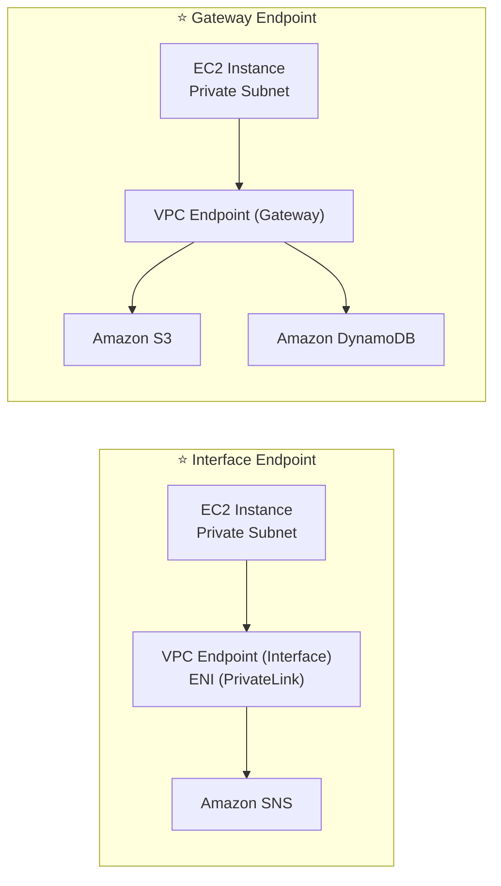

---

### ⭐⭐⭐ Gateway or Interface Endpoint for S3?

- ⭐⭐⭐ **GATEWAY endpoint HẦU NHƯ LUÔN được ưa chuộng TRONG ĐỀ THI**
- ⭐⭐⭐ **Chi phí: MIỄN PHÍ cho Gateway, CÓ PHÍ cho Interface endpoint**
- ⭐⭐⭐ **Interface Endpoint được ưa chuộng KHI CẦN truy cập TỪ:**
  - **On-premises (Site-to-Site VPN hoặc Direct Connect)**
  - **Một VPC KHÁC**
  - **Một REGION khác**

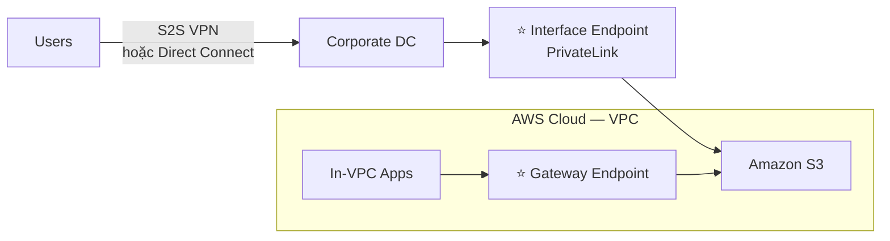

> ⭐⭐⭐ **QUY TẮC VÀNG ĐỂ NHỚ:**
> - **Trong VPC, truy cập S3/DynamoDB** → ⭐⭐⭐ **LUÔN CHỌN GATEWAY** (miễn phí)
> - **Từ on-premises HOẶC VPC/region khác** → **BẮT BUỘC phải Interface** (Gateway chỉ hoạt động trong chính VPC của nó)

---

### ⭐⭐⭐ Lambda in VPC accessing DynamoDB — Ví dụ áp dụng

**❌ Option 1 (tốn kém, chậm):**

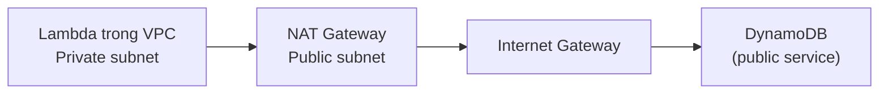

**✅ Option 2 — tốt hơn & MIỄN PHÍ:**

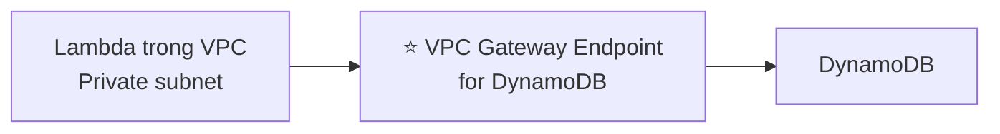

> ⭐⭐⭐ **Vì DynamoDB là DỊCH VỤ CÔNG KHAI**, Lambda trong VPC **mặc định không tới được** (nhắc lại từ chương 19: **Lambda trong VPC mất Internet**). Giải pháp: ⭐⭐⭐ **deploy VPC Gateway Endpoint cho DynamoDB + sửa Route Tables**, thay vì kéo cả NAT Gateway + IGW chỉ để gọi một API.
>
> ⭐⭐⭐ **Đây là bài tập kinh điển nối liền chương 19 và chương 27** — rất hay ra thi.

---

## 334. VPC Endpoints Hands On

> 🖐️ Bài Hands On — **không có slide**.

### Phần A — Tạo Gateway Endpoint cho S3

1. **VPC** → **Endpoints** → **Create endpoint**
2. **Name**: `S3-Gateway-Endpoint`
3. **Service category**: **AWS services**
4. **Services**: tìm `com.amazonaws.<region>.s3`, chọn dòng ⭐⭐⭐ **Type = Gateway**
5. **VPC**: `Demo VPC`
6. ⭐⭐⭐ **Route tables**: tích **Private Route Table** (endpoint sẽ TỰ THÊM route vào)
7. **Policy**: **Full access** (mặc định) hoặc custom policy giới hạn bucket
8. **Create endpoint**

### Kiểm chứng ⭐⭐⭐

1. Vào **Route Tables** của Private Subnet → thấy route **MỚI XUẤT HIỆN TỰ ĐỘNG**:

| Destination | Target |
|---|---|
| `pl-xxxxxxxx` (prefix list của S3) | `vpce-xxx` |

2. SSH vào Private EC2 instance → chạy:

```bash
aws s3 ls
aws s3 cp s3://my-bucket/file.txt .
curl ifconfig.me   # ⚠️ vẫn lỗi timeout vì KHÔNG có NAT (đúng — endpoint chỉ cho S3)
```

> ⭐⭐⭐ **Điểm quan trọng để hiểu:** VPC Endpoint **CHỈ mở đường riêng cho MỘT dịch vụ cụ thể**, KHÔNG cấp Internet access nói chung.

### Phần B — Tạo Interface Endpoint cho SSM (hoặc SNS)

1. **Create endpoint** → **Services**: tìm `com.amazonaws.<region>.ssm`, ⭐⭐⭐ **Type = Interface**
2. **VPC**: `Demo VPC`, **Subnets**: chọn AZ cần dùng
3. ⭐⭐⭐ **Security group**: PHẢI gắn một SG cho phép **HTTPS (443)** từ private subnet
4. **Enable DNS name**: ⭐ tích (để DNS công khai của dịch vụ tự động trỏ vào endpoint)
5. **Create endpoint**

> ⭐⭐⭐ **Khác biệt lớn với Gateway:** Interface Endpoint **KHÔNG tự sửa route table** — nó hoạt động qua **DNS resolution**, và **BẮT BUỘC có Security Group**.

### CLI

```bash
# Gateway endpoint cho S3
aws ec2 create-vpc-endpoint --vpc-id vpc-xxx \
  --service-name com.amazonaws.us-east-1.s3 \
  --route-table-ids rtb-xxx

# Interface endpoint cho SSM
aws ec2 create-vpc-endpoint --vpc-id vpc-xxx \
  --vpc-endpoint-type Interface \
  --service-name com.amazonaws.us-east-1.ssm \
  --subnet-ids subnet-xxx --security-group-ids sg-xxx
```

> 💡 **CHI PHÍ:** Gateway Endpoint **hoàn toàn miễn phí**, nhớ xóa sau khi học để gọn. Interface Endpoint **~$0.01/giờ/AZ ≈ $7/tháng** — nhớ xóa nếu không dùng.

---

## 335. VPC Flow Logs

### ⭐⭐⭐ VPC Flow Logs

- ⭐⭐⭐ **Ghi lại thông tin về traffic IP đi VÀO các interface của bạn — BA MỨC:**

| Mức |
|---|
| ⭐⭐⭐ **VPC Flow Logs** |
| ⭐⭐⭐ **Subnet Flow Logs** |
| ⭐⭐⭐ **Elastic Network Interface (ENI) Flow Logs** |

- ⭐⭐⭐ **Giúp GIÁM SÁT & GỠ LỖI vấn đề kết nối**
- ⭐⭐⭐ **Dữ liệu Flow log có thể đi tới: S3, CloudWatch Logs, và Kinesis Data Firehose**
- ⭐⭐⭐ **Cũng CHỤP được thông tin mạng từ các interface DO AWS QUẢN LÝ:** **ELB, RDS, ElastiCache, Redshift, WorkSpaces, NATGW, Transit Gateway…**

---

### ⭐⭐⭐ VPC Flow Logs Syntax — Các trường quan trọng

```
version  account-id  interface-id  srcaddr  dstaddr  srcport  dstport  protocol  packets  bytes  start  end  action  log-status
```

| Trường | Ý nghĩa |
|---|---|
| ⭐⭐⭐ **`srcaddr` & `dstaddr`** | **Giúp xác định IP GÂY VẤN ĐỀ** |
| ⭐⭐⭐ **`srcport` & `dstport`** | **Giúp xác định PORT gây vấn đề** |
| ⭐⭐⭐ **`action`** | **THÀNH CÔNG hay THẤT BẠI của request, do Security Group / NACL** |

- ⭐⭐ **Dùng được để phân tích PATTERN sử dụng, hoặc HÀNH VI ĐỘC HẠI**
- ⭐⭐⭐ **Query VPC flow logs bằng ATHENA (trên S3) hoặc CLOUDWATCH LOGS INSIGHTS**

---

### ⭐⭐⭐ VPC Flow Logs – Troubleshoot SG & NACL issues — QUY TẮC ĐỌC "ACTION"

**Nhìn vào trường "ACTION":**

| Tình huống | Nguyên nhân |
|---|---|
| ⭐⭐⭐ **Inbound REJECT** | ⇒ **NACL hoặc SG** |
| ⭐⭐⭐ **Outbound REJECT** | ⇒ **NACL hoặc SG** |
| ⭐⭐⭐ **Inbound ACCEPT, Outbound REJECT** | ⇒ ⭐ **CHỈ CÓ THỂ LÀ NACL** (vì SG stateful, nếu SG accept inbound thì outbound TỰ ĐỘNG accept) |
| ⭐⭐⭐ **Outbound ACCEPT, Inbound REJECT** | ⇒ ⭐ **CHỈ CÓ THỂ LÀ NACL** (cùng lý do) |

> ⭐⭐⭐ **ĐÂY LÀ MỘT TRONG NHỮNG QUY TẮC SUY LUẬN RA THI HAY NHẤT CỦA CẢ CHƯƠNG.**
>
> Logic: **Security Group là STATEFUL** → nếu SG cho phép một chiều thì chiều ngược lại **tự động được phép**. Vậy nếu bạn thấy **MỘT chiều ACCEPT còn chiều kia REJECT**, thủ phạm **chắc chắn là NACL** (vì NACL stateless, hai chiều độc lập nhau) — **không thể là SG**.

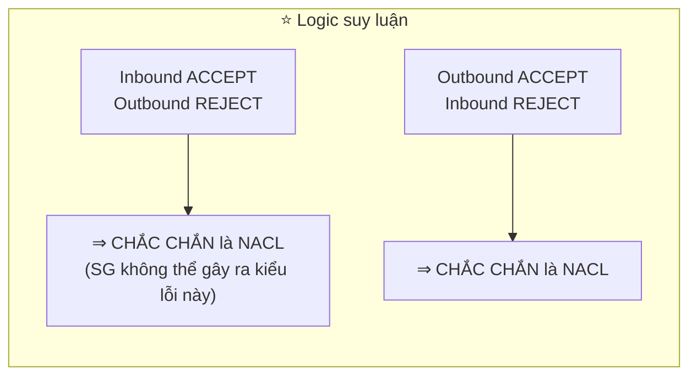

---

### ⭐⭐ VPC Flow Logs – Architectures (3 pattern)

| Pattern | Luồng |
|---|---|
| ⭐⭐⭐ **Top-10 IP addresses** | **VPC Flow Logs → CloudWatch Logs → CloudWatch Contributor Insights** |
| ⭐⭐⭐ **Cảnh báo SSH, RDP…** | **VPC Flow Logs → CloudWatch Logs → Metric Filter → CW Alarm → Amazon SNS** |
| ⭐⭐⭐ **Phân tích dài hạn** | **VPC Flow Logs → S3 Bucket → Amazon Athena → Amazon QuickSight** |

> ⭐⭐⭐ **Ba pattern này nối trực tiếp với chương 22 và 24** — Contributor Insights (chương 24), Athena + QuickSight (chương 22).

---

### ⭐⭐ VPC Flow Logs – CloudWatch Permissions

- ⭐⭐⭐ **IAM Service Role gắn với VPC Flow Logs PHẢI có quyền publish logs vào CloudWatch Logs:**
  - ⭐⭐⭐ **`logs:CreateLogGroup`, `logs:CreateLogStream`, hoặc `logs:PutLogEvents`**

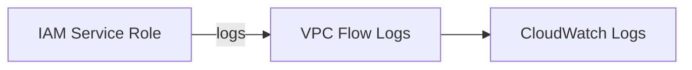

---

## 336. VPC Flow Logs Hands On + Athena

> 🖐️ Bài Hands On — **không có slide**.

### Bước 1 — Tạo VPC Flow Log

1. **VPC** → chọn `Demo VPC` → tab **Flow logs** → **Create flow log**
2. **Name**: `Demo-VPC-FlowLog`
3. ⭐⭐⭐ **Filter**: **Accept** / **Reject** / ⭐ **All** (khuyến nghị cho học, nhưng **tốn nhiều log nhất**)
4. **Maximum aggregation interval**: **1 phút** (chi tiết hơn) hoặc **10 phút** (rẻ hơn)
5. ⭐⭐⭐ **Destination**:

| Lựa chọn | Khi nào dùng |
|---|---|
| ⭐⭐⭐ **Send to CloudWatch Logs** | Muốn **Contributor Insights, Alarm, Logs Insights** |
| ⭐⭐⭐ **Send to an S3 bucket** | Muốn **Athena, lưu dài hạn, rẻ hơn** |
| ⭐⭐ **Send to Kinesis Data Firehose** | Cần **real-time streaming** ra ngoài |

6. Nếu chọn S3: **Log record format**: **AWS default format** hoặc **Custom format** (chọn thêm field)
7. **Create flow log**

### Bước 2 — Tạo traffic để có log

```bash
# Từ EC2 public, thử cả traffic hợp lệ và bị chặn
ping -c 3 8.8.8.8
curl http://example.com
# Thử SSH từ một IP KHÔNG được phép (sẽ REJECT, tạo log REJECT)
```

### Bước 3 — Xem log trên CloudWatch Logs Insights

```
fields srcAddr, dstAddr, srcPort, dstPort, action
| filter action = "REJECT"
| sort @timestamp desc
| limit 20
```

### Bước 4 — Query bằng Athena (nếu gửi tới S3) ⭐⭐⭐

1. Đợi **vài phút** để log xuất hiện trong S3 (dạng `.gz`, theo cấu trúc `AWSLogs/<account-id>/vpcflowlogs/<region>/<year>/<month>/<day>/`)
2. **Athena** → **Query editor** → tạo table:

```sql
CREATE EXTERNAL TABLE IF NOT EXISTS vpc_flow_logs (
  version int, account_id string, interface_id string,
  srcaddr string, dstaddr string, srcport int, dstport int,
  protocol bigint, packets bigint, bytes bigint,
  start bigint, `end` bigint, action string, log_status string
)
ROW FORMAT DELIMITED FIELDS TERMINATED BY ' '
LOCATION 's3://your-flow-logs-bucket/AWSLogs/123456789012/vpcflowlogs/us-east-1/';
```

3. Query mẫu:

```sql
-- Đếm request bị REJECT theo IP nguồn
SELECT srcaddr, COUNT(*) AS rejects
FROM vpc_flow_logs
WHERE action = 'REJECT'
GROUP BY srcaddr
ORDER BY rejects DESC
LIMIT 10;
```

> ⭐⭐⭐ **Đây chính là pattern "VPC Flow Logs → S3 → Athena" của bài 335** — thực hành trực tiếp.

### Dọn dẹp

- Xóa Flow Log (**Actions** → **Delete flow log**)
- Xóa log group CloudWatch / object S3 nếu không cần

> 💡 **CHI PHÍ:** VPC Flow Logs **miễn phí TẠO**, chỉ tính phí lưu trữ đích (CloudWatch Logs hoặc S3) theo dung lượng — thường rất rẻ ở mức học tập.

---

## 337. Site to Site VPN, Virtual Private Gateway & Customer Gateway

### ⭐⭐⭐ AWS Site-to-Site VPN — Sơ đồ tổng quan

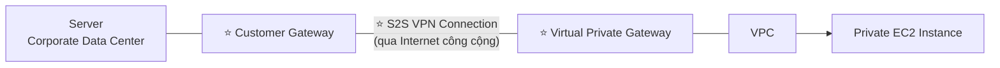

**⭐⭐⭐ Hai thành phần bắt buộc:**

| Thành phần | Vai trò |
|---|---|
| ⭐⭐⭐ **Virtual Private Gateway (VGW)** | **VPN CONCENTRATOR phía AWS của kết nối VPN**<br/>⭐⭐⭐ **Được tạo và GẮN VÀO VPC mà bạn muốn tạo Site-to-Site VPN**<br/>⭐⭐ **Có thể TÙY BIẾN ASN (Autonomous System Number)** |
| ⭐⭐⭐ **Customer Gateway (CGW)** | **Ứng dụng phần mềm HOẶC thiết bị vật lý ở PHÍA KHÁCH HÀNG của kết nối VPN** |

---

### ⭐⭐⭐ Site-to-Site VPN Connections — Chi tiết thiết lập

**Customer Gateway Device (On-premises) — Địa chỉ IP nào dùng?**

| Trường hợp | IP dùng |
|---|---|
| ⭐⭐ **Bình thường** | **Public Internet-routable IP của Customer Gateway device** |
| ⭐⭐ **Đằng sau thiết bị NAT hỗ trợ NAT-T** | **Public IP của thiết bị NAT đó** |

**⭐⭐⭐ Hai bước thiết lập quan trọng:**

| # | Bước |
|---|---|
| 1 | ⚠️⭐⭐⭐ **BẮT BUỘC bật "ROUTE PROPAGATION" cho Virtual Private Gateway** trong route table gắn với subnet của bạn |
| 2 | ⭐⭐ **Nếu cần ping EC2 instance từ on-premises, PHẢI thêm ICMP protocol vào inbound của Security Group** |

```mermaid
flowchart LR
    subgraph OP["Corporate Data Center"]
        S["Server"] --- CGWD["Customer Gateway Device<br/>(Public IP hoặc sau NAT Device)"]
    end
    CGWD --- VGW["Virtual Private Gateway"]
    VGW --- RT["⭐ Route Table<br/>(Route Propagation ENABLED)"]
    RT --- PS["Private Subnet<br/>Security Group (⭐ allow ICMP nếu cần ping)"]
```

> ⭐⭐⭐ **"Route Propagation" là điểm ra thi nhiều nhất bài này.** Đề hỏi: *"Đã setup Site-to-Site VPN nhưng EC2 không kết nối được về on-premises"* → ⭐ **kiểm tra Route Propagation đã bật chưa**.

---

### ⭐⭐ AWS VPN CloudHub

- ⭐⭐⭐ **Cung cấp GIAO TIẾP AN TOÀN giữa NHIỀU SITE, nếu bạn có NHIỀU kết nối VPN**
- ⭐⭐⭐ **Mô hình HUB-AND-SPOKE CHI PHÍ THẤP cho kết nối mạng chính hoặc phụ giữa các địa điểm khác nhau (CHỈ VPN)**
- ⭐⭐⭐ **Vì là kết nối VPN nên nó ĐI QUA INTERNET CÔNG CỘNG**
- ⭐⭐ **Thiết lập: kết nối NHIỀU VPN connection vào CÙNG một VGW, thiết lập dynamic routing và cấu hình route tables**

```mermaid
flowchart TD
    VGW["⭐ Virtual Private Gateway (VGW)<br/>— HUB —"]
    VGW --- CG1["Customer Gateway 1"] --- N1["Customer Network 1<br/>Private Subnet 1<br/>EC2 Instances"]
    VGW --- CG2["Customer Gateway 2"] --- N2["Customer Network 2<br/>Private Subnet 2<br/>EC2 Instances"]
    VGW --- CG3["Customer Gateway 3"] --- N3["Customer Network 3"]
```

> ⭐⭐⭐ **Từ khóa nhận diện: "nhiều văn phòng/chi nhánh cần giao tiếp với nhau qua VPN, chi phí thấp"** → **AWS VPN CloudHub**. Khác **Transit Gateway** (bài 341) ở chỗ CloudHub **chỉ dùng VPN**, còn Transit Gateway hỗ trợ cả VPC Peering, Direct Connect.

---

## 338. Site to Site VPN … Hands On

> 🖐️ Bài Hands On — **không có slide**.

### Các bước Console

1. **VPC** → **Virtual private gateways** → **Create virtual private gateway**
   - **Name**: `Demo VGW`, **ASN**: **Amazon default ASN** → **Create**
2. Chọn VGW → **Actions** → ⭐ **Attach to VPC** → chọn `Demo VPC`
3. **Customer gateways** → **Create customer gateway**
   - **Name**: `Demo CGW`
   - ⭐⭐ **BGP ASN**: ASN thiết bị phía bạn (hoặc để mặc định nếu chỉ mô phỏng)
   - ⭐⭐⭐ **IP address**: IP public của thiết bị VPN phía on-premises
   - **Create customer gateway**
4. **Site-to-Site VPN connections** → **Create VPN connection**
   - **Target gateway type**: **Virtual Private Gateway** → chọn `Demo VGW`
   - **Customer gateway**: **Existing** → chọn `Demo CGW`
   - ⭐⭐⭐ **Routing options**: **Dynamic (requires BGP)** hoặc **Static**
   - Nếu **Static**: nhập **Static IP Prefixes** (CIDR phía on-premises)
   - **Create VPN connection** → mất **vài phút**
5. ⚠️⭐⭐⭐ **Bật Route Propagation:**
   - **Route Tables** → chọn route table của Private Subnet → tab **Route Propagation** → **Edit route propagation** → tích `Demo VGW` → **Save**
6. **Download configuration** → chọn vendor thiết bị của bạn (Cisco, Fortinet, generic…) để lấy file cấu hình đem sang thiết bị on-premises thật

> ⚠️ **Lưu ý:** bài Hands On này **mô phỏng một phía** — để test thật cần **thiết bị VPN vật lý hoặc một EC2 chạy phần mềm VPN (ví dụ OpenSwan/strongSwan)** đóng vai Customer Gateway. Vì vậy Stéphane chỉ đi qua giao diện, không demo kết nối thật end-to-end.

```bash
aws ec2 create-vpn-gateway --type ipsec.1
aws ec2 attach-vpn-gateway --vpn-gateway-id vgw-xxx --vpc-id vpc-xxx
aws ec2 create-customer-gateway --type ipsec.1 --public-ip <IP> --bgp-asn 65000
aws ec2 create-vpn-connection --type ipsec.1 \
  --customer-gateway-id cgw-xxx --vpn-gateway-id vgw-xxx
aws ec2 enable-vgw-route-propagation --route-table-id rtb-xxx --gateway-id vgw-xxx
```

> 💡 **CHI PHÍ:** Site-to-Site VPN connection tính **~$0.05/giờ ≈ $36/tháng** kể cả khi idle. Nhớ **Delete VPN connection** và **Detach + Delete VGW** sau khi học.

---

## 339. Direct Connect & Direct Connect Gateway

### ⭐⭐⭐ Direct Connect (DX)

- ⭐⭐⭐ **Cung cấp một kết nối RIÊNG TƯ CHUYÊN DỤNG (dedicated) từ mạng ở xa tới VPC của bạn**
- ⭐⭐⭐ **Kết nối chuyên dụng PHẢI được thiết lập giữa DC của bạn và AWS Direct Connect location**
- ⭐⭐⭐ **PHẢI thiết lập một Virtual Private Gateway trên VPC của bạn**
- ⭐⭐⭐ **Truy cập được TÀI NGUYÊN CÔNG KHAI (S3) VÀ RIÊNG TƯ (EC2) trên CÙNG một kết nối**

**Use Cases:** ⭐⭐⭐

| Use case |
|---|
| ⭐⭐⭐ **Tăng THÔNG LƯỢNG băng thông — làm việc với tập dữ liệu lớn — chi phí THẤP HƠN** |
| ⭐⭐⭐ **Trải nghiệm mạng NHẤT QUÁN HƠN — ứng dụng dùng luồng dữ liệu real-time** |
| ⭐⭐⭐ **Môi trường LAI (Hybrid Environments)** (on-prem + cloud) |

- ⭐⭐ **Hỗ trợ CẢ IPv4 và IPv6**

```mermaid
flowchart LR
    subgraph DC["Corporate data center"]
        CR["Customer or partner router"]
    end
    CR --- CN["Customer Network<br/>Customer router/firewall"]
    CR ---|"Private virtual interface<br/>Public virtual interface"| DXL["AWS Direct Connect Location"]
    subgraph DXL2["AWS Direct Connect Location"]
        DXE["AWS Direct Connect Endpoint<br/>(AWS Cage)"]
    end
    DXL2 --> VGW["Virtual Private Gateway<br/>(Region us-east-1)"]
    VGW --- V["VPC — Private Subnet<br/>EC2 Instances"]
    DXL2 --> G["Amazon S3 / Amazon Glacier<br/>(qua Public VIF)"]
```

> ⭐⭐⭐ **Hai loại Virtual Interface (VIF) phải nhớ:**
> - **Private virtual interface** → truy cập **VPC** (tài nguyên riêng)
> - **Public virtual interface** → truy cập **dịch vụ công khai AWS** (S3, Glacier…)

---

### ⭐⭐⭐ Direct Connect Gateway

- ⭐⭐⭐ **Muốn setup Direct Connect tới MỘT HOẶC NHIỀU VPC ở NHIỀU REGION KHÁC NHAU (cùng account) → PHẢI dùng Direct Connect Gateway**

```mermaid
flowchart TD
    CN["Customer network"] --- DXC["AWS Direct Connect connection"]
    DXC --- DXGW["⭐ Direct Connect Gateway"]
    DXGW ---|"Private virtual interface"| V1["VPC (us-east-1)<br/>10.0.0.0/16"]
    DXGW ---|"Private virtual interface"| V2["VPC (us-west-1)<br/>172.16.0.0/16"]
```

> ⭐⭐⭐ **Từ khóa: "một kết nối Direct Connect, nhiều VPC ở nhiều region"** → **Direct Connect Gateway**.

---

### ⭐⭐⭐ Direct Connect – Connection Types

| Loại | Băng thông | Cách đăng ký |
|---|---|---|
| ⭐⭐⭐ **Dedicated Connections** | ⭐⭐⭐ **TỪ 1 Gbps ĐẾN 400 Gbps** | **Cổng Ethernet vật lý DÀNH RIÊNG cho khách hàng**<br/>**Yêu cầu gửi tới AWS trước, rồi ĐƯỢC HOÀN TẤT bởi AWS Direct Connect Partners** |
| ⭐⭐⭐ **Hosted Connections** | ⭐⭐⭐ **TỪ 50 Mbps ĐẾN 25 Gbps** | **Yêu cầu kết nối được thực hiện QUA AWS Direct Connect Partners**<br/>⭐⭐ **Dung lượng THÊM/BỚT được THEO NHU CẦU** |

- ⚠️⭐⭐⭐ **Thời gian chờ thường LÂU HƠN 1 THÁNG để thiết lập kết nối mới**

> ⭐⭐⭐ **Hai dải băng thông là con số ra thi.** Nhớ: **Dedicated = lớn (1G–400G), cứng nhắc. Hosted = nhỏ (50M–25G), linh hoạt co giãn được.**

---

### ⭐⭐⭐ Direct Connect – Encryption

- ⚠️⭐⭐⭐ **Dữ liệu khi truyền qua Direct Connect KHÔNG ĐƯỢC MÃ HÓA nhưng LÀ RIÊNG TƯ (private)**
- ⭐⭐⭐ **AWS Direct Connect + VPN cung cấp một kết nối riêng tư ĐƯỢC MÃ HÓA BẰNG IPSEC**
- ⭐⭐ **Tốt cho mức bảo mật cao hơn, nhưng PHỨC TẠP HƠN một chút để thiết lập**

> ⭐⭐⭐ **BẪY THI RẤT HAY GẶP:** *"Dữ liệu qua Direct Connect có được mã hóa không?"* → **KHÔNG — chỉ riêng tư (private), không mã hóa (not encrypted)**. Muốn mã hóa thì phải **kết hợp thêm VPN (IPsec) chạy TRÊN Direct Connect**.

---

### ⭐⭐ Direct Connect – Resiliency

| | ⭐⭐ **High Resiliency** | ⭐⭐⭐ **Maximum Resiliency** |
|---|---|---|
| **Cách làm** | **Một kết nối TẠI NHIỀU địa điểm** (multiple locations) | ⭐⭐⭐ **CÁC kết nối RIÊNG BIỆT, kết thúc ở CÁC THIẾT BỊ RIÊNG BIỆT, tại NHIỀU HƠN MỘT địa điểm** |
| **Mức bảo vệ** | Cho **critical workloads** | ⭐ **Cho critical workloads QUAN TRỌNG NHẤT** |

> ⭐⭐⭐ **Maximum Resiliency = thiết bị KHÁC NHAU + địa điểm KHÁC NHAU** — đây là cấu hình an toàn nhất, tránh **single point of failure** ở cả thiết bị lẫn địa điểm.

---

## 340. Direct Connect + Site to Site VPN

### ⭐⭐⭐ Site-to-Site VPN connection as a backup

- ⭐⭐⭐ **Nếu Direct Connect gặp sự cố, bạn có thể thiết lập một BACKUP Direct Connect connection (ĐẮT), hoặc một kết nối SITE-TO-SITE VPN**

```mermaid
flowchart LR
    subgraph DC["Corporate DC"]
    end
    DC ---|"⭐ Direct Connect — Primary Connection"| V["VPC"]
    DC -.->|"⭐ Site-to-Site VPN — Backup Connection"| V
```

> ⭐⭐⭐ **Pattern kinh điển:** **Direct Connect = Primary** (nhanh, ổn định, đắt); **Site-to-Site VPN = Backup** (chậm hơn, qua Internet, rẻ hơn nhiều so với DX dự phòng).
>
> ⭐⭐⭐ **Câu hỏi thi:** *"Cách RẺ NHẤT để có dự phòng cho Direct Connect?"* → **Site-to-Site VPN làm backup**, KHÔNG phải DX thứ hai.

### ⭐⭐ Network topologies can become complicated

Khi có **nhiều VPC + nhiều VPN + nhiều Direct Connect Gateway**, sơ đồ kết nối trở nên **rối rắm** (mesh nhiều đường VPC Peering + VPN Connection + Direct Connect Gateway chồng chéo nhau) → đây chính là động lực dẫn tới **Transit Gateway** (bài 341).

---

## 341. Transit Gateway

### ⭐⭐⭐ Transit Gateway

- ⭐⭐⭐ **Để có TRANSITIVE PEERING giữa HÀNG NGHÌN VPC và on-premises, dùng mô hình HUB-AND-SPOKE (star)**

```mermaid
flowchart TD
    TG["⭐ AWS Transit Gateway<br/>— HUB —"]
    TG --- V1["Amazon VPC"]
    TG --- V2["Amazon VPC"]
    TG --- V3["Amazon VPC"]
    TG --- V4["Amazon VPC"]
    TG ---|"VPN Connection"| CGW["Customer Gateway"]
    TG --- DXGW["AWS Direct Connect Gateway"]
```

**⭐⭐⭐ Đặc điểm:**

| Đặc điểm |
|---|
| ⭐⭐⭐ **Tài nguyên CẤP REGION (Regional resource), hoạt động ĐƯỢC CROSS-REGION** |
| ⭐⭐⭐ **Chia sẻ CROSS-ACCOUNT bằng RESOURCE ACCESS MANAGER (RAM)** |
| ⭐⭐⭐ **Có thể PEER các Transit Gateway XUYÊN REGION** |
| ⭐⭐⭐ **Route Tables: GIỚI HẠN VPC nào nói chuyện được với VPC nào** |
| ⭐⭐⭐ **Hoạt động với Direct Connect Gateway, VPN connections** |
| ⭐⭐⭐ **Hỗ trợ IP MULTICAST** (⚠️ KHÔNG dịch vụ AWS nào khác hỗ trợ tính năng này) |

> ⭐⭐⭐ **ĐÂY LÀ GIẢI PHÁP CHO VẤN ĐỀ "NOT TRANSITIVE" CỦA VPC PEERING (bài 331)!**
>
> Thay vì tạo **N×(N−1)/2 VPC Peering connections**, chỉ cần **MỘT Transit Gateway ở giữa** và **mỗi VPC chỉ cần MỘT kết nối tới hub**.
>
> ⭐⭐⭐ **Từ khóa nhận diện:** *"hàng trăm/nghìn VPC cần giao tiếp qua lại"*, *"cần IP Multicast"*, *"đơn giản hóa kiến trúc mesh phức tạp"* → **Transit Gateway**.

---

### ⭐⭐⭐ Transit Gateway: Site-to-Site VPN ECMP

- ⭐⭐⭐ **ECMP = Equal-Cost Multi-Path routing**
- ⭐⭐⭐ **Chiến lược định tuyến cho phép CHUYỂN TIẾP một gói tin qua NHIỀU ĐƯỜNG TỐT NHẤT (best path) CÙNG LÚC**
- ⭐⭐⭐ **Use case: tạo NHIỀU kết nối Site-to-Site VPN để TĂNG BĂNG THÔNG kết nối tới AWS**

```mermaid
flowchart LR
    C["Corporate data center<br/>172.16.0.0/16"] -->|"Nhiều S2S VPN connections<br/>⭐ ECMP"| TG["AWS Transit Gateway"]
    TG --- V1["VPC"]
    TG --- V2["VPC"]
    TG --- V3["VPC"]
```

**⭐⭐⭐ Throughput với ECMP:**

| Kiểu | Không ECMP | Có ECMP |
|---|---|---|
| **VPN tới Virtual Private Gateway** | **1x VPN connection (2 tunnels) = 1.25 Gbps** | — (VGW **KHÔNG hỗ trợ ECMP**) |
| **VPN tới Transit Gateway** | **1x = 2.5 Gbps** (2 tunnels được dùng) | ⭐⭐⭐ **2x = 5.0 Gbps · 3x = 7.5 Gbps** (mỗi connection thêm ~2.5 Gbps) |

> ⭐⭐⭐ **Bẫy thi:** **CHỈ Transit Gateway mới hỗ trợ ECMP để TĂNG băng thông bằng cách gộp NHIỀU VPN connection** — **Virtual Private Gateway KHÔNG làm được** (bị giới hạn cứng ~1.25 Gbps mỗi VPN connection).

---

### ⭐⭐ Transit Gateway – Share Direct Connect between multiple accounts

```mermaid
flowchart LR
    subgraph A1["Account 1"]
        CL1["Clients"] --- V1["VPC"]
    end
    V1 --- TG["Transit Gateway"]
    TG --- DXGW["Direct Connect Gateway"]
    DXGW --- DXE["AWS Direct Connect endpoint<br/>(AWS Direct Connect Location)"]
    DXE --- CR["Customer router/firewall"]
    CR --- CDC["Corporate data center<br/>VLAN — Transit VIF"]
    subgraph A2["Account 2"]
        CL2["Clients"] --- V2["VPC"]
    end
    V2 --- TG
    TG -.->|"Servers"| A2
```

> ⭐⭐⭐ **Dùng AWS RESOURCE ACCESS MANAGER (RAM) để chia sẻ Transit Gateway với các tài khoản khác** — nhờ đó **nhiều account cùng dùng chung MỘT kết nối Direct Connect**, tiết kiệm chi phí đáng kể so với mỗi account tự thuê Direct Connect riêng.

---

## 342. VPC Traffic Mirroring

### ⭐⭐⭐ VPC – Traffic Mirroring

- ⭐⭐⭐ **Cho phép CHỤP LẠI và KIỂM TRA network traffic trong VPC của bạn**
- ⭐⭐⭐ **Định tuyến traffic tới các SECURITY APPLIANCES bạn tự quản lý**

**⭐⭐⭐ Nguồn và Đích:**

| | Chi tiết |
|---|---|
| ⭐⭐⭐ **Từ (Source)** | **ENIs** |
| ⭐⭐⭐ **Tới (Targets)** | **Một ENI hoặc một NETWORK LOAD BALANCER** |

- ⭐⭐ **Chụp TẤT CẢ packet hoặc CHỈ những packet bạn quan tâm** (tùy chọn, có thể **truncate** packet)
- ⭐⭐⭐ **Source và Target có thể ở CÙNG VPC hoặc KHÁC VPC (qua VPC Peering)**
- ⭐⭐ **Use cases: content inspection, threat monitoring, troubleshooting…**

```mermaid
flowchart LR
    SA["Source A<br/>Inbound & Outbound traffic"] -->|"⭐ Traffic Mirroring<br/>(filter traffic, optional)"| NLB["Network Load Balancer"]
    SB["Source B<br/>Inbound & Outbound traffic"] --> NLB
    NLB --> ASG["Auto Scaling group<br/>EC2 instances với Security Appliances"]
```

> ⭐⭐⭐ **Từ khóa nhận diện:** *"gửi bản sao traffic mạng tới công cụ phân tích bảo mật/IDS của bên thứ ba mà KHÔNG làm gián đoạn traffic gốc"* → **VPC Traffic Mirroring**.

---

## 343. IPv6 trong VPC

> ⚠️ **Tiêu đề tôi đặt lại** dựa trên nội dung slide "What is IPv6?" + "IPv6 in VPC" + "IPv4 Troubleshooting" (trang 760–762) — không nằm trong danh sách bài giảng bạn dán.

### ⭐⭐⭐ What is IPv6?

- ⭐⭐⭐ **IPv4 được thiết kế cung cấp 4.3 TỶ địa chỉ (sắp CẠN KIỆT)**
- ⭐⭐⭐ **IPv6 là NGƯỜI KẾ NHIỆM của IPv4**
- ⭐⭐⭐ **IPv6 cung cấp 3.4 × 10³⁸ địa chỉ IP DUY NHẤT**
- ⚠️⭐⭐⭐ **MỌI địa chỉ IPv6 trong AWS đều là PUBLIC và định tuyến được trên Internet (KHÔNG có dải private)**
- ⭐⭐ **Định dạng: `x:x:x:x:x:x:x:x`** (x là hexadecimal, từ `0000` đến `ffff`)

**Ví dụ và cách viết gọn:** ⭐⭐

| Cách viết | Ý nghĩa |
|---|---|
| `2001:db8:3333:4444:5555:6666:7777:8888` | Địa chỉ đầy đủ |
| **`::`** | **CẢ 8 nhóm đều là 0** |
| **`2001:db8::`** | **6 nhóm CUỐI là 0** |
| **`::1234:5678`** | **6 nhóm ĐẦU là 0** |
| **`2001:db8::1234:5678`** | **4 nhóm GIỮA là 0** |

> ⚠️⭐⭐⭐ **BẪY THI QUAN TRỌNG NHẤT:** **IPv6 trong AWS KHÔNG CÓ dải "private"** như IPv4 (không có tương đương `10.0.0.0/8`) — **MỌI IPv6 đều public**.

---

### ⭐⭐⭐ IPv6 in VPC

- ⚠️⭐⭐⭐ **IPv4 KHÔNG THỂ tắt (disable) được cho VPC và subnet của bạn**
- ⭐⭐⭐ **Bạn CÓ THỂ bật IPv6 (chúng là public IP) để hoạt động ở chế độ DUAL-STACK**
- ⭐⭐⭐ **EC2 instance của bạn sẽ có ÍT NHẤT một IPv4 private VÀ một IPv6 public**
- ⭐⭐ **Chúng giao tiếp được bằng CẢ IPv4 HOẶC IPv6 ra Internet qua Internet Gateway**

```mermaid
flowchart LR
    I["Internet"] --- IGW["Internet Gateway<br/>⭐ IPv4 & IPv6"]
    IGW --- V["VPC"]
    V --> E["EC2 Instance<br/>Private IP: 10.0.0.5<br/>IPv6: 2001:db8::ff00:42:8329"]
```

> ⭐⭐⭐ **"IPv4 KHÔNG TẮT ĐƯỢC" là điểm ra thi.** Bạn chỉ có thể **THÊM IPv6 vào bên cạnh IPv4 (dual-stack)**, không thay thế được.

---

### ⭐⭐⭐ IPv4 Troubleshooting — bẫy thi RẤT HAY

- ⚠️⭐⭐⭐ **IPv4 KHÔNG THỂ tắt cho VPC và subnet**
- ⭐⭐⭐ **Vậy nếu KHÔNG launch được EC2 instance trong subnet:**
  - ❌⭐⭐⭐ **KHÔNG PHẢI vì không lấy được IPv6** (không gian IPv6 RẤT LỚN)
  - ✅⭐⭐⭐ **LÀ VÌ KHÔNG CÒN IPv4 TRỐNG trong subnet của bạn**
- ⭐⭐⭐ **Giải pháp: TẠO một IPv4 CIDR MỚI trong VPC/subnet của bạn**

```mermaid
flowchart LR
    U["User"] -->|"create"| V["VPC<br/>IPv4: 192.168.0.0/24<br/>⭐ IPv4 MỚI: 10.0.0.0/24<br/>IPv6: 2001:db8:1234:5678::/56"]
```

> ⭐⭐⭐ **ĐÂY LÀ CÂU HỎI THI KINH ĐIỂN:**
> *"Subnet đã bật dual-stack IPv6 nhưng vẫn không launch thêm được EC2 instance, tại sao?"*
> → ❌ **KHÔNG phải vấn đề IPv6** (luôn dư thừa) → ✅ **HẾT IPv4 trong subnet** → **Giải pháp: thêm CIDR IPv4 mới**.

---

## 344. Egress-only Internet Gateway

> ⚠️ Tiêu đề tôi đặt lại dựa trên slide "Egress-only Internet Gateway" + "IPv6 Routing" (trang 763–764) — không nằm trong danh sách bài giảng bạn dán.

### ⭐⭐⭐ Egress-only Internet Gateway

- ⭐⭐⭐ **CHỈ dùng cho IPv6**
- ⭐⭐⭐ **(Tương tự NAT Gateway nhưng dành cho IPv6)**
- ⭐⭐⭐ **Cho phép instance trong VPC của bạn KẾT NỐI RA NGOÀI (outbound) qua IPv6, đồng thời NGĂN Internet CHỦ ĐỘNG khởi tạo kết nối IPv6 TỚI instance của bạn**
- ⭐⭐⭐ **PHẢI cập nhật Route Tables**

```mermaid
flowchart LR
    I["Internet"] <-->|"initiate connections<br/>từ CẢ HAI phía"| IGW["Internet Gateway"]
    IGW --- PubS["Public Subnet<br/>IPv6: 2001:db8::b1c2"]
    I -.->|"❌ KHÔNG khởi tạo được<br/>kết nối từ Internet"| EIGW["⭐ Egress-only<br/>Internet Gateway"]
    EIGW --- PriS["Private Subnet<br/>IPv6: 2001:db8::e1c3<br/>⭐ CHỈ outbound"]
```

> ⭐⭐⭐ **Câu định vị PHẢI THUỘC:** **"Egress-only Internet Gateway = NAT Gateway nhưng cho IPv6."**
>
> ⭐⭐⭐ **Từ khóa nhận diện:** *"EC2 cần ra Internet qua IPv6 nhưng KHÔNG cho phép ai từ Internet khởi tạo kết nối vào"* → **Egress-only Internet Gateway**.

---

### ⭐⭐ IPv6 Routing — Ví dụ Route Table đầy đủ

**Route Table (Public Subnet):**

| Destination | Target |
|---|---|
| `10.0.0.0/16` | `local` |
| `2001:db8:1234:1a00::/56` | `local` |
| `0.0.0.0/0` | **`igw-id`** |
| ⭐ `::/0` | **`igw-id`** |

**Route Table (Private Subnet):**

| Destination | Target |
|---|---|
| `10.0.0.0/16` | `local` |
| `2001:db8:1234:1a00::/56` | `local` |
| `0.0.0.0/0` | ⭐⭐⭐ **`nat-gateway-id`** |
| ⭐⭐⭐ `::/0` | ⭐⭐⭐ **`eigw-id` (Egress-only IGW)** |

> ⭐⭐⭐ **BẢNG SO SÁNH "SONG SINH" IPv4 ↔ IPv6 — RẤT DỄ RA THI:**
>
> | | **IPv4** | **IPv6** |
> |---|---|---|
> | **Route mọi nơi** | **`0.0.0.0/0`** | **`::/0`** |
> | **Public Subnet → Internet** | `igw-id` | `igw-id` (CHUNG một IGW) |
> | **Private Subnet → ra ngoài** | ⭐ **`nat-gateway-id`** | ⭐ **`eigw-id`** |
>
> 💡 **Mẹo nhớ:** IPv4 dùng **NAT Gateway**, IPv6 dùng **Egress-only Internet Gateway** — **vai trò tương đương nhưng là hai gateway KHÁC NHAU**, và cả hai **đều chỉ đặt route ở Private Subnet**.

---

## 345. VPC Section Summary

> ⚠️ Tiêu đề tôi đặt lại dựa trên 3 slide "VPC Section Summary (1/3, 2/3, 3/3)" (trang 764–766) — không nằm trong danh sách bài giảng bạn dán. Đây là **slide tổng kết của Stéphane** — học thuộc phần này coi như ôn lại toàn chương.

### ⭐⭐⭐ VPC Section Summary (1/3)

| Khái niệm | Tóm tắt một dòng |
|---|---|
| ⭐⭐⭐ **CIDR** | **IP Range** |
| ⭐⭐⭐ **VPC** | **Virtual Private Cloud ⇒ định nghĩa một DANH SÁCH IPv4 & IPv6 CIDR** |
| ⭐⭐⭐ **Subnets** | **GẮN VỚI MỘT AZ, ta định nghĩa một CIDR** |
| ⭐⭐⭐ **Internet Gateway** | **Ở MỨC VPC, cung cấp IPv4 & IPv6 Internet Access** |
| ⭐⭐⭐ **Route Tables** | **PHẢI được sửa để thêm route từ subnet tới IGW, VPC Peering Connections, VPC Endpoints…** |
| ⭐⭐⭐ **Bastion Host** | **EC2 instance PUBLIC để SSH vào, có kết nối SSH tới các EC2 instance trong private subnet** |
| ⭐⭐⭐ **NAT Instances** | **Cho EC2 instance trong private subnet truy cập Internet. CŨ, phải đặt trong public subnet, tắt cờ Source/Destination check** |
| ⭐⭐⭐ **NAT Gateway** | **Do AWS quản lý, cung cấp truy cập Internet co giãn cho EC2 private, KHI ĐÍCH LÀ MỘT ĐỊA CHỈ IPv4** |

### ⭐⭐⭐ VPC Section Summary (2/3)

| Khái niệm | Tóm tắt một dòng |
|---|---|
| ⭐⭐⭐ **NACL** | **STATELESS, quy tắc subnet cho inbound và outbound, ĐỪNG QUÊN Ephemeral Ports** |
| ⭐⭐⭐ **Security Groups** | **STATEFUL, hoạt động ở MỨC EC2 instance** |
| ⭐⭐⭐ **VPC Peering** | **Kết nối hai VPC với CIDR KHÔNG chồng lấn, KHÔNG BẮC CẦU (non-transitive)** |
| ⭐⭐⭐ **VPC Endpoints** | **Cung cấp truy cập RIÊNG TƯ tới dịch vụ AWS (S3, DynamoDB, CloudFormation, SSM) TRONG một VPC** |
| ⭐⭐⭐ **VPC Flow Logs** | **Thiết lập được ở mức VPC / Subnet / ENI, cho traffic ACCEPT và REJECT, giúp xác định tấn công, phân tích bằng Athena hoặc CloudWatch Logs Insights** |
| ⭐⭐⭐ **Site-to-Site VPN** | **Thiết lập Customer Gateway ở DC, Virtual Private Gateway ở VPC, và kết nối site-to-site VPN QUA INTERNET CÔNG CỘNG** |
| ⭐⭐⭐ **AWS VPN CloudHub** | **Mô hình VPN hub-and-spoke để kết nối các site của bạn** |

### ⭐⭐⭐ VPC Section Summary (3/3)

| Khái niệm | Tóm tắt một dòng |
|---|---|
| ⭐⭐⭐ **Direct Connect** | **Thiết lập Virtual Private Gateway trên VPC, và thiết lập kết nối RIÊNG TƯ TRỰC TIẾP tới một AWS Direct Connect Location** |
| ⭐⭐⭐ **Direct Connect Gateway** | **Thiết lập Direct Connect tới NHIỀU VPC ở CÁC AWS region khác nhau** |
| ⭐⭐⭐ **AWS PrivateLink / VPC Endpoint Services** | **Kết nối dịch vụ RIÊNG TƯ từ VPC dịch vụ của bạn sang VPC khách hàng**<br/>**KHÔNG cần VPC Peering, Internet công cộng, NAT Gateway, Route Tables**<br/>⭐⭐⭐ **PHẢI dùng với Network Load Balancer & ENI** |
| ⭐⭐ **ClassicLink** | **Kết nối RIÊNG TƯ các EC2 instance kiểu EC2-Classic (cũ) vào VPC của bạn** |
| ⭐⭐⭐ **Transit Gateway** | **Kết nối bắc cầu (transitive) cho VPC, VPN & DX** |
| ⭐⭐⭐ **Traffic Mirroring** | **Sao chép network traffic từ các ENI để phân tích thêm** |
| ⭐⭐⭐ **Egress-only Internet Gateway** | **Giống NAT Gateway, nhưng cho đích IPv6** |

> ⭐⭐⭐ **LƯU Ý BỔ SUNG VỀ AWS PRIVATELINK / VPC ENDPOINT SERVICES** — khái niệm này **chỉ xuất hiện ở slide tổng kết**, không có slide riêng, nhưng **định nghĩa quan trọng và hay ra thi:**
>
> **AWS PrivateLink (VPC Endpoint Services)** cho phép **NHÀ CUNG CẤP dịch vụ (service provider)** expose ứng dụng của họ **riêng tư** cho **khách hàng (consumer)** ở VPC khác, **KHÔNG cần VPC Peering, KHÔNG qua Internet công cộng, KHÔNG cần NAT Gateway hay sửa Route Tables**. Bên cung cấp **BẮT BUỘC đặt ứng dụng sau một Network Load Balancer**; bên khách hàng tạo **Interface Endpoint (ENI)** trỏ vào dịch vụ đó.
>
> ⭐⭐⭐ **Từ khóa nhận diện:** *"expose dịch vụ SaaS của công ty bạn cho HÀNG NGHÌN khách hàng VPC khác, an toàn, không lộ traffic ra Internet"* → **AWS PrivateLink (VPC Endpoint Service) + NLB**.
>
> 💡 **Phân biệt với VPC Peering:** Peering kết nối **TOÀN BỘ hai mạng** (2 chiều, thấy mọi IP); **PrivateLink chỉ expose MỘT ứng dụng/dịch vụ cụ thể** (1 chiều, khách hàng chỉ thấy đúng service đó) — an toàn hơn nhiều cho mô hình SaaS đa khách hàng.

---

## 346. Networking Costs in AWS

> ⚠️ Tiêu đề tôi đặt lại dựa trên 4 slide về chi phí mạng (trang 768–771) — không nằm trong danh sách bài giảng bạn dán, nhưng đây là **nội dung RẤT HAY RA THI** vì SAA-C03 luôn có câu hỏi về tối ưu chi phí network.

### ⭐⭐⭐ Networking Costs in AWS per GB – Simplified

```mermaid
flowchart TD
    subgraph R1["Region A"]
        subgraph AZ1["AZ 1"]
        end
        subgraph AZ2["AZ 2"]
        end
        AZ1 <-->|"⭐ $0.01 nếu Private IP<br/>⭐ $0.02 nếu Public/Elastic IP"| AZ2
    end
    subgraph R2["Region B"]
        subgraph AZ3["AZ 3"]
        end
    end
    R1 <-->|"⭐ $0.02 Inter-region"| R2
```

| Traffic | Chi phí |
|---|---|
| ⭐⭐⭐ **Trong CÙNG AZ** | ⭐⭐⭐ **MIỄN PHÍ (Free for traffic in)** |
| ⭐⭐⭐ **Khác AZ, CÙNG Region, dùng PRIVATE IP** | ⭐⭐⭐ **MIỄN PHÍ** |
| ⭐⭐⭐ **Khác AZ, CÙNG Region, dùng Public/Elastic IP** | **$0.02/GB** |
| ⭐⭐⭐ **Khác AZ, CÙNG Region, dùng Private IP (không qua public)** | **$0.01/GB** |
| ⭐⭐⭐ **Khác Region (Inter-region)** | **$0.02/GB** |

**Hai nguyên tắc tiết kiệm:** ⭐⭐⭐

- ⭐⭐⭐ **Dùng PRIVATE IP thay vì PUBLIC IP** để tiết kiệm chi phí và có hiệu năng mạng tốt hơn
- ⭐⭐⭐ **Dùng CÙNG MỘT AZ để tiết kiệm TỐI ĐA** (đánh đổi bằng tính sẵn sàng thấp hơn)

> ⭐⭐⭐ **Đây là bảng ra thi RẤT NHIỀU.** Đề hay hỏi: *"Hai EC2 khác AZ giao tiếp qua Public IP, làm sao giảm chi phí?"* → **đổi sang PRIVATE IP** (từ $0.02 xuống $0.01, hoặc miễn phí nếu là traffic ra vào bình thường tùy cấu hình).

---

### ⭐⭐⭐ Minimizing egress traffic network cost

- ⭐⭐⭐ **Egress traffic: traffic ĐI RA (từ AWS ra ngoài)**
- ⭐⭐⭐ **Ingress traffic: traffic ĐI VÀO (từ ngoài vào AWS) — THƯỜNG MIỄN PHÍ**
- ⭐⭐⭐ **Cố gắng GIỮ CÀNG NHIỀU traffic Internet TRONG AWS CÀNG TỐT để giảm thiểu chi phí**
- ⭐⭐⭐ **Direct Connect location ĐẶT CÙNG (co-located) trong AWS Region → chi phí EGRESS THẤP HƠN**

```mermaid
flowchart LR
    subgraph BAD["⚠️ Egress cost CAO"]
        A1["Application<br/>(Corporate data center)"] -->|"DB Query 100 MB"| D1["Database<br/>(AWS Cloud)"]
        D1 -->|"Query Results 50 KB"| A1
    end
```

```mermaid
flowchart LR
    subgraph GOOD["✅ Egress cost TỐI THIỂU"]
        A2["Application<br/>(AWS Cloud)"] -->|"DB Query 100 MB"| D2["Database<br/>(AWS Cloud)"]
        D2 -->|"Query Results 50 KB"| A2
        A2 -.->|"chỉ kết quả nhỏ ra ngoài"| C["Corporate data center"]
    end
```

> ⭐⭐⭐ **Nguyên lý cốt lõi:** đặt **Application GẦN Database** (cùng AWS Cloud) thay vì để Application ở on-premises gọi Database trên AWS qua lại nhiều lần — **DB Query 100 MB đi ra egress rất tốn**, trong khi **Query Results 50 KB đi ra thì không đáng kể**.

---

### ⭐⭐⭐ S3 Data Transfer Pricing – Analysis for USA

| Loại transfer | Chi phí |
|---|---|
| ⭐⭐⭐ **S3 ingress** (upload vào S3) | ⭐⭐⭐ **MIỄN PHÍ** |
| ⭐⭐⭐ **S3 → Internet** | **$0.09/GB** |
| ⭐⭐ **S3 Transfer Acceleration** | **+$0.04 đến +$0.08/GB** (CỘNG THÊM vào giá Data Transfer) — nhanh hơn **50–500%** |
| ⭐⭐⭐ **S3 → CloudFront (Edge location)** | ⭐⭐⭐ **$0.00/GB (MIỄN PHÍ)** |
| ⭐⭐⭐ **CloudFront → Internet** | **$0.085/GB** (⭐ **rẻ hơn một chút so với S3 trực tiếp**) |
| ⭐⭐ **S3 Cross Region Replication** | **$0.02/GB** |

**Hai lợi ích khi dùng CloudFront thay vì S3 trực tiếp:** ⭐⭐⭐

- ⭐⭐⭐ **Khả năng CACHING (giảm latency)**
- ⭐⭐⭐ **Giảm CHI PHÍ REQUEST của S3** (⭐ **RẺ HƠN 7 LẦN khi dùng CloudFront**)

> ⭐⭐⭐ **"CloudFront rẻ hơn S3 trực tiếp 7 lần về request pricing" + "$0.00 để đẩy dữ liệu từ S3 vào CloudFront edge"** là combo ra thi rất mạnh — nhắc lại và củng cố bài học chương 15 (CloudFront).

---

### ⭐⭐⭐ Pricing: NAT Gateway vs Gateway VPC Endpoint

| Chi phí | Giá trị |
|---|---|
| ⭐⭐⭐ **NAT Gateway / giờ** | **$0.045** |
| ⭐⭐⭐ **NAT Gateway data processed / GB** | **$0.045** |
| ⭐⭐⭐ **Data transfer out tới S3 (CROSS-REGION)** | **$0.09** |
| ⭐⭐⭐ **Data transfer out tới S3 (SAME-REGION)** | **$0.00** |
| ⭐⭐⭐ **Gateway VPC Endpoint** | ⭐⭐⭐ **KHÔNG CÓ CHI PHÍ** cho việc dùng Gateway Endpoint |
| ⭐ **Data transfer in/out qua Gateway Endpoint (same-region)** | **$0.01** |

```mermaid
flowchart LR
    subgraph V["VPC (10.0.0.0/16)"]
        E1["EC2 Instance<br/>Private subnet 1"] -->|"⚠️ $0.045/giờ + $0.045/GB"| NG["NAT Gateway<br/>Public subnet"]
        E2["EC2 Instance<br/>Private subnet 2"] -->|"✅ Không cost cho endpoint"| VE["VPC Endpoint<br/>(Gateway)"]
    end
    NG --> IGW["Internet Gateway"] --> I["Internet"]
    VE --> S3["S3 Bucket"]
```

> ⭐⭐⭐ **Đây là bằng chứng bằng SỐ LIỆU cho quy tắc ở bài 333: "trong VPC, truy cập S3 luôn nên dùng Gateway Endpoint thay vì đi qua NAT Gateway."** NAT Gateway tốn **cả phí giờ lẫn phí xử lý dữ liệu**; Gateway Endpoint **gần như miễn phí**.

---

## 347. AWS Network Firewall

> ⚠️ Tiêu đề tôi đặt lại dựa trên 3 slide cuối phần VPC (trang 772–774) — không nằm trong danh sách bài giảng bạn dán, nhưng là **dịch vụ quan trọng, thường bị nhầm với WAF**.

### ⭐⭐⭐ Network Protection on AWS — Ôn lại những gì đã học

- ⭐⭐ **Để bảo vệ mạng trên AWS, ta đã thấy:**
  - **Network Access Control Lists (NACLs)**
  - **Amazon VPC security groups**
  - **AWS WAF** (bảo vệ khỏi request độc hại)
  - **AWS Shield & AWS Shield Advanced**
  - **AWS Firewall Manager** (quản lý chúng xuyên account)
- ⭐⭐⭐ **NHƯNG nếu muốn bảo vệ TOÀN BỘ VPC theo cách TINH VI HƠN thì sao?**

---

### ⭐⭐⭐ AWS Network Firewall

- ⭐⭐⭐ **Bảo vệ TOÀN BỘ Amazon VPC của bạn**
- ⭐⭐⭐ **Bảo vệ TỪ LAYER 3 ĐẾN LAYER 7**
- ⭐⭐⭐ **Kiểm tra được ở MỌI HƯỚNG:**

| Hướng |
|---|
| ⭐⭐⭐ **VPC to VPC traffic** |
| ⭐⭐⭐ **Outbound to internet** |
| ⭐⭐⭐ **Inbound from internet** |
| ⭐⭐⭐ **To / from Direct Connect & Site-to-Site VPN** |

```mermaid
flowchart LR
    I["internet"] --- NF["⭐ AWS Network Firewall"]
    NF --- V["VPC — Private subnet"]
    DX["Direct Connect<br/>Corporate DC"] --- NF
    VPN["VPN connection"] --- NF
    PV["Peered VPC"] --- NF
```

**Hai đặc điểm kỹ thuật:** ⭐⭐⭐

- ⭐⭐⭐ **Bên trong, AWS Network Firewall dùng AWS GATEWAY LOAD BALANCER**
- ⭐⭐⭐ **Rules quản lý TẬP TRUNG CROSS-ACCOUNT bằng AWS FIREWALL MANAGER, áp dụng cho NHIỀU VPC**

> ⭐⭐⭐ **PHÂN BIỆT WAF vs NETWORK FIREWALL — CÂU HỎI THI RẤT HAY:**
>
> | | ⭐⭐⭐ **AWS WAF** | ⭐⭐⭐ **AWS Network Firewall** |
> |---|---|---|
> | **Layer** | **CHỈ Layer 7 (HTTP)** | ⭐⭐⭐ **Layer 3 ĐẾN Layer 7** |
> | **Bảo vệ** | **Ứng dụng web cụ thể** (ALB, API Gateway, CloudFront…) | ⭐⭐⭐ **TOÀN BỘ VPC** |
> | **Công nghệ nền** | — | **Gateway Load Balancer** |
> | **Hướng kiểm tra** | Request HTTP tới ứng dụng | **MỌI HƯỚNG**: VPC↔VPC, Internet, DX, VPN |
>
> **Câu hỏi thi:** *"Cần lọc traffic ở MỌI hướng ra vào VPC, kể cả traffic không phải HTTP"* → **AWS Network Firewall**, không phải WAF.

---

### ⭐⭐⭐ Network Firewall – Fine Grained Controls

| Khả năng |
|---|
| ⭐⭐⭐ **Hỗ trợ HÀNG NGHÌN rules** |
| ⭐⭐⭐ **IP & port** — ví dụ: lọc **HÀNG CHỤC NGHÌN IP** |
| ⭐⭐⭐ **Protocol** — ví dụ: **chặn giao thức SMB cho traffic outbound** |
| ⭐⭐⭐ **Stateful domain list rule groups** — ví dụ: **CHỈ cho phép outbound traffic tới `*.mycorp.com`** hoặc repo phần mềm bên thứ ba |
| ⭐⭐ **General pattern matching dùng REGEX** |

- ⭐⭐⭐ **Traffic filtering: ALLOW, DROP, hoặc ALERT cho traffic khớp rule**
- ⭐⭐⭐ **ACTIVE FLOW INSPECTION để bảo vệ khỏi mối đe dọa mạng với khả năng INTRUSION-PREVENTION** (giống Gateway Load Balancer, nhưng TẤT CẢ do AWS quản lý)
- ⭐⭐ **Gửi log các rule match tới Amazon S3, CloudWatch Logs, Kinesis Data Firehose**

> ⭐⭐⭐ **Từ khóa nhận diện mạnh nhất: "chỉ cho phép outbound tới domain cụ thể (allowlist domain)"**, **"chặn SMB protocol"**, **"intrusion prevention cho toàn VPC"** → **AWS Network Firewall**.

---

## 🧭 Cheat Sheet toàn chương ⭐⭐⭐

| Từ khóa trong đề | Đáp án |
|---|---|
| *"cần 29 IP cho EC2, chọn subnet nào"* | **`/26`** (64 − 5 = 59 > 29); ❌ `/27` chỉ có 27 IP dùng được |
| *"AWS giữ lại bao nhiêu IP mỗi subnet"* | **5** (4 đầu + 1 cuối) |
| *"tối đa CIDR/VPC, VPC/region"* | **5 CIDR/VPC, 5 VPC/region (soft limit)** |
| *"kích thước VPC nhỏ nhất/lớn nhất"* | **/28 (16 IP) → /16 (65.536 IP)** |
| *"IGW gắn xong nhưng vẫn không ra Internet"* | **Chưa sửa Route Table (`0.0.0.0/0 → igw-id`)** |
| *"SSH vào private EC2 an toàn"* | **Bastion Host** (SG tham chiếu SG Bastion, không mở `0.0.0.0/0`) |
| *"NAT Instance cần tắt gì"* | **Source/Destination Check** |
| ⭐⭐ *"dùng làm Bastion Host được"* | **CHỈ NAT Instance** (NAT Gateway không có SG, không dùng SSH được) |
| *"NAT Gateway băng thông tối đa"* | **5 Gbps tự scale tới 100 Gbps** |
| *"HA cho NAT Gateway"* | **Tạo MỘT cái mỗi AZ** (trừ khi dùng Regional NAT Gateway) |
| *"chặn một IP cụ thể"* | **NACL** (SG không có rule Deny) |
| ⚠️ *"web server ↔ DB port 3306 hai chiều nhưng vẫn lỗi"* | **Thiếu NACL rule cho Ephemeral Ports (1024–65535)** |
| ⭐⭐⭐ *"Inbound ACCEPT, Outbound REJECT (một chiều lỗi)"* | **CHẮC CHẮN là NACL** (SG stateful không gây lỗi kiểu này) |
| *"3 VPC cần giao tiếp đầy đủ, cần mấy Peering connection"* | **3** (N×(N−1)/2, KHÔNG transitive) |
| *"trong VPC, truy cập S3/DynamoDB, tối ưu chi phí"* | **Gateway Endpoint** (miễn phí) |
| *"truy cập AWS service từ on-premises/VPC khác/region khác"* | **Interface Endpoint** (bắt buộc, Gateway không hoạt động xuyên biên) |
| *"Lambda trong VPC gọi DynamoDB"* | **VPC Gateway Endpoint cho DynamoDB** (không cần NAT+IGW) |
| *"đọc trường ACTION trong Flow Logs"* | **REJECT một chiều → chắc chắn là NACL** |
| *"quyền IAM cho VPC Flow Logs ghi CloudWatch"* | **`logs:CreateLogGroup`, `CreateLogStream`, `PutLogEvents`** |
| *"Site-to-Site VPN không route được traffic"* | **Chưa bật Route Propagation cho VGW** |
| *"nhiều site VPN giao tiếp qua lại, chi phí thấp"* | **AWS VPN CloudHub** |
| *"Direct Connect có mã hóa không"* | ❌ **KHÔNG — chỉ riêng tư**; muốn mã hóa → **DX + VPN (IPsec)** |
| *"Direct Connect tới nhiều VPC nhiều region"* | **Direct Connect Gateway** |
| *"backup rẻ nhất cho Direct Connect"* | **Site-to-Site VPN** |
| *"transitive peering hàng nghìn VPC + IP Multicast"* | **Transit Gateway** |
| *"tăng băng thông VPN bằng nhiều connection"* | **Transit Gateway + ECMP** (VGW không hỗ trợ) |
| *"copy traffic cho IDS/phân tích bảo mật"* | **VPC Traffic Mirroring** |
| *"IPv6 trong AWS có private range không"* | ❌ **KHÔNG — mọi IPv6 đều public** |
| ⚠️⭐⭐ *"không launch được EC2 dù VPC có dual-stack IPv6"* | **Hết IPv4 trong subnet**, KHÔNG phải vấn đề IPv6 |
| *"IPv6 ra Internet nhưng chặn Internet khởi tạo vào"* | **Egress-only Internet Gateway** |
| *"expose dịch vụ SaaS cho nhiều VPC khách hàng an toàn"* | **AWS PrivateLink / VPC Endpoint Service + NLB** |
| *"2 EC2 khác AZ, giảm chi phí network"* | **Dùng Private IP thay vì Public IP** |
| *"CloudFront rẻ hơn S3 trực tiếp bao nhiêu lần (request)"* | **7 lần** |
| *"bảo vệ Layer 3–7 cho TOÀN BỘ VPC, mọi hướng"* | **AWS Network Firewall** (khác WAF chỉ Layer 7) |
| *"chỉ cho outbound traffic tới domain công ty"* | **Network Firewall — Stateful domain list rule group** |

---

## Trắc nghiệm 24: VPC & Networking Quiz

### Các điểm dễ bị bẫy

| Câu hỏi thường gặp | Đáp án đúng | Vì sao đáp án khác sai |
|---|---|---|
| Cần 29 IP dùng được cho EC2, chọn CIDR nào? | ⭐⭐⭐ **`/26`** | `/27` chỉ có 27 IP dùng được (32−5), không đủ |
| Mỗi subnet AWS giữ lại mấy IP? | **5** (4 đầu + 1 cuối) | |
| Default VPC dùng dải IP nào? | **`172.16.0.0/12`** | |
| Tối đa VPC/region và CIDR/VPC? | **5 VPC/region, 5 CIDR/VPC** | |
| Kích thước VPC min/max? | **/28 (16 IP) đến /16 (65.536 IP)** | |
| Đã attach IGW mà vẫn không ra Internet? | ⭐⭐⭐ **Chưa sửa Route Table** | IGW một mình không đủ |
| Bastion Host SG nên mở SSH cho ai? | ⭐ **CIDR giới hạn**, không phải `0.0.0.0/0` | |
| SG của EC2 private nên reference gì? | ⭐ **Security Group của Bastion**, không phải CIDR | |
| NAT Instance cần tắt cài đặt gì? | ⭐⭐⭐ **Source/Destination Check** | |
| NAT Instance cần gắn gì? | **Elastic IP**, đặt ở **Public Subnet** | |
| NAT Gateway có Security Group không? | ❌⭐⭐⭐ **KHÔNG** | NAT Instance thì **CÓ** |
| Dùng làm Bastion Host được không — NAT Gateway vs Instance? | ⭐⭐⭐ **CHỈ NAT Instance** | |
| NAT Gateway băng thông? | **5 Gbps, tự scale tới 100 Gbps** | |
| HA cho NAT Gateway thường? | **Một NAT Gateway MỖI AZ** | Regional NAT Gateway thì chỉ cần 1 |
| NACL mới tạo mặc định thế nào? | ⚠️⭐⭐⭐ **DENY mọi thứ** | Default NACL (có sẵn) thì ALLOW mọi thứ |
| NACL rule nào thắng khi trùng IP? | ⭐⭐⭐ **Số RULE NHỎ HƠN thắng** (ưu tiên cao hơn) | |
| Chặn một IP cụ thể dùng gì? | ⭐⭐⭐ **NACL** | Security Group không có Deny |
| Web-DB 2 chiều port 3306 vẫn lỗi kết nối? | ⭐⭐⭐ **Thiếu NACL rule cho Ephemeral Ports (1024-65535)** | |
| Đọc Flow Log: Inbound ACCEPT, Outbound REJECT? | ⭐⭐⭐ **NACL** (không thể là SG vì SG stateful) | |
| SG hoạt động ở mức gì? | **Instance level, STATEFUL, chỉ Allow** | |
| NACL hoạt động ở mức gì? | **Subnet level, STATELESS, Allow VÀ Deny** | |
| 3 VPC giao tiếp đầy đủ cần mấy Peering? | ⭐⭐⭐ **3** (N×(N−1)/2) | VPC Peering KHÔNG transitive |
| VPC Peering CIDR có được overlap không? | ❌⭐⭐⭐ **KHÔNG được overlap** | |
| Trong VPC truy cập S3 tối ưu chi phí? | ⭐⭐⭐ **Gateway Endpoint** (MIỄN PHÍ) | |
| Gateway Endpoint hỗ trợ dịch vụ nào? | ⚠️⭐⭐⭐ **CHỈ S3 và DynamoDB** | Còn lại dùng Interface Endpoint |
| Truy cập AWS service từ on-premises qua VPN/DX? | ⭐⭐⭐ **Interface Endpoint** | Gateway Endpoint không hoạt động xuyên VPC/on-prem |
| Lambda trong VPC gọi DynamoDB hiệu quả nhất? | ⭐⭐⭐ **VPC Gateway Endpoint cho DynamoDB** | Không cần NAT+IGW |
| VPC Flow Logs gửi được tới đâu? | **S3, CloudWatch Logs, Kinesis Data Firehose** | |
| VPC Flow Logs IAM role cần quyền gì? | **`logs:CreateLogGroup/CreateLogStream/PutLogEvents`** | |
| Site-to-Site VPN không route traffic? | ⭐⭐⭐ **Chưa bật Route Propagation cho VGW** | |
| Nhiều site VPN kết nối qua lại, rẻ? | ⭐⭐⭐ **AWS VPN CloudHub** (hub-and-spoke, chỉ VPN) | |
| Direct Connect có mã hóa mặc định không? | ❌⭐⭐⭐ **KHÔNG — chỉ private** | Cần mã hóa → **DX + VPN (IPsec)** |
| DX tới nhiều VPC nhiều region? | ⭐⭐⭐ **Direct Connect Gateway** | |
| Dedicated Connection băng thông? | **1 Gbps – 400 Gbps** | Hosted: **50 Mbps – 25 Gbps** |
| Backup rẻ nhất cho Direct Connect? | ⭐⭐⭐ **Site-to-Site VPN** | DX thứ hai rất đắt |
| Hub-and-spoke transitive cho hàng nghìn VPC? | ⭐⭐⭐ **Transit Gateway** | |
| Transit Gateway hỗ trợ gì mà dịch vụ khác không có? | ⭐⭐⭐ **IP Multicast** | |
| Tăng băng thông VPN bằng ECMP? | ⭐⭐⭐ **CHỈ Transit Gateway** | VGW không hỗ trợ ECMP |
| Chia sẻ Transit Gateway cross-account? | **AWS Resource Access Manager (RAM)** | |
| Copy traffic ra một Network Load Balancer để phân tích? | ⭐⭐⭐ **VPC Traffic Mirroring** | |
| IPv6 trong AWS có dải private không? | ❌⭐⭐⭐ **KHÔNG — mọi IPv6 đều PUBLIC** | |
| IPv4 tắt được cho VPC không? | ❌⭐⭐⭐ **KHÔNG — chỉ THÊM IPv6 (dual-stack)** | |
| Không launch được EC2 dù VPC dual-stack IPv6? | ⭐⭐⭐ **Hết IPv4 trong subnet**, không phải thiếu IPv6 | |
| Tương đương NAT Gateway cho IPv6? | ⭐⭐⭐ **Egress-only Internet Gateway** | |
| Expose dịch vụ SaaS riêng tư cho nhiều VPC khách hàng? | ⭐⭐⭐ **AWS PrivateLink / VPC Endpoint Service + NLB** | Khác VPC Peering (kết nối toàn mạng) |
| Traffic cùng AZ tốn phí không? | ❌ **MIỄN PHÍ** | Khác AZ qua Public IP: **$0.02/GB** |
| Giảm chi phí network giữa 2 AZ? | ⭐⭐⭐ **Dùng Private IP thay vì Public IP** | |
| CloudFront rẻ hơn S3 trực tiếp về request bao nhiêu lần? | **7 lần** | |
| NAT Gateway vs Gateway Endpoint chi phí S3? | **NAT Gateway: $0.045/giờ + $0.045/GB; Gateway Endpoint: MIỄN PHÍ** | |
| Bảo vệ Layer 3-7 toàn VPC, mọi hướng? | ⭐⭐⭐ **AWS Network Firewall** | WAF chỉ Layer 7, chỉ ứng dụng web |
| Network Firewall dùng công nghệ nền gì? | **Gateway Load Balancer** | |
| Chỉ cho outbound tới domain cụ thể? | ⭐⭐⭐ **Network Firewall — Stateful domain list rule group** | |

---

### Checklist tự kiểm tra trước khi làm quiz

**Nền tảng (313–321):**
- [ ] Tính nhanh được **số IP = 2^(32−mask)** và **IP dùng được = đó trừ 5**
- [ ] Thuộc 3 dải Private IP và dải của **Default VPC (`172.16.0.0/12`)**
- [ ] Thuộc **5 VPC/region · 5 CIDR/VPC · /28 → /16**
- [ ] Nhớ **IGW một mình không đủ — PHẢI sửa Route Table**

**Truy cập Internet (322–328):**
- [ ] Thuộc cấu hình 2 Security Group của **Bastion Host**
- [ ] Thuộc **4 yêu cầu của NAT Instance** (public subnet, tắt Source/Dest check, EIP, route table)
- [ ] ⭐⭐⭐ Thuộc **bảng so sánh NAT Gateway vs NAT Instance** — đặc biệt **SG** và **Bastion Host**
- [ ] Nhớ **NAT Gateway cần 1 cái/AZ để HA**; **Regional NAT Gateway thì không cần**

**Bảo mật & kết nối (329–336):**
- [ ] ⭐⭐⭐ Thuộc **bảng Security Group vs NACL** (5 dòng)
- [ ] Hiểu **Ephemeral Ports** và vì sao NACL cần rule cho nó
- [ ] ⭐⭐⭐ Nhớ quy tắc suy luận **"một chiều Accept, một chiều Reject → chắc chắn NACL"**
- [ ] Nhớ **VPC Peering KHÔNG transitive**
- [ ] ⭐⭐⭐ Thuộc **bảng Gateway vs Interface Endpoint** (dịch vụ hỗ trợ, chi phí)
- [ ] Nhớ ví dụ **Lambda + DynamoDB Gateway Endpoint**
- [ ] Thuộc cú pháp Flow Logs và **3 pattern kiến trúc**

**Hybrid (337–347):**
- [ ] Nhớ **Route Propagation** cho Site-to-Site VPN
- [ ] Nhớ **Direct Connect KHÔNG mã hóa mặc định**
- [ ] Thuộc **2 loại Connection Type** của Direct Connect
- [ ] ⭐⭐⭐ Nhớ **Transit Gateway giải quyết vấn đề "not transitive" của VPC Peering**, hỗ trợ **ECMP** và **IP Multicast**
- [ ] ⭐⭐⭐ Nhớ **IPv6 không có dải private**, và **hết IPv4 trong subnet ≠ vấn đề IPv6**
- [ ] Nhớ **Egress-only IGW = NAT Gateway cho IPv6**
- [ ] ⭐⭐ Nhớ **AWS PrivateLink dùng NLB**, khác VPC Peering ở tính "riêng lẻ từng dịch vụ"
- [ ] Thuộc **bảng chi phí network per GB** và **NAT Gateway vs Gateway Endpoint**
- [ ] ⭐⭐⭐ Phân biệt **WAF (Layer 7, ứng dụng)** vs **Network Firewall (Layer 3–7, toàn VPC)**

---

## Thuật ngữ Anh — Việt

| Tiếng Anh | Tiếng Việt |
|---|---|
| Classless Inter-Domain Routing (CIDR) | Phương pháp cấp phát địa chỉ IP không phân lớp |
| Base IP | Địa chỉ IP gốc trong dải |
| Subnet Mask | Mặt nạ mạng con |
| Private / Public IP | Địa chỉ IP riêng / công khai |
| Virtual Private Cloud (VPC) | Đám mây riêng ảo |
| Availability Zone (AZ) | Vùng sẵn sàng |
| Subnet | Mạng con |
| Reserved IP addresses | Địa chỉ IP bị giữ lại |
| Network Address / Broadcast Address | Địa chỉ mạng / địa chỉ quảng bá |
| Internet Gateway (IGW) | Cổng kết nối Internet |
| Route Table | Bảng định tuyến |
| Bastion Host | Máy chủ trung gian để truy cập an toàn |
| NAT (Network Address Translation) | Chuyển đổi địa chỉ mạng |
| NAT Instance | Máy chủ NAT tự quản lý |
| Source / Destination Check | Kiểm tra nguồn/đích của gói tin |
| Elastic IP (EIP) | Địa chỉ IP tĩnh co giãn |
| NAT Gateway | Cổng NAT được AWS quản lý |
| Regional NAT Gateway (RNAT) | NAT Gateway hoạt động toàn vùng |
| Network Access Control List (NACL) | Danh sách kiểm soát truy cập mạng |
| Stateless / Stateful | Không trạng thái / có trạng thái |
| Ephemeral Ports | Cổng tạm thời do client dùng |
| Security Group | Nhóm bảo mật |
| VPC Peering | Kết nối riêng tư hai VPC |
| Transitive / Non-transitive | Bắc cầu / không bắc cầu |
| VPC Endpoint | Điểm cuối truy cập riêng tư VPC |
| AWS PrivateLink | Công nghệ kết nối riêng tư dịch vụ |
| Interface Endpoint | Điểm cuối dạng giao diện mạng |
| Gateway Endpoint | Điểm cuối dạng cổng định tuyến |
| Elastic Network Interface (ENI) | Giao diện mạng đàn hồi |
| VPC Flow Logs | Nhật ký luồng traffic VPC |
| Virtual Private Gateway (VGW) | Cổng riêng ảo phía AWS |
| Customer Gateway (CGW) | Cổng phía khách hàng |
| Site-to-Site VPN | Mạng riêng ảo giữa hai site |
| Route Propagation | Tự động lan truyền tuyến đường |
| AWS VPN CloudHub | Mô hình VPN hub-and-spoke |
| Direct Connect (DX) | Kết nối mạng riêng chuyên dụng |
| Direct Connect Gateway | Cổng Direct Connect đa vùng |
| Virtual Interface (VIF) | Giao diện ảo của Direct Connect |
| Dedicated / Hosted Connections | Kết nối chuyên dụng / qua đối tác |
| Resiliency | Khả năng phục hồi, chịu lỗi |
| Transit Gateway | Cổng trung chuyển đa kết nối |
| Hub-and-spoke | Mô hình trung tâm - vệ tinh |
| Resource Access Manager (RAM) | Dịch vụ chia sẻ tài nguyên xuyên tài khoản |
| Equal-Cost Multi-Path (ECMP) | Định tuyến đa đường chi phí bằng nhau |
| Traffic Mirroring | Sao chép lưu lượng mạng |
| Security Appliances | Thiết bị/phần mềm bảo mật mạng |
| IPv6 | Giao thức Internet phiên bản 6 |
| Dual-stack mode | Chế độ chạy song song IPv4 và IPv6 |
| Egress-only Internet Gateway | Cổng Internet chỉ cho lưu lượng ra (IPv6) |
| Egress / Ingress traffic | Lưu lượng ra / lưu lượng vào |
| Data Transfer Pricing | Giá cước truyền dữ liệu |
| S3 Transfer Acceleration | Tăng tốc truyền tải S3 |
| Cross Region Replication | Sao chép chéo vùng |
| AWS Network Firewall | Tường lửa mạng cấp VPC của AWS |
| Gateway Load Balancer | Bộ cân bằng tải dạng cổng |
| Intrusion Prevention | Ngăn chặn xâm nhập |
| Stateful domain list rule group | Nhóm quy tắc lọc theo tên miền có trạng thái |
| ClassicLink | Kết nối EC2-Classic với VPC |
| VPC Endpoint Services | Dịch vụ điểm cuối VPC (nhà cung cấp) |

---

*Ghi chú: các phần Hands On (bài 317, 319, 321, 323, 325, 327, 330, 332, 334, 336, 338) được tóm tắt lại các bước thao tác chính trên AWS Console — giao diện có thể thay đổi theo thời gian, logic và khái niệm vẫn giữ nguyên. Chương này **không có thư mục code riêng** trong `code_v2025-10-27/`; các lệnh CLI và cấu hình trong file là bổ sung thực hành. ⚠️⚠️ **CẢNH BÁO CHI PHÍ QUAN TRỌNG NHẤT CHƯƠNG:** **NAT Gateway tính tiền $0.045/giờ ≈ $32/tháng + $0.045/GB KỂ CẢ KHI KHÔNG CÓ TRAFFIC** — đây là dịch vụ **âm thầm tốn tiền nhất** trong toàn bộ phần VPC; luôn **Delete NAT Gateway và RELEASE Elastic IP** sau khi học (bài 327). **Site-to-Site VPN connection ~$36/tháng kể cả khi idle** (bài 338) — nhớ Delete. **Interface VPC Endpoint ~$7/tháng/AZ** (bài 334) — Gateway Endpoint thì **miễn phí hoàn toàn**, luôn ưu tiên dùng Gateway khi có thể (S3, DynamoDB). Ngược lại, **VPC, Subnet, Route Table, IGW, NACL, Security Group, VPC Peering (tạo), VPC Flow Logs (tạo), và Transit Gateway attachment đều MIỄN PHÍ hoặc rất rẻ** khi không có traffic lớn. 💡 **Ghi chú quan trọng về cấu trúc chương:** danh sách bài giảng người dùng cung cấp **bị cắt ở bài 342 (VPC Traffic Mirroring)**. Các mục **343–347** (IPv6, Egress-only IGW, VPC Section Summary, Networking Costs, AWS Network Firewall) được tôi **bổ sung đầy đủ từ slide gốc** (trang 760–774) vì đây là nội dung chính thức của khóa học và **rất hay xuất hiện trong đề thi SAA-C03** — đặc biệt là ba bảng **so sánh chi phí network**, **NAT Gateway vs Gateway Endpoint**, và **WAF vs Network Firewall**. Nếu chương trình học thực tế của bạn đánh số khác, nội dung vẫn đúng 100% vì bám sát trực tiếp slide PDF. ⭐ **Lời khuyên ôn thi: hai bảng đáng học thuộc nhất TOÀN CHƯƠNG là (1) Security Group vs NACL ở bài 329, và (2) Gateway vs Interface Endpoint ở bài 333** — đây là hai bảng xuất hiện dưới nhiều hình thức khác nhau trong hầu hết đề thi SAA-C03 thực tế.*
