# Phần 28 — Disaster Recovery & Migrations

> Khóa học: *Ultimate AWS Certified Solutions Architect Associate 2026* (Stéphane Maarek) — SAA-C03
> Nguồn tham chiếu: `AWS Certified Solutions Architect Slides v48.pdf` (phần "Disaster Recovery and Migrations" — trang 775–801)

---

## Mục lục

| # | Bài giảng | Thời lượng | Loại |
|---|-----------|-----------|------|
| 351 | [Disaster Recovery in AWS](#351-disaster-recovery-in-aws) | 11 phút | Video |
| 352 | [Elastic Disaster Recovery (DRS)](#352-elastic-disaster-recovery-drs) | 2 phút | Video |
| 353 | [Database Migration Service (DMS)](#353-database-migration-service-dms) | 5 phút | Video |
| 354 | [Database Migration Service (DMS) - Hands On](#354-database-migration-service-dms---hands-on) | 5 phút | Video |
| 355 | [RDS & Aurora Migrations](#355-rds--aurora-migrations) | 3 phút | Video |
| 356 | [On-Premises Strategies with AWS](#356-on-premises-strategies-with-aws) | 3 phút | Video |
| 357 | [AWS Backup](#357-aws-backup) | 3 phút | Video |
| 358 | [AWS Backup - Hands On](#358-aws-backup---hands-on) | 4 phút | Video |
| 359 | [Application Migration Service (MGN)](#359-application-migration-service-mgn) | 3 phút | Video |
| 360 | [Transferring Large Datasets into AWS](#360-transferring-large-datasets-into-aws) | 3 phút | Video |
| 361 | [VMware Cloud on AWS](#361-vmware-cloud-on-aws) | 2 phút | Video |
| — | [Trắc nghiệm 25: Disaster Recovery & Migration Quiz](#trắc-nghiệm-25-disaster-recovery--migration-quiz) | — | Quiz |

> 📎 **Tài liệu đính kèm bài 351:** `disaster-recovery-workloads-on-aws.pdf` (whitepaper chính thức của AWS) — không được đưa vào file này vì là tài liệu ngoài slide bài giảng, nhưng nên tải về đọc thêm nếu có thời gian.

---

> 📌 **Đọc trước khi vào chương:** Đây là chương **NGẮN nhưng CỰC KỲ HAY RA THI** — SAA-C03 luôn có vài câu về chiến lược DR. Chia thành **ba nhóm**:
>
> | Nhóm | Bài | Nội dung |
> |---|---|---|
> | ⭐⭐⭐ **1. Chiến lược DR** | 351–352 | **RPO/RTO, 4 chiến lược DR, AWS Elastic Disaster Recovery** |
> | ⭐⭐⭐ **2. Di chuyển dữ liệu & database** | 353–358 | **DMS, SCT, RDS/Aurora Migration, AWS Backup** |
> | ⭐⭐⭐ **3. Di chuyển hạ tầng & dữ liệu lớn** | 359–361 | **MGN, Snowball vs Direct Connect vs Internet, VMware Cloud** |
>
> ⭐⭐⭐ **Bài quan trọng nhất: 351** — **4 chiến lược DR theo thứ tự RTO giảm dần / chi phí tăng dần** là một trong những bảng ra thi nhiều nhất toàn khóa học.

---

## 351. Disaster Recovery in AWS

### ⭐⭐⭐ Disaster Recovery Overview

- ⭐⭐⭐ **BẤT KỲ sự kiện nào có TÁC ĐỘNG TIÊU CỰC tới TÍNH LIÊN TỤC KINH DOANH hoặc TÀI CHÍNH của công ty đều là một THẢM HỌA (disaster)**
- ⭐⭐ **Disaster Recovery (DR) là việc CHUẨN BỊ CHO và PHỤC HỒI TỪ một thảm họa**

**⭐⭐⭐ Ba kiểu Disaster Recovery:**

| Kiểu | Chi tiết |
|---|---|
| ⭐⭐⭐ **On-premise ⇒ On-premise** | **DR truyền thống, RẤT ĐẮT** |
| ⭐⭐⭐ **On-premise ⇒ AWS Cloud** | **HYBRID recovery** |
| ⭐⭐⭐ **AWS Cloud Region A ⇒ AWS Cloud Region B** | DR giữa hai region |

---

### ⭐⭐⭐ RPO và RTO — HAI THUẬT NGỮ NỀN TẢNG

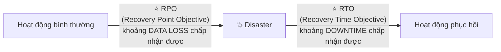

| Thuật ngữ | Định nghĩa |
|---|---|
| ⭐⭐⭐ **RPO (Recovery Point Objective)** | **Lượng DỮ LIỆU MẤT TỐI ĐA chấp nhận được** — tính từ lần backup/sync gần nhất tới lúc xảy ra sự cố |
| ⭐⭐⭐ **RTO (Recovery Time Objective)** | **Thời gian NGƯNG HOẠT ĐỘNG TỐI ĐA chấp nhận được** — từ lúc sự cố xảy ra tới lúc hệ thống hoạt động trở lại |

> ⭐⭐⭐ **Mẹo nhớ:** **RPO nhìn VỀ QUÁ KHỨ (mất bao nhiêu dữ liệu), RTO nhìn VỀ TƯƠNG LAI (mất bao lâu để phục hồi).** Đây là cặp khái niệm **PHẢI PHÂN BIỆT ĐƯỢC NGAY LẬP TỨC** trong phòng thi — đề hay đảo ngược định nghĩa để bẫy.

---

### ⭐⭐⭐⭐ Disaster Recovery Strategies — BỐN CHIẾN LƯỢC (BẢNG QUAN TRỌNG NHẤT CHƯƠNG)

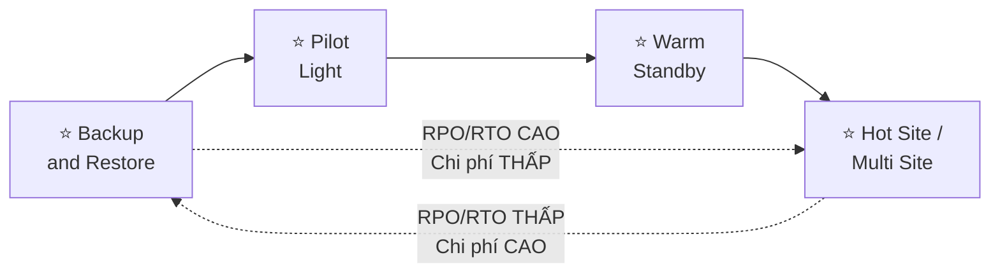

> ⭐⭐⭐ **BỐN CHIẾN LƯỢC theo thứ tự: Backup and Restore → Pilot Light → Warm Standby → Hot Site/Multi Site — RTO CÀNG NHANH thì CHI PHÍ CÀNG CAO.** Đây là trục xuyên suốt cả bài 351.

---

### ⭐⭐⭐ 1️⃣ Backup and Restore (High RPO)

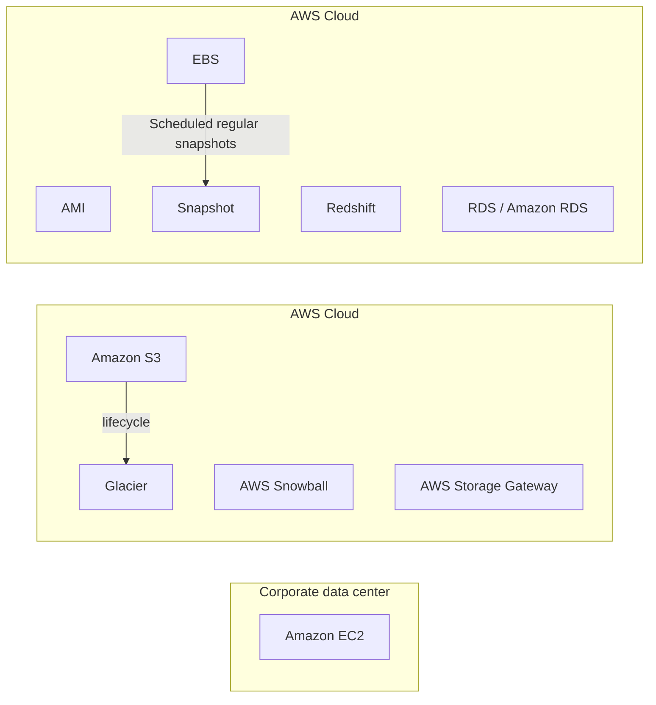

- ⭐⭐⭐ **RPO CAO** (mất nhiều dữ liệu nhất trong 4 chiến lược — vì backup không liên tục)
- ⭐⭐ **Chi phí THẤP NHẤT**
- ⭐⭐ **Dùng: Snowball, Storage Gateway, snapshot định kỳ**

---

### ⭐⭐⭐ 2️⃣ Disaster Recovery – Pilot Light

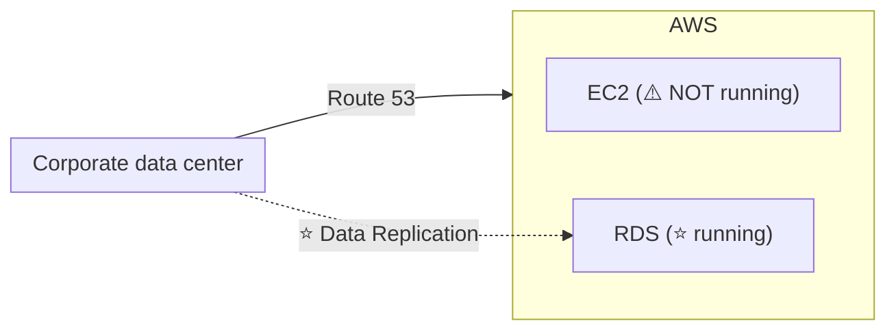

- ⭐⭐⭐ **Một PHIÊN BẢN NHỎ của ứng dụng LUÔN CHẠY trên cloud**
- ⭐⭐⭐ **Hữu ích cho PHẦN LÕI QUAN TRỌNG (critical core) — giống như "ngọn lửa mồi" (pilot light) của bếp gas**
- ⭐⭐⭐ **RẤT GIỐNG Backup and Restore**
- ⭐⭐⭐ **NHANH HƠN Backup and Restore vì các hệ thống QUAN TRỌNG (database) ĐÃ CHẠY SẴN**

> ⭐⭐⭐ **Điểm mấu chốt:** **DB đã chạy (running) và đang replicate dữ liệu, nhưng EC2 ứng dụng THÌ KHÔNG chạy** — chỉ khởi động khi có sự cố.

---

### ⭐⭐⭐ 3️⃣ Warm Standby

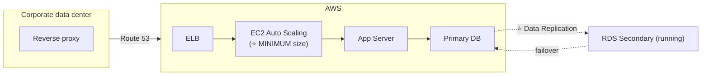

- ⭐⭐⭐ **TOÀN BỘ hệ thống ĐÃ chạy sẵn, nhưng ở KÍCH THƯỚC TỐI THIỂU (minimum size)**
- ⭐⭐⭐ **Khi có thảm họa, TA SCALE LÊN mức production**

> ⭐⭐⭐ **Điểm mấu chốt:** khác Pilot Light — ở đây **CẢ EC2 Auto Scaling và App Server ĐỀU ĐÃ CHẠY** (chỉ chạy nhỏ), không phải "tắt hẳn".

---

### ⭐⭐⭐ 4️⃣ Multi Site / Hot Site Approach

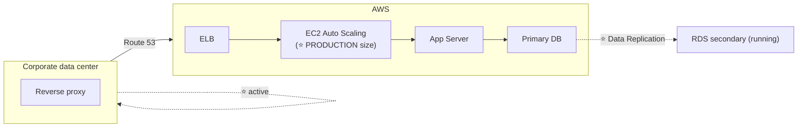

- ⭐⭐⭐ **RTO RẤT THẤP (vài phút hoặc vài giây) — RẤT ĐẮT**
- ⭐⭐⭐ **QUY MÔ PRODUCTION ĐẦY ĐỦ chạy CẢ trên AWS VÀ On-Premises (cả hai ĐỀU "active")**

### ⭐⭐⭐ Biến thể: All AWS Multi Region

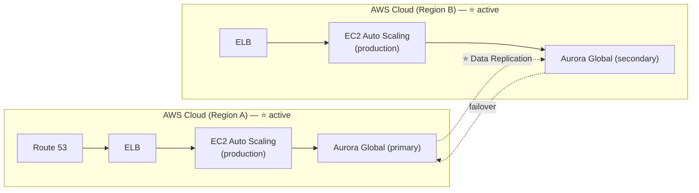

> ⭐⭐⭐ **Đây là phiên bản "toàn bộ trên AWS" của Multi Site** — cả hai region **ĐỀU ACTIVE (active-active)**, thay vì một bên là on-premises.

---

### ⭐⭐⭐ BẢNG SO SÁNH 4 CHIẾN LƯỢC — HỌC THUỘC

| Chiến lược | RPO | RTO | Chi phí | Đặc trưng |
|---|---|---|---|---|
| ⭐⭐⭐ **Backup and Restore** | **CAO** | **CAO (giờ/ngày)** | **THẤP NHẤT** | Snapshot định kỳ, không có gì chạy sẵn |
| ⭐⭐⭐ **Pilot Light** | Trung bình | Trung bình | Thấp | **CHỈ DB chạy sẵn**, EC2 tắt |
| ⭐⭐⭐ **Warm Standby** | Thấp | Thấp | Cao hơn | **Toàn hệ thống chạy ở mức TỐI THIỂU** |
| ⭐⭐⭐ **Hot Site / Multi Site** | **THẤP NHẤT** | **THẤP NHẤT (phút/giây)** | **CAO NHẤT** | **Cả hai bên chạy FULL PRODUCTION, active-active** |

> ⭐⭐⭐ **Đây là bảng ra thi KINH ĐIỂN.** Đề mô tả một tình huống ("công ty cần RTO dưới 5 phút, sẵn sàng chi trả nhiều") rồi hỏi chọn chiến lược nào — bạn phải **ánh xạ ngược từ RTO/chi phí về đúng chiến lược**.

---

### ⭐⭐⭐ Disaster Recovery Tips — 5 nhóm kỹ thuật

| Nhóm | Kỹ thuật |
|---|---|
| ⭐⭐⭐ **Backup** | **EBS Snapshots, RDS automated backups/Snapshots…**<br/>**Đẩy định kỳ lên S3/S3 IA/Glacier, Lifecycle Policy, Cross Region Replication**<br/>**Từ On-Premise: Snowball hoặc Storage Gateway** |
| ⭐⭐⭐ **High Availability** | **Dùng Route 53 để CHUYỂN DNS từ Region này sang Region khác**<br/>**RDS Multi-AZ, ElastiCache Multi-AZ, EFS, S3**<br/>**Site-to-Site VPN làm phương án PHỤC HỒI cho Direct Connect** |
| ⭐⭐⭐ **Replication** | **RDS Replication (Cross Region), AWS Aurora + Global Databases**<br/>**Database replication từ on-premises sang RDS**<br/>**Storage Gateway** |
| ⭐⭐⭐ **Automation** | **CloudFormation/Elastic Beanstalk để TÁI TẠO cả môi trường**<br/>**Recover/Reboot EC2 instance bằng CloudWatch khi alarm kích hoạt**<br/>**AWS Lambda cho tự động hóa tùy chỉnh** |
| ⭐⭐ **Chaos** | **Netflix có "simian-army" — NGẪU NHIÊN tắt EC2 instance để test khả năng chịu lỗi** |

> ⭐⭐⭐ **"Site-to-Site VPN làm phương án phục hồi cho Direct Connect"** đã học ở chương 27 (bài 340) — đây là ví dụ liên kết chương.
>
> 💡 **"Simian-army" của Netflix** (Chaos Monkey) là khái niệm hay được nhắc trong đề như một ví dụ về **Chaos Engineering**.

---

## 352. Elastic Disaster Recovery (DRS)

### ⭐⭐⭐ AWS Elastic Disaster Recovery (DRS)

- ⭐⭐⭐ **TÊN CŨ: "CloudEndure Disaster Recovery"** — đề thi có thể dùng cả hai tên
- ⭐⭐⭐ **NHANH và DỄ DÀNG phục hồi server VẬT LÝ, ẢO, và TRÊN CLOUD vào AWS**
- ⭐⭐ **Ví dụ: bảo vệ database quan trọng nhất (Oracle, MySQL, SQL Server), enterprise apps (SAP), bảo vệ dữ liệu khỏi tấn công RANSOMWARE…**
- ⭐⭐⭐ **REPLICATION LIÊN TỤC Ở MỨC BLOCK (continuous block-level replication) cho server của bạn**

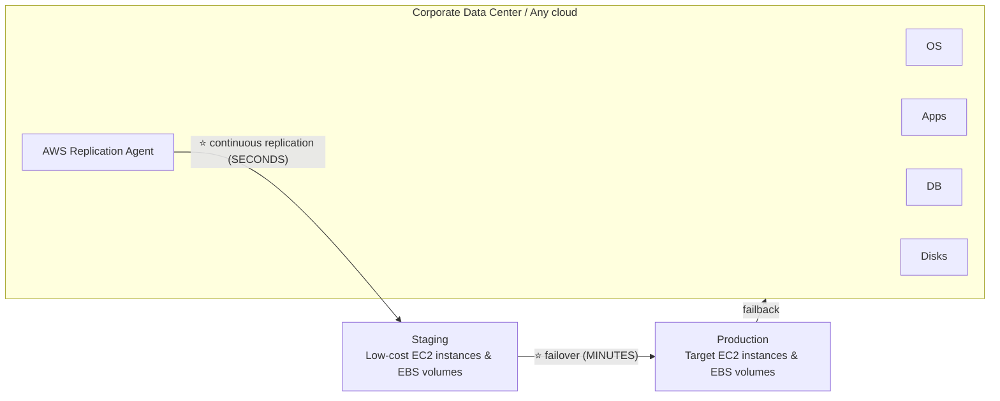

> ⭐⭐⭐ **Ba con số/khái niệm phải nhớ:**
> - **Replication liên tục theo GIÂY**
> - **Failover theo PHÚT**
> - ⭐⭐⭐ **Staging dùng EC2/EBS GIÁ RẺ (low-cost)**, chỉ khi **failover thật** mới chuyển sang **Target EC2/EBS đầy đủ**
>
> ⭐⭐⭐ **Từ khóa nhận diện:** *"bảo vệ server on-premises khỏi ransomware"*, *"continuous block-level replication"*, *"CloudEndure"* → **AWS Elastic Disaster Recovery (DRS)**.
>
> 💡 **Có cả `failback`** — nghĩa là sau khi khắc phục xong ở phía nguồn, có thể **chuyển ngược lại** từ AWS về hạ tầng gốc.

---

## 353. Database Migration Service (DMS)

### ⭐⭐⭐ DMS – Database Migration Service

- ⭐⭐⭐ **DI CHUYỂN database NHANH, AN TOÀN, TỰ PHỤC HỒI (resilient, self healing)**
- ⭐⭐⭐ **DATABASE NGUỒN VẪN HOẠT ĐỘNG (available) TRONG SUỐT quá trình migration**

**⭐⭐⭐ Hai loại migration hỗ trợ:**

| Loại | Ví dụ |
|---|---|
| ⭐⭐⭐ **Homogeneous** (cùng loại engine) | **Oracle → Oracle** |
| ⭐⭐⭐ **Heterogeneous** (khác loại engine) | **Microsoft SQL Server → Aurora** |

- ⭐⭐⭐ **REPLICATION LIÊN TỤC bằng CDC (Change Data Capture)**
- ⭐⭐⭐ **Bạn PHẢI tạo một EC2 instance để THỰC HIỆN các tác vụ replication**

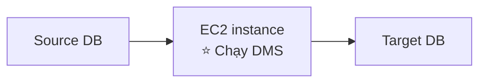

> ⭐⭐⭐ **Từ khóa nhận diện DMS: "database nguồn vẫn hoạt động trong suốt migration"**, **"Change Data Capture (CDC)"**, **"migrate database tối thiểu downtime"**.

---

### ⭐⭐⭐ DMS Sources and Targets — BẢNG RA THI

**⭐⭐⭐ SOURCES (nguồn):**

| Nguồn |
|---|
| **On-Premises và EC2 instance databases**: Oracle, MS SQL Server, MySQL, MariaDB, PostgreSQL, MongoDB, SAP, DB2 |
| **Azure**: Azure SQL Database |
| ⭐⭐⭐ **Amazon RDS** (TẤT CẢ kể cả Aurora) |
| **Amazon S3** |
| **DocumentDB** |

**⭐⭐⭐ TARGETS (đích):**

| Đích |
|---|
| **On-Premises và EC2 instance databases**: Oracle, MS SQL Server, MySQL, MariaDB, PostgreSQL, SAP |
| ⭐⭐⭐ **Amazon RDS** |
| ⭐⭐⭐ **Redshift, DynamoDB, S3** |
| **OpenSearch Service** |
| ⭐⭐⭐ **Kinesis Data Streams** |
| **Apache Kafka** |
| **DocumentDB & Amazon Neptune** |
| **Redis & Babelfish** |

> ⭐⭐⭐ **Điểm đáng chú ý nhất bảng này:** DMS **KHÔNG CHỈ dùng cho migration một chiều đơn giản** — nó có thể dùng làm **pipeline replication liên tục** tới các đích **NoSQL, data warehouse, streaming** (Redshift, DynamoDB, Kinesis, Kafka). Đây là điểm dễ bị đánh giá thấp.

---

### ⭐⭐⭐ AWS Schema Conversion Tool (SCT)

- ⭐⭐⭐ **CHUYỂN ĐỔI SCHEMA của database từ ENGINE này sang ENGINE KHÁC**
- **Ví dụ OLTP:** (SQL Server hoặc Oracle) → MySQL, PostgreSQL, Aurora
- **Ví dụ OLAP:** (Teradata hoặc Oracle) → Amazon Redshift
- ⭐⭐ **Ưu tiên INSTANCE TỐI ƯU CHO COMPUTE để tối ưu việc chuyển đổi dữ liệu**

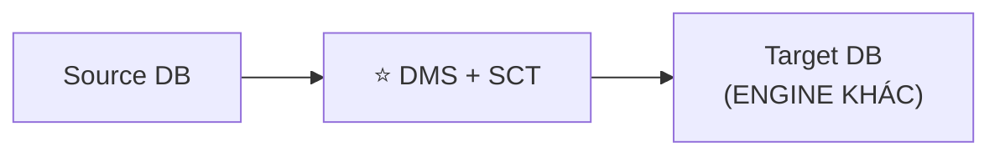

> ⚠️⭐⭐⭐ **QUY TẮC VÀNG PHẢI THUỘC:**
> - ⭐⭐⭐ **KHÔNG cần dùng SCT nếu migrate CÙNG MỘT database engine** — ví dụ **On-Premise PostgreSQL ⇒ RDS PostgreSQL** (engine VẪN LÀ PostgreSQL, RDS chỉ là NỀN TẢNG)
> - ⭐⭐⭐ **PHẢI dùng SCT khi CHUYỂN ĐỔI engine** — ví dụ SQL Server ⇒ Aurora MySQL
>
> **Câu hỏi thi:** *"Migrate MySQL on-premises sang RDS MySQL, cần SCT không?"* → ❌ **KHÔNG cần** (cùng engine, chỉ cần DMS). *"Migrate Oracle sang Aurora PostgreSQL?"* → ✅ **CẦN SCT** (khác engine).

---

### ⭐⭐ DMS - Continuous Replication — Kiến trúc đầy đủ

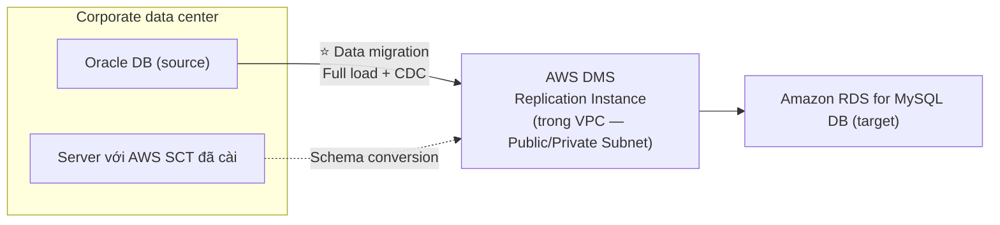

> ⭐⭐⭐ **Thuật ngữ "Full load + CDC" là điểm ra thi:** DMS làm **"Full Load" MỘT LẦN** (copy toàn bộ dữ liệu hiện có), rồi chuyển sang **"CDC" LIÊN TỤC** (chỉ đồng bộ các thay đổi) — đây là lý do database nguồn **không cần dừng**.

---

### ⭐⭐ AWS DMS – Multi-AZ Deployment

- ⭐⭐⭐ **Khi bật Multi-AZ, DMS TỰ CẤP PHÁT VÀ DUY TRÌ một STANDBY REPLICA ĐỒNG BỘ (synchronously) ở MỘT AZ KHÁC**

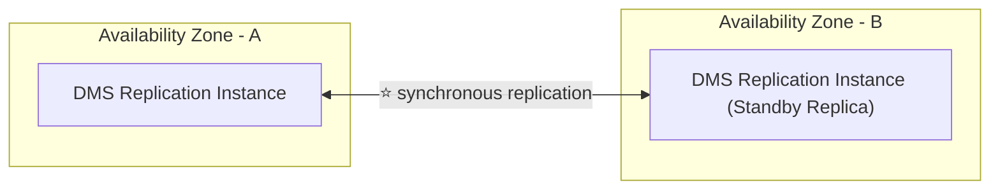

**⭐⭐ Lợi ích:**

| Lợi ích |
|---|
| ⭐⭐ **Cung cấp Data Redundancy (dự phòng dữ liệu)** |
| ⭐⭐ **LOẠI BỎ I/O FREEZES (đóng băng vào/ra)** |
| ⭐⭐ **TỐI THIỂU HÓA các đợt tăng độ trễ (latency spikes)** |

> ⭐⭐ **Giống hệt khái niệm RDS Multi-AZ** (chương 9) — cùng một triết lý: **đồng bộ (synchronous) sang AZ khác để có HA**.

---

## 354. Database Migration Service (DMS) - Hands On

> 🖐️ Bài Hands On — **không có slide, không có code kèm theo**. Các bước Console.

### Bước 1 — Tạo Replication Instance

1. Console → tìm **DMS** → **Replication instances** → **Create replication instance**
2. **Name**: `demo-dms-instance`
3. ⭐⭐ **Instance class**: `dms.t3.micro` (nhỏ nhất, để test)
4. **VPC**: chọn VPC có cả source và target kết nối được tới
5. ⭐⭐ **Multi-AZ**: **Dev or test workload (Single-AZ)** cho demo, hoặc **Production (Multi-AZ)** cho thực tế
6. **Publicly accessible**: bật nếu source/target ở ngoài VPC
7. **Create replication instance** → chờ **~5–10 phút**

### Bước 2 — Tạo Endpoints (Source & Target)

1. **Endpoints** → **Create endpoint**
2. ⭐⭐⭐ **Endpoint type**: **Source endpoint**
   - **Source engine**: chọn ví dụ `mysql`
   - **Access to endpoint database**: nhập **Server name, Port, Username, Password** của DB nguồn
   - ⭐ **Test connection** trước khi lưu
3. Lặp lại cho **Target endpoint** (ví dụ RDS MySQL hoặc Aurora MySQL đích)

### Bước 3 — Tạo Database Migration Task ⭐⭐⭐

1. **Database migration tasks** → **Create task**
2. **Task identifier**: `demo-migration-task`
3. **Replication instance**, **Source/Target endpoint**: chọn những gì vừa tạo
4. ⭐⭐⭐ **Migration type**:

| Lựa chọn | Ý nghĩa |
|---|---|
| ⭐⭐⭐ **Migrate existing data** | **CHỈ Full Load — copy một lần, không đồng bộ tiếp** |
| ⭐⭐⭐ **Migrate existing data and replicate ongoing changes** | ⭐ **Full Load + CDC — đây chính là "Continuous Replication" của bài 353** |
| ⭐⭐ **Replicate data changes only** | **CHỈ CDC — dùng khi dữ liệu đã có sẵn ở đích** |

5. **Table mappings**: chọn schema/table cần migrate (hoặc dùng wildcard `%`)
6. **Create task** → task tự động **Start** nếu để mặc định

### Bước 4 — Theo dõi tiến trình

1. Tab **Table statistics**: xem số dòng đã **Full Load**, trạng thái **Completed**
2. Sau Full Load, trạng thái chuyển sang ⭐ **Replication ongoing (CDC)** — mọi INSERT/UPDATE/DELETE mới ở nguồn được đồng bộ gần như real-time

### CLI tương đương

```bash
aws dms create-replication-instance \
  --replication-instance-identifier demo-dms-instance \
  --replication-instance-class dms.t3.micro

aws dms create-endpoint --endpoint-identifier source-mysql \
  --endpoint-type source --engine-name mysql \
  --server-name <host> --port 3306 --username admin --password <pw>

aws dms create-replication-task \
  --replication-task-identifier demo-migration-task \
  --source-endpoint-arn <arn> --target-endpoint-arn <arn> \
  --replication-instance-arn <arn> \
  --migration-type full-load-and-cdc \
  --table-mappings file://mappings.json
```

> ⚠️ **CHI PHÍ:** DMS replication instance tính phí **theo giờ** giống EC2 (t3.micro rẻ nhưng vẫn tính tiền). **Không có Free Tier lâu dài** (chỉ 6 tháng dùng thử cho instance `dms.t2.micro`/`dms.t3.micro`). Nhớ **Delete replication task → Delete endpoints → Delete replication instance** sau khi học.

---

## 355. RDS & Aurora Migrations

### ⭐⭐⭐ RDS & Aurora MySQL Migrations

**⭐⭐⭐ RDS MySQL → Aurora MySQL (hai lựa chọn):**

| Option | Cách làm |
|---|---|
| ⭐⭐⭐ **Option 1** | **DB Snapshots từ RDS MySQL, RESTORE thành Aurora MySQL DB** |
| ⭐⭐⭐ **Option 2** | **Tạo Aurora Read Replica từ RDS MySQL, khi replication lag = 0 thì PROMOTE thành DB cluster riêng** (⚠️ **có thể mất thời gian và tốn tiền**) |

**⭐⭐⭐ External MySQL → Aurora MySQL:**

| Option | Cách làm |
|---|---|
| ⭐⭐⭐ **Option 1** | **Dùng Percona XtraBackup tạo file backup lên Amazon S3, rồi tạo Aurora MySQL DB từ S3** |
| ⭐⭐ **Option 2** | **Tạo Aurora MySQL DB, dùng `mysqldump` để migrate** (⚠️ **CHẬM HƠN phương pháp S3**) |

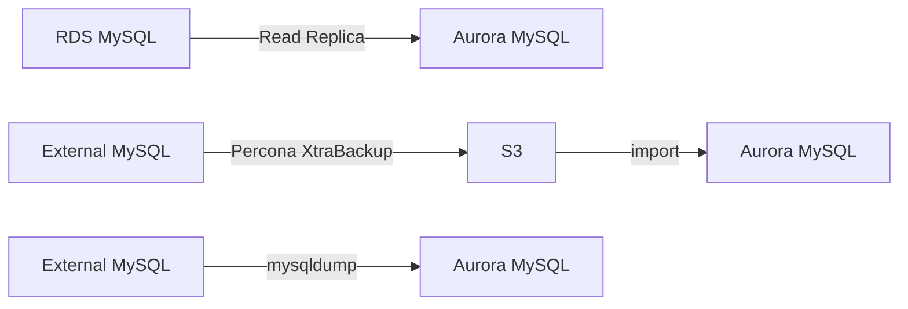

- ⭐⭐⭐ **DÙNG DMS NẾU CẢ HAI database đang CHẠY SẴN**

---

### ⭐⭐⭐ RDS & Aurora PostgreSQL Migrations

**⭐⭐⭐ RDS PostgreSQL → Aurora PostgreSQL:** (giống MySQL)

| Option | Cách làm |
|---|---|
| ⭐⭐⭐ **Option 1** | **DB Snapshots, restore thành Aurora PostgreSQL** |
| ⭐⭐⭐ **Option 2** | **Read Replica → promote khi lag = 0** |

**⭐⭐⭐ External PostgreSQL → Aurora PostgreSQL:**

- ⭐⭐⭐ **Tạo backup, đưa lên Amazon S3**
- ⭐⭐⭐ **Import bằng extension `aws_s3` của Aurora**

- ⭐⭐⭐ **DÙNG DMS NẾU CẢ HAI database đang CHẠY SẴN**

> ⭐⭐⭐ **BẢNG CHỐT — LUẬT CHUNG CỦA CẢ BÀI 355:**
>
> | Tình huống | Đáp án |
> |---|---|
> | **Cả 2 DB ĐANG CHẠY, cần downtime tối thiểu** | ⭐⭐⭐ **DMS** |
> | **Nguồn là RDS cùng engine** | **Snapshot restore** hoặc **Read Replica → promote** |
> | **Nguồn là MySQL bên ngoài AWS** | **Percona XtraBackup → S3 → import** (nhanh hơn `mysqldump`) |
> | **Nguồn là PostgreSQL bên ngoài AWS** | **Backup → S3 → extension `aws_s3`** |
>
> ⭐⭐ **Extension tên `aws_s3`** là chi tiết nhỏ nhưng hay bị hỏi cho PostgreSQL.

---

## 356. On-Premises Strategies with AWS

### ⭐⭐⭐ On-Premise strategy with AWS — 5 công cụ

**1️⃣ VM Import / Export:** ⭐⭐⭐

- ⭐⭐ **Có thể tải AMI Amazon Linux 2 dưới dạng VM (định dạng `.iso`)** — hỗ trợ **VMWare, KVM, VirtualBox (Oracle VM), Microsoft Hyper-V**
- ⭐⭐⭐ **MIGRATE ứng dụng sẵn có VÀO EC2**
- ⭐⭐⭐ **Tạo chiến lược REPOSITORY cho DR cho các VM on-premises của bạn**
- ⭐⭐ **CÓ THỂ export ngược VM từ EC2 VỀ on-premises**

**2️⃣ AWS Application Discovery Service:** ⭐⭐⭐

- ⭐⭐⭐ **THU THẬP thông tin về server on-premises để LẬP KẾ HOẠCH migration**
- ⭐⭐⭐ **Server UTILIZATION và DEPENDENCY MAPPINGS (ánh xạ phụ thuộc)**
- ⭐⭐ **Theo dõi bằng AWS MIGRATION HUB**

**3️⃣ AWS Database Migration Service (DMS):** ⭐⭐⭐

- ⭐⭐⭐ **Replicate: On-premise ⇒ AWS, AWS ⇒ AWS, AWS ⇒ On-premise**
- ⭐⭐ **Hoạt động với nhiều công nghệ database khác nhau**

**4️⃣ AWS Application Migration Service (MGN):** ⭐⭐⭐

- ⭐⭐⭐ **REPLICATION GIA TĂNG (incremental) của các server on-premises ĐANG CHẠY SỐNG (live) sang AWS**

> ⭐⭐⭐ **BẢNG PHÂN BIỆT — RA THI RẤT NHIỀU:**
>
> | Công cụ | Dùng cho |
> |---|---|
> | ⭐⭐⭐ **Application Discovery Service** | **LẬP KẾ HOẠCH — chỉ THU THẬP THÔNG TIN, KHÔNG di chuyển gì** |
> | ⭐⭐⭐ **DMS** | **CHỈ DATABASE** |
> | ⭐⭐⭐ **MGN** | **CẢ SERVER (không chỉ database) — lift-and-shift** |
>
> ⭐⭐⭐ **Từ khóa nhận diện:** *"cần biết server nào phụ thuộc server nào TRƯỚC KHI lập kế hoạch di chuyển"* → **Application Discovery Service**. *"Di chuyển toàn bộ server vật lý/ảo, không riêng database"* → **MGN**.

---

## 357. AWS Backup

### ⭐⭐⭐ AWS Backup

- ⭐⭐⭐ **FULLY MANAGED service**
- ⭐⭐⭐ **QUẢN LÝ TẬP TRUNG và TỰ ĐỘNG HÓA backup XUYÊN NHIỀU dịch vụ AWS**
- ⭐⭐⭐ **KHÔNG CẦN viết script tùy chỉnh hay quy trình thủ công**

**⭐⭐⭐ Supported services (HỌC THUỘC):**

| Dịch vụ |
|---|
| **Amazon EC2 / Amazon EBS** |
| **Amazon S3** |
| **Amazon RDS (TẤT CẢ DB engines) / Amazon Aurora / Amazon DynamoDB** |
| **Amazon DocumentDB / Amazon Neptune** |
| **Amazon EFS / Amazon FSx (Lustre & Windows File Server)** |
| **AWS Storage Gateway (Volume Gateway)** |

- ⭐⭐⭐ **Hỗ trợ CROSS-REGION backups**
- ⭐⭐⭐ **Hỗ trợ CROSS-ACCOUNT backups**

---

### ⭐⭐⭐ AWS Backup — Tính năng

| Tính năng |
|---|
| ⭐⭐⭐ **Hỗ trợ PITR (Point-In-Time Recovery) cho các dịch vụ được hỗ trợ** |
| ⭐⭐⭐ **On-Demand VÀ Scheduled backups** |
| ⭐⭐⭐ **TAG-BASED backup policies** |
| ⭐⭐⭐ **Bạn tạo backup policy gọi là BACKUP PLANS gồm:**<br/>**• Backup frequency** (mỗi 12 giờ, hàng ngày, hàng tuần, hàng tháng, cron expression)<br/>**• Backup window**<br/>**• Transition to Cold Storage** (Never, Days, Weeks, Months, Years)<br/>**• Retention Period** (Always, Days, Weeks, Months, Years) |

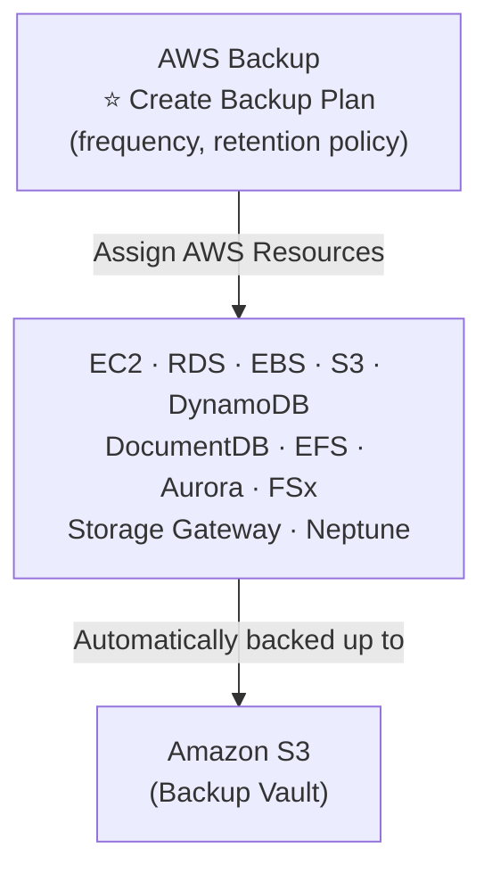

> ⭐⭐⭐ **Từ khóa nhận diện: "quản lý backup tập trung xuyên nhiều dịch vụ, không viết script"** → **AWS Backup**.

---

### ⭐⭐⭐ AWS Backup Vault Lock

- ⭐⭐⭐ **THỰC THI trạng thái WORM (Write Once Read Many) cho TẤT CẢ backup lưu trong AWS Backup Vault**
- ⭐⭐⭐ **Lớp phòng thủ BỔ SUNG bảo vệ backup khỏi:**
  - **Thao tác XÓA vô tình hoặc ÁC Ý**
  - **Cập nhật LÀM NGẮN hoặc thay đổi retention period**
- ⚠️⭐⭐⭐ **NGAY CẢ ROOT USER cũng KHÔNG XÓA được backup khi tính năng này được bật**

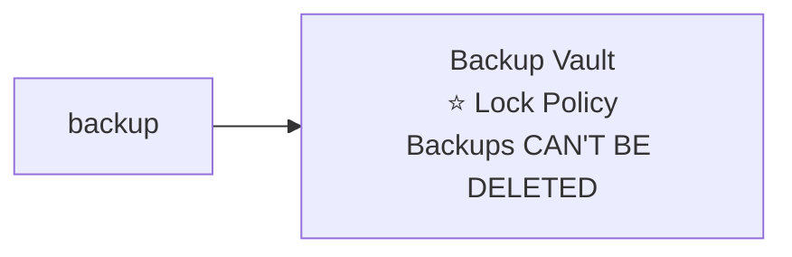

> ⭐⭐⭐ **Từ khóa nhận diện: "root user không xóa được", "WORM", "bảo vệ backup khỏi ransomware/nhân viên ác ý"** → **AWS Backup Vault Lock**. So sánh với **S3 Object Lock** (chương 14) — cùng triết lý WORM nhưng áp dụng ở tầng khác.

---

## 358. AWS Backup - Hands On

> 🖐️ Bài Hands On — **không có slide, không có code kèm theo**. Các bước Console.

### Bước 1 — Tạo Backup Vault

1. Console → **AWS Backup** → **Backup vaults** → **Create Backup vault**
2. **Backup vault name**: `demo-backup-vault`
3. ⭐⭐ **Encryption key**: `aws/backup` (mặc định) hoặc KMS key riêng
4. **Create Backup vault**

### Bước 2 — Tạo Backup Plan ⭐⭐⭐

1. **Backup plans** → **Create Backup plan**
2. ⭐⭐ **Build a new plan**, hoặc **Start with a template** (AWS có sẵn mẫu như `Daily-35day-Retention`)
3. **Backup plan name**: `demo-backup-plan`
4. ⭐⭐⭐ **Backup rule configuration**:

| Trường | Giá trị mẫu |
|---|---|
| **Rule name** | `DailyBackup` |
| **Backup vault** | `demo-backup-vault` |
| ⭐⭐⭐ **Backup frequency** | **Daily** (hoặc cron expression) |
| ⭐⭐ **Backup window** | mặc định (bắt đầu 5 giờ sáng UTC, kéo dài 8 giờ) |
| ⭐⭐⭐ **Lifecycle → Transition to cold storage** | ví dụ **30 days** |
| ⭐⭐⭐ **Lifecycle → Retention period** | ví dụ **120 days** |

5. **Create plan**

### Bước 3 — Gán tài nguyên vào Plan ⭐⭐⭐

1. Chọn plan vừa tạo → **Assign resources**
2. **Resource assignment name**: `demo-assignment`
3. ⭐⭐⭐ **Define resource selection**:

| Cách | Ghi chú |
|---|---|
| ⭐⭐⭐ **Include specific resource types** | Chọn thủ công EC2/RDS/EFS… |
| ⭐⭐⭐ **Include resources by TAG** | ví dụ `Backup=true` — ⭐ **TAG-BASED** |

4. **IAM role**: dùng **Default role** (AWS tự tạo)
5. **Assign resources**

### Bước 4 — On-Demand Backup

1. **Protected resources** → chọn một tài nguyên → **Create on-demand backup**
2. Chọn **Backup vault**, **Retention period** → **Create on-demand backup**

### Bước 5 — Kiểm chứng và Restore

1. Tab **Jobs** → xem trạng thái **Backup jobs**: `CREATED` → `RUNNING` → `COMPLETED`
2. **Backup vaults** → chọn vault → chọn recovery point → **Restore**
3. Chọn cấu hình restore (ví dụ: tạo EC2/RDS mới từ backup)

### Bước 6 — Bật Vault Lock (tùy chọn, cẩn thận)

1. Chọn Backup vault → **Backup vault lock**
2. ⚠️⭐⭐⭐ **Đọc kỹ cảnh báo: sau khi khóa, KHÔNG AI xóa được backup, kể cả root** — có **cooling-off period** trước khi khóa vĩnh viễn

### CLI

```bash
aws backup create-backup-vault --backup-vault-name demo-backup-vault

aws backup create-backup-plan --backup-plan file://plan.json

aws backup start-backup-job \
  --backup-vault-name demo-backup-vault \
  --resource-arn arn:aws:ec2:us-east-1:123456789012:instance/i-0123456789 \
  --iam-role-arn arn:aws:iam::123456789012:role/service-role/AWSBackupDefaultServiceRole
```

> ⚠️ **CHI PHÍ:** AWS Backup tính phí theo **dung lượng backup lưu trữ + restore**, **không có Free Tier riêng** ngoài free tier của dịch vụ gốc (ví dụ EBS snapshot free tier). Nhớ **xóa on-demand backup và backup plan** sau khi học — đừng bật Vault Lock cho môi trường test vì **không xóa được**.

---

## 359. Application Migration Service (MGN)

### ⭐⭐⭐ AWS Application Migration Service (MGN)

- ⭐⭐⭐ **"PHIÊN BẢN TIẾN HÓA" của CloudEndure Migration, THAY THẾ AWS Server Migration Service (SMS)**
- ⭐⭐⭐ **Giải pháp LIFT-AND-SHIFT (rehost) giúp ĐƠN GIẢN HÓA việc migrate ứng dụng vào AWS**
- ⭐⭐⭐ **CHUYỂN ĐỔI server vật lý, ảo, và trên cloud để CHẠY NATIVE trên AWS**
- ⭐⭐⭐ **Hỗ trợ RẤT NHIỀU nền tảng, hệ điều hành, và database**
- ⭐⭐⭐ **DOWNTIME TỐI THIỂU, GIẢM chi phí**

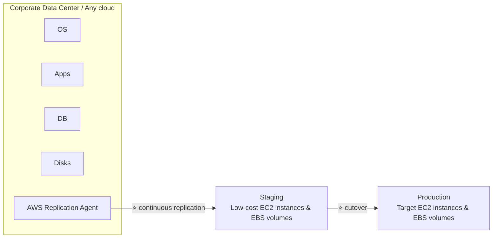

> ⭐⭐⭐ **SO SÁNH MGN vs DRS (bài 352) — DỄ NHẦM NHẤT CHƯƠNG:**
>
> | | ⭐⭐⭐ **MGN (Application Migration Service)** | ⭐⭐⭐ **DRS (Elastic Disaster Recovery)** |
> |---|---|---|
> | **Mục đích** | ⭐⭐⭐ **MIGRATE VĨNH VIỄN sang AWS** (rồi TẮT nguồn đi) | ⭐⭐⭐ **DỰ PHÒNG — nguồn VẪN CHẠY, chỉ dùng AWS khi có thảm họa** |
> | **Kết thúc bằng** | ⭐⭐⭐ **`cutover`** (chuyển hẳn, một lần) | ⭐⭐⭐ **`failover` / `failback`** (chuyển qua lại được) |
> | **Kiến trúc nền** | **GIỐNG HỆT NHAU** (cùng "AWS Replication Agent", cùng staging low-cost) | **GIỐNG HỆT NHAU** |
> | **Khi nào dùng** | *"Muốn NGƯNG dùng on-premises, chuyển hẳn sang AWS"* | *"Muốn GIỮ on-premises, chỉ AWS làm backup khi sự cố"* |
>
> ⭐⭐⭐ **Hai dịch vụ có sơ đồ GẦN NHƯ Y HỆT (cùng công nghệ replication liên tục từ CloudEndure), chỉ khác Ở MỤC ĐÍCH SỬ DỤNG CUỐI CÙNG.** Đây là câu hỏi thi rất hay gặp — đọc kỹ đề xem công ty có ý định **rời bỏ on-premises hẳn (MGN)** hay **giữ on-premises và chỉ cần backup (DRS)**.

---

## 360. Transferring Large Datasets into AWS

### ⭐⭐⭐ Ví dụ tính toán: transfer 200 TB qua các phương án

> ⭐⭐⭐ **Đây là bài toán ĐỊNH LƯỢNG rất hay ra thi — phải thuộc công thức và biết ước lượng.**

**Giả định: chuyển 200 TB dữ liệu, đường truyền Internet 100 Mbps.**

| Phương án | Công thức | Kết quả |
|---|---|---|
| ⭐⭐⭐ **Qua Internet / Site-to-Site VPN** | **200(TB)×1000(GB)×1000(MB)×8(Mb) / 100 Mbps** | ⭐⭐⭐ **= 16.000.000 giây ≈ 185 NGÀY** |
| ⭐⭐⭐ **Qua Direct Connect 1 Gbps** | **200(TB)×1000(GB)×8(Gb) / 1 Gbps** | ⭐⭐⭐ **= 1.600.000 giây ≈ 18.5 NGÀY** |
| ⭐⭐⭐ **Qua Snowball** | — | ⭐⭐⭐ **~1 TUẦN cho toàn bộ quá trình end-to-end** |

**Đặc điểm từng phương án:** ⭐⭐⭐

| Phương án | Ưu / nhược |
|---|---|
| ⭐⭐⭐ **Internet/VPN** | **THIẾT LẬP TỨC THÌ**, nhưng **CHẬM KHỦNG KHIẾP** cho dữ liệu lớn |
| ⭐⭐⭐ **Direct Connect** | **THIẾT LẬP LÂU** (hơn 1 tháng lần đầu), nhưng **NHANH HƠN NHIỀU** cho truyền liên tục |
| ⭐⭐⭐ **Snowball** | **NHANH NHẤT cho dữ liệu KHỐI LƯỢNG LỚN một lần**, ⭐ **CÓ THỂ KẾT HỢP VỚI DMS** |

- ⭐⭐⭐ **Cho REPLICATION/TRANSFER LIÊN TỤC (on-going): dùng Site-to-Site VPN hoặc DX KẾT HỢP với DMS hoặc DataSync**

> ⭐⭐⭐ **BA BÀI HỌC RÚT RA — ĐÂY LÀ TRỌNG TÂM CỦA BÀI 360:**
> 1. **185 ngày qua Internet** chứng minh quy tắc **"nếu mất hơn 1 tuần → dùng Snowball"** (đã học ở chương 16, bài 173) bằng con số cụ thể
> 2. **Direct Connect NHANH HƠN 10 LẦN** Internet thường (18.5 ngày vs 185 ngày) nhưng **THIẾT LẬP LẦN ĐẦU rất lâu** — chỉ đáng đầu tư nếu cần **truyền liên tục lâu dài**
> 3. **Cho dữ liệu MỘT LẦN, KHỐI LƯỢNG LỚN → Snowball**; **cho ĐỒNG BỘ LIÊN TỤC → VPN/DX + DMS/DataSync**
>
> ⭐⭐⭐ **Câu hỏi thi điển hình:** *"Công ty có 150 TB dữ liệu, đường truyền 50 Mbps, cần chuyển MỘT LẦN nhanh nhất có thể"* → tính nhẩm ra **hàng trăm ngày qua mạng** → **Snowball**.

---

## 361. VMware Cloud on AWS

### ⭐⭐⭐ VMware Cloud on AWS

- ⭐⭐⭐ **Một số khách hàng dùng VMware Cloud để quản lý Data Center on-premises**
- ⭐⭐⭐ **Họ muốn MỞ RỘNG NĂNG LỰC Data Center sang AWS, NHƯNG VẪN TIẾP TỤC dùng phần mềm VMware Cloud**
- ⭐⭐⭐ **→ VMware Cloud on AWS ra đời để giải quyết đúng nhu cầu này**

**Use cases:** ⭐⭐⭐

| Use case |
|---|
| ⭐⭐⭐ **Migrate workload dựa trên VMware vSphere sang AWS** |
| ⭐⭐ **Chạy production workload xuyên VMware vSphere trên môi trường private, public, và hybrid cloud** |
| ⭐⭐⭐ **Có một chiến lược DISASTER RECOVERY** |

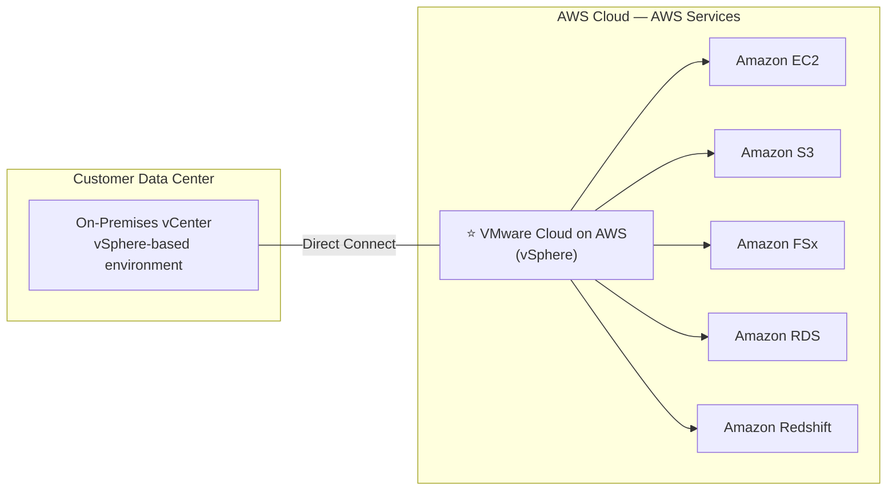

> ⭐⭐⭐ **Câu định vị PHẢI THUỘC:** **"VMware Cloud on AWS = chạy VMware vSphere THẬT trên hạ tầng AWS."**
>
> ⭐⭐⭐ **Từ khóa nhận diện: "công ty đã dùng VMware vSphere, muốn di chuyển KHÔNG PHẢI VIẾT LẠI/KHÔNG ĐỔI CÔNG CỤ QUẢN LÝ"** → **VMware Cloud on AWS**. Đây là use case **"migrate KHÔNG cần thay đổi tooling"** — tương tự tinh thần **Amazon MQ** (chương 17, "ít thay đổi code nhất") nhưng ở tầng hạ tầng ảo hóa thay vì messaging.

---

## 🧭 Cheat Sheet toàn chương ⭐⭐⭐

| Từ khóa trong đề | Đáp án |
|---|---|
| *"lượng dữ liệu mất tối đa chấp nhận được"* | **RPO** |
| *"thời gian ngưng hoạt động tối đa chấp nhận được"* | **RTO** |
| *"chỉ có snapshot, restore khi cần, rẻ nhất"* | **Backup and Restore** |
| *"DB chạy sẵn, app server thì không"* | **Pilot Light** |
| *"toàn hệ thống chạy sẵn ở mức tối thiểu, scale khi sự cố"* | **Warm Standby** |
| *"RTO vài phút/giây, active-active, rất đắt"* | **Hot Site / Multi Site** |
| *"bảo vệ server on-premises khỏi ransomware, continuous block-level replication"* | **AWS Elastic Disaster Recovery (DRS)** — tên cũ **CloudEndure Disaster Recovery** |
| *"migrate database, nguồn vẫn hoạt động trong suốt quá trình"* | **DMS (Database Migration Service)** |
| *"đổi engine database (Oracle → Aurora)"* | **AWS Schema Conversion Tool (SCT) + DMS** |
| ⚠️ *"migrate cùng engine (PostgreSQL → RDS PostgreSQL)"* | **KHÔNG cần SCT**, chỉ cần DMS |
| *"DMS Multi-AZ mang lại lợi ích gì"* | **Data Redundancy, loại bỏ I/O freeze, giảm latency spike** |
| *"RDS MySQL → Aurora MySQL nhanh nhất"* | **DB Snapshot restore** hoặc **Read Replica → promote** |
| *"External MySQL → Aurora nhanh hơn mysqldump"* | **Percona XtraBackup → S3 → import** |
| *"External PostgreSQL → Aurora"* | **Backup → S3 → extension `aws_s3`** |
| *"cả 2 DB đang chạy, cần downtime tối thiểu"* | **DMS** |
| *"thu thập info server on-premises để lập kế hoạch migration"* | **AWS Application Discovery Service** (Agentless / Agent-based) |
| *"theo dõi tiến độ migration"* | **AWS Migration Hub** |
| *"di chuyển TOÀN BỘ server (không chỉ DB) sang AWS, lift-and-shift"* | **AWS Application Migration Service (MGN)** |
| ⭐⭐ *"phân biệt MGN vs DRS"* | **MGN = migrate VĨNH VIỄN (cutover); DRS = DỰ PHÒNG (failover/failback)** |
| *"quản lý backup tập trung xuyên nhiều dịch vụ AWS"* | **AWS Backup** |
| *"backup policy theo tag"* | **AWS Backup — Tag-based backup policies** |
| *"root user cũng không xóa được backup"* | **AWS Backup Vault Lock (WORM)** |
| *"tải AMI Amazon Linux dưới dạng VM"* | **VM Import/Export** |
| *"chuyển 200 TB qua Internet 100 Mbps mất bao lâu"* | **≈ 185 ngày** — công thức **TB×1000×1000×8/Mbps** |
| *"chuyển dữ liệu lớn MỘT LẦN, nhanh nhất"* | **Snowball** (nếu > 1 tuần qua mạng) |
| *"đồng bộ/transfer LIÊN TỤC dữ liệu lớn"* | **Site-to-Site VPN hoặc Direct Connect + DMS/DataSync** |
| *"công ty dùng VMware vSphere, muốn mở rộng lên AWS không đổi tooling"* | **VMware Cloud on AWS** |

---

## Trắc nghiệm 25: Disaster Recovery & Migration Quiz

### Các điểm dễ bị bẫy

| Câu hỏi thường gặp | Đáp án đúng | Vì sao đáp án khác sai |
|---|---|---|
| RPO đo cái gì? | ⭐⭐⭐ **Lượng DỮ LIỆU MẤT tối đa** | RTO đo **THỜI GIAN downtime** — hai khái niệm rất hay bị đảo ngược |
| Chiến lược DR rẻ nhất? | ⭐⭐⭐ **Backup and Restore** | RTO/RPO cao nhất trong 4 chiến lược |
| Chiến lược DR đắt nhất, RTO thấp nhất? | ⭐⭐⭐ **Hot Site / Multi Site** — active-active | |
| Pilot Light khác Warm Standby ở đâu? | **Pilot Light: CHỈ DB chạy. Warm Standby: TOÀN HỆ THỐNG chạy ở mức tối thiểu** | |
| CloudEndure Disaster Recovery tên mới là gì? | ⭐⭐⭐ **AWS Elastic Disaster Recovery (DRS)** | |
| DRS replicate ở mức nào? | **Block-level, liên tục (theo giây)** | |
| DMS database nguồn có phải dừng không? | ❌⭐⭐⭐ **KHÔNG — vẫn hoạt động trong suốt** | |
| Migrate Oracle sang Aurora MySQL cần công cụ gì? | ⭐⭐⭐ **DMS + SCT** (khác engine) | |
| Migrate on-premises PostgreSQL sang RDS PostgreSQL cần SCT không? | ❌⭐⭐⭐ **KHÔNG — cùng engine, chỉ cần DMS** | |
| DMS hỗ trợ target nào ngoài database? | ⭐⭐⭐ **Redshift, DynamoDB, S3, Kinesis Data Streams, Kafka** | Không chỉ database truyền thống |
| DMS Multi-AZ dùng cơ chế gì? | **Synchronous replication sang standby ở AZ khác** | |
| RDS MySQL sang Aurora MySQL nhanh nhất? | **DB Snapshot restore** hoặc **Read Replica promote** | |
| External MySQL sang Aurora, cách nào nhanh hơn mysqldump? | ⭐⭐⭐ **Percona XtraBackup qua S3** | |
| Thu thập info server để lập kế hoạch migration, không di chuyển gì? | ⭐⭐⭐ **AWS Application Discovery Service** | Không phải DMS hay MGN |
| Theo dõi kết quả Discovery Service ở đâu? | **AWS Migration Hub** | |
| Di chuyển toàn bộ server on-premises (không riêng DB)? | ⭐⭐⭐ **AWS MGN (Application Migration Service)** | DMS chỉ database |
| MGN thay thế dịch vụ cũ nào? | **AWS Server Migration Service (SMS)**, tiến hóa từ **CloudEndure Migration** | |
| MGN và DRS khác nhau ở mục đích gì? | ⭐⭐⭐ **MGN = migrate vĩnh viễn (cutover); DRS = dự phòng (failover/failback)** | Kiến trúc kỹ thuật GIỐNG NHAU |
| AWS Backup hỗ trợ cross-region không? | ✅ **CÓ**, và cả **cross-account** | |
| AWS Backup Vault Lock ngăn được ai xóa backup? | ⭐⭐⭐ **NGAY CẢ ROOT USER** | |
| Backup policy dựa trên tag gọi là gì? | **Tag-based backup policies** | |
| Chuyển 200 TB qua Internet 100 Mbps mất khoảng bao lâu? | ⭐⭐⭐ **≈ 185 ngày** | |
| Chuyển 200 TB qua Direct Connect 1 Gbps mất khoảng bao lâu? | ⭐⭐⭐ **≈ 18.5 ngày** | Nhanh hơn Internet ~10 lần nhưng setup lâu hơn 1 tháng |
| Chuyển dữ liệu lớn một lần nhanh nhất? | ⭐⭐⭐ **Snowball (~1 tuần)** | Kết hợp được với DMS |
| Đồng bộ liên tục dữ liệu lớn dùng gì? | **Site-to-Site VPN/DX + DMS hoặc DataSync** | |
| VMware Cloud on AWS dùng cho ai? | ⭐⭐⭐ **Khách hàng đã dùng VMware vSphere, muốn mở rộng lên AWS mà KHÔNG đổi tooling** | |
| VMware Cloud on AWS kết nối bằng gì? | **Direct Connect** | |

---

### Checklist tự kiểm tra trước khi làm quiz

**Chiến lược DR (351–352):**
- [ ] Phân biệt tức thì **RPO (mất dữ liệu)** vs **RTO (mất thời gian)**
- [ ] ⭐⭐⭐ Thuộc **4 chiến lược DR theo thứ tự RTO giảm dần/chi phí tăng dần**: Backup & Restore → Pilot Light → Warm Standby → Hot Site/Multi Site
- [ ] Vẽ lại được sơ đồ của từng chiến lược (cái gì "running", cái gì "not running")
- [ ] Nhớ **AWS Elastic Disaster Recovery (DRS)** = tên mới của **CloudEndure Disaster Recovery**

**Migration database (353–355):**
- [ ] Nhớ **DMS: nguồn vẫn hoạt động, dùng CDC, cần EC2 replication instance**
- [ ] ⭐⭐⭐ Nhớ quy tắc **SCT chỉ cần khi ĐỔI ENGINE**, không cần nếu cùng engine
- [ ] Nhớ DMS hỗ trợ target **rộng hơn database thường** (Redshift, DynamoDB, Kinesis, Kafka)
- [ ] Nhớ 2 cách **RDS→Aurora cùng engine**: Snapshot restore / Read Replica promote
- [ ] Nhớ **Percona XtraBackup (MySQL)** và **extension `aws_s3` (PostgreSQL)** cho nguồn ngoài AWS

**Migration hạ tầng & Backup (356–361):**
- [ ] ⭐⭐⭐ Phân biệt **Application Discovery Service (chỉ thu thập info)** vs **DMS (chỉ DB)** vs **MGN (cả server)**
- [ ] Nhớ **AWS Backup hỗ trợ cross-region & cross-account**, có **Vault Lock (WORM, kể cả root)**
- [ ] ⭐⭐⭐ Phân biệt **MGN (migrate vĩnh viễn, cutover)** vs **DRS (dự phòng, failover/failback)** — kiến trúc kỹ thuật giống hệt nhau
- [ ] ⭐⭐⭐ Thuộc công thức tính thời gian transfer và **quy tắc >1 tuần → Snowball**
- [ ] Nhớ **VMware Cloud on AWS** cho khách hàng muốn giữ nguyên tooling VMware vSphere

---

## Thuật ngữ Anh — Việt

| Tiếng Anh | Tiếng Việt |
|---|---|
| Disaster | Thảm họa, sự kiện gây gián đoạn |
| Disaster Recovery (DR) | Khôi phục sau thảm họa |
| Business continuity | Tính liên tục hoạt động kinh doanh |
| Recovery Point Objective (RPO) | Mục tiêu điểm khôi phục (lượng dữ liệu mất tối đa) |
| Recovery Time Objective (RTO) | Mục tiêu thời gian khôi phục (downtime tối đa) |
| Downtime | Thời gian ngừng hoạt động |
| Data loss | Mất dữ liệu |
| Backup and Restore | Sao lưu và khôi phục |
| Pilot Light | Chiến lược DR mức tối thiểu (chỉ lõi chạy sẵn) |
| Warm Standby | Chiến lược DR chạy sẵn ở quy mô nhỏ |
| Hot Site / Multi Site | Chiến lược DR chạy song song đầy đủ |
| Active-Active | Cả hai phía cùng hoạt động |
| Failover | Chuyển sang hệ thống dự phòng |
| Failback | Chuyển ngược lại hệ thống gốc |
| Data Replication | Sao chép dữ liệu |
| Chaos Engineering | Kỹ thuật chủ động gây lỗi để kiểm thử độ bền |
| Elastic Disaster Recovery (DRS) | Dịch vụ khôi phục thảm họa đàn hồi của AWS |
| Continuous block-level replication | Sao chép liên tục ở mức khối dữ liệu |
| Staging | Môi trường trung gian trước khi chuyển production |
| Database Migration Service (DMS) | Dịch vụ di chuyển cơ sở dữ liệu |
| Homogeneous migration | Di chuyển cùng loại engine |
| Heterogeneous migration | Di chuyển khác loại engine |
| Change Data Capture (CDC) | Bắt và đồng bộ các thay đổi dữ liệu |
| Replication Instance | Instance thực hiện tác vụ sao chép |
| Schema Conversion Tool (SCT) | Công cụ chuyển đổi lược đồ cơ sở dữ liệu |
| Full load | Nạp toàn bộ dữ liệu một lần |
| Synchronous replication | Sao chép đồng bộ |
| I/O freeze | Đóng băng vào/ra dữ liệu |
| Latency spikes | Đợt tăng vọt độ trễ |
| Read Replica | Bản sao chỉ đọc |
| Promote | Thăng cấp thành bản chính |
| Percona XtraBackup | Công cụ sao lưu file cho MySQL |
| mysqldump | Công cụ xuất dữ liệu MySQL dạng lệnh SQL |
| VM Import / Export | Nhập/xuất máy ảo |
| AWS Application Discovery Service | Dịch vụ khám phá hạ tầng on-premises |
| Agentless / Agent-based Discovery | Khám phá không cần agent / cần cài agent |
| Dependency mapping | Ánh xạ phụ thuộc giữa các hệ thống |
| AWS Migration Hub | Trung tâm theo dõi tiến trình di chuyển |
| Application Migration Service (MGN) | Dịch vụ di chuyển ứng dụng của AWS |
| Lift-and-shift (rehost) | Bê nguyên ứng dụng sang cloud không sửa |
| Cutover | Thời điểm chuyển hẳn sang hệ thống mới |
| AWS Backup | Dịch vụ sao lưu tập trung của AWS |
| Backup Plan | Kế hoạch sao lưu |
| Backup Vault | Kho lưu trữ bản sao lưu |
| Point-In-Time Recovery (PITR) | Khôi phục về một thời điểm bất kỳ |
| On-Demand / Scheduled backups | Sao lưu theo yêu cầu / theo lịch |
| Tag-based backup policies | Chính sách sao lưu dựa trên nhãn |
| Cross-region / Cross-account backup | Sao lưu xuyên vùng / xuyên tài khoản |
| WORM (Write Once Read Many) | Ghi một lần, đọc nhiều lần |
| Backup Vault Lock | Khóa kho sao lưu chống xóa |
| Retention Period | Thời gian giữ lại dữ liệu |
| Cold Storage transition | Chuyển sang lưu trữ lạnh giá rẻ |
| VMware Cloud on AWS | Dịch vụ chạy VMware vSphere trên hạ tầng AWS |
| vSphere | Nền tảng ảo hóa của VMware |
| vCenter | Công cụ quản lý trung tâm của VMware |
| Direct Connect | Kết nối mạng riêng chuyên dụng tới AWS |

---

*Ghi chú: các phần Hands On (bài 354, 358) được tóm tắt lại các bước thao tác chính trên AWS Console — giao diện có thể thay đổi theo thời gian, logic và khái niệm vẫn giữ nguyên. Chương này **không có thư mục code riêng** trong `code_v2025-10-27/`; các lệnh CLI trong file là bổ sung thực hành. 📎 **Bài 351 có đính kèm whitepaper chính thức `disaster-recovery-workloads-on-aws.pdf`** — không được trích vào file này vì là tài liệu ngoài slide bài giảng, nhưng nội dung 4 chiến lược DR trong file đã bám sát đầy đủ slide gốc. ⚠️ **CẢNH BÁO CHI PHÍ:** **DMS replication instance tính phí theo giờ như EC2** (bài 354) — không có Free Tier lâu dài, nhớ xóa replication instance/endpoint/task sau khi học. **AWS Backup không có Free Tier riêng** ngoài free tier của dịch vụ gốc (bài 358) — và **tuyệt đối không bật Vault Lock cho môi trường test** vì backup sẽ **không thể xóa được, kể cả bởi root user**. 💡 **Ghi chú quan trọng về nhận diện đề thi:** chương này có **hai cặp khái niệm cực dễ nhầm** mà tôi đã tách thành bảng riêng để so sánh trực tiếp: **(1) DMS vs MGN vs Application Discovery Service** — phạm vi di chuyển khác nhau (chỉ DB / cả server / chỉ thu thập info); **(2) MGN vs DRS** — hai dịch vụ dùng chung công nghệ replication từ CloudEndure nhưng khác nhau ở MỤC ĐÍCH CUỐI CÙNG (di cư vĩnh viễn vs dự phòng thảm họa). ⭐ **Lời khuyên ôn thi: bảng 4 chiến lược DR ở bài 351 và công thức tính thời gian transfer dữ liệu ở bài 360 là hai nội dung đáng học thuộc nhất chương** — cả hai đều xuất hiện dưới dạng câu hỏi tình huống rất phổ biến trong đề thi SAA-C03 thực tế.*
