# Phần 29 — More Solution Architectures

> Khóa học: *Ultimate AWS Certified Solutions Architect Associate 2026* (Stéphane Maarek) — SAA-C03
> Nguồn tham chiếu: `AWS Certified Solutions Architect Slides v48.pdf` (phần "More Solutions Architectures" — trang 802–823)

---

## Mục lục

| # | Bài giảng | Thời lượng | Loại |
|---|-----------|-----------|------|
| 362 | [Event Processing in AWS](#362-event-processing-in-aws) | 6 phút | Video |
| 363 | [Caching Strategies in AWS](#363-caching-strategies-in-aws) | 3 phút | Video |
| 364 | [Blocking an IP Address in AWS](#364-blocking-an-ip-address-in-aws) | 5 phút | Video |
| 365 | [High Performance Computing (HPC) on AWS](#365-high-performance-computing-hpc-on-aws) | 7 phút | Video |
| 366 | [EC2 Instance High Availability](#366-ec2-instance-high-availability) | 7 phút | Video |
| — | [Trắc nghiệm 26: More Solution Architectures Quiz](#trắc-nghiệm-26-more-solution-architectures-quiz) | — | Quiz |

---

> 📌 **Đọc trước khi vào chương:** Đây là chương **NGẮN nhưng gom lại 5 mẫu kiến trúc ĐỘC LẬP** — mỗi bài là một "cookbook recipe" riêng biệt, không liên quan trực tiếp tới nhau. Điểm chung: **đều là các tình huống kiến trúc THỰC TẾ mà SAA-C03 rất thích hỏi dưới dạng "công ty X cần Y, thiết kế thế nào?"**.
>
> ⭐⭐⭐ **Ba bài quan trọng nhất:** **362 (Event Processing)** — ôn lại toàn bộ pattern nhắn tin của khóa học; **364 (Blocking an IP)** — bài này xây dựng LŨY TIẾN qua 5 sơ đồ, cực kỳ hay ra thi; **366 (EC2 High Availability)** — mẹo kiến trúc "di chuyển Elastic IP" kinh điển.

---

## 362. Event Processing in AWS

Bài này **ôn lại và hệ thống hóa** các pattern xử lý sự kiện đã học rải rác ở chương 17, 19, 20, 22 — trình bày dưới dạng **sơ đồ so sánh trực tiếp**.

---

### ⭐⭐⭐ Lambda, SNS & SQS — Ba pattern retry/DLQ

**1️⃣ SQS + Lambda:**

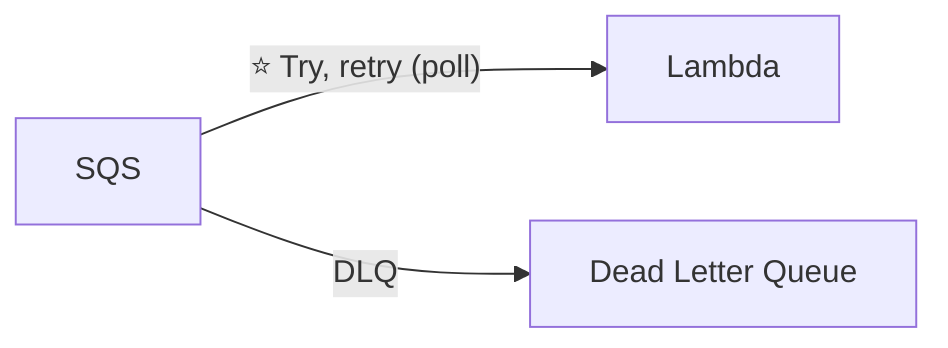

**2️⃣ SQS FIFO + Lambda:**

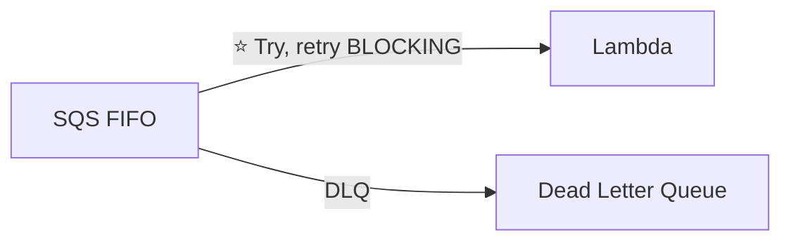

**3️⃣ SNS + Lambda:**

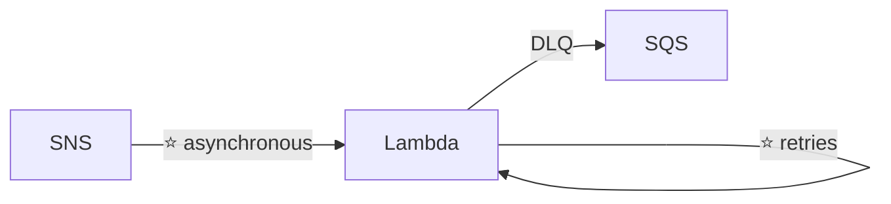

> ⭐⭐⭐ **BA ĐIỂM RA THI CỦA SƠ ĐỒ NÀY:**
> - **SQS + Lambda**: Lambda **POLL** message (kéo), retry bình thường
> - ⚠️⭐⭐⭐ **SQS FIFO + Lambda**: retry là **BLOCKING** — nếu một message lỗi, **CÁC MESSAGE SAU TRONG CÙNG GROUP BỊ CHẶN LẠI** cho tới khi xử lý xong (đúng bản chất FIFO — giữ thứ tự)
> - **SNS + Lambda**: gọi **bất đồng bộ (asynchronous)**, Lambda tự **retry**, thất bại thì rơi vào **DLQ** (thường là một SQS queue)
>
> ⭐⭐⭐ **Đây là điểm bổ sung quan trọng nhất về FIFO mà các chương trước chưa nói rõ:** dùng SQS FIFO với Lambda có thể gây **nghẽn xử lý (blocking)** nếu một message trong group bị lỗi liên tục — cân nhắc kỹ trước khi chọn FIFO cho consumer là Lambda.

---

### ⭐⭐⭐ Fan Out Pattern: deliver to multiple SQS — Hai cách (ôn lại chương 17)

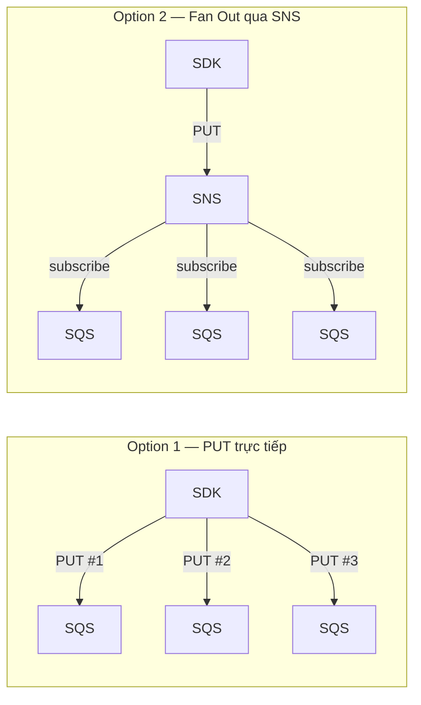

> ⭐⭐⭐ **So sánh trực diện:**
> - **Option 1**: client (SDK) tự **PUT 3 lần** vào 3 queue khác nhau — **CODE PHỨC TẠP HƠN**, client phải biết hết các queue
> - ⭐⭐⭐ **Option 2 (Fan Out)**: client **PUT MỘT LẦN** vào SNS, SNS tự phân phối tới các SQS đã **subscribe** — **ĐƠN GIẢN HƠN, DỄ THÊM QUEUE MỚI** mà không sửa code client
>
> Đây chính là lý do **Fan Out luôn là đáp án ưu tiên** khi đề hỏi cách gửi một sự kiện tới nhiều hệ thống xử lý độc lập.

---

### ⭐⭐⭐ S3 Event Notifications

- ⭐⭐⭐ **Loại sự kiện: `S3:ObjectCreated`, `S3:ObjectRemoved`, `S3:ObjectRestore`, `S3:Replication`…**
- ⭐⭐⭐ **Lọc được theo tên object** (ví dụ `*.jpg`)
- ⭐⭐ **Use case: sinh thumbnail cho ảnh upload lên S3**
- ⭐⭐⭐ **Có thể tạo BAO NHIÊU "S3 events" tùy thích**
- ⭐⭐⭐ **S3 event notification thường giao trong VÀI GIÂY, nhưng ĐÔI KHI có thể mất MỘT PHÚT hoặc lâu hơn**

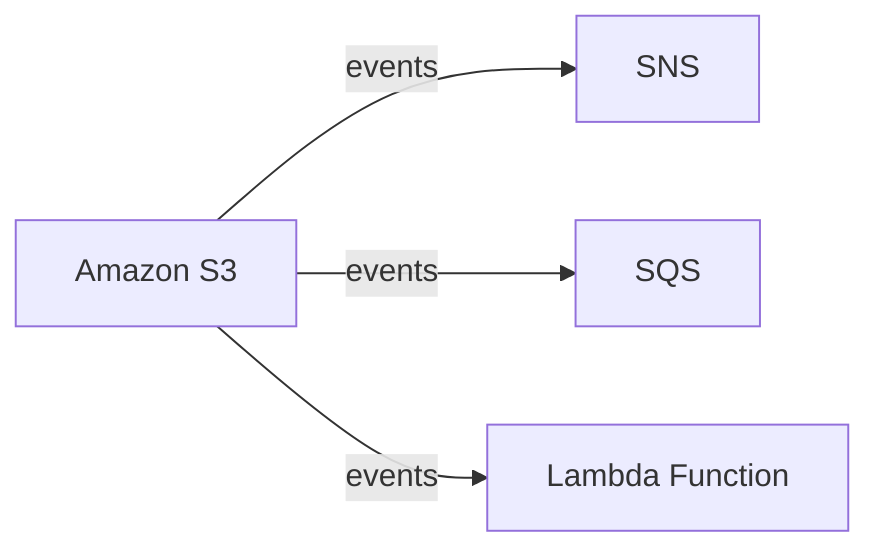

> ⭐⭐⭐ **Con số "vài giây, đôi khi tới 1 phút hoặc hơn" là chi tiết dễ bị bỏ qua nhưng RA THI** — đề hỏi *"S3 event có phải real-time tuyệt đối không?"* → **KHÔNG, thường vài giây nhưng không đảm bảo**.

---

### ⭐⭐⭐ S3 Event Notifications with Amazon EventBridge

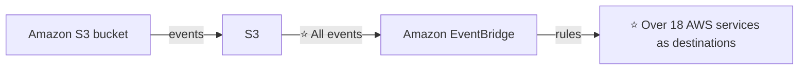

**Ba lợi ích khi đi qua EventBridge thay vì S3 Event Notification trực tiếp:**

| Lợi ích |
|---|
| ⭐⭐⭐ **ADVANCED FILTERING với JSON rules** (metadata, object size, name…) |
| ⭐⭐⭐ **NHIỀU ĐÍCH (Multiple Destinations)** — ví dụ Step Functions, Kinesis Streams/Firehose… |
| ⭐⭐⭐ **EventBridge Capabilities: ARCHIVE, REPLAY Events, RELIABLE delivery** |

> ⭐⭐⭐ **Từ khóa nhận diện:** *"cần lọc S3 event theo metadata/kích thước object"* hoặc *"cần gửi S3 event tới Step Functions"* → **S3 → EventBridge** (S3 Event Notification trực tiếp **không lọc được theo metadata**, chỉ lọc theo tên).

---

### ⭐⭐⭐ Amazon EventBridge – Intercept API Calls (ôn lại chương 24)

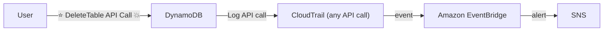

> ⭐⭐⭐ **Pattern quen thuộc: CloudTrail ghi MỌI API call → EventBridge bắt được → cảnh báo qua SNS.** Đây là lần thứ hai khóa học nhắc lại sơ đồ này (lần đầu ở chương 24, bài 279) — chứng tỏ đây là **pattern cực kỳ quan trọng trong đề thi**.

---

### ⭐⭐⭐ API Gateway – AWS Service Integration: Kinesis Data Streams example

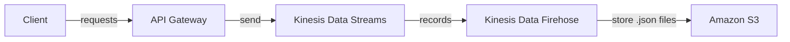

> ⭐⭐⭐ **Đây là kiến trúc "ghi trực tiếp không qua Lambda"** — API Gateway **AWS Service Integration** cho phép proxy thẳng request tới Kinesis mà **không tốn chi phí Lambda**. Đã học ở chương 19 (bài 223), nhắc lại ở đây để củng cố.

---

## 363. Caching Strategies in AWS

### ⭐⭐⭐ Caching Strategies — Sơ đồ tổng hợp TOÀN BỘ các tầng cache trong một request

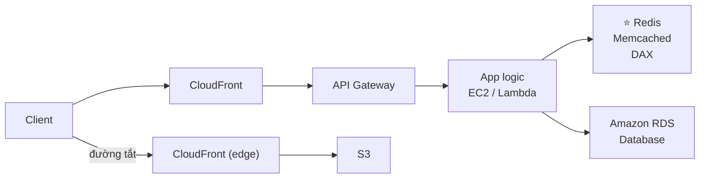

- ⭐⭐⭐ **Request đi qua NHIỀU TẦNG: CloudFront → API Gateway → App logic (EC2/Lambda) → Cache (Redis/Memcached/DAX) → Database**
- ⭐⭐⭐ **Hoặc đi TẮT: CloudFront (edge) → S3 trực tiếp** (cho nội dung tĩnh)
- ⭐⭐⭐ **Trục cân nhắc xuyên suốt: "Caching, TTL, Network, Computation, Cost, Latency"**

> ⭐⭐⭐ **ĐÂY LÀ SLIDE TỔNG HỢP QUAN TRỌNG NHẤT CỦA CHƯƠNG NÀY** — nó gói gọn **TẤT CẢ các tầng cache đã học rải rác** trong một bức tranh duy nhất:
>
> | Tầng cache | Ở đâu trong sơ đồ | Đã học ở chương |
> |---|---|---|
> | ⭐⭐⭐ **CloudFront** | Edge, gần client nhất | Chương 15 |
> | ⭐⭐⭐ **API Gateway Caching** | Ngay sau CloudFront | Chương 19 |
> | ⭐⭐⭐ **Redis / Memcached** | ElastiCache, giữa App và DB | Chương 9 |
> | ⭐⭐⭐ **DAX** | Cache riêng cho DynamoDB | Chương 19, 21 |
> | ⭐⭐⭐ **CloudFront → S3 trực tiếp** | Đường tắt cho static content | Chương 15 |
>
> ⭐⭐⭐ **Nguyên tắc chọn tầng cache trong phòng thi:** **CÀNG GẦN CLIENT (CloudFront) THÌ CÀNG GIẢM LATENCY VÀ TẢI LÊN HẠ TẦNG PHÍA SAU**, nhưng **càng khó invalidate/càng kém "tươi" (less fresh)**. Ngược lại, cache **gần Database (DAX/ElastiCache)** thì **dữ liệu mới hơn** nhưng **không giảm được tải mạng/compute ở tầng trên**.
>
> 💡 **Mẹo thi:** khi đề mô tả một bài toán hiệu năng, hãy tự hỏi: *"cache ở CloudFront được không? Nếu nội dung động quá thì lùi xuống API Gateway. Nếu vẫn cần tính toán mỗi lần thì cache kết quả DB bằng ElastiCache/DAX."*

---

## 364. Blocking an IP Address in AWS

Đây là bài **xây dựng lũy tiến** — bắt đầu từ kiến trúc đơn giản nhất, thêm từng lớp cho tới khi tìm ra giải pháp ĐÚNG. **Cấu trúc này là một trong những bài học phương pháp luận hay nhất của cả khóa.**

---

### ⭐⭐⭐ Bước 1 — Blocking an IP address (kiến trúc cơ bản)

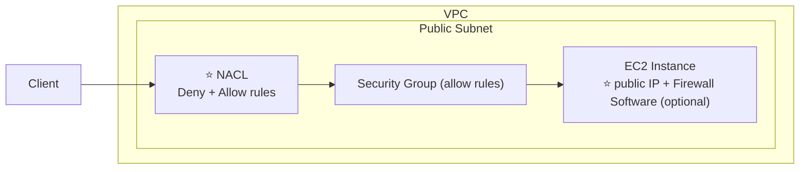

> ⚠️⭐⭐⭐ **ĐIỂM MẤU CHỐT: Security Group KHÔNG CÓ RULE DENY — chỉ có ALLOW.** Vậy muốn **CHẶN một IP cụ thể**, chỉ có **hai lựa chọn** ở tầng VPC cơ bản:
> - ⭐⭐⭐ **NACL** — có Deny + Allow rules
> - ⭐⭐ **Firewall Software chạy TRÊN EC2** (tùy chọn, tự cài) — ví dụ `iptables`
>
> Đây chính là điều đã học ở chương 27 (bài 329), được nhắc lại và **áp dụng vào bài toán cụ thể "chặn một IP"**.

---

### ⭐⭐⭐ Bước 2 — Blocking an IP address – with an ALB

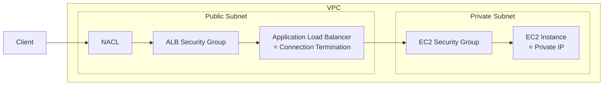

> ⚠️⭐⭐⭐ **VẤN ĐỀ MỚI XUẤT HIỆN:** khi có **ALB**, ALB thực hiện **CONNECTION TERMINATION** — nghĩa là **ALB chấm dứt kết nối TCP từ client rồi tạo kết nối MỚI tới EC2**. Do đó **EC2 Security Group KHÔNG BAO GIỜ nhìn thấy IP GỐC của client** — nó chỉ thấy IP của ALB! → **Không thể chặn IP ở tầng EC2 Security Group được nữa.**
>
> ⭐⭐⭐ **Đây là bước ngoặt của cả bài học:** chứng minh rằng **NACL vẫn còn dùng được** (vì nó nằm TRƯỚC ALB, thấy được IP gốc), nhưng **Security Group của EC2 thì KHÔNG dùng được** cho mục đích này.

---

### ⭐⭐⭐ Bước 3 — Blocking an IP address – with an NLB

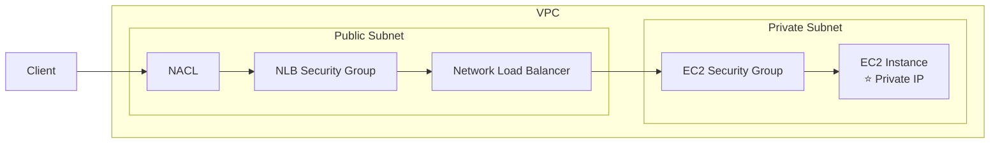

> ⭐⭐⭐ **ĐIỂM KHÁC BIỆT SO VỚI ALB — NLB KHÔNG TERMINATE CONNECTION** (vì hoạt động ở Layer 4, chỉ forward packet). Nghĩa là **NLB CÓ THỂ giữ nguyên source IP gốc** khi chuyển tiếp — do đó với NLB, **về mặt kỹ thuật EC2 Security Group vẫn NHÌN THẤY được IP gốc của client** (nếu bật preserve client IP). Nhưng **Security Group VẪN KHÔNG có rule Deny** — nên vẫn phải dựa vào **NACL** để chặn.

---

### ⭐⭐⭐ Bước 4 — Blocking an IP address – ALB + WAF (GIẢI PHÁP ĐÚNG)

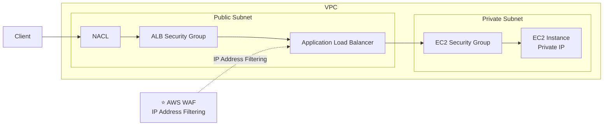

> ⭐⭐⭐ **ĐÂY LÀ CÂU TRẢ LỜI CHUẨN KHI DÙNG ALB: DÙNG AWS WAF GẮN VÀO ALB.**
>
> Vì WAF hoạt động **Ở TẦNG APPLICATION LOAD BALANCER** (trước khi connection bị terminate và forward tới EC2), nó **NHÌN THẤY ĐƯỢC IP gốc của client** trong header HTTP request và **CHẶN ĐƯỢC theo IP Set** (đã học ở chương 26, bài 306).
>
> ⚠️ **Lưu ý:** NLB **KHÔNG hỗ trợ WAF** (đã học ở chương 26) — nên với NLB, **NACL vẫn là lựa chọn duy nhất** để chặn IP.

---

### ⭐⭐⭐ Bước 5 — Blocking an IP address – ALB, CloudFront & WAF (BẪY THI QUAN TRỌNG NHẤT)

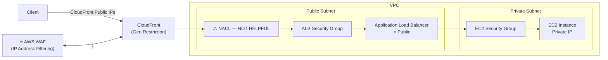

> ⚠️⭐⭐⭐ **ĐÂY LÀ BẪY THI QUAN TRỌNG NHẤT CỦA CẢ BÀI 364 — SLIDE GHI THẲNG "NACL — NOT HELPFUL"!**
>
> Khi client đi **QUA CLOUDFRONT TRƯỚC**, NACL của VPC **chỉ nhìn thấy IP của CÁC EDGE LOCATION CLOUDFRONT** (một dải IP công khai cố định của AWS) — **KHÔNG BAO GIỜ thấy IP thật của client cuối**. Do đó:
>
> - ❌⭐⭐⭐ **NACL trở nên VÔ DỤNG để chặn IP client trong trường hợp này** (vì mọi request đều tới từ IP của CloudFront, không phải IP client)
> - ✅⭐⭐⭐ **PHẢI CHẶN Ở TẦNG CLOUDFRONT**, có hai cách:
>   - ⭐⭐⭐ **CloudFront Geo Restriction** (chặn theo QUỐC GIA — đã học chương 15)
>   - ⭐⭐⭐ **AWS WAF gắn TRỰC TIẾP VÀO CloudFront** (chặn theo IP CỤ THỂ — WAF trên CloudFront luôn ở **`us-east-1`**, đã học chương 15 & 26)
>
> **Câu hỏi thi điển hình:** *"Ứng dụng dùng CloudFront phía trước ALB, cần chặn một IP độc hại cụ thể — dùng NACL được không?"* → ❌ **KHÔNG — NACL chỉ thấy IP của CloudFront.** → ✅ **Phải dùng AWS WAF gắn vào CloudFront Distribution.**

---

### ⭐⭐⭐ BẢNG TỔNG KẾT 5 BƯỚC — HỌC THUỘC

| Kiến trúc | Công cụ chặn IP ĐÚNG | Vì sao |
|---|---|---|
| ⭐⭐⭐ **EC2 trực tiếp (không LB)** | **NACL** hoặc firewall software trên EC2 | SG không có Deny |
| ⭐⭐⭐ **Qua ALB** | **AWS WAF trên ALB** | ALB terminate connection, EC2 SG không thấy IP gốc |
| ⭐⭐⭐ **Qua NLB** | **NACL** | NLB không hỗ trợ WAF; NLB có thể giữ IP gốc nhưng SG vẫn không Deny được |
| ⭐⭐⭐ **Qua CloudFront + ALB** | ⚠️⭐⭐⭐ **WAF trên CloudFront** (hoặc Geo Restriction) | **NACL "NOT HELPFUL"** — chỉ thấy IP của CloudFront edge |

---

## 365. High Performance Computing (HPC) on AWS

### ⭐⭐⭐ High Performance Computing (HPC) — Vì sao Cloud phù hợp

- ⭐⭐⭐ **Cloud là NƠI HOÀN HẢO để thực hiện HPC**
- ⭐⭐⭐ **Có thể tạo RẤT NHIỀU tài nguyên TRONG KHÔNG THỜI GIAN (no time)**
- ⭐⭐⭐ **Có thể TĂNG TỐC thời gian ra kết quả bằng cách THÊM tài nguyên**
- ⭐⭐⭐ **Chỉ trả tiền cho HỆ THỐNG ĐÃ DÙNG**

**Use cases:** ⭐⭐⭐ **genomics, computational chemistry, financial risk modeling, weather prediction, machine learning, deep learning, autonomous driving**

> ⭐⭐⭐ **Câu hỏi trọng tâm của bài này: "Những dịch vụ nào giúp thực hiện HPC?"** — slide trả lời bằng **4 nhóm dịch vụ** dưới đây.

---

### ⭐⭐⭐ Nhóm 1 — Data Management & Transfer

| Dịch vụ | Vai trò |
|---|---|
| ⭐⭐⭐ **AWS Direct Connect** | **Di chuyển GB/s dữ liệu lên cloud, qua mạng RIÊNG TƯ AN TOÀN** |
| ⭐⭐⭐ **Snowball & Snowmobile** | **Di chuyển PB dữ liệu lên cloud** |
| ⭐⭐⭐ **AWS DataSync** | **Di chuyển LƯỢNG LỚN dữ liệu giữa on-premises và S3, EFS, FSx for Windows** |

> ⭐⭐⭐ **Đây chính là sự tổng hợp của các bài đã học ở chương 16, 27, 28** — HPC cần lượng dữ liệu vào ra RẤT LỚN, nên **toàn bộ công cụ transfer dữ liệu lớn đều liên quan**.

---

### ⭐⭐⭐ Nhóm 2 — Compute and Networking

**EC2 Instances:** ⭐⭐⭐

- ⭐⭐⭐ **CPU optimized, GPU optimized**
- ⭐⭐⭐ **Spot Instances / Spot Fleets để TIẾT KIỆM CHI PHÍ + Auto Scaling**

**EC2 Placement Groups:** ⭐⭐⭐ **Cluster cho hiệu năng mạng TỐT**

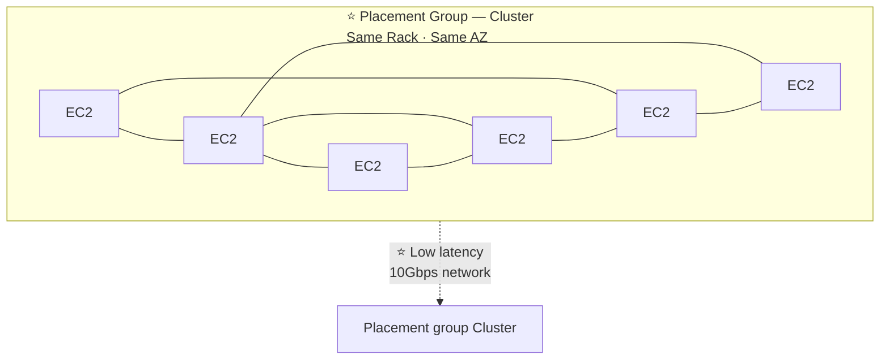

> ⭐⭐⭐ **Nhắc lại từ chương 6: Cluster Placement Group = CÙNG RACK, CÙNG AZ, độ trễ THẤP, băng thông 10Gbps** — đây chính là lựa chọn chuẩn cho HPC vì các node cần giao tiếp với nhau CỰC NHANH (tightly coupled).

**EC2 Enhanced Networking (SR-IOV):** ⭐⭐⭐

- ⭐⭐⭐ **Băng thông CAO HƠN, PPS (packet per second) CAO HƠN, độ trễ THẤP HƠN**
- ⭐⭐⭐ **Option 1: Elastic Network Adapter (ENA) — TỚI 100 Gbps**
- ⭐⭐ **Option 2: Intel 82599 VF — tới 10 Gbps — LEGACY (cũ)**

**Elastic Fabric Adapter (EFA):** ⭐⭐⭐

| Đặc điểm |
|---|
| ⭐⭐⭐ **Phiên bản ENA CẢI TIẾN cho HPC, CHỈ hoạt động trên LINUX** |
| ⭐⭐⭐ **Rất tốt cho GIAO TIẾP GIỮA CÁC NODE (inter-node communications), workload TIGHTLY COUPLED (gắn kết chặt)** |
| ⭐⭐⭐ **Tận dụng chuẩn MESSAGE PASSING INTERFACE (MPI)** |
| ⭐⭐⭐ **BYPASS (bỏ qua) hệ điều hành Linux bên dưới để cung cấp truyền tải ĐỘ TRỄ THẤP, ĐÁNG TIN CẬY** |

> ⭐⭐⭐ **EFA là câu trả lời "chuẩn" nhất cho câu hỏi HPC trong đề thi.** Từ khóa nhận diện: *"tightly coupled workload"*, *"inter-node communication"*, *"Message Passing Interface (MPI)"*, *"bypass OS kernel"* → **Elastic Fabric Adapter (EFA)**.
>
> ⚠️ **Lưu ý: EFA chỉ chạy trên Linux**, không có trên Windows.

---

### ⭐⭐⭐ Nhóm 3 — Storage

**Instance-attached storage:** ⭐⭐⭐

| Loại | Hiệu năng |
|---|---|
| ⭐⭐⭐ **EBS** | **Scale tới 256,000 IOPS với io2 Block Express** |
| ⭐⭐⭐ **Instance Store** | **Scale tới HÀNG TRIỆU IOPS, gắn liền EC2 instance, độ trễ THẤP** |

**Network storage:** ⭐⭐⭐

| Dịch vụ | Đặc điểm |
|---|---|
| ⭐⭐⭐ **Amazon S3** | **Object lớn (large blob), KHÔNG PHẢI file system** |
| ⭐⭐⭐ **Amazon EFS** | **Scale IOPS dựa trên TỔNG DUNG LƯỢNG, hoặc dùng Provisioned IOPS** |
| ⭐⭐⭐ **Amazon FSx for Lustre** | ⭐⭐⭐ **File system phân tán được TỐI ƯU CHO HPC, HÀNG TRIỆU IOPS** ⭐⭐⭐ **Được HẬU THUẪN bởi S3** |

> ⭐⭐⭐ **FSx for Lustre một lần nữa được khẳng định là lựa chọn số một cho HPC** (đã học chương 16) — con số **io2 Block Express 256,000 IOPS** cũng là chi tiết đáng nhớ.

---

### ⭐⭐⭐ Nhóm 4 — Automation and Orchestration

**AWS Batch:** ⭐⭐⭐

- ⭐⭐⭐ **AWS Batch hỗ trợ MULTI-NODE PARALLEL JOBS — cho phép chạy MỘT job SỐNG duy nhất TRẢI RỘNG nhiều EC2 instance**
- ⭐⭐ **DỄ DÀNG lên lịch job và khởi chạy EC2 instance tương ứng**

**AWS ParallelCluster:** ⭐⭐⭐

| Đặc điểm |
|---|
| ⭐⭐⭐ **Công cụ quản lý cluster MÃ NGUỒN MỞ để triển khai HPC trên AWS** |
| ⭐⭐⭐ **Cấu hình bằng FILE TEXT** |
| ⭐⭐⭐ **TỰ ĐỘNG HÓA việc tạo VPC, Subnet, loại cluster và loại instance** |
| ⭐⭐⭐ **Khả năng BẬT EFA trên cluster** (cải thiện hiệu năng mạng) |

> ⭐⭐⭐ **Hai dịch vụ quản lý workload HPC:**
> - **AWS Batch** = chạy **job** (tác vụ đơn lẻ hoặc multi-node parallel)
> - **AWS ParallelCluster** = dựng **TOÀN BỘ hạ tầng cluster** (VPC, subnet, instance type) một cách tự động, mã nguồn mở

---

### 🧭 Bảng tổng hợp 4 nhóm dịch vụ cho HPC ⭐⭐⭐

| Nhóm | Dịch vụ chính |
|---|---|
| ⭐⭐⭐ **Data Management & Transfer** | **Direct Connect, Snowball/Snowmobile, DataSync** |
| ⭐⭐⭐ **Compute and Networking** | **EC2 (CPU/GPU optimized, Spot), Cluster Placement Group, Enhanced Networking (ENA), EFA** |
| ⭐⭐⭐ **Storage** | **EBS io2 Block Express, Instance Store, FSx for Lustre** |
| ⭐⭐⭐ **Automation and Orchestration** | **AWS Batch (multi-node parallel jobs), AWS ParallelCluster** |

---

## 366. EC2 Instance High Availability

Bài này là một **mẹo kiến trúc kinh điển** — dùng Elastic IP để có "HA giả lập" cho một ứng dụng chỉ cần MỘT EC2 instance chạy tại một thời điểm.

---

### ⭐⭐⭐ Bước 1 — Creating a highly available EC2 instance (cơ bản)

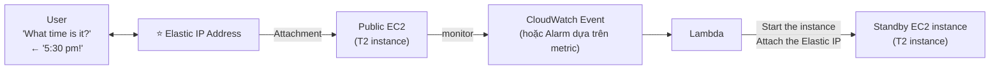

**Cơ chế:** ⭐⭐⭐

1. Client luôn gọi tới **Elastic IP Address** cố định (ví dụ hỏi "What time is it?" luôn nhận "5:30 pm!")
2. Elastic IP **ATTACH** vào EC2 instance ĐANG CHẠY (Public EC2)
3. **CloudWatch giám sát (monitor)** instance đó — bằng **Event hoặc Alarm dựa trên metric**
4. Khi instance chính GẶP SỰ CỐ, CloudWatch **kích hoạt Lambda**
5. Lambda **KHỞI ĐỘNG Standby EC2 instance** và **GẮN LẠI Elastic IP** sang instance đó

> ⭐⭐⭐ **Ý tưởng cốt lõi: KHÁCH HÀNG LUÔN THẤY MỘT ĐỊA CHỈ IP DUY NHẤT (Elastic IP), dù phía sau IP đó có thể "nhảy" (re-attach) giữa nhiều EC2 instance khác nhau.** Đây là kỹ thuật HA **cực rẻ** cho ứng dụng đơn giản, không cần Load Balancer.
>
> ⭐⭐⭐ **Từ khóa nhận diện: "HA cho một instance duy nhất mà không dùng ELB"**, **"failover tự động bằng CloudWatch + Lambda + Elastic IP"** → chính là pattern này.

---

### ⭐⭐⭐ Bước 2 — With an Auto Scaling Group (cải tiến)

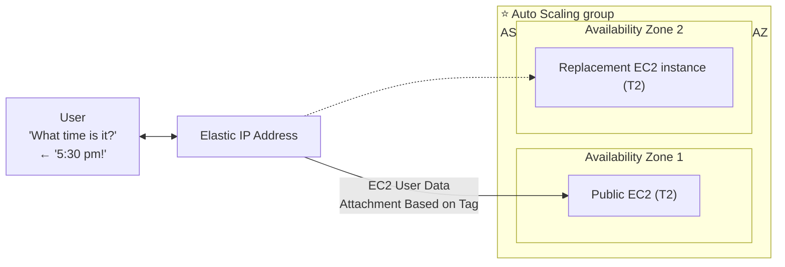

**Cấu hình quan trọng:** ⭐⭐⭐

| Thành phần | Chi tiết |
|---|---|
| ⭐⭐⭐ **ASG Settings** | **1 min, 1 max, 1 desired, ≥ 2 AZ** — LUÔN CHỈ CÓ **ĐÚNG 1** instance chạy, nhưng ASG trải qua **NHIỀU AZ** |
| ⭐⭐⭐ **EC2 User Data** | **Script TỰ ĐỘNG gắn Elastic IP, dựa trên TAG** khi instance khởi động |
| ⭐⭐⭐ **EC2 Instance Role** | **Cho phép gọi API để GẮN (attach) Elastic IP** |

> ⭐⭐⭐ **Cải tiến so với bước 1:** không cần CloudWatch + Lambda thủ công nữa — **Auto Scaling Group TỰ ĐỘNG thay thế instance chết** (vì `desired=1`), và **User Data script TỰ ĐỘNG gắn lại Elastic IP** dựa vào tag khi instance mới khởi động lên. Đơn giản hơn, ít thành phần hơn.
>
> ⭐⭐⭐ **Điểm mấu chốt: ASG với `min=1, max=1, desired=1` trải trên ≥ 2 AZ** — đây là **"ASG cho một instance duy nhất nhưng có HA đa AZ"**, một pattern khá lạ nhưng RA THI.

---

### ⭐⭐⭐ Bước 3 — With ASG + EBS (đầy đủ nhất — bảo toàn cả DỮ LIỆU)

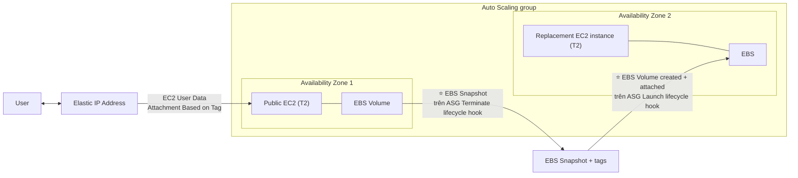

**Cơ chế:** ⭐⭐⭐

| Sự kiện | Hành động |
|---|---|
| ⭐⭐⭐ **ASG TERMINATE lifecycle hook** | **Tạo EBS SNAPSHOT + gắn TAGS** trước khi instance cũ bị xóa |
| ⭐⭐⭐ **ASG LAUNCH lifecycle hook** | **TẠO EBS VOLUME MỚI từ snapshot ĐÓ và GẮN (attach)** vào instance thay thế |

> ⭐⭐⭐ **ĐÂY LÀ PHIÊN BẢN HOÀN CHỈNH NHẤT: KHÔNG CHỈ GIỮ IP, MÀ CÒN GIỮ CẢ DỮ LIỆU TRÊN EBS.**
>
> ⭐⭐⭐ **Khái niệm "ASG Lifecycle Hooks" là chìa khóa của bài này** — cho phép **CHẠY MỘT HÀNH ĐỘNG TÙY CHỈNH** (ở đây là snapshot/restore EBS) **ĐÚNG THỜI ĐIỂM** instance bị terminate hoặc launch, trước khi ASG tiếp tục quy trình chuẩn.
>
> **Câu hỏi thi điển hình:** *"Ứng dụng chạy trên một EC2 duy nhất, cần HA tự động VÀ giữ nguyên dữ liệu trên đĩa khi failover, không dùng EFS"* → **ASG (1/1/1, multi-AZ) + Elastic IP (qua User Data) + EBS Snapshot/Restore qua Lifecycle Hooks**.

---

### 🧭 Tổng kết 3 cấp độ EC2 High Availability ⭐⭐⭐

| Cấp độ | Thành phần | Giữ được gì |
|---|---|---|
| ⭐⭐⭐ **Cơ bản** | Elastic IP + CloudWatch + Lambda | Chỉ giữ **IP cố định** |
| ⭐⭐⭐ **Trung bình** | + Auto Scaling Group (1/1/1, multi-AZ) + User Data | **IP cố định**, **tự động thay instance** |
| ⭐⭐⭐ **Đầy đủ** | + EBS Snapshot/Restore qua Lifecycle Hooks | **IP cố định** + **DỮ LIỆU trên đĩa** |

> 💡 **So sánh với các giải pháp HA khác đã học:** đây là kỹ thuật dùng cho **ứng dụng LEGACY/ĐƠN GIẢN chỉ chấp nhận MỘT instance active tại một thời điểm** (ví dụ license theo IP, ứng dụng stateful không hỗ trợ load balancing) — **khác hẳn** với kiến trúc ELB + ASG nhiều instance song song đã học ở chương 8.

---

## Trắc nghiệm 26: More Solution Architectures Quiz

### Các điểm dễ bị bẫy

| Câu hỏi thường gặp | Đáp án đúng | Vì sao đáp án khác sai |
|---|---|---|
| SQS FIFO + Lambda, một message lỗi thì sao? | ⭐⭐⭐ **Retry BLOCKING — các message sau trong CÙNG group bị chặn** | SQS Standard + Lambda thì retry bình thường, không chặn |
| SNS + Lambda gọi kiểu gì? | **Asynchronous**, Lambda tự retry, lỗi thì vào **DLQ** | |
| Fan Out qua SNS có lợi gì so với PUT trực tiếp nhiều lần? | ⭐⭐⭐ **Client chỉ PUT MỘT LẦN**, dễ thêm queue mới không sửa code | |
| S3 Event Notification có phải real-time tuyệt đối? | ❌ **KHÔNG — thường vài giây, đôi khi tới 1 phút hoặc hơn** | |
| Muốn lọc S3 event theo metadata/object size? | ⭐⭐⭐ **S3 → EventBridge** (advanced filtering bằng JSON) | S3 Event Notification trực tiếp chỉ lọc theo tên |
| Tầng cache nào gần client nhất? | ⭐⭐⭐ **CloudFront** | Xa nhất là DAX/ElastiCache (gần DB) |
| Security Group có rule Deny không? | ❌⭐⭐⭐ **KHÔNG — chỉ Allow** | Muốn Deny → **NACL** |
| Chặn IP khi EC2 đứng sau ALB? | ⭐⭐⭐ **AWS WAF trên ALB** | EC2 SG không thấy IP gốc vì ALB terminate connection |
| Chặn IP khi EC2 đứng sau NLB? | ⭐⭐⭐ **NACL** | NLB không hỗ trợ WAF |
| Chặn IP khi có CloudFront phía trước ALB? | ⚠️⭐⭐⭐ **WAF trên CloudFront** (hoặc Geo Restriction) | ❌ **NACL "NOT HELPFUL"** — chỉ thấy IP của CloudFront edge |
| Vì sao NACL vô dụng khi có CloudFront? | **NACL chỉ thấy IP của CloudFront Edge Location, không thấy IP client thật** | |
| Dịch vụ nào tối ưu cho inter-node communication trong HPC? | ⭐⭐⭐ **Elastic Fabric Adapter (EFA)** | Chỉ chạy trên Linux |
| EFA dùng chuẩn giao tiếp gì? | **Message Passing Interface (MPI)** | |
| ENA băng thông tối đa? | **100 Gbps** | Intel 82599 VF (legacy) chỉ **10 Gbps** |
| Placement Group nào tốt cho HPC? | ⭐⭐⭐ **Cluster** (cùng rack, cùng AZ, 10Gbps, low latency) | |
| Storage tối ưu cho HPC? | ⭐⭐⭐ **FSx for Lustre** (triệu IOPS, backed by S3) | |
| EBS IOPS tối đa với io2 Block Express? | **256,000 IOPS** | |
| Chạy một job trải nhiều EC2 instance? | ⭐⭐⭐ **AWS Batch — multi-node parallel jobs** | |
| Tự động dựng cluster HPC (VPC, subnet, instance type)? | ⭐⭐⭐ **AWS ParallelCluster** (mã nguồn mở, cấu hình bằng text file) | |
| HA cho MỘT EC2 duy nhất, giữ IP cố định, không dùng ELB? | ⭐⭐⭐ **Elastic IP + CloudWatch + Lambda** (hoặc ASG 1/1/1) | |
| ASG Settings cho pattern "một instance HA"? | ⭐⭐⭐ **1 min, 1 max, 1 desired, ≥ 2 AZ** | |
| Làm sao Elastic IP tự gắn lại khi instance mới khởi động? | ⭐⭐⭐ **EC2 User Data script, dựa trên TAG** | |
| Giữ dữ liệu EBS khi failover trong ASG 1-instance? | ⭐⭐⭐ **ASG Lifecycle Hooks (Terminate → snapshot; Launch → restore)** | |

---

### Checklist tự kiểm tra trước khi làm quiz

- [ ] ⭐⭐⭐ Nhớ **SQS FIFO + Lambda = retry BLOCKING** (khác SQS Standard)
- [ ] Nhớ **Fan Out qua SNS tốt hơn PUT trực tiếp nhiều lần**
- [ ] Nhớ **S3 Event Notification KHÔNG đảm bảo real-time tuyệt đối** (vài giây → 1 phút+)
- [ ] Nhớ **S3 → EventBridge để lọc theo metadata/size, nhiều đích, archive/replay**
- [ ] Hiểu **sơ đồ Caching Strategies tổng hợp** — CloudFront gần client, DAX/ElastiCache gần DB
- [ ] ⭐⭐⭐ Thuộc **bảng 5 bước "Blocking an IP"** — đặc biệt **NACL "NOT HELPFUL" khi có CloudFront**
- [ ] Nhớ lý do kỹ thuật: **ALB terminate connection** (EC2 SG không thấy IP gốc) vs **NLB giữ IP gốc nhưng vẫn cần NACL vì SG không Deny**
- [ ] Thuộc **4 nhóm dịch vụ cho HPC**: Data Transfer, Compute/Networking, Storage, Automation
- [ ] ⭐⭐⭐ Nhớ **EFA = cải tiến ENA, chỉ Linux, dùng MPI, bypass OS**
- [ ] Nhớ **FSx for Lustre** là storage chuẩn cho HPC
- [ ] Phân biệt **AWS Batch (chạy job)** vs **AWS ParallelCluster (dựng cluster)**
- [ ] ⭐⭐⭐ Thuộc **3 cấp độ EC2 High Availability** và vai trò của **ASG Lifecycle Hooks**

---

## Thuật ngữ Anh — Việt

| Tiếng Anh | Tiếng Việt |
|---|---|
| Event Processing | Xử lý sự kiện |
| Try, retry | Thử, thử lại |
| Blocking retry | Thử lại theo kiểu chặn (tuần tự) |
| Asynchronous invocation | Gọi thực thi bất đồng bộ |
| Dead Letter Queue (DLQ) | Hàng đợi chứa message xử lý lỗi |
| Fan Out Pattern | Mẫu phát tán một message tới nhiều đích |
| Object name filtering | Lọc theo tên đối tượng |
| Advanced filtering | Lọc nâng cao |
| Multiple Destinations | Nhiều đích đến |
| Archive / Replay Events | Lưu trữ / phát lại sự kiện |
| Reliable delivery | Giao nhận đáng tin cậy |
| Intercept API Calls | Chặn bắt lời gọi API |
| Caching Strategies | Chiến lược lưu đệm |
| App logic | Logic ứng dụng |
| TTL (Time To Live) | Thời hạn sống của dữ liệu đệm |
| Blocking an IP address | Chặn một địa chỉ IP |
| Connection Termination | Chấm dứt kết nối (tại load balancer) |
| Source IP | Địa chỉ IP nguồn |
| IP Address Filtering | Lọc theo địa chỉ IP |
| Geo Restriction | Giới hạn theo khu vực địa lý |
| High Performance Computing (HPC) | Điện toán hiệu năng cao |
| Genomics | Bộ gen học |
| Computational chemistry | Hóa học tính toán |
| Financial risk modeling | Mô hình hóa rủi ro tài chính |
| Data Management & Transfer | Quản lý và truyền tải dữ liệu |
| CPU optimized / GPU optimized | Tối ưu CPU / GPU |
| Enhanced Networking (SR-IOV) | Mạng tăng cường hiệu năng |
| Packet per second (PPS) | Số gói tin mỗi giây |
| Elastic Network Adapter (ENA) | Bộ điều hợp mạng đàn hồi |
| Elastic Fabric Adapter (EFA) | Bộ điều hợp kết cấu mạng đàn hồi |
| Inter-node communications | Giao tiếp giữa các node |
| Tightly coupled workloads | Tải công việc gắn kết chặt chẽ |
| Message Passing Interface (MPI) | Chuẩn giao tiếp truyền thông điệp |
| Bypass | Bỏ qua, đi vòng qua |
| Instance-attached storage | Lưu trữ gắn liền với instance |
| io2 Block Express | Loại volume EBS hiệu năng cao nhất |
| AWS Batch | Dịch vụ chạy tác vụ theo lô |
| Multi-node parallel jobs | Tác vụ song song trên nhiều node |
| AWS ParallelCluster | Công cụ dựng cụm HPC mã nguồn mở |
| Automation and Orchestration | Tự động hóa và điều phối |
| EC2 Instance High Availability | Tính sẵn sàng cao cho instance EC2 |
| Standby instance | Instance dự phòng chờ sẵn |
| Elastic IP Address | Địa chỉ IP tĩnh co giãn |
| Attachment | Sự gắn kết (IP, volume) |
| EC2 User Data | Script chạy khi EC2 khởi động |
| Attachment Based on Tag | Gắn kết dựa trên nhãn |
| EC2 Instance Role | Vai trò IAM gắn cho instance |
| Lifecycle Hook | Điểm móc vào vòng đời của ASG |
| Terminate lifecycle hook | Điểm móc khi instance bị chấm dứt |
| Launch lifecycle hook | Điểm móc khi instance khởi chạy |
| EBS Snapshot | Ảnh chụp của ổ đĩa EBS |

---

*Ghi chú: chương này **KHÔNG có bài Hands On nào** và **không có code kèm theo** — cả năm bài đều là thảo luận kiến trúc trên slide. Nguồn trích dẫn: trang 802–823 của `AWS Certified Solutions Architect Slides v48.pdf`. Trang 824 trở đi bắt đầu một phần mới ("Other Services" — CloudFormation, SES, Pinpoint, Systems Manager) **không thuộc phạm vi 5 bài giảng 362–366** nên không được đưa vào file này; đây sẽ là nội dung của chương tiếp theo nếu khóa học có. ⚠️ **Ghi chú kỹ thuật khi biên soạn:** một phần nội dung trang 803–820 được trích từ text PDF, phần trang 821–823 (EC2 High Availability) được đọc trực tiếp từ hình ảnh slide do công cụ trích xuất text gặp sự cố tạm thời — nội dung đã được đối chiếu đầy đủ, không có gì bị bỏ sót. 💡 **CHI PHÍ: chương này không phát sinh chi phí nào** vì không có thực hành. ⭐ **Lời khuyên ôn thi: bài 364 (Blocking an IP Address) là bài đáng học kỹ nhất chương** — cấu trúc "xây dựng lũy tiến qua 5 sơ đồ" của nó dạy một bài học phương pháp luận quan trọng: **luôn hỏi "tầng nào NHÌN THẤY được IP gốc của client?"** trước khi quyết định đặt cơ chế chặn ở NACL, Security Group, hay WAF. Đây là kiểu tư duy mà đề thi SAA-C03 rất thích kiểm tra dưới nhiều biến thể khác nhau.*
