# Phần 30 — Other Services

> Khóa học: *Ultimate AWS Certified Solutions Architect Associate 2026* (Stéphane Maarek) — SAA-C03
> Nguồn tham chiếu: `AWS Certified Solutions Architect Slides v48.pdf` (phần "Other Services" — trang 824–851)
> Code kèm theo: `code_v2025-10-27/cloudformation/0-just-ec2.yaml`, `code_v2025-10-27/cloudformation/1-ec2-with-sg-eip.yaml`

---

## Mục lục

| # | Bài giảng | Thời lượng | Loại |
|---|-----------|-----------|------|
| 367 | [Other Services Section Introduction](#367-other-services-section-introduction) | 1 phút | Video |
| 368 | [CloudFormation Intro](#368-cloudformation-intro) | 4 phút | Video |
| 369 | [CloudFormation - Hands On](#369-cloudformation---hands-on) | 9 phút | Video |
| 370 | [CloudFormation - Service Role](#370-cloudformation---service-role) | 3 phút | Video |
| 371 | [Amazon SES](#371-amazon-ses) | 1 phút | Video |
| 372 | [Amazon Pinpoint](#372-amazon-pinpoint) | 2 phút | Video |
| 373 | [SSM Session Manager](#373-ssm-session-manager) | 6 phút | Video |
| 374 | [SSM Other Services](#374-ssm-other-services) | 5 phút | Video |
| 375 | [AWS Cost Explorer](#375-aws-cost-explorer) | 2 phút | Video |
| 376 | [AWS Cost Anomaly Detection](#376-aws-cost-anomaly-detection) | 1 phút | Video |
| 377 | [AWS Outposts](#377-aws-outposts) | 3 phút | Video |
| 378 | [AWS Batch](#378-aws-batch) | 3 phút | Video |
| 379 | [Amazon AppFlow](#379-amazon-appflow) | 1 phút | Video |
| 380 | [AWS Amplify](#380-aws-amplify) | 2 phút | Video |
| 381 | [Instance Scheduler on AWS](#381-instance-scheduler-on-aws) | 6 phút | Video |
| — | [Trắc nghiệm 27: Other Services Quiz](#trắc-nghiệm-27-other-services-quiz) | — | Quiz |

---

> 📌 **Đọc trước khi vào chương:** Slide mở đầu ghi thẳng phụ đề: **"Overview of Services that might come up in a FEW questions"** — nghĩa là chương này **rộng nhưng nông**, mỗi dịch vụ chỉ cần **MỘT câu định vị + một vài từ khóa nhận diện**, không cần đào sâu như các chương trước. Chia thành **năm nhóm**:
>
> | Nhóm | Bài | Nội dung |
> |---|---|---|
> | ⭐⭐⭐ **1. Infrastructure as Code** | 368–370 | **CloudFormation** (khái niệm, Hands On, Service Role) |
> | ⭐⭐⭐ **2. Nhắn tin & Quản trị** | 371–374 | **SES, Pinpoint, SSM Session Manager, SSM Other Services** |
> | ⭐⭐⭐ **3. Quản lý chi phí** | 375–376 | **Cost Explorer, Cost Anomaly Detection** |
> | ⭐⭐⭐ **4. Hybrid & Batch** | 377–378 | **Outposts, AWS Batch** |
> | ⭐⭐⭐ **5. Tích hợp & Phát triển** | 379–381 | **AppFlow, Amplify, Instance Scheduler** |
>
> ⭐⭐⭐ **Ba bài quan trọng nhất: CloudFormation (368–370)** — dịch vụ có trọng số cao nhất chương; **SSM Session Manager (373)** — thay thế Bastion Host, ra thi rất nhiều; **AWS Batch vs Lambda (378)** — bảng so sánh kinh điển.

---

## 367. Other Services Section Introduction

> 🎬 Bài giới thiệu 1 phút — **không có slide nội dung riêng**, chỉ có slide tiêu đề.

**Nguyên văn phụ đề trên slide:** *"Other Services — Overview of Services that might come up in a few questions"*

> ⭐⭐⭐ **Đây là chỉ dẫn quan trọng về CÁCH HỌC chương này:** không giống các chương trước (mỗi dịch vụ có hẳn một loạt bài chi tiết), chương 30 là **tập hợp các dịch vụ "phụ"** — mỗi cái xuất hiện trong đề thi ở mức **1–2 câu**, thường dưới dạng **nhận diện tên** hơn là **so sánh sâu**.
>
> 💡 **Chiến lược ôn tập:** với mỗi dịch vụ trong chương này, chỉ cần nhớ **"nó là gì" + "khi nào dùng"**, không cần học thuộc từng chi tiết cấu hình.

---

## 368. CloudFormation Intro

### ⭐⭐⭐ What is CloudFormation

- ⭐⭐⭐ **CloudFormation là cách khai báo (DECLARATIVE) để PHÁC THẢO hạ tầng AWS của bạn, cho BẤT KỲ tài nguyên nào (hầu hết đều được hỗ trợ)**
- **Ví dụ, trong một CloudFormation template, bạn nói:**
  - *"Tôi muốn một security group"*
  - *"Tôi muốn hai EC2 instance dùng security group này"*
  - *"Tôi muốn một S3 bucket"*
  - *"Tôi muốn một load balancer (ELB) đặt trước các máy này"*
- ⭐⭐⭐ **Sau đó CloudFormation TẠO các tài nguyên đó GIÙM BẠN, THEO ĐÚNG THỨ TỰ, với CẤU HÌNH CHÍNH XÁC mà bạn chỉ định**

> ⭐⭐⭐ **Từ khóa cốt lõi: "DECLARATIVE"** — bạn mô tả **KẾT QUẢ MONG MUỐN** (cái gì), không phải **CÁC BƯỚC thực hiện** (làm thế nào). CloudFormation tự lo phần "làm thế nào", kể cả **thứ tự tạo tài nguyên phụ thuộc lẫn nhau**.

---

### ⭐⭐⭐ Benefits of AWS CloudFormation (1/2)

**Infrastructure as Code:** ⭐⭐⭐

| Lợi ích |
|---|
| ⭐⭐⭐ **KHÔNG tài nguyên nào được tạo THỦ CÔNG — TUYỆT VỜI cho việc KIỂM SOÁT** |
| ⭐⭐⭐ **Thay đổi hạ tầng được RÀ SOÁT (reviewed) QUA CODE** |

**Cost (chi phí):** ⭐⭐⭐

| Lợi ích |
|---|
| ⭐⭐⭐ **Mỗi tài nguyên trong stack được GẮN TAG với một ĐỊNH DANH, nên bạn dễ dàng thấy MỘT STACK TỐN BAO NHIÊU TIỀN** |
| ⭐⭐⭐ **Có thể ƯỚC TÍNH chi phí tài nguyên bằng CHÍNH CloudFormation template** |
| ⭐⭐⭐ **Chiến lược tiết kiệm: ở môi trường Dev, có thể TỰ ĐỘNG XÓA template lúc 5 giờ chiều và TÁI TẠO lúc 8 giờ sáng, MỘT CÁCH AN TOÀN** |

> ⭐⭐⭐ **Chiến lược "xóa buổi tối, tạo lại buổi sáng" là ví dụ kinh điển của IaC** — chỉ làm được **an toàn** khi hạ tầng được định nghĩa bằng code (xóa xong tái tạo y hệt), **không thể làm được** nếu tạo thủ công qua Console.

---

### ⭐⭐⭐ Benefits of AWS CloudFormation (2/2)

**Productivity (năng suất):** ⭐⭐⭐

| Lợi ích |
|---|
| ⭐⭐⭐ **Khả năng PHÁ HỦY và TÁI TẠO hạ tầng trên cloud NGAY LẬP TỨC (on the fly)** |
| ⭐⭐⭐ **TỰ ĐỘNG SINH SƠ ĐỒ (Diagram) cho template của bạn!** |
| ⭐⭐⭐ **LẬP TRÌNH KHAI BÁO (declarative programming)** — KHÔNG cần tự tìm ra thứ tự và điều phối tạo tài nguyên |

**Don't re-invent the wheel:** ⭐⭐

- ⭐⭐ **Tận dụng các TEMPLATE CÓ SẴN trên mạng!**
- ⭐⭐ **Tận dụng TÀI LIỆU**

**Supports (almost) all AWS resources:** ⭐⭐⭐

- ⭐⭐⭐ **MỌI THỨ trong khóa học này ĐỀU ĐƯỢC HỖ TRỢ**
- ⭐⭐⭐ **Có thể dùng "CUSTOM RESOURCES" cho những tài nguyên CHƯA được hỗ trợ**

> ⭐⭐⭐ **"Custom Resources" là điểm ra thi hay bị bỏ sót:** khi CloudFormation **chưa hỗ trợ sẵn** một loại tài nguyên mới, bạn có thể viết **Custom Resource** (thường backed bởi Lambda) để CloudFormation vẫn quản lý được tài nguyên đó trong vòng đời stack.

---

## 369. CloudFormation - Hands On

> 🖐️ Bài Hands On — **không có slide**, nhưng **CÓ code chính thức** trong `code_v2025-10-27/cloudformation/`.

### Template 1 — `0-just-ec2.yaml` (đơn giản nhất)

```yaml
---
Resources:
  MyInstance:
    Type: AWS::EC2::Instance
    Properties:
      AvailabilityZone: us-east-1a
      ImageId: ami-0453ec754f44f9a4a
      InstanceType: t3.micro
```

> ⭐⭐⭐ **Đây là template CloudFormation TỐI GIẢN nhất có thể** — chỉ một section `Resources`, một resource `AWS::EC2::Instance`. Minh họa đúng câu nói của bài 368: *"I want two EC2 instances"* → viết thành YAML.

### Template 2 — `1-ec2-with-sg-eip.yaml` (đầy đủ hơn — Parameters, Security Groups, EIP, Outputs)

```yaml
---
Parameters:
  SecurityGroupDescription:
    Description: Security Group Description
    Type: String

Resources:
  MyInstance:
    Type: AWS::EC2::Instance
    Properties:
      AvailabilityZone: us-east-1a
      ImageId: ami-0453ec754f44f9a4a
      InstanceType: t3.micro
      SecurityGroups:
        - !Ref SSHSecurityGroup
        - !Ref ServerSecurityGroup

  # an elastic IP for our instance
  MyEIP:
    Type: AWS::EC2::EIP
    Properties:
      InstanceId: !Ref MyInstance

  # our EC2 security group
  SSHSecurityGroup:
    Type: AWS::EC2::SecurityGroup
    Properties:
      GroupDescription: Enable SSH access via port 22
      SecurityGroupIngress:
        - CidrIp: 0.0.0.0/0
          FromPort: 22
          IpProtocol: tcp
          ToPort: 22

  # our second EC2 security group
  ServerSecurityGroup:
    Type: AWS::EC2::SecurityGroup
    Properties:
      GroupDescription: !Ref SecurityGroupDescription
      SecurityGroupIngress:
        - IpProtocol: tcp
          FromPort: 80
          ToPort: 80
          CidrIp: 0.0.0.0/0
        - IpProtocol: tcp
          FromPort: 22
          ToPort: 22
          CidrIp: 192.168.1.1/32

Outputs:
  ElasticIP:
    Description: Elastic IP Value
    Value: !Ref MyEIP
```

**Giải thích bốn section của một CloudFormation template:** ⭐⭐⭐

| Section | Vai trò | Ví dụ trong file |
|---|---|---|
| ⭐⭐⭐ **`Parameters`** | **ĐẦU VÀO do người dùng cung cấp lúc deploy** — làm template TÁI SỬ DỤNG được | `SecurityGroupDescription` (kiểu `String`) |
| ⭐⭐⭐ **`Resources`** | **PHẦN BẮT BUỘC — danh sách tài nguyên AWS cần tạo** | `MyInstance`, `MyEIP`, `SSHSecurityGroup`, `ServerSecurityGroup` |
| ⭐⭐⭐ **`Outputs`** | **GIÁ TRỊ trả về SAU KHI stack tạo xong** — dùng để hiển thị hoặc CHO STACK KHÁC tham chiếu (Cross-Stack Reference) | `ElasticIP` |
| ⭐⭐ **`!Ref`** | **HÀM THAM CHIẾU** tới resource/parameter khác trong CÙNG template | `!Ref MyInstance`, `!Ref SecurityGroupDescription` |

> ⭐⭐⭐ **Ba điểm kỹ thuật đáng chú ý trong file thứ hai:**
> - ⭐⭐⭐ **CloudFormation TỰ HIỂU THỨ TỰ TẠO**: `MyEIP` tham chiếu `MyInstance` qua `!Ref` → CloudFormation **tự biết phải tạo `MyInstance` TRƯỚC `MyEIP`** — đây chính là **"declarative programming, không cần tự điều phối thứ tự"** của bài 368
> - ⭐⭐ **Hai Security Group riêng biệt** gắn vào cùng một EC2 instance — minh họa việc **một EC2 có thể có NHIỀU Security Group**
> - ⭐⭐ **`Parameters` làm cho template TÁI SỬ DỤNG được**: deploy lần 2 với `SecurityGroupDescription` khác mà **không cần sửa code YAML**

### Các bước Console để deploy

1. Console → **CloudFormation** → **Create stack** → **With new resources (standard)**
2. **Prepare template**: **Template is ready**
3. **Template source**: **Upload a template file** → chọn `0-just-ec2.yaml` (hoặc `1-ec2-with-sg-eip.yaml`)
4. **Stack name**: `demo-ec2-stack`
5. Nếu dùng template 2: nhập giá trị cho **Parameters** (`SecurityGroupDescription`)
6. **Configure stack options**: để mặc định, hoặc thêm **Tags**, **IAM role (Service Role)** — sẽ học ở bài 370
7. **Review** → **Submit**
8. Theo dõi tab **Events**: các resource được tạo **THEO ĐÚNG THỨ TỰ PHỤ THUỘC** (`SSHSecurityGroup`/`ServerSecurityGroup` → `MyInstance` → `MyEIP`)
9. Tab **Resources**: xem danh sách tài nguyên đã tạo
10. Tab **Outputs**: xem giá trị **`ElasticIP`** vừa sinh ra

### CLI tương đương

```bash
# Deploy stack từ template
aws cloudformation create-stack \
  --stack-name demo-ec2-stack \
  --template-body file://1-ec2-with-sg-eip.yaml \
  --parameters ParameterKey=SecurityGroupDescription,ParameterValue="My web server SG"

# Theo dõi trạng thái
aws cloudformation describe-stacks --stack-name demo-ec2-stack

# Xem Outputs
aws cloudformation describe-stacks --stack-name demo-ec2-stack \
  --query "Stacks[0].Outputs"

# Xóa stack (xóa TẤT CẢ tài nguyên đã tạo)
aws cloudformation delete-stack --stack-name demo-ec2-stack
```

> ⭐⭐⭐ **Lệnh `delete-stack` chứng minh lợi ích "destroy and re-create infrastructure on the fly"** — MỘT LỆNH xóa sạch TOÀN BỘ tài nguyên đã tạo (EC2, EIP, cả 2 Security Group), không cần xóa tay từng cái.
>
> 💡 **CHI PHÍ:** CloudFormation **bản thân KHÔNG tính phí** — chỉ trả tiền cho **tài nguyên được tạo ra** (ở đây là EC2 `t3.micro`, nằm trong Free Tier). Nhớ **Delete stack** sau khi học để không tốn EC2/EIP.

---

## 370. CloudFormation - Service Role

### ⭐⭐⭐ CloudFormation + Infrastructure Composer

- ⭐⭐⭐ **Ví dụ: WordPress CloudFormation Stack**
- ⭐⭐⭐ **Có thể THẤY TẤT CẢ các RESOURCES**
- ⭐⭐⭐ **Có thể THẤY các MỐI QUAN HỆ (relations) giữa các thành phần**

> ⭐⭐⭐ **Infrastructure Composer là công cụ TRỰC QUAN HÓA** (drag-and-drop, sơ đồ) giúp XÂY DỰNG và XEM LẠI một CloudFormation template — thấy được ngay các resource (`ALBListener`, `MySQLDatabase`, `LaunchConfig`, `ApplicationLoadBalancer`, `ALBTargetGroup`…) và đường nối thể hiện **sự phụ thuộc** giữa chúng. Đây chính là tính năng **"Automated generation of Diagram"** đã nhắc ở bài 368.

---

### ⭐⭐⭐ CloudFormation – Service Role

- ⭐⭐⭐ **LÀ MỘT IAM ROLE cho phép CloudFormation TẠO/CẬP NHẬT/XÓA tài nguyên trong stack THAY MẶT BẠN**
- ⭐⭐⭐ **Cho phép USER tạo/cập nhật/xóa tài nguyên trong stack NGAY CẢ KHI HỌ KHÔNG CÓ quyền làm việc trực tiếp với các tài nguyên đó**

**Use cases:** ⭐⭐⭐

| Use case |
|---|
| ⭐⭐⭐ **Bạn muốn đạt được NGUYÊN TẮC ĐẶC QUYỀN TỐI THIỂU (least privilege)** |
| ⭐⭐⭐ **NHƯNG bạn KHÔNG MUỐN cấp cho user TẤT CẢ quyền cần thiết để tạo tài nguyên trong stack** |

- ⚠️⭐⭐⭐ **USER PHẢI CÓ quyền `iam:PassRole`**

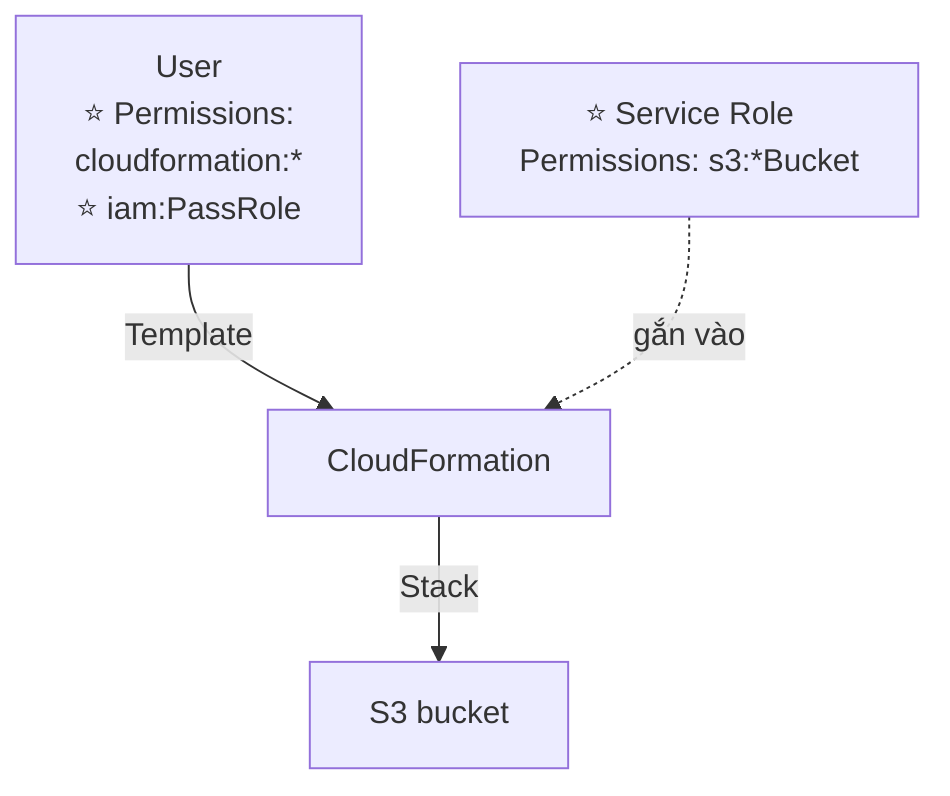

> ⭐⭐⭐ **ĐÂY LÀ MỘT TRONG NHỮNG KHÁI NIỆM RA THI RÕ NÉT NHẤT CHƯƠNG NÀY — hãy hiểu qua ví dụ cụ thể:**
>
> - **User CHỈ có quyền `cloudformation:*`** (tạo/xóa stack) **VÀ `iam:PassRole`** — **user KHÔNG có quyền `s3:CreateBucket`**
> - **Service Role gắn vào CloudFormation** có quyền **`s3:*Bucket`**
> - Khi user submit template tạo S3 bucket, **CloudFormation (không phải user) là bên THỰC SỰ gọi API `s3:CreateBucket`**, dùng quyền của **Service Role**
> - → **User "mượn" được quyền tạo S3 bucket MÀ KHÔNG CẦN được cấp trực tiếp quyền đó**
>
> ⭐⭐⭐ **Câu hỏi thi điển hình:** *"Muốn cho phép developer deploy stack CloudFormation tạo ra tài nguyên mà HỌ KHÔNG CÓ quyền tạo trực tiếp, làm sao đạt được least privilege?"* → **CloudFormation Service Role**, và **user cần quyền `iam:PassRole`** để gán role đó cho CloudFormation.
>
> 💡 Đây chính xác là pattern **`iam:PassRole`** đã học ở chương 25 (bài 287) — áp dụng cụ thể vào CloudFormation.

---

## 371. Amazon SES

### ⭐⭐⭐ Amazon Simple Email Service (Amazon SES)

- ⭐⭐⭐ **Dịch vụ FULLY MANAGED để GỬI EMAIL AN TOÀN, TOÀN CẦU và Ở QUY MÔ LỚN (at scale)**
- ⭐⭐⭐ **Cho phép email INBOUND/OUTBOUND**
- ⭐⭐ **REPUTATION DASHBOARD, performance insights, anti-spam feedback**
- ⭐⭐ **Cung cấp thống kê: email deliveries, bounces, feedback loop results, email open**
- ⭐⭐⭐ **Hỗ trợ DomainKeys Identified Mail (DKIM) và Sender Policy Framework (SPF)**
- ⭐⭐ **Triển khai IP linh hoạt: shared, dedicated, và customer-owned IPs**
- ⭐⭐ **Gửi email bằng ứng dụng của bạn qua AWS Console, APIs, hoặc SMTP**

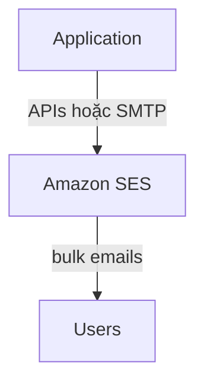

**Use cases:** ⭐⭐⭐ **transactional, marketing và bulk email communications**

> ⭐⭐⭐ **Đây là lần thứ hai khóa học nhắc tới SES** (lần đầu ở chương 20, bài 228 — gửi email chào mừng qua DynamoDB Streams → Lambda → SES). Lần này chi tiết hơn: **DKIM, SPF** là hai chuẩn xác thực email chống giả mạo/spam, và **shared/dedicated/customer-owned IP** là ba mức triển khai IP gửi mail.
>
> ⭐⭐⭐ **Câu định vị PHẢI THUỘC:** **"SES = gửi email QUY MÔ LỚN, ĐÁNG TIN CẬY, từ ứng dụng của bạn."**

---

## 372. Amazon Pinpoint

### ⭐⭐⭐ Amazon Pinpoint

- ⭐⭐⭐ **Dịch vụ TRUYỀN THÔNG MARKETING 2 CHIỀU (outbound/inbound) CÓ KHẢ NĂNG CO GIÃN (scalable)**
- ⭐⭐⭐ **Hỗ trợ: EMAIL, SMS, PUSH, VOICE, và IN-APP MESSAGING**
- ⭐⭐⭐ **Khả năng PHÂN KHÚC (segment) và CÁ NHÂN HÓA (personalize) message với nội dung phù hợp cho từng khách hàng**
- ⭐⭐⭐ **Có khả năng NHẬN PHẢN HỒI (receive replies)**
- ⭐⭐⭐ **Scale tới HÀNG TỶ message MỖI NGÀY**

**Use cases:** ⭐⭐ **chạy chiến dịch (campaigns) bằng cách gửi marketing, bulk, transactional SMS messages**

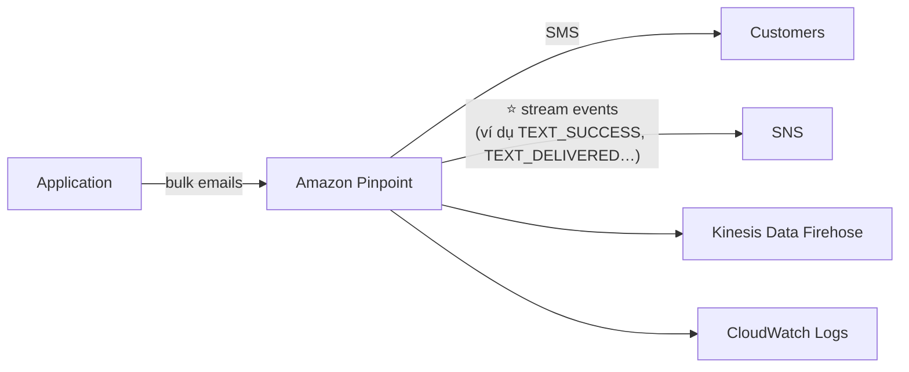

---

### ⭐⭐⭐ Versus Amazon SNS hoặc Amazon SES — PHÂN BIỆT QUAN TRỌNG

| | ⭐⭐⭐ **SNS & SES** | ⭐⭐⭐ **Amazon Pinpoint** |
|---|---|---|
| **Cách quản lý** | **BẠN tự quản lý AUDIENCE, CONTENT, và LỊCH GIAO (delivery schedule) của TỪNG message** | ⭐⭐⭐ **Tạo MESSAGE TEMPLATES, DELIVERY SCHEDULES, HIGHLY-TARGETED SEGMENTS, và TOÀN BỘ CAMPAIGN** |
| **Mức độ** | Gửi message đơn lẻ, thủ công | ⭐⭐⭐ **Nền tảng MARKETING CAMPAIGN đầy đủ** |

> ⭐⭐⭐ **BA DỊCH VỤ NHẮN TIN DỄ NHẦM NHẤT KHÓA HỌC — BẢNG CHỐT:**
>
> | Dịch vụ | Định vị |
> |---|---|
> | ⭐⭐⭐ **SNS** | **Pub/Sub giữa HỆ THỐNG với HỆ THỐNG** (hoặc thông báo đơn giản cho người dùng) |
> | ⭐⭐⭐ **SES** | **Gửi EMAIL đơn lẻ/transactional, đáng tin cậy, quy mô lớn** |
> | ⭐⭐⭐ **Pinpoint** | **Nền tảng MARKETING CAMPAIGN đa kênh** (email+SMS+push+voice+in-app), có **segment, template, lịch trình** |
>
> ⭐⭐⭐ **Từ khóa nhận diện Pinpoint:** *"marketing campaign"*, *"segment khách hàng"*, *"đa kênh (email+SMS+push)"*, *"cá nhân hóa nội dung theo từng nhóm khách hàng"* → **Amazon Pinpoint**.

---

## 373. SSM Session Manager

### ⭐⭐⭐ Systems Manager – SSM Session Manager

- ⭐⭐⭐ **Cho phép bạn MỞ MỘT SECURE SHELL trên EC2 và server on-premises**

**⭐⭐⭐ Ba lợi ích KHÔNG CẦN (RA THI CHẮC CHẮN):**

| Lợi ích |
|---|
| ⭐⭐⭐ **KHÔNG CẦN SSH ACCESS, BASTION HOSTS, hay SSH KEYS** |
| ⭐⭐⭐ **KHÔNG CẦN PORT 22 (bảo mật tốt hơn)** |
| ⭐⭐⭐ **Hỗ trợ Linux, macOS, và Windows** |
| ⭐⭐ **Gửi session log data tới S3 hoặc CloudWatch Logs** |

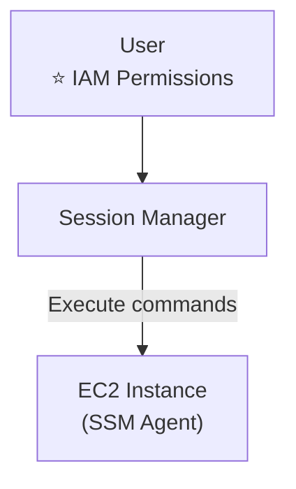

> ⭐⭐⭐ **ĐÂY LÀ DỊCH VỤ THAY THẾ BASTION HOST — CÂU HỎI THI RẤT PHỔ BIẾN.**
>
> Nhắc lại từ chương 27 (bài 322): **Bastion Host** cần **EC2 public, port 22 mở, SSH key quản lý** — nhiều điểm rủi ro. **SSM Session Manager** giải quyết TẤT CẢ:
>
> | | **Bastion Host** | ⭐⭐⭐ **SSM Session Manager** |
> |---|---|---|
> | **Cần EC2 public?** | ✅ Cần | ❌⭐⭐⭐ **KHÔNG CẦN** |
> | **Cần mở port 22?** | ✅ Cần | ❌⭐⭐⭐ **KHÔNG CẦN** |
> | **Cần SSH key?** | ✅ Cần | ❌⭐⭐⭐ **KHÔNG CẦN** |
> | **Xác thực bằng** | SSH key | ⭐⭐⭐ **IAM Permissions** |
> | **Ghi log session** | Phải tự cấu hình | ⭐⭐⭐ **Gửi thẳng S3/CloudWatch Logs** |
>
> ⭐⭐⭐ **Câu hỏi thi điển hình:** *"Cần truy cập shell vào EC2 trong private subnet, KHÔNG muốn mở port 22 ra ngoài, KHÔNG muốn quản lý SSH key"* → **SSM Session Manager**, KHÔNG phải Bastion Host.
>
> ⚠️ **Điều kiện cần:** instance phải **cài SSM Agent** và có **IAM Instance Role** cho phép Systems Manager, đồng thời user cần **IAM permissions** tương ứng.

---

## 374. SSM Other Services

Bài này gồm **bốn tính năng khác** của Systems Manager ngoài Session Manager.

---

### ⭐⭐⭐ Systems Manager – Run Command

- ⭐⭐⭐ **Thực thi một DOCUMENT (= script) hoặc CHỈ CHẠY một command**
- ⭐⭐⭐ **Chạy command TRÊN NHIỀU instance CÙNG LÚC (dùng resource groups)**
- ⭐⭐⭐ **KHÔNG CẦN SSH**
- ⭐⭐⭐ **Command Output HIỂN THỊ được trên AWS Console, gửi tới S3 bucket hoặc CloudWatch Logs**
- ⭐⭐⭐ **Gửi NOTIFICATION tới SNS về trạng thái command (In progress, Success, Failed…)**
- ⭐⭐ **Tích hợp với IAM & CloudTrail**
- ⭐⭐⭐ **Có thể được KÍCH HOẠT bằng EventBridge**

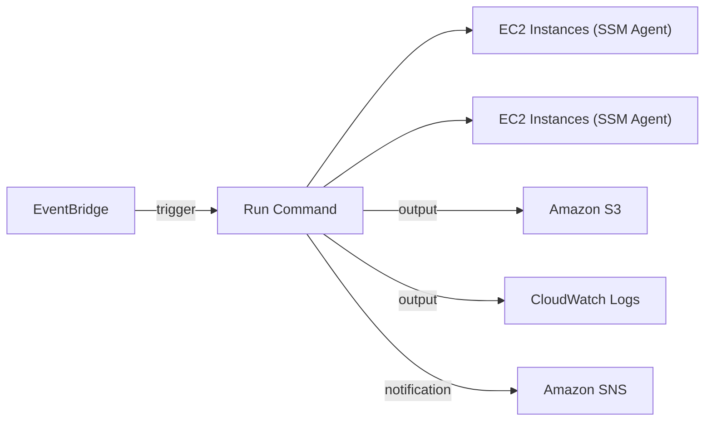

> ⭐⭐⭐ **Từ khóa nhận diện:** *"chạy một lệnh/script trên hàng loạt EC2 cùng lúc, không cần SSH"* → **SSM Run Command**.

---

### ⭐⭐⭐ Systems Manager – Patch Manager

- ⭐⭐⭐ **TỰ ĐỘNG HÓA quy trình VÁ LỖI (patching) cho các managed instance**
- ⭐⭐⭐ **OS updates, applications updates, security updates**
- ⭐⭐⭐ **Hỗ trợ EC2 instances VÀ on-premises servers**
- ⭐⭐⭐ **Hỗ trợ Linux, macOS, và Windows**
- ⭐⭐⭐ **Vá THEO YÊU CẦU (on-demand) hoặc THEO LỊCH dùng MAINTENANCE WINDOWS**
- ⭐⭐⭐ **QUÉT instance và SINH BÁO CÁO PATCH COMPLIANCE (các patch còn thiếu)**

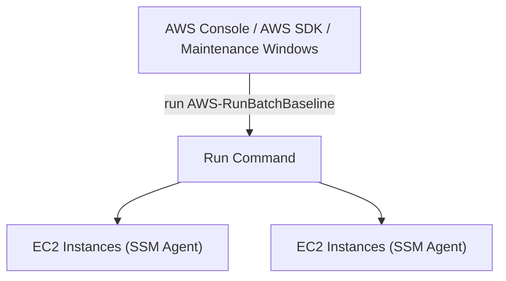

> ⭐⭐⭐ **Từ khóa nhận diện:** *"tự động vá bảo mật/cập nhật OS cho hàng loạt EC2 theo lịch"* → **SSM Patch Manager**.

---

### ⭐⭐⭐ Systems Manager – Maintenance Windows

- ⭐⭐⭐ **ĐỊNH NGHĨA MỘT LỊCH TRÌNH cho việc THỰC HIỆN hành động trên instance của bạn**
- ⭐⭐ **Ví dụ: OS patching, cập nhật driver, cài phần mềm…**

**⭐⭐⭐ Maintenance Window gồm:**

| Thành phần |
|---|
| ⭐⭐⭐ **Schedule** (lịch trình) |
| ⭐⭐⭐ **Duration** (thời lượng) |
| ⭐⭐⭐ **Set of registered instances** (tập hợp instance đã đăng ký) |
| ⭐⭐⭐ **Set of registered tasks** (tập hợp tác vụ đã đăng ký) |

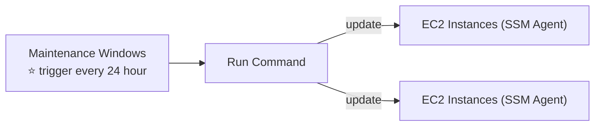

> ⭐⭐ **Quan hệ với Patch Manager:** Maintenance Windows là **CƠ CHẾ LỊCH TRÌNH** mà Patch Manager **dùng để chạy patch định kỳ** — hai khái niệm liên kết chặt chẽ.

---

### ⭐⭐⭐ Systems Manager – Automation

- ⭐⭐⭐ **ĐƠN GIẢN HÓA các tác vụ BẢO TRÌ và TRIỂN KHAI THƯỜNG GẶP cho EC2 instance và tài nguyên AWS khác**
- ⭐⭐ **Ví dụ: restart instances, tạo AMI, EBS snapshot**
- ⭐⭐⭐ **AUTOMATION RUNBOOK — SSM Documents ĐỊNH NGHĨA các hành động được thực hiện trên EC2 instance hoặc tài nguyên AWS** (có sẵn hoặc tự viết — **pre-defined hoặc custom**)

**⭐⭐⭐ Có thể được KÍCH HOẠT bằng (4 cách):**

| Cách |
|---|
| ⭐⭐⭐ **THỦ CÔNG qua AWS Console, AWS CLI hoặc SDK** |
| ⭐⭐⭐ **Amazon EventBridge** |
| ⭐⭐⭐ **THEO LỊCH dùng Maintenance Windows** |
| ⭐⭐⭐ **Bởi AWS Config — cho các quy tắc REMEDIATION (khắc phục)** |

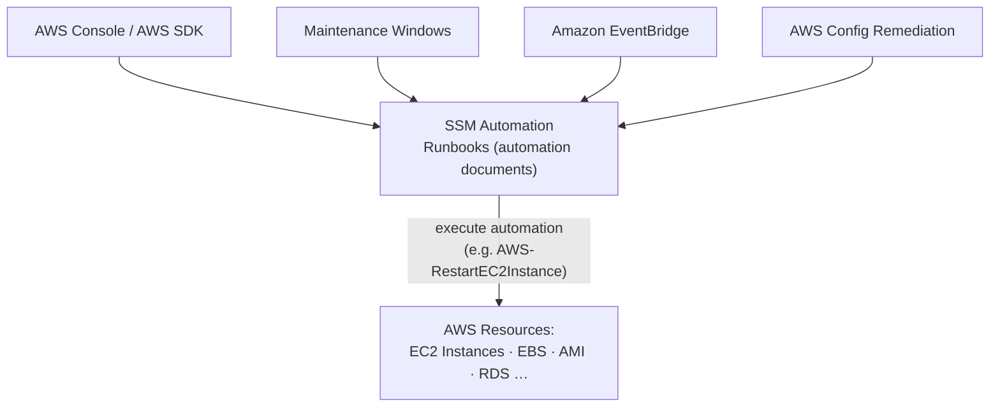

> ⭐⭐⭐ **ĐÂY LÀ MẢNH GHÉP CÒN THIẾU TỪ CHƯƠNG 24!** Nhớ lại bài 280 (AWS Config Remediation) — slide nói **"SSM Automation Documents"** dùng để **tự động khắc phục tài nguyên không tuân thủ**. Giờ ta thấy rõ: **AWS Config KÍCH HOẠT SSM Automation Runbook** để thực hiện hành động khắc phục (ví dụ `AWSConfigRemediationRevokeUnusedIAMUserCredentials`).
>
> ⭐⭐⭐ **Từ khóa nhận diện Automation:** *"chạy sẵn một quy trình đa bước để bảo trì EC2"*, *"AWS Config tự động sửa tài nguyên vi phạm"* → **SSM Automation (Runbooks)**.

---

### 🧭 Bảng tổng hợp các tính năng Systems Manager ⭐⭐⭐

| Tính năng | Câu định vị | Từ khóa nhận diện |
|---|---|---|
| ⭐⭐⭐ **Session Manager** | **Secure shell KHÔNG cần SSH/Bastion/port 22** | *"remote access không mở port 22"* |
| ⭐⭐⭐ **Run Command** | **Chạy command/script trên nhiều instance, không SSH** | *"thực thi lệnh hàng loạt"* |
| ⭐⭐⭐ **Patch Manager** | **Tự động vá OS/app/security** | *"patch compliance report"* |
| ⭐⭐⭐ **Maintenance Windows** | **Lịch trình thực hiện hành động** | *"schedule bảo trì"* |
| ⭐⭐⭐ **Automation (Runbooks)** | **Quy trình tự động đa bước, kích hoạt bởi Config/EventBridge** | *"remediation", "restart EC2 tự động"* |

---

## 375. AWS Cost Explorer

### ⭐⭐⭐ Cost Explorer

- ⭐⭐⭐ **TRỰC QUAN HÓA, HIỂU, và QUẢN LÝ chi phí & usage AWS của bạn THEO THỜI GIAN**
- ⭐⭐⭐ **Tạo BÁO CÁO TÙY CHỈNH phân tích dữ liệu cost và usage**
- ⭐⭐⭐ **Phân tích dữ liệu ở MỨC CAO: tổng chi phí và usage XUYÊN TẤT CẢ tài khoản**
- ⭐⭐⭐ **HOẶC theo THÁNG, GIỜ, ĐỘ CHI TIẾT MỨC TÀI NGUYÊN (resource level granularity)**
- ⭐⭐⭐ **Chọn SAVINGS PLAN TỐI ƯU (để giảm giá hóa đơn)**
- ⭐⭐⭐ **DỰ BÁO (Forecast) usage TỚI 18 THÁNG dựa trên usage trước đó**

**Bốn dashboard chính (từ slide):** ⭐⭐

| Dashboard |
|---|
| **Cost Explorer – Monthly Cost by AWS Service** |
| **Cost Explorer – Hourly & Resource Level** |
| ⭐⭐⭐ **Cost Explorer – Savings Plan** (thay thế cho Reserved Instances) |
| ⭐⭐⭐ **Cost Explorer – Forecast Usage** |

> ⭐⭐⭐ **Con số 18 THÁNG là chi tiết ra thi.** Và nhớ: **Cost Explorer đề xuất Savings Plan — "Alternative to Reserved Instances"** (đã học ở chương 5).

---

## 376. AWS Cost Anomaly Detection

### ⭐⭐⭐ AWS Cost Anomaly Detection

- ⭐⭐⭐ **LIÊN TỤC GIÁM SÁT chi phí và usage bằng ML để PHÁT HIỆN chi tiêu BẤT THƯỜNG**
- ⭐⭐⭐ **TỰ HỌC pattern chi tiêu LỊCH SỬ RIÊNG của bạn để phát hiện: CHI TIÊU TĂNG ĐỘT BIẾN một lần VÀ/HOẶC chi phí TĂNG LIÊN TỤC** (⭐⭐⭐ **BẠN KHÔNG CẦN tự định nghĩa NGƯỠNG (thresholds)**)
- ⭐⭐⭐ **Giám sát: AWS services, member accounts, cost allocation tags, hoặc cost categories**
- ⭐⭐⭐ **Gửi BÁO CÁO PHÁT HIỆN BẤT THƯỜNG kèm PHÂN TÍCH NGUYÊN NHÂN GỐC (root-cause analysis)**
- ⭐⭐⭐ **Nhận thông báo qua CẢNH BÁO RIÊNG LẺ hoặc TÓM TẮT hàng ngày/hàng tuần (dùng SNS)**

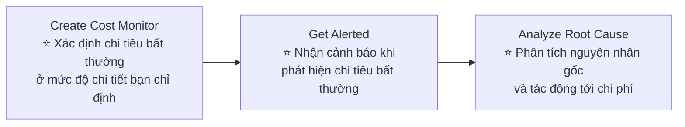

> ⭐⭐⭐ **ĐIỂM PHÂN BIỆT VỚI COST EXPLORER:**
>
> | | **Cost Explorer** | ⭐⭐⭐ **Cost Anomaly Detection** |
> |---|---|---|
> | **Mục đích** | **Trực quan hóa, phân tích, DỰ BÁO chi phí** | ⭐⭐⭐ **TỰ ĐỘNG PHÁT HIỆN chi tiêu BẤT THƯỜNG bằng ML** |
> | **Ngưỡng cảnh báo** | Bạn tự đặt (nếu dùng Budget) | ⭐⭐⭐ **KHÔNG cần định nghĩa ngưỡng — ML tự học** |
> | **Hành động** | Bạn tự xem dashboard | ⭐⭐⭐ **CHỦ ĐỘNG gửi cảnh báo qua SNS** |
>
> ⭐⭐⭐ **Từ khóa nhận diện:** *"tự động cảnh báo khi chi phí tăng bất thường mà KHÔNG cần đặt ngưỡng thủ công"* → **AWS Cost Anomaly Detection** (khác với **AWS Budgets**, nơi bạn PHẢI tự đặt ngưỡng).

---

## 377. AWS Outposts

### ⭐⭐⭐ AWS Outposts

- ⭐⭐⭐ **Hybrid Cloud: doanh nghiệp GIỮ hạ tầng on-premises SONG SONG với hạ tầng cloud**
- ⭐⭐⭐ **Do đó có HAI CÁCH xử lý hệ thống IT: MỘT cho AWS cloud (Console, CLI, APIs) và MỘT cho hạ tầng on-premises**
- ⭐⭐⭐ **AWS Outposts là "SERVER RACKS" CUNG CẤP CÙNG hạ tầng, dịch vụ, APIs & tools của AWS để XÂY DỰNG ứng dụng NGAY TẠI on-premises, Y HỆT như trên cloud**
- ⭐⭐⭐ **AWS THIẾT LẬP và QUẢN LÝ "Outposts Racks" TRONG hạ tầng on-premises của bạn, và bạn BẮT ĐẦU tận dụng dịch vụ AWS NGAY TẠI CHỖ**
- ⚠️⭐⭐⭐ **BẠN CHỊU TRÁCH NHIỆM về AN NINH VẬT LÝ của Outposts Rack**

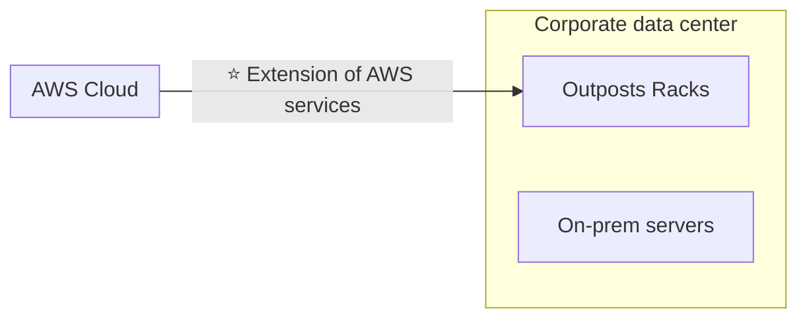

**Benefits:** ⭐⭐⭐

| Lợi ích |
|---|
| ⭐⭐⭐ **Truy cập ĐỘ TRỄ THẤP (low-latency) tới hệ thống on-premises** |
| ⭐⭐⭐ **XỬ LÝ dữ liệu TẠI CHỖ (local data processing)** |
| ⭐⭐⭐ **DATA RESIDENCY** (dữ liệu ở lại đúng vị trí địa lý theo quy định) |
| ⭐⭐⭐ **MIGRATION DỄ HƠN từ on-premises lên cloud** |
| ⭐⭐⭐ **FULLY MANAGED service** (dù đặt tại chỗ, AWS vẫn quản lý) |

**Một số dịch vụ hoạt động được trên Outposts:** ⭐⭐ **Amazon EC2, Amazon EBS, Amazon S3, Amazon EKS, Amazon ECS, Amazon RDS, Amazon EMR**

> ⭐⭐⭐ **Câu định vị PHẢI THUỘC:** **"AWS Outposts = mang HẠ TẦNG AWS THẬT vào trung tâm dữ liệu của bạn."**
>
> ⭐⭐⭐ **Từ khóa nhận diện:** *"cần chạy workload AWS ngay tại on-premises vì LATENCY hoặc DATA RESIDENCY"* → **AWS Outposts**. Đừng nhầm với **VMware Cloud on AWS** (chương 28) — Outposts là **mang AWS xuống on-premises**, còn VMware Cloud on AWS là **chạy VMware trên hạ tầng AWS** — **HƯỚNG NGƯỢC NHAU**.

---

## 378. AWS Batch

### ⭐⭐⭐ AWS Batch

- ⭐⭐⭐ **Dịch vụ XỬ LÝ HÀNG LOẠT (batch processing) FULLY MANAGED, Ở MỌI QUY MÔ**
- ⭐⭐⭐ **Chạy HIỆU QUẢ HÀNG TRĂM NGHÌN batch computing jobs trên AWS**
- ⭐⭐⭐ **Một "batch" job là job CÓ ĐIỂM BẮT ĐẦU và ĐIỂM KẾT THÚC** (trái ngược với continuous/chạy liên tục)
- ⭐⭐⭐ **AWS Batch TỰ ĐỘNG khởi chạy EC2 instance hoặc Spot Instance**
- ⭐⭐⭐ **AWS Batch CẤP PHÁT đúng lượng compute/memory cần thiết**
- ⭐⭐⭐ **Bạn CHỈ CẦN submit hoặc lên lịch batch job, AWS Batch LO PHẦN CÒN LẠI!**
- ⭐⭐⭐ **Batch job được định nghĩa dưới dạng DOCKER IMAGE và chạy trên ECS, EKS, Fargate**
- ⭐⭐ **Hữu ích cho tối ưu chi phí và ít phải quan tâm hạ tầng**

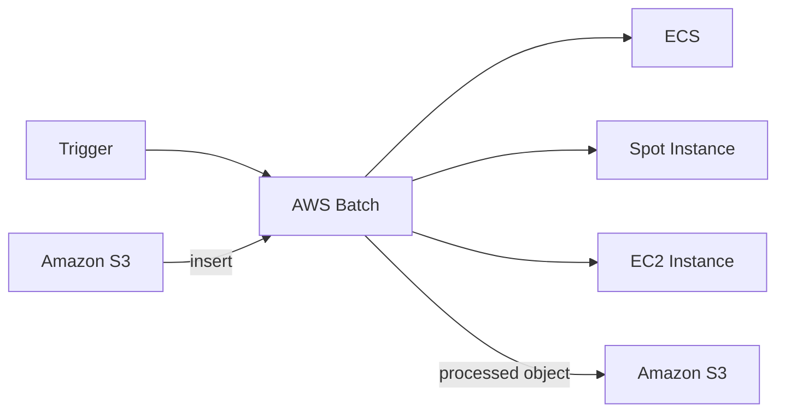

---

### ⭐⭐⭐ Batch vs Lambda — BẢNG SO SÁNH RA THI CHẮC CHẮN

| | ⭐⭐⭐ **Lambda** | ⭐⭐⭐ **Batch** |
|---|---|---|
| ⭐⭐⭐ **Time limit** | **CÓ GIỚI HẠN** (15 phút) | ⭐⭐⭐ **KHÔNG GIỚI HẠN thời gian** |
| ⭐⭐⭐ **Runtime** | **GIỚI HẠN** (các runtime được AWS hỗ trợ sẵn) | ⭐⭐⭐ **BẤT KỲ runtime nào, MIỄN LÀ đóng gói thành Docker image** |
| ⭐⭐⭐ **Disk space** | **GIỚI HẠN** (dung lượng tạm `/tmp` nhỏ) | ⭐⭐⭐ **DỰA VÀO EBS / instance store** |
| ⭐⭐⭐ **Hạ tầng** | **SERVERLESS** | ⭐⭐⭐ **DỰA VÀO EC2** (có thể được AWS quản lý) |

> ⭐⭐⭐ **ĐÂY LÀ CÂU HỎI THI KINH ĐIỂN VỀ CHỌN COMPUTE:**
> *"Job xử lý dữ liệu mất 2 GIỜ, cần một runtime NGÔN NGỮ HIẾM (ví dụ Fortran), cần NHIỀU dung lượng đĩa tạm"* → ❌ **Lambda KHÔNG làm được** (vượt 15 phút, runtime giới hạn, disk nhỏ) → ✅ **AWS Batch**.
>
> ⭐⭐⭐ **Mẹo nhớ nhanh:** **Lambda = nhanh, nhẹ, giới hạn nhiều. Batch = chậm, nặng, KHÔNG giới hạn (miễn đóng gói Docker).**

---

## 379. Amazon AppFlow

### ⭐⭐⭐ Amazon AppFlow

- ⭐⭐⭐ **Dịch vụ TÍCH HỢP FULLY MANAGED cho phép TRUYỀN DỮ LIỆU AN TOÀN giữa ứng dụng SaaS (Software-as-a-Service) và AWS**
- ⭐⭐⭐ **Sources (nguồn): Salesforce, SAP, Zendesk, Slack, và ServiceNow**
- ⭐⭐⭐ **Destinations (đích): dịch vụ AWS như Amazon S3, Amazon Redshift, hoặc NGOÀI AWS như Snowflake và Salesforce**
- ⭐⭐⭐ **Tần suất: THEO LỊCH, PHẢN ỨNG với sự kiện, hoặc THEO YÊU CẦU (on demand)**
- ⭐⭐⭐ **Khả năng BIẾN ĐỔI DỮ LIỆU như lọc (filtering) và kiểm tra (validation)**
- ⭐⭐⭐ **Mã hóa qua Internet CÔNG KHAI hoặc RIÊNG TƯ qua AWS PrivateLink**
- ⭐⭐⭐ **KHÔNG mất thời gian viết tích hợp, TẬN DỤNG API NGAY LẬP TỨC**

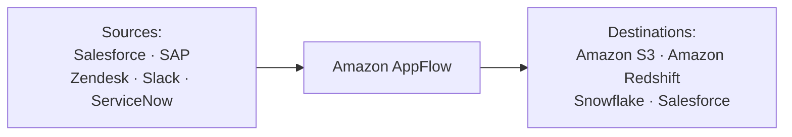

> ⭐⭐⭐ **Câu định vị PHẢI THUỘC:** **"AppFlow = cầu nối DỮ LIỆU giữa ứng dụng SaaS (Salesforce, SAP…) và AWS, KHÔNG CẦN viết code tích hợp."**
>
> ⭐⭐⭐ **Từ khóa nhận diện:** *"đồng bộ dữ liệu từ Salesforce/SAP vào S3/Redshift"*, *"tích hợp SaaS mà không viết API tùy chỉnh"* → **Amazon AppFlow**.
>
> 💡 **Phân biệt với AWS Transfer Family (chương 16):** Transfer Family là **FTP/SFTP interface cho S3**; AppFlow là **kết nối trực tiếp với ứng dụng SaaS cụ thể** (Salesforce, SAP…) — hai phạm vi hoàn toàn khác nhau.

---

## 380. AWS Amplify

### ⭐⭐⭐ AWS Amplify — web and mobile applications

- ⭐⭐⭐ **BỘ CÔNG CỤ và dịch vụ giúp PHÁT TRIỂN và TRIỂN KHAI ứng dụng web và mobile FULL STACK CÓ KHẢ NĂNG CO GIÃN**
- ⭐⭐⭐ **Bao gồm: Authentication, Storage, API (REST, GraphQL), CI/CD, PubSub, Analytics, AI/ML Predictions, Monitoring…**
- ⭐⭐⭐ **Kết nối source code từ GitHub, AWS CodeCommit, Bitbucket, GitLab, hoặc UPLOAD TRỰC TIẾP**

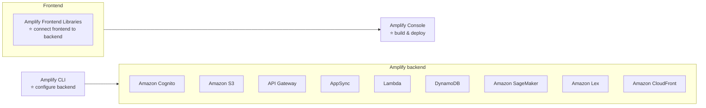

**Ba thành phần chính:** ⭐⭐⭐

| Thành phần | Vai trò |
|---|---|
| ⭐⭐⭐ **Amplify Frontend Libraries** | **KẾT NỐI FRONTEND với BACKEND** |
| ⭐⭐⭐ **Amplify CLI** | **CẤU HÌNH BACKEND** |
| ⭐⭐⭐ **Amplify Console** | **BUILD và DEPLOY** |

> ⭐⭐⭐ **Câu định vị PHẢI THUỘC:** **"Amplify = nền tảng PHÁT TRIỂN NHANH ứng dụng WEB/MOBILE, tự động dựng backend serverless (Cognito, API Gateway, Lambda, DynamoDB…)."**
>
> ⭐⭐⭐ **Từ khóa nhận diện:** *"phát triển ứng dụng mobile/web nhanh, CI/CD tích hợp sẵn, backend serverless tự động"* → **AWS Amplify**.
>
> 💡 **Liên hệ với các dịch vụ đã học:** Amplify thực chất **ĐÓNG GÓI** nhiều dịch vụ đã học (Cognito — chương 19, API Gateway — chương 19, Lambda, DynamoDB, CloudFront — chương 15) thành một **trải nghiệm phát triển thống nhất** cho lập trình viên frontend.

---

## 381. Instance Scheduler on AWS

### ⭐⭐⭐ Instance Scheduler on AWS

- ⭐⭐⭐ **LÀ MỘT AWS SOLUTION được TRIỂN KHAI QUA CLOUDFORMATION** (⚠️ **KHÔNG PHẢI là một "service" độc lập**)
- ⭐⭐⭐ **TỰ ĐỘNG START/STOP dịch vụ AWS để GIẢM CHI PHÍ, TỚI 70%**
- ⭐⭐⭐ **Ví dụ: DỪNG EC2 instance của công ty NGOÀI GIỜ LÀM VIỆC (business hours)**
- ⭐⭐⭐ **Hỗ trợ: EC2 instances, EC2 Auto Scaling Groups, và RDS instances**
- ⭐⭐⭐ **Lịch trình được QUẢN LÝ TRONG MỘT BẢNG DYNAMODB**
- ⭐⭐⭐ **Dùng TAG của tài nguyên VÀ LAMBDA để dừng/khởi động instance**
- ⭐⭐⭐ **Hỗ trợ tài nguyên CROSS-ACCOUNT và CROSS-REGION**

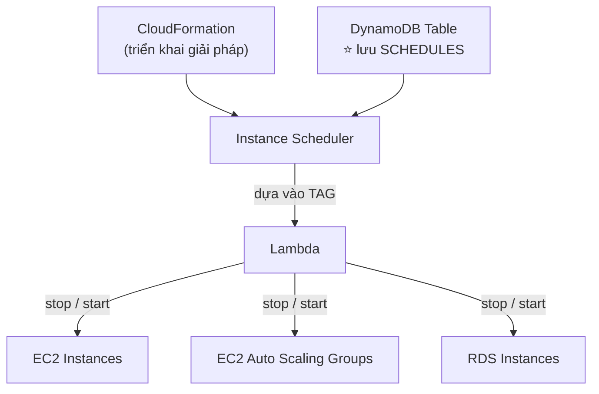

> ⚠️⭐⭐⭐ **BẪY THI QUAN TRỌNG: Instance Scheduler LÀ MỘT "SOLUTION" (mẫu giải pháp mã nguồn mở, đóng gói bằng CloudFormation template), KHÔNG PHẢI là một dịch vụ AWS riêng biệt** như EC2 hay Lambda. Bạn **TỰ DEPLOY** nó vào tài khoản của mình qua CloudFormation, rồi nó **TỰ TẠO** DynamoDB table + Lambda function để vận hành.
>
> ⭐⭐⭐ **Con số 70% là điểm ra thi:** *"giảm chi phí EC2 tới 70% bằng cách tự động tắt máy ngoài giờ làm việc"* → **Instance Scheduler on AWS**.
>
> ⭐⭐⭐ **Từ khóa nhận diện:** *"tự động dừng/khởi động EC2 theo lịch làm việc để TIẾT KIỆM CHI PHÍ"*, *"dựa trên tag"* → **Instance Scheduler on AWS**.
>
> 💡 **Liên hệ với chương 30 bài 368:** đây chính là **VÍ DỤ THỰC TẾ** cho chiến lược *"In Dev, you could automate deletion of templates at 5 PM and recreated at 8 AM safely"* đã nhắc ở phần Benefits of CloudFormation — Instance Scheduler là **giải pháp dựng sẵn** cho đúng nhu cầu đó, nhưng ở mức **start/stop** thay vì **create/delete**.

---

## 🧭 Cheat Sheet toàn chương ⭐⭐⭐

| Từ khóa trong đề | Đáp án |
|---|---|
| *"khai báo hạ tầng bằng code, tự động điều phối thứ tự tạo"* | **CloudFormation** |
| *"xóa buổi tối, tạo lại buổi sáng an toàn"* | **CloudFormation (Infrastructure as Code)** |
| *"tài nguyên chưa được CloudFormation hỗ trợ sẵn"* | **Custom Resources** |
| *"trực quan hóa relations giữa các resource trong template"* | **CloudFormation + Infrastructure Composer** |
| ⭐⭐ *"cho user quyền tạo resource mà họ KHÔNG có quyền trực tiếp"* | **CloudFormation Service Role** (+ user cần `iam:PassRole`) |
| *"gửi email transactional/marketing quy mô lớn, đáng tin cậy"* | **Amazon SES** |
| *"DKIM, SPF cho email"* | **Amazon SES** |
| *"marketing campaign đa kênh, segment khách hàng"* | **Amazon Pinpoint** |
| ⭐⭐ *"SNS/SES vs Pinpoint khác nhau ở đâu"* | **SNS/SES = tự quản lý từng message; Pinpoint = template + schedule + segment + campaign** |
| ⭐⭐⭐ *"remote shell vào EC2, KHÔNG mở port 22, KHÔNG SSH key"* | **SSM Session Manager** |
| *"chạy lệnh/script trên hàng loạt instance, không SSH"* | **SSM Run Command** |
| *"tự động vá OS/security, báo cáo compliance"* | **SSM Patch Manager** |
| *"lịch trình thực hiện hành động bảo trì"* | **SSM Maintenance Windows** |
| ⭐⭐ *"AWS Config tự động khắc phục tài nguyên vi phạm bằng gì"* | **SSM Automation (Runbooks)** |
| *"phân tích, dự báo chi phí tới 18 tháng"* | **AWS Cost Explorer** |
| ⭐⭐ *"tự động phát hiện chi tiêu bất thường bằng ML, không cần đặt ngưỡng"* | **AWS Cost Anomaly Detection** |
| *"mang hạ tầng AWS thật vào data center riêng, vì latency/data residency"* | **AWS Outposts** |
| *"chạy hàng trăm nghìn batch job, job có điểm đầu điểm cuối"* | **AWS Batch** |
| ⭐⭐⭐ *"job mất hơn 15 phút, runtime hiếm, cần nhiều disk tạm"* | **AWS Batch** (KHÔNG phải Lambda) |
| *"đồng bộ dữ liệu từ Salesforce/SAP vào S3/Redshift không viết code"* | **Amazon AppFlow** |
| *"phát triển nhanh app web/mobile, backend serverless tự động, CI/CD"* | **AWS Amplify** |
| ⭐⭐⭐ *"tự động tắt/bật EC2 theo giờ làm việc để tiết kiệm tới 70%"* | **Instance Scheduler on AWS** (là Solution qua CloudFormation, không phải service riêng) |

---

## Trắc nghiệm 27: Other Services Quiz

### Các điểm dễ bị bẫy

| Câu hỏi thường gặp | Đáp án đúng | Vì sao đáp án khác sai |
|---|---|---|
| CloudFormation là gì? | ⭐⭐⭐ **Cách DECLARATIVE để mô tả hạ tầng AWS** | Không phải imperative (từng bước) |
| CloudFormation tự sắp thứ tự tạo resource không? | ✅ **CÓ — declarative programming** | Không cần tự điều phối |
| Resource chưa được CloudFormation hỗ trợ? | ⭐ **Custom Resources** | |
| CloudFormation Service Role dùng khi nào? | ⭐⭐⭐ **User không có quyền tạo resource trực tiếp nhưng vẫn cần deploy stack tạo resource đó (least privilege)** | |
| User cần quyền gì để gán Service Role? | ⭐⭐⭐ **`iam:PassRole`** | |
| SES dùng cho gì? | **Gửi email transactional/marketing/bulk quy mô lớn** | |
| SES hỗ trợ chuẩn xác thực nào? | **DKIM và SPF** | |
| Pinpoint khác SNS/SES ở điểm nào? | ⭐⭐⭐ **Pinpoint có template, schedule, segment, campaign — SNS/SES tự quản lý từng message** | |
| Pinpoint hỗ trợ kênh nào? | **Email, SMS, push, voice, in-app messaging** | |
| SSM Session Manager cần port 22 không? | ❌⭐⭐⭐ **KHÔNG** | Cũng không cần SSH key hay Bastion Host |
| SSM Session Manager xác thực bằng gì? | ⭐⭐⭐ **IAM Permissions** | |
| Chạy script trên nhiều EC2 cùng lúc không SSH? | ⭐⭐⭐ **SSM Run Command** | |
| Tự động vá OS theo lịch? | **SSM Patch Manager**, dùng **Maintenance Windows** | |
| AWS Config khắc phục tài nguyên vi phạm bằng gì? | ⭐⭐⭐ **SSM Automation (Runbooks)** | |
| Automation kích hoạt bằng mấy cách? | **4: thủ công, EventBridge, Maintenance Windows, AWS Config** | |
| Cost Explorer dự báo được bao lâu? | ⭐⭐⭐ **18 tháng** | |
| Cost Explorer đề xuất gì để giảm giá? | **Savings Plan** (thay thế Reserved Instances) | |
| Cost Anomaly Detection có cần đặt ngưỡng không? | ❌⭐⭐⭐ **KHÔNG — ML tự học pattern chi tiêu** | |
| Cost Anomaly Detection thông báo qua đâu? | **SNS** (cảnh báo riêng lẻ hoặc tóm tắt ngày/tuần) | |
| AWS Outposts là gì? | ⭐⭐⭐ **Server rack AWS đặt TẠI on-premises**, AWS quản lý, bạn chịu trách nhiệm an ninh vật lý | |
| Outposts vs VMware Cloud on AWS khác nhau ở đâu? | ⭐⭐⭐ **Outposts = mang AWS XUỐNG on-premises; VMware Cloud on AWS = chạy VMware TRÊN AWS** — hướng ngược nhau | |
| AWS Batch job đặc điểm gì? | **Có điểm bắt đầu và kết thúc** (khác continuous) | |
| Batch job đóng gói dưới dạng gì, chạy trên đâu? | ⭐⭐⭐ **Docker image, chạy trên ECS/EKS/Fargate** | |
| Lambda vs Batch: time limit? | **Lambda 15 phút giới hạn; Batch KHÔNG giới hạn** | |
| Lambda vs Batch: runtime? | **Lambda giới hạn runtime hỗ trợ sẵn; Batch bất kỳ (Docker)** | |
| AppFlow kết nối nguồn nào? | **Salesforce, SAP, Zendesk, Slack, ServiceNow** | |
| AppFlow mã hóa qua đâu? | **Internet công khai hoặc riêng tư qua AWS PrivateLink** | |
| Amplify gồm 3 thành phần chính? | ⭐⭐⭐ **Frontend Libraries (kết nối FE-BE), CLI (cấu hình backend), Console (build & deploy)** | |
| Instance Scheduler on AWS là service hay solution? | ⚠️⭐⭐⭐ **SOLUTION triển khai qua CloudFormation, KHÔNG phải service riêng** | |
| Instance Scheduler giảm chi phí tối đa bao nhiêu? | ⭐⭐⭐ **70%** | |
| Instance Scheduler lưu lịch trình ở đâu? | **DynamoDB table** | Dùng tag + Lambda để stop/start |
| Instance Scheduler hỗ trợ tài nguyên nào? | **EC2 instances, EC2 ASG, RDS instances** | Cross-account và cross-region |

---

### Checklist tự kiểm tra trước khi làm quiz

**CloudFormation (368–370):**
- [ ] Nhớ **declarative** vs imperative, và CloudFormation tự sắp thứ tự tạo resource
- [ ] Nhớ 4 section template: `Parameters`, `Resources`, `Outputs`, hàm `!Ref`
- [ ] ⭐⭐⭐ Hiểu **Service Role + `iam:PassRole`** để đạt least privilege khi deploy stack

**Messaging & SSM (371–374):**
- [ ] Phân biệt **SES (email đơn lẻ, đáng tin cậy)** vs **Pinpoint (marketing campaign đa kênh)**
- [ ] ⭐⭐⭐ Nhớ **SSM Session Manager thay thế Bastion Host** — không port 22, không SSH key, xác thực bằng IAM
- [ ] Thuộc 5 tính năng SSM: Session Manager, Run Command, Patch Manager, Maintenance Windows, Automation
- [ ] Nhớ **Automation Runbooks** là cơ chế đằng sau AWS Config Remediation (chương 24)

**Cost & Hybrid (375–378):**
- [ ] Phân biệt **Cost Explorer (phân tích, dự báo)** vs **Cost Anomaly Detection (tự động phát hiện bất thường bằng ML)**
- [ ] ⭐⭐⭐ Nhớ **Outposts = mang AWS xuống on-premises**, phân biệt với VMware Cloud on AWS
- [ ] ⭐⭐⭐ Thuộc **bảng Batch vs Lambda** (time limit, runtime, disk, hạ tầng)

**Integration & Dev (379–381):**
- [ ] Nhớ **AppFlow kết nối SaaS (Salesforce, SAP…) với AWS, không viết code**
- [ ] Nhớ **Amplify = phát triển nhanh web/mobile, backend serverless tự động**
- [ ] ⭐⭐⭐ Nhớ **Instance Scheduler LÀ SOLUTION (qua CloudFormation), giảm chi phí tới 70%**

---

## Thuật ngữ Anh — Việt

| Tiếng Anh | Tiếng Việt |
|---|---|
| Declarative | Khai báo (mô tả kết quả, không phải các bước) |
| Infrastructure as Code (IaC) | Hạ tầng dưới dạng mã nguồn |
| Template | Bản mẫu định nghĩa hạ tầng |
| Stack | Tập hợp tài nguyên được quản lý cùng nhau |
| Resources / Parameters / Outputs | Tài nguyên / tham số đầu vào / giá trị đầu ra |
| Reference function (!Ref) | Hàm tham chiếu tới resource/parameter khác |
| Infrastructure Composer | Công cụ trực quan hóa template CloudFormation |
| Service Role | Vai trò IAM dịch vụ dùng thay người dùng |
| Least privilege | Nguyên tắc đặc quyền tối thiểu |
| iam:PassRole | Quyền cho phép gán một role cho dịch vụ |
| Custom Resources | Tài nguyên tùy chỉnh chưa được hỗ trợ sẵn |
| Amazon Simple Email Service (SES) | Dịch vụ gửi email quy mô lớn |
| Inbound / Outbound emails | Email đến / email đi |
| Reputation dashboard | Bảng theo dõi uy tín gửi email |
| Bounces | Email bị trả lại (gửi thất bại) |
| DomainKeys Identified Mail (DKIM) | Chuẩn ký số xác thực email |
| Sender Policy Framework (SPF) | Chuẩn xác thực nguồn gửi email |
| Shared / Dedicated / Customer-owned IPs | IP dùng chung / riêng / của khách hàng |
| Amazon Pinpoint | Nền tảng truyền thông marketing đa kênh |
| 2-way marketing communications | Truyền thông marketing hai chiều |
| Segment | Phân khúc khách hàng |
| Personalize | Cá nhân hóa nội dung |
| Message templates | Mẫu thông điệp dựng sẵn |
| Delivery schedules | Lịch trình giao thông điệp |
| Highly-targeted segments | Phân khúc nhắm mục tiêu chính xác |
| Systems Manager (SSM) | Dịch vụ quản lý vận hành tài nguyên |
| Session Manager | Công cụ mở shell an toàn không cần SSH |
| Secure shell | Kết nối dòng lệnh bảo mật |
| Run Command | Chạy lệnh/script trên nhiều instance |
| Resource groups | Nhóm tài nguyên |
| Patch Manager | Công cụ tự động vá lỗi hệ thống |
| Patch compliance report | Báo cáo tuân thủ vá lỗi |
| Maintenance Windows | Cửa sổ thời gian bảo trì theo lịch |
| Automation Runbook | Kịch bản tự động hóa nhiều bước |
| SSM Documents | Tài liệu định nghĩa hành động SSM |
| Remediation | Khắc phục, sửa lỗi tự động |
| AWS Cost Explorer | Công cụ phân tích chi phí AWS |
| Cost and usage data | Dữ liệu chi phí và mức sử dụng |
| Resource level granularity | Độ chi tiết ở mức từng tài nguyên |
| Savings Plan | Gói cam kết chi tiêu để giảm giá |
| Forecast usage | Dự báo mức sử dụng |
| AWS Cost Anomaly Detection | Dịch vụ phát hiện chi tiêu bất thường |
| Unusual spends | Chi tiêu bất thường |
| Root-cause analysis | Phân tích nguyên nhân gốc rễ |
| Cost allocation tags | Nhãn phân bổ chi phí |
| Cost categories | Danh mục chi phí |
| AWS Outposts | Hạ tầng AWS vật lý đặt tại on-premises |
| Hybrid Cloud | Đám mây lai |
| Server racks | Tủ rack máy chủ |
| Low-latency access | Truy cập độ trễ thấp |
| Local data processing | Xử lý dữ liệu tại chỗ |
| Data residency | Yêu cầu dữ liệu lưu trú đúng vị trí địa lý |
| Physical security | An ninh vật lý |
| AWS Batch | Dịch vụ xử lý theo lô quy mô lớn |
| Batch processing | Xử lý theo lô |
| Batch job | Tác vụ theo lô (có đầu, có cuối) |
| Dynamically launch | Tự động khởi chạy |
| Docker image | Ảnh đóng gói ứng dụng dạng container |
| Time limit | Giới hạn thời gian |
| Runtime | Môi trường thực thi mã nguồn |
| Temporary disk space | Dung lượng đĩa tạm |
| Amazon AppFlow | Dịch vụ tích hợp dữ liệu SaaS với AWS |
| Software-as-a-Service (SaaS) | Phần mềm dưới dạng dịch vụ |
| Data transformation | Biến đổi dữ liệu |
| Filtering and validation | Lọc và kiểm tra hợp lệ |
| AWS PrivateLink | Kết nối riêng tư tới dịch vụ AWS |
| AWS Amplify | Nền tảng phát triển ứng dụng web/mobile |
| Full stack applications | Ứng dụng đầy đủ cả frontend và backend |
| Authentication | Xác thực người dùng |
| CI/CD | Tích hợp và triển khai liên tục |
| PubSub | Mô hình xuất bản - đăng ký |
| Amplify Frontend Libraries | Thư viện kết nối giao diện với backend |
| Amplify CLI | Công cụ dòng lệnh cấu hình backend |
| Amplify Console | Giao diện build và deploy ứng dụng |
| Instance Scheduler on AWS | Giải pháp tự động bật/tắt tài nguyên theo lịch |
| AWS Solution | Mẫu giải pháp triển khai qua CloudFormation |
| Business hours | Giờ làm việc |
| Cross-account and cross-region | Xuyên tài khoản và xuyên vùng |

---

*Ghi chú: bài Hands On (369) được tóm tắt lại các bước thao tác chính trên AWS Console — giao diện có thể thay đổi theo thời gian, logic và khái niệm vẫn giữ nguyên. Hai template YAML trong bài 369 được trích **NGUYÊN VĂN** từ `code_v2025-10-27/cloudformation/0-just-ec2.yaml` và `code_v2025-10-27/cloudformation/1-ec2-with-sg-eip.yaml`. ⚠️ **Ghi chú kỹ thuật khi biên soạn:** nội dung trang 824–835 (title slide, CloudFormation ×5 slide, SES, Pinpoint, SSM ×4 slide) được đọc từ hình ảnh slide do công cụ trích xuất text PDF gặp sự cố tạm thời ở phiên trước; nội dung trang 836–851 (SSM Automation, Cost Explorer ×5 slide, Cost Anomaly Detection, Outposts ×2 slide, Batch ×3 slide, AppFlow ×2 slide, Amplify, Instance Scheduler) được trích trực tiếp từ text PDF — tất cả đã đối chiếu đầy đủ, không có gì bị bỏ sót. Trang 852 trở đi bắt đầu phần mới ("White Papers & Architectures") **không thuộc phạm vi 15 bài giảng 367–381** nên không đưa vào file này. 💡 **CHI PHÍ: chương này gần như không tốn tiền** — CloudFormation bản thân miễn phí (chỉ trả cho tài nguyên bên trong, ở đây là EC2 `t3.micro` + Elastic IP, nằm trong Free Tier nếu instance đang chạy); SES, Pinpoint, SSM, Cost Explorer, Cost Anomaly Detection đều có Free Tier hoặc miễn phí sử dụng dịch vụ. Nhớ **Delete stack** sau bài 369 để không tốn Elastic IP (phí nếu không gắn vào instance đang chạy). ⭐ **Lời khuyên ôn thi:** đây là chương "rộng nhưng nông" đúng như slide mở đầu đã nói — thay vì học sâu từng dịch vụ, hãy tập trung vào **ba bảng so sánh xuất hiện nhiều nhất trong đề: SNS/SES vs Pinpoint (bài 372), Bastion Host vs SSM Session Manager (bài 373), và Batch vs Lambda (bài 378)** — đây là những cặp khái niệm đề thi SAA-C03 thực tế hay đặt cạnh nhau để kiểm tra khả năng phân biệt.*
