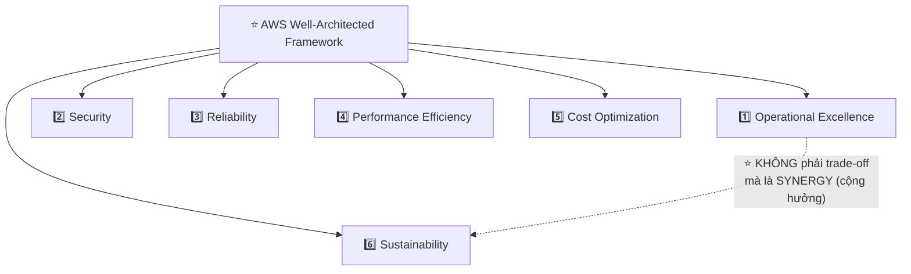
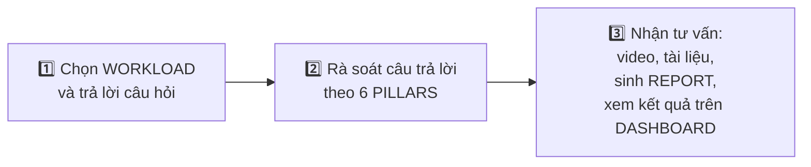
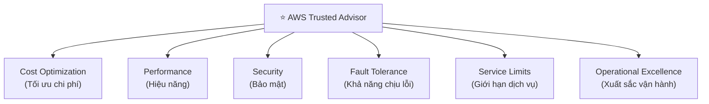
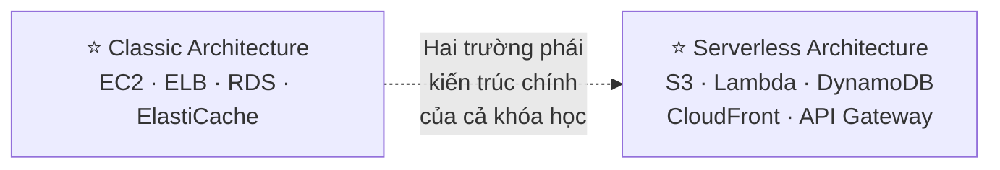

# Phần 31 — WhitePapers and Architectures

> Khóa học: *Ultimate AWS Certified Solutions Architect Associate 2026* (Stéphane Maarek) — SAA-C03
> Nguồn tham chiếu: `AWS Certified Solutions Architect Slides v48.pdf` (phần "White Papers & Architectures" — trang 852–858)

---

## Mục lục

| # | Bài giảng | Thời lượng | Loại |
|---|-----------|-----------|------|
| 382 | [WhitePaper Section Introduction](#382-whitepaper-section-introduction) | 1 phút | Video |
| 383 | [AWS Well-Architected Framework & Well-Architected Tool](#383-aws-well-architected-framework--well-architected-tool) | 6 phút | Video |
| 384 | [AWS Trusted Advisor Overview + Hands-On](#384-aws-trusted-advisor-overview--hands-on) | 3 phút | Video |
| 385 | [Examples of Architecture - AWS Certified Solutions Architect Associate](#385-examples-of-architecture---aws-certified-solutions-architect-associate) | 4 phút | Video |
| — | [Trắc nghiệm 28: WhitePapers & Architectures Quiz](#trắc-nghiệm-28-whitepapers--architectures-quiz) | — | Quiz |

---

> 📌 **Đọc trước khi vào chương:** Đây là **chương NGẮN NHẤT của cả khóa học** (chỉ 7 trang slide), nhưng nội dung của nó — **AWS Well-Architected Framework** — là **KHUNG TƯ DUY NỀN TẢNG** mà toàn bộ 30 chương trước đó **ngầm tuân theo**. Nói cách khác: **mọi "mẹo thi", mọi bảng so sánh dịch vụ bạn đã học đều là các ví dụ CỤ THỂ của 6 PILLAR trong chương này.**
>
> ⭐⭐⭐ **Đây cũng là chương DỄ ĂN ĐIỂM NHẤT:** câu hỏi về Well-Architected Framework và Trusted Advisor trong đề SAA-C03 thường **chỉ cần nhận diện tên pillar hoặc tên category** — không đòi hỏi kiến thức kỹ thuật sâu.

---

## 382. WhitePaper Section Introduction

### ⭐⭐ Section Overview — 5 tài nguyên chính thức của AWS

- ⭐⭐⭐ **Well Architected Framework Whitepaper**
- ⭐⭐⭐ **Well Architected Tool**
- ⭐⭐⭐ **AWS Trusted Advisor**
- ⭐⭐ **Reference architectures resources (cho các trường hợp THỰC TẾ — real-world)**
- ⭐⭐ **Disaster Recovery on AWS Whitepaper**

> ⭐⭐⭐ **Đây là "mục lục" của cả chương** — 5 gạch đầu dòng trên ánh xạ trực tiếp vào 4 bài giảng: bài 383 giải thích **hai mục đầu**, bài 384 giải thích **AWS Trusted Advisor**, bài 385 giải thích **reference architectures**. Riêng **"Disaster Recovery on AWS Whitepaper"** chính là tài liệu PDF đính kèm bài 351 (chương 28) — không có bài giảng riêng ở đây, chỉ được liệt kê như một tài nguyên tham khảo.

---

## 383. AWS Well-Architected Framework & Well-Architected Tool

### ⭐⭐⭐ Well Architected Framework — General Guiding Principles

> 📎 Link chính thức: **https://aws.amazon.com/architecture/well-architected**

**8 nguyên tắc định hướng chung (General Guiding Principles):**

| Nguyên tắc |
|---|
| ⭐⭐⭐ **Stop guessing your capacity needs** — Ngừng ĐOÁN nhu cầu năng lực |
| ⭐⭐⭐ **Test systems at production scale** — Test hệ thống Ở QUY MÔ PRODUCTION |
| ⭐⭐⭐ **Automate to make architectural experimentation easier** — TỰ ĐỘNG HÓA để thử nghiệm kiến trúc dễ dàng hơn |
| ⭐⭐⭐ **Allow for evolutionary architectures** — Cho phép kiến trúc TIẾN HÓA |
| ⭐⭐⭐ **Design based on changing requirements** — THIẾT KẾ dựa trên yêu cầu THAY ĐỔI |
| ⭐⭐⭐ **Drive architectures using data** — DẪN DẮT kiến trúc bằng DỮ LIỆU |
| ⭐⭐⭐ **Improve through game days** — CẢI THIỆN qua "GAME DAYS" |
| ⭐⭐⭐ **Simulate applications for flash sale days** — MÔ PHỎNG ứng dụng cho ngày FLASH SALE |

> ⭐⭐⭐ **Hai nguyên tắc dễ ra thi nhất:**
> - **"Stop guessing capacity"** → chính là lý do **Auto Scaling Group** tồn tại (chương 8) — thay vì đoán cần bao nhiêu server, để hệ thống **TỰ CO GIÃN** theo tải thật
> - **"Game days"** → mô phỏng sự cố CÓ CHỦ ĐÍCH để kiểm tra khả năng chịu lỗi — đây chính là tinh thần **Chaos Engineering** ("simian-army" của Netflix) đã nhắc ở chương 28 (bài 351)
>
> 💡 **"Flash sale days"** là ví dụ cho việc cần kiến trúc **scale đột biến** — liên hệ trực tiếp tới **Elastic Load Balancing + Auto Scaling** (chương 8) và **Serverless (Lambda/DynamoDB)** đã học xuyên suốt khóa học.

---

### ⭐⭐⭐⭐ Well Architected Framework — 6 PILLARS (BẢNG QUAN TRỌNG NHẤT CỦA CẢ CHƯƠNG)

| # | Pillar | Câu hỏi cốt lõi |
|---|---|---|
| ⭐⭐⭐ **1** | **Operational Excellence** (Sự xuất sắc trong vận hành) | *"Hệ thống có VẬN HÀNH, GIÁM SÁT và CẢI TIẾN liên tục được không?"* |
| ⭐⭐⭐ **2** | **Security** (Bảo mật) | *"Dữ liệu và hệ thống có được BẢO VỆ đúng cách không?"* |
| ⭐⭐⭐ **3** | **Reliability** (Độ tin cậy) | *"Hệ thống có PHỤC HỒI được từ lỗi và đáp ứng nhu cầu không?"* |
| ⭐⭐⭐ **4** | **Performance Efficiency** (Hiệu năng) | *"Tài nguyên có được dùng HIỆU QUẢ để đáp ứng yêu cầu hệ thống không?"* |
| ⭐⭐⭐ **5** | **Cost Optimization** (Tối ưu chi phí) | *"Có đang TRÁNH được chi phí KHÔNG CẦN THIẾT không?"* |
| ⭐⭐⭐ **6** | **Sustainability** (Tính bền vững) | *"Có đang GIẢM THIỂU tác động MÔI TRƯỜNG không?"* |

> ⚠️⭐⭐⭐ **CÂU CHỐT QUAN TRỌNG NHẤT CỦA CẢ BÀI — NGUYÊN VĂN TỪ SLIDE:**
> **"They are NOT something to balance, or trade-offs, they're a SYNERGY."**
> **(Chúng KHÔNG PHẢI thứ cần CÂN BẰNG hay ĐÁNH ĐỔI — chúng là một sự CỘNG HƯỞNG.)**
>
> Đây là điểm **RẤT DỄ HIỂU SAI**: nhiều người nghĩ 6 pillar **xung đột nhau** (ví dụ "bảo mật hơn thì chậm hơn", "rẻ hơn thì kém tin cậy hơn") và phải **đánh đổi**. Nhưng AWS khẳng định: **một kiến trúc TỐT THỰC SỰ sẽ cải thiện ĐỒNG THỜI cả 6 pillar** — ví dụ Auto Scaling vừa tăng **Reliability**, vừa tăng **Performance**, vừa tăng **Cost Optimization** (không trả tiền dư thừa), cùng lúc.
>
> ⭐⭐⭐ **Từ khóa nhận diện Sustainability (pillar thứ 6 — MỚI so với các phiên bản Well-Architected cũ hơn):** đề thi hỏi *"pillar nào liên quan tới TÁC ĐỘNG MÔI TRƯỜNG/carbon footprint"* → **Sustainability**.
>
> 💡 **Mẹo nhớ thứ tự 6 pillar:** **"O-S-R-P-C-S"** — **O**perational Excellence, **S**ecurity, **R**eliability, **P**erformance Efficiency, **C**ost Optimization, **S**ustainability.

---

### ⭐⭐⭐ AWS Well-Architected Tool

- ⭐⭐⭐ **Công cụ MIỄN PHÍ để RÀ SOÁT kiến trúc của bạn THEO 6 PILLAR của Well-Architected Framework và ÁP DỤNG các best practice kiến trúc**

**⭐⭐⭐ Cách hoạt động (3 bước):**

| Bước | Chi tiết |
|---|---|
| ⭐⭐⭐ **1. Select your workload and answer questions** | Chọn KHỐI LƯỢNG CÔNG VIỆC (workload) và TRẢ LỜI câu hỏi |
| ⭐⭐⭐ **2. Review your answers against the 6 pillars** | RÀ SOÁT câu trả lời SO VỚI 6 pillar |
| ⭐⭐⭐ **3. Obtain advice** | Nhận **video và tài liệu**, SINH BÁO CÁO (report), xem KẾT QUẢ trên DASHBOARD |

> 📎 Console: **https://console.aws.amazon.com/wellarchitected**

> ⭐⭐⭐ **Câu định vị PHẢI THUỘC:** **"Well-Architected Tool = công cụ TỰ ĐÁNH GIÁ kiến trúc CỦA BẠN bằng bảng câu hỏi (questionnaire), miễn phí, dựa trên 6 pillar."**
>
> ⭐⭐⭐ **Từ khóa nhận diện:** *"đánh giá kiến trúc hiện có so với best practice của AWS, miễn phí, dựa trên câu hỏi"* → **AWS Well-Architected Tool**. Đừng nhầm với **Trusted Advisor** (bài 384) — hai công cụ **RẤT DỄ NHẦM**, xem bảng so sánh ở cuối bài 384.

---

## 384. AWS Trusted Advisor Overview + Hands-On

### ⭐⭐⭐ Trusted Advisor

- ⭐⭐⭐ **KHÔNG CẦN cài đặt BẤT KỲ THỨ GÌ — đánh giá TÀI KHOẢN AWS Ở MỨC CAO (high level)**
- ⭐⭐⭐ **PHÂN TÍCH tài khoản AWS của bạn và đưa ra KHUYẾN NGHỊ trên 6 DANH MỤC:**

| # | Category |
|---|---|
| ⭐⭐⭐ **1** | **Cost optimization** |
| ⭐⭐⭐ **2** | **Performance** |
| ⭐⭐⭐ **3** | **Security** |
| ⭐⭐⭐ **4** | **Fault tolerance** |
| ⭐⭐⭐ **5** | **Service limits** |
| ⭐⭐⭐ **6** | **Operational Excellence** |

**⭐⭐⭐ Hai tính năng chỉ có ở gói support cao:**

| Gói yêu cầu | Tính năng |
|---|---|
| ⚠️⭐⭐⭐ **Business & Enterprise Support plan** | **Full Set of Checks** (bộ kiểm tra ĐẦY ĐỦ) **Programmatic Access dùng AWS Support API** (truy cập bằng lập trình) |

> ⭐⭐⭐ **ĐÂY LÀ ĐIỂM RA THI QUAN TRỌNG NHẤT CỦA BÀI NÀY:**
>
> - ⭐⭐⭐ **Gói Basic/Developer Support**: chỉ thấy **một SỐ ÍT check CỐ ĐỊNH** (thường là **7 core checks miễn phí**, chủ yếu về Security và Service Limits) — **KHÔNG có Full Set of Checks**
> - ⭐⭐⭐ **CHỈ Business và Enterprise Support plan** mới mở khóa **ĐẦY ĐỦ tất cả check trên 6 category**, và **CHỈ hai gói này** mới gọi được qua **AWS Support API**
>
> **Câu hỏi thi điển hình:** *"Công ty muốn dùng Trusted Advisor API để tự động hóa việc kiểm tra tài khoản, cần gói support nào?"* → **Business hoặc Enterprise Support** (Basic/Developer **KHÔNG đủ**).

---

### ⭐⭐⭐ Well-Architected Tool vs. Trusted Advisor — SO SÁNH TRỰC TIẾP (KHÔNG có trên slide, nhưng BẮT BUỘC phải phân biệt được)

| | ⭐⭐⭐ **Well-Architected Tool** | ⭐⭐⭐ **Trusted Advisor** |
|---|---|---|
| **Cách đánh giá** | ⭐⭐⭐ **Trả lời BẢNG CÂU HỎI (questionnaire) do CON NGƯỜI điền** | ⭐⭐⭐ **TỰ ĐỘNG QUÉT tài khoản** (không cần con người mô tả kiến trúc) |
| **Phạm vi** | **MỘT WORKLOAD cụ thể** (bạn chọn để đánh giá) | ⭐⭐⭐ **TOÀN BỘ tài khoản AWS** |
| **Chi phí** | ⭐⭐⭐ **LUÔN LUÔN MIỄN PHÍ** | ⭐⭐⭐ **Check cơ bản miễn phí; FULL checks cần Business/Enterprise Support** |
| **Đầu ra** | Report, video, tài liệu theo **6 pillar** | Khuyến nghị theo **6 category** (gần giống nhưng KHÔNG hoàn toàn trùng 6 pillar — có "Service Limits" thay vì "Sustainability") |
| **Cần cài đặt gì không** | Cần **NHẬP THÔNG TIN thủ công** về workload | ⚠️⭐⭐⭐ **KHÔNG CẦN CÀI GÌ** — tự phân tích tài khoản có sẵn |

> ⭐⭐⭐ **Mẹo phân biệt nhanh trong phòng thi:**
> - Đề nói **"trả lời bảng câu hỏi về kiến trúc, đánh giá theo 6 pillar"** → **Well-Architected Tool**
> - Đề nói **"tự động quét tài khoản, không cần làm gì, cần Business Support để có đầy đủ checks"** → **Trusted Advisor**
>
> ⚠️ **6 category của Trusted Advisor KHÔNG GIỐNG HỆT 6 pillar của Well-Architected Framework** — Trusted Advisor có **"Service Limits"** (không có trong 6 pillar) và **KHÔNG có "Sustainability"** (có trong 6 pillar). Đừng nhầm lẫn hai danh sách này khi làm bài.

---

## 385. Examples of Architecture - AWS Certified Solutions Architect Associate

### ⭐⭐⭐ More Architecture Examples — Tổng kết TOÀN BỘ khóa học

- ⭐⭐⭐ **Chúng ta đã khám phá các PATTERN KIẾN TRÚC quan trọng nhất:**

| Nhóm kiến trúc | Dịch vụ tiêu biểu |
|---|---|
| ⭐⭐⭐ **Classic** | **EC2, ELB, RDS, ElastiCache, v.v…** |
| ⭐⭐⭐ **Serverless** | **S3, Lambda, DynamoDB, CloudFront, API Gateway, v.v…** |

**Nếu muốn xem THÊM kiến trúc AWS:** ⭐⭐

- 📎 **https://aws.amazon.com/architecture/** — Thư viện kiến trúc tham khảo chính thức
- 📎 **https://aws.amazon.com/solutions/** — Thư viện giải pháp (AWS Solutions — giống "Instance Scheduler on AWS" đã học ở chương 30, bài 381)

> ⭐⭐⭐ **Đây là slide TỔNG KẾT toàn bộ hành trình học SAA-C03** — nó đúc kết **31 chương đã học** thành **HAI TRƯỜNG PHÁI kiến trúc lớn**:
>
> - **Classic (chương 5–11)**: EC2 + Load Balancer + RDS + cache — kiến trúc **truyền thống**, bạn **quản lý server**
> - **Serverless (chương 12, 19, 20)**: S3 + Lambda + DynamoDB + CloudFront + API Gateway — kiến trúc **hiện đại**, AWS **quản lý hạ tầng**
>
> ⭐⭐⭐ **Bài học phương pháp luận quan trọng nhất:** SAA-C03 **không kiểm tra bạn nhớ một kiến trúc cố định** — nó kiểm tra khả năng **KẾT HỢP ĐÚNG dịch vụ từ CẢ HAI trường phái** để giải quyết một bài toán cụ thể (giống các "solutions architecture discussions" đã học ở chương 11, 20).

---

## 🧭 Cheat Sheet toàn chương ⭐⭐⭐

| Từ khóa trong đề | Đáp án |
|---|---|
| *"ngừng đoán nhu cầu năng lực, để hệ thống tự co giãn"* | **Well-Architected — "Stop guessing your capacity needs"** → liên hệ **Auto Scaling** |
| *"mô phỏng sự cố có chủ đích để kiểm tra chịu lỗi"* | **Well-Architected — "Improve through game days"** → **Chaos Engineering** |
| ⭐⭐⭐ *"6 pillar của Well-Architected Framework"* | **Operational Excellence, Security, Reliability, Performance Efficiency, Cost Optimization, Sustainability** |
| ⚠️⭐⭐⭐ *"6 pillar có đánh đổi nhau không"* | ❌ **KHÔNG — chúng là SYNERGY (cộng hưởng), không phải trade-off** |
| *"pillar nào về tác động môi trường"* | **Sustainability** |
| *"công cụ miễn phí, trả lời câu hỏi để đánh giá MỘT workload theo 6 pillar"* | **AWS Well-Architected Tool** |
| *"tự động quét TOÀN BỘ tài khoản, không cần cài gì"* | **AWS Trusted Advisor** |
| ⭐⭐⭐ *"6 category của Trusted Advisor"* | **Cost Optimization, Performance, Security, Fault Tolerance, Service Limits, Operational Excellence** |
| ⭐⭐ *"cần Full Set of Checks + Support API của Trusted Advisor"* | **Business hoặc Enterprise Support plan** |
| *"thư viện kiến trúc tham khảo chính thức của AWS"* | **aws.amazon.com/architecture** |
| *"thư viện giải pháp dựng sẵn của AWS"* | **aws.amazon.com/solutions** |
| *"hai trường phái kiến trúc chính của khóa học"* | **Classic (EC2/ELB/RDS) và Serverless (S3/Lambda/DynamoDB)** |

---

## Trắc nghiệm 28: WhitePapers & Architectures Quiz

### Các điểm dễ bị bẫy

| Câu hỏi thường gặp | Đáp án đúng | Vì sao đáp án khác sai |
|---|---|---|
| 6 pillar của Well-Architected Framework? | ⭐⭐⭐ **Operational Excellence, Security, Reliability, Performance Efficiency, Cost Optimization, Sustainability** | |
| 6 pillar có phải trade-off không? | ❌⭐⭐⭐ **KHÔNG — là SYNERGY (cộng hưởng)** | Đây là câu quan trọng nhất của cả chương |
| Pillar nào là MỚI NHẤT (bổ sung sau)? | ⭐⭐ **Sustainability** | Liên quan tới môi trường/carbon footprint |
| Well-Architected Tool có tốn phí không? | ❌⭐⭐⭐ **KHÔNG — LUÔN MIỄN PHÍ** | |
| Well-Architected Tool đánh giá thế nào? | **Trả lời bảng câu hỏi (questionnaire) về MỘT workload cụ thể** | |
| Trusted Advisor cần cài đặt gì không? | ❌⭐⭐⭐ **KHÔNG — high level account assessment tự động** | |
| Trusted Advisor phân tích theo mấy category? | ⭐⭐⭐ **6: Cost optimization, Performance, Security, Fault tolerance, Service limits, Operational Excellence** | |
| Trusted Advisor 6 category có giống 6 pillar Well-Architected không? | ⚠️⭐⭐⭐ **KHÔNG HOÀN TOÀN** — Trusted Advisor có "Service Limits" (WAF không có), WAF có "Sustainability" (Trusted Advisor không có) | |
| Full Set of Checks của Trusted Advisor cần gói support nào? | ⭐⭐⭐ **Business hoặc Enterprise Support plan** | Basic/Developer chỉ có check cơ bản |
| Truy cập Trusted Advisor bằng API cần gói nào? | ⭐⭐⭐ **Business hoặc Enterprise Support** (AWS Support API) | |
| Phân biệt Well-Architected Tool và Trusted Advisor? | **WAT = trả lời câu hỏi cho MỘT workload; Trusted Advisor = tự động quét TOÀN TÀI KHOẢN** | |
| Hai trường phái kiến trúc chính đã học trong khóa? | ⭐⭐⭐ **Classic (EC2, ELB, RDS, ElastiCache) và Serverless (S3, Lambda, DynamoDB, CloudFront, API Gateway)** | |
| Xem thêm kiến trúc tham khảo AWS ở đâu? | **aws.amazon.com/architecture và aws.amazon.com/solutions** | |

---

### Checklist tự kiểm tra trước khi làm quiz

- [ ] ⭐⭐⭐ Thuộc lòng **6 pillar theo đúng thứ tự**: Operational Excellence → Security → Reliability → Performance Efficiency → Cost Optimization → Sustainability
- [ ] ⭐⭐⭐ Nhớ câu chốt: **"NOT trade-offs, they're a SYNERGY"**
- [ ] Nhớ **8 General Guiding Principles**, đặc biệt **"stop guessing capacity"** và **"game days"**
- [ ] ⭐⭐⭐ Phân biệt **Well-Architected Tool (câu hỏi, một workload, luôn miễn phí)** vs **Trusted Advisor (tự động quét, toàn tài khoản, full checks cần Business/Enterprise Support)**
- [ ] Thuộc **6 category của Trusted Advisor** và nhớ nó **KHÁC** 6 pillar của Well-Architected (có Service Limits, không có Sustainability)
- [ ] Nhớ **Business/Enterprise Support** là điều kiện để có **Full Set of Checks** và **Support API**
- [ ] Nhớ hai trường phái kiến trúc tổng kết: **Classic** và **Serverless**

---

## Thuật ngữ Anh — Việt

| Tiếng Anh | Tiếng Việt |
|---|---|
| Well-Architected Framework | Khung kiến trúc chuẩn của AWS |
| Well-Architected Tool | Công cụ tự đánh giá kiến trúc |
| Guiding Principles | Các nguyên tắc định hướng |
| Stop guessing capacity needs | Ngừng đoán nhu cầu năng lực |
| Test at production scale | Kiểm thử ở quy mô thực tế |
| Architectural experimentation | Thử nghiệm kiến trúc |
| Evolutionary architectures | Kiến trúc có khả năng tiến hóa |
| Changing requirements | Yêu cầu thay đổi theo thời gian |
| Drive architectures using data | Dẫn dắt kiến trúc bằng dữ liệu |
| Game days | Ngày diễn tập mô phỏng sự cố |
| Flash sale days | Ngày bán hàng chớp nhoáng, tải đột biến |
| Pillar | Trụ cột (của framework) |
| Operational Excellence | Sự xuất sắc trong vận hành |
| Reliability | Độ tin cậy |
| Performance Efficiency | Hiệu năng sử dụng tài nguyên |
| Cost Optimization | Tối ưu hóa chi phí |
| Sustainability | Tính bền vững (môi trường) |
| Trade-off | Sự đánh đổi giữa các yếu tố |
| Synergy | Sự cộng hưởng, tác động qua lại tích cực |
| Workload | Khối lượng công việc/hệ thống đang vận hành |
| Questionnaire | Bảng câu hỏi khảo sát |
| Best practices | Thực hành tốt nhất |
| Dashboard | Bảng điều khiển trực quan |
| AWS Trusted Advisor | Công cụ tư vấn tự động của AWS |
| High level account assessment | Đánh giá tổng quan tài khoản |
| Fault tolerance | Khả năng chịu lỗi |
| Service limits | Giới hạn của dịch vụ |
| Business & Enterprise Support plan | Gói hỗ trợ doanh nghiệp và cao cấp |
| Full Set of Checks | Bộ kiểm tra đầy đủ |
| Programmatic Access | Truy cập bằng lập trình (API) |
| AWS Support API | Giao diện lập trình của dịch vụ hỗ trợ AWS |
| Reference architectures | Kiến trúc tham khảo mẫu |
| Real-world | Tình huống thực tế |
| Disaster Recovery Whitepaper | Tài liệu trắng về khôi phục thảm họa |
| Architectural patterns | Các mẫu hình kiến trúc |
| Classic architecture | Kiến trúc truyền thống (dựa trên server) |
| Serverless architecture | Kiến trúc không cần quản lý máy chủ |
| AWS Solutions | Thư viện giải pháp dựng sẵn của AWS |

---

*Ghi chú: chương này **KHÔNG có bài Hands On thực hành nào cần tạo tài nguyên** (bài 384 có chữ "Hands-On" trong tiêu đề nhưng nội dung slide chỉ là **xem qua giao diện Trusted Advisor trên Console**, không tạo/xóa tài nguyên nào) và **không có code kèm theo**. Nguồn trích dẫn: trang 852–858 của `AWS Certified Solutions Architect Slides v48.pdf`. Trang 859 trở đi bắt đầu phần mới ("Exam Review & Tips") **không thuộc phạm vi 4 bài giảng 382–385** nên không đưa vào file này. ⚠️ **Bảng so sánh "Well-Architected Tool vs. Trusted Advisor" ở bài 384 KHÔNG xuất hiện trực tiếp trên slide** — slide trình bày hai công cụ ở hai bài riêng biệt (383 và 384). Tôi tổng hợp bảng so sánh này vì **đây chính xác là điểm đề thi SAA-C03 hay hỏi nhất về cả chương**: phân biệt "công cụ trả lời câu hỏi cho một workload" với "công cụ tự động quét toàn tài khoản". 💡 **CHI PHÍ: chương này HOÀN TOÀN MIỄN PHÍ** — Well-Architected Tool luôn miễn phí, Trusted Advisor cơ bản miễn phí cho mọi tài khoản (chỉ Full Set of Checks mới cần trả phí Business/Enterprise Support, và đó là chi phí GÓI SUPPORT chứ không phải chi phí RIÊNG của Trusted Advisor). ⭐ **Lời khuyên ôn thi:** dù chương này ngắn, **6 pillar của Well-Architected Framework là kiến thức NỀN TẢNG xuất hiện ẩn trong RẤT NHIỀU câu hỏi khác của đề thi** — mỗi khi đề mô tả một yêu cầu kiến trúc (ví dụ "giảm chi phí", "tăng độ tin cậy", "cải thiện hiệu năng"), hãy nhận ra đó chính là một trong 6 pillar đang được kiểm tra, và nhớ rằng **câu trả lời đúng thường cải thiện được NHIỀU pillar cùng lúc** — đúng với tinh thần "synergy" mà slide đã nhấn mạnh.*
