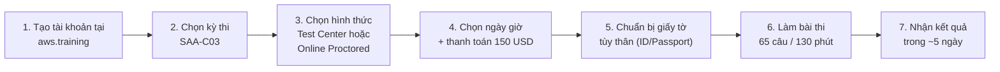
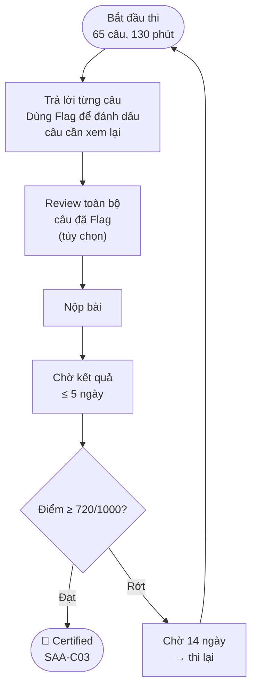

# Phần 32 — Preparing for the Exam + Practice Exam

> Khóa học: *Ultimate AWS Certified Solutions Architect Associate 2026* — Stéphane Maarek
> Nguồn: `AWS Certified Solutions Architect Slides v48.pdf`, trang 859–877 (section "Exam Review & Tips")
> Lecture: 386–393 + Practice Test 1: Practice Exam

## Mục lục

| # | Tiêu đề | Ghi chú |
|---|---|---|
| [386](#386-exam-preparation---section-introduction) | Exam Preparation – Section Introduction | |
| [387](#387-state-of-learning-checkpoint) | State of Learning Checkpoint | |
| [388](#388-exam-tips) | Exam Tips | ⭐⭐⭐ |
| [389](#389-links-to-whitepapers) | Links to Whitepapers | ⭐⭐ |
| [390](#390-exam-walkthrough-and-signup) | Exam Walkthrough and Signup | ⭐⭐ |
| [391](#391-save-50-on-your-aws-exam-cost) | Save 50% on your AWS Exam Cost! | ⭐ |
| [392](#392-get-an-extra-30-minutes-on-your-aws-exam---non-native-english-speakers-only) | Extra 30 Minutes – Non-Native English Speakers | ⭐ |
| [393](#393-how-does-the-exam-work) | How does the exam work? | ⭐⭐⭐ |
| [Practice Test 1](#practice-test-1-practice-exam) | Practice Test 1: Practice Exam | ⭐⭐⭐ |
| [Checklist](#checklist-tổng-kết-trước-khi-thi) | Checklist tổng kết trước khi thi | |
| [Thuật ngữ](#thuật-ngữ-anh--việt) | Thuật ngữ Anh – Việt | |

---

## 386. Exam Preparation - Section Introduction

Đây là phần cuối cùng của khóa học, tổng kết lại và chuẩn bị tâm lý + kỹ năng làm bài trước khi đăng ký thi **AWS Certified Solutions Architect – Associate (SAA-C03)**.

Nội dung phần này gồm 3 nhóm chính:

1. **Đánh giá tiến độ học tập** (learning checkpoint)
2. **Mẹo làm bài thi** + tài nguyên ôn tập bổ sung (whitepapers, FAQ, cộng đồng)
3. **Thông tin hậu cần kỳ thi**: đăng ký, chi phí, ưu đãi, thời gian làm bài, cách tính điểm

> ⭐ Đây không phải nội dung kỹ thuật AWS — không có dịch vụ mới nào được giới thiệu. Đây là bước "final lap" trước khi đăng ký thi thật.

---

## 387. State of Learning Checkpoint

**Tự đánh giá trước khi thi:**

- Nếu bạn **mới học AWS**, hãy luyện tập thêm (Hands-On trong khóa học) trước khi vội vàng đăng ký thi.
- AWS khuyến nghị thí sinh nên có **tối thiểu 1 năm kinh nghiệm thực tế** làm việc với AWS (không bắt buộc, chỉ là khuyến nghị).
- **"Practice makes perfect!"** — càng thực hành nhiều (Hands-On, Practice Test) càng tự tin.
- Nếu cảm thấy **quá tải kiến thức**, đừng ngại xem lại các chương đã học một lần nữa — đây là điều bình thường vì SAA-C03 bao phủ rất nhiều dịch vụ.

> 🔗 Trang chính thức của kỳ thi: https://aws.amazon.com/certification/certified-solutions-architect-associate/

**Mẹo:** Trước khi làm Practice Test, hãy tự hỏi: "Tôi có thể giải thích sự khác biệt giữa NAT Gateway và NAT Instance, giữa SQS Standard và FIFO, giữa RTO và RPO... mà không cần nhìn ghi chú không?" Nếu còn lúng túng ở các cặp khái niệm hay bị nhầm (đã liệt kê trong các bảng "Các điểm dễ bị bẫy" ở từng chương), nên ôn lại chương đó trước.

---

## 388. Exam Tips

### ⭐⭐⭐ Mẹo làm bài — "Proceed by elimination"

- Phần lớn câu hỏi trong SAA-C03 là **dạng tình huống (scenario-based)** — mô tả một bài toán kiến trúc thực tế rồi hỏi giải pháp phù hợp nhất.
- **Loại trừ trước**: với mỗi câu hỏi, loại bỏ ngay các đáp án bạn chắc chắn sai.
- Với các đáp án còn lại, chọn đáp án **hợp lý nhất** (make the most sense) — không nhất thiết phải là đáp án "đúng tuyệt đối", mà là đáp án AWS cho là **best practice** trong ngữ cảnh đó.
- **Rất ít câu hỏi đánh đố (trick questions)** — đề thi SAA-C03 không cố tình gài bẫy bằng ngôn từ khó hiểu.
- **Đừng suy nghĩ quá phức tạp** (don't over-think it).
- ⭐⭐⭐ **Quy tắc vàng**: Nếu một giải pháp nghe có vẻ khả thi nhưng **quá phức tạp/rườm rà**, nó **thường là sai**. AWS luôn ưu tiên giải pháp **đơn giản, managed, ít vận hành thủ công nhất** (managed service > tự xây dựng; serverless > quản lý server; multi-AZ managed failover > tự viết script failover…).

### Đọc FAQ của từng dịch vụ

- **FAQ = Frequently Asked Questions** — trang câu hỏi thường gặp của từng dịch vụ AWS.
- Ví dụ: https://aws.amazon.com/vpc/faqs/
- FAQ bao phủ **rất nhiều câu hỏi xuất hiện trong đề thi thật** — vì đội ngũ ra đề thường dựa vào các giới hạn/đặc điểm được ghi rõ trong FAQ chính thức.
- Đọc FAQ giúp **củng cố lại hiểu biết** về dịch vụ, đặc biệt là các con số giới hạn (limits) hay bị hỏi (ví dụ: Lambda timeout tối đa 15 phút, SQS message tối đa 256KB…).

### Tham gia cộng đồng AWS

- Tham gia mục Q&A của khóa học — đọc câu hỏi người khác hỏi, đây là nguồn ôn tập rất tốt.
- **Làm Practice Test** trong phần này của khóa học.
- Đọc forum, blog online về AWS.
- Tham gia **local meetup** AWS để trao đổi với kỹ sư AWS khác.
- Xem video **AWS re:Invent** trên YouTube (hội nghị thường niên của AWS) để hiểu sâu hơn use case thực tế.

---

## 389. Links to Whitepapers

Một số **AWS Whitepaper** đáng đọc lại trước khi thi (không bắt buộc phải đọc hết, nhưng giúp củng cố tư duy kiến trúc):

| Whitepaper | Nội dung liên quan |
|---|---|
| **Architecting for the Cloud: AWS Best Practices** | Nguyên tắc thiết kế kiến trúc tổng quát trên AWS |
| **AWS Well-Architected Framework** | 6 trụ cột thiết kế — đã học chi tiết ở [Phần 31](31-WhitePapers-and-Architectures.md) |
| **AWS Disaster Recovery** (https://aws.amazon.com/disaster-recovery/) | 4 chiến lược DR (Backup & Restore → Pilot Light → Warm Standby → Hot Site) — đã học ở [Phần 28](28-Disaster-Recovery-and-Migrations.md) |

> Về cơ bản, khóa học **đã bao phủ toàn bộ các khái niệm quan trọng nhất** trong các whitepaper này. Không có gì bắt buộc phải đọc thêm — nhưng nếu còn thời gian, đọc lướt (skim) các whitepaper bạn thấy còn mơ hồ là một khoản đầu tư tốt trước khi thi.

---

## 390. Exam Walkthrough and Signup

**Các bước đăng ký thi:**

- Đăng ký tại **https://www.aws.training/**, liên kết tới hệ thống đặt lịch thi (Pearson VUE hoặc PSI, tùy khu vực).
- Có thể thi tại **Test Center** (trung tâm khảo thí) hoặc **Online Proctored** (giám sát qua webcam tại nhà).
- Cần mang theo **1 giấy tờ tùy thân hợp lệ** (ID, hộ chiếu...) — chi tiết được ghi rõ trong email xác nhận lịch thi.
- ⭐ **Không được mang giấy note, bút, không được nói chuyện** trong phòng thi (kể cả thi online).

---

## 391. Save 50% on your AWS Exam Cost!

⭐ **Mẹo tiết kiệm chi phí thi:**

- Sau khi **thi đậu** bất kỳ chứng chỉ AWS nào (kể cả Cloud Practitioner hoặc Associate), AWS thường gửi **voucher giảm giá 50%** cho lần thi tiếp theo qua email.
- Một số chương trình khác cũng có thể cấp voucher giảm giá / miễn phí thi, ví dụ: **AWS Educate** (cho sinh viên), **AWS re/Start**, hoặc các sự kiện/hội thảo AWS (**AWS Summit**, **AWS re:Invent**) đôi khi phát voucher thi miễn phí.
- Nếu bạn dự định thi **nhiều chứng chỉ AWS** (ví dụ lộ trình Associate → Professional), hãy tận dụng voucher 50% nhận được sau mỗi lần thi đậu để tiết kiệm chi phí cho chứng chỉ kế tiếp.

> Không có voucher cụ thể nào được cấp sẵn trong khóa học này — đây là thông tin chung về cách AWS thường khuyến khích thí sinh thi thêm chứng chỉ.

---

## 392. Get an Extra 30 Minutes on your AWS Exam - Non Native English Speakers only

⭐ **Dành cho thí sinh không phải người bản ngữ tiếng Anh:**

- AWS cho phép thí sinh có tiếng Anh **không phải ngôn ngữ mẹ đẻ** đăng ký nhận thêm **30 phút** làm bài (ngoài 130 phút tiêu chuẩn → tổng **160 phút**).
- Đây gọi là **"Exam Accommodations" — ESL (English as a Second Language) accommodation**.
- Cần đăng ký **yêu cầu đặc biệt (accommodation request)** thông qua hệ thống đặt lịch thi **trước khi** xác nhận lịch thi chính thức — không thể xin thêm giờ sau khi đã vào phòng thi.
- Việc này **hoàn toàn miễn phí**, không mất thêm phí, chỉ cần xác nhận qua form yêu cầu của AWS Certification.

---

## 393. How does the exam work?

### ⭐⭐⭐ Thông tin quan trọng về kỳ thi SAA-C03

| Thông tin | Giá trị |
|---|---|
| **Số câu hỏi** | 65 câu |
| **Thời gian làm bài** | 130 phút (160 phút nếu có ESL accommodation) |
| **Lệ phí thi** | 150 USD |
| **Điểm đạt (pass)** | Tối thiểu **720 / 1000** |
| **Giấy tờ cần mang** | 1 giấy tờ tùy thân (ID, hộ chiếu…) |
| **Vật dụng cho phép** | Không note, không bút, không được nói chuyện trong phòng thi |
| **Thời gian có kết quả Pass/Fail** | Trong vòng **5 ngày** (thường nhanh hơn) |
| **Thời gian có điểm số chi tiết** | Vài ngày sau, qua email |
| **Biết đáp án đúng/sai từng câu?** | **Không** — chỉ biết điểm tổng, không biết câu nào đúng/sai |
| **Thi lại nếu rớt** | Được thi lại sau **14 ngày** |
| **Tính năng "Flag"** | Đánh dấu câu muốn xem lại, có thể **review toàn bộ câu hỏi/đáp án** trước khi nộp bài |

> ⭐ **Bẫy thi hay gặp về logistics**: Đề thi hỏi "khi nào biết kết quả" → đáp án đúng là "trong vòng 5 ngày" chứ không phải ngay lập tức. Và **không bao giờ** biết được câu nào đúng/sai cụ thể, chỉ biết điểm tổng.

---

## Practice Test 1: Practice Exam

Đây là **bài thi thử đầy đủ** (không phải video bài giảng) nằm trong chính khóa học Udemy — mô phỏng cấu trúc đề thi thật (65 câu hỏi dạng trắc nghiệm/scenario, có giới hạn thời gian).

> ⚠️ **Lưu ý quan trọng**: Nội dung câu hỏi của Practice Test **không nằm trong file slide PDF** của khóa học (đây là ngân hàng câu hỏi riêng của Udemy, được cập nhật định kỳ). Vì vậy, ghi chú này **không thể và không nên** chứa các câu hỏi/đáp án cụ thể — hãy làm bài thi thử trực tiếp trên nền tảng Udemy.

### Cách sử dụng Practice Test hiệu quả

1. **Làm bài trong điều kiện giống thi thật**: không mở tài liệu, bấm giờ đúng 130 phút, làm liên tục không nghỉ.
2. **Sau khi nộp bài**, xem lại **từng câu sai** và hiểu rõ **tại sao đáp án đúng lại đúng** — không chỉ học thuộc đáp án.
3. Với mỗi câu sai, tự hỏi: *"Tôi sai vì không biết kiến thức, hay vì hiểu nhầm đề bài, hay vì chọn đáp án phức tạp hơn mức cần thiết?"*
4. Nếu điểm dưới ~750/1000 ở lần đầu, **quay lại ôn** các chương liên quan đến nhóm câu sai nhiều nhất, rồi làm lại Practice Test sau vài ngày.
5. Có thể làm Practice Test **nhiều lần** — mục tiêu không phải là học thuộc câu hỏi, mà là **luyện phản xạ loại trừ đáp án** (xem [388. Exam Tips](#388-exam-tips)) dưới áp lực thời gian.
6. Mục tiêu tham khảo: đạt **~80%+ (tương đương 800+/1000)** ổn định qua 2 Practice Test trở lên trước khi đăng ký thi thật.

---

## Checklist tổng kết trước khi thi

- [ ] Đã hoàn thành toàn bộ 32 chương lý thuyết + Hands-On chính (EC2, S3, RDS, Lambda, VPC…)
- [ ] Có thể giải thích các cặp khái niệm hay bị nhầm: NAT Instance vs NAT Gateway, NACL vs Security Group, SQS Standard vs FIFO, Kinesis Data Streams vs Firehose, RTO vs RPO, SNS vs SQS, Aurora vs RDS, Athena vs Redshift…
- [ ] Nhớ các **con số giới hạn quan trọng**: Lambda 15 phút/10GB RAM, S3 object tối đa 5TB, SQS message 256KB, DynamoDB item 400KB, EC2 EBS snapshot incremental…
- [ ] Đã đọc lại mục **"Các điểm dễ bị bẫy"** và **"Mẹo thi"** ở cuối mỗi chương (13→31)
- [ ] Đã làm **Practice Test 1** ít nhất 1 lần, đạt điểm ổn định ≥ 750/1000
- [ ] Đã đăng ký tài khoản tại **aws.training** và biết hình thức thi (Test Center / Online Proctored)
- [ ] Nếu cần thêm giờ do không phải người bản ngữ Anh ngữ → đã gửi **yêu cầu ESL accommodation** trước khi đặt lịch
- [ ] Kiểm tra **voucher giảm giá 50%** (nếu đã từng thi chứng chỉ AWS khác)
- [ ] Chuẩn bị **giấy tờ tùy thân hợp lệ** cho ngày thi

---

## Thuật ngữ Anh — Việt

| Thuật ngữ | Nghĩa |
|---|---|
| Scenario-based question | Câu hỏi dạng tình huống thực tế |
| Proceed by elimination | Loại trừ đáp án sai trước khi chọn |
| Whitepaper | Tài liệu kỹ thuật chính thức của AWS |
| FAQ (Frequently Asked Questions) | Câu hỏi thường gặp |
| Test Center | Trung tâm khảo thí trực tiếp |
| Online Proctored | Thi trực tuyến có giám sát qua webcam |
| Accommodation request | Yêu cầu hỗ trợ đặc biệt (ví dụ thêm giờ thi) |
| ESL (English as a Second Language) | Tiếng Anh không phải ngôn ngữ mẹ đẻ |
| Pass score | Điểm đạt (720/1000 với SAA-C03) |
| Flag feature | Tính năng đánh dấu câu hỏi để xem lại |
| Retake | Thi lại |
| Voucher | Phiếu giảm giá/ưu đãi thi |

---

> **Ghi chú nguồn**: Nội dung phần 386–390 và 393 được trích trực tiếp từ slide PDF (trang 859–875). Phần **391 (Save 50%)** và **392 (Extra 30 minutes)** là các lecture dạng bài viết/article trên Udemy (không có slide PDF tương ứng) — nội dung trong ghi chú này được viết dựa trên chính sách công khai, ổn định lâu dài của AWS Certification (discount voucher sau khi thi đậu, và ESL accommodation request), không phải trích dẫn nguyên văn từ khóa học. Phần **Practice Test 1** không chứa câu hỏi/đáp án cụ thể vì ngân hàng câu hỏi thuộc về nền tảng Udemy, không nằm trong slide — hãy làm bài thi thử trực tiếp trên Udemy để có trải nghiệm chính xác nhất.
