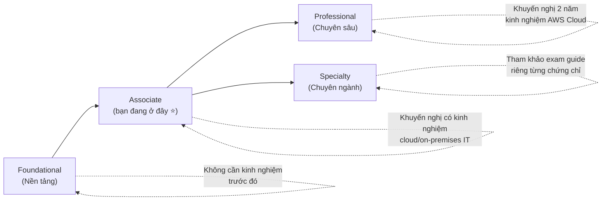

# Phần 33 — Congratulations

> Khóa học: *Ultimate AWS Certified Solutions Architect Associate 2026* — Stéphane Maarek
> Nguồn: `AWS Certified Solutions Architect Slides v48.pdf`, trang 869–877 (cuối section "Exam Review & Tips")
> Lecture: 394–396 — **Đây là chương cuối cùng của khóa học**

## Mục lục

| # | Tiêu đề | Ghi chú |
|---|---|---|
| [394](#394-aws-certification-paths) | AWS Certification Paths | ⭐⭐ |
| [395](#395-congratulations) | Congratulations | |
| [396](#396-bonus-lecture) | Bonus Lecture | |

---

## 394. AWS Certification Paths

Sau khi đạt **SAA-C03**, đây là bức tranh tổng thể về **lộ trình chứng chỉ AWS** — giúp định hướng bước tiếp theo trong sự nghiệp.

### 4 cấp độ chứng chỉ (tiers)

| Cấp độ | Mô tả | Kinh nghiệm khuyến nghị |
|---|---|---|
| **Foundational** | Chứng chỉ kiến thức nền tảng về AWS Cloud | Không cần kinh nghiệm trước |
| **Associate** | Chứng chỉ theo vai trò (role-based), thể hiện kiến thức & kỹ năng AWS, xây dựng uy tín chuyên môn | Khuyến nghị có kinh nghiệm cloud và/hoặc on-premises IT |
| **Professional** | Chứng chỉ theo vai trò, xác nhận kỹ năng nâng cao để thiết kế hệ thống bảo mật, tối ưu, hiện đại hóa và tự động hóa trên AWS | Khuyến nghị **2 năm** kinh nghiệm AWS Cloud |
| **Specialty** | Đào sâu vào một mảng cụ thể, định vị bản thân là chuyên gia tư vấn đáng tin cậy | Xem exam guide riêng của từng chứng chỉ |

> ⭐ **SAA-C03 (khóa học này) thuộc cấp độ Associate** — bước đệm tốt để tiến lên Professional (AWS Certified Solutions Architect – Professional) hoặc các chứng chỉ Specialty liên quan.

### Lộ trình theo lĩnh vực chuyên môn (career paths)

AWS tổ chức lộ trình chứng chỉ/vai trò theo **7 nhóm lĩnh vực**:

```mermaid
flowchart TD
    Root["AWS Certification<br/>Journey"]
    Root --> Arch["Architecture"]
    Root --> Ops["Operations"]
    Root --> DevOps["DevOps"]
    Root --> Sec["Security"]
    Root --> Dev["Development & Networking"]
    Root --> Data["Data Analytics & AI/ML"]

    Arch --> Arch1["Solutions Architect"]
    Arch --> Arch2["Application Architect"]

    Ops --> Ops1["Systems Administrator"]
    Ops --> Ops2["Cloud Engineer"]

    DevOps --> DO1["Test Engineer"]
    DevOps --> DO2["Cloud DevOps Engineer"]
    DevOps --> DO3["DevSecOps Engineer"]

    Sec --> Sec1["Cloud Security Engineer"]
    Sec --> Sec2["Cloud Security Architect"]

    Dev --> Dev1["Software Development Engineer"]
    Dev --> Dev2["Network Engineer"]

    Data --> Data1["Cloud Data Engineer"]
    Data --> Data2["Machine Learning Engineer"]
    Data --> Data3["Prompt Engineer"]
    Data --> Data4["Machine Learning Ops Engineer"]
    Data --> Data5["Data Scientist"]
```

| Nhóm | Vai trò tiêu biểu | Mô tả ngắn gọn |
|---|---|---|
| **Architecture** | Solutions Architect | Thiết kế, phát triển, quản lý hạ tầng & tài sản cloud; phối hợp DevOps để migrate ứng dụng lên cloud |
| | Application Architect | Thiết kế kiến trúc ứng dụng (UI, middleware, hạ tầng), đảm bảo hệ thống có khả năng scale/reliable toàn doanh nghiệp |
| **Operations** | Systems Administrator | Cài đặt, nâng cấp, bảo trì hệ thống; tích hợp quy trình tự động hóa |
| | Cloud Engineer | Triển khai & vận hành hạ tầng mạng của tổ chức, triển khai hệ thống bảo mật |
| **DevOps** | Test Engineer | Tích hợp kiểm thử & best practice chất lượng xuyên suốt vòng đời phát triển phần mềm |
| | Cloud DevOps Engineer | Thiết kế, triển khai, vận hành hạ tầng hybrid cloud quy mô lớn, thúc đẩy CI/CD tự động hóa đầu-cuối |
| | DevSecOps Engineer | Tăng tốc chuyển đổi cloud doanh nghiệp, đảm bảo giao hàng nhanh & ổn định theo nguyên tắc CI/CD |
| **Security** | Cloud Security Engineer | Thiết kế kiến trúc bảo mật máy tính, xây dựng & theo dõi hiệu quả các biện pháp bảo vệ thông tin |
| | Cloud Security Architect | Thiết kế & triển khai giải pháp cloud doanh nghiệp, áp dụng quản trị để giảm thiểu rủi ro kinh doanh/kỹ thuật |
| **Development & Networking** | Software Development Engineer | Phát triển, xây dựng, bảo trì phần mềm đa nền tảng/thiết bị |
| | Network Engineer | Thiết kế & triển khai mạng máy tính (LAN, WAN, intranet, extranet…) |
| **Data Analytics & AI/ML** | Cloud Data Engineer | Tự động hóa thu thập/xử lý dữ liệu, giám sát hiệu năng data pipeline |
| | Machine Learning Engineer | Nghiên cứu, xây dựng hệ thống AI, thiết kế mô hình/hệ thống ML |
| | Prompt Engineer | Thiết kế, kiểm thử, tinh chỉnh prompt để tối ưu hiệu năng mô hình ngôn ngữ AI |
| | Machine Learning Ops Engineer | Xây dựng & duy trì nền tảng/hạ tầng AI-ML, hỗ trợ triển khai mô hình |
| | Data Scientist | Phát triển & duy trì mô hình AI/ML giải quyết bài toán kinh doanh, huấn luyện & đánh giá mô hình |

> 🔗 Tài liệu chính thức: https://d1.awsstatic.com/training-and-certification/docs/AWS_certification_paths.pdf

> ⭐ Với vai trò **Solutions Architect**, lộ trình tự nhiên tiếp theo sau SAA-C03 (Associate) là **AWS Certified Solutions Architect – Professional (SAP-C02)**. Ngoài ra có thể bổ sung các chứng chỉ Specialty liên quan (ví dụ Security, Networking, Machine Learning) tùy định hướng nghề nghiệp.

---

## 395. Congratulations

🎉 **Chúc mừng bạn đã hoàn thành toàn bộ khóa học!**

- Chúc bạn vượt qua kỳ thi **SAA-C03** một cách suôn sẻ.
- Nếu thấy khóa học hữu ích, hãy để lại **review/đánh giá** — điều này giúp tác giả (Stéphane Maarek) rất nhiều.
- Nếu **thi đậu**, hãy chia sẻ tại mục **Q&A** của khóa học để động viên các học viên khác, cũng như chia sẻ mẹo học tập của bạn.
- Có thể **đăng lên LinkedIn** và tag tác giả để chia sẻ thành tích.
- Thông điệp tổng kết: hy vọng bạn không chỉ học được cách **sử dụng AWS**, mà sẽ trở thành một **AWS Solutions Architect giỏi** trong thực tế công việc.

---

## 396. Bonus Lecture

Đây là lecture dạng **bài viết (article)**, không phải video, không có nội dung trong slide PDF — theo thông lệ chung của các khóa học Udemy do Stéphane Maarek biên soạn, "Bonus Lecture" ở cuối khóa thường chứa:

- Lời cảm ơn học viên đã hoàn thành khóa học.
- Liên kết/mã giảm giá (coupon) tới **các khóa học khác** của tác giả (ví dụ: AWS Developer Associate, AWS SysOps Administrator, AWS Certified Solutions Architect Professional, Terraform, Kubernetes…).
- Đôi khi có liên kết mạng xã hội (LinkedIn, Twitter/X) của tác giả để theo dõi cập nhật khóa học trong tương lai.

> Vì đây là nội dung quảng bá/thương mại riêng của nền tảng Udemy (thay đổi theo thời gian, không mang tính kiến thức AWS), ghi chú này không trích dẫn nội dung cụ thể — hãy xem trực tiếp trong khóa học nếu quan tâm.

---

## Tổng kết hành trình SAA-C03

Đến đây, bộ ghi chú 33 chương (từ IAM, EC2 cho đến Exam Prep & Certification Paths) đã bao phủ toàn bộ nội dung khóa học *Ultimate AWS Certified Solutions Architect Associate 2026*. Trước khi thi thật, nên:

1. Ôn lại bảng **"Các điểm dễ bị bẫy"** và **"Checklist tự kiểm tra"** ở cuối mỗi chương.
2. Hoàn thành **Practice Test 1** (xem [Phần 32](32-Preparing-for-the-Exam-and-Practice-Exam.md)) với điểm ổn định ≥ 750/1000.
3. Đăng ký thi theo hướng dẫn ở [Phần 32 — mục 390](32-Preparing-for-the-Exam-and-Practice-Exam.md#390-exam-walkthrough-and-signup).

**Chúc bạn thi đậu AWS Certified Solutions Architect – Associate (SAA-C03)! 🎓**

---

> **Ghi chú nguồn**: Nội dung mục 394–395 trích trực tiếp từ slide PDF (trang 869–877). Mục 396 (Bonus Lecture) là lecture dạng article không có slide, nội dung mô tả dựa trên thông lệ chung của khóa học Udemy, không trích dẫn cụ thể.
